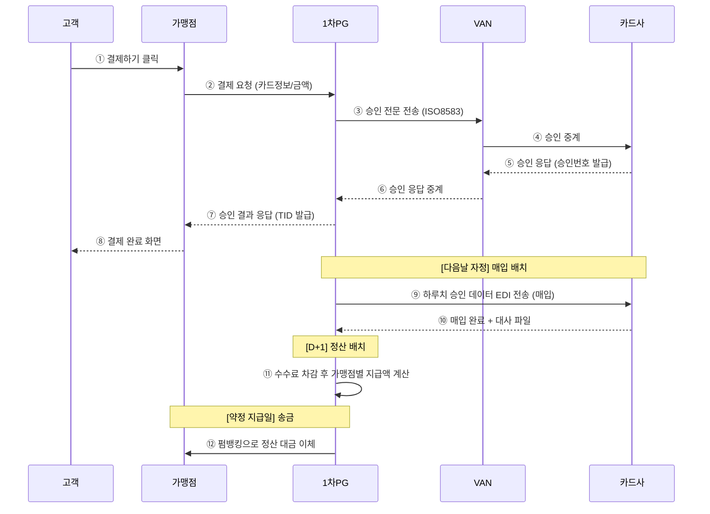
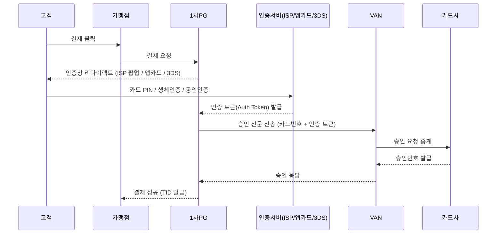
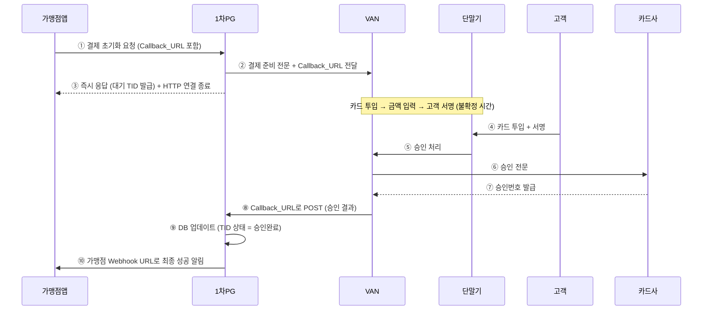
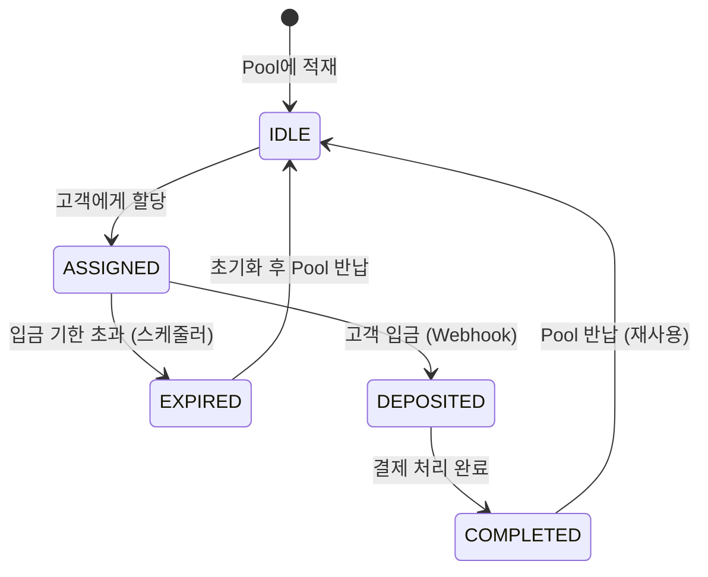
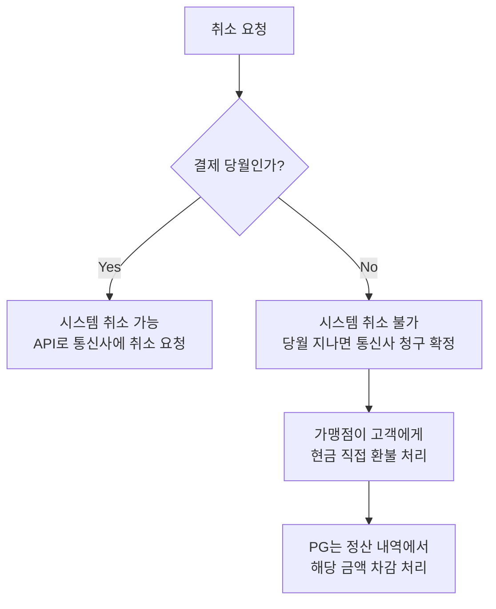
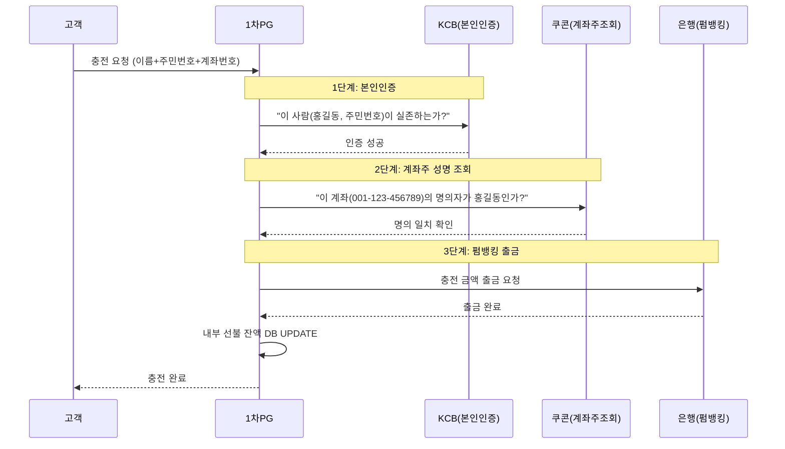
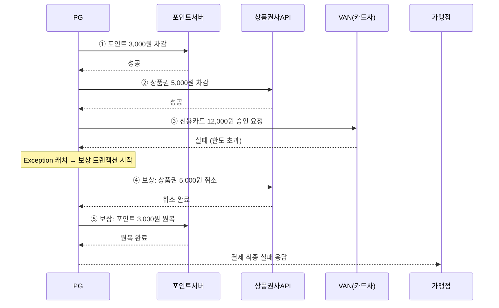
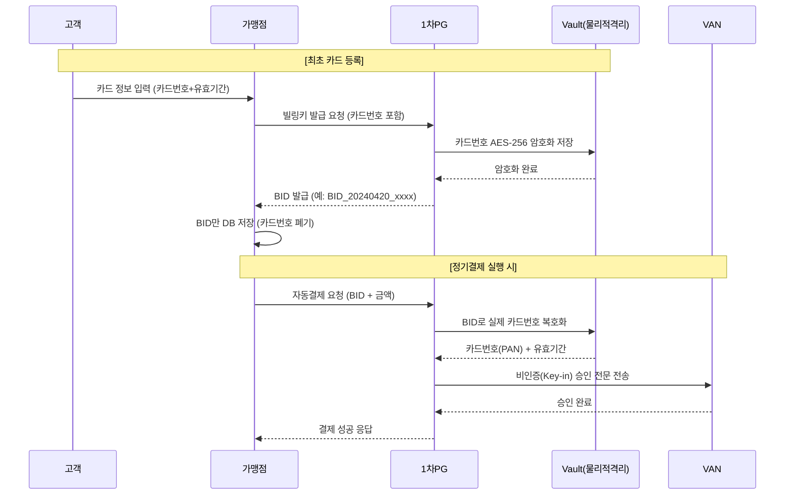
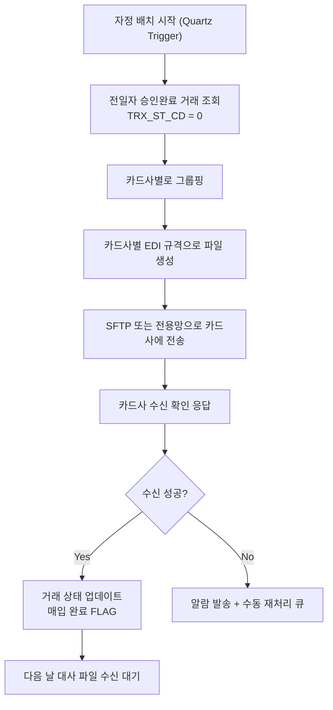
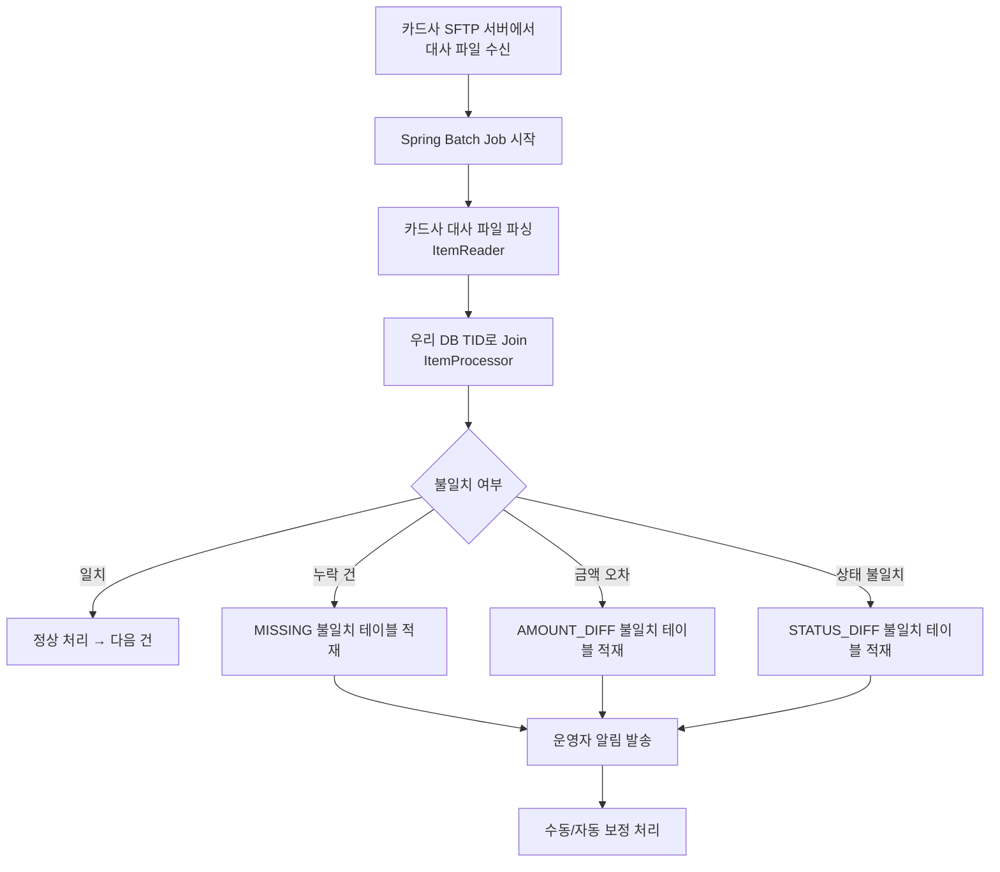

# 1차 PG 백엔드 개발자 교육 문서

> **단계별 진입 가이드**
> 
> 
> 이 문서는 PG(Payment Gateway) 도메인에 처음 입문하는 신입·주니어 백엔드 개발자를 위해 작성되었습니다.
> 입문 → 중급 → 심화 순서로 챕터가 배치되어 있으며, 각 챕터 앞에 “이 챕터에서 배울 것” 박스를 제공합니다.
> 처음부터 끝까지 순서대로 읽으면 결제 Life-Cycle 전체를 코드 레벨까지 이해할 수 있습니다.
> 

---

## 목차

- [0장. 결제 Life-Cycle 전체 조감도](about:blank#0%EC%9E%A5-%EA%B2%B0%EC%A0%9C-life-cycle-%EC%A0%84%EC%B2%B4-%EC%A1%B0%EA%B0%90%EB%8F%84-%EC%9E%85%EB%AC%B8)
- [1장. 결제의 역사와 VAN 연동 아키텍처](about:blank#1%EC%9E%A5-%EA%B2%B0%EC%A0%9C%EC%9D%98-%EC%97%AD%EC%82%AC%EC%99%80-van-%EC%97%B0%EB%8F%99-%EC%95%84%ED%82%A4%ED%85%8D%EC%B2%98-%EC%9E%85%EB%AC%B8)
- [2장. 카드사 구조와 1차 PG의 역할](about:blank#2%EC%9E%A5-%EC%B9%B4%EB%93%9C%EC%82%AC-%EA%B5%AC%EC%A1%B0%EC%99%80-1%EC%B0%A8-pg%EC%9D%98-%EC%97%AD%ED%95%A0-%EC%9E%85%EB%AC%B8)
- [3장. 10대 결제 수단 상세 연동 구조](about:blank#3%EC%9E%A5-10%EB%8C%80-%EA%B2%B0%EC%A0%9C-%EC%88%98%EB%8B%A8-%EC%83%81%EC%84%B8-%EC%97%B0%EB%8F%99-%EA%B5%AC%EC%A1%B0-%EC%A4%91%EA%B8%89)
- [4장. 대외 제공 API 설계](about:blank#4%EC%9E%A5-%EB%8C%80%EC%99%B8-%EC%A0%9C%EA%B3%B5-api-%EC%84%A4%EA%B3%84-%EC%A4%91%EA%B8%89)
- [5장. 매입 및 정산 시스템](about:blank#5%EC%9E%A5-%EB%A7%A4%EC%9E%85-%EB%B0%8F-%EC%A0%95%EC%82%B0-%EC%8B%9C%EC%8A%A4%ED%85%9C-%EC%8B%AC%ED%99%94)
- [6장. 시스템 아키텍처](about:blank#6%EC%9E%A5-%EC%8B%9C%EC%8A%A4%ED%85%9C-%EC%95%84%ED%82%A4%ED%85%8D%EC%B2%98-%EC%8B%AC%ED%99%94)
- [7장. 리스크 관리 및 보안](about:blank#7%EC%9E%A5-%EB%A6%AC%EC%8A%A4%ED%81%AC-%EA%B4%80%EB%A6%AC-%EB%B0%8F-%EB%B3%B4%EC%95%88-%EC%8B%AC%ED%99%94)
- [8장. 주요 약어 및 ID 사전](about:blank#8%EC%9E%A5-%EC%A3%BC%EC%9A%94-%EC%95%BD%EC%96%B4-%EB%B0%8F-id-%EC%82%AC%EC%A0%84)

---

## 0장. 결제 Life-Cycle 전체 조감도 [입문]

> **이 챕터에서 배울 것**
> 
> - 고객이 ’결제하기’를 누른 순간부터 가맹점 계좌에 돈이 들어오기까지의 전체 흐름
> - 각 단계의 이름(승인/매입/정산/송금)과 그 의미
> - “승인이 됐는데 왜 돈은 아직 안 왔어요?”라는 가맹점 문의에 답할 수 있는 기초 지식

### 0.1 결제의 5단계

결제는 단 한 번의 동작이 아닙니다. 고객이 버튼을 누른 그 순간부터 가맹점 계좌에 실제 돈이 들어오기까지, **최소 5개의 독립적인 단계**가 순차적으로 진행됩니다. 이 흐름을 모르면 “왜 취소했는데 환불이 안 오나요?”, “왜 정산이 늦나요?” 같은 민원에 대응하기 어렵습니다.

| 단계 | 명칭 | 한 줄 설명 | 돈 이동 여부 |
| --- | --- | --- | --- |
| 1 | **결제(Payment)** | 고객이 결제창에서 수단 정보를 입력하고 ‘결제하기’ 클릭 | 없음 |
| 2 | **승인(Authorization)** | 1차 PG가 원천망(카드사/은행)으로 전문을 보내 결제 가능 여부 확인 및 한도 차감 | **없음** (한도만 차감) |
| 3 | **매입(Capture)** | 하루치 승인 데이터를 모아 카드사에 확정 청구 | 카드사 → PG 정산 예정 |
| 4 | **정산(Settlement)** | 수수료를 차감하고 하위 가맹점별 지급액 계산 | 내부 계산 |
| 5 | **송금(Remittance)** | 계산된 정산 대금을 실제 은행 계좌로 이체 | **실제 이동** |

> **중요:** 승인(Authorization) 단계에서는 **돈이 이동하지 않습니다.** 카드사가 “이 카드는 한도가 있고 사용 가능합니다”라고 확인하고 해당 금액만큼 한도를 일시 차감(홀드)하는 것입니다. 실제 돈은 매입(Capture) 이후부터 움직이기 시작합니다. 이 차이를 명확히 이해하는 것이 PG 개발의 출발점입니다.
> 

### 0.2 전체 흐름 다이어그램



### 0.3 왜 이렇게 복잡한가?

단순하게 생각하면 “카드 긁으면 바로 돈 이동하면 되는 것 아닌가?”라는 의문이 생깁니다.

현실에서는 여러 이유로 즉시 이동이 불가능합니다.

- **부정 거래 방어:** 승인 후 실제 청구까지 시간차를 두어야 도난카드, 분쟁 거래 등을 걸러낼 수 있습니다.
- **배치 효율:** 건별 송금은 금융망 수수료가 과도합니다. 하루치를 모아 1번에 청구하는 것이 효율적입니다.
- **법적 요건:** 여신전문금융업법상 카드사는 가맹점에 대한 대금 지급 의무가 있으나, 이의제기 기간을 보장해야 합니다.

---

## 1장. 결제의 역사와 VAN 연동 아키텍처 [입문]

> **이 챕터에서 배울 것**
> 
> - 압인기 시대의 아날로그 결제가 왜 문제였는지
> - VAN(부가통신망)이 무엇이고 왜 생겼는지
> - ISO8583 전문(電文) 구조가 어떻게 생겼는지 (MTI, 비트맵, 필드)
> - 국내 주요 VAN사 목록과 Multi-VAN 라우팅, 서킷 브레이커 패턴

### 1.1 압인기 시대부터 전산화까지

### 과거: 압인기(임프린터, Imprinter) 시대

전산화 이전, 카드 결제는 다음과 같이 이루어졌습니다.

1. 가맹점 직원이 카드를 압인기 위에 올려놓고 롤러로 밀어 카드 정보를 3장짜리 복사 영수증에 찍습니다.
2. 고객용 1장, 가맹점용 1장, 매입용 1장으로 분리합니다.
3. 가맹점주가 매입용 영수증 묶음을 들고 **직접 은행을 방문**하여 대금을 청구합니다.

**이 방식의 치명적 문제점:**

| 문제 | 내용 |
| --- | --- |
| 한도 초과 감지 불가 | 카드사와 실시간 연결이 없으므로 한도를 이미 초과한 카드로도 결제 가능 |
| 도난 카드 감지 불가 | 분실/도난 신고된 카드인지 즉시 확인할 수 없음 |
| 정산 지연 | 영수증을 은행에 제출하고 대금을 받기까지 수 주일 소요 |
| 위변조 위험 | 종이 영수증은 금액 조작이 가능 |

### 현재: VAN을 통한 실시간 전산화

```
[카드 IC/마그네틱]
        ↓
[단말기 or PG 서버]  ──ISO8583 전문 (TCP/IP 소켓)──→  [VAN사]  ───→  [카드사]
        ↑                                                                    ↓
[가맹점/고객]  ←────────── 승인번호 + 결과 ─────────────────────────────────┘
```

- **VAN (Value Added Network: 부가통신망)** — 카드사와 가맹점(또는 PG) 사이에서 결제 전문 데이터를 중계하는 중간 네트워크 사업자. 각 카드사와의 연동 규격 차이를 흡수하여 표준화된 인터페이스를 제공합니다.
- **1차 PG** — 물리적 단말기 없이 서버 레벨에서 VAN과 통신하는 **가상 단말기**. 수많은 온라인 가맹점을 대신하여 VAN/카드사와 통신합니다.

> **설계 배경 (Why):** 온라인 쇼핑몰이 9개 카드사와 각각 직접 계약하고 각기 다른 연동 규격을 개발해야 한다면, 중소 쇼핑몰은 진입 자체가 불가능합니다. VAN이 이 복잡성을 한 곳에서 흡수하고, 1차 PG가 VAN과의 연동을 대행함으로써 가맹점은 PG API 하나만 연동하면 됩니다.
> 

### 1.2 VAN의 역할과 국내 주요 VAN사

### VAN의 핵심 역할

1. **전문 중계:** 가맹점/PG로부터 받은 승인 전문을 해당 카드사 규격으로 변환하여 전달
2. **응답 중계:** 카드사의 승인/거절 응답을 다시 가맹점/PG에 전달
3. **망 이중화:** 카드사별 전용선을 이중으로 유지하여 안정성 확보
4. **단말기 관리:** 오프라인 단말기(CAT 단말기)에 CAT ID 발급 및 관리

### 국내 주요 VAN사 목록

| VAN사 | 특징 |
| --- | --- |
| **NICE정보통신** | 국내 최대 VAN사, 가장 넓은 카드사 커버리지 |
| **KSNET** | KG그룹 계열, 1차 PG와 결합 서비스 강점 |
| **한국정보통신(KICC)** | KT 계열, 통신 인프라 기반 안정성 |
| **스마트로(Smartro)** | 신한금융그룹 계열, 핀테크 연동 강점 |
| **KIS정보통신** | KB금융그룹 계열 |
| **다우데이타** | 다우기술 계열 |

> **실무 포인트:** 1차 PG는 보통 3~4개 VAN사와 동시에 전용망을 계약합니다. 특정 VAN이 장애를 일으켰을 때 즉시 다른 VAN으로 우회(Failover)하기 위해서입니다. 이를 **Multi-VAN 라우팅**이라 합니다.
> 

### 1.3 ISO8583 전문 구조와 TCP/IP 소켓 통신 [보강]

VAN과의 통신에서 사용하는 데이터 형식인 **ISO8583 전문(電文)**의 구조를 이해하는 것은 BLD(승인 서버) 개발의 핵심입니다.

### ISO8583이란?

**ISO8583** — 금융 거래 메시지의 국제 표준 규격. 은행 간, VAN-카드사 간 거래 데이터를 교환하기 위한 바이너리/텍스트 혼합 포맷입니다. HTTP/JSON이 아니라 **고정 길이 바이너리 전문**을 TCP/IP 소켓으로 직접 송수신합니다.

> **왜 JSON이 아닌가?** ISO8583은 1987년에 제정된 표준입니다. 당시 네트워크 대역폭이 매우 제한적이었기 때문에 최소한의 바이트로 최대한의 정보를 담는 바이너리 포맷이 선택되었습니다. 현재도 카드사/VAN사 레거시 시스템이 이 표준을 유지하고 있어 변경이 사실상 불가능합니다.
> 

### 전문 구조 3요소

ISO8583 전문은 크게 3가지 영역으로 구성됩니다.

```
┌────────────┬──────────────────────┬─────────────────────────────────────────┐
│  MTI (4)   │   Bitmap (8 or 16)   │   Data Fields (가변)                     │
│  메시지유형  │  어떤 필드가 있는지    │  실제 데이터 (카드번호, 금액, 가맹점번호...)  │
└────────────┴──────────────────────┴─────────────────────────────────────────┘
```

**1) MTI (Message Type Indicator)**

4자리 숫자로 메시지의 유형과 방향을 표현합니다.

```
0200 = 승인 요청 (Authorization Request)
0210 = 승인 응답 (Authorization Response)
0400 = 취소 요청 (Reversal Request)
0410 = 취소 응답 (Reversal Response)
0800 = 망 관리 요청 (Network Management Request, Keep-Alive)
0810 = 망 관리 응답
```

각 자리의 의미:
- **1번째 자리 (버전):** 0=ISO8583-1987, 1=ISO8583-1993
- **2번째 자리 (메시지 클래스):** 2=금융 거래, 4=취소/환불, 8=망 관리
- **3번째 자리 (메시지 기능):** 0=요청, 1=응답, 2=통지
- **4번째 자리 (발신 출처):** 0=Acquirer, 1=Issuer

**2) Bitmap (비트맵)**

비트맵은 어떤 필드(Field)들이 이 메시지에 포함되어 있는지를 나타내는 64비트(1차 비트맵) 또는 128비트(2차 비트맵) 마스크입니다.

```
비트맵 예시 (16진수): F2 20 00 01 28 E0 80 10

F2 = 1111 0010
     ↑↑↑↑ ↑↑↑↑
     │││└─ Field 4 (거래금액) 존재
     ││└── Field 3 없음
     │└─── Field 2 (카드번호, PAN) 존재
     └──── Field 1 (2차 비트맵 존재 여부) 존재
```

비트가 1이면 해당 필드 번호의 데이터가 전문 뒷부분에 존재한다는 의미입니다.

**3) 주요 데이터 필드**

| 필드 번호 | 명칭 | 타입 | 길이 | 예시 |
| --- | --- | --- | --- | --- |
| F2 | PAN (Primary Account Number, 카드번호) | LLVAR | 최대 19 | 4111111111111111 |
| F3 | Processing Code (처리 코드) | N | 6 | 000000 (구매), 200000 (취소) |
| F4 | Transaction Amount (거래금액) | N | 12 | 000000010000 (10,000원) |
| F7 | Transmission Date/Time | N | 10 | 0420143022 |
| F11 | System Trace Audit Number (Stan) | N | 6 | 000001 |
| F12 | Local Transaction Time | N | 6 | 143022 |
| F13 | Local Transaction Date | N | 4 | 0420 |
| F22 | POS Entry Mode | N | 3 | 012 (키입력), 051 (IC칩) |
| F37 | Retrieval Reference Number (RRN) | AN | 12 | 가맹점 측 채번 참조번호 |
| F38 | Authorization ID Response (승인번호) | AN | 6 | 응답에만 존재 |
| F39 | Response Code (응답코드) | AN | 2 | 00=승인, 05=거절 |
| F41 | CAT ID (단말기 ID) | ANS | 8 | 오프라인 단말 식별자 |
| F42 | MID (가맹점 ID) | ANS | 15 | PG 내부 가맹점 번호 |
| F49 | Transaction Currency Code | N | 3 | 410=KRW |

**LLVAR / LLLVAR 타입:** 실제 데이터 앞에 길이를 나타내는 헤더가 붙는 가변 길이 필드입니다. `LLVAR`은 2자리 길이 헤더 + 데이터, `LLLVAR`은 3자리 길이 헤더 + 데이터입니다.

### TCP/IP 소켓 통신 구조

ISO8583은 HTTP 같은 요청-응답 프로토콜이 아니라 **영구 연결(Persistent Connection) TCP 소켓** 위에서 동작합니다.

```
[BLD 서버]  ──────────── TCP 소켓 (영구 연결) ──────────────  [VAN 서버]
              ────── 전문 길이 헤더(2~4byte) + 전문 본문 ──→
              ←──── 응답 전문 ────────────────────────────
              ────── Keep-Alive(0800) ──────────────────→  (30초마다)
              ←──── 0810 ──────────────────────────────
```

- **길이 헤더:** 전문 앞에 2~4바이트로 본문 길이를 먼저 보내는 방식. 수신 측은 이 길이만큼만 읽어야 합니다. 이를 놓치면 스트림이 오염됩니다(메시지 경계 오류).
- **Keep-Alive:** 연결이 살아있음을 주기적으로 확인하는 망 관리 메시지(0800/0810). 30초 이상 무응답 시 연결 재수립을 시도해야 합니다.
- **Netty 채택 이유:** BLD 서버는 Java Netty 프레임워크를 사용합니다. 블로킹 I/O(Java NIO 이전 방식)로는 연결 1개당 스레드 1개가 필요하여 수천 개 동시 연결 시 스레드 폭발이 발생합니다. Netty의 이벤트 루프(NIO 기반 비동기)는 소수의 스레드로 수만 개의 동시 연결을 처리할 수 있습니다.

**Java Netty 기반 ISO8583 전문 처리 개념 코드:**

```java
/**
 * VAN 전용선 소켓 연결 및 ISO8583 전문 송수신 핸들러
 * Why: Netty 이벤트 루프로 1개 스레드가 수천 VAN 연결을 비동기 처리
 */
@Slf4j
@ChannelHandler.Sharable
public class VanChannelHandler extends SimpleChannelInboundHandler<ByteBuf> {

    private final VanMessageParser vanMessageParser;
    private final ApprovalResponseProcessor responseProcessor;

    @Override
    protected void channelRead0(ChannelHandlerContext ctx, ByteBuf msg) {
        byte[] responseBytes = new byte[msg.readableBytes()];
        msg.readBytes(responseBytes);

        // ISO8583 전문 파싱: MTI → 비트맵 → 필드 추출
        VanMessage response = vanMessageParser.parse(responseBytes);

        log.info("VAN 응답 수신 - MTI: {}, F39(응답코드): {}, F38(승인번호): {}",
            response.getMti(),
            response.getField(39),
            response.getField(38));

        responseProcessor.process(response);
    }

    @Override
    public void exceptionCaught(ChannelHandlerContext ctx, Throwable cause) {
        //FIXME: VAN 연결 오류 → Circuit Breaker에 실패 카운트 전달 필요
        log.error("VAN 소켓 통신 오류 발생 - channel: {}", ctx.channel().id(), cause);
        ctx.close();
    }
}
```

### 1.4 Multi-VAN 라우팅과 서킷 브레이커 패턴 [보강]

단일 VAN사에만 의존하면 해당 VAN이 장애를 일으켰을 때 모든 결제가 중단됩니다. 이를 방지하기 위해 1차 PG는 **Multi-VAN 라우팅** 전략을 사용합니다.

### 라우팅 전략

```
┌──────────────────────────────────────────────────────────┐
│                    VAN Router                             │
│                                                          │
│  1순위: NICE정보통신 (Primary)                             │
│  2순위: KICC (Secondary)                                  │
│  3순위: 스마트로 (Tertiary)                                │
│                                                          │
│  라우팅 기준: 카드사 종류, 결제 수단, VAN 상태              │
└──────────────────────────────────────────────────────────┘
```

**라우팅 기준 요소:**
- **카드사별 전담 VAN:** 일부 카드사는 특정 VAN과만 계약이 유리한 경우가 있습니다.
- **VAN 상태(Circuit Breaker 상태):** 장애가 감지된 VAN은 라우팅에서 제외됩니다.
- **결제 수단:** 계좌이체, 가상계좌 등 카드 이외 수단은 VAN이 아닌 금융 VAN(쿠콘 등)을 사용합니다.

### 장애 감지와 Failover 발동 조건

```mermaid
flowchart TD
    A[승인 요청 수신] --> B{Primary VAN 상태 확인}
    B -->|정상| C[Primary VAN으로 전송]
    B -->|장애(OPEN)| D[Secondary VAN으로 Failover]
    C --> E{응답 수신}
    E -->|성공| F[승인 처리 완료]
    E -->|Timeout 또는 에러| G[실패 카운트 +1]
    G --> H{임계값 초과?}
    H -->|Yes| I[Circuit Breaker OPEN\n Primary VAN 격리]
    H -->|No| J[재시도 1회]
    I --> D
    D --> K[Secondary VAN 응답]
    K --> L[승인 처리 완료\n + Primary 복구 모니터링]
```

### 서킷 브레이커(Circuit Breaker) 패턴

**서킷 브레이커** — 특정 외부 서비스(VAN)에 연속 장애가 발생할 때, 해당 서비스로의 요청을 일시 차단(격리)하여 시스템 전체로 장애가 전파되는 것을 막는 패턴입니다.

3가지 상태가 있습니다:

| 상태 | 의미 | 동작 |
| --- | --- | --- |
| **CLOSED** | 정상 | 모든 요청을 해당 VAN으로 전송 |
| **OPEN** | 장애 격리 | 해당 VAN으로의 요청 즉시 차단, Fallback(다른 VAN) 사용 |
| **HALF-OPEN** | 복구 확인 중 | 소량의 테스트 요청을 보내 복구 여부 확인 |

```java
/**
 * VAN사별 서킷 브레이커 상태 관리
 * Why: VAN 장애 시 계속 요청을 보내면 스레드가 모두 Timeout 대기로 고갈됨.
 *      서킷 브레이커로 빠른 실패(Fail-fast)를 구현하여 다른 VAN으로 즉시 전환
 */
@Component
@Slf4j
public class VanCircuitBreaker {

    private static final int FAILURE_THRESHOLD = 5;     // 연속 실패 임계값
    private static final long OPEN_DURATION_MS = 30_000; // 30초 격리

    private final Map<VanCode, CircuitState> stateMap = new ConcurrentHashMap<>();
    private final Map<VanCode, AtomicInteger> failureCountMap = new ConcurrentHashMap<>();
    private final Map<VanCode, Long> openTimestampMap = new ConcurrentHashMap<>();

    public boolean isAvailable(VanCode vanCode) {
        CircuitState state = stateMap.getOrDefault(vanCode, CircuitState.CLOSED);

        if (state == CircuitState.OPEN) {
            long elapsed = System.currentTimeMillis() - openTimestampMap.get(vanCode);

            if (elapsed > OPEN_DURATION_MS) {
                // HALF-OPEN 전환: 복구 여부 테스트 허용
                stateMap.put(vanCode, CircuitState.HALF_OPEN);
                log.info("Circuit Breaker HALF-OPEN 전환 - VAN: {}", vanCode);
                return true;
            }

            return false;
        }

        return true;
    }

    public void recordFailure(VanCode vanCode) {
        int count = failureCountMap
            .computeIfAbsent(vanCode, k -> new AtomicInteger(0))
            .incrementAndGet();

        if (count >= FAILURE_THRESHOLD) {
            stateMap.put(vanCode, CircuitState.OPEN);
            openTimestampMap.put(vanCode, System.currentTimeMillis());
            failureCountMap.get(vanCode).set(0);
            log.error("Circuit Breaker OPEN - VAN: {} 격리 시작", vanCode);
        }
    }

    public void recordSuccess(VanCode vanCode) {
        stateMap.put(vanCode, CircuitState.CLOSED);
        failureCountMap.computeIfAbsent(vanCode, k -> new AtomicInteger(0)).set(0);
    }
}
```

**Failover 발동 조건 상세:**

| 조건 | Failover 여부 | 이유 |
| --- | --- | --- |
| TCP 연결 자체 실패 (Connection Refused) | 즉시 Failover | VAN 서버 다운 확실 |
| Timeout (응답 없음) | Failover + 망취소 | 카드사 승인 여부 불명확 |
| VAN 오류 코드 응답 (VAN 내부 에러) | Failover | VAN은 살아있으나 처리 불가 |
| 카드사 거절 코드 (05, 51 등) | Failover 불필요 | VAN 정상, 카드사가 거절한 것 |

> **중요:** Timeout 시에는 Failover를 하기 전에 반드시 **망취소 API**를 호출해야 합니다. 카드사 쪽에서는 이미 승인이 완료되었을 수 있기 때문입니다. 망취소 없이 다른 VAN으로 재시도하면 동일 거래가 중복 승인되는 대형 사고가 발생합니다. (4장에서 상세 설명)
> 

### 1.5 서버 이중화

결제 시스템은 **단 1초의 다운타임도 수백만 원의 매출 손실**을 의미합니다. 따라서 핵심 서버는 반드시 이중화됩니다.

### BLD (승인 코어 서버) 이중화: Active-Active

```
[L4 스위치]
    │
    ├──→ [BLD-1] (Active)
    │
    └──→ [BLD-2] (Active)
         │
         └── 두 서버가 동시에 요청 처리 (부하 분산)
```

- L4 스위치가 들어오는 승인 요청을 BLD-1과 BLD-2에 분산합니다.
- 한 서버가 죽어도 나머지 서버가 즉시 모든 요청을 처리합니다.
- 배포 시에도 한 서버씩 순차 배포(Rolling Deploy)하여 무중단이 가능합니다.

### 원장 DB 이중화: Active-Standby

```
[BLD 서버들]
    │
    ├──→ [Master DB] (Active, 읽기+쓰기)
    │           │
    │           └── [실시간 복제 (Replication)]
    │                           ↓
    └──→ [Standby DB] (대기, 쓰기 차단)
                  │
                  └── Master 장애 감지 시 즉시 Master로 승격
```

- 평상시 Standby DB는 읽기 전용 복제본으로 대기합니다.
- Master DB 장애 감지 시 Standby가 즉시 Master로 승격됩니다(자동 Failover).
- 승인 원장은 절대 데이터 유실이 있어서는 안 되므로 Active-Active가 아닌 Active-Standby를 사용합니다. (두 노드가 동시에 쓰기를 하면 Split-Brain 위험이 있기 때문)

---

## 2장. 카드사 구조와 1차 PG의 역할 [입문]

> **이 챕터에서 배울 것**
> 
> - 카드사의 두 가지 역할(매입사 vs 발급사) 구분
> - CPID(카드사 가맹점 번호)가 왜 여러 개인지
> - 1차 PG가 ’가상 단말기’인 이유와 중개자로서의 역할
> - PG가 없었다면 어떤 문제가 있었을지

### 2.1 매입사(Acquirer) vs 발급사(Issuer)

카드사는 하나처럼 보이지만 사실 두 가지 역할을 합니다. 이를 혼동하면 정산 구조를 이해할 수 없습니다.

| 구분 | 역할 | 한 줄 설명 |
| --- | --- | --- |
| **발급사(Issuer)** | 카드를 고객에게 발급하는 회사 | “이 카드를 써도 됩니다”라고 보증하는 주체 |
| **매입사(Acquirer)** | 가맹점에게 실제 대금을 지급하는 회사 | “우리가 가맹점에게 돈을 줄게요”라고 약속한 주체 |

**예시:** 고객이 A은행 카드로 쇼핑몰에서 결제하는 경우
- 발급사 = A은행 (카드를 발급하고, 고객 한도를 관리하고, 나중에 고객에게 청구)
- 매입사 = 가맹점과 계약한 카드사 (가맹점에게 실제 돈을 지급)

국내에서는 대부분의 카드사가 매입사와 발급사를 겸합니다. 단, **BC카드**는 대표적인 전업 매입사로, 다른 은행(기업은행 BC, 우리 BC 등)이 발급한 카드를 매입 처리합니다.

### 국내 주요 매입사 9개사

| 매입사 | 특이사항 |
| --- | --- |
| BC카드 | 국내 최대 매입사, 20개 이상 제휴 은행의 BC카드 매입 |
| 하나카드 | 하나금융그룹 |
| 현대카드 | 프리미엄 포지셔닝, PLCC(상업자 표시 신용카드) 강점 |
| 롯데카드 | 롯데그룹 계열 |
| 삼성카드 | 삼성그룹 계열 |
| 신한카드 | 국내 최대 발급 규모 |
| KB국민카드 | KB금융그룹 |
| 우리카드 | 우리금융그룹 |
| NH농협카드 | 농협금융 |

> **개발자가 알아야 할 이유:** 매입사별로 EDI 파일 규격, 대사 파일 수신 방식, 수수료 정산 주기가 모두 다릅니다. 9개 매입사 각각에 맞는 배치 처리 로직이 별도로 존재합니다.
> 

### 2.2 CPID (Card Payment ID) 발급 구조

**CPID (Card Payment ID: 카드사 가맹점 번호)** — 카드사가 1차 PG를 식별하기 위해 발급하는 가맹점 번호입니다. 1차 PG가 카드사 입장에서는 하나의 대형 가맹점처럼 취급되기 때문입니다.

### 왜 CPID가 여러 개인가?

국내 카드사는 가맹점의 규모(매출 규모)에 따라 **수수료율을 차등 적용**합니다. 이를 위해 규모별로 별도 가맹점 번호를 발급합니다.

```
[KB국민카드]
    ├── CPID-001: 영세 가맹점 (연매출 3억 이하, 수수료율 0.5%)
    ├── CPID-002: 중소1 가맹점 (연매출 3억~5억, 수수료율 1.1%)
    ├── CPID-003: 중소2 가맹점 (연매출 5억~10억, 수수료율 1.25%)
    ├── CPID-004: 중소3 가맹점 (연매출 10억~30억, 수수료율 1.5%)
    └── CPID-005: 일반 가맹점 (연매출 30억 이상, 수수료율 2.3%)
```

9개 매입사 × 5개 규모 = **최소 45개의 CPID**를 1차 PG가 관리해야 합니다.

하위 가맹점(쇼핑몰 등)에 대한 국세청 인증을 통해 규모가 확인되면, 해당 규모에 맞는 CPID를 사용하여 카드사에 승인 전문을 전송합니다.

> **설계 배경 (Why):** 정부는 영세 가맹점의 카드 수수료 부담을 줄이기 위해 우대 수수료율을 강제합니다. 카드사는 가맹점 규모를 식별해야 이 수수료율을 적용할 수 있고, 그 식별자가 CPID입니다. 1차 PG는 자신의 하위 가맹점 규모를 정확히 관리하고 올바른 CPID로 승인 전문을 보내야 할 법적 의무가 있습니다.
> 

### 2.3 1차 PG가 가상 단말기인 이유

오프라인 결제에서는 물리적 CAT 단말기가 VAN에 연결됩니다. 온라인 결제에서는 서버가 그 역할을 대신합니다.

```
[오프라인]
고객 카드 → CAT 단말기 (CAT ID) → VAN → 카드사

[온라인 - PG 없음]
고객 브라우저 → 쇼핑몰 서버 → ??? (카드사 직접 연결? 불가능)

[온라인 - 1차 PG 있음]
고객 브라우저 → 쇼핑몰 서버 → 1차 PG(BLD) → VAN → 카드사
                                  ↑
                         MID 기준으로 가상 단말기 역할
                         TID를 채번하여 거래 식별
```

1차 PG의 BLD 서버는 소프트웨어로 구현된 CAT 단말기입니다. MID(가맹점 ID)를 식별하고, TID(거래 ID)를 채번하며, ISO8583 전문을 생성하여 VAN에 전송합니다.

### 2.4 PG 없는 세상의 문제와 PG의 해결

### PG 없는 세상의 문제

만약 1차 PG가 없다면 각 쇼핑몰이 직접 처리해야 합니다.

| 문제 | 상세 내용 |
| --- | --- |
| **카드사 직접 계약** | 신한, KB, 삼성 등 9개 카드사 각각과 별도 가맹점 계약 필요 |
| **규격 개발 폭발** | 카드사마다 다른 연동 규격(ISO8583 변형, 독자 API 등) 각각 개발 |
| **보안 요건 충족 불가** | PCI-DSS 인증, 카드번호 암호화 인프라 독자 구축 |
| **높은 진입 장벽** | 중소 쇼핑몰, 스타트업은 온라인 결제 자체 도입 불가 |

### 1차 PG의 해결

```
[쇼핑몰] ──── REST API (1종) ────→ [1차 PG]
                                       │
                    ┌──────────────────┼──────────────────┐
                    ↓                  ↓                  ↓
               [VAN-NICE]         [VAN-KICC]         [VAN-KSNET]
                    │                  │                  │
              [신한카드]           [KB카드]           [삼성카드]
              [롯데카드]           [현대카드]          [BC카드] ...
```

- **통합 API 제공:** 쇼핑몰은 1차 PG API 하나만 연동하면 9개 카드사 모두 사용 가능
- **규격 흡수:** 카드사별, VAN사별 규격 차이를 1차 PG 내부에서 처리
- **보안 대행:** PCI-DSS 인증, 카드번호 암호화(Vault), BID 발급 등 보안 인프라 제공
- **정산 통합:** 9개 카드사에서 받은 대금을 가맹점별로 통합 정산하여 1회 지급

### 국내 주요 1차 PG사

| PG사 | 특징 |
| --- | --- |
| **KG이니시스** | 국내 최대 PG사, 가장 넓은 가맹점 기반 |
| **NHN KCP** | NHN그룹 계열, 이커머스 특화 |
| **토스페이먼츠** | 토스(비바리퍼블리카) 계열, API-first 현대적 설계 |
| **나이스페이먼츠** | NICE그룹 계열, 오프라인 연동 강점 |

---

## 3장. 10대 결제 수단 상세 연동 구조 [중급]

> **이 챕터에서 배울 것**
> 
> - 신용카드(인증/구인증/비인증)의 차이와 각각 언제 사용하는지
> - 오프라인 O2O 결제에서 Webhook을 쓰는 이유
> - 체크카드 환불이 D+3일이 걸리는 진짜 이유
> - 계좌이체와 현금영수증 발급이 하나의 트랜잭션으로 묶여야 하는 이유
> - 가상계좌 Pool 방식의 치명적 동기화 문제와 Redis 분산락 해결
> - 휴대폰 결제 당월/익월 취소 제약과 정산 3~4개월 지연 메커니즘
> - 선불결제 충전 검증 3단계 (본인인증 ≠ 계좌주 성명 조회)
> - 복합결제 Saga 패턴과 보상 트랜잭션

### 3.1 신용카드 (온라인)

신용카드 온라인 결제는 **인증 방식에 따라 3가지**로 분류됩니다. 각각 보안 수준, 필요 정보, 사용 가능 상황이 다릅니다.

### 인증 결제 (MSP/3DS 방식)

**인증 결제** — 카드 정보 입력 전에 별도의 인증 과정(ISP 팝업, 앱카드, 3DS 인증)을 거쳐 카드 소유자 본인임을 검증한 후 결제하는 방식입니다. 보안 수준이 가장 높습니다.

**ISP (Internet Secure Payment)** — KB카드와 BC카드가 운영하는 공인인증 기반 결제 서비스. 고객 PC에 설치된 ISP 플러그인이 카드번호를 암호화하여 인증 토큰을 생성합니다.

**앱카드** — 모바일 환경에서 카드사 공식 앱(신한 앱카드, 삼성 앱카드 등)으로 생체인증 또는 PIN을 입력하여 인증 토큰을 생성합니다.

**3DS 2.0 (3-Domain Secure)** — Visa/MasterCard 주도의 글로벌 인증 표준. 가맹점 도메인, 카드사 도메인, 인증 서버 도메인의 3자가 참여하여 인증합니다.



**필요 정보:** 카드 번호 + 인증 토큰 (카드 유효기간, 비밀번호 불필요)

**3DS 2.0 흐름 상세:**

3DS 2.0은 3DS 1.0 대비 마찰을 줄이고 보안을 강화한 버전입니다. 핵심 개선점은 **Risk-Based Authentication(RBA)**입니다. 저위험 거래는 인증 팝업 없이 자동 통과하고, 고위험 거래에서만 추가 인증을 요청합니다.

```
[3DS 2.0 흐름]
1. 가맹점/PG → ACS(Access Control Server, 카드사 서버)로 거래 데이터 전송
   - 기기 정보, IP, 브라우저 핑거프린트, 구매 이력 등 100여 개 데이터 포인트

2. ACS가 Risk Score 산출
   - 저위험 → Frictionless Flow (인증 팝업 없이 자동 승인)
   - 고위험 → Challenge Flow (OTP, 생체인증 팝업 노출)

3. ACS → PG로 Authentication Value(인증값) 반환

4. PG가 인증값을 포함하여 카드사에 승인 전문 전송
```

### 구인증 (카드 정보 직접 입력)

카드번호 + 유효기간 + 생년월일 6자리 + 비밀번호 앞 2자리를 직접 입력하여 결제하는 방식입니다. 인증 팝업 없이 즉시 승인 전문을 전송합니다.

**필요 정보:** 카드번호, 유효기간, 생년월일(6자리), 비밀번호 앞 2자리

> **보안 주의:** 구인증은 카드 실물 없이도 도용이 가능합니다. 반드시 전송 구간 암호화(TLS 1.2+)와 내부 저장 암호화(AES-256)가 적용되어야 합니다. 카드번호는 DB에 평문으로 절대 저장하면 안 됩니다.
> 

### 비인증 (수기결제, Key-in)

카드번호와 유효기간만으로 결제합니다. 생년월일, 비밀번호 검증이 없어 보안이 매우 취약합니다.

**필요 정보:** 카드번호, 유효기간

**사용 제한:**
- 1회 결제 한도 매우 낮게 설정 (예: 30만 원)
- 지급 보증보험 가입 필수
- 특수 업종(소액 정기결제, B2B 등)에만 허가

**주요 활용:** 빌링(정기결제) 시 BID로 복호화한 카드 정보로 승인 전문 전송할 때 이 방식이 사용됩니다. (4.2장 참고)

### 취소 로직: 매입 전/후 완전히 다름

| 구분 | 취소 유형 | 처리 방법 | TRX_ST_CD | 설명 |
| --- | --- | --- | --- | --- |
| 매입 전 취소 | **전취소 (망취소 포함)** | 전산 처리만으로 즉시 취소 | 1 | 카드사에 확정 청구가 아직 안 된 상태. DB 상태값만 변경 |
| 매입 후 취소 | **후취소** | VAN 통해 카드사 공식 취소 요청 | 2 | 이미 카드사에 청구된 건. 공식 취소 전문 필요 |
| 매입 후 일부 취소 | **부분취소** | 새 TID 발급 후 후취소 처리 | 2 | 원거래 TID 유지, 취소 금액만큼 새 TID 발급 |

### 3.2 신용카드 (오프라인/O2O)와 Webhook

오프라인 매장에서 카드를 긁는 O2O(Online to Offline) 결제는 온라인과 달리 **비동기 Webhook 구조**가 필요합니다.

### 왜 비동기가 필요한가?

온라인 결제는 고객이 ’결제하기’를 클릭하면 즉시 응답이 올 것을 기대합니다. 하지만 오프라인에서는 카드를 단말기에 꽂고, 직원이 금액을 입력하고, 고객이 서명을 하는 등 **소요 시간이 불확정적**입니다.

만약 동기 방식(HTTP 요청-응답)으로 처리하면:
- HTTP 타임아웃(보통 30초) 이후 가맹점 서버는 실패로 처리
- 실제로는 결제가 성공했을 수 있어 상태 불일치 발생
- 동기 대기 중인 스레드가 누적되어 서버 자원 고갈

### Webhook 구조 상세



**Webhook 수신 서버 구현 시 주의사항:**

```java
/**
 * VAN Webhook 수신 엔드포인트
 * Why: VAN은 성공 응답(2xx)을 받을 때까지 재시도하므로 멱등성 보장이 핵심
 */
@RestController
@Slf4j
@RequiredArgsConstructor
public class VanWebhookController {

    private final ApprovalService approvalService;

    @PostMapping("/webhook/van/approval")
    public ResponseEntity<String> receiveVanApproval(
            @RequestBody VanApprovalWebhookRequest request) {

        String tid = request.getTid();

        // 멱등성 처리: 이미 처리된 TID면 200 OK 즉시 반환 (재시도 방어)
        if (approvalService.isAlreadyProcessed(tid)) {
            log.info("이미 처리된 TID - 멱등성 응답 반환: {}", tid);
            return ResponseEntity.ok("OK");
        }

        approvalService.processVanApproval(request);

        // VAN에게 반드시 2xx 응답을 즉시 반환해야 함
        // 응답 지연 시 VAN이 재시도 → 중복 처리 위험
        return ResponseEntity.ok("OK");
    }
}
```

### 3.3 체크카드

체크카드는 신용카드와 달리 **승인 즉시 고객 은행 계좌에서 실제 돈이 출금**됩니다. 이 차이가 취소 처리에 큰 영향을 미칩니다.

### 즉시 출금 메커니즘

```
고객 체크카드 승인 → 카드사가 고객 은행에 즉시 출금 요청 → 고객 계좌 잔액 차감
```

신용카드는 승인 시 한도만 차감하고 실제 청구는 매입 후 월말에 이루어지지만, 체크카드는 승인 = 즉시 출금입니다.

### 환불 딜레이: 왜 D+3일인가?

가맹점이 취소 API를 호출하면 PG에서는 즉시 취소 성공(200 OK) 응답을 보냅니다. 하지만 **고객 계좌에 돈이 실제로 들어오는 것은 영업일 기준 D+3일**이 걸립니다.

```
[취소 처리 흐름]
취소 API 호출
    → 1차 PG: VAN에 취소 전문 전송 → 즉시 200 OK 응답
    → VAN → 카드사 취소 처리 (당일)
    → 카드사 → 고객 은행에 환불 요청 (타행환망, 익영업일)
    → 고객 은행 환불 처리 (D+1~D+3)
    → 고객 계좌 입금 확인 (영업일 기준 최대 D+3)
```

**타행환망 (他行換網)** — 서로 다른 은행 간의 자금 이체를 처리하는 금융결제원 망. 이 망을 통한 이체는 실시간이 아니라 정해진 시간(오전/오후 2회 등)에 배치로 처리됩니다.

> **가맹점 CS 대응 포인트:** 고객이 “취소했는데 돈이 왜 안 왔어요?”라고 문의하면, “취소는 완료되었으나 체크카드 특성상 고객 계좌 입금까지 영업일 기준 1~3일이 소요됩니다”로 안내합니다.
> 

### 3.4 계좌이체

### 금융 VAN을 통한 중계 구조

계좌이체는 은행 망(공동망)에 직접 접근하는 것이 불가능합니다. 은행 공동망은 **금융결제원(KFTC)**이 운영하며, 직접 접근은 금융감독원 허가를 받은 기관만 가능합니다.

1차 PG는 **금융 VAN 제휴사**를 통해 중계합니다.

| 금융 VAN사 | 특징 |
| --- | --- |
| **세틀뱅크(헥토파이낸셜)** | 계좌이체, 가상계좌, 펌뱅킹 전문 |
| **쿠콘(Coocon)** | 계좌주 성명 조회, 금융 스크래핑 |
| **KFTC 오픈API** | 금융결제원 직접 API (허가 기관 한정) |

### 현금영수증 발급 의무와 트랜잭션 처리

계좌이체는 **현금성 결제**입니다. 소득공제 대상이므로, 국세청은 일정 금액 이상 현금 결제 시 현금영수증 발급을 의무화하고 있습니다.

**핵심 개발 포인트:** 계좌이체 승인 완료와 현금영수증 발급은 **반드시 하나의 트랜잭션으로 묶여야** 합니다.

```java
@Service
@Slf4j
@RequiredArgsConstructor
public class AccountTransferService {

    private final BankTransferClient bankTransferClient;
    private final CashReceiptClient cashReceiptClient;
    private final PaymentRepository paymentRepository;

    /**
     * 계좌이체 + 현금영수증 발급 원자적 처리
     * Why: 계좌이체 성공 후 현금영수증 발급 실패 시,
     *      가맹점은 현금영수증 미발급으로 국세청 과태료 대상이 됨.
     *      반드시 2개 작업의 성공/실패가 동일해야 함.
     */
    @Transactional
    public AccountTransferResult processTransfer(AccountTransferRequest request) {
        // 1. 은행 이체 실행
        BankTransferResult bankResult = bankTransferClient.transfer(request);

        if (!bankResult.isSuccess()) {
            throw new PaymentException("계좌이체 실패: " + bankResult.getErrorCode());
        }

        // 2. 현금영수증 국세청 망 발급 (이체 성공 시에만 실행)
        // 실패 시 예외 throw → @Transactional 롤백으로 이체 이력도 롤백
        CashReceiptResult receiptResult = cashReceiptClient.issue(
            request.getCustomerIdentifier(),
            request.getAmount(),
            bankResult.getApprovalNumber()
        );

        if (!receiptResult.isSuccess()) {
            throw new CashReceiptException("현금영수증 발급 실패: " + receiptResult.getErrorCode());
        }

        return AccountTransferResult.success(bankResult, receiptResult);
    }
}
```

### 3.5 가상계좌 (Virtual Account)

**가상계좌** — 고객에게 1회성 입금용 은행 계좌번호를 발급하여, 고객이 해당 계좌로 입금하면 결제가 완료되는 방식입니다. 카드가 없는 고객도 사용할 수 있습니다.

### 두 가지 발급 방식

| 방식 | 특징 | 비용 | 리스크 |
| --- | --- | --- | --- |
| **건별 실시간 발급** | 결제 요청마다 은행에 신규 계좌 발급 요청 | 건당 수수료 발생 | 낮음 |
| **Pool 방식** | 미리 대량의 가상계좌를 확보해두고 재사용 | 초기 비용 후 무료 재사용 | **동기화 문제 발생 가능** |

실제 운영에서는 비용 효율성 때문에 **Pool 방식**을 주로 사용합니다.

### Pool 방식의 치명적 동기화 문제

Pool 방식에서 가장 주의해야 할 것은 **가상계좌 생명주기 관리**입니다.

```
[정상 시나리오]
계좌 발급 → A 고객에게 할당 → 입금 기한 내 입금 → 결제 완료 → 계좌 반납(재사용 가능)

[문제 시나리오]
계좌 발급 → A 고객에게 할당 → 입금 기한(D+3) 초과 → 미처리
→ B 고객에게 재할당 → A 고객이 뒤늦게 입금!
→ B 고객 주문에 엉뚱한 금액이 입금됨 = 오입금 대형 사고
```

### Redis 분산락 + FSM으로 동기화 문제 해결

**분산락(Distributed Lock)** — 여러 서버 인스턴스가 동시에 동일 자원(가상계좌)을 수정하는 것을 방지하는 메커니즘. Redis의 `SET NX PX` 명령어를 이용합니다.

**FSM (Finite State Machine: 유한 상태 기계)** — 가상계좌 상태를 엄격하게 정의된 전이 규칙으로 관리하는 설계 패턴.



**Redis 분산락 구현:**

```java
/**
 * 가상계좌 할당 시 Redis 분산락으로 동시 할당 방지
 * Why: 다수의 BLD 서버 인스턴스가 동시에 같은 IDLE 계좌를 가져가면
 *      두 고객에게 동일 계좌가 발급되는 오입금 사고 발생
 */
@Service
@Slf4j
@RequiredArgsConstructor
public class VirtualAccountPoolService {

    private static final String LOCK_KEY_PREFIX = "va:lock:";
    private static final long LOCK_TIMEOUT_MS = 3_000;

    private final RedisTemplate<String, String> redisTemplate;
    private final VirtualAccountRepository virtualAccountRepository;

    public VirtualAccount assignAccount(String orderId) {
        String lockKey = LOCK_KEY_PREFIX + "assign";
        String lockValue = UUID.randomUUID().toString();

        try {
            // Redis SET NX PX: 락이 없을 때만 설정, LOCK_TIMEOUT_MS 후 자동 만료
            Boolean acquired = redisTemplate.opsForValue()
                .setIfAbsent(lockKey, lockValue, Duration.ofMillis(LOCK_TIMEOUT_MS));

            if (Boolean.FALSE.equals(acquired)) {
                throw new ConcurrentAssignmentException("가상계좌 할당 락 획득 실패 - 재시도 필요");
            }

            // 락 획득 후 IDLE 상태 계좌 1개 가져와 ASSIGNED로 상태 변경
            VirtualAccount account = virtualAccountRepository
                .findFirstByStatus(VirtualAccountStatus.IDLE)
                .orElseThrow(() -> new InsufficientPoolException("가상계좌 Pool 부족"));

            account.assign(orderId);
            virtualAccountRepository.save(account);

            return account;

        } finally {
            // 락 해제: 자신이 설정한 락만 해제 (Lua 스크립트로 원자적 처리)
            releaseLockSafely(lockKey, lockValue);
        }
    }

    private void releaseLockSafely(String lockKey, String lockValue) {
        String script =
            "if redis.call('get', KEYS[1]) == ARGV[1] then " +
            "  return redis.call('del', KEYS[1]) " +
            "else return 0 end";

        redisTemplate.execute(
            new DefaultRedisScript<>(script, Long.class),
            Collections.singletonList(lockKey),
            lockValue
        );
    }
}
```

### 입금 기한 만료 스케줄러

```java
/**
 * 가상계좌 입금 기한 만료 처리 배치
 * Why: 기한 초과 계좌를 즉시 EXPIRED → IDLE로 초기화하지 않으면
 *      Pool 재고가 부족해지고, 재할당 시 오입금 사고 발생
 */
@Component
@Slf4j
@RequiredArgsConstructor
public class VirtualAccountExpiryScheduler {

    private final VirtualAccountRepository virtualAccountRepository;

    // 매 5분마다 실행
    @Scheduled(fixedDelay = 300_000)
    public void expireOverdueAccounts() {
        List<VirtualAccount> expired = virtualAccountRepository
            .findByStatusAndExpireDateTimeBefore(
                VirtualAccountStatus.ASSIGNED,
                LocalDateTime.now()
            );

        expired.forEach(account -> {
            account.expire();
            log.info("가상계좌 만료 처리 - accountNo: {}, orderId: {}",
                account.getAccountNumber(), account.getOrderId());
        });

        virtualAccountRepository.saveAll(expired);
    }
}
```

**가상계좌 입금 Webhook 흐름:**

```
고객 입금
    → 은행
    → 금융 VAN(세틀뱅크 등)
    → 1차 PG Webhook 수신 (계좌번호 + 입금액)
    → 해당 계좌 조회 → 주문 매칭
    → 결제 완료 처리
    → 가맹점 Webhook URL로 입금 완료 알림
```

> **실무 주의:** 가상계좌 입금 Webhook도 멱등성이 필요합니다. 금융 VAN이 응답 실패 시 재전송할 수 있으므로, 이미 처리된 계좌번호+금액 조합은 중복 처리하지 않아야 합니다.
> 

### 3.6 상품권

상품권 연동은 **각 상품권사 API 규격이 모두 다릅니다.** 해피머니, 문화상품권(컬쳐랜드), 도서문화상품권(북앤라이프) 등 상품권사별로 별도 어댑터를 개발해야 합니다.

### 공통 연동 순서

모든 상품권사가 API 규격은 달라도 처리 순서는 동일합니다.

```
① 잔액 조회 (고객이 입력한 상품권 번호로 잔액 확인)
    ↓
② 스크래치 번호 인증 (PIN 번호로 본인 확인)
    ↓
③ 결제(차감) 요청 (결제금액만큼 잔액 차감 요청)
    ↓
④ 결제 결과 수신 (성공/실패 + 처리 참조번호)
    ↓
⑤ 현금영수증 발급 (상품권은 현금성이므로 의무 발급)
```

> **중요:** 상품권 결제도 현금성 결제이므로 **현금영수증 발급이 의무**입니다. ③과 ⑤는 하나의 트랜잭션으로 묶어야 합니다.
> 

**복합결제에서의 상품권 부분 취소:**

복합결제(상품권 + 카드) 중 카드 승인이 실패하면 이미 차감된 상품권 잔액을 복구해야 합니다. 이 보상 트랜잭션 처리가 가장 복잡한 부분입니다. (3.10절 참고)

### 3.7 휴대폰 결제

**휴대폰 결제** — 구매 금액이 당월 통신 요금 청구서에 합산되어 청구되는 결제 수단. 카드 없이 휴대폰 번호와 SMS 인증만으로 결제할 수 있어 편리하지만, 정산 구조가 매우 특수합니다.

### 연동 흐름

```
고객 → 결제 창에서 휴대폰 번호 입력
    → 통신사(SKT/KT/LGU+)로 SMS 인증번호 발송 요청
    → 고객이 SMS 인증번호 입력
    → 통신사에 결제 승인 요청
    → 당월 통신요금 청구서에 합산
```

### 당월/익월 취소 제약 (매우 중요)



결제된 달의 **말일(月末)이 지나면** 통신사가 해당 금액을 고객 요금 청구서에 확정하여 발송합니다. 이 시점 이후에는 **시스템적 취소가 불가능**합니다.

- 10월 15일 결제 → 10월 31일 이전까지만 취소 가능
- 11월 1일 이후 취소 요청 → 가맹점이 고객 계좌로 현금 직접 환불

> **개발 포인트:** 휴대폰 결제 취소 API 호출 전, 결제 일자와 현재 일자를 비교하여 동월 여부를 반드시 검증해야 합니다. 익월 취소 시도 시 명확한 에러 코드와 메시지로 가맹점에 안내해야 합니다.
> 

### 정산 지연: 왜 3~4개월인가?

```
[10월 결제 예시]
10월 결제
    → 11월: 통신사가 고객에게 요금 청구서 발송
    → 11월 말: 고객 납부
    → 12월: 통신사 내부 정산 처리
    → 1월: 통신사 → PG사에 대금 지급

= 총 3개월 소요 (연체 고객이 있으면 4개월 이상)
```

이 때문에 휴대폰 결제 정산은 항상 **3~4개월 지연**됩니다. 가맹점과 계약 시 이 지연을 명확히 고지해야 하며, 정산 시스템에서도 결제 수단별로 정산 예정 시점이 다르게 처리됩니다.

### 3.8 선불결제 (Prepaid)

**선불전자지급수단** — 미리 충전해 둔 잔액으로 결제하는 방식. 카카오페이 머니, 네이버페이 포인트의 현금 충전분 등이 이에 해당합니다.

### 법적 요건

선불전자지급수단을 발행하려면 **금융감독원의 ‘전자금융업자(선불전자지급수단 발행업)’ 라이센스**가 필수입니다. 이 라이센스 없이 선불 잔액 DB를 운영하는 것은 불법입니다.

### 충전 검증 3단계

충전 시 세 가지 검증을 **순서대로** 거쳐야 합니다. 각 단계가 서로 다른 목적을 가지고 있습니다.



**왜 본인인증과 계좌주 성명 조회가 별개인가?**

| 검증 단계 | 목적 | API 제공사 |
| --- | --- | --- |
| **본인인증** | “이 사람이 실존하는 홍길동인가?” | KCB, SCI평가정보 |
| **계좌주 성명 조회** | “이 계좌가 홍길동 명의인가?” | 쿠콘(Coocon) |

이 두 검증이 별개인 이유는 타인 명의 계좌로 충전하는 보이스피싱/자금세탁을 막기 위해서입니다. 본인인증만으로는 “홍길동이 맞다”는 것만 알 수 있고, 그 계좌가 홍길동 것인지는 알 수 없습니다.

### 결제 처리 (충전 후)

선불결제는 결제 시 **외부 망 대기가 없습니다.** 내부 DB의 잔액을 차감하기만 하면 됩니다.

```java
@Service
@Slf4j
@RequiredArgsConstructor
public class PrepaidPaymentService {

    private final PrepaidBalanceRepository prepaidBalanceRepository;

    /**
     * 선불 결제 처리 - 외부 망 없이 내부 잔액 차감만
     * Why: VAN/카드사 응답 대기가 없으므로 응답 속도가 매우 빠름 (수ms)
     *      단, 잔액 부족 및 동시 차감 방지를 위한 비관적 락 필수
     */
    @Transactional
    public PrepaidPaymentResult pay(String userId, Long amount) {
        // 비관적 락(SELECT FOR UPDATE)으로 동시 차감 방지
        PrepaidBalance balance = prepaidBalanceRepository
            .findByUserIdForUpdate(userId)
            .orElseThrow(() -> new PrepaidAccountNotFoundException("선불 계좌 없음"));

        if (balance.getAmount() < amount) {
            throw new InsufficientBalanceException(
                String.format("잔액 부족 - 현재:%d, 요청:%d", balance.getAmount(), amount)
            );
        }

        balance.deduct(amount);

        return PrepaidPaymentResult.success(balance.getAmount());
    }
}
```

### 3.9 간편결제

**간편결제** — 카카오페이, 네이버페이, 토스페이, 삼성페이 등 카드/계좌 정보를 사전 등록해두고 간단한 인증(PIN, 생체인증)만으로 결제하는 서비스.

### 간편결제의 본질: UI/UX 레이어

간편결제는 **새로운 결제 수단이 아닙니다.** 이면을 들여다보면 기존 신용카드 또는 계좌이체로 동작합니다.

```
[카카오페이로 결제]
고객이 카카오페이 선택 → 카카오페이 앱에서 지문 인증
    → 카카오페이 서버 → 등록된 KB카드로 승인 요청
    → KB카드 → VAN → 승인
```

즉, **간편결제 = 인증 UX를 편리하게 만든 래퍼**입니다. 실제 돈의 흐름은 카드사 또는 은행을 통합니다.

### 1차 PG의 허브 역할

```
[가맹점]
    ↓ (단일 REST API)
[1차 PG - 간편결제 허브]
    ├──→ [네이버페이]  → (내부) → 신한카드/계좌이체
    ├──→ [카카오페이]  → (내부) → KB카드/계좌이체
    ├──→ [토스페이]    → (내부) → 각종 카드/계좌이체
    └──→ [삼성페이]    → (내부) → 각종 카드
```

1차 PG는 각 간편결제사와 **사전 전산망을 구축**해두고, 가맹점에게는 통합 API 하나만 제공합니다. 가맹점 입장에서는 카카오페이를 직접 연동할 필요가 없습니다.

### 망의 상호의존성

간편결제사도 카드사 승인을 위해 **VAN사나 1차 PG의 원천망을 반드시 경유**합니다. 간편결제사가 자체적으로 카드사와 직접 통신하는 것은 극히 예외적입니다(토스페이먼츠 같은 PG 겸업 제외).

### 3.10 복합결제 트랜잭션 딥다이브

**복합결제** — 두 개 이상의 결제 수단을 조합하여 하나의 주문을 결제하는 방식. 예: 포인트 3,000원 + 상품권 5,000원 + 신용카드 12,000원 = 총 20,000원.

### 복합결제의 핵심 문제: 원자성

단일 결제와 달리, 복합결제는 여러 개의 독립적인 외부 시스템을 순서대로 호출합니다. **중간에 하나라도 실패하면 이미 완료된 것들을 모두 되돌려야 합니다.**

이것이 **Saga 패턴과 보상 트랜잭션**이 필요한 이유입니다.

### Saga 패턴과 보상 트랜잭션

**Saga 패턴** — 분산 시스템에서 여러 서비스에 걸친 트랜잭션을 처리하기 위한 패턴. 각 단계(로컬 트랜잭션)가 성공하면 다음 단계로 진행하고, 실패하면 이전 단계들에 대한 **보상 트랜잭션(Compensating Transaction)**을 역순으로 실행합니다.



**보상 트랜잭션 구현 핵심:**

```java
/**
 * 복합결제 Saga 오케스트레이터
 * Why: 각 결제 수단이 독립적인 외부 API를 사용하므로 DB 트랜잭션으로
 *      원자성을 보장할 수 없음.Saga + 보상 트랜잭션으로 최종 일관성 달성
 */
@Service
@Slf4j
@RequiredArgsConstructor
public class ComplexPaymentSagaOrchestrator {

    private final PointService pointService;
    private final GiftCardService giftCardService;
    private final CardApprovalService cardApprovalService;
    private final CompensationEventQueue compensationEventQueue;

    public ComplexPaymentResult execute(ComplexPaymentRequest request) {
        List<CompensationAction> completedActions = new ArrayList<>();

        try {
            // 1단계: 내부 포인트 차감
            if (request.getPointAmount() > 0) {
                PointDeductResult pointResult = pointService.deduct(
                    request.getUserId(), request.getPointAmount()
                );
                completedActions.add(() -> pointService.restore(
                    request.getUserId(), request.getPointAmount()
                ));
            }

            // 2단계: 외부 상품권 차감
            if (request.getGiftCardAmount() > 0) {
                GiftCardDeductResult giftResult = giftCardService.deduct(
                    request.getGiftCardNumber(), request.getGiftCardAmount()
                );
                completedActions.add(() -> giftCardService.cancel(
                    giftResult.getApprovalNumber()
                ));
            }

            // 3단계: 신용카드 승인 (가장 실패 가능성 높음 → 마지막에 실행)
            CardApprovalResult cardResult = cardApprovalService.approve(
                request.getCardInfo(), request.getCardAmount()
            );

            return ComplexPaymentResult.success(cardResult);

        } catch (Exception e) {
            log.error("복합결제 실패 - 보상 트랜잭션 시작. 사유: {}", e.getMessage(), e);

            // 보상 트랜잭션: 역순으로 실행
            Collections.reverse(completedActions);
            compensationEventQueue.enqueue(completedActions);

            throw new ComplexPaymentFailedException("복합결제 실패, 보상 처리 중", e);
        }
    }
}
```

### 부분취소 정책: 신용카드 우선 환불

복합결제 일부 취소 시, **수수료가 가장 비싼 신용카드 금액부터 우선 환불**합니다.

```
복합결제: 포인트 3,000 + 상품권 5,000 + 신용카드 12,000 = 20,000원
10,000원 부분취소 요청 시:
    → 신용카드 10,000원 먼저 환불
    → 상품권, 포인트는 그대로 유지
```

이유: 신용카드 수수료는 거래금액에 비례하므로, 카드 금액을 먼저 줄이면 가맹점이 부담하는 수수료가 줄어듭니다.

---

## 4장. 대외 제공 API 설계 [중급]

> **이 챕터에서 배울 것**
> 
> - 망취소(Network Cancel)가 왜 필수이고 언제 호출해야 하는지
> - PCI-DSS란 무엇이고 Vault + BID 구조가 왜 필요한지
> - 부분취소 API에서 1원 오차(Rounding Error)가 왜 생기고 어떻게 보정하는지

### 4.1 망취소(Network Cancel) API

**망취소** — 승인 요청을 VAN에 전송한 후 응답을 받는 과정에서 네트워크 장애(Timeout)가 발생했을 때, 카드사에 이미 승인된 거래를 즉시 취소하는 API입니다.

### 망취소가 필요한 이유

```
[정상 흐름]
PG → VAN → 카드사 → 승인 → VAN → PG → 가맹점 (성공)

[Timeout 발생]
PG → VAN → 카드사 → 승인 (카드사 쪽에서는 성공)
                          ↓
              VAN → PG (응답 중 네트워크 단절)
                          ↓
              PG: 응답 못 받음 → Timeout → 실패 처리
              카드사: 이미 승인 완료 상태
```

이 상황에서 가맹점과 PG는 “실패”로 보지만, 실제로는 카드사에서 이미 한도가 차감된 상태입니다. 고객 입장에서는 “결제 실패”라고 알림을 받았는데 카드 한도는 줄어있는 것입니다.

**망취소 호출 규칙:**

```java
/**
 * 승인 요청 후 Timeout 발생 시 망취소 자동 호출
 * Why: Timeout = 카드사 승인 여부 불명확
 *      망취소 없이 재시도하면 중복 승인 사고 발생 가능
 *      가맹점 연동 가이드에 Timeout 시 즉시 망취소 호출 명시
 */
@Service
@Slf4j
@RequiredArgsConstructor
public class ApprovalService {

    private final VanClient vanClient;
    private final NetworkCancelService networkCancelService;

    public ApprovalResult requestApproval(ApprovalRequest request) {
        String tid = generateTid();

        try {
            return vanClient.requestApproval(tid, request);

        } catch (VanTimeoutException e) {
            // Timeout 발생 → 카드사 승인 여부 불명확
            // 즉시 망취소 전문 전송
            log.warn("VAN 응답 Timeout - 망취소 자동 실행. TID: {}", tid);
            networkCancelService.cancelByNetwork(tid, request);
            throw new PaymentTimeoutException("결제 응답 Timeout - 망취소 처리됨", e);
        }
    }
}
```

> **가맹점 연동 가이드 필수 명시 사항:** “결제 요청 후 응답 수신 전 Timeout이 발생한 경우, 해당 TID로 반드시 망취소 API를 즉시 호출하십시오. 망취소 없이 재요청하면 중복 결제가 발생할 수 있습니다.”
> 

### 4.2 빌링 키(Billing Key) API + PCI-DSS + Vault [보강]

**빌링(정기결제)** — 고객이 최초 1회 카드 정보를 등록해두면, 이후 가맹점이 고객 동의 없이 주기적으로 자동 결제를 실행하는 방식. 구독 서비스, 정기 배송 등에 사용됩니다.

### PCI-DSS: 카드번호를 저장하면 안 되는 이유

**PCI-DSS (Payment Card Industry Data Security Standard: 결제카드 산업 데이터 보안 표준)** — Visa, MasterCard, Amex, JCB 등 국제 카드 브랜드가 공동으로 제정한 카드 정보 보호 규격. 가맹점, PG사, 카드사 모두 준수 의무가 있습니다.

**핵심 요구사항 (가맹점 관점):**
- 카드번호(PAN) 전체를 DB에 저장하면 안 됩니다.
- 저장 시 AES-256 이상 암호화 필수
- 암호화 키는 카드 데이터와 물리적으로 분리된 저장소에 보관

이 요건을 모든 가맹점이 직접 충족하기는 사실상 불가능합니다. 그래서 PG가 대신 처리하고 가맹점에게 **BID(토큰)**만 발급합니다.

### BID/SID 발급 구조

**BID (Billing ID)** 또는 **SID (Subscription ID)** — 실제 카드번호(PAN)를 대체하는 토큰(Token). 가맹점은 이 토큰만 저장하고, 실제 카드 정보는 1차 PG의 보안 저장소(Vault)에만 존재합니다.



**Vault 설계 원칙:**
- 물리적으로 분리된 네트워크 구간(DMZ 내부 별도 Zone)에 위치
- AES-256-CBC 또는 AES-256-GCM 암호화 적용
- 복호화는 BLD 서버에서만 가능하도록 네트워크 ACL 제한
- 암호화 키(DEK, Data Encryption Key)는 별도의 KEK(Key Encryption Key)로 재암호화하여 저장 (Key Wrapping)
- 모든 Vault 접근은 감사 로그(Audit Log)에 기록

```java
/**
 * Vault 카드번호 토큰화 서비스
 * Why: PCI-DSS 요건 - 가맹점은 카드번호 평문 저장 절대 금지.
 *      1차 PG Vault에서 암호화 보관 후 BID 발급하여 가맹점에 제공
 */
@Service
@Slf4j
@RequiredArgsConstructor
public class VaultService {

    private static final String ALGORITHM = "AES/GCM/NoPadding";

    private final VaultKeyProvider vaultKeyProvider;
    private final BillingKeyRepository billingKeyRepository;

    public String tokenize(String pan, String expiryDate, String mid) {
        byte[] encryptionKey = vaultKeyProvider.getCurrentKey();
        byte[] encryptedPan = encryptAesGcm(pan.getBytes(StandardCharsets.UTF_8), encryptionKey);

        String bid = generateBid(mid);

        BillingKeyEntity entity = BillingKeyEntity.builder()
            .bid(bid)
            .mid(mid)
            .encryptedPan(Base64.getEncoder().encodeToString(encryptedPan))
            .encryptedExpiry(encryptAesGcmToBase64(expiryDate, encryptionKey))
            .keyVersion(vaultKeyProvider.getCurrentKeyVersion())
            .createdAt(LocalDateTime.now())
            .build();

        billingKeyRepository.save(entity);

        log.info("BID 발급 완료 - MID: {}, BID: {}", mid, bid);

        // 원본 카드번호는 반환하지 않음, BID만 반환
        return bid;
    }

    public CardInfo detokenize(String bid) {
        BillingKeyEntity entity = billingKeyRepository.findByBid(bid)
            .orElseThrow(() -> new BillingKeyNotFoundException("유효하지 않은 BID: " + bid));

        byte[] decryptionKey = vaultKeyProvider.getKeyByVersion(entity.getKeyVersion());

        String pan = decryptAesGcm(
            Base64.getDecoder().decode(entity.getEncryptedPan()),
            decryptionKey
        );

        String expiryDate = decryptAesGcm(
            Base64.getDecoder().decode(entity.getEncryptedExpiry()),
            decryptionKey
        );

        // 감사 로그 기록
        log.info("BID 복호화 접근 - BID: {}, 접근 시각: {}", bid, LocalDateTime.now());

        return CardInfo.of(pan, expiryDate);
    }

    private byte[] encryptAesGcm(byte[] plaintext, byte[] key) {
        // AES-256-GCM 암호화 구현
        // ...
        return new byte[0]; // 실제 구현 필요
    }
}
```

### 4.3 부분취소(Partial Cancel) API + 1원 오차 보정

**부분취소** — 전체 결제금액 중 일부만 취소하는 기능. 예: 30,000원 결제 후 상품 1개(10,000원)만 반품 시 10,000원만 취소.

### 부분취소 TID 처리 규칙

```
원거래: TID = TXN001, 금액 = 30,000원
1차 부분취소: TID = TXN002(신규), 원거래TID = TXN001, 취소금액 = 10,000원
2차 부분취소: TID = TXN003(신규), 원거래TID = TXN001, 취소금액 = 10,000원
전액취소: TID = TXN004(신규), 원거래TID = TXN001, 취소금액 = 10,000원
```

- 원거래 TID(TXN001)는 그대로 유지됩니다.
- 각 취소마다 새로운 TID를 채번합니다.
- 원거래 TID를 통해 부분취소 이력을 조회할 수 있습니다.

**부분취소 유효성 검증:**

```java
// 원거래금액 - 기취소누적금액 > 부분취소 요청액 반드시 검증
long remainingAmount = originalAmount - totalCanceledAmount;

if (remainingAmount <= 0) {
    throw new AlreadyFullyCanceledException("이미 전액 취소된 거래");
}

if (partialCancelAmount > remainingAmount) {
    throw new ExceedsCancelableAmountException(
        String.format("취소 가능 금액(%d)을 초과하는 취소 요청(%d)", remainingAmount, partialCancelAmount)
    );
}
```

### 1원 오차(Rounding Error) 보정

**Rounding Error** — 결제금액을 과세/면세 비율로 나눌 때 소수점이 발생하여 분할 취소 시 1~2원의 오차가 누적되는 현상.

**발생 시나리오:**

```
원거래: 총 10,000원 (과세금액 9,091원 + 세액 909원)
          = 실제: 9,090.9... + 909.09... = 10,000원

1차 부분취소 3,000원:
    과세분: 3,000 × (9,091/10,000) = 2,727.3원 → 2,727원 (소수점 버림)
    세액분: 3,000 × (909/10,000) = 272.7원 → 273원 (반올림)
    = 2,727 + 273 = 3,000원 (OK)

2차 부분취소 3,000원: 동일 계산 = 3,000원

마지막 취소 4,000원:
    과세분: 원거래 9,091 - (2,727+2,727) = 3,637원
    세액분: 원거래 909 - (273+273) = 363원
    = 3,637 + 363 = 4,000원 (OK, 이 경우는 맞지만)

오차 발생 케이스: 비율이 맞아떨어지지 않으면 1~2원 오차 발생
→ 최종 취소 시 합계가 원거래 금액과 불일치
```

**보정 로직 (끝전 처리):**

```java
/**
 * 마지막 잔액 전액 취소 시 1원 오차 보정
 * Why: 과세/면세 비율 분할 시 소수점 누적으로 1~2원 오차 발생.
 *      카드사는 원거래 총합 100% 일치를 요구하므로 마지막 취소에서 강제 보정
 */
public PartialCancelTaxInfo calculateLastCancelTax(
        long originalAmount,
        long originalTaxFreeAmount,
        long totalPreviousCanceledAmount,
        long lastCancelAmount) {

    long remainingAmount = originalAmount - totalPreviousCanceledAmount;

    // 마지막 취소인지 확인 (취소 요청액 = 잔여 금액)
    boolean isLastCancel = (lastCancelAmount == remainingAmount);

    if (isLastCancel) {
        // 마지막 취소: 원거래의 나머지 과세/면세 금액 그대로 사용 (오차 흡수)
        long remainingTaxFreeAmount = calculateRemainingTaxFreeAmount();
        long remainingTaxableAmount = remainingAmount - remainingTaxFreeAmount;
        long remainingVat = remainingTaxableAmount / 11;

        return PartialCancelTaxInfo.builder()
            .taxFreeAmount(remainingTaxFreeAmount)
            .vatAmount(remainingVat)
            .supplyAmount(remainingTaxableAmount - remainingVat)
            .build();
    }

    // 중간 취소: 비율 기반 계산
    return calculateProportionalTax(lastCancelAmount, originalAmount, originalTaxFreeAmount);
}
```

---

## 5장. 매입 및 정산 시스템 [심화]

> **이 챕터에서 배울 것**
> 
> - 매입(Capture) 배치가 매일 자정에 어떻게 동작하는지
> - 거래 대사(Reconciliation)로 1원 단위 불일치를 어떻게 찾는지
> - 일반 정산, 차액 정산, 환급 정산의 차이와 계산 방법
> - 배치 멱등성(Idempotency) 설계: 중복 실행 방어 전략

### 5.1 매입 요청 처리(Capture)

**매입(Capture)** — 카드사에 전일자 승인 거래를 확정 청구하는 것. 이 단계 이후에야 카드사가 PG에 대금을 지급할 의무가 생깁니다.

### 매입 처리 방식

| 방식 | 설명 | 사용 케이스 |
| --- | --- | --- |
| **배치 매입** | 매일 자정, 하루치 승인 데이터를 EDI 규격 파일로 카드사에 일괄 전송 | 일반 신용카드, 체크카드 |
| **실시간 매입** | 승인과 동시에 매입 API 방식으로 즉시 청구 | 일부 간편결제, 특수 가맹점 |

### 배치 매입 처리 흐름



**EDI (Electronic Data Interchange)** — 카드사 간 데이터 교환에 사용하는 표준 파일 형식. 카드사마다 규격이 다릅니다.

### 5.2 거래 대사(Reconciliation)

**거래 대사(Reconciliation)** — 1차 PG 내부 DB의 거래 데이터와 카드사가 전송한 공식 대사 파일을 1원 단위까지 비교하여 불일치 건을 찾아 보정하는 작업.

### 왜 대사가 필요한가?

PG 시스템과 카드사 시스템은 독립적으로 운영됩니다. 네트워크 장애, 배치 오류, 시스템 버그 등으로 인해 두 시스템의 데이터가 불일치할 수 있습니다.

```
[불일치 유형 예시]
1. PG DB: 승인 완료 / 카드사 파일: 해당 TID 없음 → PG에만 있는 유령 거래
2. PG DB: 승인 취소 / 카드사 파일: 승인 완료 → 취소 전문이 카드사에 미전달
3. PG DB: 금액 10,000 / 카드사 파일: 금액 10,100 → 금액 불일치
```

### 대사 처리 Spring Batch 로직



```java
/**
 * 거래 대사 ItemProcessor: 카드사 대사 레코드와 내부 DB 비교
 * Why: 1원이라도 불일치하면 정산 오차로 이어져 가맹점 과지급/과소지급 발생
 *      모든 불일치 건은 반드시 추적하고 근거를 남겨야 함
 */
@Slf4j
@RequiredArgsConstructor
public class ReconciliationItemProcessor
        implements ItemProcessor<CardCompanyRecord, ReconciliationResult> {

    private final PaymentRepository paymentRepository;

    @Override
    public ReconciliationResult process(CardCompanyRecord cardRecord) {
        String tid = cardRecord.getTid();

        Optional<Payment> paymentOpt = paymentRepository.findByTid(tid);

        if (paymentOpt.isEmpty()) {
            log.warn("대사 누락 건 발견 - TID: {}, 카드사 금액: {}", tid, cardRecord.getAmount());
            return ReconciliationResult.missing(cardRecord);
        }

        Payment payment = paymentOpt.get();

        if (!payment.getAmount().equals(cardRecord.getAmount())) {
            log.warn("금액 불일치 - TID: {}, 내부: {}, 카드사: {}",
                tid, payment.getAmount(), cardRecord.getAmount());
            return ReconciliationResult.amountDiff(payment, cardRecord);
        }

        if (!payment.getStatus().matches(cardRecord.getStatus())) {
            log.warn("상태 불일치 - TID: {}, 내부: {}, 카드사: {}",
                tid, payment.getStatus(), cardRecord.getStatus());
            return ReconciliationResult.statusDiff(payment, cardRecord);
        }

        return ReconciliationResult.matched(payment);
    }
}
```

### 5.3 일반 정산(Standard Settlement)

**일반 정산** — 전일자 결제 거래에서 가맹점 수수료를 차감하고 지급액을 계산하는 표준 정산 프로세스.

### 정산 계산 공식

```
가맹점 정산 지급액 = 총 결제금액 - 취소금액 - (총 결제금액 × 계약 수수료율)
```

### 정산 처리 흐름

```
[D+0 (전일)] 거래 발생
    ↓
[D+1 자정] 정산 배치 실행
    - 전일 거래 집계 (취소 포함)
    - 가맹점별 계약 수수료율 적용
    - 정산 테이블 적재
    ↓
[지급 약정일] 송금 배치 실행
    - 가맹점 계약 주기에 따라 합산 (일/주/월)
    - 펌뱅킹(Firm Banking)으로 가맹점 계좌 이체
```

### 지급 보류(Hold) 처리

**리스크 관리 팀에서 Hold를 설정한 가맹점**은 정산 계산은 완료하되, 실제 송금 배치에서 제외됩니다.

```java
/**
 * 정산 송금 배치 - Hold 가맹점 제외
 * Why: 이상거래 의심 가맹점의 정산금 송금을 보류하여
 *      카드사 환불 요청 시 대응 가능한 예치금으로 유지
 */
@Bean
public Step settlementRemittanceStep() {
    return stepBuilderFactory.get("settlementRemittanceStep")
        .<SettlementRecord, RemittanceOrder>chunk(100)
        .reader(settlementReader())
        .processor(item -> {
            // Hold 상태 가맹점은 null 반환 → ItemWriter 건너뜀
            if (riskManageService.isOnHold(item.getMid())) {
                log.info("Hold 가맹점 송금 스킵 - MID: {}", item.getMid());
                return null;
            }
            return remittanceOrderMapper.toOrder(item);
        })
        .writer(firmBankingWriter())
        .build();
}
```

### 5.4 차액 정산(Difference Settlement)

**차액 정산** — 영세·중소 가맹점에 대한 국가 우대 수수료율 혜택을 사후에 지급하는 정산.

### 배경과 목적

```
가맹점이 계약할 때 수수료율: 일반 3% (확정 전)
    ↓
결제 당시 일반 수수료율(3%)로 먼저 정산
    ↓
국세청 가맹점 매출 등급 조회 후 영세(1.5%) 확인
    ↓
차액 1.5% = 이미 차감한 수수료 - 우대 수수료
    ↓
차액분을 추가 정산하여 가맹점에 지급
```

### 거래 단위 차액 계산

```java
/**
 * 차액 정산 계산 로직
 * Why: 가맹점 규모 확인이 계약 후 이루어지므로 소급 적용 필요
 *      거래 단위로 차액을 계산해야 정확한 지급이 가능
 */
public DifferenceSettlement calculate(
        List<PaymentRecord> targetPayments,
        BigDecimal regularFeeRate,
        BigDecimal preferentialFeeRate) {

    return targetPayments.stream()
        .map(payment -> {
            BigDecimal regularFee = payment.getAmount()
                .multiply(regularFeeRate);
            BigDecimal preferentialFee = payment.getAmount()
                .multiply(preferentialFeeRate);
            BigDecimal difference = regularFee.subtract(preferentialFee);

            return DifferenceRecord.builder()
                .tid(payment.getTid())
                .mid(payment.getMid())
                .paymentAmount(payment.getAmount())
                .alreadyChargedFee(regularFee)
                .correctFee(preferentialFee)
                .refundAmount(difference)
                .build();
        })
        .collect(Collectors.collectingAndThen(
            Collectors.toList(),
            DifferenceSettlement::new
        ));
}
```

### 5.5 환급 정산(Retroactive Refund Settlement)

**환급 정산** — 국세청 가맹점 매출 등급 업데이트(상·하반기 2회 + 수시) 시, 과거 기간에 일반 수수료율로 정산된 거래를 소급하여 우대 수수료율로 재계산하고 차액을 일괄 환급하는 정산.

### 소급 적용 시나리오

```
[시나리오]
가맹점 A: 1월~6월 동안 일반 수수료율(3%)로 정산 완료

7월: 국세청 상반기 업데이트
    → 가맹점 A 연매출 2억 5천만원 → '영세' 등급 확인
    → 영세 수수료율: 0.5%

소급 환급 대상:
    → 1월~6월 전체 거래 재조회
    → 각 거래별 (일반 수수료 - 영세 수수료) = 환급액 계산
    → 전체 합산 → 가맹점 계좌 일괄 환급
```

### 소급 배치 처리

```java
/**
 * 환급 정산 소급 배치
 * Why: 국세청 API로 수시 등급 업데이트가 발생하므로
 *      대상 기간 거래 전체를 재계산하는 배치가 필요
 *      건수가 수백만 건에 달할 수 있어 Cursor 방식 페이지 처리 필수
 */
@Bean
public Step retroactiveRefundStep() {
    return stepBuilderFactory.get("retroactiveRefundStep")
        .<PaymentRecord, RefundRecord>chunk(1000)
        .reader(jdbcCursorItemReader()) // OOM 방지: Cursor 방식
        .processor(retroactiveCalculationProcessor())
        .writer(refundSettlementWriter())
        .build();
}

@Bean
public JdbcCursorItemReader<PaymentRecord> jdbcCursorItemReader() {
    return new JdbcCursorItemReaderBuilder<PaymentRecord>()
        .dataSource(dataSource)
        .name("retroactiveRefundReader")
        .sql("""
            SELECT tid, mid, amount, fee_rate, fee_amount, payment_date
              FROM tb_payment
             WHERE mid = :mid
               AND payment_date BETWEEN :startDate AND :endDate
               AND trx_st_cd = 0
            """)
        // Cursor 방식: 전체 결과를 메모리에 올리지 않고 한 건씩 스트리밍
        .rowMapper(paymentRowMapper())
        .build();
}
```

### 5.6 배치 멱등성(Idempotency) 설계 [보강]

**멱등성(Idempotency)** — 동일한 요청을 여러 번 실행해도 결과가 항상 같은 성질. 배치 처리에서 가장 중요한 설계 원칙 중 하나입니다.

### 왜 배치 멱등성이 필요한가?

정산 배치는 서버 장애, 네트워크 오류, 운영자 실수 등으로 **중간에 실패하거나 중복 실행**될 수 있습니다.

```
[위험 시나리오]
자정 정산 배치 실행
    → 5,000건 중 3,000건 처리 완료
    → 서버 재시작으로 배치 중단
    → 배치 재실행 시 이미 처리된 3,000건을 다시 처리하면?
    → 가맹점에 정산금 2중 지급 = 수억 원 손실
```

### Idempotency Key 패턴

배치 Job 실행 전 **고유 실행 키(Idempotency Key)**를 생성하고, 각 처리 건에 이 키를 기록합니다. 재실행 시 이미 처리된 키가 있는 건은 건너뜁니다.

```java
/**
 * 정산 배치 멱등성 처리
 * Why: 배치 중간 실패 후 재실행 시 중복 처리로 인한 이중 지급 방지
 *      Idempotency Key = 배치날짜 + MID + 처리유형 조합
 */
@Slf4j
@RequiredArgsConstructor
public class SettlementIdempotentProcessor
        implements ItemProcessor<PaymentRecord, SettlementRecord> {

    private final SettlementRepository settlementRepository;
    private final String batchDate; // 배치 실행 날짜 (YYYYMMDD)

    @Override
    public SettlementRecord process(PaymentRecord payment) {
        String idempotencyKey = String.format("SETTLEMENT_%s_%s_%s",
            batchDate, payment.getMid(), payment.getTid());

        // 이미 처리된 건이면 null 반환 → Writer 건너뜀
        if (settlementRepository.existsByIdempotencyKey(idempotencyKey)) {
            log.debug("멱등성 키 중복 - 스킵: {}", idempotencyKey);
            return null;
        }

        SettlementRecord record = calculateSettlement(payment);
        record.setIdempotencyKey(idempotencyKey);

        return record;
    }
}
```

**Spring Batch Job Parameter를 활용한 재실행 방어:**

```java
/**
 * Spring Batch Job 실행 파라미터에 배치 날짜 포함
 * Why: Spring Batch는 동일 JobParameters로 실행된 Job은 이미 완료 상태면 재실행 거부
 *      배치 날짜를 파라미터로 넣어 날짜별 1회만 완전 실행 보장
 */
@Bean
public Job dailySettlementJob() {
    return jobBuilderFactory.get("dailySettlementJob")
        .incrementer(new RunIdIncrementer()) // 재실행 시 runId 증가
        .start(reconciliationStep())
        .next(standardSettlementStep())
        .next(differenceSettlementStep())
        .listener(settlementJobListener())
        .build();
}

// 배치 실행 시
JobParameters params = new JobParametersBuilder()
    .addString("batchDate", LocalDate.now().minusDays(1).toString()) // 전일자
    .addLong("runTime", System.currentTimeMillis()) // 멱등성 우회 방지
    .toJobParameters();
```

---

## 6장. 시스템 아키텍처 [심화]

> **이 챕터에서 배울 것**
> 
> - 1차 PG 전체 서버 구성(BLD/FRONT/IMS/MMS/MTS/CIS/BATCH)과 각 서버의 역할
> - 왜 BLD에 Netty를 쓰는지, 왜 FRONT는 Spring을 쓰는지
> - Spring Batch + Quartz 조합으로 배치 시스템을 어떻게 구성하는지
> - 대용량 배치에서 OOM(Out of Memory)을 막는 Cursor 방식

### 6.1 전체 서버 구성도

```
                        [인터넷]
                            │
                    [방화벽 / L4 스위치]
                            │
               ┌────────────┴────────────┐
               ↓                         ↓
         [FRONT 서버]              [FRONT 서버]
     (Spring/JSP, 외부망)       (Active-Active)
               │
    ┌──────────┴──────────┐
    ↓                     ↓
[BLD 서버-1]          [BLD 서버-2]
(Java/Netty)          (Active-Active)
    │                     │
    └──────┬──────────────┘
           ↓
    [VAN 전용망] → VAN사 → 카드사
           │
    [내부망 분리]
    ┌──────┴──────────────────────────────┐
    │                                     │
[원장 DB]                          [IMS / MMS / MTS / CIS]
(Active-Standby)                   (내부 운영 서버)
    │
[Vault DB]
(물리 분리)
    │
[BATCH 서버]
(Spring Batch + Quartz)
```

### 6.2 각 서버 상세 설명

### BLD (Block Leader / 승인 코어 서버)

| 항목 | 내용 |
| --- | --- |
| **역할** | VAN/카드사 연동, ISO8583 전문 처리, 승인/취소 핵심 로직 |
| **기술 스택** | Java, Netty (NIO 비동기) |
| **이중화** | Active-Active (L4 스위치 로드밸런싱) |
| **Netty 채택 이유** | 대량 동시 요청 처리를 위한 이벤트 기반 비동기 방식. 블로킹 I/O 대비 스레드 효율 월등. VAN 연결 1개당 스레드 1개가 아니라, 소수의 이벤트 루프 스레드가 수천 연결을 처리 |

```
[블로킹 I/O 방식의 문제]
요청 1000개 동시 → 스레드 1000개 필요
각 스레드 VAN 응답 대기 중 CPU 0% 사용 → 스레드 낭비

[Netty 이벤트 루프 방식]
요청 1000개 동시 → 이벤트 루프 스레드 (CPU 코어 수 × 2개)
I/O 이벤트 발생 시에만 스레드 활성화 → 효율 극대화
```

### FRONT (프론트 서버)

| 항목 | 내용 |
| --- | --- |
| **역할** | 외부 가맹점으로부터 결제 요청 수신, 요청 검증, BLD에 전달 |
| **기술 스택** | Java, Spring Boot, JSP (결제창 UI) |
| **보안** | 외부망과 직접 연결되므로 보안이 가장 중요. SQL Injection, XSS, CSRF 방어 필수 |
| **역할 분리 이유** | BLD는 VAN과의 내부 통신 전담. FRONT는 외부 노출 전담. 분리로 보안 경계 명확화 |

### IMS (Internal Management System, 내부 관리 백오피스)

| 항목 | 내용 |
| --- | --- |
| **역할** | 1차 PG 내부 운영자용 관리 시스템 |
| **주요 기능** | 거래 전체 조회, 수동 정산 처리, 가맹점 신규 승인/거절, 이상거래 모니터링, 리스크 관리 |
| **접근 권한** | 내부망에서만 접근 가능. 역할별 권한 분리(RBAC) 필수 |

### MMS (Merchant Management System, 가맹점 관리 백오피스)

| 항목 | 내용 |
| --- | --- |
| **역할** | 가맹점 담당자용 셀프서비스 포털 |
| **주요 기능** | 자사 거래 조회, 정산 내역 확인, 가맹점 계좌 관리, API 키 발급/재발급 |
| **접근 권한** | MID 기준으로 자사 데이터만 조회 가능. 타 가맹점 데이터 접근 절대 불가 |

### MTS (Message Transmission System, 메시지 발송 서버)

| 항목 | 내용 |
| --- | --- |
| **역할** | SMS, Email, 카카오 알림톡 발송 |
| **비용** | SMS 건당 수수료 발생 (약 10~15원/건) |
| **특이사항** | 발송 큐 방식으로 처리. 대량 발송 시 건당 비용 제어 로직 필수 |

### CIS (Cash Inflow System / 계좌 조회·송금 중계 서버)

| 항목 | 내용 |
| --- | --- |
| **역할** | 은행 계좌 조회, 가상계좌 관리, 펌뱅킹 송금 중계 |
| **연동사** | 쿠콘(Coocon) - 금융 VAN, 세틀뱅크(헥토파이낸셜) |
| **주요 기능** | 계좌주 성명 조회, 가상계좌 발급, 정산 대금 펌뱅킹 이체 |

### BATCH (배치 서버)

| 항목 | 내용 |
| --- | --- |
| **역할** | 정기 배치 작업 전담 실행 서버 |
| **기술 스택** | Spring Batch 4.x + Quartz Scheduler |
| **주요 배치** | 하루 배치(매입, 정산), 반복 배치(Risk 모니터링, SMS 큐 처리) |
| **OOM 방지** | 페이징 방식 → Cursor 방식 전환 (수백만 건 처리 시 필수) |

### 6.3 Spring Batch + Quartz 배치 시스템

### Spring Batch 기본 구조

```
[Job]
  └── [Step 1: 매입 처리]
        ├── ItemReader  (DB에서 전일자 승인 거래 조회)
        ├── ItemProcessor (카드사별 EDI 규격으로 변환)
        └── ItemWriter  (파일 생성 + SFTP 전송)
  └── [Step 2: 정산 계산]
        ├── ItemReader  (매입 완료 거래 조회)
        ├── ItemProcessor (수수료 계산)
        └── ItemWriter  (정산 테이블 INSERT)
  └── [Step 3: 대사 처리]
        ├── ItemReader  (카드사 대사 파일 파싱)
        ├── ItemProcessor (내부 DB와 비교)
        └── ItemWriter  (불일치 건 테이블 적재)
```

### Chunk 방식과 OOM 방지

```java
/**
 * 대용량 정산 배치 - Cursor 방식으로 OOM 방지
 * Why: 페이징 방식(findAll, Page)은 전체 결과를 메모리에 올림
 *      수백만 건 처리 시 Heap 초과 → OutOfMemoryError
 *      Cursor(JDBC Streaming)는 한 건씩 읽어 메모리 일정하게 유지
 */
@Bean
public JdbcCursorItemReader<PaymentRecord> largeScalePaymentReader() {
    return new JdbcCursorItemReaderBuilder<PaymentRecord>()
        .dataSource(dataSource)
        .name("largeScalePaymentReader")
        .sql("""
            SELECT tid, mid, amount, fee_rate, payment_date, trx_st_cd
              FROM tb_payment
             WHERE payment_date = :batchDate
               AND trx_st_cd = 0
             ORDER BY mid, tid
            """)
        .rowMapper(new BeanPropertyRowMapper<>(PaymentRecord.class))
        // fetchSize: DB에서 한 번에 가져오는 건수 (네트워크 왕복 최소화)
        .fetchSize(1000)
        .build();
}
```

**페이징 방식 vs Cursor 방식 비교:**

| 항목 | 페이징 방식 | Cursor 방식 |
| --- | --- | --- |
| 메모리 사용 | 높음 (전체 페이지를 메모리에 적재) | 낮음 (건당 스트리밍) |
| OOM 위험 | 대용량에서 높음 | 없음 |
| DB 부하 | 페이지마다 COUNT 쿼리 추가 실행 | 1회 쿼리로 스트리밍 |
| 적합 케이스 | 소용량 (수천 건 이하) | 대용량 (수십만 건 이상) |

### Quartz 스케줄러 연동

```java
/**
 * Quartz + Spring Batch 연동
 * Why: Spring Batch의 @Scheduled는 단일 서버 환경에서만 안전
 *      Quartz Cluster 모드는 DB 기반으로 분산 환경에서 중복 실행 방지
 */
@Component
@RequiredArgsConstructor
public class DailySettlementJobScheduler implements Job {

    private final JobLauncher jobLauncher;
    private final Job dailySettlementJob;

    @Override
    public void execute(JobExecutionContext context) throws JobExecutionException {
        String batchDate = LocalDate.now().minusDays(1).toString();

        JobParameters params = new JobParametersBuilder()
            .addString("batchDate", batchDate)
            .addLong("startTime", System.currentTimeMillis())
            .toJobParameters();

        try {
            jobLauncher.run(dailySettlementJob, params);
        } catch (Exception e) {
            log.error("정산 배치 실행 실패 - batchDate: {}", batchDate, e);
            throw new JobExecutionException(e);
        }
    }
}
```

---

## 7장. 리스크 관리 및 보안 [심화]

> **이 챕터에서 배울 것**
> 
> - 가맹점별/유저별 결제 한도 통제 로직
> - 지급 보류(Hold)가 왜 필요하고 어떻게 구현하는지
> - AML(자금세탁방지)의 KYC/CDD와 STR 의무보고
> - FDS(이상거래탐지) Redis 룰 엔진: Sliding Window, 패턴 탐지

### 7.1 Risk Manage (리스크 관리)

### 한도 통제

**결제 한도 구조:**

```
[한도 레이어]
가맹점 수준: MID별 1회/일/월 최대 결제 금액
유저 수준: 사용자별 1회/일/월 최대 결제 금액
결제 수단 수준: 비인증 카드는 30만원 이하 강제
```

```java
/**
 * 결제 한도 검증 서비스
 * Why: 도난카드/보이스피싱 피해를 단기간 대량 결제로 감지
 *      한도 초과 즉시 거절로 피해 최소화
 */
@Service
@RequiredArgsConstructor
public class PaymentLimitValidator {

    private final MerchantLimitRepository merchantLimitRepository;
    private final UserPaymentHistoryRepository userHistoryRepository;

    public void validate(String mid, String userId, Long amount) {
        MerchantLimit limit = merchantLimitRepository.findByMid(mid)
            .orElseThrow(() -> new MerchantNotFoundException(mid));

        // 1회 한도 검증
        if (amount > limit.getSingleLimit()) {
            throw new LimitExceededException("1회 결제 한도 초과");
        }

        // 일 한도 검증 (당일 누적)
        Long dailyTotal = userHistoryRepository.sumTodayAmount(userId);

        if (dailyTotal + amount > limit.getDailyLimit()) {
            throw new LimitExceededException("일 결제 한도 초과");
        }

        // 월 한도 검증 (당월 누적)
        Long monthlyTotal = userHistoryRepository.sumThisMonthAmount(userId);

        if (monthlyTotal + amount > limit.getMonthlyLimit()) {
            throw new LimitExceededException("월 결제 한도 초과");
        }
    }
}
```

### 지급 보류(Hold) 및 채권방지

**Hold 발동 조건:**

| 조건 | 설명 |
| --- | --- |
| 단기간 취소 폭증 | 특정 가맹점에서 24시간 내 취소율이 임계값 초과 |
| 고위험 업종 | 도박, 성인, 투자 관련 업종 신규 가맹점 |
| 민원 집중 | 동일 가맹점에 결제 분쟁 민원 n건 이상 |
| 수동 설정 | 운영팀 IMS에서 직접 Hold 설정 |

```
[Hold 처리 흐름]
정산 배치: 가맹점 A의 지급액 1,000만원 계산 완료
    ↓
송금 배치: MID 조회 → Hold 상태 확인
    ↓
Hold = TRUE → 송금 배치에서 제외 (예치금으로 묶음)
    ↓
카드사 환불 민원 발생 시 → 예치금에서 환불 처리
    ↓
Hold 해제 시 → 잔여 예치금 가맹점에 지급
```

### 7.2 AML (Anti-Money Laundering, 자금세탁방지)

### KYC/CDD (고객확인제도)

**KYC (Know Your Customer)** — 금융거래 시 고객 신원을 파악하는 절차.
**CDD (Customer Due Diligence)** — KYC의 일환으로 고객의 거래 목적, 자금 출처 등을 확인하는 주의 의무.

**가맹점 계약 심사 시 CDD 절차:**

```
가맹점 계약 신청
    ↓
실제 사업자 확인:
    - 사업자등록증 실존 여부
    - 실제 소유주(UBO, Ultimate Beneficial Owner) 신분 확인
    - 영위 업종이 합법적인지 검토
    ↓
고위험 업종 여부 판단:
    - 도박/카지노: 계약 거절
    - 성인 콘텐츠: 제한적 계약 (한도/수수료 강화)
    - 투자/가상자산: 금융당국 허가 여부 확인
    ↓
계약 승인 or 거절
```

### STR (Suspicious Transaction Report, 의심거래보고)

금융기관은 자금세탁 의심 거래를 금융정보분석원(KoFIU)에 의무 보고해야 합니다.

**자동 탐지 배치 규칙 예시:**

```sql
/* 의심 거래 패턴 탐지 쿼리 예시 */
/* Mapper: AmlBatchMapper.findSuspiciousPatterns */
SELECT tp.mid,
       tp.user_id,
       COUNT(tp.tid)       AS payment_count,
       SUM(tp.amount)      AS total_amount,
       MIN(tp.payment_date) AS first_payment,
       MAX(tp.payment_date) AS last_payment
  FROM tb_payment tp
 WHERE tp.payment_date >= :startDate
   AND tp.payment_date < :endDate
   AND tp.trx_st_cd = 0
   AND tp.payment_hour BETWEEN 0 AND 5   -- 심야 결제
GROUP BY tp.mid, tp.user_id
HAVING COUNT(tp.tid) >= 10               -- 10회 이상 반복
   AND SUM(tp.amount) >= 5000000         -- 500만원 이상
 ORDER BY total_amount DESC
```

이 쿼리로 추출된 건들은 AML 담당 부서에서 수동 검토 후 KoFIU에 STR 보고합니다.

### 7.3 FDS (Fraud Detection System, 이상거래탐지) + Redis 룰 엔진 [보강]

**FDS** — 실시간 결제 요청을 분석하여 도난카드 사용, 보이스피싱, 카드 번호 불법 테스트 등 사기 거래를 탐지하고 즉시 차단하는 시스템.

### 성능 요구사항: 왜 Redis인가?

FDS는 결제 승인 요청이 들어올 때마다 **수십 개의 탐지 룰을 수 밀리초 내에** 평가해야 합니다. RDBMS로는 이 속도를 달성하기 어렵습니다.

| 항목 | RDBMS | Redis |
| --- | --- | --- |
| 데이터 접근 | 디스크 I/O | 메모리 In-memory |
| 응답 속도 | 수십~수백ms | 수~수십μs |
| 카운터 증가 | UPDATE + 락 경합 | INCR (원자적) |
| 슬라이딩 윈도우 | 복잡한 쿼리 | Sorted Set으로 간단 구현 |

### 주요 탐지 룰

| 룰 ID | 룰 설명 | 임계값 | 탐지 수단 |
| --- | --- | --- | --- |
| FDS-001 | 동일 IP에서 단시간 내 다른 카드번호로 반복 시도 | 10분 내 5회 이상 | Redis INCR |
| FDS-002 | 동일 카드번호 단시간 내 반복 결제 실패 | 5분 내 3회 이상 | Redis INCR |
| FDS-003 | 새벽 시간대 고액 결제 | 자정~새벽 5시, 100만원 이상 | 시간 조건 |
| FDS-004 | 해외 IP에서 국내 카드 결제 | IP 국가 ≠ KR | GeoIP DB |
| FDS-005 | 순차 카드번호 테스트 패턴 | 연속 번호 3회 이상 | 패턴 비교 |

### Sliding Window 카운터 구현

**Sliding Window** — 현재 시점을 기준으로 n분 이전부터 현재까지의 이벤트를 집계하는 기법. 고정 창(Fixed Window)보다 정확합니다.

```java
/**
 * Redis Sorted Set 기반 Sliding Window 카운터
 * Why: Fixed Window는 창 경계에서 순간 2배 폭발 가능
 *      Sliding Window는 어느 시점에서도 정확한 n분 내 카운트 제공
 */
@Service
@Slf4j
@RequiredArgsConstructor
public class FdsSlidingWindowCounter {

    private final RedisTemplate<String, String> redisTemplate;
    private static final long WINDOW_SIZE_SECONDS = 600; // 10분

    /**
     * 이벤트 기록 및 창 내 카운트 반환
     *
     *@paramkey 식별자 (IP 주소, 카드번호 등)
     * @return 현재 Sliding Window 내 이벤트 수
     */
    public long recordAndCount(String key) {
        String redisKey = "fds:sw:" + key;
        long now = System.currentTimeMillis();
        long windowStart = now - (WINDOW_SIZE_SECONDS * 1000);

        // 파이프라인으로 원자적 처리
        redisTemplate.execute((RedisCallback<Object>) connection -> {
            // 현재 이벤트를 Sorted Set에 추가 (score = timestamp)
            connection.zAdd(redisKey.getBytes(), now, String.valueOf(now).getBytes());

            // 창 밖의 오래된 이벤트 제거
            connection.zRemRangeByScore(redisKey.getBytes(), 0, windowStart);

            // TTL 갱신 (창 크기 + 여유)
            connection.expire(redisKey.getBytes(), WINDOW_SIZE_SECONDS + 60);

            return null;
        });

        // 현재 창 내 이벤트 수 반환
        Long count = redisTemplate.opsForZSet().count(redisKey, windowStart, now);

        return count != null ? count : 0;
    }
}
```

### FDS 룰 엔진 통합

```java
/**
 * FDS 룰 엔진 - 결제 요청마다 모든 룰 평가
 * Why: 룰별로 독립적으로 평가하고 ANY 매칭 시 차단.
 *      룰 추가/수정이 코드 변경 없이 DB/설정으로 가능하도록 전략 패턴 사용
 */
@Service
@Slf4j
@RequiredArgsConstructor
public class FdsRuleEngine {

    private final List<FdsRule> fdsRules; // Spring이 모든 FdsRule 구현체 주입
    private final FdsBlockRepository fdsBlockRepository;

    public FdsResult evaluate(PaymentRequest request) {
        for (FdsRule rule : fdsRules) {
            FdsRuleResult ruleResult = rule.evaluate(request);

            if (ruleResult.isTriggered()) {
                log.warn("FDS 룰 트리거 - 룰: {}, IP: {}, 카드: {}",
                    rule.getRuleId(),
                    request.getClientIp(),
                    maskCardNumber(request.getCardNumber()));

                fdsBlockRepository.save(FdsBlockRecord.of(request, ruleResult));

                return FdsResult.blocked(ruleResult);
            }
        }

        return FdsResult.allowed();
    }

    private String maskCardNumber(String cardNumber) {
        if (cardNumber == null || cardNumber.length() < 8) {
            return "****";
        }
        return cardNumber.substring(0, 6) + "******" + cardNumber.substring(cardNumber.length() - 4);
    }
}
```

**FDS-001 룰 구현 예시 (동일 IP 다중 카드 시도):**

```java
/**
 * FDS-001: 동일 IP에서 10분 내 5개 이상 다른 카드번호 사용 시 차단
 * Why: 도난카드 번호 리스트를 순차로 테스트하는 카드 번호 스터핑 공격 방어
 */
@Component
@RequiredArgsConstructor
public class DifferentCardByIpRule implements FdsRule {

    private static final String RULE_ID = "FDS-001";
    private static final int THRESHOLD = 5;
    private static final long WINDOW_SECONDS = 600;

    private final RedisTemplate<String, String> redisTemplate;

    @Override
    public FdsRuleResult evaluate(PaymentRequest request) {
        String ipKey = "fds:ip_cards:" + request.getClientIp();
        String maskedCard = request.getCardNumber().substring(0, 6) + "xxxxxxxxxx";

        // 이 IP에서 사용한 카드 앞 6자리(BIN) Set에 추가
        redisTemplate.opsForSet().add(ipKey, maskedCard);
        redisTemplate.expire(ipKey, Duration.ofSeconds(WINDOW_SECONDS));

        Long uniqueCardCount = redisTemplate.opsForSet().size(ipKey);

        if (uniqueCardCount != null && uniqueCardCount >= THRESHOLD) {
            return FdsRuleResult.triggered(
                RULE_ID,
                String.format("동일 IP 10분 내%d개 카드 번호 사용 탐지", uniqueCardCount)
            );
        }

        return FdsRuleResult.notTriggered(RULE_ID);
    }

    @Override
    public String getRuleId() {
        return RULE_ID;
    }
}
```

---

## 8장. 주요 약어 및 ID 사전

> **이 챕터에서 배울 것**
> 
> - 업무 대화, 코드, 문서에서 자주 등장하는 PG 도메인 전용 약어
> - 각 ID의 발급 주체, 사용 목적, 수명주기

### 8.1 핵심 ID 사전

| 약어 | 풀네임 | 발급 주체 | 설명 |
| --- | --- | --- | --- |
| **MID** | Merchant ID | 1차 PG | 가맹점 식별 고유 ID. 정산/API인증/수수료 산정의 최상위 기준 Key. 계약 체결 시 발급하며, 가맹점의 모든 거래는 MID로 집계됨 |
| **TID** | Transaction ID | 1차 PG | 거래 식별 고유 ID. 결제/취소 1건당 1차 PG가 채번. 부분취소 시 원거래 TID는 이력으로 남고 새 TID가 발급됨 |
| **CPID** | Card Payment ID | 카드사 | 카드사가 1차 PG에게 발급하는 가맹점 번호. 기업 규모(영세/중소/일반)마다 다른 수수료율로 여러 개 존재. 하나의 카드사에서 기업 규모별로 최대 5개 CPID |
| **BID/SID** | Billing ID / Subscription ID | 1차 PG | 정기/자동 결제용 카드번호 대체 토큰. PCI-DSS 준수를 위해 실제 카드번호는 Vault에 보관하고 가맹점에는 BID만 발급 |
| **CAT ID** | CAT Terminal ID | VAN사 | 오프라인 물리 단말기 식별 번호. VAN사에서 단말기 등록 시 발급 |
| **RRN** | Retrieval Reference Number | 가맹점/PG | ISO8583 F37 필드. 가맹점 측에서 채번하는 참조번호. 거래 조회 및 분쟁 해결에 활용 |
| **Stan** | System Trace Audit Number | PG/VAN | ISO8583 F11 필드. 전문 추적용 일련번호 |

### 8.2 거래 상태 코드 (TRX_ST_CD)

| 코드 | 상태명 | 설명 | 취소 가능 여부 |
| --- | --- | --- | --- |
| **0** | 승인 완료 | 카드사 승인 완료, 매입 전 | 전취소/망취소 가능 |
| **1** | 전취소/망취소 | 매입 전 취소 완료 (전산 처리) | 취소 완료 상태 |
| **2** | 후취소 (부분 포함) | 매입 완료 후 카드사 통한 취소 | 잔여 금액 범위에서 추가 취소 가능 |

### 8.3 취소 유형 정리표

| 취소 유형 | 발생 시점 | 처리 방법 | TRX_ST_CD | 비고 |
| --- | --- | --- | --- | --- |
| **전취소** | 매입 배치 이전 | 전산 처리만으로 즉시 취소 | 1 | 카드사에 취소 전문 불필요 |
| **망취소** | 승인 Timeout 발생 즉시 | PG가 자동으로 카드사에 취소 전문 전송 | 1 | 가맹점 연동 가이드 필수 항목 |
| **후취소** | 매입 완료 후 | VAN 통해 카드사 공식 취소 요청 | 2 | 카드사마다 취소 가능 기간 제한 |
| **부분취소** | 매입 완료 후 | 신규 TID 발급 후 후취소 처리 | 2 | 원거래 TID 유지, 누적 취소액 검증 필수 |

### 8.4 시스템 서버 약어

| 약어 | 풀네임 | 역할 |
| --- | --- | --- |
| **BLD** | Block Leader (승인 서버) | VAN/카드사 연동 승인 코어 |
| **FRONT** | Front-end Server | 외부 가맹점 요청 수신 |
| **IMS** | Internal Management System | 내부 운영자용 백오피스 |
| **MMS** | Merchant Management System | 가맹점용 셀프서비스 포털 |
| **MTS** | Message Transmission System | SMS/메일/알림톡 발송 |
| **BATCH** | Batch Processing Server | Spring Batch + Quartz 정산 배치 |
| **CIS** | Channel Interchange System | 계좌조회·펌뱅킹·가상계좌 |

### 8.5 외부 기관 및 서비스 약어

| 약어 | 풀네임 | 설명 |
| --- | --- | --- |
| **VAN** | Value Added Network | 부가통신망. 카드사-가맹점 간 결제 전문 중계 |
| **PG** | Payment Gateway | 결제 게이트웨이. 가맹점과 카드사/VAN 사이 중개 |
| **KFTC** | Korea Financial Telecommunications & Clearings Institute (금융결제원) | 은행 공동망 운영. 계좌이체, 지로, 가상계좌 망 |
| **KoFIU** | Korea Financial Intelligence Unit (금융정보분석원) | AML/STR 의심거래 보고 수신 기관 |
| **KCB** | Korea Credit Bureau (한국신용정보원) | 본인인증 서비스 제공 |
| **PCI-DSS** | Payment Card Industry Data Security Standard | 카드 정보 보호 국제 표준 |
| **AML** | Anti-Money Laundering | 자금세탁방지 |
| **FDS** | Fraud Detection System | 이상거래탐지시스템 |
| **KYC** | Know Your Customer | 고객확인제도 |
| **CDD** | Customer Due Diligence | 고객 주의 의무 |
| **STR** | Suspicious Transaction Report | 의심거래보고 |
| **EDI** | Electronic Data Interchange | 전자 문서 교환. 매입 파일 전송에 사용 |
| **ISP** | Internet Secure Payment | KB/BC카드 공인인증 결제 |
| **3DS** | 3-Domain Secure | Visa/Master 주도 글로벌 인증 표준 |

---

*문서 최초 작성일: 2026-04-20작성 대상: 1차 PG 백엔드 개발 팀 신입/주니어 개발자문서 버전: v1.0*
