# 2차 PG 백엔드 개발자 교육 문서

**신입/주니어 백엔드 개발자를 위한 2차 결제 솔루션 및 정산 시스템 완전 가이드**

- **작성 기준일**: 2026-04-20
- **대상 독자**: 2차 PG사(결제 솔루션사) 신입/주니어 백엔드 개발자 및 PM
- **문서 목적**: 1차 PG와의 연동 아키텍처, 하위 가맹점(Sub-merchant) 관리, 고도화된 D+1 선정산 및 결제 수단별 세부 연동 로직의 완벽 이해

---

## 읽는 순서 안내 — 단계별 진입 가이드

> **입문 (0장 ~ 1장)**: PG 업계 전체 구조와 우리 회사가 어디에 위치하는지 이해한다. 코드를 한 줄도 안 봐도 된다. 비즈니스 개념을 먼저 잡는다.
> 
> 
> **중급 (2장 ~ 3장)**: 결제 수단별 중계 아키텍처와 대외 API 제공 방식을 이해한다. 각 결제 수단이 왜 다르게 동작하는지 “Why”를 습득한다.
> 
> **심화 (4장 ~ 5장)**: 정산 시스템과 리스크 관리를 이해한다. 돈이 실제로 어떻게 움직이고, 어떤 배치가 어떤 순서로 실행되며, 사기를 어떻게 탐지하는지 학습한다.
> 
> **참조 (6장)**: 개발 중 언제든 꺼내볼 수 있는 약어/ID 사전. 코드 리뷰나 회의 중 모르는 단어가 나오면 이 장부터 찾는다.
> 

---

## 목차

- [0장. 2차 PG란 무엇인가 — 존재 이유와 전체 흐름도](about:blank#0%EC%9E%A5)
- [1장. Multi-PG 라우팅과 서버 이중화](about:blank#1%EC%9E%A5)
- [2장. 10대 결제 수단 중계 아키텍처](about:blank#2%EC%9E%A5)
- [3장. 대외 API 제공 아키텍처](about:blank#3%EC%9E%A5)
- [4장. 정산 시스템 — 2차 PG의 심장](about:blank#4%EC%9E%A5)
- [5장. 리스크 관리 및 보안](about:blank#5%EC%9E%A5)
- [6장. 주요 약어 및 ID 사전](about:blank#6%EC%9E%A5)

---

## 0장. 2차 PG란 무엇인가 — 존재 이유와 전체 흐름도 [입문]

> **이 챕터에서 배울 것**
- 1차 PG와 2차 PG가 무엇이 다른지
- 가맹점이 굳이 2차 PG를 통하는 3가지 이유
- 카드사부터 가맹점까지 이어지는 전체 계층 구조
- 승인 흐름(돈 요청)과 정산 흐름(돈 수령)이 어떻게 다른지
> 

### 0.1 1차 PG vs 2차 PG: 무엇이 다른가

**PG** (Payment Gateway, 결제 대행사): 온라인 결제를 중계하는 결제 대행사. 가맹점(쇼핑몰)을 대신해 카드사, 은행 등 금융기관과 연동하여 결제를 처리합니다.

온라인 쇼핑몰이 신한카드, KB국민카드, 삼성카드, 현대카드, 롯데카드 등 카드사와 각각 계약하고 개별 연동 개발을 하는 것은 사실상 불가능합니다. PG가 이 복잡성을 한 곳으로 모아줍니다.

| 구분 | 1차 PG | 2차 PG (우리 회사) |
| --- | --- | --- |
| 카드사와의 관계 | 직접 계약 및 CPID 발급 | 1차 PG의 “대표가맹점”으로 등록 |
| VAN 연동 | 직접 VAN사와 연동 | 1차 PG API를 통해 간접 연동 |
| 정산 주기 | D+3~5 영업일 | **D+1 선정산** (가장 큰 차별점) |
| 대표 기업 | KG이니시스, NHN KCP, 토스페이먼츠, 나이스페이먼츠 | [회사 특정 정보] |

> **핵심 비유**: 1차 PG는 카드사와 직접 계약한 “대형 건물 임대사업자”이고, 2차 PG는 그 건물의 “재임대 사업자(서브리스)”입니다. 우리는 카드사 인프라를 직접 깔지 않고 1차 PG의 인프라 위에 올라탑니다.
> 

**우리(2차 PG)는 카드사와 직접 통신하지 않습니다.** 우리는 1차 PG(토스페이먼츠, KG이니시스, NHN KCP 등)의 거대한 “대표가맹점”으로 가입한 뒤, 우리 밑에 수많은 소규모 쇼핑몰을 “하위가맹점”으로 두는 **2차 PG(결제 솔루션 사업자)**입니다.

### 0.2 가맹점이 2차 PG를 선택하는 3가지 이유

**왜 가맹점들은 1차 PG 대신 우리(2차 PG)를 쓸까요?**

**이유 1. 서브몰 심사 우회/간소화**

카드사의 가맹점 심사는 까다롭습니다. 1차 PG를 통해 직접 가맹하려면 카드사가 요구하는 서류, 재무 심사, 보증보험 등 긴 절차를 거쳐야 합니다. 반면 우리(2차 PG)는 이미 카드사 심사를 통과한 “대표가맹점”이므로, 우리 심사만 통과하면 쇼핑몰이 빠르게 오픈할 수 있습니다.

**이유 2. D+1 선정산 (핵심 킬러 콘텐츠)**

1차 PG 정산은 D+3~5 영업일이 걸립니다. 현금 회전이 급한 가맹점(특히 소규모 쇼핑몰)을 위해, **우리가 보유한 자본금으로 내일 당장(D+1) 먼저 돈을 쏴주는 서비스**를 제공합니다. 1차 PG로부터 아직 대금을 받지 못했어도 우리 자본금으로 선지급합니다.

**이유 3. 멀티 1차 PG 라우팅**

가맹점은 우리 API 하나만 붙이면 내부적으로 토스페이먼츠, NHN KCP, KG이니시스를 모두 사용할 수 있습니다. 1차 PG 장애 시에도 가맹점 코드 수정 없이 다른 PG로 자동 전환됩니다.

### 0.3 PG사 전체 계층 구조 (카드사 → 1차 PG → 2차 PG → 가맹점)

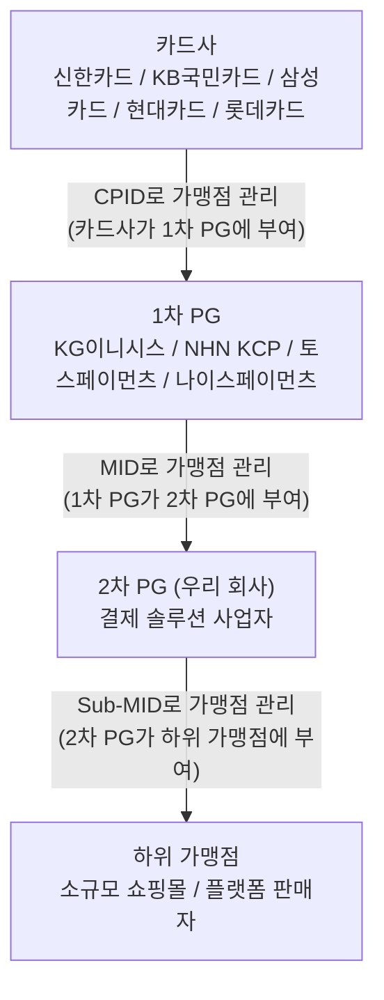
```mermaid
flowchart TD
    A["카드사\n신한카드 / KB국민카드 / 삼성카드 / 현대카드 / 롯데카드"]
    B["1차 PG\nKG이니시스 / NHN KCP / 토스페이먼츠 / 나이스페이먼츠"]
    C["2차 PG (우리 회사)\n결제 솔루션 사업자"]
    D["하위 가맹점\n소규모 쇼핑몰 / 플랫폼 판매자"]

    A -->|"CPID로 가맹점 관리\n(카드사가 1차 PG에 부여)"| B
    B -->|"MID로 가맹점 관리\n(1차 PG가 2차 PG에 부여)"| C
    C -->|"Sub-MID로 가맹점 관리\n(2차 PG가 하위 가맹점에 부여)"| D
```

**각 계층의 역할:**

| 계층 | 역할 | 관리 ID |
| --- | --- | --- |
| 카드사 | 실제 결제 승인 및 최종 정산 집행 | CPID (카드사 가맹점 번호) |
| 1차 PG | 카드사·VAN 연동, 결제창 제공 | MID (가맹점 ID) |
| 2차 PG | 선정산, 하위가맹점 관리, 정산 서비스 | Sub-MID (하위 가맹점 ID) |
| 하위 가맹점 | 실제 상품/서비스 판매자 | — |

> **왜 3차 PG는 없는가?** PG 서비스를 제공하려면 금융감독원 심사를 통과하고 PG 라이센스를 보유해야 합니다. 이 라이센스 진입장벽이 무한한 레이어 생성을 막습니다. 실무에서 2차 PG까지만 존재하는 이유입니다.
> 

### 0.4 직가맹 vs 대표가맹점, 오픈마켓 사례

| 구분 | 설명 | 정산 주체 | 심사 주체 |
| --- | --- | --- | --- |
| **직가맹** | 1차 PG와 직접 계약한 가맹점 | 1차 PG에서 직접 정산 | 카드사 + 1차 PG |
| **대표가맹점** | 2차 PG를 통해 계약한 가맹점 | 2차 PG에서 정산 | 2차 PG (대행) |

**오픈마켓 사례로 이해하기:**
- 오픈마켓 자체 (예: 스마트스토어 플랫폼) = **대표가맹점** (2차 PG 역할 수행)
- 오픈마켓 하위의 개별 판매자 = **하위몰**
- 하위몰은 오픈마켓에서 직접 정산 받지 못하므로 → 2차 PG를 통해 별도 정산

### 0.5 승인 흐름 vs 정산 흐름 완전 조감도

결제는 “승인(돈 요청)”과 “정산(돈 수령)” 두 단계로 나뉩니다. 방향이 정반대입니다.

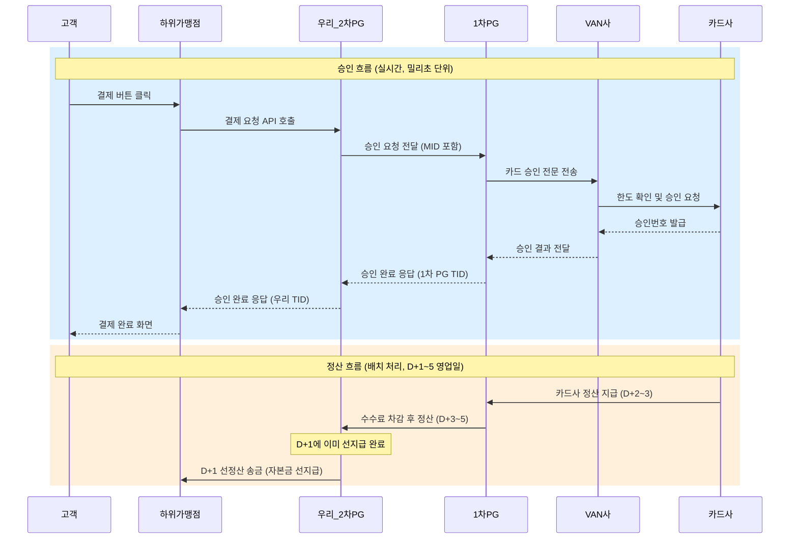
```mermaid
sequenceDiagram
    participant 고객
    participant 하위가맹점
    participant 우리_2차PG
    participant 1차PG
    participant VAN사
    participant 카드사

    rect rgb(220, 240, 255)
        Note over 고객,카드사: 승인 흐름 (실시간, 밀리초 단위)
        고객->>하위가맹점: 결제 버튼 클릭
        하위가맹점->>우리_2차PG: 결제 요청 API 호출
        우리_2차PG->>1차PG: 승인 요청 전달 (MID 포함)
        1차PG->>VAN사: 카드 승인 전문 전송
        VAN사->>카드사: 한도 확인 및 승인 요청
        카드사-->>VAN사: 승인번호 발급
        VAN사-->>1차PG: 승인 결과 전달
        1차PG-->>우리_2차PG: 승인 완료 응답 (1차 PG TID)
        우리_2차PG-->>하위가맹점: 승인 완료 응답 (우리 TID)
        하위가맹점-->>고객: 결제 완료 화면
    end

    rect rgb(255, 240, 220)
        Note over 고객,카드사: 정산 흐름 (배치 처리, D+1~5 영업일)
        카드사->>1차PG: 카드사 정산 지급 (D+2~3)
        1차PG->>우리_2차PG: 수수료 차감 후 정산 (D+3~5)
        Note over 우리_2차PG: D+1에 이미 선지급 완료
        우리_2차PG->>하위가맹점: D+1 선정산 송금 (자본금 선지급)
    end
```

> **핵심 포인트**: 승인은 실시간이지만 정산은 배치입니다. 우리 2차 PG는 카드사로부터 D+3~5에 돈을 받지만, 하위가맹점에게는 D+1에 미리 줍니다. 이 시간 차이(3~4일)를 우리 자본금으로 메우는 것이 2차 PG 비즈니스 모델의 핵심입니다.
> 

---

## 1장. Multi-PG 라우팅과 서버 이중화 [입문]

> **이 챕터에서 배울 것**
- 결제가 오프라인 물리 단말기에서 온라인 API 호출로 진화한 역사
- 여러 1차 PG 중 어디로 보낼지 결정하는 라우팅 로직
- 1차 PG 장애 시 자동으로 다른 PG로 전환하는 Failover
- 서버 이중화 구성 (Active-Active, Active-Standby)
> 

### 1.1 결제의 역사와 전산화 (2차 PG 관점)

**과거 물리적 망의 시대:**
신용카드가 처음 도입되던 시절, 가맹점은 카드를 임프린터 기계에 밀어 영수증을 3장 복사한 뒤, 매입용 영수증을 직접 은행에 가져가 제출해야 했습니다. 실시간 잔액 확인도 불가능했고, 위변조 위험도 컸습니다.

**현재의 전산화:**
실물 단말기가 카드를 읽어 **VAN** (Value Added Network, 부가가치통신망: 카드사와 가맹점 사이에서 결제 데이터를 중계하는 부가통신망)을 통해 실시간 승인(TCP/IP 소켓)을 쏩니다.

**우리(2차 PG)의 위치:**
우리는 직접 VAN사와 연동하지 않습니다. 1차 PG가 VAN을 통해 카드사와 통신하는 “가상 단말기” 역할을 하는 **1차 PG의 API를 호출**하여 결제를 중계합니다. 물리적 단말기 없이 HTTP API 호출만으로 전국 모든 카드사 결제를 처리할 수 있는 이유입니다.

### 1.2 Multi-PG 라우팅 아키텍처와 Failover

**왜 여러 1차 PG와 계약하는가?**

1차 PG 하나만 사용하면 그 PG에 장애가 났을 때 우리 하위가맹점 전체의 결제가 중단됩니다. 수억 원의 매출 손실과 가맹점 이탈로 이어질 수 있습니다. 따라서 우리는 **토스페이먼츠, NHN KCP, KG이니시스, 나이스페이먼츠** 등 여러 1차 PG와 동시에 계약하여 리스크를 분산합니다.

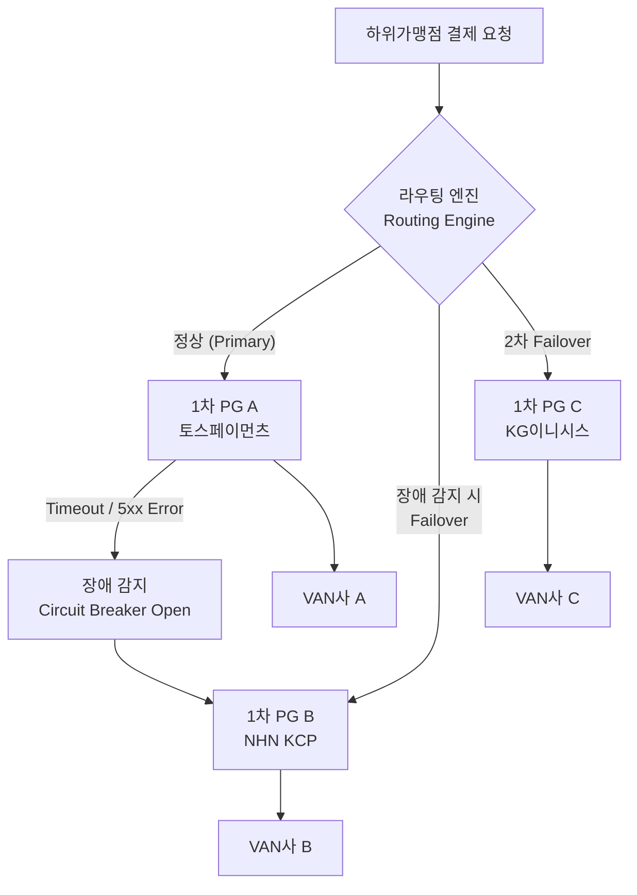
```mermaid
flowchart TD
    REQ[하위가맹점 결제 요청]
    ROUTER{라우팅 엔진\nRouting Engine}

    REQ --> ROUTER

    ROUTER -->|"정상 (Primary)"| PG1["1차 PG A\n토스페이먼츠"]
    ROUTER -->|"장애 감지 시\nFailover"| PG2["1차 PG B\nNHN KCP"]
    ROUTER -->|"2차 Failover"| PG3["1차 PG C\nKG이니시스"]

    PG1 -->|"Timeout / 5xx Error"| DETECT["장애 감지\nCircuit Breaker Open"]
    DETECT --> PG2

    PG1 --> VAN1[VAN사 A]
    PG2 --> VAN2[VAN사 B]
    PG3 --> VAN3[VAN사 C]
```

**라우팅 정책 유형:**

| 정책 | 설명 | 사용 시나리오 |
| --- | --- | --- |
| **우선순위 기반** | 1순위 PG 장애 시 2순위로 자동 전환 | 가장 일반적인 방식 |
| **가중치 기반** | PG A 70%, PG B 30% 분산 | 트래픽 분산, 수수료 최적화 |
| **결제 수단 기반** | 카카오페이는 KG이니시스, 네이버페이는 NHN KCP | 간편결제 직노출 연동 시 |
| **가맹점 기반** | 특정 Sub-MID는 항상 특정 PG로 고정 | 가맹점별 계약 조건이 다를 때 |

**1차 PG 장애 감지 알고리즘 (Circuit Breaker 패턴):**

Circuit Breaker (회로 차단기)는 외부 시스템 장애가 내부 시스템 전체로 전파되는 것을 막는 패턴입니다. 전기 회로 차단기처럼 문제가 생기면 “회로를 끊어” 더 이상 요청이 가지 않게 합니다.

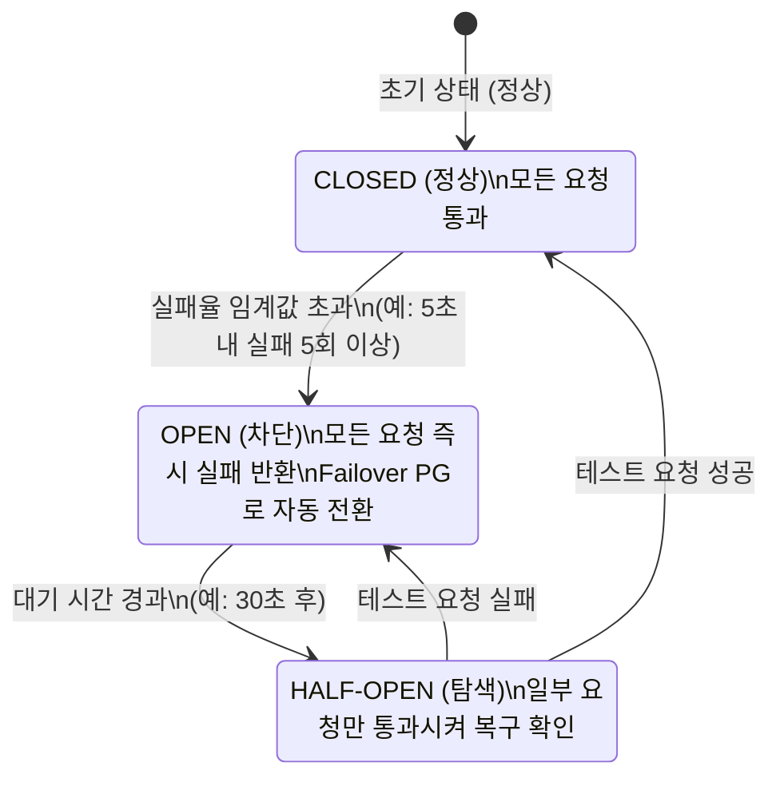
```mermaid
stateDiagram-v2
    [*] --> CLOSED: 초기 상태 (정상)

    CLOSED --> OPEN: 실패율 임계값 초과\n(예: 5초 내 실패 5회 이상)
    OPEN --> HALF_OPEN: 대기 시간 경과\n(예: 30초 후)
    HALF_OPEN --> CLOSED: 테스트 요청 성공
    HALF_OPEN --> OPEN: 테스트 요청 실패

    CLOSED: CLOSED (정상)\n모든 요청 통과
    OPEN: OPEN (차단)\n모든 요청 즉시 실패 반환\nFailover PG로 자동 전환
    HALF_OPEN: HALF-OPEN (탐색)\n일부 요청만 통과시켜 복구 확인
```

> **설계 배경 (Why):** Circuit Breaker 없이 장애 PG에 계속 요청을 보내면 어떻게 될까요? 각 요청이 Timeout(예: 30초)까지 스레드를 점유합니다. 동시 요청 100건이면 100개 스레드가 모두 묶여 내부 시스템 전체가 응답 불가 상태가 됩니다. Circuit Breaker는 “이미 죽은 곳에 요청 보내지 마라”는 안전장치입니다.
> 

**실무 Circuit Breaker 설정값 (Resilience4j 기준):**

```java
// 2차 PG 1차PG 연동 Circuit Breaker 설정 예시
CircuitBreakerConfig pgCircuitBreakerConfig = CircuitBreakerConfig.custom()
    // 슬라이딩 윈도우: 최근 10건 기준으로 실패율 계산
    .slidingWindowSize(10)
    // 실패율 50% 초과 시 OPEN 상태로 전환
    .failureRateThreshold(50)
    // OPEN 상태 유지 시간: 30초 후 HALF-OPEN으로 전환
    .waitDurationInOpenState(Duration.ofSeconds(30))
    // HALF-OPEN에서 허용할 테스트 요청 수
    .permittedNumberOfCallsInHalfOpenState(3)
    // Timeout도 실패로 간주
    .recordExceptions(TimeoutException.class, ConnectException.class)
    .build();
```

**Failover 시 멱등성 보장 (매우 중요):**

**멱등성** (Idempotency): 같은 요청을 여러 번 보내도 결과가 한 번만 적용되는 성질. 결제에서는 “재시도해도 중복 결제되지 않는 것”을 의미합니다.

Failover 시나리오: KCP로 요청을 보냈는데 응답이 없습니다. 토스페이먼츠로 재요청하기 전에, KCP에서 이미 승인이 완료됐을 가능성을 반드시 확인해야 합니다. 확인 없이 재요청하면 **동일 고객에게 이중 결제**가 발생합니다.

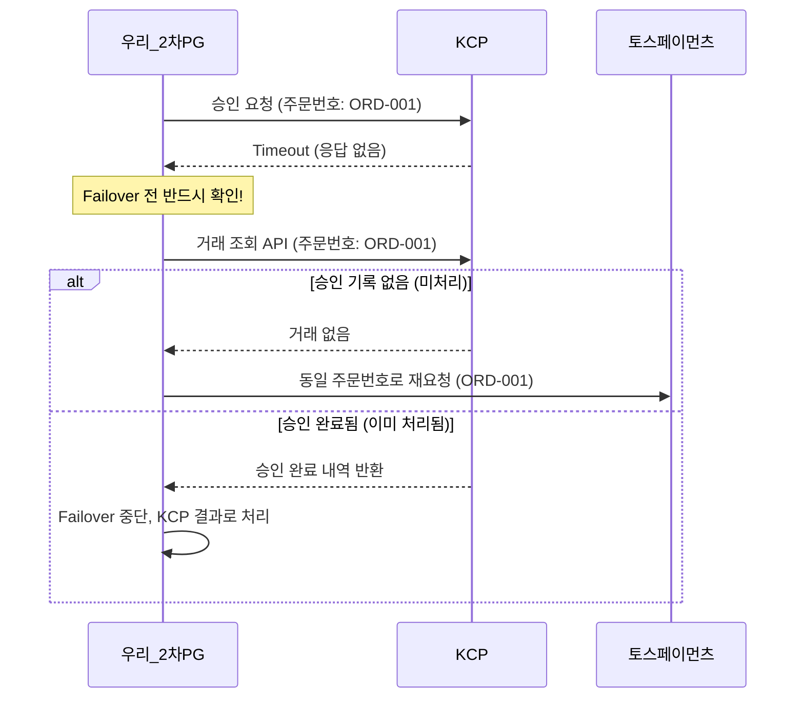
```mermaid
sequenceDiagram
    participant 우리_2차PG
    participant KCP
    participant 토스페이먼츠

    우리_2차PG->>KCP: 승인 요청 (주문번호: ORD-001)
    KCP-->>우리_2차PG: Timeout (응답 없음)

    Note over 우리_2차PG: Failover 전 반드시 확인!
    우리_2차PG->>KCP: 거래 조회 API (주문번호: ORD-001)

    alt 승인 기록 없음 (미처리)
        KCP-->>우리_2차PG: 거래 없음
        우리_2차PG->>토스페이먼츠: 동일 주문번호로 재요청 (ORD-001)
    else 승인 완료됨 (이미 처리됨)
        KCP-->>우리_2차PG: 승인 완료 내역 반환
        우리_2차PG->>우리_2차PG: Failover 중단, KCP 결과로 처리
    end
```

> **실무 주의사항**: 멱등성 키는 반드시 우리가 생성한 주문번호(우리 TID 또는 주문 고유번호)를 사용해야 합니다. 1차 PG가 생성한 TID는 Failover 시 다른 PG에서는 의미가 없습니다.
> 

### 1.3 서버 이중화 (Active-Active, Active-Standby)

**API 서버 (BLD, Front) — Active-Active:**

L4 로드밸런서를 통해 두 서버가 동시에 트래픽을 처리합니다. 한 서버가 다운되어도 나머지 서버가 즉시 전체 트래픽을 수용합니다.

**정산 DB (MariaDB/MySQL) — Active-Standby:**

정산 데이터는 Active-Active로 구성하지 않습니다. 두 DB가 동시에 쓰기 요청을 받으면 데이터 충돌(Conflict)이 발생할 수 있기 때문입니다. 따라서 Primary DB 하나만 쓰기를 받고, Standby DB는 복제본만 유지하다가 Primary 장애 시 즉시 승격됩니다.

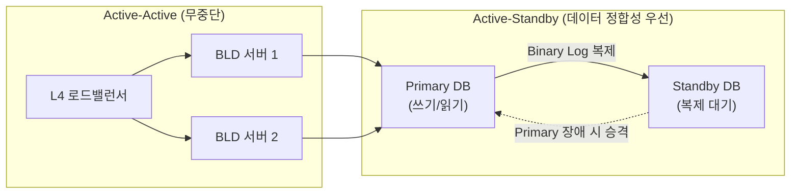
```mermaid
flowchart LR
    subgraph "Active-Active (무중단)"
        LB[L4 로드밸런서]
        LB --> A1[BLD 서버 1]
        LB --> A2[BLD 서버 2]
    end

    subgraph "Active-Standby (데이터 정합성 우선)"
        DB1["Primary DB\n(쓰기/읽기)"]
        DB2["Standby DB\n(복제 대기)"]
        DB1 -->|"Binary Log 복제"| DB2
        DB2 -.->|"Primary 장애 시 승격"| DB1
    end

    A1 --> DB1
    A2 --> DB1
```

> **설계 배경 (Why):** 돈이 오가는 정산 DB를 Active-Active로 구성하면 “A 서버에서 정산 완료로 업데이트”와 “B 서버에서 동일 건 정산 중” 상황이 충돌할 수 있습니다. 1원의 오차도 허용할 수 없는 금융 시스템에서 데이터 정합성이 가용성보다 우선합니다.
> 

---

## 2장. 10대 결제 수단 중계 아키텍처 [중급]

> **이 챕터에서 배울 것**
- 신용카드 인증/구인증/비인증의 차이와 보안 책임
- Webhook 릴레이가 무엇이고 왜 2차 PG에서 필수인지
- 계좌이체 현금영수증 파라미터를 누락하면 어떤 법적 리스크가 생기는지
- 상품권 취소 시 현금이 아닌 포인트로 환원되는 이유
- 휴대폰 결제를 선정산 제외하는 이유 (흑자도산 리스크)
- 10가지 결제 수단의 서로 다른 취소/정산 특성
> 

우리는 10가지 결제 수단의 서로 다른 1차 PG 규격을 우리만의 **단일 API 규격**으로 재포장(Wrapping)하여 가맹점에 제공해야 합니다. 하위가맹점 입장에서는 “우리 API 하나만 붙이면 모든 결제 수단이 된다”는 것이 핵심 가치입니다.

### 2.1 신용카드 (인증/구인증/비인증 + 보증보험)

신용카드는 인증 방식에 따라 세 가지로 나뉩니다. 인증 강도가 낮을수록 사기 리스크가 높아집니다.

| 방식 | 필요 정보 | 인증 주체 | 리스크 | 우리 허용 조건 |
| --- | --- | --- | --- | --- |
| **인증 결제** | 카드번호 + 공인인증/3DS | 카드사 또는 MSP | 낮음 | 전 가맹점 허용 |
| **구인증 (수기결제)** | 카드번호 + 유효기간 + 생년월일 + 비밀번호 앞 2자리 | 우리 검증 | 중간 | 계약 가맹점 한정 |
| **비인증** | 카드번호 + 유효기간 | 없음 (무인증) | 높음 | **보증보험 가입 가맹점만** |

> **구인증 vs 비인증 혼동 주의**: “카드+비밀번호”가 구인증이고 “카드만”이 비인증입니다. 비밀번호가 있어야 더 안전한 인증입니다.
> 

**구인증 (수기결제) 처리 흐름:**

하위가맹점이 `카드번호 + 유효기간 + 생년월일 + 비밀번호` 정보를 우리에게 쏘면, **우리 DB에 이 정보를 평문으로 저장하는 것은 PCI-DSS 위반(불법)**입니다. 우리는 이 정보를 메모리에만 올린 채 즉시 1차 PG의 구인증 API로 포워딩하고 파기해야 합니다.

**비인증 + 보증보험 아키텍처:**

비인증은 카드 번호와 유효기간만으로 결제되므로, 누군가 카드 정보를 탈취했다면 바로 악용할 수 있습니다. 따라서 우리는 비인증 API를 열어주기 전에 해당 가맹점이 보증보험에 가입되어 있는지 DB에서 확인합니다. 사고 발생 시 보증보험사가 피해를 보전하는 구조입니다.

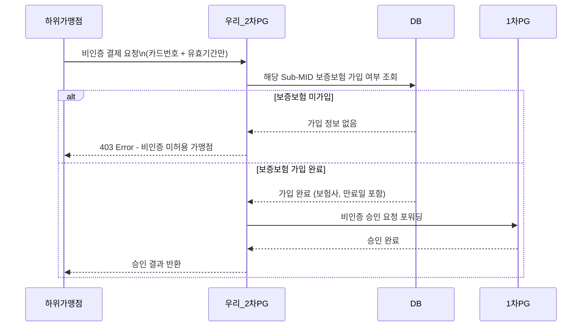
```mermaid
sequenceDiagram
    participant 하위가맹점
    participant 우리_2차PG
    participant DB
    participant 1차PG

    하위가맹점->>우리_2차PG: 비인증 결제 요청\n(카드번호 + 유효기간만)
    우리_2차PG->>DB: 해당 Sub-MID 보증보험 가입 여부 조회

    alt 보증보험 미가입
        DB-->>우리_2차PG: 가입 정보 없음
        우리_2차PG-->>하위가맹점: 403 Error - 비인증 미허용 가맹점
    else 보증보험 가입 완료
        DB-->>우리_2차PG: 가입 완료 (보험사, 만료일 포함)
        우리_2차PG->>1차PG: 비인증 승인 요청 포워딩
        1차PG-->>우리_2차PG: 승인 완료
        우리_2차PG-->>하위가맹점: 승인 결과 반환
    end
```

### 2.2 신용카드 오프라인/O2O + Webhook 릴레이

오프라인 키오스크 결제는 고객이 서명하거나 PIN을 입력하는 시간이 필요해 비동기 처리가 필수입니다. 이때 사용하는 것이 **Webhook (웹훅)**입니다.

**Webhook** (역방향 통신): 일반 API와 달리 서버가 클라이언트에게 먼저 데이터를 Push하는 방식. “이벤트가 발생하면 이 URL로 알려달라”는 등록 방식.

**Webhook 릴레이 3단계 흐름:**

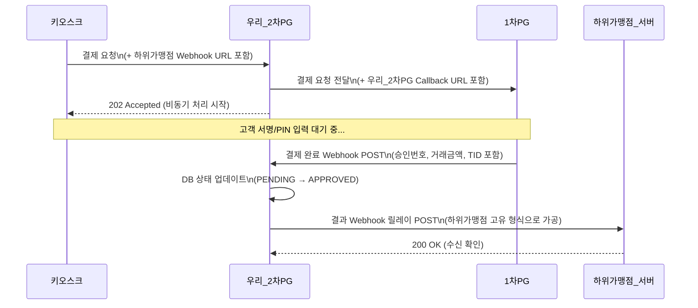
```mermaid
sequenceDiagram
    participant 키오스크
    participant 우리_2차PG
    participant 1차PG
    participant 하위가맹점_서버

    키오스크->>우리_2차PG: 결제 요청\n(+ 하위가맹점 Webhook URL 포함)
    우리_2차PG->>1차PG: 결제 요청 전달\n(+ 우리_2차PG Callback URL 포함)
    우리_2차PG-->>키오스크: 202 Accepted (비동기 처리 시작)

    Note over 키오스크,1차PG: 고객 서명/PIN 입력 대기 중...

    1차PG->>우리_2차PG: 결제 완료 Webhook POST\n(승인번호, 거래금액, TID 포함)
    우리_2차PG->>우리_2차PG: DB 상태 업데이트\n(PENDING → APPROVED)
    우리_2차PG->>하위가맹점_서버: 결과 Webhook 릴레이 POST\n(하위가맹점 고유 형식으로 가공)
    하위가맹점_서버-->>우리_2차PG: 200 OK (수신 확인)
```

> **개발 주의사항**: 하위가맹점 Webhook URL이 응답하지 않을 경우를 대비해 **재시도 로직(Retry with Exponential Backoff)**을 반드시 구현해야 합니다. 1차 실패 후 1분, 5분, 30분 간격으로 재시도하고 최종 실패 시 운영팀에 알림을 보내는 구조가 일반적입니다.
> 

### 2.3 체크카드 (환불 딜레이 대응)

체크카드는 신용카드처럼 보이지만 내부 처리 방식이 근본적으로 다릅니다.

- **신용카드 취소**: “청구 예정 금액을 취소” → 실제로 빠져나간 돈이 없으므로 즉시 처리
- **체크카드 취소**: “이미 빠져나간 돈을 계좌로 돌려줌” → 실제 환불 이체 필요

**환불 딜레이 처리 패턴:**

취소 시 우리(2차 PG)는 하위가맹점에게 즉시 `취소 성공`을 리턴하지만, **고객 계좌 실제 환불은 타행환망을 거쳐 D+3 영업일**이 소요됩니다. 이 딜레이를 가맹점이 모르면 “환불했는데 왜 안 들어오냐”는 CS 폭탄을 맞습니다.

우리 API 응답에 반드시 다음을 포함해야 합니다:
- `cancel_status`: `PROCESSING` (처리 중)
- `expected_refund_date`: `2026-04-23` (예상 환불일)
- `message`: `고객 계좌 환불은 영업일 기준 D+3 소요됩니다`

### 2.4 계좌이체 (현금영수증 파라미터 릴레이 + 가산세 리스크)

계좌이체는 고객 은행 계좌에서 즉시 출금하여 결제하는 수단입니다. 우리(2차 PG)는 금결원망을 직접 타지 않고 1차 PG의 계좌이체 API/결제창을 호출합니다.

**API 방식 vs 결제창 방식:**

| 방식 | 설명 | 개발 복잡도 | 은행 코드 관리 |
| --- | --- | --- | --- |
| **결제창 방식** | 1차 PG가 제공하는 은행 선택 UI를 iframe/팝업으로 띄움 | 낮음 | 1차 PG가 관리 |
| **API 방식** | 하위가맹점이 직접 은행을 선택하고 코드를 우리에게 전달 | 높음 | **우리가 은행 코드 매핑 테이블 관리** |

API 방식의 경우 은행 코드 매핑 테이블이 필요합니다. 우리 내부 코드와 1차 PG 코드가 다르기 때문입니다.

```
우리 코드: KOOKMIN → 1차 PG(KCP) 코드: 004
우리 코드: SHINHAN  → 1차 PG(KCP) 코드: 088
우리 코드: KOOKMIN  → 1차 PG(이니시스) 코드: bank_04
```

**[법적 리스크] 현금영수증 파라미터 릴레이:**

계좌이체는 현금성 결제이므로 **현금영수증 발급이 법적으로 의무**입니다. 하위가맹점이 결제 요청 시 다음 파라미터를 넘깁니다:
- `cash_receipt_type`: `INCOME_DEDUCTION` (소득공제) 또는 `EXPENSE_PROOF` (지출증빙)
- `cash_receipt_id`: `010-1234-5678` (소득공제 시 휴대폰번호) 또는 `123-45-67890` (지출증빙 시 사업자번호)

**우리 백엔드는 이 파라미터들을 유실 없이 1차 PG 승인 API에 정확히 전달해야 합니다.**

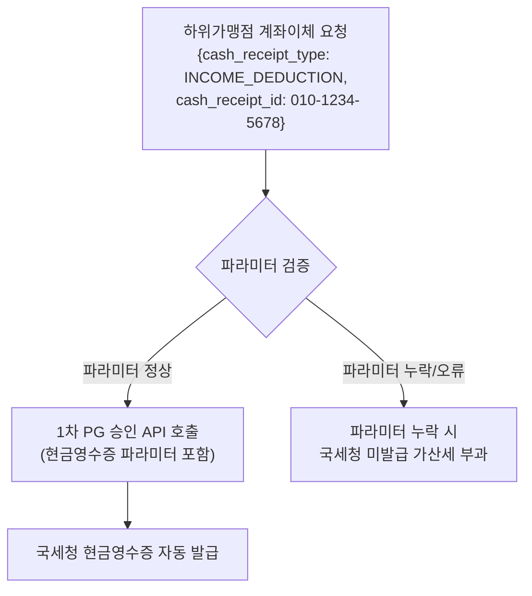
```mermaid
flowchart TD
    A["하위가맹점 계좌이체 요청\n{cash_receipt_type: INCOME_DEDUCTION,\n cash_receipt_id: 010-1234-5678}"]
    B{파라미터 검증}
    C["1차 PG 승인 API 호출\n(현금영수증 파라미터 포함)"]
    D["국세청 현금영수증 자동 발급"]
    E["파라미터 누락 시\n국세청 미발급 가산세 부과"]

    A --> B
    B -->|"파라미터 정상"| C
    C --> D
    B -->|"파라미터 누락/오류"| E
```

> **가산세 리스크**: 현금영수증을 발급하지 않으면 해당 거래금액의 **20% 가산세**가 가맹점에 부과됩니다. 개발 중 파라미터 매핑 오류 하나가 가맹점의 세무 문제로 이어질 수 있습니다. 계좌이체 연동 후 반드시 현금영수증 발급 여부를 국세청 조회 API로 검증하는 테스트를 수행하십시오.
> 

**계좌이체 취소의 특수성:**

신용카드 취소는 “승인 취소” (청구 전 차단)입니다. 하지만 계좌이체 취소는 이미 빠져나간 돈을 되돌려주는 **실제 펌뱅킹 환불 이체** 작업입니다. 따라서:
- 우리가 1차 PG에 취소 API를 호출
- 1차 PG가 펌뱅킹(Firm Banking)으로 고객 계좌에 직접 이체
- 고객 계좌 입금까지 **영업일 1~3일** 소요

**펌뱅킹** (Firm Banking): PG사나 기업이 은행 공동망에 직접 접속하여 계좌이체를 처리하는 기업 전용 뱅킹 서비스.

### 2.5 가상계좌 (동기화 문제 방어)

가상계좌는 고객에게 일시적인 전용 계좌번호를 부여하여 입금을 유도하는 방식입니다.

**가상계좌 할당 흐름:**

하위가맹점이 가상계좌를 요청하면, 우리가 1차 PG로부터 받은 가상계좌 번호를 전달합니다. 1차 PG는 헥토(Hecto), 쿠콘(Coucon) 같은 가상계좌 전문 제휴사를 통해 계좌를 발급합니다.

**[치명적 버그 주의] 입금 기한 초과 동기화 문제:**

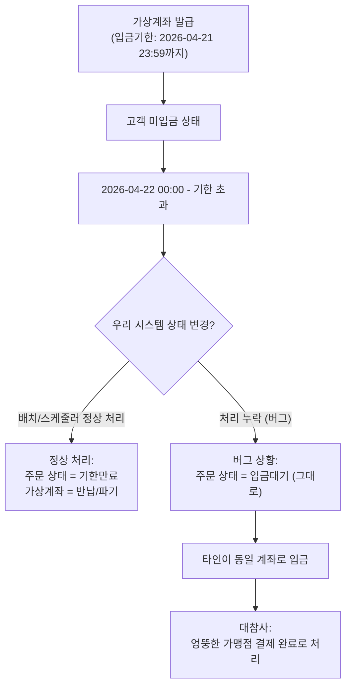
```mermaid
flowchart TD
    A["가상계좌 발급\n(입금기한: 2026-04-21 23:59까지)"]
    B["고객 미입금 상태"]
    C["2026-04-22 00:00 - 기한 초과"]
    D{우리 시스템 상태 변경?}
    E["정상 처리:\n주문 상태 = 기한만료\n가상계좌 = 반납/파기"]
    F["버그 상황:\n주문 상태 = 입금대기 (그대로)"]
    G["타인이 동일 계좌로 입금"]
    H["대참사:\n엉뚱한 가맹점 결제 완료로 처리"]

    A --> B --> C --> D
    D -->|"배치/스케줄러 정상 처리"| E
    D -->|"처리 누락 (버그)"| F
    F --> G --> H
```

> **개발 요구사항**: 매일 자정 배치 또는 입금기한 만료 시각에 스케줄러가 실행되어, 기한 초과된 가상계좌 주문을 `EXPIRED` 상태로 변경하고 계좌를 반납해야 합니다. 이 배치가 누락되면 Pool 방식에서 계좌 재사용 시 오결제가 발생합니다.
> 

**Webhook 릴레이 구조:**

```
고객 입금 → 은행 공동망 → 1차 PG (Webhook) → 우리 2차 PG (Webhook) → 하위가맹점
```

각 단계에서 Webhook 수신 즉시 `200 OK`를 반환해야 합니다. 처리 로직이 오래 걸린다면 비동기(Queue)로 처리하고 수신 확인만 즉시 반환하세요.

### 2.6 상품권 (보안 이슈 + 취소 제약)

문화상품권(컬쳐랜드), 해피머니, 도서문화상품권 등 상품권사의 PIN 번호 또는 아이디/비밀번호를 이용해 결제하는 수단입니다.

**중계 구조:**

```
하위가맹점 → 우리(2차 PG) → 1차 PG → 상품권사 (컬쳐랜드, 해피머니 등)
```

**[보안 필수] API 연동 시 자격증명 처리:**

가맹점이 자체 결제창을 만들 경우, 고객의 상품권사 아이디/비밀번호 또는 PIN 번호가 우리 API로 전달됩니다.

**이 정보들은 절대로 우리 DB에 저장되거나 로깅(Logging)되어서는 안 됩니다.**

- 액세스 로그, 디버그 로그, 에러 로그 어디에도 노출 금지
- 메모리에 올린 즉시 1차 PG로 포워딩
- 포워딩 완료 후 메모리에서 파기 (GC 대기 없이 즉시 null 처리)

**[취소 제약 상세] 상품권사별 부분취소 불가 정책:**

| 상품권사 | 부분취소 가능 여부 | 취소 후 환원 방식 |
| --- | --- | --- |
| 컬쳐랜드 | **불가** (단, 사용금액이 총액의 60% 이상이면 잔액 환불 가능) | 현금 아님 → **컬쳐랜드 캐시로 복구** |
| 해피머니 | **불가** | 현금 아님 → **해피머니 포인트로 복구** |
| 도서문화상품권 | 제한적 가능 | 도서상품권 재발급 |

> **중요**: 결제를 취소하더라도 고객의 은행 계좌로 현금이 입금되는 것이 아닙니다. **해당 상품권사 계정의 캐시(포인트)로 복구**됩니다. 가맹점 API 문서에 이를 명확히 고지하지 않으면 “취소했는데 왜 통장에 안 들어왔냐”는 CS 민원이 폭발합니다.
> 

**취소 시 현금 vs 포인트 환원 차이:**

- 신용카드 취소: 카드사가 청구 취소 → 고객이 실제 납부하지 않음 (현금 이동 없음)
- 체크카드/계좌이체 취소: 실제 출금된 현금을 계좌로 환불
- **상품권 취소: 상품권사 서버에서 차감된 포인트를 원복** → 현금화 불가

### 2.7 휴대폰 결제 (선정산 절대 주의 + 흑자도산 리스크)

휴대폰 소액결제는 통신사를 통해 결제하고 다음 달 통신 요금에 합산하는 방식입니다. 연동 통신사는 SKT, KT, LG U+이며, **다날(Danal), KG모빌리언스** 등 휴대폰 소액결제 전문사를 통해 연동합니다.

**[시스템 제약] 당월 취소 제약:**

휴대폰 결제는 월말이 지나면 1차 PG/통신사 시스템상 취소가 **시스템 차원에서 불가**합니다. 통신사가 이미 해당 달 청구서를 마감했기 때문입니다.

우리 백엔드는 월이 넘어간 취소 API 호출을 반드시 **에러 코드로 블락(Block)**해야 합니다:

```java
// 휴대폰 결제 취소 유효성 검사
LocalDate approvedDate = paymentRecord.getApprovedDate();
LocalDate today = LocalDate.now();

// 승인월과 취소 요청월이 다르면 취소 불가
if (!approvedDate.getMonth().equals(today.getMonth())
        || approvedDate.getYear() != today.getYear()) {
    throw new PaymentCancelException("MOBILE_CANCEL_EXPIRED",
        "휴대폰 결제는 승인 당월에만 취소 가능합니다.");
}
```

**[핵심 리스크] 선정산 3개월 자금 묶임과 흑자도산:**

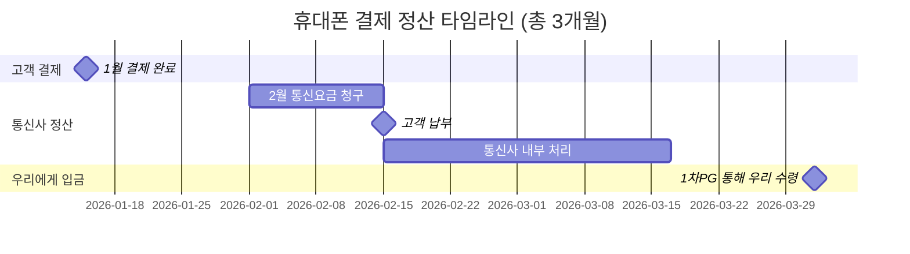
```mermaid
gantt
    title 휴대폰 결제 정산 타임라인 (총 3개월)
    dateFormat  YYYY-MM-DD
    section 고객 결제
    1월 결제 완료     :milestone, m1, 2026-01-15, 0d
    section 통신사 정산
    2월 통신요금 청구  :a1, 2026-02-01, 14d
    고객 납부         :milestone, m2, 2026-02-15, 0d
    통신사 내부 처리  :a2, 2026-02-15, 30d
    section 우리에게 입금
    1차PG 통해 우리 수령 :milestone, m3, 2026-04-01, 0d
```

**흑자도산 리스크:** 1월에 고객이 1억 원어치 휴대폰 결제를 했다고 가정합니다. 우리가 D+1 선정산을 해주면 다음날 1억 원이 하위가맹점에 나갑니다. 하지만 우리가 그 돈을 통신사로부터 받는 것은 4월입니다. **3개월간 1억 원이 묶입니다.** 매달 이렇게 쌓이면 매출은 발생하지만 현금이 없어 부도나는 “흑자도산”이 발생할 수 있습니다.

**따라서 휴대폰 결제는 선정산 대상에서 제외하거나, 수수료를 카드 대비 훨씬 높게 책정합니다.**

> **설계 배경 (Why):** 2차 PG 배치의 정산 대상 필터링 로직에 `AND pay_method != 'MOBILE'` 조건이 들어가는 이유가 바로 이것입니다. 실수로 이 조건을 제거하면 회사 전체 자금 흐름에 치명적 타격을 줄 수 있습니다.
> 

### 2.8 선불결제 (KYC + 1원 인증 + Zero-delay 결제)

2차 PG가 하위가맹점 생태계 내에서 통용되는 자사 포인트/캐시 시스템을 직접 운영하는 방식입니다. (예: 배민페이 머니, 쿠팡캐시 같은 구조)

**라이센스 선행 조건:**

금융감독원 **선불전자지급수단업** 등록이 반드시 필요합니다. 이 라이센스 없이 포인트를 “사용 가능한 화폐”처럼 운영하면 전자금융거래법 위반입니다.

**충전(Charge) 파이프라인 3단계:**

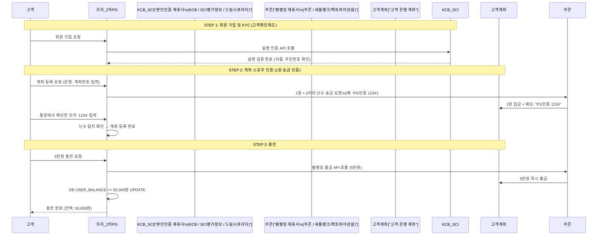
```mermaid
sequenceDiagram
    participant 고객
    participant 우리_2차PG
    participant KCB_SCI["본인인증 제휴사\n(KCB / SCI평가정보 / 드림시큐리티)"]
    participant 쿠콘["펌뱅킹 제휴사\n(쿠콘 / 세틀뱅크/헥토파이낸셜)"]
    participant 고객계좌["고객 은행 계좌"]

    Note over 고객,KCB_SCI: STEP 1: 회원 가입 및 KYC (고객확인제도)
    고객->>우리_2차PG: 회원 가입 요청
    우리_2차PG->>KCB_SCI: 실명 인증 API 호출
    KCB_SCI-->>우리_2차PG: 실명 검증 완료 (이름, 주민번호 확인)

    Note over 고객,고객계좌: STEP 2: 계좌 소유주 인증 (1원 송금 인증)
    고객->>우리_2차PG: 계좌 등록 요청 (은행, 계좌번호 입력)
    우리_2차PG->>쿠콘: 1원 + 4자리 난수 송금 요청\n(예: 'PG인증 1234')
    쿠콘->>고객계좌: 1원 입금 + 메모: "PG인증 1234"
    고객->>우리_2차PG: 통장에서 확인한 숫자 '1234' 입력
    우리_2차PG->>우리_2차PG: 난수 일치 확인 → 계좌 등록 완료

    Note over 고객,고객계좌: STEP 3: 충전
    고객->>우리_2차PG: 5만원 충전 요청
    우리_2차PG->>쿠콘: 펌뱅킹 출금 API 호출 (5만원)
    쿠콘->>고객계좌: 5만원 즉시 출금
    우리_2차PG->>우리_2차PG: DB USER_BALANCE += 50,000원 UPDATE
    우리_2차PG-->>고객: 충전 완료 (잔액: 50,000원)
```

**결제(Pay) 로직 — Zero-delay의 비밀:**

고객이 하위가맹점에서 포인트로 결제하면:
- 외부 API 호출: **없음**
- 처리 내용: 우리 DB의 `USER_BALANCE` 차감 UPDATE 한 번
- 속도: **수 밀리초(ms) 이내**

1차 PG API 호출이 없으므로 네트워크 지연이 없습니다. 이것이 “Zero-delay 결제”입니다.

**단, 정산 책임은 우리에게 있습니다:** 고객 돈은 우리 2차 PG 법인 통장에 있으므로, 하위가맹점에게는 **우리가 직접 D+1에 현금으로 정산(펌뱅킹 송금)**을 해야 합니다.

### 2.9 간편결제 (직노출 + 매핑 테이블 관리)

카카오페이, 네이버페이, 토스, 삼성페이, 페이코 등 간편결제입니다.

**허브 릴레이 구조:**

우리(2차 PG)는 카카오페이와 직접 연동하지 않습니다. 1차 PG가 미리 구축해둔 간편결제 통합 연동을 활용합니다.

```
하위가맹점 → 우리 2차 PG → 1차 PG (허브) → 카카오페이 / 네이버페이
```

**직노출 (Direct Open) 개발:**

“직노출”이란 가맹점 결제창에서 “1차 PG 결제창 열기” 버튼 하나로 통합하는 것이 아니라, **카카오페이, 네이버페이 버튼을 결제창 바깥으로 꺼내어 직접 배치**하는 것입니다.

**백엔드 매핑 테이블 관리 (핵심 업무):**

하위가맹점이 카카오페이 버튼을 클릭하면 우리 API로 `pay_method=KAKAOPAY`라고 요청이 옵니다. 우리 백엔드는 이 코드를 각 1차 PG의 고유 코드로 변환해야 합니다.

| 우리 코드 | 1차 PG | 1차 PG 전달 코드 |
| --- | --- | --- |
| `KAKAOPAY` | KG이니시스 | `gopaymethod=onlykakaopay` |
| `KAKAOPAY` | NHN KCP | `pay_method=KAKAO` |
| `KAKAOPAY` | 토스페이먼츠 | `method=카카오페이` |
| `NAVERPAY` | KG이니시스 | `gopaymethod=naverpay` |
| `NAVERPAY` | NHN KCP | `pay_method=NPAY` |

이 매핑 테이블이 잘못 관리되면 고객이 카카오페이를 눌렀는데 네이버페이로 연동되는 치명적 오류가 발생합니다. 코드 하드코딩이 아닌 **DB 테이블로 관리**하여 코드 배포 없이 수정할 수 있도록 설계해야 합니다.

### 2.10 복합결제 (보상 트랜잭션 + 포인트 원복)

포인트 + 신용카드, 상품권 + 계좌이체처럼 여러 결제 수단을 동시에 사용하는 방식입니다.

**보상 트랜잭션 (Compensating Transaction) 패턴:**

복합결제에서 부분 실패 시 이미 완료된 결제를 전부 원복해야 합니다. 데이터베이스 트랜잭션으로 한 번에 처리할 수 없는 이유는 1차 PG API 호출이 포함되기 때문입니다.

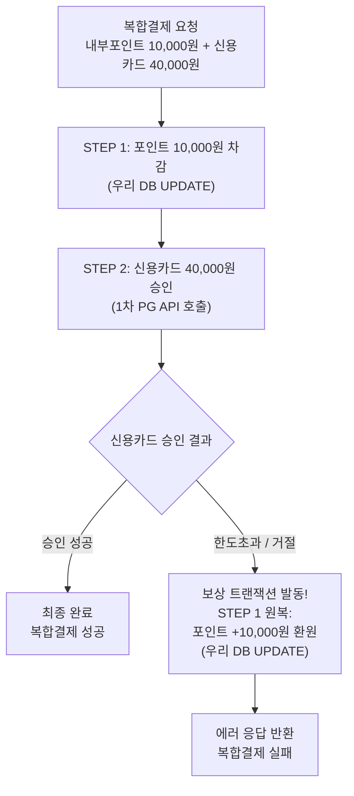
```mermaid
flowchart TD
    A["복합결제 요청\n내부포인트 10,000원 + 신용카드 40,000원"]
    B["STEP 1: 포인트 10,000원 차감\n(우리 DB UPDATE)"]
    C["STEP 2: 신용카드 40,000원 승인\n(1차 PG API 호출)"]
    D{신용카드 승인 결과}
    E["최종 완료\n복합결제 성공"]
    F["보상 트랜잭션 발동!\nSTEP 1 원복:\n포인트 +10,000원 환원\n(우리 DB UPDATE)"]
    G["에러 응답 반환\n복합결제 실패"]

    A --> B --> C --> D
    D -->|"승인 성공"| E
    D -->|"한도초과 / 거절"| F --> G
```

**복합결제 DB 설계 포인트:**

```sql
-- 복합결제 마스터 거래 (메인 TID)
CREATE TABLE PAYMENT_COMPLEX (
    COMPLEX_TID     VARCHAR(50) NOT NULL,   -- 복합결제 마스터 TID
    SUB_MID         VARCHAR(20) NOT NULL,
    TOTAL_AMT       BIGINT      NOT NULL,
    STATUS          VARCHAR(20) NOT NULL,   -- PENDING / COMPLETED / FAILED / ROLLBACK
    PRIMARY KEY (COMPLEX_TID)
);

-- 각 결제 수단별 서브 거래 (COMPLEX_TID 참조)
CREATE TABLE PAYMENT_COMPLEX_DETAIL (
    DETAIL_TID      VARCHAR(50) NOT NULL,
    COMPLEX_TID     VARCHAR(50) NOT NULL,   -- 마스터 TID 참조
    PAY_METHOD      VARCHAR(20) NOT NULL,   -- POINT / CREDIT_CARD / ...
    AMT             BIGINT      NOT NULL,
    STATUS          VARCHAR(20) NOT NULL,   -- APPROVED / CANCELLED / ROLLBACK
    SEQ             INT         NOT NULL,   -- 처리 순서 (롤백 시 역순으로)
    PRIMARY KEY (DETAIL_TID)
);
```

---

## 3장. 대외 API 제공 아키텍처 [중급]

> **이 챕터에서 배울 것**
- 망취소가 왜 생기고 우리가 어떻게 릴레이하는지
- 빌링 키를 1차 PG BID → Sub-BID 이중 구조로 관리하는 이유
- 1차 PG와 1원도 안 맞는 세금 안분 오차를 어떻게 동기화하는지
> 

### 3.1 망취소 릴레이 API

**망취소** (Network Cancellation): 결제 승인 요청 후 네트워크 오류로 응답을 받지 못했을 때, 혹시 승인이 완료됐을 수 있으므로 해당 승인을 취소하는 절차.

**발생 시나리오:**

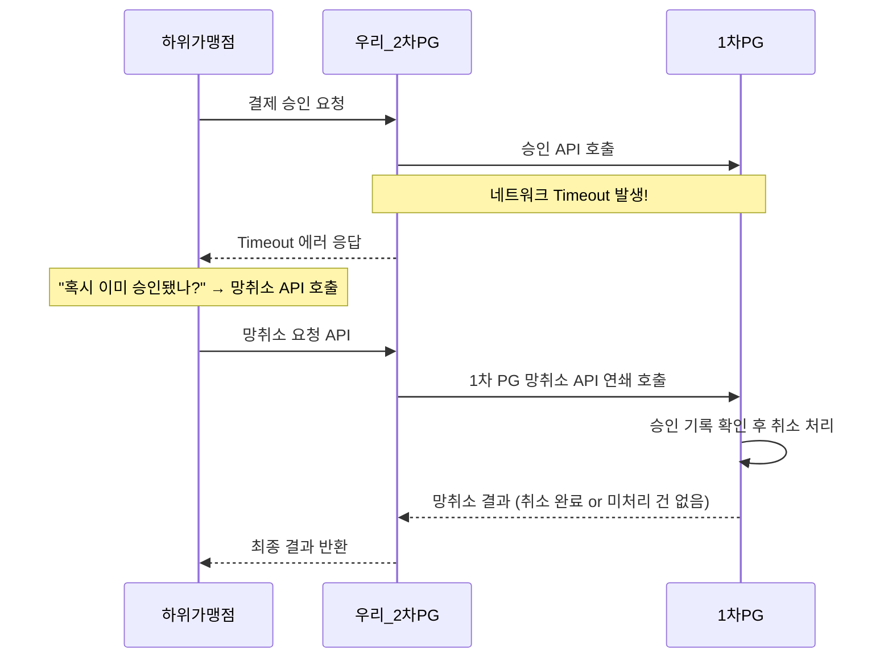
```mermaid
sequenceDiagram
    participant 하위가맹점
    participant 우리_2차PG
    participant 1차PG

    하위가맹점->>우리_2차PG: 결제 승인 요청
    우리_2차PG->>1차PG: 승인 API 호출
    Note over 우리_2차PG,1차PG: 네트워크 Timeout 발생!
    우리_2차PG-->>하위가맹점: Timeout 에러 응답

    Note over 하위가맹점: "혹시 이미 승인됐나?" → 망취소 API 호출

    하위가맹점->>우리_2차PG: 망취소 요청 API
    우리_2차PG->>1차PG: 1차 PG 망취소 API 연쇄 호출
    1차PG->>1차PG: 승인 기록 확인 후 취소 처리
    1차PG-->>우리_2차PG: 망취소 결과 (취소 완료 or 미처리 건 없음)
    우리_2차PG-->>하위가맹점: 최종 결과 반환
```

**망취소 API 구현 시 주의사항:**

- 망취소 요청이 여러 번 들어와도 중복 취소가 발생하지 않도록 **멱등성** 보장
- 1차 PG 망취소 결과가 “취소 완료”이면 우리 DB도 `CANCELLED` 상태로 업데이트
- 결과가 “해당 거래 없음”이면 원래 요청 자체가 미처리된 것이므로 우리 DB를 `FAILED` 상태로 업데이트

### 3.2 빌링 키 (Sub-BID 이중 토큰 구조)

**빌링** (Billing): 구독 서비스처럼 사전 등록된 카드로 주기적으로 자동 결제되는 방식.
**BID** (Billing ID): 카드 원문 정보를 대체하는 난수 토큰. 카드 정보 없이 반복 결제를 가능하게 함.

**왜 이중 토큰(Sub-BID) 구조인가?**

> **설계 배경 (Why):** 만약 우리가 1차 PG BID를 그대로 가맹점에 노출한다면, 가맹점이 그 BID를 들고 직접 1차 PG API를 호출할 수 있습니다. 우리를 거치지 않으면 우리는 수수료를 받지 못합니다. 또한 가맹점이 다른 1차 PG로 이동할 때 BID가 그대로 이전되어 우리와의 계약 관계가 무력화됩니다. Sub-BID는 “우리를 반드시 거쳐야 하는” 기술적 잠금 장치입니다.
> 

**이중 토큰 발급 흐름:**

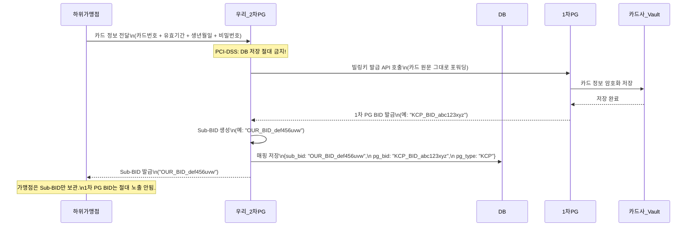
```mermaid
sequenceDiagram
    participant 하위가맹점
    participant 우리_2차PG
    participant DB
    participant 1차PG
    participant 카드사_Vault

    하위가맹점->>우리_2차PG: 카드 정보 전달\n(카드번호 + 유효기간 + 생년월일 + 비밀번호)
    Note over 우리_2차PG: PCI-DSS: DB 저장 절대 금지!
    우리_2차PG->>1차PG: 빌링키 발급 API 호출\n(카드 원문 그대로 포워딩)
    1차PG->>카드사_Vault: 카드 정보 암호화 저장
    카드사_Vault-->>1차PG: 저장 완료
    1차PG-->>우리_2차PG: 1차 PG BID 발급\n(예: "KCP_BID_abc123xyz")

    우리_2차PG->>우리_2차PG: Sub-BID 생성\n(예: "OUR_BID_def456uvw")
    우리_2차PG->>DB: 매핑 저장\n{sub_bid: "OUR_BID_def456uvw",\n pg_bid: "KCP_BID_abc123xyz",\n pg_type: "KCP"}
    우리_2차PG-->>하위가맹점: Sub-BID 발급\n("OUR_BID_def456uvw")

    Note over 하위가맹점: 가맹점은 Sub-BID만 보관.\n1차 PG BID는 절대 노출 안됨.
```

**반복 결제 시 처리 흐름:**

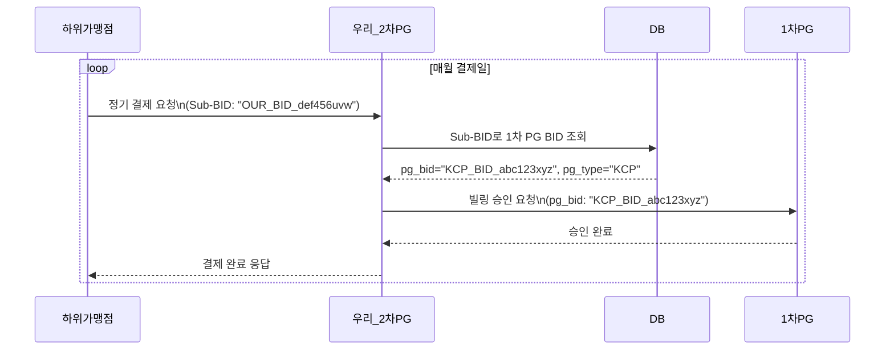
```mermaid
sequenceDiagram
    participant 하위가맹점
    participant 우리_2차PG
    participant DB
    participant 1차PG

    loop 매월 결제일
        하위가맹점->>우리_2차PG: 정기 결제 요청\n(Sub-BID: "OUR_BID_def456uvw")
        우리_2차PG->>DB: Sub-BID로 1차 PG BID 조회
        DB-->>우리_2차PG: pg_bid="KCP_BID_abc123xyz", pg_type="KCP"
        우리_2차PG->>1차PG: 빌링 승인 요청\n(pg_bid: "KCP_BID_abc123xyz")
        1차PG-->>우리_2차PG: 승인 완료
        우리_2차PG-->>하위가맹점: 결제 완료 응답
    end
```

**Sub-BID DB 설계:**

```sql
CREATE TABLE BILLING_KEY_MAPPING (
    SUB_BID         VARCHAR(50)  NOT NULL COMMENT '2차 PG가 발급한 가맹점용 빌링키',
    PG_BID          VARCHAR(100) NOT NULL COMMENT '1차 PG가 발급한 실제 빌링키 (암호화 저장)',
    PG_TYPE         VARCHAR(20)  NOT NULL COMMENT '연동 1차 PG 구분 (KCP / INICIS / TOSS)',
    SUB_MID         VARCHAR(20)  NOT NULL COMMENT '발급 요청 가맹점 ID',
    ISSUE_DT        DATETIME     NOT NULL COMMENT '발급일시',
    EXPIRE_DT       DATETIME              COMMENT '만료일시 (NULL이면 무제한)',
    STATUS          VARCHAR(10)  NOT NULL COMMENT 'ACTIVE / EXPIRED / REVOKED',
    PRIMARY KEY (SUB_BID)
);
```

**1차 PG 교체 시 Sub-BID 구조의 진가:**

만약 KCP와 계약을 해지하고 토스페이먼츠로 이전해야 한다면:
1. 가맹점은 Sub-BID를 그대로 사용 (변경 없음)
2. 우리 DB의 `PG_TYPE`과 `PG_BID`만 새로운 토스페이먼츠 BID로 업데이트
3. 가맹점 코드 수정 없이 PG 이전 완료

**순환 취소 방어 로직:**

빌링 결제에서 간헐적으로 발생하는 “취소 → 재승인 → 재취소” 루프를 방어해야 합니다. `BILLING_TXN_HISTORY` 테이블에서 동일 Sub-BID의 24시간 내 취소 횟수를 조회하여 임계값 초과 시 차단합니다.

### 3.3 부분취소 + 1원 오차 동기화 (1차 PG와 100% 맞추기)

**부분취소 TID 채번:**

부분취소 요청 시 우리 DB에도 새로운 취소 TID를 채번해야 합니다. 원거래 TID와의 연결을 반드시 유지합니다.

```sql
-- 부분취소 거래 기록
INSERT INTO PAYMENT_CANCEL (
    CANCEL_TID,         -- 새로 채번한 취소 TID
    ORIGIN_TID,         -- 원거래 TID (FK)
    CANCEL_AMT,         -- 이번 취소 금액
    REMAIN_AMT,         -- 취소 후 남은 잔액
    CANCEL_VAT,         -- 취소 부가세
    CANCEL_SUPPLY_AMT,  -- 취소 공급가액
    TRX_ST_CD           -- 2: 후취소
) VALUES (...)
```

**[1원 오차 문제] 과세/면세 안분 로직:**

10만원 결제에서 과세:면세 = 7:3 비율인 경우, 수수료를 각각 안분하면 소수점이 발생합니다.

```
총 결제: 100,000원
  - 과세 부분: 70,000원 (공급가액 63,637원 + 부가세 6,363원)
  - 면세 부분: 30,000원

3만원 부분취소 시 과세/면세 안분:
  - 취소 과세: 21,000원 (공급가액 19,091원 + 부가세 1,909원)
  - 취소 면세: 9,000원

남은 과세: 63,637 - 19,091 = 44,546원
남은 부가세: 6,363 - 1,909 = 4,454원

하지만 실제 남은 금액의 부가세 계산: 44,546 * 10% = 4,454.6 → 반올림하면 4,455원
→ 1원 차이 발생!
```

**이 1원 오차가 대사 불일치로 이어집니다.** 1차 PG마다 “소수점 이하를 버림으로 처리하는가, 올림으로 처리하는가, 반올림으로 처리하는가”가 다릅니다. **1차 PG의 규격서에 명시된 보정 로직을 우리 백엔드에 100% 동일하게 이식**해야 합니다. 부분취소가 많이 발생하는 서비스라면 1차 PG 담당자에게 반드시 서면으로 보정 정책을 확인받으십시오.

---

## 4장. 정산 시스템 — 2차 PG의 심장 [심화]

> **이 챕터에서 배울 것**
- 매입이란 무엇이고 우리는 어떻게 트리거링하는지
- 거래 대사 파일에서 어떤 불일치 유형이 발생하는지, 각각 어떻게 처리하는지
- D+1 선정산의 자금 운용 모델과 흑자도산 방어 방법
- 차액정산, 환급정산이 왜 별도로 존재하는지
- 정산 배치를 멱등하게 설계하는 방법
> 

### 4.1 매입 요청 (1차 PG 대행)

**매입** (Acquisition): 카드사가 실제로 가맹점에게 대금을 지급하기 위해 거래를 확정하는 절차. 승인 후 일정 기간이 지나면 배치로 매입을 요청해야 합니다.

우리(2차 PG)는 직접 카드사에 매입을 요청하지 않습니다. 1차 PG가 자동 매입을 대행해주거나, 우리가 1차 PG의 매입 API를 스케줄러로 주기적으로 호출하여 트리거링합니다.

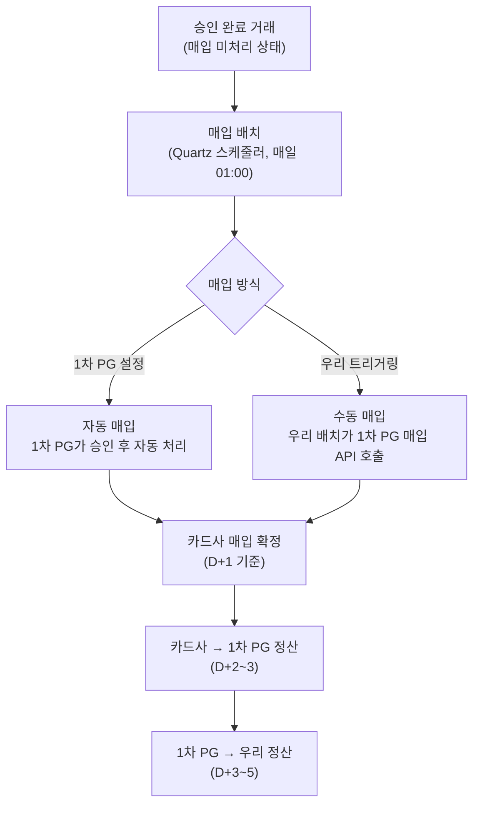
```mermaid
flowchart TD
    A["승인 완료 거래\n(매입 미처리 상태)"]
    B["매입 배치\n(Quartz 스케줄러, 매일 01:00)"]
    C{매입 방식}
    D["자동 매입\n1차 PG가 승인 후 자동 처리"]
    E["수동 매입\n우리 배치가 1차 PG 매입 API 호출"]
    F["카드사 매입 확정\n(D+1 기준)"]
    G["카드사 → 1차 PG 정산\n(D+2~3)"]
    H["1차 PG → 우리 정산\n(D+3~5)"]

    A --> B --> C
    C -->|"1차 PG 설정"| D
    C -->|"우리 트리거링"| E
    D --> F
    E --> F
    F --> G --> H
```

### 4.2 거래 대사 (SFTP 파일 처리 + 불일치 유형별 처리)

**대사** (Reconciliation): PG사와 카드사 간의 거래 데이터를 비교·검증하여 오차를 찾아내는 과정. “우리 DB 기록”과 “1차 PG가 보내준 파일의 기록”이 일치하는지 확인합니다.

**대사 파일 수신 및 처리 흐름:**

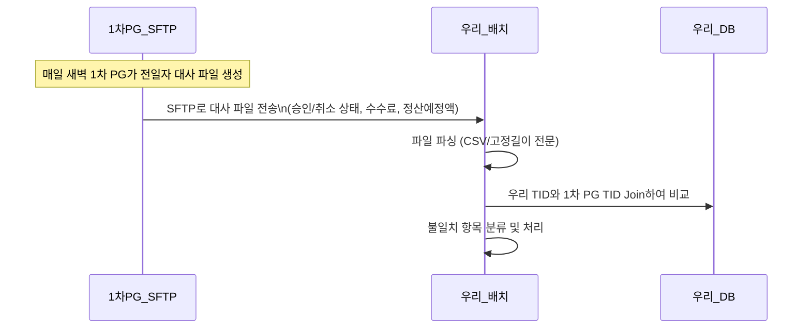
```mermaid
sequenceDiagram
    participant 1차PG_SFTP
    participant 우리_배치
    participant 우리_DB

    Note over 1차PG_SFTP: 매일 새벽 1차 PG가 전일자 대사 파일 생성
    1차PG_SFTP->>우리_배치: SFTP로 대사 파일 전송\n(승인/취소 상태, 수수료, 정산예정액)
    우리_배치->>우리_배치: 파일 파싱 (CSV/고정길이 전문)
    우리_배치->>우리_DB: 우리 TID와 1차 PG TID Join하여 비교
    우리_배치->>우리_배치: 불일치 항목 분류 및 처리
```

**대사 불일치 유형 4가지와 처리 로직:**

| 유형 | 증상 | 원인 | 처리 방법 |
| --- | --- | --- | --- |
| **누락 거래** | 우리 DB에는 있으나 대사 파일에 없음 | 망취소 미처리, 승인 DB 저장 오류 | 운영팀 알림 → 수동 망취소 또는 1차 PG 확인 |
| **유령 거래** | 대사 파일에는 있으나 우리 DB에 없음 | DB 저장 실패 후 망취소 누락 | 즉시 1차 PG에 취소 요청 (자동 배치) |
| **상태 불일치** | 우리 DB는 승인, 대사 파일은 취소 | 취소 Webhook 수신 실패 | 우리 DB를 대사 파일 기준으로 강제 동기화 |
| **금액 오차** | 동일 TID인데 금액이 다름 | 1원 오차, 수수료 계산 방식 차이 | 오차 금액 계산 후 차액 정산에 반영 |

**대사 배치 구현 (Spring Batch Chunk 처리):**

```java
// 대사 배치 - Cursor 방식으로 대용량 파일 처리
@Bean
public Step reconciliationStep() {
    return stepBuilderFactory.get("reconciliationStep")
        // chunk size: 1000건씩 처리 (OOM 방지)
        .<PgReconciliationRecord, ReconciliationResult>chunk(1000)
        .reader(sftp파일Reader())       // SFTP에서 읽어온 파일 파싱
        .processor(reconciliationProcessor()) // 우리 DB와 비교
        .writer(reconciliationWriter())       // 불일치 항목 처리 및 저장
        .build();
}
```

> **설계 배경 (Why):** 대사 파일은 수십만 건이 될 수 있습니다. 이를 메모리에 한 번에 올리면 OOM(Out of Memory)이 발생합니다. Spring Batch의 Chunk 처리와 Cursor 방식 조회를 통해 일정 크기씩 처리해야 합니다.
> 

### 4.3 일반 정산 (D+1 선정산 + 자금 운용 모델)

**D+1 선정산 배치 전체 흐름:**

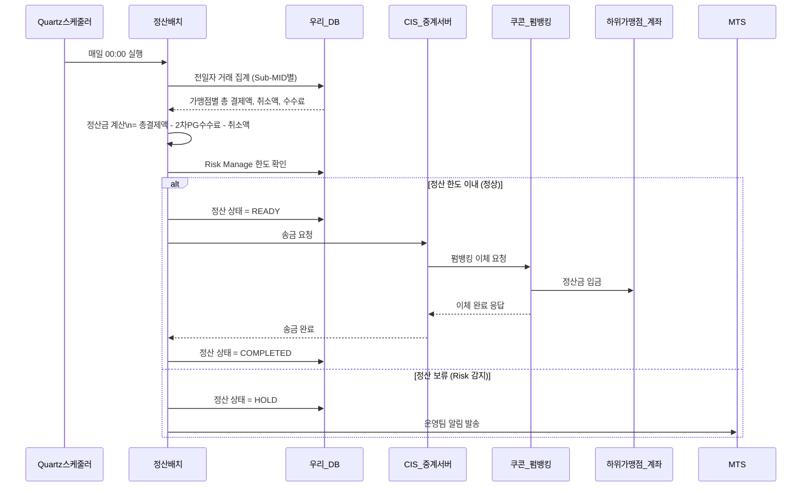
```mermaid
sequenceDiagram
    participant Quartz스케줄러
    participant 정산배치
    participant 우리_DB
    participant CIS_중계서버
    participant 쿠콘_펌뱅킹
    participant 하위가맹점_계좌

    Quartz스케줄러->>정산배치: 매일 00:00 실행
    정산배치->>우리_DB: 전일자 거래 집계 (Sub-MID별)
    우리_DB-->>정산배치: 가맹점별 총 결제액, 취소액, 수수료
    정산배치->>정산배치: 정산금 계산\n= 총결제액 - 2차PG수수료 - 취소액
    정산배치->>우리_DB: Risk Manage 한도 확인

    alt 정산 한도 이내 (정상)
        정산배치->>우리_DB: 정산 상태 = READY
        정산배치->>CIS_중계서버: 송금 요청
        CIS_중계서버->>쿠콘_펌뱅킹: 펌뱅킹 이체 요청
        쿠콘_펌뱅킹->>하위가맹점_계좌: 정산금 입금
        쿠콘_펌뱅킹-->>CIS_중계서버: 이체 완료 응답
        CIS_중계서버-->>정산배치: 송금 완료
        정산배치->>우리_DB: 정산 상태 = COMPLETED
    else 정산 보류 (Risk 감지)
        정산배치->>우리_DB: 정산 상태 = HOLD
        정산배치->>MTS: 운영팀 알림 발송
    end
```

**D+1 선정산 자금 운용 모델:**

| 시점 | 우리 자본금 흐름 |
| --- | --- |
| D+0 (결제 발생) | 자본금 변동 없음 |
| D+1 (선정산 지급) | **자본금에서 정산금 선지급** (-N원) |
| D+3~5 (1차 PG 수령) | 1차 PG로부터 대금 수령 (+N원, 수수료 차감) |
| 순이익 | 2차 PG 수수료 (1차 PG 수수료 초과분) |

> **흑자도산 리스크**: 자본금이 부족한 상태에서 급격히 가맹점 수가 증가하면, 선지급해야 할 금액이 자본금을 초과합니다. 매출은 나는데 현금이 없어 부도나는 상황입니다. 이를 방어하기 위해 가맹점 온보딩 속도 조절, 선정산 한도 관리, 특정 결제 수단(휴대폰) 선정산 제외 정책이 존재합니다.
> 

**정산 지급액 계산 공식:**

```
정산 지급액 = 총 결제금액
           - 카드사 수수료 (1차 PG가 CPID별로 차감)
           - 1차 PG 수수료
           - 2차 PG 수수료 (우리 마진)
           + 차액정산 추가금 (영세/중소 우대 적용 시)
           + 환급정산 추가금 (국세청 등급 소급 적용 시)
```

### 4.4 차액 정산 (기업규모별 수수료 + 사후 계산)

**왜 차액정산이 별도로 존재하는가?**

카드사는 가맹점의 연간 매출 규모에 따라 수수료율을 차등 적용합니다. 하지만 우리(2차 PG)는 카드사로부터 “일반 CPID” 하나로 모든 결제를 처리하므로, 결제 시점에는 가맹점이 영세인지 일반인지 카드사가 모릅니다. 따라서 **우선 일반 수수료로 처리하고, 나중에 우대 수수료와의 차액을 우리가 정산금에 얹어주는** 방식입니다.

**기업규모별 수수료율 (카드사 기준):**

| 기업 규모 | 연간 매출 기준 | 우대 수수료율 | 적용 CPID |
| --- | --- | --- | --- |
| 영세 | 3억 미만 | 가장 낮음 | CPID_영세 |
| 중소1 | 3억 ~ 5억 | 낮음 | CPID_중소1 |
| 중소2 | 5억 ~ 10억 | 중간 | CPID_중소2 |
| 중소3 | 10억 ~ 30억 | 약간 높음 | CPID_중소3 |
| 일반 | 30억 초과 | 기본 수수료율 | CPID_일반 |

**차액정산 계산 예시:**

```
A 가맹점 (영세 사업자, 연 2억 매출)
오늘 결제: 100,000원

일반 CPID로 처리된 카드사 수수료: 2,000원 (2%)
영세 CPID 기준 수수료 (실제 적용되어야 할): 800원 (0.8%)

차액: 2,000원 - 800원 = 1,200원
→ 우리가 A 가맹점에게 1,200원을 차액정산으로 추가 지급
```

**차액정산 배치:**

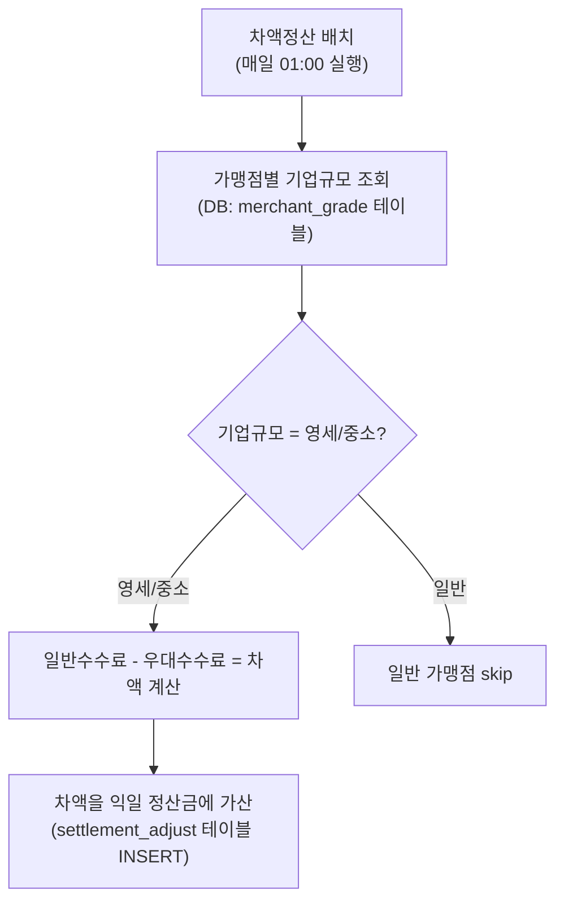
```mermaid
flowchart TD
    A["차액정산 배치\n(매일 01:00 실행)"]
    B["가맹점별 기업규모 조회\n(DB: merchant_grade 테이블)"]
    C{기업규모 = 영세/중소?}
    D["일반수수료 - 우대수수료 = 차액 계산"]
    E["차액을 익일 정산금에 가산\n(settlement_adjust 테이블 INSERT)"]
    F["일반 가맹점 skip"]

    A --> B --> C
    C -->|"영세/중소"| D --> E
    C -->|"일반"| F
```

### 4.5 환급 정산 (국세청 소급 적용 + 배치 설계)

**환급정산이 왜 생기는가?**

국세청은 **상반기(7월), 하반기(1월)** 연 2회 가맹점의 기업규모 리스트를 업데이트합니다. 이 리스트가 업데이트되기 전에 “일반”으로 처리되다가, 업데이트 후 “영세”로 확인된 경우, 이전 6개월간 더 받았던 수수료를 전부 돌려줘야 합니다.

**환급정산 시나리오:**

```mermaid
gantt
    title 환급정산 발생 시나리오
    dateFormat  YYYY-MM
    section 처리 기간
    일반 수수료로 결제 처리    :a1, 2026-01, 6M
    국세청 기업규모 업데이트   :milestone, m1, 2026-07, 0d
    영세 사업자로 확인됨       :a2, 2026-07, 1M
    section 환급
    과거 6개월치 차액 소급환급 :a3, 2026-07, 1M
```

**환급정산 배치 설계 (대용량 처리):**

```java
@Bean
public Step refundSettlementStep() {
    return stepBuilderFactory.get("refundSettlementStep")
        .<Merchant, RefundSettlement>chunk(500)
        .reader(gradeChangedMerchantReader()) // 등급 변경된 가맹점만 조회
        .processor(refundCalculationProcessor()) // 과거 6개월 거래 재계산
        .writer(refundSettlementWriter())     // 환급금 저장 + 송금 요청
        .build();
}
```

> **주의**: 환급정산은 과거 6개월치 거래를 **모두 재조회**하여 계산합니다. 거래가 많은 가맹점의 경우 수백만 건이 될 수 있으므로 반드시 페이징/커서 방식으로 처리해야 합니다.
> 

### 4.6 정산 배치 멱등성 설계

정산 배치는 **돈이 실제로 이동**합니다. 배치가 실패하여 재실행될 때 중복 송금이 발생하면 가맹점에 돈을 두 번 보내고, 우리는 되돌려받기 어렵습니다.

**멱등성** (Idempotency): 같은 작업을 여러 번 실행해도 결과가 동일한 성질.

**멱등성 보장 설계 패턴:**

```sql
-- 정산 처리 테이블: 처리 여부를 날짜+가맹점 단위로 관리
CREATE TABLE SETTLEMENT_LEDGER (
    SETTLEMENT_ID   BIGINT      NOT NULL AUTO_INCREMENT,
    SUB_MID         VARCHAR(20) NOT NULL,
    SETTLE_DATE     DATE        NOT NULL,   -- 정산 기준일 (= 어제 날짜)
    SETTLE_AMT      BIGINT      NOT NULL,
    STATUS          VARCHAR(20) NOT NULL,   -- PENDING / PROCESSING / COMPLETED / FAILED
    IDEMPOTENCY_KEY VARCHAR(100) NOT NULL,  -- "SETTLE_20260420_SUB123" 형태
    CREATED_AT      DATETIME    NOT NULL,
    UPDATED_AT      DATETIME    NOT NULL,
    UNIQUE KEY UK_IDEMPOTENCY (IDEMPOTENCY_KEY), -- 중복 처리 방지의 핵심
    PRIMARY KEY (SETTLEMENT_ID)
);
```

```java
// 정산 배치 멱등성 처리 로직
public void processSettlement(String subMid, LocalDate settleDate, long amount) {
    String idempotencyKey = "SETTLE_" + settleDate + "_" + subMid;

    // 이미 처리된 건인지 확인 (멱등성 체크)
    Optional<SettlementLedger> existing = ledgerRepository.findByIdempotencyKey(idempotencyKey);

    if (existing.isPresent() && "COMPLETED".equals(existing.get().getStatus())) {
        // 이미 완료된 건 - 중복 실행 무시
        log.info("이미 처리된 정산 건 skip: {}", idempotencyKey);
        return;
    }

    // PENDING 또는 FAILED 상태인 경우만 처리
    doSettle(subMid, settleDate, amount, idempotencyKey);
}
```

**정산 배치 재처리 시 안전한 상태 전이:**

```
PENDING → PROCESSING → COMPLETED
                    ↘ FAILED → (재실행 시) PROCESSING → COMPLETED
```

`PROCESSING` 상태에서 배치가 죽으면 수동으로 상태를 확인 후 `FAILED`로 변경하거나 재처리해야 합니다. `COMPLETED` 상태는 절대로 재처리하지 않습니다.

---

## 5장. 리스크 관리 및 보안 [심화]

> **이 챕터에서 배울 것**
- 2차 PG가 1차 PG보다 리스크 관리가 더 정교해야 하는 근본 이유
- 가맹점 지급 보류(Hold)가 언제 발동되고 어떻게 해제되는지
- AML 심사 자동화: 국세청 API, 신분증 진위확인, 실소유주 확인
- FDS에서 2차 PG 특화 패턴(선정산 악용, 자전거래)을 어떻게 탐지하는지
> 

**왜 2차 PG 리스크 관리는 1차 PG보다 더 정교해야 하는가?**

1차 PG는 D+3~5 후에 정산합니다. 즉, 가맹점이 사기를 쳐도 우리가 아직 돈을 안 줬으므로 막을 수 있습니다.

**우리(2차 PG)는 D+1에 먼저 줍니다.** 하위가맹점이 물건을 안 보내고 도망가거나(먹튀), 상품권/카드 깡 사기를 치거나, 카드사 환불 민원(Chargeback)이 쏟아지면 **우리가 모든 빚을 떠안습니다.** 따라서 리스크 관리가 생존의 문제입니다.

### 5.1 Risk Manage (한도/보류/채권 방어) — 1차 PG보다 정교한 이유

**한도 통제 체계:**

| 한도 유형 | 설명 | 설정 기준 |
| --- | --- | --- |
| 1회 한도 | 단건 결제 최대 금액 | 업종, 보증보험 가입 여부 |
| 일 한도 | 하루 총 결제 최대 금액 | 예상 매출 기준 |
| 월 한도 | 한 달 총 결제 최대 금액 | 연간 매출 신고 기준 |
| 누적 한도 | 선정산 미회수 누적 최대 금액 | 자본금 대비 비율 |

**지급 보류 (Hold) — 채권 방어 메커니즘:**

```mermaid
flowchart TD
    A["자정 정산 배치 실행"]
    B["Sub-MID별 전일 거래 집계"]
    C{Risk 이상 감지?}
    D["정상 정산 처리\n→ 가맹점 계좌 송금"]
    E{이상 유형 판단}
    F["패턴 1: 신생 가맹점 고액 결제\n(오픈 2주 내, 일 500만원 초과)"]
    G["패턴 2: 단기간 한도 소진\n(일 한도 80% 이상 사용)"]
    H["패턴 3: 업종 불일치 거래\n(등록 업종과 다른 상품 결제)"]
    I["정산 상태 = HOLD\n운영팀 알림 발송"]
    J["운영팀 수동 확인 후 해제\n또는 장기 Hold 유지"]

    A --> B --> C
    C -->|"정상"| D
    C -->|"이상"| E
    E --> F
    E --> G
    E --> H
    F --> I
    G --> I
    H --> I
    I --> J
```

> **Hold의 실제 목적**: 카드사에서 Chargeback(환불 민원)이 들어오면 카드사가 우리에게 해당 금액을 청구합니다. 우리가 이미 가맹점에게 돈을 보냈다면 가맹점에게 되돌려 받아야 하는데, 가맹점이 잠적하면 우리가 손실을 떠안습니다. Hold로 묶인 정산금이 이 상황에서 방어 채권 역할을 합니다.
> 

### 5.2 AML (자금세탁방지 + KYC 심사 자동화)

**AML** (Anti-Money Laundering, 자금세탁방지): 불법 자금이 합법적인 결제 시스템을 통해 세탁되는 것을 방지하는 법적 의무.

**KYC** (Know Your Customer, 고객확인제도): 금융기관이 고객의 신원을 확인하고 거래 목적을 파악하는 절차. 특정금융거래정보법에 따라 의무 시행.

**가맹점 심사 자동화 파이프라인:**

```mermaid
flowchart TD
    A["신규 가맹점 심사 요청"]
    B["국세청 휴폐업 조회 API\n(사업자등록번호 기준)"]
    C{사업자 상태}
    D["계속 사업자 확인"]
    E["심사 자동 거절\n(폐업/휴업 사업자)"]
    F["신분증 진위확인 API\n(경찰청 연동 / SCI평가정보)"]
    G{신분증 유효?}
    H["실소유주 확인\n(법인의 경우 등기부등본 + 주주명부)"]
    I["고위험 업종 여부 확인\n(성인/도박/가상화폐 등)"]
    J{고위험 업종?}
    K["강화된 심사\n(추가 서류 + 수동 검토)"]
    L["심사 통과\n→ 가맹점 등록 완료"]

    A --> B --> C
    C -->|"사업 중"| D --> F
    C -->|"폐업/휴업"| E
    F --> G
    G -->|"유효"| H --> I
    G -->|"위변조 의심"| E
    I --> J
    J -->|"Yes"| K --> L
    J -->|"No"| L
```

**연동 API 상세:**

| 검증 항목 | 연동 기관 | API 설명 |
| --- | --- | --- |
| 국세청 휴폐업 조회 | 국세청 (홈택스 API) | 사업자등록번호로 사업자 상태 조회 |
| 신분증 진위확인 | 경찰청 / SCI평가정보 / KCB | 주민등록증, 운전면허증 위변조 여부 확인 |
| 계좌 실명 확인 | 쿠콘 / 세틀뱅크(헥토파이낸셜) | 정산 계좌의 예금주 명의 확인 |
| 신용 조회 | KCB / NICE평가정보 | 대표자 신용도 및 금융 사고 이력 |

**STR (의심거래보고):**

**STR** (Suspicious Transaction Report): 자금세탁 의심 거래를 금융정보분석원(KoFIU)에 보고하는 의무.

```
의심거래 탐지 패턴:
1. 쪼개기 결제: 동일 IP/카드에서 10만원 이하로 반복 결제 (세금 신고 회피 목적)
2. 자전거래: 가맹점 대표자 본인이 자기 샵에서 본인 카드로 결제 (카드 깡)
3. 비정상적 환불 패턴: 결제 직후 즉시 환불, 환불 후 재결제 반복
4. 계좌 집중: 여러 가맹점의 정산금이 동일 계좌로 집중
```

### 5.3 FDS (2차 PG 특화 탐지 + Redis 룰 엔진)

**FDS** (Fraud Detection System, 이상거래탐지시스템): 결제 승인 시점에 실시간으로 사기 거래를 탐지하여 차단하는 시스템.

**FDS 아키텍처 — Redis 룰 엔진:**

```mermaid
flowchart LR
    REQ["결제 요청 수신"]
    FDS["FDS 룰 엔진\n(Redis 기반, 수 ms 이내)"]
    PASS["1차 PG로 승인 요청\n(정상 처리)"]
    BLOCK["즉시 차단\n(승인 요청 안 보냄)"]
    LOG["FDS 탐지 로그 기록\n(운영팀 알림)"]

    REQ --> FDS
    FDS -->|"룰 통과"| PASS
    FDS -->|"룰 위반"| BLOCK --> LOG
```

**Redis를 사용하는 이유:**

결제 요청은 수백~수천 ms 이내에 처리해야 합니다. DB 조회로 FDS 룰을 체크하면 수십 ms가 추가됩니다. Redis는 메모리 기반이므로 **1ms 이하**로 조회할 수 있습니다. 또한 슬라이딩 윈도우 카운터(특정 IP의 최근 1분간 실패 횟수 등)는 Redis의 Sorted Set과 TTL 기능으로 간단히 구현됩니다.

**2차 PG 특화 FDS 룰:**

| 룰 ID | 탐지 패턴 | 임계값 예시 | 처리 |
| --- | --- | --- | --- |
| FDS-001 | 동일 IP + 다수 카드번호 실패 반복 | 5분 내 3개 이상 카드로 실패 | 즉시 IP 차단 |
| FDS-002 | 신규 가맹점 단기간 한도 소진 | 오픈 7일 내 일 한도 50% 초과 | 정산 Hold + 알림 |
| FDS-003 | **선정산 악용 패턴 탐지** | 신규 가맹점이 선정산 가능 결제 집중 | 정산 Hold + 심층 조사 |
| FDS-004 | **자전거래 탐지** | 가맹점 대표자 본인 카드로 결제 | 즉시 차단 + STR 보고 |
| FDS-005 | **하위가맹점별 이상 패턴** | 특정 Sub-MID에서 동일 금액 반복 | 해당 Sub-MID 결제 중단 |
| FDS-006 | 야간 고액 결제 집중 | 새벽 2~5시 건당 50만원 이상 | 수동 승인 전환 |
| FDS-007 | 카드 실패 후 즉시 재시도 패턴 | 1분 내 동일 카드 5회 이상 실패 | 해당 카드 임시 차단 |

**선정산 악용 패턴 상세:**

```
악용 시나리오:
1. 가맹점 A가 2차 PG에 가입 (D+1 선정산 조건)
2. 가맹점 A와 짜고 가짜 거래를 대량 발생시킴
3. D+1에 선정산 수령
4. 카드사에서 D+3에 취소 민원 폭발
5. 2차 PG가 돈을 돌려줘야 하지만 가맹점은 잠적

탐지 방법:
- 거래 발생 패턴이 비정상적 (특정 시간대에 몰림)
- 결제 후 취소율이 업종 평균 대비 비정상적으로 높음
- 결제자의 IP가 가맹점과 동일 네트워크
- 결제자 명의가 가맹점 대표자 또는 관계자
```

---

## 6장. 주요 약어 및 ID 사전 (2차 PG 관점) [참조]

> **이 챕터에서 배울 것**
- 회의나 코드 리뷰에서 모르는 약어가 나오면 즉시 이 장을 참조
- 각 ID가 어떤 계층에서 누가 발급하고 무엇을 식별하는지
> 

### 6.1 핵심 ID 계층 구조

```mermaid
flowchart TD
    CPID["CPID (Card Payment ID)\n카드사 → 1차 PG에 부여\n기업 규모별로 최대 5개 발급"]
    MID["MID (Merchant ID)\n1차 PG → 2차 PG에 부여\n우리가 1차 PG API 호출 시 사용하는 대표가맹점 ID"]
    SUBMID["Sub-MID (Sub-Merchant ID)\n우리(2차 PG) → 하위가맹점에 부여\n정산 계산과 우리 API 인증의 기준 키"]
    GID["GID (Group ID)\n여러 가맹점을 하나의 그룹으로 묶어 관리\n(예: 프랜차이즈 본점이 지점들을 묶음)"]
    VID["VID (Vendor ID)\n총판/영업점 등 영업대행 조직 ID\n최대 5단계 계층 구조 지원"]
    TID["TID (Transaction ID)\n거래 건별 고유 ID\n1차 PG TID와 우리 TID 두 개를 DB에 매핑"]
    BIDSUB["Sub-BID\n우리(2차 PG)가 하위가맹점에 발급하는 빌링키\n1차 PG BID와 매핑되어 DB에서 관리"]

    CPID -->|"1차 PG 관리"| MID
    MID -->|"2차 PG 관리"| SUBMID
    SUBMID -->|"그룹화"| GID
    GID -->|"영업 채널 관리"| VID
    SUBMID -->|"거래 발생"| TID
    SUBMID -->|"빌링 등록"| BIDSUB
```

### 6.2 전체 약어 사전

| 약어 | 풀네임 | 2차 PG 관점의 설명 |
| --- | --- | --- |
| **CPID** | Card Payment ID (카드사 가맹점 번호) | 카드사가 1차 PG에게 부여한 가맹점 식별 번호. 기업 규모(영세/중소1/중소2/중소3/일반)별로 각각 발급됨 |
| **MID** | Merchant ID (가맹점 ID) | **1차 PG가 우리(2차 PG)에게 부여한 대표가맹점 ID**. 우리는 이 ID로 1차 PG API를 호출함 |
| **Sub-MID** | Sub-Merchant ID (하위 가맹점 ID) | **우리(2차 PG)가 하위가맹점에게 독자적으로 발급하는 ID**. 정산 계산과 우리 API 인증의 기준 키 |
| **GID** | Group ID (그룹 ID) | 여러 가맹점을 하나의 그룹으로 묶어 통합 관리하는 ID. 프랜차이즈나 대형 플랫폼에서 사용 |
| **VID** | Vendor ID (영업대행 ID) | 총판/영업점 등 영업대행 조직 ID. 최대 5단계 계층 구조 지원. 수수료 배분의 기준 |
| **TID** | Transaction ID (거래 ID) | 거래 고유 ID. **1차 PG의 TID와 우리가 생성한 자체 TID 두 개를 DB에 매핑**하여 관리함 |
| **BID** | Billing ID (빌링 키) | 카드 원문을 대체하는 정기결제용 난수 토큰. 1차 PG가 내부 Vault에 카드를 저장하고 발급 |
| **Sub-BID** | Sub-Billing ID | **우리(2차 PG)가 1차 PG BID를 한 번 더 감싸서 하위가맹점에게 발급하는 빌링 키** |
| **CPID** | Card Payment ID | 카드사 가맹점 번호. 1차 PG가 관리하므로 우리는 직접 다루지 않음 |
| **CAT ID** | CAT (Card Authorization Terminal) ID | VAN사에서 발급하는 오프라인 단말기 고유 번호. `TERMS_NO`(터미널 번호)와 동일 |
| **SPM_CD** | 인증 수단 코드 | 어떤 인증 수단으로 결제가 이루어졌는지 구분하는 코드 (인증/구인증/비인증 등) |
| **PM_CD** | 제휴사 코드 | 연동된 제휴사(VAN사, 카드사, 인증사 등)를 구분하는 코드 |
| **TRX_ST_CD** | Transaction Status Code (거래 상태 코드) | 결제 상태 코드. `0`: 승인, `1`: 전취소, `2`: 후취소. **1차 PG 대사 파일과 매핑되는 핵심 상태값** |

### 6.3 거래 상태 코드 (TRX_ST_CD) 상세

| 코드값 | 상태명 | 설명 | 발생 시점 |
| --- | --- | --- | --- |
| `0` | **승인** | 결제 승인 완료 상태 | 카드사 승인 응답 수신 후 |
| `1` | **전취소** | 매입 요청 전 취소 | 배치 실행 전 취소 시 |
| `2` | **후취소** | 매입 완료 후 취소 | 매입 배치 이후 취소 시 (부분취소 포함) |

### 6.4 결제 수단별 핵심 비교표

| 결제 수단 | 즉시 출금 | 취소 방식 | 정산 주기 | 선정산 대상 | 주요 주의사항 |
| --- | --- | --- | --- | --- | --- |
| 신용카드 | X (후불) | 전취소/후취소/부분취소 | D+3~5 | O | 매입 전후 취소 처리 방식 다름 |
| 체크카드 | O (즉시) | 환불 처리 | D+3~5 | O | 환불 D+3 소요, API 상태 제공 필수 |
| 계좌이체 | O (즉시) | 펌뱅킹 환불 | D+3~5 | O | **현금영수증 파라미터 누락 = 가산세** |
| 가상계좌 | X (입금 후) | 환불 처리 | 입금 확인 후 | O | 기한 만료 배치 누락 시 오결제 |
| 상품권 | X (차감) | 상품권사 취소 | 즉시 | O | **취소 시 현금 아닌 포인트 환원** |
| 휴대폰 | X (다음달 청구) | 당월만 가능 | 3개월 후 | **X (제외)** | **3개월 자금 묶임, 흑자도산 리스크** |
| 선불/포인트 | O (즉시 차감) | 포인트 원복 | 우리가 직접 D+1 | O | Zero-delay, 우리 법인통장 관리 |
| 간편결제 | X (후불) | 전취소/후취소 | D+3~5 | O | 매핑 테이블 관리 필수 |

---

> **문서 관리 정보**
- 최초 작성일: 2026-04-20
- 작성 기준: 국내 2차 PG사 실무 환경 기준
- 문의: 본 문서의 내용 중 불명확한 부분은 시니어 개발자 또는 PM에게 확인 요청
- 업데이트 주기: 시스템 변경 또는 제휴사 정책 변경 시 즉시 업데이트
>
