# [AI] 도메인 교육

PG(Payment Gateway) 도메인을 처음 접하는 신입/주니어 개발자를 위한 결제 시스템 온보딩 가이드다. 오프라인 카드 결제의 역사와 VAN 인프라부터 1차/2차 PG 계층 구조, 정산·배치 시스템, 실제 서버 아키텍처, 코드/ID 용어 사전까지 결제 도메인의 비즈니스 흐름과 기술 구조를 한 문서에서 다룬다. 핵심 테이크어웨이는 돈이 오가는 시스템이기 때문에 멱등성(중복 정산 방지), 장애 격리(서킷 브레이커), 이상거래 탐지(FDS)·자금세탁방지(AML) 같은 안정성·규제 요구사항이 아키텍처 설계 단계부터 반영되어야 한다는 점이다.

아래 두 콜아웃은 이 문서를 작성/보완할 때 실제로 주고받은 피드백 원문으로, 문서가 어떤 논의를 거쳐 현재 구조가 되었는지 보여주는 기록으로 남겨둔다.

> [!NOTE]
> 작성해준 PG 도메인 온보딩 문서 초안의 구조와 흐름이 아주 좋습니다. 이 초안을 바탕으로, 실무 환경에 더 적합한 완성도 높은 문서가 될 수 있도록 아래 피드백을 반영하여 전체 문서를 다시 작성해 주세요.
> 
> **1. 기존 내용 보완 및 수정 (백엔드 실무/안정성 관점 강화)**
> 
> - **부분취소 로직 깊이 추가:** 5.4 부분취소 로직에서 단순히 새 TID를 발급하는 것을 넘어, DB 상의 '잔액(Remaining Balance) 관리'와 '과세/면세/부가세 안분 로직' 처리 시 발생할 수 있는 1원 단위 오차 문제 등 실무적인 주의사항을 추가해 주세요.
> - **정산 배치(Batch) 멱등성 강조:** 6.3 배치 시스템 상세 부분에, 돈이 오가는 작업 특성상 재처리 시 중복 송금이나 중복 정산이 발생하지 않도록 방어하는 '멱등성(Idempotency)' 설계의 중요성을 추가해 주세요.
> - **장애 격리 (아키텍처):** 외부망 연동이 많은 PG 특성상, 특정 카드사나 VAN사 장애가 내부 시스템(BLD 등)의 스레드 고갈로 이어지지 않도록 하는 '서킷 브레이커(Circuit Breaker)' 개념을 6장 서버 구성도나 설명에 간략히 추가해 주세요.
> 
> **2. 국내 연동 제휴사 예시 대폭 확장**
> 문서 내에 언급된 제휴사(쿠콘, 헥토, 나이스페이 등)가 너무 적습니다. 각 결제 수단 및 연동 파트별로 국내 대표 기업 예시를 더 풍부하게 적어주세요.
> 
> - **VAN사:** KSNET, 나이스정보통신, KICC 외에 스마트로(Smartro), KIS정보통신, 다우데이타 등 추가
> - **1차 PG사:** KG이니시스, NHN KCP, 토스페이먼츠, 나이스페이먼츠 등
> - **휴대폰 소액결제(모바일):** 다날(Danal), KG모빌리언스 등 추가
> - **본인인증 및 펌뱅킹:** KCB, SCI평가정보, 드림시큐리티, 세틀뱅크(헥토파이낸셜) 등 추가
> 
> **3. 신규 챕터 추가: 컴플라이언스 및 보안 (AML, FDS)**
> 결제 시스템에 반드시 필요한 두 가지 시스템을 8장과 9장으로 분리하여 상세히 추가해 주세요.
> 
> - **8장. AML (Anti-Money Laundering, 자금세탁방지시스템):** 가맹점 계약 시점의 KYC/CDD(고객확인제도), 실소유주 확인, 고위험 업종 관리, STR(의심거래보고)의 개념과 PG사의 의무를 서술해 주세요.
> - **9장. FDS (Fraud Detection System, 이상거래탐지시스템):** 결제 승인 시점의 실시간 어뷰징(도난카드, 가공거래 등) 차단 로직을 설명해 주세요. Rule 기반 탐지 시나리오(시간/금액/지역 기반 등)와, 빠른 응답 속도를 위한 인메모리 DB(Redis 등) 활용의 필요성을 포함해 주세요.
> 
> 위 피드백을 기존 내용에 자연스럽게 녹여내고, Notion에 바로 복사/붙여넣기 할 수 있도록 마크다운 포맷과 Mermaid 다이어그램을 유지하여 전체 문서를 최종 완성해 주세요.

> [!NOTE]
> 1. 2차 PG 등장 배경 및 왜 필요한가 추가 (4장에 있었네 앞으로 옮기시져)
> 2. flowchart TD 꼭 필요한가 싶음. (흉하게 생김)
> 3. 구인증 : 카유생비, 비인증 : 카 비? 둘이 바뀐듯
> 4. 계좌이체 잘 모르는데, 프로세스가 계좌이체 자체는 금결원 인증만 되면 된다고 했던 것 같습니다 (확인필요), 가상계좌, 상품권은 잘 모름
> 5. 빌링 결제에서 카드 정보 저장해두었다가 비인증 방식으로 내는 건 해당 회사 내부 규정으로 한 걸로 알고 있습니다 → 원래는 1차 PG 한테 BID 발급 받아서 그걸로 결제 요청 낸다고 했던 것 같은데
> 6. 2차 PG 존재이유 추가 : 1차 PG의 경우 카드사 서브몰 심사를 거쳐야하지만,2차 PG 이용할 경우 해당 심사 skip

# PG 도메인 온보딩 교육 문서

## 신입/주니어 개발자를 위한 결제 시스템 완전 가이드

> **작성 기준일**: 2026-04-18
**대상 독자**: PG 도메인 비전공 신입/주니어 개발자
**문서 목적**: 결제 시스템의 비즈니스 구조, 기술 아키텍처, 실무 코드를 한 문서에서 완전히 이해하기
> 

---

## 목차 (Table of Contents)

- [1장. 오프라인 결제 개요 — 과거부터 현재까지](about:blank#1%EC%9E%A5-%EC%98%A4%ED%94%84%EB%9D%BC%EC%9D%B8-%EA%B2%B0%EC%A0%9C-%EA%B0%9C%EC%9A%94--%EA%B3%BC%EA%B1%B0%EB%B6%80%ED%84%B0-%ED%98%84%EC%9E%AC%EA%B9%8C%EC%A7%80)
    - [1.1 결제의 역사: 종이 영수증에서 단말기까지](about:blank#11-%EA%B2%B0%EC%A0%9C%EC%9D%98-%EC%97%AD%EC%82%AC-%EC%A2%85%EC%9D%B4-%EC%98%81%EC%88%98%EC%A6%9D%EC%97%90%EC%84%9C-%EB%8B%A8%EB%A7%90%EA%B8%B0%EA%B9%8C%EC%A7%80)
    - [1.2 현재의 오프라인 결제 구조](about:blank#12-%ED%98%84%EC%9E%AC%EC%9D%98-%EC%98%A4%ED%94%84%EB%9D%BC%EC%9D%B8-%EA%B2%B0%EC%A0%9C-%EA%B5%AC%EC%A1%B0)
    - [1.3 VAN이란 무엇인가](about:blank#13-van%EC%9D%B4%EB%9E%80-%EB%AC%B4%EC%97%87%EC%9D%B8%EA%B0%80)
- [2장. PG (Payment Gateway) 개요 및 도입 배경](about:blank#2%EC%9E%A5-pg-payment-gateway-%EA%B0%9C%EC%9A%94-%EB%B0%8F-%EB%8F%84%EC%9E%85-%EB%B0%B0%EA%B2%BD)
    - [2.1 왜 PG가 필요했는가](about:blank#21-%EC%99%9C-pg%EA%B0%80-%ED%95%84%EC%9A%94%ED%96%88%EB%8A%94%EA%B0%80)
    - [2.2 카드사의 두 가지 역할: 매입사 vs 발급사](about:blank#22-%EC%B9%B4%EB%93%9C%EC%82%AC%EC%9D%98-%EB%91%90-%EA%B0%80%EC%A7%80-%EC%97%AD%ED%95%A0-%EB%A7%A4%EC%9E%85%EC%82%AC-vs-%EB%B0%9C%EA%B8%89%EC%82%AC)
    - [2.3 PG의 수익 구조](about:blank#23-pg%EC%9D%98-%EC%88%98%EC%9D%B5-%EA%B5%AC%EC%A1%B0)
- [3장. 1차 PG 상세 — 결제 수단별 완전 분석](about:blank#3%EC%9E%A5-1%EC%B0%A8-pg-%EC%83%81%EC%84%B8--%EA%B2%B0%EC%A0%9C-%EC%88%98%EB%8B%A8%EB%B3%84-%EC%99%84%EC%A0%84-%EB%B6%84%EC%84%9D)
    - [3.1 신용카드 결제](about:blank#31-%EC%8B%A0%EC%9A%A9%EC%B9%B4%EB%93%9C-%EA%B2%B0%EC%A0%9C)
    - [3.2 체크카드 결제](about:blank#32-%EC%B2%B4%ED%81%AC%EC%B9%B4%EB%93%9C-%EA%B2%B0%EC%A0%9C)
    - [3.3 계좌이체 결제](about:blank#33-%EA%B3%84%EC%A2%8C%EC%9D%B4%EC%B2%B4-%EA%B2%B0%EC%A0%9C)
    - [3.4 가상계좌 결제](about:blank#34-%EA%B0%80%EC%83%81%EA%B3%84%EC%A2%8C-%EA%B2%B0%EC%A0%9C)
    - [3.5 상품권 결제](about:blank#35-%EC%83%81%ED%92%88%EA%B6%8C-%EA%B2%B0%EC%A0%9C)
    - [3.6 빌링 결제 (자동결제)](about:blank#36-%EB%B9%8C%EB%A7%81-%EA%B2%B0%EC%A0%9C-%EC%9E%90%EB%8F%99%EA%B2%B0%EC%A0%9C)
    - [3.7 간편결제](about:blank#37-%EA%B0%84%ED%8E%B8%EA%B2%B0%EC%A0%9C)
    - [3.8 복합결제](about:blank#38-%EB%B3%B5%ED%95%A9%EA%B2%B0%EC%A0%9C)
    - [3.9 선불결제](about:blank#39-%EC%84%A0%EB%B6%88%EA%B2%B0%EC%A0%9C)
    - [3.10 모바일 결제](about:blank#310-%EB%AA%A8%EB%B0%94%EC%9D%BC-%EA%B2%B0%EC%A0%9C)
- [4장. 2차 PG 및 PG사 계층 구조](about:blank#4%EC%9E%A5-2%EC%B0%A8-pg-%EB%B0%8F-pg%EC%82%AC-%EA%B3%84%EC%B8%B5-%EA%B5%AC%EC%A1%B0)
    - [4.1 2차 PG의 존재 이유: 선정산](about:blank#41-2%EC%B0%A8-pg%EC%9D%98-%EC%A1%B4%EC%9E%AC-%EC%9D%B4%EC%9C%A0-%EC%84%A0%EC%A0%95%EC%82%B0)
    - [4.2 PG사 전체 계층도](about:blank#42-pg%EC%82%AC-%EC%A0%84%EC%B2%B4-%EA%B3%84%EC%B8%B5%EB%8F%84)
    - [4.3 가맹점 구분: 직가맹 vs 대표가맹점](about:blank#43-%EA%B0%80%EB%A7%B9%EC%A0%90-%EA%B5%AC%EB%B6%84-%EC%A7%81%EA%B0%80%EB%A7%B9-vs-%EB%8C%80%ED%91%9C%EA%B0%80%EB%A7%B9%EC%A0%90)
- [5장. 정산 시스템 — 돈이 움직이는 방식](about:blank#5%EC%9E%A5-%EC%A0%95%EC%82%B0-%EC%8B%9C%EC%8A%A4%ED%85%9C--%EB%8F%88%EC%9D%B4-%EC%9B%80%EC%A7%81%EC%9D%B4%EB%8A%94-%EB%B0%A9%EC%8B%9D)
    - [5.1 정산의 기본 개념](about:blank#51-%EC%A0%95%EC%82%B0%EC%9D%98-%EA%B8%B0%EB%B3%B8-%EA%B0%9C%EB%85%90)
    - [5.2 정산 종류 상세](about:blank#52-%EC%A0%95%EC%82%B0-%EC%A2%85%EB%A5%98-%EC%83%81%EC%84%B8)
    - [5.3 망취소 (Network Cancellation)](about:blank#53-%EB%A7%9D%EC%B7%A8%EC%86%8C-network-cancellation)
    - [5.4 부분취소 처리 로직](about:blank#54-%EB%B6%80%EB%B6%84%EC%B7%A8%EC%86%8C-%EC%B2%98%EB%A6%AC-%EB%A1%9C%EC%A7%81)
    - [5.5 취소 유형 정리: 전취소 vs 후취소](about:blank#55-%EC%B7%A8%EC%86%8C-%EC%9C%A0%ED%98%95-%EC%A0%95%EB%A6%AC-%EC%A0%84%EC%B7%A8%EC%86%8C-vs-%ED%9B%84%EC%B7%A8%EC%86%8C)
- [6장. 시스템 아키텍처 — 우리 회사 서버 구성](about:blank#6%EC%9E%A5-%EC%8B%9C%EC%8A%A4%ED%85%9C-%EC%95%84%ED%82%A4%ED%85%8D%EC%B2%98--%EC%9A%B0%EB%A6%AC-%ED%9A%8C%EC%82%AC-%EC%84%9C%EB%B2%84-%EA%B5%AC%EC%84%B1)
    - [6.1 전체 서버 구성도](about:blank#61-%EC%A0%84%EC%B2%B4-%EC%84%9C%EB%B2%84-%EA%B5%AC%EC%84%B1%EB%8F%84)
    - [6.2 각 서버 상세 설명](about:blank#62-%EA%B0%81-%EC%84%9C%EB%B2%84-%EC%83%81%EC%84%B8-%EC%84%A4%EB%AA%85)
    - [6.3 배치 시스템 상세](about:blank#63-%EB%B0%B0%EC%B9%98-%EC%8B%9C%EC%8A%A4%ED%85%9C-%EC%83%81%EC%84%B8)
- [7장. 주요 코드 / ID 용어 정의 사전](about:blank#7%EC%9E%A5-%EC%A3%BC%EC%9A%94-%EC%BD%94%EB%93%9C--id-%EC%9A%A9%EC%96%B4-%EC%A0%95%EC%9D%98-%EC%82%AC%EC%A0%84)
- [부록. 다음으로 학습하면 좋은 주제](about:blank#%EB%B6%80%EB%A1%9D-%EB%8B%A4%EC%9D%8C%EC%9C%BC%EB%A1%9C-%ED%95%99%EC%8A%B5%ED%95%98%EB%A9%B4-%EC%A2%8B%EC%9D%80-%EC%A3%BC%EC%A0%9C)

---

## 1장. 오프라인 결제 개요 — 과거부터 현재까지

> **핵심 요약**
오프라인 결제는 단말기(터미널) → VAN → 카드사로 이어지는 흐름을 가진다.
과거에는 종이 영수증으로 은행이 중개했고, 현재는 전산 처리로 모든 것이 자동화되었다.
VAN (Value Added Network)이 카드사와 가맹점 사이를 중계하는 핵심 인프라다.
> 

### 1.1 결제의 역사: 종이 영수증에서 단말기까지

### 과거의 결제 방식

신용카드가 처음 도입되던 시절, 결제는 지금과 완전히 다른 방식으로 이루어졌습니다.

**과거 결제 프로세스:**
1. 고객이 신용카드를 제시
2. 가맹점이 카드를 기계에 밀어 카드 정보를 종이에 인쇄 (임프린터 기계)
3. **3장 복사 영수증 발행**:
- 고객용 1부
- 가맹점용 1부
- **매입용 1부** (은행 제출용)
4. 가맹점이 매입용 영수증을 직접 은행에 가져다 제출
5. 은행이 매입 처리를 하고 가맹점에게 돈을 지급
6. 은행이 카드사에게 해당 금액을 청구

> **비유로 이해하기**: 마치 주민센터에 서류를 직접 가지고 가서 접수하는 것과 같습니다. 모든 처리가 물리적 문서를 기반으로 이루어졌습니다.
> 

**과거의 문제점:**
- 실시간 잔액 확인 불가 (도난 카드, 한도 초과 감지 어려움)
- 서류 분실 위험
- 정산까지 시간이 매우 오래 걸림
- 위변조 위험

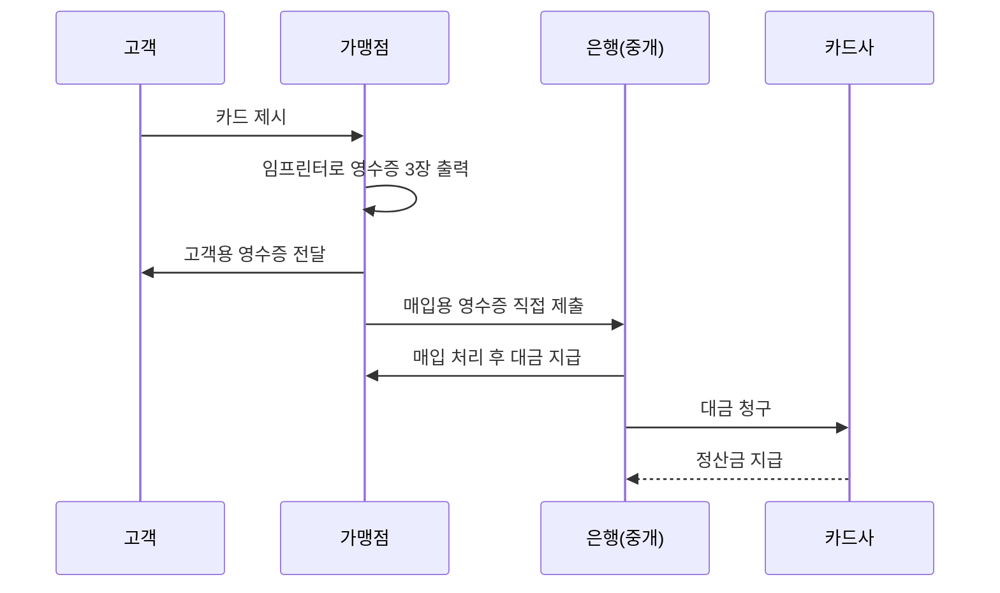
```mermaid
sequenceDiagram
    participant 고객
    participant 가맹점
    participant 은행(중개)
    participant 카드사

    고객->>가맹점: 카드 제시
    가맹점->>가맹점: 임프린터로 영수증 3장 출력
    가맹점->>고객: 고객용 영수증 전달
    가맹점->>은행(중개): 매입용 영수증 직접 제출
    은행(중개)->>가맹점: 매입 처리 후 대금 지급
    은행(중개)->>카드사: 대금 청구
    카드사-->>은행(중개): 정산금 지급
```

### 현재의 결제 방식 (전산화)

이제는 모든 과정이 실시간 전산 처리로 이루어집니다.

**오프라인 결제 방식 비교:**

| 구분 | 과거 | 현재 |
| --- | --- | --- |
| 카드 정보 입력 | 임프린터 (물리적 복사) | 마그네틱 / IC칩 / NFC |
| 승인 방식 | 수기 처리 | 실시간 전산 승인 |
| 매입 방식 | 직접 은행 방문 | VAN을 통한 자동 전송 |
| 영수증 | 3장 복사지 | 전자 영수증 / 종이 1장 |
| 정산 속도 | 수일 ~ 수주 | 영업일 기준 1~5일 |

### 1.2 현재의 오프라인 결제 구조

현재의 오프라인 결제는 크게 두 가지 경로로 나뉩니다.

**경로 1: VAN 결제 (기존 카드 단말기)**
- 실물 카드 단말기(터미널)을 이용
- 마그네틱 또는 IC칩 방식
- + 인앱 바코드 결제 추가

**경로 2: 오프라인 PG 결제**
- QR 결제, 간편결제 등
- PG 전용망을 통한 결제 방식
- 실물 단말기 없이 QR 코드나 앱으로 처리

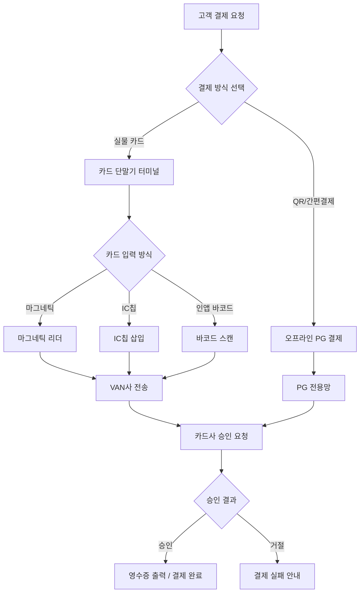
```mermaid
flowchart TD
    A[고객 결제 요청] --> B{결제 방식 선택}
    B -->|실물 카드| C[카드 단말기 터미널]
    B -->|QR/간편결제| D[오프라인 PG 결제]

    C --> E{카드 입력 방식}
    E -->|마그네틱| F[마그네틱 리더]
    E -->|IC칩| G[IC칩 삽입]
    E -->|인앱 바코드| H[바코드 스캔]

    F --> I[VAN사 전송]
    G --> I
    H --> I
    D --> J[PG 전용망]

    I --> K[카드사 승인 요청]
    J --> K

    K --> L{승인 결과}
    L -->|승인| M[영수증 출력 / 결제 완료]
    L -->|거절| N[결제 실패 안내]
```

**단말기 결제 상세 흐름:**

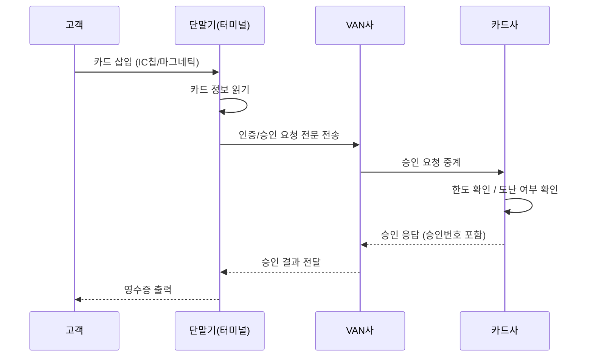
```mermaid
sequenceDiagram
    participant 고객
    participant 단말기(터미널)
    participant VAN사
    participant 카드사

    고객->>단말기(터미널): 카드 삽입 (IC칩/마그네틱)
    단말기(터미널)->>단말기(터미널): 카드 정보 읽기
    단말기(터미널)->>VAN사: 인증/승인 요청 전문 전송
    VAN사->>카드사: 승인 요청 중계
    카드사->>카드사: 한도 확인 / 도난 여부 확인
    카드사-->>VAN사: 승인 응답 (승인번호 포함)
    VAN사-->>단말기(터미널): 승인 결과 전달
    단말기(터미널)-->>고객: 영수증 출력
```

### 1.3 VAN이란 무엇인가

**VAN** (Value Added Network, 부가가치통신망): 카드사와 가맹점 사이에서 결제 데이터를 중계하는 부가통신망. 단순한 데이터 전달이 아니라 데이터 변환, 암호화, 라우팅 등 “부가가치”를 더해서 중계합니다.

**VAN사의 수익 구조:**
- 거래(Transaction) **건당** 수수료를 수취
- 카드사로부터 수수료를 받는 구조

**대표 국내 VAN사:**
- KSNET
- 나이스정보통신
- 한국정보통신 (KICC)

**VAN사의 역할:**
1. 가맹점 단말기와 카드사 사이의 통신 중계
2. 카드사별로 다른 통신 규격을 표준화
3. 데이터 암호화 및 보안 처리
4. 승인/거절 응답 전달

> **개발자 관점**: VAN사가 없다면 각 가맹점이 신한카드, KB국민카드, 삼성카드 등 카드사마다 개별 연동을 해야 합니다. VAN사 하나와만 연동하면 모든 카드사에 연결되는 구조입니다.
> 

---

## 2장. PG (Payment Gateway) 개요 및 도입 배경

> **핵심 요약**
PG는 온라인 결제를 가능하게 하는 결제 대행 서비스다.
온라인에서는 실물 단말기가 없으므로 PG가 카드사와의 연동을 대행해준다.
카드사에는 1차 PG가 하나의 “가맹점”으로 등록되어 있으며, 이를 CPID로 식별한다.
> 

### 2.1 왜 PG가 필요했는가

**도입 배경:**

오프라인 결제에서는 실물 단말기(터미널)이 있어서 카드를 물리적으로 읽을 수 있었습니다. 하지만 온라인 쇼핑몰에서는 단말기가 없습니다. 그렇다고 각 온라인 쇼핑몰이 카드사(신한, KB, 삼성, 현대 등)와 개별적으로 계약하고 연동 개발을 하는 것은 불가능에 가깝습니다.

**PG 없는 세상의 문제:**
- 쇼핑몰이 9개 카드사와 각각 계약 체결 필요
- 카드사마다 다른 연동 규격 개발 필요
- 카드사 심사 통과를 위한 높은 진입 장벽

**PG가 해결하는 것:**
- PG 하나와만 계약하면 모든 카드사 결제 가능
- 카드사 연동 개발은 PG가 담당
- 가맹점은 PG API 하나만 연동하면 됨

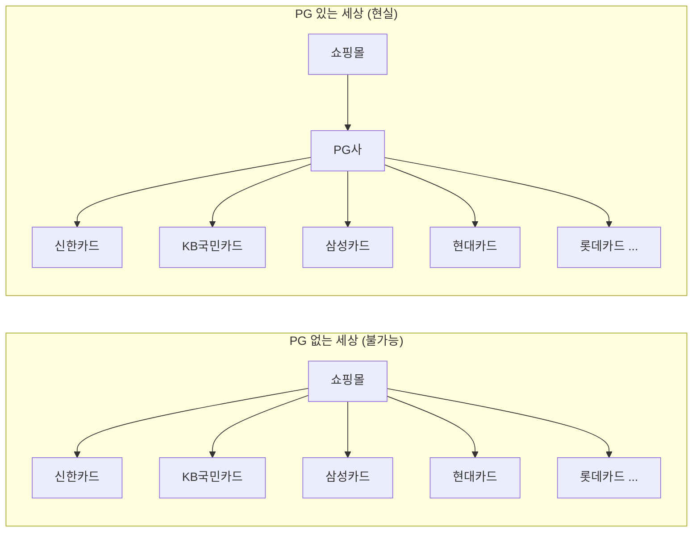
```mermaid
flowchart LR
    subgraph "PG 없는 세상 (불가능)"
        M1[쇼핑몰] --> C1[신한카드]
        M1 --> C2[KB국민카드]
        M1 --> C3[삼성카드]
        M1 --> C4[현대카드]
        M1 --> C5[롯데카드 ...]
    end

    subgraph "PG 있는 세상 (현실)"
        M2[쇼핑몰] --> PG[PG사]
        PG --> D1[신한카드]
        PG --> D2[KB국민카드]
        PG --> D3[삼성카드]
        PG --> D4[현대카드]
        PG --> D5[롯데카드 ...]
    end
```

**PG** (Payment Gateway, 결제 대행사): 온라인 결제를 중계하는 결제 대행사. 가맹점(쇼핑몰)을 대신해 카드사, 은행 등 금융기관과 연동하여 결제를 처리합니다.

**대표 국내 PG사:**
- KG이니시스
- NHN KCP
- 나이스페이먼츠
- 토스페이먼츠

### 2.2 카드사의 두 가지 역할: 매입사 vs 발급사

카드사에는 두 가지 역할이 있습니다. 이 구분을 모르면 정산 구조를 이해하기 어렵습니다.

| 구분 | 역할 | 설명 |
| --- | --- | --- |
| **매입사** (Acquirer) | 돈을 실제로 지급하는 카드사 | 가맹점에게 실제 대금을 송금하는 역할 |
| **발급사** (Issuer) | 카드만 발급하는 카드사 | 카드를 만들어 고객에게 주지만, 정산 대금 관리는 별도 |

**국내 주요 매입사 (9개):**
BC카드, 하나카드, 현대카드, 롯데카드, 삼성카드, 신한카드, KB국민카드, 우리카드, NH농협카드

> **비유로 이해하기**: 발급사는 “신분증(카드)을 만들어주는 곳”이고, 매입사는 “실제로 돈 계산을 책임지는 곳”입니다. 예를 들어 특정 제휴 카드는 발급은 A카드사가 하지만, 실제 정산 대금은 BC카드(매입사)가 처리하는 경우가 있습니다.
> 

### 2.3 PG의 수익 구조

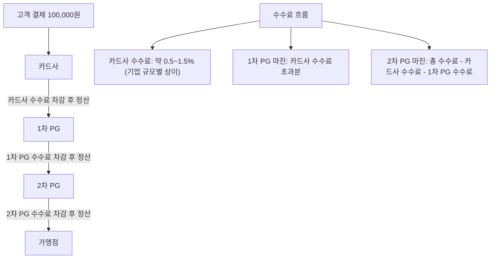
```mermaid
flowchart TD
    A[고객 결제 100,000원] --> B[카드사]
    B -->|카드사 수수료 차감 후 정산| C[1차 PG]
    C -->|1차 PG 수수료 차감 후 정산| D[2차 PG]
    D -->|2차 PG 수수료 차감 후 정산| E[가맹점]

    F[수수료 흐름]
    F --> G["카드사 수수료: 약 0.5~1.5% (기업 규모별 상이)"]
    F --> H["1차 PG 마진: 카드사 수수료 초과분"]
    F --> I["2차 PG 마진: 총 수수료 - 카드사 수수료 - 1차 PG 수수료"]
```

**CPID** (카드사 가맹점 번호): 카드사가 1차 PG에게 부여한 가맹점 식별 번호. 카드사 입장에서 1차 PG는 하나의 가맹점일 뿐이며, 이를 CPID로 관리한다. 기업 규모(영세/중소1/중소2/중소3/일반)에 따라 각각 별도 CPID가 발급된다.

**CPID 발급 구조:**

| 기업 규모 | CPID | 수수료율 |
| --- | --- | --- |
| 영세 | CPID_A | 가장 낮음 |
| 중소1 | CPID_B |  |
| 중소2 | CPID_C |  |
| 중소3 | CPID_D |  |
| 일반 | CPID_E | 가장 높음 |

> 하나의 카드사에서 기업 규모별로 5개의 CPID가 발급됩니다. VAN사도 카드사마다 다릅니다.
> 

---

## 3장. 1차 PG 상세 — 결제 수단별 완전 분석

> **핵심 요약**
1차 PG는 다양한 결제 수단(신용카드, 체크카드, 계좌이체, 가상계좌 등)을 지원한다.
각 결제 수단마다 인증 방식, 취소 방식, 정산 주기가 다르므로 이를 정확히 이해해야 한다.
특히 취소(전취소/후취소/부분취소) 처리 로직은 결제 수단마다 다르게 구현된다.
> 

### 1차 PG 결제 전체 흐름

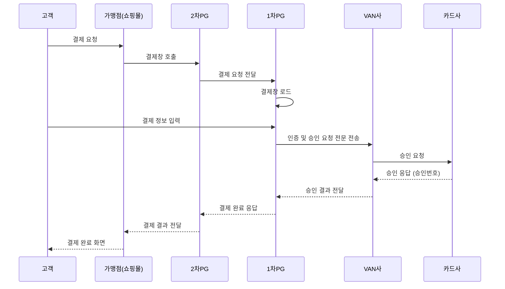
```mermaid
sequenceDiagram
    participant 고객
    participant 가맹점(쇼핑몰)
    participant 2차PG
    participant 1차PG
    participant VAN사
    participant 카드사

    고객->>가맹점(쇼핑몰): 결제 요청
    가맹점(쇼핑몰)->>2차PG: 결제창 호출
    2차PG->>1차PG: 결제 요청 전달
    1차PG->>1차PG: 결제창 로드
    고객->>1차PG: 결제 정보 입력
    1차PG->>VAN사: 인증 및 승인 요청 전문 전송
    VAN사->>카드사: 승인 요청
    카드사-->>VAN사: 승인 응답 (승인번호)
    VAN사-->>1차PG: 승인 결과 전달
    1차PG-->>2차PG: 결제 완료 응답
    2차PG-->>가맹점(쇼핑몰): 결제 결과 전달
    가맹점(쇼핑몰)-->>고객: 결제 완료 화면
```

### 3.1 신용카드 결제

신용카드는 가장 기본적이고 복잡한 결제 수단입니다.

### 신용카드 인증 방식

| 방식 | 설명 | 필요 정보 |
| --- | --- | --- |
| **인증 결제** | 인증 제휴사(MSP, 3DS 등)를 통해 인증 후 VAN을 통해 결제 | 카드 번호 + 인증 |
| **구인증** | 카드 번호 + 비밀번호로 결제 | 카드번호, 유효기간, 생년월일, 비밀번호 |
| **비인증 (수기결제)** | 카드 실물 없이 카드 정보만으로 결제 | 카드번호, 비밀번호 |
| **오프라인 결제** | 실물 단말기를 통한 결제 | 실물 카드 |

> **MSP, 3DS**: 카드 본인 인증 방식. MSP는 국내 방식, 3DS(3-Domain Secure)는 국제 카드사(Visa, Mastercard)에서 사용하는 인증 방식입니다.
> 

### 신용카드 취소 구조 (매우 중요!)

신용카드는 기본적으로 신용 기반의 선결제이므로, **매입 처리 전**에는 전산으로 즉시 취소가 가능합니다.

**매입** (Acquisition): 카드사가 실제로 가맹점에게 대금을 지급하기 위해 거래를 확정하는 절차. 승인 후 일정 기간이 지나면 매입이 진행됩니다.

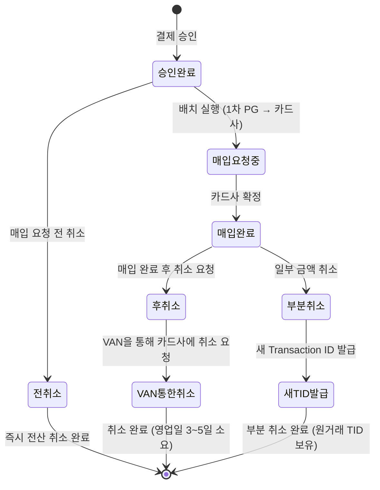
```mermaid
stateDiagram-v2
    [*] --> 승인완료: 결제 승인

    승인완료 --> 전취소: 매입 요청 전 취소
    승인완료 --> 매입요청중: 배치 실행 (1차 PG → 카드사)

    전취소 --> [*]: 즉시 전산 취소 완료

    매입요청중 --> 매입완료: 카드사 확정
    매입완료 --> 후취소: 매입 완료 후 취소 요청
    후취소 --> VAN통한취소: VAN을 통해 카드사에 취소 요청
    VAN통한취소 --> [*]: 취소 완료 (영업일 3~5일 소요)

    매입완료 --> 부분취소: 일부 금액 취소
    부분취소 --> 새TID발급: 새 Transaction ID 발급
    새TID발급 --> [*]: 부분 취소 완료 (원거래 TID 보유)
```

**취소 유형 비교:**

| 취소 유형 | 시점 | 처리 방법 | TRX_ST_CD |
| --- | --- | --- | --- |
| **전취소** | 매입 요청 전 | 전산 처리만으로 즉시 취소 | 1 |
| **후취소** | 매입 완료 후 | VAN을 통해 카드사에 취소 요청 | 2 |
| **부분취소** | 매입 완료 후 | 새 TID 발급 후 후취소 처리 | 2 (후취소로 처리) |

> **개발자 주의사항**: 부분취소는 새로운 Transaction ID(TID)가 발급되지만, 원거래 TID는 반드시 보유하고 있어야 합니다. 카드사에서도 새로운 취소 TID가 나가므로 DB 설계 시 원거래 TID 참조 컬럼이 필요합니다.
> 

### 3.2 체크카드 결제

체크카드는 신용카드와 겉으로는 비슷해 보이지만, 내부 처리 방식이 근본적으로 다릅니다.

**핵심 차이점: 즉시 계좌이체 발생**

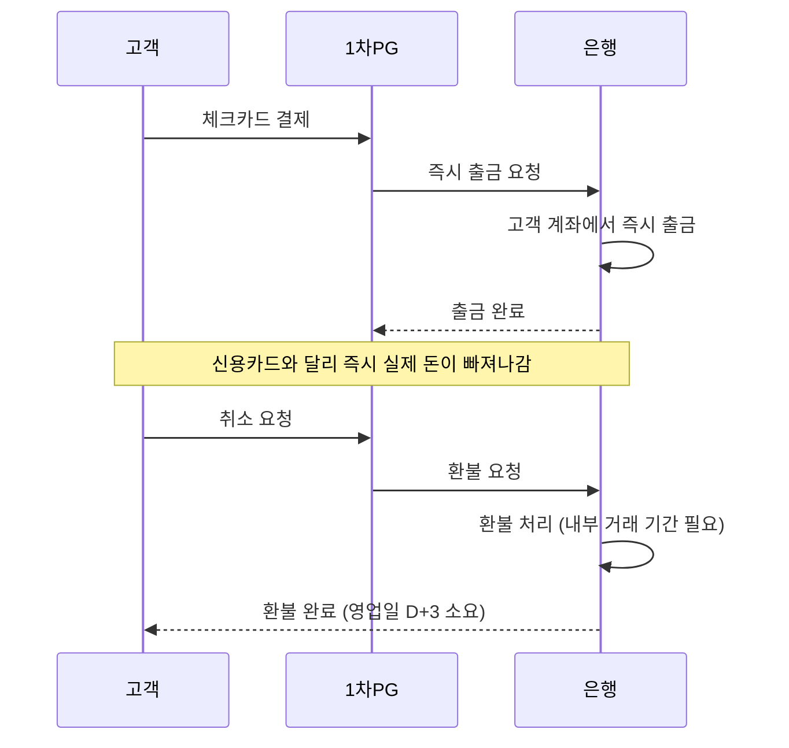
```mermaid
sequenceDiagram
    participant 고객
    participant 1차PG
    participant 은행

    고객->>1차PG: 체크카드 결제
    1차PG->>은행: 즉시 출금 요청
    은행->>은행: 고객 계좌에서 즉시 출금
    은행-->>1차PG: 출금 완료

    Note over 고객,은행: 신용카드와 달리 즉시 실제 돈이 빠져나감

    고객->>1차PG: 취소 요청
    1차PG->>은행: 환불 요청
    은행->>은행: 환불 처리 (내부 거래 기간 필요)
    은행-->>고객: 환불 완료 (영업일 D+3 소요)
```

**체크카드 취소의 특이점:**
- 신용카드는 “미지급 취소”지만, 체크카드는 “이미 빠져나간 돈을 돌려주는 환불”
- 환불 처리에 **영업일 기준 D+3일** 정도 소요 (은행 내부 거래 기간)
- 고객 입장에서는 즉시 취소처럼 보여도 실제 입금까지 시간이 필요

### 3.3 계좌이체 결제

계좌이체는 은행 공동망 또는 Open API를 통해 처리됩니다.

**은행 공동망**: 은행 간 자금 이체를 위한 국가 공인 네트워크. **정부 허가제**로 운영되며, 아무나 접근할 수 없습니다.

**계좌이체 제휴사:**
- 쿠콘 (금융 VAN 방식)
- 헥토

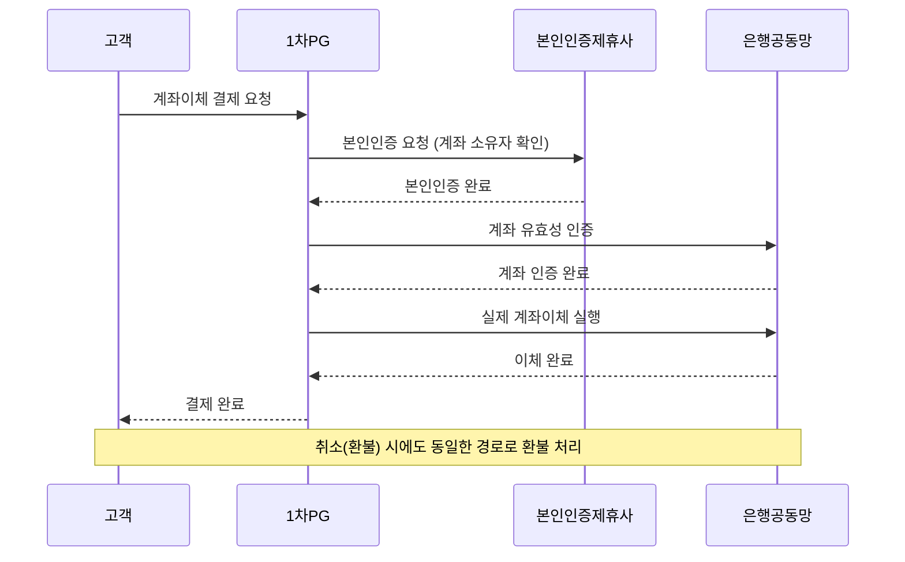
```mermaid
sequenceDiagram
    participant 고객
    participant 1차PG
    participant 본인인증제휴사
    participant 은행공동망

    고객->>1차PG: 계좌이체 결제 요청
    1차PG->>본인인증제휴사: 본인인증 요청 (계좌 소유자 확인)
    본인인증제휴사-->>1차PG: 본인인증 완료
    1차PG->>은행공동망: 계좌 유효성 인증
    은행공동망-->>1차PG: 계좌 인증 완료
    1차PG->>은행공동망: 실제 계좌이체 실행
    은행공동망-->>1차PG: 이체 완료
    1차PG-->>고객: 결제 완료

    Note over 고객,은행공동망: 취소(환불) 시에도 동일한 경로로 환불 처리
```

**계좌이체 취소:**
- 체크카드와 동일하게 즉시 송금이 발생하므로 **환불 프로세스** 진행
- 환불 요청을 통해 취소 처리

### 3.4 가상계좌 결제

가상계좌는 독특한 결제 방식으로, 고객에게 일시적인 전용 계좌번호를 부여하여 입금을 유도합니다.

**가상계좌 방식 2가지:**

| 방식 | 설명 | 주의사항 |
| --- | --- | --- |
| **실시간 발급** | 은행 공동망에서 실시간으로 사용 가능한 계좌를 받아 고객에게 전달 후 파기 | 건별 발급/파기로 비용 발생 |
| **Pool 방식** | 미리 계좌 Pool을 보유하고, 그 중에서 사용 가능한 계좌를 할당 | **동일 계좌번호가 여러 고객에게 재사용될 수 있음** |

> **Pool 방식 개발 시 주의**: 같은 계좌번호가 여러 거래에 재사용되기 때문에, 이전 거래가 완전히 마무리되었는지 확인하는 방어 로직이 반드시 필요합니다. 입금 이벤트 수신 시 어느 거래의 입금인지 정확히 매핑해야 합니다.
> 

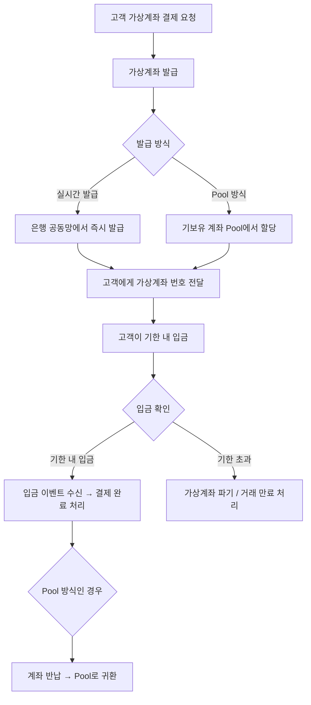
```mermaid
flowchart TD
    A[고객 가상계좌 결제 요청] --> B[가상계좌 발급]
    B --> C{발급 방식}
    C -->|실시간 발급| D[은행 공동망에서 즉시 발급]
    C -->|Pool 방식| E[기보유 계좌 Pool에서 할당]

    D --> F[고객에게 가상계좌 번호 전달]
    E --> F

    F --> G[고객이 기한 내 입금]
    G --> H{입금 확인}
    H -->|기한 내 입금| I[입금 이벤트 수신 → 결제 완료 처리]
    H -->|기한 초과| J[가상계좌 파기 / 거래 만료 처리]

    I --> K{Pool 방식인 경우}
    K --> L[계좌 반납 → Pool로 귀환]
```

**가상계좌 제휴사:**
- 헥토
- 쿠콘

### 3.5 상품권 결제

문화상품권, 온누리상품권 등 각 상품권사의 API에 맞게 개별 연동이 필요합니다.

**처리 구조:**
- 각 상품권사 API 규격이 모두 다름
- 상품권 잔액은 해당 상품권사의 회원 시스템에서 관리
- PG에서는 잔액 조회 → 결제 → 결과 수신 방식으로 처리

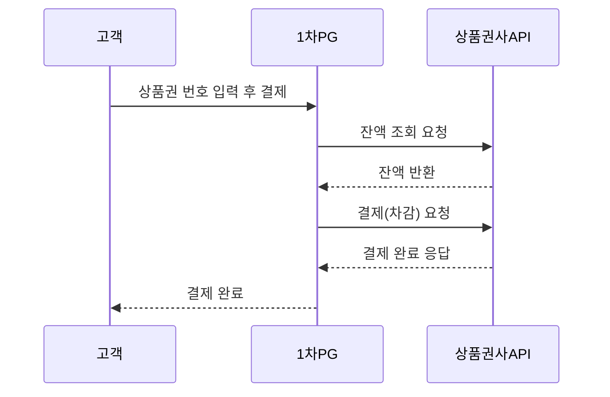
```mermaid
sequenceDiagram
    participant 고객
    participant 1차PG
    participant 상품권사API

    고객->>1차PG: 상품권 번호 입력 후 결제
    1차PG->>상품권사API: 잔액 조회 요청
    상품권사API-->>1차PG: 잔액 반환
    1차PG->>상품권사API: 결제(차감) 요청
    상품권사API-->>1차PG: 결제 완료 응답
    1차PG-->>고객: 결제 완료
```

### 3.6 빌링 결제 (자동결제)

**빌링 결제** (Billing): 구독 서비스처럼 사전에 등록된 카드로 주기적으로 자동 결제가 이루어지는 방식.

**핵심 개념:**
- 최초 1회 카드 등록 (카드번호, CVC 등 비인증 정보 저장)
- 이후 배치(Batch)에서 주기적으로 결제 요청 자동 발송
- 구독 서비스, 정기 결제 등에 활용

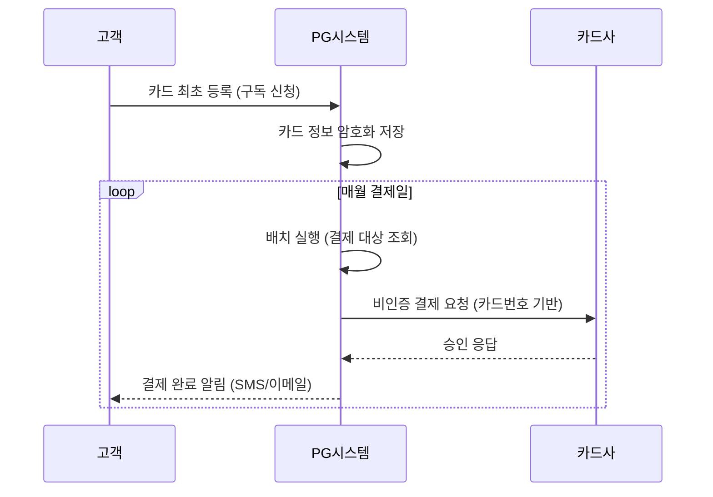
```mermaid
sequenceDiagram
    participant 고객
    participant PG시스템
    participant 카드사

    고객->>PG시스템: 카드 최초 등록 (구독 신청)
    PG시스템->>PG시스템: 카드 정보 암호화 저장

    loop 매월 결제일
        PG시스템->>PG시스템: 배치 실행 (결제 대상 조회)
        PG시스템->>카드사: 비인증 결제 요청 (카드번호 기반)
        카드사-->>PG시스템: 승인 응답
        PG시스템-->>고객: 결제 완료 알림 (SMS/이메일)
    end
```

> **보안 주의사항**: 비인증 결제에 사용되는 카드 정보는 암호화하여 저장해야 하며, PCI-DSS 기준을 준수해야 합니다.
> 

### 3.7 간편결제

삼성페이, 네이버페이, 카카오페이 등 기업이 제공하는 간편결제도 결국 1차 PG의 망을 사용합니다.

**간편결제사:**
- 카카오페이
- 네이버페이
- 삼성페이
- 페이코

**구조적 이해:**
- 간편결제 서비스는 사용자 편의를 위한 UI/UX 레이어
- 실제 결제 처리는 1차 PG를 통해 카드사로 전달
- 간편결제사도 PG 라이센스를 보유하는 경우가 많음


```mermaid
flowchart LR
    A[고객] -->|카카오페이/네이버페이 선택| B[간편결제 앱]
    B -->|내부 카드 정보 사용| C[1차 PG 연동]
    C --> D[VAN사]
    D --> E[카드사]
```

### 3.8 복합결제

여러 결제 수단을 혼합하여 하나의 주문을 결제하는 방식입니다.

**예시**: 총 50,000원 결제 시
- 상품권으로 20,000원 결제
- 포인트로 10,000원 결제
- 신용카드로 나머지 20,000원 결제

**개발 시 핵심 고려사항:**

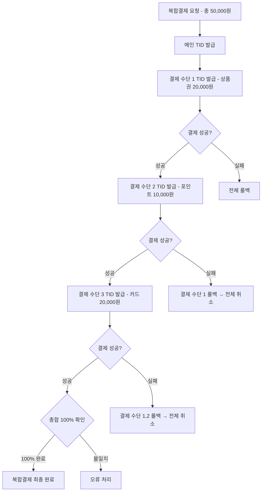
```mermaid
flowchart TD
    A[복합결제 요청 - 총 50,000원] --> B[메인 TID 발급]
    B --> C[결제 수단 1 TID 발급 - 상품권 20,000원]
    C --> D{결제 성공?}
    D -->|성공| E[결제 수단 2 TID 발급 - 포인트 10,000원]
    D -->|실패| F[전체 롤백]

    E --> G{결제 성공?}
    G -->|성공| H[결제 수단 3 TID 발급 - 카드 20,000원]
    G -->|실패| I[결제 수단 1 롤백 → 전체 취소]

    H --> J{결제 성공?}
    J -->|성공| K{총합 100% 확인}
    J -->|실패| L[결제 수단 1,2 롤백 → 전체 취소]

    K -->|100% 완료| M[복합결제 최종 완료]
    K -->|불일치| N[오류 처리]
```

> **개발자 주의사항**: 복합결제에서 중간에 하나의 결제 수단이 실패하면, 이미 성공한 결제 수단을 모두 롤백해야 합니다. 롤백 로직이 완벽하지 않으면 고객 돈이 차감되었는데 결제가 완료되지 않는 심각한 오류가 발생합니다.
> 

### 3.9 선불결제

자체 충전 후 사용하는 방식으로, 카드사나 은행을 거치지 않고 자체 처리가 가능합니다.

**선불결제 구조:**

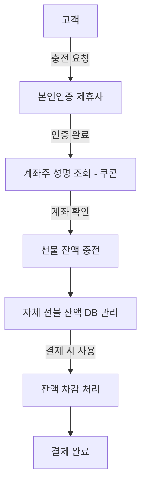
```mermaid
flowchart TD
    A[고객] -->|충전 요청| B[본인인증 제휴사]
    B -->|인증 완료| C[계좌주 성명 조회 - 쿠콘]
    C -->|계좌 확인| D[선불 잔액 충전]
    D --> E[자체 선불 잔액 DB 관리]
    E -->|결제 시 사용| F[잔액 차감 처리]
    F --> G[결제 완료]
```

**핵심 특징:**
- 카드사 / 은행 불필요 → 자체 처리 가능
- 단, **금융서비스 라이센스** 보유 필수 (금감원 허가)
- 회원 관리 시스템 필요
- 계좌 성명 조회: 쿠콘 API 활용 (본인인증과는 별도 프로세스)

> **계좌주 성명 조회 vs 본인인증**: 이 둘은 다릅니다. 성명 조회는 “이 계좌가 이 사람 것이 맞나?” 확인이고, 본인인증은 “이 사람이 실제 본인인가?” 확인입니다.
> 

### 3.10 모바일 결제

휴대폰 소액결제로, 통신사를 통해 결제하고 다음 달 통신 요금에 합산하는 방식입니다.

**연동 통신사:**
- KT
- LG U+
- SKT

**모바일 결제의 긴 정산 주기:**

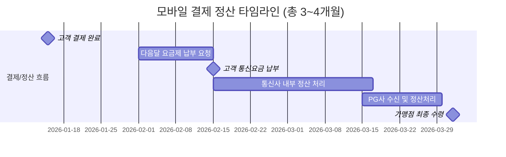
```mermaid
gantt
    title 모바일 결제 정산 타임라인 (총 3~4개월)
    dateFormat  YYYY-MM-DD
    section 결제/정산 흐름
    고객 결제 완료        :milestone, m1, 2026-01-15, 0d
    다음달 요금제 납부 요청  :a1, 2026-02-01, 14d
    고객 통신요금 납부     :milestone, m2, 2026-02-15, 0d
    통신사 내부 정산 처리   :a2, 2026-02-15, 30d
    PG사 수신 및 정산처리  :a3, 2026-03-15, 15d
    가맹점 최종 수령       :milestone, m3, 2026-04-01, 0d
```

**정산까지 3~4개월이 걸리는 이유:**
1. 결제 완료 → 다음 달 통신 요금 청구서에 포함
2. 고객이 통신 요금 납부
3. 통신사 내부 정산 처리
4. PG사에서 수신 및 정산 처리
5. 가맹점 전달

> **PM/비즈니스 관점**: 모바일 결제는 정산 주기가 3~4개월로 매우 길기 때문에, 가맹점 정산 일정 설계 시 별도로 관리해야 합니다. 현금 흐름(Cash Flow) 리스크를 가맹점에게 미리 안내하는 것이 중요합니다.
> 

---

## 4장. 2차 PG 및 PG사 계층 구조

> **핵심 요약**
2차 PG는 1차 PG와 실제 가맹점 사이에서 “선정산” 서비스를 제공한다.
1차 PG 정산까지 걸리는 3~5 영업일의 리스크를 2차 PG가 대신 짊어지고, 그 대가로 수수료를 수취한다.
PG 서비스를 제공하려면 금감원 라이센스가 반드시 필요하다.
> 

### 4.1 2차 PG의 존재 이유: 선정산

**정산 지연의 문제:**
- 1차 PG에서 매입 요청 배치: D+1 영업일
- VAN사 재정리 및 카드사 전달: 추가 1~2 영업일
- 카드사 내부 처리: 추가 1~2 영업일
- **총 영업일 기준 3~5일 소요**

**선정산** (Pre-Settlement): 실제 카드사 정산 완료 전에, 2차 PG가 먼저 가맹점에게 대금을 지급하는 방식.

**2차 PG의 수익 구조:**

```
2차 PG 수수료 = 총 수수료 - 카드사 수수료 - 1차 PG 수수료
```

**리스크 구조:**
- **High Risk → High Return**: 2차 PG는 카드사로부터 정산을 받기 전에 가맹점에게 먼저 지급
- 카드사 정산 실패, 취소 처리 지연 등의 리스크를 2차 PG가 부담
- 이 리스크에 대한 보상으로 수수료 수취

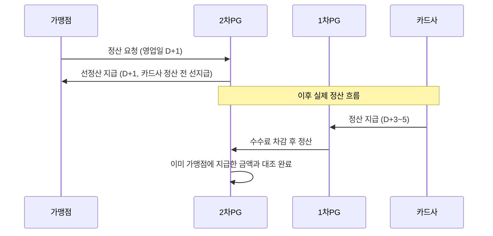
```mermaid
sequenceDiagram
    participant 가맹점
    participant 2차PG
    participant 1차PG
    participant 카드사

    가맹점->>2차PG: 정산 요청 (영업일 D+1)
    2차PG->>가맹점: 선정산 지급 (D+1, 카드사 정산 전 선지급)

    Note over 2차PG,카드사: 이후 실제 정산 흐름
    카드사->>1차PG: 정산 지급 (D+3~5)
    1차PG->>2차PG: 수수료 차감 후 정산
    2차PG->>2차PG: 이미 가맹점에 지급한 금액과 대조 완료
```

### 4.2 PG사 전체 계층도

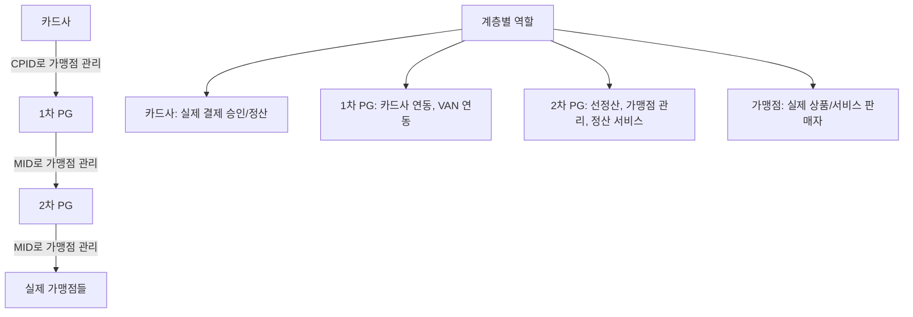
```mermaid
flowchart TD
    A[카드사] -->|CPID로 가맹점 관리| B[1차 PG]
    B -->|MID로 가맹점 관리| C[2차 PG]
    C -->|MID로 가맹점 관리| D[실제 가맹점들]

    E[계층별 역할]
    E --> F["카드사: 실제 결제 승인/정산"]
    E --> G["1차 PG: 카드사 연동, VAN 연동"]
    E --> H["2차 PG: 선정산, 가맹점 관리, 정산 서비스"]
    E --> I["가맹점: 실제 상품/서비스 판매자"]
```

**CPID vs MID 차이:**

| 구분 | 발급 주체 | 관리 대상 | 역할 |
| --- | --- | --- | --- |
| CPID | 카드사 | 1차 PG | 카드사가 1차 PG를 가맹점으로 식별하는 번호 |
| MID | PG사 | 하위 가맹점 | PG사가 자신의 가맹점을 식별하는 번호 |

**2차 PG의 특징:**
- 1차 PG와 달리 **하나의 CPID**로 모든 거래 처리
- 기업 규모(영세/중소)는 1차 PG가 구분하여 처리
- 2차 PG는 거래 대사(Reconciliation)를 통해 검증 후 가맹점에게 정산
- **금감원 심사 통과 필수** (라이센스 없이는 정산 서비스 제공 불가)

**왜 2차 PG 하위로는 더 생기지 않는가?**
> PG 서비스를 제공하기 위해서는 금감원 심사를 통과하고 PG 라이센스를 보유해야 합니다. 이 라이센스 진입 장벽으로 인해 무한히 레이어가 생기지 않습니다. (3차, 4차 PG는 존재하지 않음)

### 4.3 가맹점 구분: 직가맹 vs 대표가맹점

| 구분 | 설명 | 정산 주체 |
| --- | --- | --- |
| **직가맹** | 1차 PG와 직접 계약한 가맹점 | 1차 PG에서 직접 정산 |
| **대표가맹점** | 2차 PG를 통해 계약한 가맹점 | 2차 PG에서 정산 |

**오픈마켓 예시:**
- 오픈마켓 자체 = 대표가맹점
- 오픈마켓 하위의 개별 판매자 = 하위몰
- 하위몰은 오픈마켓에서 직접 정산받지 못하므로 → 2차 PG 또는 1차 PG에서 별도 정산

---

## 5장.  돈이 움직이는 방식

> **핵심 요약**
정산은 하루 한 번 배치로 실행되며, 가맹점 계약 수수료 기준으로 금액을 계산하여 송금한다.
정산 종류는 일반정산, 차액정산(영중소), 환급정산 세 가지가 있다.
망취소는 DB 적재 실패 시 발동하는 안전장치이며, 부분취소는 총금액 100% 취소라는 제약을 반드시 지켜야 한다.
> 

### 5.1 정산의 기본 개념

**대사** (Reconciliation): PG사와 카드사 간의 거래 데이터를 비교·검증하여 오차를 확인하는 과정.

**정산 전체 흐름:**

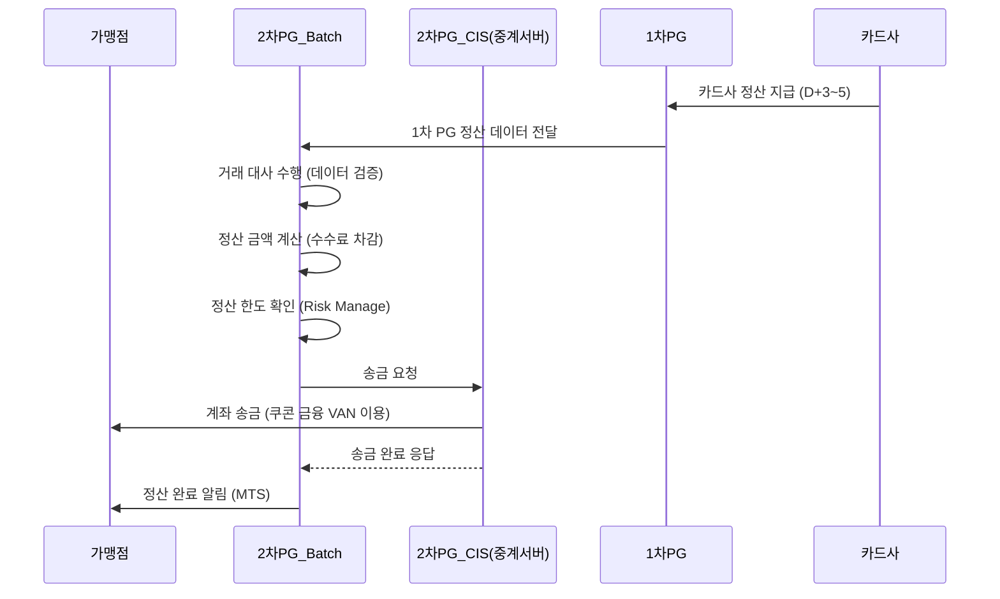
```mermaid
sequenceDiagram
    participant 가맹점
    participant 2차PG_Batch
    participant 2차PG_CIS(중계서버)
    participant 1차PG
    participant 카드사

    카드사->>1차PG: 카드사 정산 지급 (D+3~5)
    1차PG->>2차PG_Batch: 1차 PG 정산 데이터 전달
    2차PG_Batch->>2차PG_Batch: 거래 대사 수행 (데이터 검증)
    2차PG_Batch->>2차PG_Batch: 정산 금액 계산 (수수료 차감)
    2차PG_Batch->>2차PG_Batch: 정산 한도 확인 (Risk Manage)
    2차PG_Batch->>2차PG_CIS(중계서버): 송금 요청
    2차PG_CIS(중계서버)->>가맹점: 계좌 송금 (쿠콘 금융 VAN 이용)
    2차PG_CIS(중계서버)-->>2차PG_Batch: 송금 완료 응답
    2차PG_Batch->>가맹점: 정산 완료 알림 (MTS)
```

**정산 금액 계산 공식:**

```
정산 지급액 = 총 결제 금액
           - 카드사 수수료
           - 1차 PG 수수료
           - 2차 PG 수수료
           + 차액정산 추가금 (해당하는 경우)
           + 환급정산 추가금 (해당하는 경우)
```

### 5.2 정산 종류 상세

### 1) 일반 정산

가장 기본적인 정산 방식입니다.

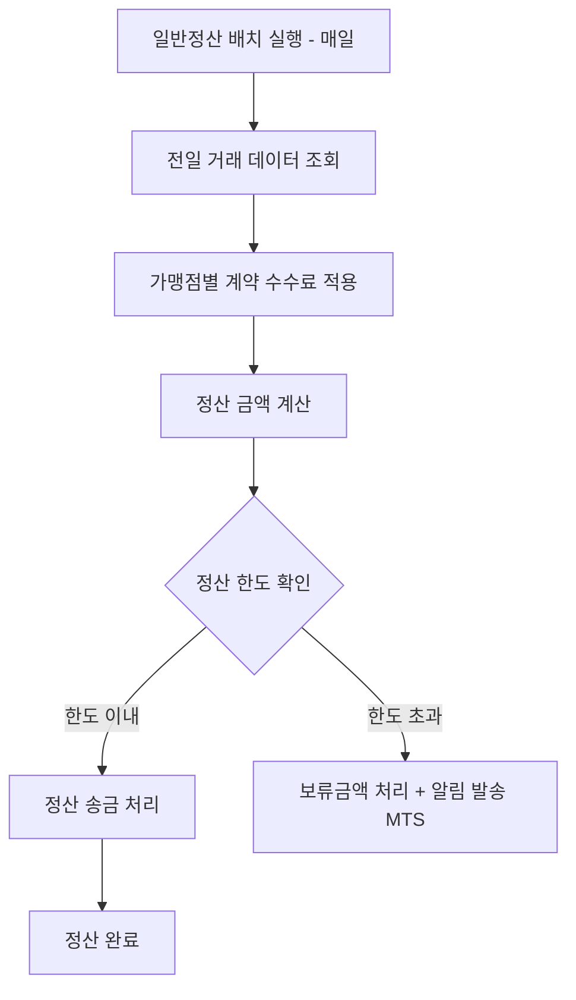
```mermaid
flowchart TD
    A[일반정산 배치 실행 - 매일] --> B[전일 거래 데이터 조회]
    B --> C[가맹점별 계약 수수료 적용]
    C --> D[정산 금액 계산]
    D --> E{정산 한도 확인}
    E -->|한도 이내| F[정산 송금 처리]
    E -->|한도 초과| G[보류금액 처리 + 알림 발송 MTS]
    F --> H[정산 완료]
```

**흐름 요약:**
1. 카드사 → 1차 PG 정산
2. 1차 PG → 2차 PG 정산 (수수료 차감)
3. 2차 PG → 가맹점 정산 (수수료 차감)

### 2) 차액정산 (영세/중소 기업 혜택)

기업 규모에 따른 우대 수수료 혜택을 사후에 정산해주는 방식입니다.

**배경**: 정부는 영세·중소 가맹점을 보호하기 위해 카드 수수료율을 기업 규모에 따라 차등 적용합니다.

| 기업 규모 | 연간 매출 기준 (예시) | 우대 수수료율 |
| --- | --- | --- |
| 영세 | 3억 미만 | 가장 낮음 |
| 중소1 | 3억~5억 |  |
| 중소2 | 5억~10억 |  |
| 중소3 | 10억~30억 |  |
| 일반 | 30억 초과 | 기본 수수료율 |

**차액정산 발생 구조:**

```mermaid
flowchart TD
    A[결제 발생] --> B[2차 PG는 일반 CPID로 처리]
    B --> C[카드사: 일반 수수료로 정산]
    C --> D[실제 가맹점은 영세/중소 기업]
    D --> E{기업 규모 확인}
    E --> F[영세/중소 우대 수수료와의 차액 계산]
    F --> G[거래 발생 시마다 차액정산 추가 지급]
```

> **중요**: 차액정산은 거래가 발생할 때마다 추가 정산이 진행되는 구조입니다. 일반정산과 별개로 처리됩니다.
> 

### 3) 환급정산 (상반기/하반기)

기업 규모가 변경될 때 소급하여 정산하는 방식입니다.

**배경**: 기업 규모 리스트는 국세청이 **상반기/하반기 연 2회** 업데이트합니다.

**시나리오:**

```mermaid
gantt
    title 환급정산 발생 시나리오
    dateFormat  YYYY-MM
    section 기업 규모 변경
    일반으로 결제 처리 중 :a1, 2026-01, 6M
    국세청 기업규모 리스트 업데이트 :milestone, m1, 2026-07, 0d
    영세 기업으로 확인됨 :a2, 2026-07, 1M
    section 환급정산
    이전 6개월치 차액 소급 환급 :a3, 2026-07, 1M
```

**환급정산 프로세스:**
1. 처음 사업 등록 시 → “일반” 기업으로 등록 (우대 혜택 없음)
2. 국세청 기업 규모 업데이트 → 영세/중소로 확인
3. 이전 기간의 결제 데이터 소급 계산
4. 차액에 해당하는 금액을 **일괄 환급** (1년에 최대 2번 + 중간 국세청 업데이트 시)

### 5.3 망취소 (Network Cancellation)

**망취소** (Network Cancellation): 결제 승인 또는 처리 후, PG 시스템에 데이터가 정상적으로 저장되지 않았을 때 자동으로 해당 승인을 취소하는 절차.

**발생 시나리오:**

```mermaid
flowchart TD
    A[결제 승인 요청] --> B[카드사/1차 PG에서 승인 완료]
    B --> C[2차 PG DB 저장 시도]
    C --> D{DB 저장 성공?}
    D -->|성공| E[정상 결제 완료]
    D -->|실패 - 오류/타임아웃| F[데이터 불일치 상태]
    F --> G[망취소 발동]
    G --> H[VAN/카드사에 취소 요청 전송]
    H --> I[취소 완료 - 고객 카드에 미청구]
```

**망취소가 필요한 이유:**
- 카드사/1차 PG에서는 “승인됨”으로 처리되었지만
- 2차 PG DB에는 기록이 없는 상태
- 이 불일치를 방치하면 **고객은 결제됐는데 시스템에는 기록 없음** → 심각한 문제
- 망취소로 카드사 승인을 취소하여 불일치 해소

> **개발자 주의**: 망취소 로직은 타임아웃, 네트워크 오류, DB 장애 등 다양한 예외 상황을 모두 처리해야 합니다. 망취소가 실패하면 수동으로 대응해야 하므로 알림 시스템과 함께 구축해야 합니다.
> 

### 5.4 부분취소 처리 로직

부분취소는 총 결제 금액의 일부만 취소하는 방식입니다. 반드시 **최종적으로 총합 100%** 취소가 되어야 합니다.

**부분취소가 복잡한 이유:**
- 부가세, 면세 금액 등이 섞여 있는 경우
- 각 제휴사/카드사마다 취소 규격이 다름
- 1원의 오차도 없이 처리되어야 함

**나이스페이(NicePay) 사례:**

```
전체 결제: 100,000원 (부가세 9,090원 + 공급가액 90,910원)

1차 취소: 30,000원 (정률 취소)
2차 취소: 70,000원 (남은 금액 전액 취소 - 보정 처리)
최종 합계: 30,000 + 70,000 = 100,000원 (100% 완전 취소)
```

```mermaid
flowchart TD
    A[부분취소 요청 - 30,000원] --> B[새 취소 TID 발급]
    B --> C[원거래 TID 참조 보유]
    C --> D[카드사에 취소 전문 전송 - 새 TID]
    D --> E[카드사 취소 처리]
    E --> F[취소 1회 완료]

    F --> G{총 취소 금액 확인}
    G -->|100% 미만| H[추가 부분취소 가능]
    G -->|100% 달성| I[거래 완전 종료]

    H --> J[마지막 취소 시 보정 처리]
    J --> I
```

**DB 설계 포인트:**
- 원거래 TID와 취소 TID를 모두 보유
- 취소 금액의 누적 합산 컬럼 필요
- 취소 상태: TRX_ST_CD = 2 (후취소)

### 5.5 취소 유형 정리: 전취소 vs 후취소

```mermaid
stateDiagram-v2
    [*] --> 결제승인: 고객 결제

    결제승인 --> 전취소가능: 매입 배치 전
    전취소가능 --> 취소완료_즉시: 전취소 (TRX_ST_CD = 1)
    취소완료_즉시 --> [*]

    결제승인 --> 매입처리: 1차 PG 배치 실행
    매입처리 --> 후취소필요: 매입 완료
    후취소필요 --> VAN취소요청: 후취소 (TRX_ST_CD = 2)
    VAN취소요청 --> 취소완료_지연: 영업일 3~5일
    취소완료_지연 --> [*]
```

---

## 6장. 시스템 아키텍처 — 우리 회사 서버 구성

> **핵심 요약**
우리 회사의 결제 시스템은 내부망/외부망을 명확히 분리한 구조다.
BLD(승인 서버)는 Netty 기반으로 고성능 비동기 처리를 담당한다.
Batch 서버는 Spring Batch + Quartz 조합으로 정산/빌링/알림 JOB을 관리한다.
> 

### 6.1 전체 서버 구성도

- 정확하게는 Web Server에서 reverse Proxy구조, 방화벽상으로는 Front와 Mts가 외부로 통신이 되게 되어있을 뿐

```mermaid
flowchart TD
    subgraph "외부망 (인터넷)"
        USER[고객/가맹점]
        EXT_API[외부 제휴사 API]
    end

    subgraph "DMZ (경계망)"
        FRONT[Front Server\n결제 페이지\nJava/Spring/JSP]
        CIS[CIS 중계 서버\n계좌조회·송금\nJava/Spring]
        MTS[MTS 메일링 서비스\nSMS/Mail/알림톡\nJava/Spring]
    end

    subgraph "내부망"
        BLD[BLD 승인 서버\nVAN/PG 연동\nJava/Netty]
        IMS[IMS 내부관리 Back Office\nJava/Spring/JSP]
        MMS[MMS 가맹점관리 Back Office\nJava/Spring/JSP]
        BATCH[Batch 서버\n정산/빌링/알림\nSpring Batch 4.x]
        DB[(MariaDB / MySQL\n+ MyBatis)]
    end

    subgraph "외부 금융망"
        VAN[VAN사\nKSNET 등]
        CARD[카드사\n신한/KB/삼성 등]
        BANK[은행 공동망]
        COUCON[쿠콘\n계좌조회·송금 VAN]
    end

    USER -->|결제 요청| FRONT
    FRONT -->|승인 요청| BLD
    BLD -->|VAN 연동| VAN
    VAN -->|카드사 연동| CARD
    BLD <-->|DB 저장/조회| DB
    FRONT <-->|세션/데이터| DB
    IMS <-->|운영자 관리| DB
    MMS <-->|가맹점 관리| DB
    BATCH -->|정산 처리| DB
    BATCH -->|알림 요청| MTS
    BATCH -->|송금 요청| CIS
    CIS -->|계좌이체/조회| COUCON
    COUCON -->|금융 VAN| BANK
    MTS -->|SMS/Mail| EXT_API
    USER -->|가맹점 어드민| MMS
```

### 6.2 각 서버 상세 설명

### IMS (Internal Management System) — 내부 관리 Back Office

| 항목 | 내용 |
| --- | --- |
| 역할 | 운영자(사내 직원)의 업무를 지원하는 관리자 시스템 |
| 주요 기능 | 거래 조회, 수동 정산 처리, 가맹점 승인/거절, 이상 거래 모니터링 |
| 기술 스택 | Java / Spring Web / JSP / jQuery / JavaScript |
| 접근 대상 | 사내 운영자, CS팀, 정산팀 |

### MMS (Merchant Management System) — 가맹점 관리 Back Office

| 항목 | 내용 |
| --- | --- |
| 역할 | 가맹점 업무를 지원하는 관리 포털 |
| 주요 기능 | 가맹점 거래 조회, 정산 내역 조회, 계좌 관리, API 키 발급 |
| 기술 스택 | Java / Spring Web / JSP / jQuery / JavaScript |
| 접근 대상 | 가맹점 담당자 |

### Front (결제 페이지 서버) — 외부망 연결

| 항목 | 내용 |
| --- | --- |
| 역할 | 고객이 실제로 보는 결제창 로드 및 처리 |
| 주요 기능 | 카드사별/제휴사별 결제 UI 제공, 결제 정보 입력 수신 |
| 기술 스택 | Java / Spring Web / JSP / jQuery / JavaScript |
| 특이사항 | **외부망과 직접 연결**된 유일한 서버 (보안 매우 중요) |

### BLD (승인 서버) — 핵심 결제 처리

| 항목 | 내용 |
| --- | --- |
| 역할 | 실제 결제 승인/취소 처리 |
| 주요 기능 | VAN 연동, 1차 PG 연동, 승인 전문 처리, 망취소 처리 |
| 기술 스택 | Java / **Netty** (비동기 고성능 네트워크 프레임워크) |
| 왜 Netty? | 결제 승인은 대량의 동시 요청을 처리해야 하므로 블로킹 I/O보다 비동기 Netty가 적합 |

> **개발자 설명**: Netty는 Spring MVC 같은 전통적인 블로킹 방식이 아닌, 이벤트 기반 비동기 방식으로 동작합니다. 수천 건의 동시 결제 요청을 처리할 때 스레드를 낭비하지 않아 성능이 월등합니다.
> 

### MTS (Mail & Text Service) — 메시징 서버

| 항목 | 내용 |
| --- | --- |
| 역할 | 각종 알림 메시지 발송 |
| 주요 기능 | SMS 발송 (건당 수수료), 이메일 발송 (SMTP), 카카오 알림톡 |
| 기술 스택 | Java / Spring Web |
| 비용 구조 | SMS: 건당 수수료 / Mail: SMTP 서버 운용 비용 |

### CIS (중계 서버) — 외부 금융 연동

| 항목 | 내용 |
| --- | --- |
| 역할 | 외부 금융 서비스와의 연동 중계 |
| 주요 기능 | 계좌 성명 조회, 송금 서비스 |
| 기술 스택 | Java / Spring Web |
| 연동 제휴사 | 쿠콘 (금융 VAN을 통한 계좌 조회 및 송금) |

### Batch (배치 서버) — 정산/자동화 처리

| 항목 | 내용 |
| --- | --- |
| 역할 | 주기적 자동 처리 JOB 실행 |
| 주요 기능 | 일반정산, 차액정산, 환급정산, 빌링결제, SMS/메일 발송 요청, Risk Manage |
| 기술 스택 | Java / Spring Batch 4.x.x |
| 스케줄러 | **Quartz** (Crontab 형식으로 실행 시간 지정) |
| OOM 방지 | 페이징 방식 → **Cursor 방식** 전환 |

### 6.3 배치 시스템 상세

### Quartz 스케줄 구조

```mermaid
flowchart TD
    subgraph "Quartz 스케줄러"
        Q1["하루 배치 (1회성)\n00:00 - 일반정산 배치\n01:00 - 차액정산 배치\n02:00 - 환급정산 배치"]
        Q2["반복 배치 (주기성)\n매 10분 - 빌링 대상 조회\n매 1시간 - Risk Manage 체크\n매 30분 - SMS/메일 큐 발송"]
    end

    Q1 --> BATCH_JOB[Spring Batch Job 실행]
    Q2 --> BATCH_JOB
    BATCH_JOB --> STEP1[ItemReader - Cursor 방식 DB 조회]
    STEP1 --> STEP2[ItemProcessor - 정산 금액 계산]
    STEP2 --> STEP3[ItemWriter - 결과 DB 저장 + 송금 요청]
```

---

## 7장. 주요 코드 / ID 용어 정의 사전

> **핵심 요약**
PG 시스템에는 다양한 ID와 코드가 사용된다. 각 ID가 어느 계층에서 발급되고 무엇을 식별하는지 정확히 알아야 코드를 읽을 수 있다.
> 

### 주요 ID 정의표

| 코드/ID | 전체 명칭 | 발급 주체 | 관리 대상 | 설명 |
| --- | --- | --- | --- | --- |
| **CPID** | Card Payment ID (카드사 가맹점 번호) | 카드사 | 1차 PG | 카드사가 1차 PG에게 부여하는 가맹점 번호. 기업 규모별로 각각 발급됨 |
| **MID** | Merchant ID (가맹점 ID) | PG사 | 가맹점 | PG사가 가맹점을 식별하는 고유 ID |
| **GID** | Group ID (그룹 ID) | PG사 | 가맹점 그룹 | 여러 가맹점을 하나의 그룹으로 묶어 관리하는 ID |
| **VID** | Vendor ID (영업대행 ID) | PG사 | 영업 대행사 | 총판, 영업점 등 영업 대행 조직 ID. 최대 5단계 계층 구조 지원 |
| **TID** | Transaction ID (거래 ID) | PG 시스템 | 개별 거래 | 결제 건별 고유 식별자. 취소·조회 시 기준 ID |
| **CAT ID** | CAT ID (단말기 ID) | PG/VAN사 | 오프라인 단말기 | 오프라인 결제 단말기(터미널)의 고유 ID. TERMS_NO(터미널 번호)와 동일 |
| **SPM_CD** | 인증 수단 코드 | PG 시스템 | 결제 인증 방식 | 어떤 인증 수단으로 결제가 이루어졌는지 구분하는 코드 |
| **PM_CD** | 제휴사 코드 | PG 시스템 | 제휴사 | 연동된 제휴사(VAN사, 카드사, 인증사 등)를 구분하는 코드 |

### 거래 상태 코드 (TRX_ST_CD)

| 코드값 | 상태명 | 설명 | 발생 시점 |
| --- | --- | --- | --- |
| `0` | **승인** | 결제 승인 완료 상태 | 카드사 승인 응답 수신 후 |
| `1` | **전취소** | 매입 요청 전 취소 | 배치 실행 전 취소 시 |
| `2` | **후취소** | 매입 완료 후 취소 | 매입 배치 이후 취소 시 (부분취소 포함) |

> **부분취소 주의**: 부분취소의 경우 카드사에도 새로운 취소 TID가 발급되므로, DB에서는 TRX_ST_CD = 2 (후취소)로 처리되고 원거래 TID 참조를 반드시 유지해야 합니다.
> 

### ID 계층 구조 이해

```mermaid
flowchart TD
    CPID["CPID\n(카드사 → 1차 PG 부여)\n기업 규모별 최대 5개"] -->|1차 PG 관리| MID
    MID["MID\n(PG사 → 가맹점 부여)\n각 가맹점 고유 ID"] -->|정산 그룹화| GID
    GID["GID\n(가맹점 그룹 ID)\n여러 MID를 묶음"] -->|영업 채널 관리| VID
    VID["VID\n(영업대행 ID)\n최대 5단계 계층"]

    MID -->|거래 발생 시| TID
    TID["TID\n(Transaction ID)\n거래 건별 고유 ID"]
    TID -->|부분취소 시| TID2["새 취소 TID\n(원거래 TID 참조 보유)"]

    CAT["CAT ID / TERMS_NO\n(오프라인 단말기 ID)\n오프라인 결제 시만 사용"]
```

### 결제 수단별 핵심 비교표

| 결제 수단 | 즉시 출금 여부 | 취소 방식 | 정산 주기 | 특이사항 |
| --- | --- | --- | --- | --- |
| 신용카드 | X (후불) | 전취소/후취소/부분취소 | D+3~5 영업일 | 매입 전후 취소 처리 다름 |
| 체크카드 | O (즉시) | 환불 처리 | D+3~5 영업일 | 취소 시 환불 D+3 소요 |
| 계좌이체 | O (즉시) | 환불 처리 | D+3~5 영업일 | 은행 공동망 정부 허가제 |
| 가상계좌 | X (입금 확인 후) | 환불 처리 | 입금 확인 후 D+1 | Pool 방식 시 방어 로직 필수 |
| 빌링 | X (후불) | 즉시 취소 가능 | D+3~5 영업일 | 카드 정보 암호화 저장 필수 |
| 모바일 결제 | X (다음달 청구) | 제한적 | 3~4개월 | 정산 주기 별도 관리 필수 |
| 가상계좌 | O (입금 즉시) | 환불 | 입금 확인 후 | 기한 내 미입금 시 자동 만료 |

---

> **문서 관리 정보**
- 최초 작성일: 2026-04-18
- 작성 기준: 국내 2차 PG사 실무 환경 기준
- 문의: 본 문서의 내용 중 불명확한 부분은 시니어 개발자 또는 PM에게 확인 요청
- 업데이트 주기: 시스템 변경 또는 제휴사 정책 변경 시 즉시 업데이트
>
