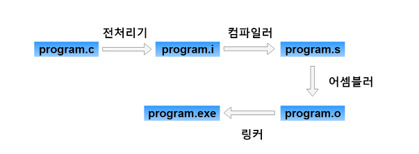

# 컴파일러

> [!NOTE]
> 소스코드(`.c`)가 실행 파일이 되기까지의 4단계(전처리 → 컴파일 → 어셈블 → 링크)와 각 단계의 gcc 명령을 정리한다.

> [!IMPORTANT]
> 원문을 AI가 검토·보강함(사실 확인 권장).

## 📌 개념



### 컴파일 과정

1. **전처리 (Preprocessing)** — `program.c → program.i`
    - `#include`, `#define` 등 전처리 지시문을 실제 내용으로 가져오거나 치환하는 작업

    ```bash
    gcc -E program.c -o program.i
    ```

2. **컴파일 (Compile)** — `program.i → program.s`
    - 고수준 언어를 저수준 언어(어셈블리어)로 변환하는 역할
    - 사람이 읽기 어려운 어셈블리어로 작성됨

    ```bash
    gcc -S program.i -o program.s
    ```

3. **어셈블 (Assemble)** — `program.s → program.o`
    - 어셈블리어를 완전한 기계어(바이너리 오브젝트 파일)로 변환
    - `hexdump` 프로그램으로 대략적인 내용을 분석할 수 있음

    ```bash
    gcc -c program.s -o program.o
    ```

4. **링크 (Link)** — `program.o → program.exe`
    - 여러 개의 오브젝트 파일(`*.o`)을 하나로 합침
    - 라이브러리(`lib`)를 함께 결합할 때 사용

    ```bash
    gcc program.o -o program.exe
    ```
