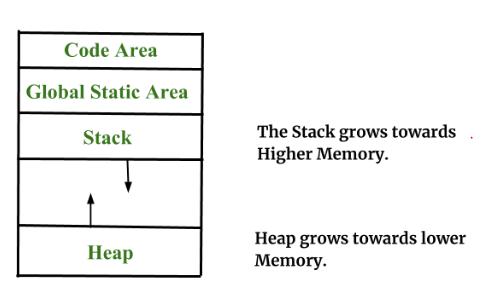

# static 이란?

> [!NOTE]
> static의 개념과 저장 위치(Global Static Area), 그리고 함수 호출 오버헤드를 줄이는 inline 키워드를 정리한다. (C/C++ 관점의 설명)

> [!IMPORTANT]
> 원문을 AI가 검토·보강함(사실 확인 권장).

## 📌 개념

### Static 이란?

- 한 코드(스코프) 내에서만 동작하는 것이 아니라 다른 코드에서 불러서 사용할 수 있도록 해주는 역할
- Global Static Area라는 메모리 공간에 저장되며, 이는 heap 과 stack 영역이 아니다
- 프로그램 시작 시 할당되어 종료될 때까지 유지된다

*(Code Area - 코드가 담기는 공간)

### Static의 활용법 (C++ 기준)

- 헤더 파일에 바로 선언해 사용 가능
- 클래스에서 static 으로 선언된 함수는 객체 생성 후 호출하는 방식이 아닌 스코프 연산자(`::`)를 이용하여 바로 호출 가능 (예: `ClassA::funcA()`)

> [!TIP]
> Java에서는 `static` 멤버를 `클래스명.멤버` 형태로 접근하고, 인스턴스 없이 공유된다. C++의 `::`와 목적은 유사하지만 문법이 다르다.

### Inline 키워드

- inline 키워드가 존재하는 이유
    - 함수를 실행하는 시간보다 함수를 호출(스택 프레임 생성/복귀)하는 데 드는 비용이 더 클 수 있다
    - 이런 경우 호출 오버헤드가 비효율적이므로, 호출 대신 함수 본문을 그 자리에 펼쳐 넣는(inline expansion) 방식을 사용한다
- inline의 장점
    - 함수 호출 오버헤드가 줄어든다
    - 컴파일러 최적화에 유리하다
    - 임베디드 시스템처럼 성능이 중요한 환경에서 효율적이다
- inline의 단점
    - 코드가 여러 곳에 복제되면서 전체 코드량(바이너리 크기)이 커진다
    - 코드가 커지면 캐시 적중률이 떨어져 메모리 접근 속도가 느려질 수 있다

> [!NOTE]
> 캐시 메모리 적중률(Cache Hit Ratio)이란?
> CPU가 필요한 데이터를 캐시에서 바로 찾을 확률을 말한다. 적중(hit)하면 빠르게 처리되지만, 실패(miss)하면 하위 메모리에서 다시 가져와야 해 지연이 발생한다. inline 남용으로 코드가 커지면 적중률이 낮아질 수 있다.
