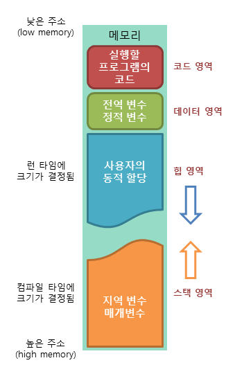

# 메모리 구조

> [!NOTE]
> 프로그램이 실행될 때 메모리는 코드·데이터·스택·힙 4개 영역으로 나뉜다. 각 영역이 무엇을 저장하고 언제 생성·소멸되는지 정리한다.

> [!IMPORTANT]
> 원문을 AI가 검토·보강함(사실 확인 권장).

## 📌 개념

- **코드 영역 (Code / Text Area)**
    - 텍스트 영역이라고도 부름
    - 실행할 프로그램의 코드(함수, 제어문, 상수 등)가 기계어 형태로 저장됨
    - 읽기 전용(Read-Only)이라 실행 중 변경되지 않음
- **데이터 영역 (Data Area)**
    - 전역 변수와 static 변수가 할당됨 (Global/Static Area)
    - 프로그램 시작과 동시에 메모리에 저장되고, 프로그램이 종료되어야 소멸됨
    - 초기화된 데이터(Data)와 초기화되지 않은 데이터(BSS)로 세분화되기도 함
- **스택 영역 (Stack Area)**
    - 지역 변수와 매개변수 저장 영역
    - 함수 호출 시 스택 프레임이 쌓이고, 함수 호출이 완료되면 사라짐 (LIFO)
    - 컴파일 시점에 크기가 결정되며, 한계를 넘으면 Stack Overflow 발생
- **힙 영역 (Heap Area)**
    - 프로그래머가 할당/해제하는 동적 할당 메모리 공간
    - 객체(클래스 인스턴스)/클로저가 이 영역에 저장됨
    - 런타임에 크기가 결정되며, Java 등에서는 GC(Garbage Collector)가 회수 관리

> [!TIP]
> Java(JVM) 기준으로 보면 "코드 영역"은 메서드 영역(Method Area), "데이터 영역"의 static/상수는 메서드 영역 내부에 관리된다. 스택은 스레드마다 하나씩, 힙은 모든 스레드가 공유한다.
