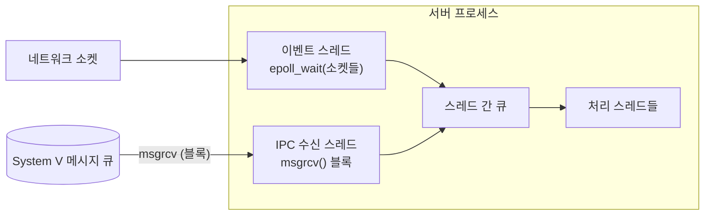

# POSIX IPC와 System V IPC 비교 — 메시지 큐 중심

> [!NOTE]
> 공유메모리 쪽의 POSIX/System V 비교는 이미 [공유메모리 세그먼트 노트](개발%20%28CS%29/CS%20기초/운영체제/[OS]%20공유메모리%20세그먼트%20—%20크기·key·권한·수명과%20삭제.md)에 있다. 이 노트는 **비어 있던 메시지 큐 비교**를 채운다. 검증 표기: ✔ Linux man 페이지(man7.org)에서 확인, △ 기억/일반 지식.

## 0. 두 계보

| | System V IPC | POSIX IPC |
| --- | --- | --- |
| 계보 | AT&T System V 유닉스 (1980년대). 전통 UNIX(HP-UX, Solaris, AIX)에 널리 있음 | POSIX.1b(실시간 확장)로 표준화된 더 새로운 인터페이스 |
| 식별 방법 | **숫자 key** (`ftok` 등) | **이름 문자열** (`"/name"`) |
| 핸들 | `msqid` 같은 **정수 ID**(파일 디스크립터가 아님) | **`mqd_t`** (Linux에서는 **파일 디스크립터**) |
| 가시화 | `ipcs`, `ipcrm` | `/dev/mqueue`를 마운트하면 `ls`, `rm` |

세 가지 자원이 각각 대응된다. 공유메모리와 세마포어는 기존 노트로 연결한다.

| 자원 | System V | POSIX | 기존 노트 |
| --- | --- | --- | --- |
| 메시지 큐 | `msgget`/`msgsnd`/`msgrcv`/`msgctl` | `mq_open`/`mq_send`/`mq_receive`/`mq_close`/`mq_unlink` | **이 노트** |
| 공유메모리 | `shmget`/`shmat`/`shmdt`/`shmctl` | `shm_open`+`ftruncate`+`mmap`/`munmap`/`shm_unlink` | [세그먼트](개발%20%28CS%29/CS%20기초/운영체제/[OS]%20공유메모리%20세그먼트%20—%20크기·key·권한·수명과%20삭제.md), [mmap](개발%20%28CS%29/CS%20기초/운영체제/[OS]%20mmap%20—%20파일과%20공유메모리를%20포인터로%20붙이기.md) |
| 세마포어 | `semget`/`semop`/`semctl` | `sem_open`/`sem_wait`/`sem_post` | [세마포어](개발%20%28CS%29/CS%20기초/운영체제/[OS]%20세마포어와%20동시성%20제어.md) |

## 1. 메시지 큐 함수 대응표

| 동작 | System V | POSIX |
| --- | --- | --- |
| **만들기/열기** | `msgget(key, msgflg)` → `msqid` | `mq_open(name, oflag, mode, &attr)` → `mqd_t` |
| **보내기** | `msgsnd(msqid, msgp, msgsz, msgflg)` | `mq_send(mqdes, msg_ptr, msg_len, msg_prio)`, `mq_timedsend` |
| **받기** | `msgrcv(msqid, msgp, msgsz, msgtyp, msgflg)` | `mq_receive(mqdes, msg_ptr, msg_len, &msg_prio)`, `mq_timedreceive` |
| **속성/상태 조회** | `msgctl(msqid, IPC_STAT, &ds)` → `struct msqid_ds` | `mq_getattr(mqdes, &attr)` → `struct mq_attr` |
| **속성 변경** | `msgctl(msqid, IPC_SET, &ds)` | `mq_setattr` (사실상 `O_NONBLOCK`만) △ |
| **닫기** | (핸들 개념 없음, 아무것도 안 함) | `mq_close(mqdes)` |
| **삭제** | `msgctl(msqid, IPC_RMID, NULL)` | `mq_unlink(name)` |
| **도착 알림** | 없음 | `mq_notify` — **빈 큐에 메시지가 도착할 때** 시그널/스레드로 통지 ✔ |

### 1-1. 메시지 형식

```c
/* System V: 앞에 long 타입 필드가 반드시 있어야 한다 */
struct my_msg {
    long mtype;          /* 반드시 0보다 커야 한다 ✔ */
    char mtext[256];
};
msgsnd(msqid, &m, sizeof(m.mtext), 0);          /* 크기에는 mtype을 포함하지 않는다 */
msgrcv(msqid, &m, sizeof(m.mtext), 0, 0);       /* msgtyp=0 → 맨 앞 메시지 */
```

```c
/* POSIX: 그냥 바이트 덩어리 + 우선순위 */
char buf[8192];
unsigned prio;
mq_send(mqd, "hello", 5, /*prio*/ 1);
ssize_t n = mq_receive(mqd, buf, sizeof(buf), &prio);   /* buf는 mq_msgsize 이상이어야 한다 */
```

### 1-2. 받을 메시지를 고르는 방법 — 가장 다른 점 ✔

| | System V | POSIX |
| --- | --- | --- |
| 기준 | **`msgtyp`(메시지 타입 번호)** | **우선순위(prio)** |
| 규칙 | `0`: **맨 앞** 메시지<br>`>0`: **그 타입**의 첫 메시지 (`MSG_EXCEPT`면 **그 타입이 아닌** 첫 메시지)<br>`<0`: **타입 ≤ \|msgtyp\|인 것 중 가장 낮은 타입** | **우선순위가 가장 높은 메시지부터** 항상 먼저 전달. Linux에서 범위 0~32767 |
| 쓰임새 | **한 큐를 여러 수신자가 공유**하며 각자 자기 타입만 골라 받을 수 있다 (`mtype`을 수신자 번호로) | 긴급 메시지를 앞지르기 |

> [!TIP] System V의 `mtype`은 "수신자 주소"로 많이 쓰인다
> 큐 하나에 `mtype = 수신자 PID`를 붙여 보내고, 각 프로세스는 `msgrcv(..., getpid(), ...)`로 자기 것만 받는 설계가 가능하다. POSIX 큐에는 이런 선택 수신이 없어서 **수신자마다 큐를 따로** 만들어야 한다.

### 1-3. 블로킹과 타임아웃

| | System V | POSIX |
| --- | --- | --- |
| 기본 동작 | 보낼 때 공간이 없으면 **블록**, 받을 때 메시지가 없으면 **블록** ✔ | 동일 (블록) |
| 논블로킹 | `IPC_NOWAIT` → 송신 `EAGAIN`, 수신 `ENOMSG` ✔ | `O_NONBLOCK`로 열면 `EAGAIN` |
| **타임아웃 지정** | **없다.** 필요하면 `alarm`/시그널, 폴링으로 흉내 | `mq_timedsend`/`mq_timedreceive`로 **절대 시각** 지정 △ |
| **시그널에 의한 중단** | `msgrcv`는 **`SA_RESTART`와 무관하게 재시작되지 않는다** → `EINTR`를 직접 처리해야 한다 ✔ | `EINTR`로 중단됨 △ |

### 1-4. 이벤트 루프(select/poll/epoll)에 넣을 수 있는가 — **구조를 갈라놓는 차이**

| | System V 메시지 큐 | POSIX 메시지 큐 |
| --- | --- | --- |
| 핸들 | `msqid`는 **파일 디스크립터가 아니다** | Linux에서 "**메시지 큐 디스크립터는 실제로 파일 디스크립터**"이며 `select`/`poll`/`epoll`로 감시할 수 있다 ✔ (단, "이식 불가") |
| 의미 | **`epoll`로 "큐에 메시지가 왔는지" 기다릴 수 없다** △ | 소켓과 같이 **하나의 `epoll` 루프에서 기다릴 수 있다** |

그래서 System V 메시지 큐를 쓰는 서버는 보통 이런 구조가 된다.



**소켓은 `epoll`로, 메시지 큐는 별도 스레드가 `msgrcv`로 블록** 하는 이원 구조다. 큐가 POSIX였다면 `epoll` 하나로 합칠 수 있다. System V 큐를 쓰는 레거시 서버 구조에서 "이벤트 스레드와 IPC 수신 스레드가 따로 있는 이유"를 이 차이로 설명할 수 있다. △ (일반적인 설계 추정이며, 개별 제품에서 실제로 그런지는 해당 구현을 확인해야 한다)

## 2. 한도와 크기 — 어디서 막히는가

### 2-1. System V

| 한도 | sysctl | 의미 | 확인 |
| --- | --- | --- | --- |
| `MSGMNI` | `kernel.msgmni` | **시스템 전체 큐 개수 상한.** Linux 3.19부터 기본 **32,000**. 초과 시 `msgget`이 `ENOSPC` ✔ | `cat /proc/sys/kernel/msgmni` |
| `MSGMAX` | `kernel.msgmax` | **메시지 하나**의 최대 크기 △ | `cat /proc/sys/kernel/msgmax` |
| `MSGMNB` | `kernel.msgmnb` | **큐 하나**에 쌓을 수 있는 총 바이트. 큐를 만들 때 `msg_qbytes`가 이 값으로 설정된다 ✔ | `cat /proc/sys/kernel/msgmnb` |

- `msg_qbytes`는 `msgctl(IPC_SET)`으로 **큐마다 따로 올릴 수 있다**(권한 필요) △. 따라서 `ipcs -q -l`의 시스템 한도와, 큐 자체의 `msg_qbytes`가 다를 수 있다.
- 메시지가 `MSGMAX`보다 크면 `msgsnd`가 `EINVAL`로 실패한다 △. 큰 데이터는 **조각내서** 보내야 한다.
- 기본값은 배포판과 커널 버전에 따라 다르다. 리눅스 커널 소스의 기본 `MSGMAX`는 8,192지만 배포판이 더 크게 잡는 경우가 많다 △. 직접 확인한 예: 한 리눅스 서버에서 `cat /proc/sys/kernel/msgmax`가 **`65535`** 였다. **메시지 상한을 설정으로 요청하는 미들웨어가 이 값에 맞춰 줄이는 일이 흔하므로**, 큰 메시지가 필요하면 먼저 이 값을 확인한다.

### 2-2. POSIX ✔

| 한도 | 파일 | 기본값 | 비고 |
| --- | --- | --- | --- |
| 큐당 최대 메시지 수 | `/proc/sys/fs/mqueue/msg_max` | **10** | 상한은 커널 버전에 따라 다름(Linux 3.5부터 65,536) |
| 메시지 최대 크기 | `/proc/sys/fs/mqueue/msgsize_max` | **8,192바이트** | 상한은 Linux 3.5부터 16,777,216 |
| 시스템 전체 큐 수 | `/proc/sys/fs/mqueue/queues_max` | **256** | 상한 없음 |
| **사용자별 총 메모리** | `RLIMIT_MSGQUEUE` | – | **그 사용자(real UID)가 가진 모든 큐가 쓰는 공간**을 제한한다 ✔ |

> [!WARNING] POSIX 큐는 기본값이 작다
> 기본 `msg_max=10`이라서 **11번째 메시지부터 송신이 블록**된다. 처음 써보는 사람이 가장 많이 막히는 지점이다. 큐를 만들 때 `mq_attr`로 `mq_maxmsg`/`mq_msgsize`를 지정하되 위 한도를 넘지 못한다.

## 3. 수명과 정리 — 둘 다 "남는다"

| | System V | POSIX |
| --- | --- | --- |
| 프로세스가 종료하면 | 큐는 **그대로 남는다** | **그대로 남는다** — "kernel persistence: if not removed by `mq_unlink`, a message queue will exist until the system is shut down" ✔ |
| 삭제 | `msgctl(IPC_RMID)` / 셸 `ipcrm -q` | `mq_unlink(name)` / 셸 `rm /dev/mqueue/name` |
| 남은 큐 찾기 | `ipcs -q` | `ls /dev/mqueue` |
| 같은 key/이름으로 다시 만들기 | `msgget(IPC_CREAT)`는 **기존 큐를 그대로** 돌려준다. 새 큐를 원하면 `IPC_EXCL`(이미 있으면 `EEXIST`) ✔ | `mq_open(O_CREAT)`도 기존 큐를 연다. `O_EXCL`이면 실패 |

> [!WARNING] 큐가 남아서 생기는 문제 (둘 다 해당)
> - **이전 메시지 잔재:** 프로세스가 죽었다 살아나도 큐에는 **죽기 전에 쌓인 메시지**가 남아 있다. 재시작 시 큐를 삭제 후 재생성하는 구현이 흔한 이유다.
> - **key/이름을 바꾸면 이전 큐가 고아가 된다:** 새 key로 큐를 만들고 이전 key의 큐는 지우지 않으면 **쓰이지 않는 큐가 쌓인다.** 시스템 전체 한도(`MSGMNI`)를 소모하고, `ipcs -q` 출력을 혼란스럽게 한다.
> - 특히 System V는 **큐를 만든 프로세스의 PID가 기록되지 않는다.** `ipcs -q -p`는 **마지막 송신자(`lspid`)와 수신자(`lrpid`)** 만 보여준다. 공유메모리(`ipcs -m -p`의 `cpid`)와 다르다. ✔(msgget 페이지: 생성 시 `msg_lspid`, `msg_lrpid`는 0으로 설정)

## 4. 큐 적체를 어떻게 보는가

| | System V | POSIX |
| --- | --- | --- |
| API | `msgctl(IPC_STAT)` → `msqid_ds` | `mq_getattr` → `mq_attr` |
| 현재 메시지 수 | `msg_qnum` | `mq_curmsgs` |
| 현재 쌓인 바이트 | `msg_cbytes` | (직접 필드 없음) △ |
| 큐 최대 바이트 | `msg_qbytes` | `mq_maxmsg × mq_msgsize` |
| 마지막 송신/수신 PID | `msg_lspid`, `msg_lrpid` | 없음 |
| 셸 | `ipcs -q` (`used-bytes`, `messages` 열) | `cat /dev/mqueue/<name>` (`QSIZE`) |

→ **"큐 사용률 %"를 계산할 수 있다:** System V라면 `msg_cbytes / msg_qbytes`. 모니터링 도구가 큐 점유율 알람을 만들 때 쓰는 값이다. △

## 5. 한 큐 vs 수신자마다 큐 — 설계 선택

| 설계 | System V에서 | POSIX에서 |
| --- | --- | --- |
| **수신자(프로세스)마다 큐 하나** | key 하나씩 배정 | 이름 하나씩 |
| **큐 하나를 공유하고 타입으로 분배** | `mtype`으로 가능 | **불가능** — 우선순위만 있음 |
| 이름으로 찾기 | **표준에 없다.** `key`라는 숫자만 있어서 **"이름 → key" 표를 따로 만들어야** 한다 | **이름이 곧 식별자**라서 표가 필요 없다 |

> [!TIP] "이름-key 매핑 표 파일"이 생기는 이유
> System V는 식별자가 **숫자 key뿐**이라 사람이 쓰는 이름과 key를 이어 줄 표가 필요하다. 이를 설정 파일로 두는 방식이 [이름-키 매핑 테이블 방식의 IPC 키 관리](개발%20%28CS%29/CS%20기초/운영체제/[OS]%20이름-키%20매핑%20테이블%20방식의%20IPC%20키%20관리.md)다. POSIX라면 `"/myproc"`처럼 이름을 바로 쓰므로 그 표가 필요 없다. key 충돌을 피하는 `ftok` 쪽은 [ftok과 IPC 키 생성](개발%20%28CS%29/CS%20기초/운영체제/[OS]%20ftok과%20IPC%20키%20생성.md).

## 6. 그래서 무엇을 쓰는가

| 상황 | 선택 |
| --- | --- |
| **여러 UNIX(HP-UX, Solaris, AIX 등)에 이식**해야 하는 오래된 코드 | System V — 어디에나 있다 △ |
| **`epoll` 이벤트 루프에 메시지 큐를 합치고 싶다** (Linux 전용) | POSIX 메시지 큐 |
| **한 큐에서 수신자별로 골라 받기** | System V (`mtype`) |
| **수신 타임아웃이 필요** | POSIX (`mq_timedreceive`) |
| **큐 상태를 `ipcs`로 빠르게 점검** | System V |
| **메시지 우선순위** | POSIX |
| **이식성보다 단순함** | 둘 다 가능. 새 코드는 보통 소켓/파이프를 먼저 고려 △ |

## 7. 환경 점검 명령 모음

```bash
ipcs -q                      # System V 큐 목록 (key, msqid, used-bytes, messages)
```
```bash
ipcs -q -p                   # 마지막 송신/수신 PID (생성자 PID 아님)
```
```bash
ipcs -q -l                   # System V 큐 한도 요약
```
```bash
cat /proc/sys/kernel/msgmax /proc/sys/kernel/msgmnb /proc/sys/kernel/msgmni
```
```bash
cat /proc/sys/fs/mqueue/msg_max /proc/sys/fs/mqueue/msgsize_max /proc/sys/fs/mqueue/queues_max
```
```bash
mount | grep mqueue          # POSIX 큐를 /dev/mqueue로 볼 수 있는지
```

## 8. 검증 상태 요약

| 항목 | 상태 | 근거 |
| --- | --- | --- |
| POSIX 큐 디스크립터는 Linux에서 fd, `epoll` 가능(이식 불가) | ✔ | `mq_overview(7)` |
| POSIX 한도 기본값(`msg_max=10`, `msgsize_max=8192`, `queues_max=256`), `RLIMIT_MSGQUEUE` | ✔ | `mq_overview(7)` |
| POSIX 우선순위 높은 것부터 전달, 범위 0~32767, `mq_notify`, 수명(`mq_unlink`) | ✔ | `mq_overview(7)` |
| System V `msgtyp` 규칙, `IPC_NOWAIT` 오류 코드, `mtype>0`, `EINTR` 재시작 안 됨 | ✔ | `msgrcv(2)` |
| System V `MSGMNI` 기본 32,000(3.19~), `msg_qbytes`=MSGMNB, 생성 시 `lspid`/`lrpid`=0 | ✔ | `msgget(2)` |
| System V 큐가 `epoll`에 못 들어감, `MSGMAX` 초과 시 `EINVAL`, 배포판별 `msgmax` 기본값, `mq_timed*` 세부 | △ | 기억 기준. `msgrcv(2)` 페이지에 select/poll 언급이 없어 직접 확인하지 못함 |

## 관련 문서

- [System V IPC 개념](개발%20%28CS%29/CS%20기초/운영체제/[OS]%20System%20V%20IPC%20개념%20%28메시지%20큐·세마포어·공유메모리%29.md) — 3형제 공통 패턴
- [공유메모리 한눈에 보기](개발%20%28CS%29/CS%20기초/운영체제/[OS]%20공유메모리%20한눈에%20보기%20—%20가상%20주소%20공간·mmap·세그먼트·락%20허브.md) — 공유메모리 허브
- [IPC와 스레드 메모리 공유 비교](개발%20%28CS%29/CS%20기초/운영체제/[OS]%20IPC와%20스레드%20메모리%20공유%20비교.md)
- [epoll — fd가 많아질 때의 대안](개발%20%28CS%29/언어/C언어/네트워크·시스템%20IO/[C]%20epoll%20—%20fd가%20많아질%20때의%20대안.md)
- 참고: Linux man-pages `mq_overview(7)`, `msgget(2)`, `msgrcv(2)`, `msgctl(2)`
