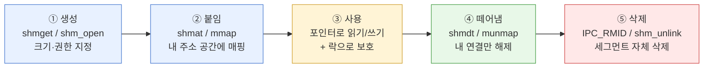
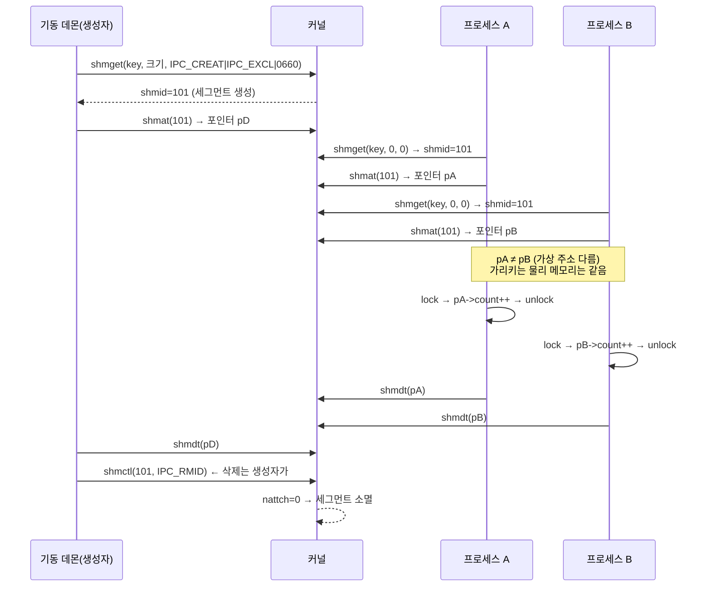

# 공유메모리 한눈에 보기 — 가상 주소 공간·mmap·세그먼트·락 허브

> [!NOTE]
> "프로세스는 heap을 쓰는데, 프로세스끼리 통신하는 공유메모리는 어디에 있고 크기·접근은 누가 정하나?"라는 질문에서 출발해, 가상 주소 공간 → mmap → 세그먼트(크기·권한·수명) → 동시성 락까지 이어진 학습 내용을 **그림 중심으로 한 장에 정리한 허브**다. 세부는 주제별 노트로 나눴다.

---

## 1. 전체 그림 (이것만 보면 된다)

```
   프로세스 A                         프로세스 B
┌───────────────────┐             ┌───────────────────┐
│ 가상 주소 공간     │             │ 가상 주소 공간     │
│                   │             │                   │
│  stack            │             │  stack            │
│  ▒ mmap 영역 ▒    │             │  ▒ mmap 영역 ▒    │
│  ├ 공유라이브러리  │             │  ├ 공유라이브러리  │
│  └ [공유메모리]─┐  │             │  ┌─[공유메모리]    │
│  heap(malloc)   │  │             │  │  heap(malloc)   │
│  data / text    │  │             │  │  data / text    │
└─────────────────┼──┘             └──┼─────────────────┘
        (가상 주소 0x7f3a…)   (가상 주소 0x7e90… ← A와 달라도 됨)
                  │                   │
                  ▼ 페이지 테이블이     ▼ 같은 물리 페이지를 가리킴
            ┌───────────────────────────────┐
            │     물리 메모리 (RAM)          │
            │  ┌─────────────────────────┐  │
            │  │ 공유메모리 세그먼트 1개   │  │  ← 커널이 관리 (shmid / 이름)
            │  └─────────────────────────┘  │
            └───────────────────────────────┘
                          ▲
              ┌───────────┴───────────┐
              │ 커널의 세그먼트 표      │  key, shmid, 크기, 소유자(uid),
              │ (ipcs -m 로 확인)       │  권한(0660), 붙은 수(nattch)
              └─────────────────────────┘
```

**읽는 법**: 각 프로세스는 **자기 가상 주소**로 접근하지만, 실제로는 **같은 물리 메모리 하나**를 본다. 공유메모리는 heap이 아니라 **mmap 영역**에 붙고, 세그먼트 자체는 **커널이 별도 객체로 관리**한다.

---

## 2. 공유메모리의 일생



| 단계 | 누가 | 주의 |
| :--- | :--- | :--- |
| ① 생성 | 보통 기동 데몬 1곳 | 크기는 이때 한 번 정해지고 못 바꾼다 |
| ② 붙임 | 사용하는 모든 프로세스 | 프로세스마다 받는 주소가 다르다 → 포인터 대신 오프셋 |
| ③ 사용 | 사용하는 모든 프로세스 | 락 없이 동시에 쓰면 race ([락 노트](개발%20%28CS%29/CS%20기초/운영체제/[OS]%20공유메모리%20동시성%20—%20락%20선택과%20프로세스%20간%20함정.md)) |
| ④ 떼어냄 | 사용하는 모든 프로세스 | `free()` 아님. 안 해도 프로세스 종료 시 자동 정리 |
| ⑤ 삭제 | **한 곳(보통 생성자)** | 안 하면 프로세스가 죽어도 **세그먼트가 남는다**(고아) |

---

## 3. 두 프로세스가 통신하는 순서 (시퀀스)



---

## 4. 용어 한 줄 사전

| 용어 | 한 줄 정의 |
| :--- | :--- |
| **IPC** | Inter-Process Communication. 분리된 프로세스끼리 데이터를 주고받거나 동작을 맞추는 방법 전체를 가리키는 **범주** |
| System V IPC / POSIX IPC | IPC의 **구현 규격**. 메시지 큐·세마포어·공유메모리를 각자 방식으로 제공 ([개념](개발%20%28CS%29/CS%20기초/운영체제/[OS]%20System%20V%20IPC%20개념%20%28메시지%20큐·세마포어·공유메모리%29.md)) |
| 가상 주소 공간 | 프로세스마다 따로 가진 주소 번호 체계. 64비트 리눅스 유저 영역 약 128TB ([노트](개발%20%28CS%29/CS%20기초/운영체제/[OS]%20프로세스%20가상%20주소%20공간%20—%20heap·stack·mmap%20영역과%20물리%20메모리.md)) |
| **세그먼트** | 커널이 한 단위로 관리하는 공유메모리 한 덩어리 (`ipcs -m`의 한 줄) |
| **key** | 세그먼트를 찾기 위한 검색용 이름표 (System V). POSIX는 이름 문자열 |
| **shmid** | 커널이 붙이는 세그먼트의 실제 식별자 |
| **mmap** | 대상(파일·공유메모리·빈 메모리)을 내 가상 주소 공간에 붙여 포인터로 쓰게 하는 시스템 콜 ([노트](개발%20%28CS%29/CS%20기초/운영체제/[OS]%20mmap%20—%20파일과%20공유메모리를%20포인터로%20붙이기.md)) |
| attach / detach | 붙임(`shmat`/`mmap`) / 떼어냄(`shmdt`/`munmap`) — 프로세스별 연결 |
| `IPC_RMID` / `shm_unlink` | 세그먼트 **삭제 예약** — 마지막 프로세스가 떼면 소멸 |
| `/dev/shm` | POSIX 공유메모리가 파일처럼 보이는 곳. tmpfs(RAM 기반)라 데이터는 디스크가 아님 |

> [!TIP] IPC 수단은 공유메모리만이 아니다
> | 수단 | 데이터 전달 방식 |
> | :--- | :--- |
> | 파이프 / FIFO | 바이트 스트림을 커널 버퍼로 전달 (한 방향) |
> | 메시지 큐 | 메시지 단위로 커널 큐에 넣고 꺼냄 |
> | **공유메모리** | 같은 물리 메모리를 각자 주소 공간에 매핑 (**복사 없음**, 가장 빠름) |
> | 소켓 | 양방향 (같은 머신: 유닉스 도메인 소켓 / 다른 머신: TCP·UDP) |
> | 시그널 | 아주 작은 알림만 (데이터 거의 없음) |
> | 세마포어 | 데이터가 아니라 **동기화** 신호 (System V에서 같은 방식으로 관리해 IPC로 분류) |

---

## 5. `read`/`write`는 언제 쓰고, 공유메모리에는 왜 안 쓰나

> [!WARNING] 먼저 바로잡기
> `shmget`이 돌려주는 것은 **포인터가 아니라 shmid(번호)** 다. 포인터는 `shmat`(또는 `mmap`)이 준다. 그리고 `read`/`write`는 공유메모리 전용 함수가 아니라 **"데이터가 커널 안에 있는 대상"을 다루는 범용 함수**다.

```
[ read / write 방식 ]  (파일·소켓·파이프)
  프로세스 버퍼 ──write──→ 커널 버퍼 ──read──→ 상대 프로세스 버퍼
                 (복사 1)             (복사 2)      + 시스템 콜 2번

[ 공유메모리 방식 ]
  프로세스 A ──p->x = 1──→ [ 같은 물리 메모리 ] ←──y = p->x── 프로세스 B
                          복사 없음, 시스템 콜 없음 (그냥 메모리 접근)
```

| | `read`/`write` | 공유메모리 포인터 |
| :--- | :--- | :--- |
| 데이터 이동 | 커널을 거쳐 **복사** | 복사 없음, 같은 메모리를 직접 봄 |
| 시스템 콜 | 매번 필요 | `shmat`/`mmap` 때 한 번, 이후는 일반 메모리 접근 |
| 속도 | 상대적으로 느림 | IPC 중 가장 빠름 |
| 동기화 | 커널이 보장 (파이프는 쓰기 전엔 읽기가 대기) | **직접 락을 걸어야 함** ([락 노트](개발%20%28CS%29/CS%20기초/운영체제/[OS]%20공유메모리%20동시성%20—%20락%20선택과%20프로세스%20간%20함정.md)) |
| 쓰는 대상 | 파일·파이프·소켓·터미널 | 공유메모리 (메시지 큐는 전용 `msgsnd`/`msgrcv`) |

공유메모리를 쓰는 이유가 곧 **"복사와 시스템 콜을 없애려고"** 이므로 포인터로 바로 쓰는 것이 정석이고, 여기에 `read`/`write`를 쓰면 이점이 사라진다. (POSIX 공유메모리 fd에는 문법상 `read`/`write`도 가능하지만 실무에서는 `ftruncate`로 크기만 정하고 `mmap`으로 붙여 포인터로 쓴다.)

> [!TIP] C/Java 비교
> Java의 `InputStream.read()`/`OutputStream.write()`는 `read`/`write` 쪽(복사해서 전달), `MappedByteBuffer`(내부적으로 mmap)는 공유메모리 쪽에 해당한다.

파일은 두 방식 모두 가능하다. **순차로 한 번 읽을 때**는 `read`가 단순하고, **여기저기 자주 접근하거나 여러 프로세스가 공유**할 때는 `mmap`이 유리하다 ([mmap 노트](개발%20%28CS%29/CS%20기초/운영체제/[OS]%20mmap%20—%20파일과%20공유메모리를%20포인터로%20붙이기.md)).

---

## 6. 질문 → 답 지도

| 처음 가졌던 질문 | 한 줄 답 | 자세히 |
| :--- | :--- | :--- |
| 공유메모리의 크기·접근은 어떻게 설정되나? | 생성하는 프로세스가 크기·권한 지정, 상한은 커널 한도 | [세그먼트 §2·§4](개발%20%28CS%29/CS%20기초/운영체제/[OS]%20공유메모리%20세그먼트%20—%20크기·key·권한·수명과%20삭제.md) |
| 세그먼트가 뭐고 접근 권한은 뭐지? | 세그먼트=커널이 관리하는 공유메모리 한 덩어리, 권한=소유자/그룹/기타 rwx | [세그먼트 §1·§4](개발%20%28CS%29/CS%20기초/운영체제/[OS]%20공유메모리%20세그먼트%20—%20크기·key·권한·수명과%20삭제.md) |
| 메모리인데 파일을 만드나? | System V 아니요, POSIX는 `/dev/shm`에 파일처럼 보이나 데이터는 RAM | [세그먼트 §5](개발%20%28CS%29/CS%20기초/운영체제/[OS]%20공유메모리%20세그먼트%20—%20크기·key·권한·수명과%20삭제.md) |
| mmap이 뭐지? 포인터로 바로 쓰나? | 대상을 내 주소 공간에 붙이는 시스템 콜, 붙이면 `malloc` 포인터처럼 사용 | [mmap](개발%20%28CS%29/CS%20기초/운영체제/[OS]%20mmap%20—%20파일과%20공유메모리를%20포인터로%20붙이기.md) |
| 동시성 이슈가 나오나? 락은 세마포어뿐? | 나온다. 세마포어 외에 공유 뮤텍스·원자 연산 등이 있다 | [락](개발%20%28CS%29/CS%20기초/운영체제/[OS]%20공유메모리%20동시성%20—%20락%20선택과%20프로세스%20간%20함정.md) |
| 공유메모리가 heap에 생기나? | 아니요, mmap 영역에 생긴다 | [가상 주소 공간](개발%20%28CS%29/CS%20기초/운영체제/[OS]%20프로세스%20가상%20주소%20공간%20—%20heap·stack·mmap%20영역과%20물리%20메모리.md) |
| `read`/`write`는 언제 쓰나? 공유메모리엔 안 쓰나? | 파일·소켓·파이프처럼 커널을 거쳐 복사하는 대상에 씀. 공유메모리는 포인터로 직접 접근 | 허브 §5 |
| `free`도 해야 하나? | `free` 아님. `munmap`/`shmdt` + 삭제 | [세그먼트 §6](개발%20%28CS%29/CS%20기초/운영체제/[OS]%20공유메모리%20세그먼트%20—%20크기·key·권한·수명과%20삭제.md) |
| 접근만 하는 프로세스가 삭제할 수 있나? | 소유자·생성자 uid가 같으면 가능 | [세그먼트 §7](개발%20%28CS%29/CS%20기초/운영체제/[OS]%20공유메모리%20세그먼트%20—%20크기·key·권한·수명과%20삭제.md) |
| 재기동 시 같은 key면 중복 아닌가? | 삭제 예약 시 옛 key는 반납됨. 대신 데이터가 갈라지는 게 문제 | [세그먼트 §7](개발%20%28CS%29/CS%20기초/운영체제/[OS]%20공유메모리%20세그먼트%20—%20크기·key·권한·수명과%20삭제.md) |
| 기동 때 받은 메모리에서 잡히나? heap이 줄지 않나? | 가상 주소 빈 공간에 표시될 뿐, 64비트에선 사실상 안 줄어듦 | [가상 주소 공간](개발%20%28CS%29/CS%20기초/운영체제/[OS]%20프로세스%20가상%20주소%20공간%20—%20heap·stack·mmap%20영역과%20물리%20메모리.md) |

---

## 7. 흔한 오해 정정

| 오해 | 실제 |
| :--- | :--- |
| 공유메모리는 heap에 생긴다 | **mmap 영역**에 생긴다 (heap은 `malloc` 전용 영역) |
| 3개 프로세스가 100MB를 붙이면 RAM 300MB | **물리 RAM은 100MB 한 번**. 가상 구간만 각자 생김 (`top`의 SHR/RSS에는 각자 포함되어 보임) |
| 포인터 값을 다른 프로세스에 넘기면 된다 | 프로세스마다 주소가 달라 **무효**. 오프셋을 저장한다 |
| 메모리인데 파일이 디스크에 생긴다 | System V는 파일 없음, POSIX `/dev/shm`도 **RAM(tmpfs)** |
| 삭제는 만든 프로세스만 할 수 있다 | **uid가 맞으면 누구나** (설계상의 약속으로 한 곳에 정할 뿐) |
| 삭제하면 바로 사라진다 | **삭제 예약**. 붙은 프로세스가 모두 떼면 소멸 |
| `shmget`이 포인터를 돌려준다 | `shmget`은 **shmid(번호)**, 포인터는 `shmat`/`mmap`이 준다 |
| 공유메모리도 `read`/`write`로 읽고 쓴다 | 포인터로 **직접** 접근한다 (`read`/`write`는 커널을 거쳐 복사하는 대상용) |
| 락은 세마포어로만 한다 | 공유 뮤텍스·파일 락·원자 연산도 가능 (프로세스 공유 속성 필수) |
| 공유메모리에 락이 자동으로 걸린다 | **OS는 공유까지만.** 동기화는 직접 |
| 구조체를 그대로 올리면 어디서나 같다 | 컴파일 옵션·아키텍처가 다르면 **패딩이 달라** 필드가 어긋남 ([구조체 패딩](개발%20%28CS%29/언어/C언어/메모리·구조체/[C]%20구조체%20패딩과%20멤버%20정렬%20—%20정렬%20기준은%20버스%20폭이%20아니라%20멤버%20타입%20크기.md)) |

---

## 8. 명령어 치트시트

```bash
# System V 공유메모리
ipcs -m                  # 세그먼트 목록 (key, shmid, owner, perms, bytes, nattch, status)
ipcs -m -l               # 시스템 한도 (shmmax / shmall / shmmni)
ipcs -m -i <shmid>       # 한 세그먼트 상세
ipcrm -m <shmid>         # 세그먼트 삭제 (nattch 0인지 확인 후!)
sysctl kernel.shmmax     # 한도 개별 확인

# POSIX 공유메모리
ls -l /dev/shm           # 파일처럼 보이는 세그먼트 목록
df -h /dev/shm           # tmpfs 용량

# 프로세스 메모리 구조
cat /proc/<pid>/maps               # 이 프로세스의 매핑 구간 (heap, stack, 공유메모리, 라이브러리)
ps -o pid,vsz,rss,cmd -p <pid>     # VSZ=가상, RSS=실제 물리 (KB)
```

---

## 9. 주제별 노트

| 노트 | 다루는 내용 |
| :--- | :--- |
| [프로세스 가상 주소 공간](개발%20%28CS%29/CS%20기초/운영체제/[OS]%20프로세스%20가상%20주소%20공간%20—%20heap·stack·mmap%20영역과%20물리%20메모리.md) | heap·stack·mmap 영역 배치, 기동 시 실제 동작, demand paging, ASLR, VSZ/RSS |
| [mmap](개발%20%28CS%29/CS%20기초/운영체제/[OS]%20mmap%20—%20파일과%20공유메모리를%20포인터로%20붙이기.md) | 시그니처, 매핑 종류, 포인터 사용, `munmap`, POSIX 공유메모리 전체 예제 |
| [공유메모리 세그먼트](개발%20%28CS%29/CS%20기초/운영체제/[OS]%20공유메모리%20세그먼트%20—%20크기·key·권한·수명과%20삭제.md) | 크기·한도, key/shmid, 권한, 파일 여부, 수명·삭제·삭제 권한·key 반납 |
| [공유메모리 동시성](개발%20%28CS%29/CS%20기초/운영체제/[OS]%20공유메모리%20동시성%20—%20락%20선택과%20프로세스%20간%20함정.md) | race 원리, 락 수단 비교, robust 뮤텍스, SEM_UNDO, 체크리스트 |

## 관련 문서 (기존)
- [System V IPC 개념 (메시지 큐·세마포어·공유메모리)](개발%20%28CS%29/CS%20기초/운영체제/[OS]%20System%20V%20IPC%20개념%20%28메시지%20큐·세마포어·공유메모리%29.md)
- [IPC와 스레드 메모리 공유 비교](개발%20%28CS%29/CS%20기초/운영체제/[OS]%20IPC와%20스레드%20메모리%20공유%20비교.md)
- [ftok과 IPC 키 생성](개발%20%28CS%29/CS%20기초/운영체제/[OS]%20ftok과%20IPC%20키%20생성.md) · [이름-키 매핑 테이블 방식의 IPC 키 관리](개발%20%28CS%29/CS%20기초/운영체제/[OS]%20이름-키%20매핑%20테이블%20방식의%20IPC%20키%20관리.md)
- [세마포어와 동시성 제어](개발%20%28CS%29/CS%20기초/운영체제/[OS]%20세마포어와%20동시성%20제어.md)
- [구조체 패딩과 멤버 정렬](개발%20%28CS%29/언어/C언어/메모리·구조체/[C]%20구조체%20패딩과%20멤버%20정렬%20—%20정렬%20기준은%20버스%20폭이%20아니라%20멤버%20타입%20크기.md) · [동적 할당 소유권](개발%20%28CS%29/언어/C언어/메모리·구조체/[C]%20동적%20할당%20소유권%20—%20caller%20free%20vs%20callee%20create·destroy%20쌍.md)
