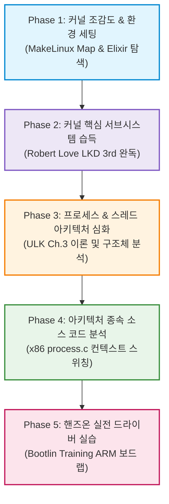
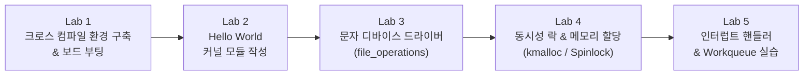

# 리눅스 커널 학습 로드맵 (Linux Kernel Learning Roadmap)

> [!NOTE]
> 리눅스 커널은 수천만 줄의 C언어와 어셈블리로 구성된 방대한 소프트웨어입니다. 무작정 소스 코드를 처음부터 읽으려고 하면 길을 잃기 쉽습니다.  
> **"전체 지도 조감 ➡️ 기본 개념·철학 습득 ➡️ 핵심 서브시스템(프로세스) 이론 심화 ➡️ 하드웨어 레벨 소스 코드 분석 ➡️ 실전 드라이버 개발·핸즈온 실습"**의 5단계 로드맵을 통해 체계적으로 접근하는 학습 가이드를 정리합니다.

---

## 🧭 핵심 학습 리소스 5선 (Core References)

본 로드맵은 커널 엔지니어링 생태계에서 가장 검증된 5개의 오픈 리소스를 유기적으로 연계하여 진행합니다.

| 분류 | 리소스 명칭 | 역할 및 활용 목적 | 바로가기 |
| :--- | :--- | :--- | :--- |
| **🗺️ 조감도** | **Interactive Linux Kernel Map** | 커널 계층(유저/시스템콜/서브시스템/HW)과 함수 간 관계를 조망하는 인터랙티브 지도 | [지도 열기](https://makelinux.github.io/kernel/map/) |
| **📖 교과서** | **Linux Kernel Development (3rd Ed.)** <br>*(by Robert Love)* | 커널의 설계 철학, 주요 서브시스템, 내부 메커니즘을 명쾌하게 설명하는 기본서 | [eBook (PDF)](https://github.com/jyfc/ebook/blob/master/03_operating_system/Linux.Kernel.Development.3rd.Edition.pdf) |
| **🔬 이론 심화** | **Processes and Threads in Linux (ULK Ch.3)** <br>*(Understanding the Linux Kernel)* | `task_struct`, `thread_info`, LWP, `clone()` 플래그 등 프로세스/스레드 내부 구조 슬라이드 | [슬라이드 열기](https://www.slideserve.com/norm/processes-and-threads-in-linux-chap-3-understanding-the-linux-kernel) |
| **💻 소스 분석** | **Bootlin Elixir Cross Referencer** <br>*(arch/x86/kernel/process.c, v6.12 LTS 기준)* | x86 아키텍처 수준의 프로세스 생성(`copy_thread`) 및 컨텍스트 스위칭(`__switch_to`) 소스 분석 | [소스 코드 보기](https://elixir.bootlin.com/linux/v6.12/source/arch/x86/kernel/process.c) |
| **🛠️ 실전 실습** | **Bootlin Kernel & Driver Development Training** | 오픈 코스웨어 슬라이드와 랩(Lab)을 따라 **실물 ARM 보드**(BeagleBone Black / BeaglePlay / i.MX93 FRDM) 상에서 직접 커널 모듈 및 디바이스 드라이버 개발 | [트레이닝 코스](https://bootlin.com/training/kernel/) |

---

## 🗺️ 전체 학습 흐름 (Overview Diagram)



---

## 📌 5단계 상세 학습 로드맵

### Phase 1. 커널 조감도 파악 및 코드 탐색 도구 익히기 (Orientation)

> **목표**: 커널 소스 트리의 디렉토리 구조와 계층 레이어를 머릿속에 넣고, 소스 검색 도구에 익숙해진다.

1. **[MakeLinux Interactive Kernel Map](https://makelinux.github.io/kernel/map/) 탐색**:
   - 커널을 수직 4계층으로 구분하여 이해:
     - **User Space**: C 표준 라이브러리(`glibc`), POSIX API
     - **System Call Interface (SCI)**: 유저 공간과 커널 공간의 경계선 (`sys_enter`, `sys_exit`)
     - **Kernel Subsystems**:
       - 프로세스 관리 (Process Scheduler, IPC, Signals)
       - 메모리 관리 (MMU, Paging, Page Cache, Slab/Buddy Allocator)
       - 가상 파일시스템 (VFS, Ext4, XFS, Network FS)
       - 네트워크 스택 (Sockets, TCP/IP, Netfilter)
     - **Architecture Dependent Layer**: CPU 종속적 코드 (`arch/x86`, `arch/arm` 등)
2. **코드 크로스 레퍼런서 숙달**:
   - [Bootlin Elixir](https://elixir.bootlin.com/) 사용법 습득: 함수 정의, 호출 지점, 자료구조 선언부 즉시 점프
   - 리눅스 커널 공식 소스 트리 주요 디렉토리 역할 암기:
     - `kernel/`: 스케줄러, 락, 타이머 등 핵심 코어
     - `mm/`: 메모리 관리
     - `fs/`: VFS 및 각 파일시스템 드라이버
     - `drivers/`: 디바이스 드라이버 전체 (커널 코드의 과반수 이상 차지)
     - `arch/`: CPU 아키텍처별 어셈블리 및 하드웨어 제어 루틴
     - `include/`: 커널 공통 헤더 파일 (`linux/sched.h`, `linux/fs.h` 등)

---

### Phase 2. 핵심 서브시스템 개념 및 철학 습득 (Theory Foundation)

> **목표**: Robert Love의 책을 통해 리눅스 커널의 핵심 서브시스템 동작 원리를 C 코드 관점에서 이해한다.  
> 🔗 **주요 교재**: [Linux Kernel Development 3rd Edition (LKD)](https://github.com/jyfc/ebook/blob/master/03_operating_system/Linux.Kernel.Development.3rd.Edition.pdf) (로컬 백업: [attachments/Linux.Kernel.Development.3rd.Edition.pdf](attachments/Linux.Kernel.Development.3rd.Edition.pdf))

> [!WARNING]
> 이 책은 **커널 2.6.34 기준(2010년)**으로 집필되어 개념·철학을 익히기엔 최고지만, 세부 구현은 현재(2026년 기준 최신 LTS v6.12/v6.18, 메인라인 v7.2)와 다른 부분이 있습니다. 대표적으로 **Ch.4의 CFS 스케줄러는 커널 6.6부터 EEVDF(Earliest Eligible Virtual Deadline First)로 교체**되었습니다. 책은 "왜 이런 설계를 했는가"를 배우는 용도로 삼고, 세부 구현은 Phase 4의 최신 소스 코드로 반드시 교차 확인하세요. GitHub 개인 리포지토리 원본은 저작권 이슈로 예고 없이 삭제될 수 있어 vault 내 `attachments/`에 백업본을 함께 보관합니다.

반드시 정독해야 할 핵심 챕터와 학습 체크리스트는 다음과 같습니다.

| 챕터 | 주제 | 핵심 학습 내용 및 질문 |
| :--- | :--- | :--- |
| **Ch 3** | **Process Management** | • `task_struct`의 수명 주기와 상태 전이<br>• `fork()`, `vfork()`, `clone()`의 차이 및 Copy-on-Write (COW)<br>• 좀비 프로세스와 고아 프로세스의 종료 처리 과정 |
| **Ch 4** | **Process Scheduling** | • O(1) 스케줄러에서 CFS(Completely Fair Scheduler)로 전환된 배경<br>• 레드-블랙 트리(RB-Tree)와 가상 실행 시간(`vruntime`) 계산<br>• 스케줄링 클래스와 우선순위(`nice` 값) 매핑<br>• ⚠️ *(최신 반영)* **v6.6부터 CFS는 EEVDF(Earliest Eligible Virtual Deadline First)로 대체됨** — RB-Tree 기반 vruntime 정렬의 한계를 보완한 후속 설계이므로 CFS 원리를 먼저 익힌 뒤 EEVDF와 비교 학습 권장 |
| **Ch 5** | **System Calls** | • 트랩(Trap)/소프트웨어 인터럽트를 통한 유저 모드 ➡️ 커널 모드 전환<br>• 시스템 콜 테이블(`sys_call_table`)과 인자 전달 규칙 |
| **Ch 7-8** | **Interrupts & Bottom Halves** | • 하드웨어 인터럽트와 Top-half(즉각 처리)의 제약 사항<br>• Bottom-half 3대 메커니즘: Softirq, Tasklet, Workqueue 비교 |
| **Ch 9-10** | **Kernel Synchronization** | • 커널 내 동시성 발생 원인 (인터럽트, 선점, SMP)<br>• Spinlock(인터럽트 컨텍스트용) vs Mutex/Semaphore(슬립 가능 컨텍스트용)<br>• 원자적 연산(`atomic_t`)과 BKL(Big Kernel Lock)의 퇴출 |
| **Ch 12** | **Memory Management** | • 페이지(Page), 존(Zone: ZONE_DMA, ZONE_NORMAL, ZONE_HIGHMEM)<br>• 버디 시스템(Buddy System)과 단편화 방지<br>• 슬랩 할당자(Slab Allocator)와 캐싱 객체 관리<br>• `kmalloc()`(물리적 연속) vs `vmalloc()`(가상 주소만 연속) |
| **Ch 13** | **Virtual Filesystem (VFS)** | • VFS 4대 핵심 객체: `superblock`, `inode`, `dentry`, `file`<br>• 파일 디스크립터(fd) 테이블과 커널 파일 객체의 매핑 |

---

### Phase 3. 프로세스 & 스레드 아키텍처 심화 (In-depth Processes & Threads)

> **목표**: 리눅스가 프로세스와 스레드를 바라보는 철학적 설계와 구조체 간 상호 참조 관계를 완전히 체득한다.  
> 🔗 **주요 교재**: [Understanding the Linux Kernel (ULK) Chap 3. 슬라이드](https://www.slideserve.com/norm/processes-and-threads-in-linux-chap-3-understanding-the-linux-kernel)

> [!WARNING]
> 이 슬라이드는 **2008년에 업로드된 3rd-party 요약본(원저 ULK 3판 기준 커널 2.6.11)**으로, Phase 2의 Robert Love Ch.3와 다루는 범위가 상당히 겹칩니다. "같은 개념을 다른 저자 시각으로 복습"하는 보조 자료로 취급하세요. 또한 아래 `thread_info` 설명은 **최신 커널(v6.9+)에서 대부분의 아키텍처가 `CONFIG_THREAD_INFO_IN_TASK`로 전환되어 `task_struct` 내부에 직접 임베드**되는 방식으로 바뀌었으니, "커널 스택 최하단에 위치"라는 설명은 역사적 배경으로만 참고하세요.

#### 1. 리눅스의 독특한 관점: "스레드는 특별한 존재가 아니다"
* 전통적인 유닉스/윈도우와 달리, 리눅스 커널은 **프로세스와 스레드를 내부적으로 엄격히 구분하지 않습니다.**
* 커널 스케줄러 입장에서는 둘 다 실행 가능한 독립적인 `task_struct`일 뿐입니다.
* 단지, `clone()` 호출 시 **주소 공간(가상 메모리), 파일 디스크립터 테이블, 시그널 핸들러를 부모와 공유하느냐(`CLONE_VM`, `CLONE_FILES` 등)**에 따라 유저 공간에서 "스레드"처럼 동작할 뿐입니다.
* 리눅스에서는 이를 경량 프로세스(**LWP, Light-Weight Process**)라 부릅니다.

#### 2. 핵심 자료구조 관계
```
+-------------------------------------------------------------+
| task_struct                                                 |
|  - pid (고유 Task ID)                                        |
|  - tgid (Thread Group ID -> 유저가 인식하는 실제 PID)           |
|  - *mm (mm_struct: 메모리 공간 서술자)                         |
|  - *files (files_struct: 열린 파일 디스크립터)                |
|  - *signal (시그널 핸들러 테이블)                             |
|  - state (TASK_RUNNING, TASK_INTERRUPTIBLE, etc.)           |
|  - thread_info (아키텍처별 스택 최하단 또는 별도 임베디드)     |
+-------------------------------------------------------------+
```

* **PID vs TGID**:
  * 단일 프로세스 환경: `PID == TGID`
  * 멀티스레드 환경: 스레드마다 고유한 커널 `PID`를 갖지만, 유저 공간 `getpid()` 호출 시에는 메인 스레드의 `TGID`를 반환하여 동일 프로세스로 인식하게 함.
* **프로세스 디스크립터 탐색**:
  * 이중 연결 원형 리스트(`tasks` 리스트)로 모든 프로세스가 연결되어 있음.
  * 커널 런큐(Runqueue)와 우선순위 배열을 통한 빠른 스케줄링 대상 선택.

---

### Phase 4. 아키텍처 종속 소스 코드 분석 (Code Walkthrough)

> **목표**: x86 CPU 레벨에서 프로세스가 생성되고 컨텍스트 스위칭이 일어나는 순간을 실제 C/어셈블리 코드로 추적한다.  
> 🔗 **분석 대상 코드**: [Bootlin Elixir - arch/x86/kernel/process.c (v6.12 LTS)](https://elixir.bootlin.com/linux/v6.12/source/arch/x86/kernel/process.c)

> [!NOTE]
> 2011년(v2.6.39.3) 코드 기준으로는 아래 세 함수가 모두 `process.c` 한 파일에 있었지만, **최신 커널(v6.12 기준)은 32/64비트 공통 로직과 비트폭 종속 로직을 파일 단위로 분리**했습니다. 아래 위치를 함께 참고하세요.

이 소스 파일은 프로세스 라이프사이클의 **가장 밑바닥(Hardware Bottom Layer)**을 다룹니다. 다음 함수들의 구현부를 직접 추적해보세요.

#### 1. `copy_thread()` — `arch/x86/kernel/process.c`
* `fork()` 또는 `clone()` 호출 시, 공통 로직인 `kernel_clone()` ➡️ `copy_process()`를 거쳐 최종적으로 아키텍처별 하드웨어 레지스터와 스택을 세팅하는 핵심 함수.
* 시그니처가 `int copy_thread(struct task_struct *p, const struct kernel_clone_args *args)`로 정리되어, 예전에 별도였던 `copy_thread_tls()`는 사라지고 `kernel_clone_args` 구조체 하나로 인자가 통합됨.
* **핵심 동작**:
  1. 자식 프로세스의 커널 스택(`childregs`)을 부모의 유저 레지스터 상태로 복사.
  2. 자식의 `childregs->ax = 0` 설정 ➡️ **자식 프로세스에게 `fork()` 리턴값으로 `0`이 반환되는 하드웨어적 이유!**
  3. 자식의 인스트럭션 포인터(`ip`)를 `ret_from_fork` 어셈블리 레이블로 세팅 ➡️ 나중에 자식이 처음 스케줄될 때 유저 모드로 정상 복귀하도록 준비.
  4. TLS(Thread Local Storage) 세그먼트 레지스터(`FS` / `GS`) 갱신.

#### 2. `__switch_to()` — **`arch/x86/kernel/process_64.c`** (32비트는 `process_32.c`)
* ⚠️ 최신 커널에서는 이 함수가 `process.c`가 아니라 **비트폭별 파일로 이동**했습니다. `process.c`에는 공통 헬퍼인 `__switch_to_xtra()`(디버그 레지스터·TSS I/O 비트맵 등 부가 상태 전환)만 남아 있습니다.
* 커널이 실행 대상 프로세스를 전환할 때(`schedule()` 호출 시) 실행되는 컨텍스트 스위칭 루틴.
* **핵심 동작**:
  1. 이전 프로세스(`prev_p`)와 다음 프로세스(`next_p`)의 TSS(Task State Segment) 갱신.
  2. 커널 스택 포인터(`sp0`) 교체.
  3. TLS, PKRU(메모리 보호 키), 하드웨어 디버그 레지스터 저장/복원.
  4. FPU(부동소수점 레지스터) 상태 저장 및 복원 최적화.

#### 3. `arch_cpu_idle()` — `arch/x86/kernel/process.c` (구 `cpu_idle()`)
* 실행할 프로세스가 없을 때 CPU가 진입하는 Idle 루프. 함수명이 `cpu_idle()`에서 **`arch_cpu_idle()`로 변경**되었고, 저전력 상태 진입은 `default_idle()` / `mwait_idle()` 등으로 세분화됨.
* 비효율적인 무한 루프 대신 CPU의 저전력 명령어(`hlt`)를 호출하여 전력 소모를 줄이고, 인터럽트가 발생할 때까지 대기.

---

### Phase 5. 실전 핸즈온: 커널 모듈 & 디바이스 드라이버 개발 (Hands-on Practice)

> **목표**: 커널 소스를 수정하거나 외부 모듈을 직접 빌드하여 **실물 ARM 보드**에서 실행해보며 실무 엔지니어링 능력을 완성한다.  
> 🔗 **실습 코스웨어**: [Bootlin Linux Kernel & Driver Development Training](https://bootlin.com/training/kernel/)

> [!NOTE]
> Bootlin 트레이닝은 더 이상 QEMU 가상 환경이 아니라 **BeagleBone Black, BeaglePlay, NXP i.MX93 FRDM** 등 실물 ARM 보드를 사용합니다(온라인 세션은 강사가 실물 보드로 시연, 오프라인은 직접 보드로 실습). 보드가 없다면 QEMU `virt` 머신 + `arm64` 크로스 툴체인으로 대체 실습이 가능하지만, 인터럽트·GPIO 등 일부 실습은 실물 하드웨어가 필요합니다.

Bootlin의 공개 슬라이드와 랩 어젠다를 바탕으로 다음과 같은 실습 트랙을 단계별로 밟아나갑니다.



1. **Lab 1: 개발 환경 구축 & 커널 빌드**
   - ARM 크로스 컴파일러 툴체인(`gcc-arm-linux-gnueabihf` / `aarch64-linux-gnu-gcc`) 설치
   - `make defconfig` 및 `make -j$(nproc)`로 커널 이미지(`zImage` / `Image`) 및 Device Tree Blob(`.dtb`) 빌드
   - TFTP/시리얼 콘솔을 통해 실물 보드(BeagleBone Black 등)로 부팅 테스트
2. **Lab 2: 첫 커널 모듈(LKM) 작성**
   - `init_module()`, `cleanup_module()` (또는 `module_init`, `module_exit`)
   - `Makefile` 작성 (커널 빌드 시스템 `kbuild` 연동)
   - `insmod`, `rmmod`, `lsmod`, `dmesg`를 통한 커널 로그 확인
3. **Lab 3: Character Device Driver 개발**
   - 주번호(Major)와 부번호(Minor) 등록 (`alloc_chrdev_region`)
   - `cdev` 구조체 초기화 및 `file_operations` 구현:
     - `open()`, `release()`
     - `read()`, `write()` 구현 시 **`copy_to_user()`, `copy_from_user()`**의 필수성 체득 (유저 메모리 직접 역참조 금지 원칙)
4. **Lab 4: 락킹 메커니즘과 동시성 보호**
   - 전역 큐 버퍼를 보호하기 위한 `spinlock_t` 및 `mutex` 적용
   - 경쟁 상태(Race Condition)를 인위적으로 유발하고 락으로 해결하는 실습
5. **Lab 5: 인터럽트 처리 및 지연 작업**
   - 가상 인터럽트 라인 등록 (`request_irq`)
   - 인터럽트 핸들러 내부에서 무거운 작업을 지연 처리하기 위한 `workqueue` 스케줄링

---

## 🛠️ 커널 학습 추천 디버깅 & 추적 도구

커널을 공부할 때 단순히 소스 코드만 보는 것보다, 실행 중인 커널의 동작을 가시화하는 도구를 병행하면 이해도가 수직 상승합니다.

* **`ftrace`**: 커널 내부 함수 호출 그래프를 추적하는 가장 강력한 내장 트레이서
  ```bash
  # ftrace를 이용한 함수 그래프 트레이스 예시
  echo function_graph > /sys/kernel/debug/tracing/current_tracer
  echo do_fork > /sys/kernel/debug/tracing/set_ftrace_filter
  cat /sys/kernel/debug/tracing/trace
  ```
* **`bpftrace` / eBPF**: 커널 소스를 수정하거나 재컴파일하지 않고도 실시간으로 커널 이벤트와 함수 인자/반환값을 추적
* **`strace`**: 유저 애플리케이션이 호출하는 시스템 콜과 반환값을 실시간 모니터링
* **QEMU + GDB**: 커널 부팅 단계나 특정 시스템 콜에 브레이크포인트(`b sys_clone`)를 걸고 레지스터와 스택 값을 단계별로 스텝 실행

---

## 🔗 저장소 내 관련 학습 노트 연계

본 로드맵의 개념들은 본 지식 저장소의 다음 운영체제/CS 노트들과 긴밀하게 연결되어 있으므로 함께 참고하시기 바랍니다.

- [프로세스와 좀비 프로세스 (fork·waitpid)]([CS]%20프로세스와%20좀비%20프로세스%20(fork·waitpid)%20-%20핵심%20개념%20및%20특징%20정리.md) — 유저 공간의 `fork()`와 자식 프로세스 수명 주기
- [IPC와 스레드 메모리 공유 비교]([OS]%20IPC와%20스레드%20메모리%20공유%20비교.md) — 주소 공간 독립 여부와 LWP의 본질
- [세마포어와 동시성 제어]([OS]%20세마포어와%20동시성%20제어.md) — 유저 레벨 동시성과 커널 동기화 프리미티브의 연결
- [System V IPC 개념]([OS]%20System%20V%20IPC%20개념%20(메시지%20큐·세마포어·공유메모리).md) — 커널이 제공하는 프로세스 간 통신 채널 원리
