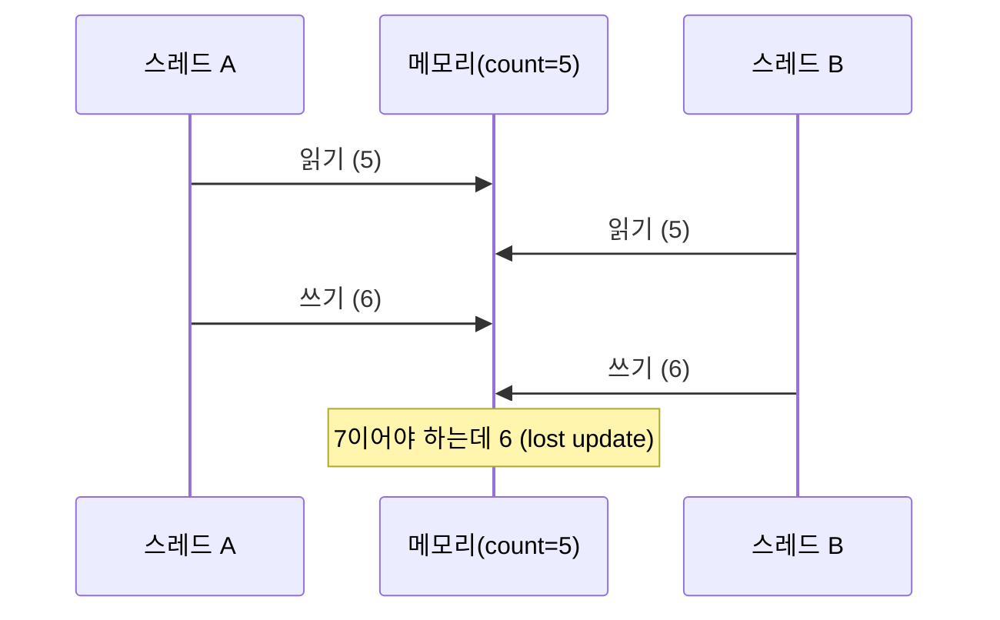
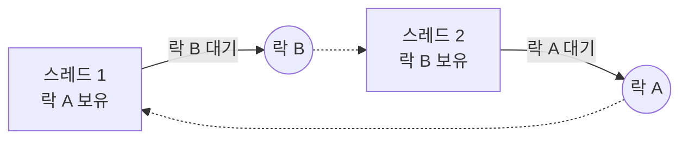

# 스레드 동시성 문제 정리 (race·deadlock·livelock·starvation)

> 여러 스레드가 함께 돌 때 생기는 오류를 "증상" 기준으로 구분해서 정리한다. 용어 한 줄 정의는 [IT 용어집 - 운영체제·시스템](IT%20용어집/[용어]%20운영체제·시스템.md) 참고.

## 1. 먼저: 무엇이 공유되고 무엇이 전용인가

같은 프로세스 안의 스레드는 메모리 일부를 **공유**하고 일부는 **각자** 가진다. 문제는 항상 "공유하는 것"에서 생긴다.

| 구분 | 영역 | 동기화 |
| --- | --- | --- |
| 공유 | heap, 전역·static 변수, 코드 영역, 열린 파일 | 필요 |
| 전용 | stack(지역 변수), CPU 레지스터, TLS(thread-local storage) | 불필요 |

관련 노트: [IPC와 스레드 메모리 공유 비교](개발%20%28CS%29/CS%20기초/운영체제/[OS]%20IPC와%20스레드%20메모리%20공유%20비교.md), [쓰레드(Thread)의 기본개념](개발%20%28CS%29/CS%20기초/운영체제/쓰레드%28Thread%29의%20기본개념.md)

## 2. 증상별 한눈에 보기

| 문제 | 증상 | 대표 원인 | 대응 |
| --- | --- | --- | --- |
| race condition | 실행 순서에 따라 결과가 달라짐, 가끔만 틀림 | 공유 자원 동시 접근 | lock, atomic, CAS |
| data race | 동기화 없는 동시 읽기/쓰기 | 보호 없이 공유 변수 사용 | 동기화, 불변 객체 |
| deadlock | 스레드들이 영원히 멈춤 | 서로 상대의 락을 기다림 | 락 순서 통일, timeout |
| livelock | CPU는 쓰는데 진전이 없음 | 서로 양보만 반복 | 무작위 대기(backoff) |
| starvation | 특정 스레드만 계속 못 실행됨 | 불공정한 락, 낮은 우선순위 | 공정 락, aging |
| priority inversion | 높은 우선순위가 오래 대기 | 낮은 우선순위가 락을 쥐고 있음 | priority inheritance |
| visibility / reordering | 다른 스레드가 바뀐 값을 못 봄 | CPU 캐시, 명령 재배치 | volatile, memory barrier |
| check-then-act | 검사와 실행 사이에 상태가 바뀜 | 여러 단계를 한 덩어리로 묶지 않음 | 락으로 묶기, 원자적 연산 |

## 3. race condition과 lost update

`count++`는 한 줄이지만 CPU에서는 **읽기 → 더하기 → 쓰기** 3단계다. 두 스레드가 겹치면 갱신이 사라진다.



- 재현이 어렵고 부하가 높을 때만 가끔 터지는 것이 특징이다.
- **data race**는 "동기화 없이 같은 메모리를 동시에 접근하고 하나 이상이 쓰기"인 상태다. C/C++에서는 data race가 있으면 동작이 정의되지 않는다(undefined behavior).
- 모든 race condition이 data race는 아니다. 락으로 각각의 접근을 보호해도, 둘 사이에 다른 스레드가 끼어드는 **논리적 race condition**은 남을 수 있다.

해결 도구 3가지:

1. **lock(mutex, synchronized)**: 구간을 한 번에 하나만 들어가게 한다.
2. **atomic 연산**: `AtomicInteger.incrementAndGet()`처럼 CPU가 한 번에 처리한다.
3. **CAS(Compare-And-Swap)**: "현재 값이 기대값일 때만 바꾼다"를 반복(재시도)한다. 락 없이 동시성을 다루는 기반이다. 관련: [락 없는 카운터 - GCC 원자적 연산 빌트인과 C11 atomic](개발%20%28CS%29/언어/C언어/동시성·스레드/[C]%20락%20없는%20카운터%20—%20GCC%20원자적%20연산%20빌트인과%20C11%20atomic.md)

## 4. check-then-act (원자성 위반)

```java
if (!map.containsKey(k)) {   // 검사
    map.put(k, v);           // 실행  ← 이 사이에 다른 스레드가 같은 키를 넣을 수 있다
}
```

- `ConcurrentHashMap`처럼 thread-safe한 자료구조를 써도 "검사 후 실행"은 별개 두 호출이라 안전하지 않다.
- 해결: `putIfAbsent`, `computeIfAbsent` 같은 **한 번에 처리하는 원자적 메서드**를 쓰거나 검사와 실행을 같은 락으로 묶는다.
- 보안에서는 같은 문제를 TOCTOU(time-of-check to time-of-use)라고 부른다.

## 5. deadlock (교착 상태)



발생 조건 4가지(Coffman)가 **모두** 성립해야 한다.

| 조건 | 뜻 |
| --- | --- |
| 상호 배제 | 자원을 한 번에 한 스레드만 쓴다 |
| 점유하며 대기 | 하나를 쥔 채 다른 것을 기다린다 |
| 비선점 | 남이 쥔 자원을 빼앗을 수 없다 |
| 순환 대기 | A→B→A처럼 대기가 원을 이룬다 |

하나라도 깨면 막을 수 있다. 실무에서 가장 쓰기 쉬운 방법:

- **락 획득 순서를 통일**한다(항상 A 먼저, B 나중). 순환 대기가 깨진다.
- 락 획득에 **timeout**을 둔다(`tryLock(timeout)`). 무한 대기가 사라진다.
- 락을 잡고 있는 구간을 짧게 하고, 락을 쥔 채 외부 호출(네트워크, DB)을 하지 않는다.
- 진단: 멈춘 프로세스에 gdb나 스레드 덤프(Java `jstack`)로 붙어 각 스레드가 어디서 대기 중인지 본다. 관련: [GDB 실전 디버깅 (멀티스레드·시그널)](개발%20%28CS%29/인프라/Linux/디버깅·성능·빌드%20도구/[Tool]%20GDB%20실전%20디버깅%20%28멀티스레드·시그널%29.md)

## 6. livelock, starvation, priority inversion

- **livelock**: 멈춘 것은 아니지만 서로 양보하며 상태만 바꾸고 일이 진전되지 않는다. 복도에서 마주 오는 두 사람이 계속 같은 쪽으로 비키는 것과 같다. 재시도 간격을 **무작위로 섞는(backoff)** 식으로 푼다.
- **starvation(기아)**: 특정 스레드가 자원을 계속 얻지 못한다. 불공정 락이나 낮은 우선순위가 원인이다. 공정(fair) 락을 쓰거나 오래 기다린 스레드의 우선순위를 올리는 aging으로 푼다.
- **priority inversion**: 높은 우선순위 스레드 H가 낮은 우선순위 L이 쥔 락을 기다리는데, 중간 우선순위 M이 L을 계속 밀어내서 H가 오래 대기하는 현상이다. L의 우선순위를 일시적으로 올려 주는 **priority inheritance**로 푼다.

## 7. 가시성(visibility)과 명령 재배치

한 스레드가 쓴 값이 다른 스레드에게 **바로 보이지 않을 수 있다**.

- 원인: 값이 CPU 캐시나 레지스터에 머물러 있거나, 컴파일러·CPU가 성능을 위해 명령 순서를 바꾼다.
- 증상: `while (!stop) { ... }` 루프가 다른 스레드가 `stop = true`로 바꿔도 끝나지 않는다.
- 해결: Java의 `volatile`, 락, memory barrier로 "먼저 일어난 일이 다른 스레드에 보이도록"(happens-before) 보장한다.
- `volatile`은 가시성과 순서만 보장하고 **원자성은 보장하지 않는다**. `count++`는 여전히 안전하지 않다.

## 8. thread-safe와 reentrant

- **thread-safe**: 여러 스레드가 동시에 접근해도 결과가 올바른 코드·자료구조. 예) `ConcurrentHashMap`(O), `HashMap`(X)
- **reentrant(재진입 가능)**: 실행 도중 다시 호출되어도(재귀, 다른 스레드, 시그널 핸들러) 올바른 함수. 공유 상태를 건드리지 않고 호출자가 넘긴 값과 지역 변수만 쓴다. 예) `strtok`(불가) vs `strtok_r`(가능)
- 재진입 가능하면 보통 thread-safe지만, 락으로만 thread-safe하게 만든 함수는 같은 스레드가 도중에 다시 호출하면 deadlock이 날 수 있어 재진입 불가일 수 있다.
- **reentrant lock**: 이미 쥔 락을 같은 스레드가 다시 얻어도 막히지 않는 락이다(Java `synchronized`, `ReentrantLock`).

## 9. ThreadLocal(TLS)과 스레드 풀

- **ThreadLocal**: 스레드마다 따로 갖는 저장 공간. 락 없이도 스레드끼리 값이 섞이지 않아서 요청별 정보(사용자, trace ID)를 들고 다니기에 좋다.
- 주의 1: **스레드 풀은 스레드를 재사용**한다. 요청이 끝날 때 `remove()`로 지우지 않으면 다음 요청에 이전 값이 남는다(값 오염, 메모리 누수).
- 주의 2: 비동기로 작업이 다른 스레드로 넘어가면 값이 따라가지 않는다. 그래서 context propagation이 필요하다. 관련: [분산 추적과 비동기 스레드 컨텍스트 전파 아키텍처](개발%20%28CS%29/인프라/모니터링·네트워크/[APM]%20분산%20추적%28Distributed%20Tracing%29과%20비동기%20스레드%20컨텍스트%20전파%20아키텍처%20%28TraceContext,%20Netty,%20Spring%20Batch%29.md)
- **thread pool exhaustion**: 모든 스레드가 응답 대기로 묶여 새 요청을 처리할 스레드가 없는 상태. 느린 외부 호출에 timeout이 없을 때 생기고 연쇄 장애로 번진다.

## 10. 점검 체크리스트

- [ ] 공유되는 가변 상태(static, 싱글턴 필드, 캐시)가 있는가?
- [ ] "검사 후 실행" 패턴이 락이나 원자적 메서드로 묶여 있는가?
- [ ] 락을 여러 개 잡는 곳에서 순서가 통일돼 있는가? 락 안에서 외부 호출을 하지 않는가?
- [ ] 락 획득과 외부 호출에 timeout이 있는가?
- [ ] 다른 스레드가 읽는 플래그가 `volatile`이거나 동기화로 보호되는가?
- [ ] ThreadLocal은 요청이 끝날 때 반드시 지우는가?

관련 노트: [세마포어와 동시성 제어](개발%20%28CS%29/CS%20기초/운영체제/[OS]%20세마포어와%20동시성%20제어.md), [세마포어 & 뮤텍스 (JAVA LOCK)](개발%20%28CS%29/언어/JAVA/동시성·IO·락/[Java]%20세마포어%20&%20뮤텍스%20%28%20JAVA%20LOCK%20%29%20-%20핵심%20개념%20및%20특징%20정리.md), [게임서버프로그래밍 #8 병렬성, 싱글-멀티스레드 서버, 세마포어, 병렬 자료구조](개발%20%28CS%29/게임서버/게임서버%20프로그래머%20책/[게임서버프로그래밍#8]%20병렬성,%20싱글-멀티스레드%20서버,%20세마포어,%20병렬%20자료구조.md)
