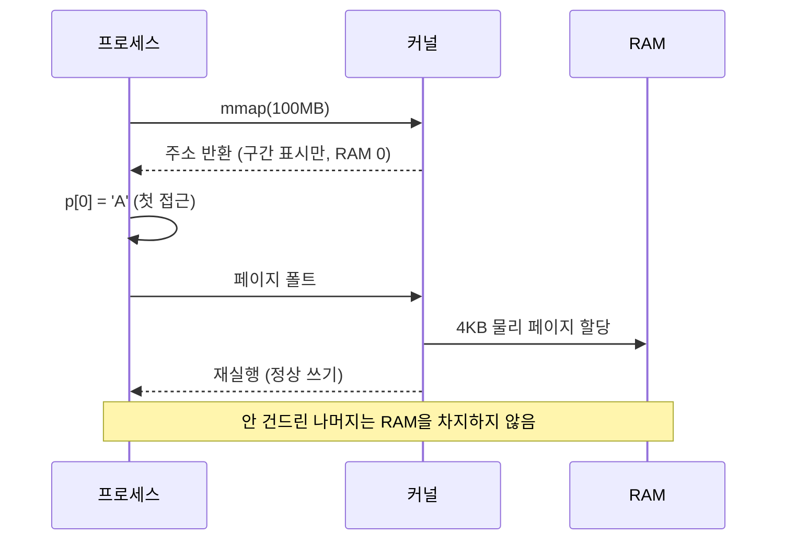

# 프로세스 가상 주소 공간 — heap·stack·mmap 영역과 물리 메모리

> [!NOTE]
> "프로세스가 뜰 때 메모리를 할당받는다"는 말이 실제로는 무슨 뜻인지, `heap`·`stack`·`mmap 영역`이 어디에 어떻게 놓이는지, 그리고 **가상 주소 공간(자리)과 물리 메모리(RAM)가 왜 별개인지**를 정리한다. 공유메모리·`malloc`·메모리 사용량(VSZ/RSS)을 이해하는 공통 전제다.
>
> 상위 허브: [공유메모리 한눈에 보기](개발%20%28CS%29/CS%20기초/운영체제/[OS]%20공유메모리%20한눈에%20보기%20—%20가상%20주소%20공간·mmap·세그먼트·락%20허브.md)

---

## 0. 먼저 바로잡을 오해

| 흔한 생각 | 실제 |
| :--- | :--- |
| 프로세스가 뜰 때 정해진 크기의 메모리를 받는다 | **주소 공간(자리)만** 준비한다. 물리 메모리(RAM)는 **쓰는 순간** 페이지 단위로 올라온다. |
| 공유메모리는 기동 때 받은 메모리 안에서 잡힌다 | 아직 **비어 있던 가상 주소 구간**에 새로 "표시"되는 것이다. |
| 공유메모리가 heap 안에 생긴다 | heap이 아니라 **mmap 영역**(heap과 stack 사이의 빈 공간)에 생긴다. |
| mmap을 하면 heap이나 stack이 그만큼 줄어든다 | 64비트에서는 사실상 줄지 않는다. 빈 공간이 압도적으로 크다. |
| 공유메모리 100MB를 3개 프로세스가 붙이면 RAM 300MB를 쓴다 | 가상 구간은 각자 100MB지만 **물리 RAM은 100MB 한 번**만 쓴다. |

---

## 1. 가상 주소 공간의 배치

프로세스는 자기만의 **가상 주소 공간**을 가진다. 64비트 리눅스(x86-64)에서 유저 영역은 약 **128TB**(47비트)다. 그중 실제로 "표시"된 구간은 몇 MB 수준이고 나머지는 **주소 번호만 있고 접근하면 `SIGSEGV`가 나는 빈 공간**이다.

```
높은 주소
 ┌────────────────────────────┐
 │ 커널 영역 (유저 접근 불가)  │
 ├────────────────────────────┤
 │ stack                      │  ← 지역변수·함수 호출. 아래(낮은 주소)로 자람
 │   ↓                        │     한도: ulimit -s (보통 8MB)
 │                            │
 │ ▒▒ mmap 영역 ▒▒            │  ← 공유 라이브러리, 공유메모리, 큰 malloc
 │   ↓ (보통 아래로 배치)      │
 │                            │
 │   ┈┈┈ 거대한 빈 공간 ┈┈┈    │  ← 주소만 존재, 아무것도 안 잡힘 (수십 TB)
 │                            │
 │   ↑                        │
 │ heap                       │  ← malloc의 기본 영역. 위(높은 주소)로 자람 (brk)
 ├────────────────────────────┤
 │ data / bss                 │  ← 전역·static 변수
 │ text                       │  ← 코드
 └────────────────────────────┘
낮은 주소 (0 근처)
```

| 영역 | 무엇이 들어가나 | 자라는 방향 | 한도 |
| :--- | :--- | :--- | :--- |
| text | 실행 코드 (읽기 전용) | 고정 | 파일 크기 |
| data / bss | 전역·static 변수 | 고정 | 프로그램이 정함 |
| heap | `malloc`으로 받은 메모리(기본) | 높은 주소 쪽으로 | 빈 공간이 있는 한 |
| mmap 영역 | 공유 라이브러리, **공유메모리**, 파일 매핑, 큰 `malloc` | 보통 아래로(top-down) | 빈 공간이 있는 한 |
| stack | 지역변수, 리턴 주소 | 낮은 주소 쪽으로 | `ulimit -s` |

> [!TIP] C/Java 비교
> - **C**: `malloc`은 heap(작은 크기) 또는 mmap 영역(큰 크기, glibc 기본 약 128KB 이상)에서 받는다. 주소와 영역을 직접 다룰 수 있다.
> - **Java**: JVM이 시작할 때 `-Xmx` 만큼의 가상 주소를 크게 예약하고, 그 안에서 heap을 관리한다. 개발자는 영역 배치를 볼 일이 없다. "-Xmx를 크게 잡았는데 RSS는 작다"는 현상이 이 원리(가상 예약 ≠ 물리 사용) 그대로다.

---

## 2. 기동 시 실제로 일어나는 일

`exec`로 프로그램이 시작되면 커널은 다음만 한다.

1. 실행 파일의 text/data 구간을 **파일 매핑으로 표시**한다 (내용을 RAM에 다 읽지 않는다).
2. 작은 초기 stack을 만들고 heap 시작점을 정한다.
3. 나머지는 전부 **빈 공간**으로 둔다.

그 뒤로 프로그램이 `malloc`, `mmap`, `shmat` 등을 부를 때마다 **빈 공간 일부에 "여기는 이제 내 구간"이라는 표시**(커널 내부의 VMA 목록)가 추가된다.

```
mmap 호출 전:  [text|data|heap ┈┈┈┈┈┈┈┈ 빈 공간 ┈┈┈┈┈┈┈┈┈┈ stack]
mmap 호출 후:  [text|data|heap ┈┈┈┈ ▒공유메모리▒ ┈┈┈┈┈┈┈┈┈┈ stack]
                                    ↑ 빈 공간에 이름표만 붙임 (heap/stack은 그대로)
```

---

## 3. 가상 주소와 물리 메모리는 별개 — Demand Paging

구간을 표시했다고 RAM이 차지되는 것이 아니다. **처음 접근하는 순간** CPU가 "이 가상 페이지에 대응하는 물리 페이지가 없다"는 **페이지 폴트**를 내고, 커널이 그때 물리 페이지(보통 4KB)를 하나 붙여 준다.



| | 가상 주소 공간 | 물리 메모리(RAM) |
| :--- | :--- | :--- |
| 기동 시 | 약 128TB가 "주소로서" 존재, 몇 개 구간만 표시 | 거의 없음 |
| `mmap`/`malloc` 시 | 빈 구간에 표시 추가 | 접근한 페이지만 올라옴 |
| 크기 제약 | 사실상 거의 없음 | RAM 총량 |

그래서 `ps`로 보면 **VSZ(가상 크기)가 수 GB여도 RSS(실제 물리 사용)는 훨씬 작은** 경우가 흔하다.

```bash
ps -o pid,vsz,rss,cmd -p <pid>    # VSZ=가상, RSS=실제 물리 (KB)
cat /proc/<pid>/maps              # 이 프로세스가 표시해 둔 구간 목록
```

`/proc/<pid>/maps` 예 (일부):

```
00400000-00452000 r-xp ... /usr/bin/myapp        ← text
01a3c000-01a5d000 rw-p ... [heap]                ← heap
7f3a10000000-7f3a14000000 rw-s ... /dev/shm/myshm ← 공유메모리 (s = shared)
7f3a2c000000-7f3a2c1c0000 r-xp ... /lib/libc.so.6 ← 공유 라이브러리
7ffd8a3f0000-7ffd8a411000 rw-p ... [stack]        ← stack
```

권한 열의 마지막 글자가 `s`면 **공유(MAP_SHARED)**, `p`면 **비공유(private)** 매핑이다.

---

## 4. 영역끼리 서로 뺏지 않나?

| 환경 | 상황 |
| :--- | :--- |
| **64비트** | 128TB에 비해 실사용이 극히 작아 heap과 mmap 영역 사이에 수십 TB가 남는다. 공유메모리 100MB를 붙였다고 heap이 줄어드는 일은 **사실상 없다**. |
| **32비트** | 주소 공간이 3~4GB뿐이라 mmap 영역을 크게 잡으면 heap이 쓸 자리가 실제로 모자라 `malloc`이 실패할 수 있다. 레거시 32비트 환경에서 큰 공유메모리를 잡을 때 주의하는 이유다. |

### ASLR — 위치가 실행마다 달라진다
ASLR(주소 공간 배치 무작위화)이 켜져 있으면 heap·stack·mmap 영역의 시작 위치를 **실행할 때마다 랜덤**하게 바꾼다. 그래서 같은 공유메모리 세그먼트를 붙여도 프로세스마다, 실행마다 **받는 주소가 다르다**. 이것이 공유메모리 안에 **포인터 대신 오프셋**을 저장해야 하는 이유 중 하나다 (→ [mmap 노트](개발%20%28CS%29/CS%20기초/운영체제/[OS]%20mmap%20—%20파일과%20공유메모리를%20포인터로%20붙이기.md)).

---

## 5. heap의 `malloc` vs mmap 영역 비교

| | `malloc`(heap) | `mmap`(공유메모리 포함) |
| :--- | :--- | :--- |
| 위치 | heap 영역 (작은 크기 위주) | mmap 영역 |
| 소유 | 그 프로세스 하나 | 대상에 따라 다른 프로세스와 공유 가능 |
| 해제 | `free(p)` | `munmap(p, len)` — **`free`를 쓰면 크래시** |
| 다른 프로세스 접근 | 불가 (주소 공간 분리) | `MAP_SHARED`면 가능 |
| 소유권 개념 | [동적 할당 소유권](개발%20%28CS%29/언어/C언어/메모리·구조체/[C]%20동적%20할당%20소유권%20—%20caller%20free%20vs%20callee%20create·destroy%20쌍.md) 참고 | 생성자가 삭제 책임 (→ [세그먼트 노트](개발%20%28CS%29/CS%20기초/운영체제/[OS]%20공유메모리%20세그먼트%20—%20크기·key·권한·수명과%20삭제.md)) |

---

## 6. 한눈에 정리

| 질문 | 답 |
| :--- | :--- |
| 기동 시 메모리를 정해진 크기만큼 주나 | 아니요. 가상 주소 공간(자리)만 준비, 물리 메모리는 쓸 때 올림 |
| 가상 주소 공간 크기 | 64비트 리눅스 유저 영역 약 128TB (실사용은 극히 일부) |
| mmap/공유메모리가 생기는 곳 | heap이 아니라 heap과 stack 사이 **mmap 영역** (빈 공간 일부를 표시) |
| heap·stack이 줄어드나 | 64비트: 사실상 아님 / 32비트: 부딪힐 수 있음 |
| 물리 메모리는 | 가상 구간 크기와 무관, **접근한 페이지만** (demand paging) |
| 주소가 프로세스마다 다른 이유 | 가상 주소 + ASLR. 같은 물리 페이지를 서로 다른 가상 주소로 볼 수 있음 |

---

## 관련 문서
- [공유메모리 한눈에 보기 (허브)](개발%20%28CS%29/CS%20기초/운영체제/[OS]%20공유메모리%20한눈에%20보기%20—%20가상%20주소%20공간·mmap·세그먼트·락%20허브.md)
- [mmap — 파일과 공유메모리를 포인터로 붙이기](개발%20%28CS%29/CS%20기초/운영체제/[OS]%20mmap%20—%20파일과%20공유메모리를%20포인터로%20붙이기.md)
- [IPC와 스레드 메모리 공유 비교](개발%20%28CS%29/CS%20기초/운영체제/[OS]%20IPC와%20스레드%20메모리%20공유%20비교.md) — 프로세스 간 주소 공간이 분리되어 있다는 전제
- [구조체 패딩과 멤버 정렬](개발%20%28CS%29/언어/C언어/메모리·구조체/[C]%20구조체%20패딩과%20멤버%20정렬%20—%20정렬%20기준은%20버스%20폭이%20아니라%20멤버%20타입%20크기.md) — 공유메모리 구조체 레이아웃
