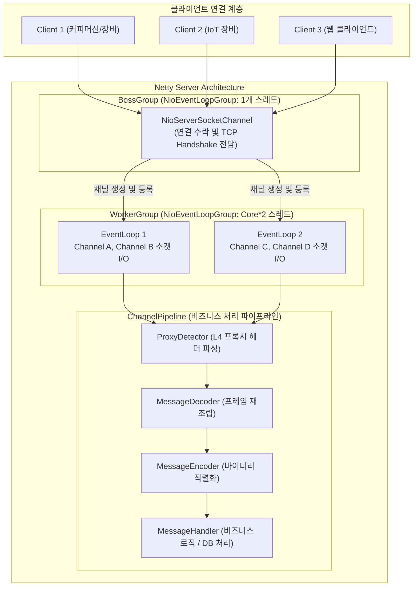

# [Java] 01. Netty 아키텍처와 이벤트 루프 스레드 모델

> [!NOTE]
> 고성능 비동기 이벤트 기반 네트워크 프레임워크인 **Netty**의 핵심 아키텍처와 **Reactor 스레드 모델(BossGroup / WorkerGroup)**, 그리고 실무 고성능 네트워크 서버의 `ServerBootstrap` 설정을 분석하여 정리한 학습 가이드입니다.

---

## 1. 전통적인 Socket I/O vs Netty 비동기 이벤트 기반 모델

전통적인 자바의 블로킹 소켓(`java.net.Socket`)은 클라이언트 연결당 1개의 스레드를 할당하는 **Thread-per-Connection** 방식을 사용했습니다. 이 방식은 동시 접속자가 수천~수만 개로 증가할 경우 스레드 수 증가에 따른 심각한 컨텍스트 스위칭(Context Switching) 오버헤드와 OOM(Out of Memory)을 유발합니다.

Netty는 자바 NIO(`java.nio`)를 추상화하여 적은 수의 스레드로 대량의 연결을 효율적으로 처리하는 **다중 반응자 패턴(Multi-Reactor Pattern)**을 채택했습니다.



---

## 2. 핵심 구성 요소 상세 분석

### 2.1 BossGroup과 WorkerGroup의 분리
- **`BossGroup`**: 서버 소켓(`NioServerSocketChannel`)에 바인딩되어 클라이언트의 신규 TCP 연결 수락(`OP_ACCEPT`)만 전담합니다. 일반적으로 1개(또는 포트당 1개)의 스레드만으로도 초당 수천 건의 연결을 가볍게 수락할 수 있습니다.
- **`WorkerGroup`**: 이미 연결이 맺어진 소켓 채널(`NioSocketChannel`)의 데이터 읽기(`OP_READ`) 및 쓰기(`OP_WRITE`) 이벤트를 전담합니다. 일반적으로 `CPU 코어 수 * 2`개의 스레드를 할당하여 Non-blocking으로 패킷을 처리합니다.

### 2.2 EventLoop와 단일 스레드 실행 보장
- 하나의 `Channel`은 라이프사이클 동안 **오직 하나의 `EventLoop`에만 등록**됩니다.
- 따라서 동일한 채널에서 발생하는 모든 입출력 이벤트는 항상 동일한 스레드에서 순차적으로 실행되므로, 채널 핸들러 내부에서 불필요한 동기화(Synchronization) 락을 최소화할 수 있습니다.

---

## 3. 실전 `ServerBootstrap` 구성 분석 (고성능 소켓 통신 서버 아키텍처)

실무 네트워크 서버 부트스트랩 구성 예시입니다.

```java
package com.example.netty.server;

import io.netty.bootstrap.ServerBootstrap;
import io.netty.channel.*;
import io.netty.channel.nio.NioEventLoopGroup;
import io.netty.channel.socket.nio.NioServerSocketChannel;
import io.netty.handler.logging.LogLevel;
import io.netty.handler.logging.LoggingHandler;
import org.springframework.beans.factory.annotation.Value;
import org.springframework.stereotype.Component;

@Component
public class NettyServer {

    EventLoopGroup bossGroup;
    EventLoopGroup workerGroup;

    @Value("${netty.bossThreadCount:1}")
    int bossThreadCount;

    @Value("${netty.workerThreadCount:4}")
    int workerThreadCount;

    public void run() {
        // 1. 이벤트 루프 스레드 풀 할당
        bossGroup = new NioEventLoopGroup(bossThreadCount);
        workerGroup = new NioEventLoopGroup(workerThreadCount);

        try {
            ServerBootstrap serverBootstrap = new ServerBootstrap();

            serverBootstrap.group(bossGroup, workerGroup)
                    .channel(NioServerSocketChannel.class)
                    .handler(new LoggingHandler(LogLevel.INFO))
                    // 2. OS TCP 연결 대기 큐 크기 설정
                    .option(ChannelOption.SO_BACKLOG, 1024)
                    .childHandler(new ChannelInitializer<SocketChannel>() {
                        @Override
                        protected void initChannel(SocketChannel ch) throws Exception {
                            ChannelPipeline pipeline = ch.pipeline();

                            // 3. 수신 버퍼 동적 할당기 설정 (최소 64B, 기본 1KB, 최대 64KB)
                            ch.config().setRecvByteBufAllocator(new AdaptiveRecvByteBufAllocator(64, 1024, 65536));
                            ch.config().setOption(ChannelOption.SO_RCVBUF, 32768);

                            // 4. 파이프라인 핸들러 체인 등록
                            pipeline.addLast("proxyDetector", new ProxyDetector());
                            pipeline.addLast("decoder", new MessageDecoder());
                            pipeline.addLast("encoder", new MessageEncoder());
                            pipeline.addLast("handler", new MessageHandler(appMapper));
                        }
                    })
                    // 5. TCP 소켓 커널 옵션 최적화
                    .childOption(ChannelOption.TCP_NODELAY, true)
                    .childOption(ChannelOption.SO_KEEPALIVE, true);

            // 6. 포트 바인딩 및 동기 대기
            ChannelFuture future = serverBootstrap.bind(SERVER_PORT).sync();
            log.info("Netty Server started on port: {}", SERVER_PORT);

        } catch (Exception e) {
            log.error("Netty Server startup failed: ", e);
        }
    }
}
```

### 3.1 핵심 소켓 옵션의 기술적 배경
1. **`ChannelOption.SO_BACKLOG (1024)`**:
   - TCP 3-Way Handshake가 완료되었지만 애플리케이션의 `accept()`가 호출되기 전까지 대기하는 OS 레벨의 **연결 수락 큐(Accept Queue) 크기**입니다.
   - 트래픽이 폭증할 때 SYN 패킷 드롭(`SYN Flood` 또는 연결 거부)을 방지하기 위해 기본값(보통 50~128)보다 넉넉한 1024 이상으로 증설합니다.
2. **`ChannelOption.TCP_NODELAY (true)`**:
   - Nagle 알고리즘을 비활성화합니다.
   - Nagle 알고리즘은 네트워크 효율을 위해 작은 패킷들을 버퍼에 모아두었다가 ACK를 받은 뒤 한꺼번에 전송하지만, 이는 0.1초 단위의 지연(Delay)을 유발합니다. IoT 장비나 금융 결제처럼 빠른 응답성이 요구되는 프로토콜에서는 필수적으로 `true`로 설정합니다.
3. **`ChannelOption.SO_KEEPALIVE (true)`**:
   - OS 수준에서 일정 시간(기본 2시간) 동안 데이터 교환이 없는 유휴 소켓에 대해 TCP Keep-Alive Probe 패킷을 보내 연결의 유효성을 체크합니다.
4. **`AdaptiveRecvByteBufAllocator(64, 1024, 65536)`**:
   - 패킷 유입 크기에 맞춰 바이트 버퍼의 할당량을 동적으로 자동 조절합니다. 패킷이 작을 때는 메모리를 적게 쓰고, 대용량 데이터 유입 시 최대 64KB까지 늘려 불필요한 메모리 낭비를 줄입니다.

---

## 4. 우아한 종료 (Graceful Shutdown)

서버 재배포나 JVM 종료 시 진행 중이던 I/O 작업과 버퍼 플러시를 안전하게 마무리하기 위해 스프링의 `ContextClosedEvent`를 감지하여 Graceful Shutdown을 수행해야 합니다.

```java
@Override
public void onApplicationEvent(ContextClosedEvent event) {
    try {
        log.info("Initiating Netty Server Graceful Shutdown...");
        // 콰이어트 피리어드(Quiet Period) 동안 신규 연결을 차단하고 기존 작업 처리
        Future<?> bossShutdown = bossGroup.shutdownGracefully();
        Future<?> workerShutdown = workerGroup.shutdownGracefully();

        bossShutdown.sync();
        workerShutdown.sync();
        log.info("Netty Server Gracefully Shutdown successfully.");
    } catch (Exception e) {
        log.error("Error during Netty shutdown: ", e);
    }
}
```

- `shutdownGracefully()`는 신규 유입되는 연결을 즉시 거절하고, 이미 파이프라인에 대기 중인 패킷을 처리할 수 있는 유예 시간(Quiet Period)을 제공한 뒤 스레드를 안전하게 회수합니다.\n