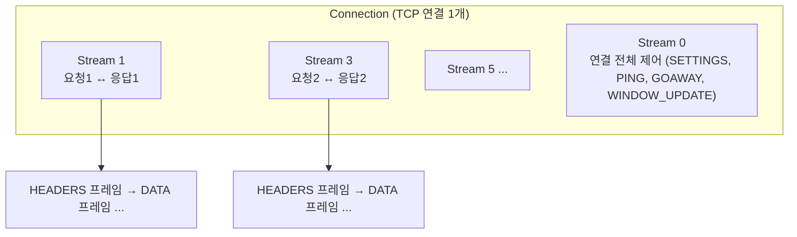
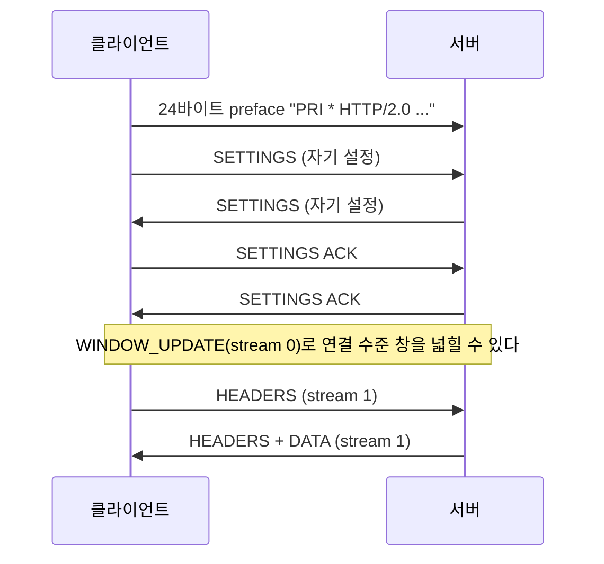
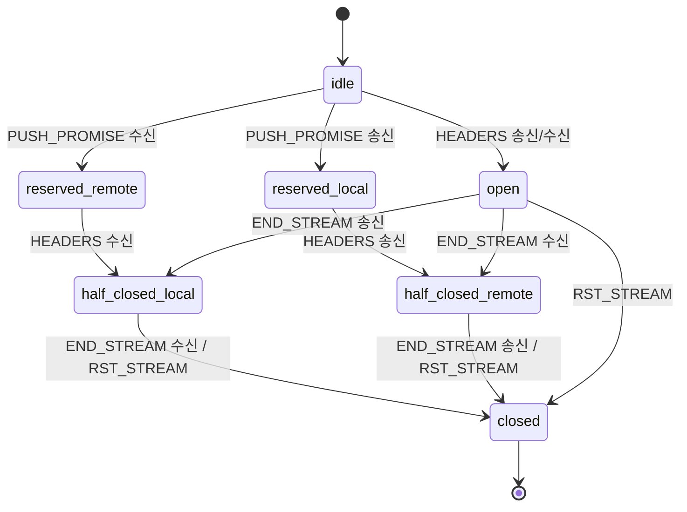

# HTTP/2 핵심 개념 — 프레임·스트림·HPACK·흐름 제어·SETTINGS

> [!NOTE]
> HTTP/2(RFC 9113)를 **직접 구현하거나 설정을 다루는 사람**이 알아야 할 부분만 추렸다. 모든 항목에 **검증 상태**를 표시했다.
> - ✔ **원문 확인**: RFC 9113(httpwg.org) 또는 IANA 레지스트리에서 직접 확인
> - ○ **자료 일치**: 별도 교육 자료와 일치하고 다른 항목과 모순 없음
> - △ **기억/일반 지식**: 원문 직접 대조는 못 함. 인용 전에 RFC 확인 권장

## 0. 한눈에 보기



| 개념 | 정의 |
| --- | --- |
| **Connection** | TCP(또는 TLS over TCP) 연결 하나 |
| **Stream** | 연결 안의 독립된 양방향 프레임 흐름. **요청·응답 한 쌍(트랜잭션)** 에 해당. 정수 ID로 구분 |
| **Message** | 요청 또는 응답 하나 (헤더 + 본문) |
| **Frame** | 전송의 최소 단위. 9바이트 헤더 + payload |

한 연결에서 여러 스트림이 **프레임 단위로 섞여(interleave) 동시에** 오간다. 이것이 **다중화(multiplexing)** 이고, HTTP/1.1이 요청마다 연결을 여러 개 열던 문제를 푼다.

## 1. HTTP/1.1과 무엇이 다른가

| 항목 | HTTP/1.1 | HTTP/2 |
| --- | --- | --- |
| 형식 | **텍스트** | **바이너리 프레임** |
| 연결당 동시 요청 | 1개 (파이프라이닝은 HOL 블로킹으로 사실상 못 씀) | **여러 개** (스트림) |
| 병렬성 확보 방법 | **TCP 연결을 여러 개** | 연결 1개로 충분 |
| 헤더 | 매 요청마다 전체를 텍스트로 반복 | **HPACK 압축** (이미 보낸 헤더는 인덱스로) |
| 서버가 먼저 보내기 | 불가 | 서버 푸시(선택) |

> [!TIP] 남아 있는 HOL 블로킹
> HTTP/2는 **응용 계층**의 HOL 블로킹을 없앴지만 **TCP 계층**의 것은 남는다. TCP 패킷이 하나 유실되면 재전송될 때까지 **연결 위의 모든 스트림**이 같이 기다린다. 이를 피하려고 HTTP/3은 TCP 대신 QUIC(UDP 기반)을 쓴다 (RFC 9114). ○

## 2. 프레임 구조

### 2-1. 9바이트 프레임 헤더 ✔

```
+-----------------------------------------------+
|                 Length (24)                   |   payload 길이 (헤더 9바이트 제외)
+---------------+---------------+---------------+
|   Type (8)    |   Flags (8)   |
+-+-------------+---------------+-------------------------------+
|R|                 Stream Identifier (31)                      |   R = 예약 1비트
+=+=============================================================+
|                   Frame Payload (0...)                      ...
+---------------------------------------------------------------+
```

- **Length**는 24비트라 이론상 최대 **16,777,215**바이트. 실제 상한은 수신 측이 알린 `SETTINGS_MAX_FRAME_SIZE`다 (기본 **16,384**). ✔
- **Stream Identifier가 0**이면 연결 전체에 대한 프레임이다 (SETTINGS, PING, GOAWAY, 연결 수준 WINDOW_UPDATE). ✔

### 2-2. 프레임 유형 ✔ (IANA 레지스트리로 코드 확인)

| 유형 | 코드 | 용도 | 정의된 플래그 |
| --- | --- | --- | --- |
| DATA | `0x00` | 본문 전송 | `END_STREAM`(0x1), `PADDED`(0x8) |
| HEADERS | `0x01` | 스트림을 열고 헤더 전송 | `END_STREAM`(0x1), `END_HEADERS`(0x4), `PADDED`(0x8), `PRIORITY`(0x20) |
| PRIORITY | `0x02` | 우선순위(**RFC 9113에서 폐기**) | – |
| RST_STREAM | `0x03` | **스트림 하나**를 즉시 종료 | – |
| SETTINGS | `0x04` | 연결 설정 교환 | `ACK`(0x1) |
| PUSH_PROMISE | `0x05` | 서버 푸시 예고 | `END_HEADERS`(0x4), `PADDED`(0x8) |
| PING | `0x06` | 생존 확인 / RTT 측정 | `ACK`(0x1) |
| GOAWAY | `0x07` | **연결**을 종료하겠다는 통지 | – |
| WINDOW_UPDATE | `0x08` | 흐름 제어 창 확대 | – |
| CONTINUATION | `0x09` | 헤더 블록 이어서 전송 | `END_HEADERS`(0x4) |

> [!WARNING] 코드 번호를 기억에 의존하지 말 것
> 이 표를 만드는 중 문서 요약 도구가 `GOAWAY=0x08`, `WINDOW_UPDATE=0x09`, `CONTINUATION=0x0A`라고 잘못 요약한 적이 있다. **IANA 레지스트리(`iana.org/assignments/http2-parameters`)로 `0x07`/`0x08`/`0x09`임을 확인**했다. 자동 요약을 그대로 옮기면 틀릴 수 있다.

> [!NOTE] 플래그에 대한 주의 [△]
> `CONTINUATION`에 정의된 플래그는 `END_HEADERS`뿐이다. `END_STREAM`은 `HEADERS`/`DATA`에만 있다. 일부 교육 자료가 CONTINUATION에 `END_STREAM`을 같이 적는 경우가 있는데 규격과 다르다.

### 2-3. 메시지 → 프레임 변환 ○

HTTP 메시지 하나는 **여러 프레임**으로 나뉜다. 헤더는 `HEADERS`(+필요 시 `CONTINUATION`), 본문은 `DATA`다.

```
요청                                   응답
HEADERS  (END_HEADERS, END_STREAM)    HEADERS  (END_HEADERS)
  :method = GET                         :status = 200
  :scheme = http                        content-type = text/html
  :path   = /index.html               DATA
  :authority = example.com              "May The Force"
                                      DATA     (END_STREAM)
                                        "Be With You"
```

- **메시지의 끝은 `END_STREAM` 플래그**가 붙은 프레임이다. 요청에 본문이 없으면 `HEADERS`에 `END_STREAM`이 같이 붙는다.
- **한 메시지를 이루는 프레임은 순서대로** 보내야 한다. 다른 스트림의 프레임은 사이에 끼어들 수 있다 (헤더 블록은 예외, 아래 §7-3). ○
- 본문이 `MAX_FRAME_SIZE`보다 크면 **DATA 프레임을 여러 개로 쪼갠다.** 헤더가 크면 `CONTINUATION`을 쓴다.

### 2-4. 의사 헤더(pseudo-header) ✔/△

`:`로 시작하는 헤더. **정의된 것만 쓸 수 있고, 일반 헤더보다 앞에 와야 한다.** 일반 헤더 이름은 **전부 소문자**여야 한다. ✔(규칙 존재) / 세부 순서는 △

| 의사 헤더 | 방향 | 의미 |
| --- | --- | --- |
| `:method` | 요청 | `GET`, `POST` … |
| `:scheme` | 요청 | `http` / `https` |
| `:authority` | 요청 | HTTP/1.1의 `Host`에 해당 (호스트[:포트]) |
| `:path` | 요청 | 요청 경로와 쿼리 |
| `:status` | 응답 | 상태 코드 |

> [!TIP] 5G 코어에서 이 헤더가 중요한 이유
> 3GPP SBI는 URI가 `{apiRoot}/{apiName}/{apiVersion}/{리소스}/{동작}` 구조라서 **`:path`의 앞부분만 봐도 어떤 서비스 요청인지 알 수 있고**, `:authority`로 어느 NF로 보낼지 정한다. 그래서 스택이 이 두 헤더로 라우팅을 한다.

## 3. 연결 시작

### 3-1. 시작하는 방법 ✔

| 방식 | 설명 |
| --- | --- |
| **`h2` (TLS 위)** | TLS 핸드셰이크 중 **ALPN**으로 `h2`를 협상한다. (RFC 9113 §3.1) |
| **prior knowledge (평문)** | 상대가 HTTP/2를 지원한다는 걸 **미리 알고** TCP 연결 직후 바로 preface를 보낸다. (§3.3) |
| ~~`h2c` Upgrade~~ | HTTP/1.1 요청에 `Upgrade: h2c`를 실어 전환하던 방식. **RFC 9113에서 폐기**됐다(널리 배포된 적 없음). (§3.1) |

5G 코어처럼 **모든 노드가 HTTP/2를 쓴다고 정해진 망**에서는 Upgrade 협상 없이 prior knowledge로 바로 시작한다. ○

### 3-2. 연결 preface ✔

클라이언트가 연결 직후 보내는 **고정 24바이트**:

```
PRI * HTTP/2.0\r\n\r\nSM\r\n\r\n
```

- 뒤에 **반드시 SETTINGS 프레임이 이어진다**(비어 있어도 됨). 서버도 첫 프레임이 SETTINGS여야 한다. ✔
- 서버는 **처음 받은 24바이트가 이 문자열과 다르면 연결을 끊는다.** HTTP/1.1 클라이언트가 잘못 접속한 경우를 걸러내는 장치다. ○
- 일부러 `HTTP/2.0`이라는 존재하지 않는 형식을 쓴 것은 **HTTP/1.x 서버가 이를 정상 요청으로 오인하지 않게** 하려는 의도로 알려져 있다. △



## 4. SETTINGS — 내 한계를 상대에게 알리는 프레임 ✔

SETTINGS는 **자기가 수신할 때의 한계**를 상대에게 알린다(상대가 이를 지켜서 보낸다). 받으면 **ACK 플래그를 단 빈 SETTINGS**로 응답한다. ✔

| 이름 | 코드 | 기본값 | 허용 범위 / 비고 |
| --- | --- | --- | --- |
| `SETTINGS_HEADER_TABLE_SIZE` | `0x01` | 4,096 | HPACK 동적 테이블 크기 |
| `SETTINGS_ENABLE_PUSH` | `0x02` | 1 | **0 또는 1만** 허용, 그 외는 `PROTOCOL_ERROR`. 클라이언트만 보냄 |
| `SETTINGS_MAX_CONCURRENT_STREAMS` | `0x03` | **제한 없음** | **100 이상을 권장** |
| `SETTINGS_INITIAL_WINDOW_SIZE` | `0x04` | 65,535 | 최대 `2^31−1`, 초과 시 `FLOW_CONTROL_ERROR` |
| `SETTINGS_MAX_FRAME_SIZE` | `0x05` | 16,384 | `2^14` ~ `2^24−1` |
| `SETTINGS_MAX_HEADER_LIST_SIZE` | `0x06` | 제한 없음 | 수신할 헤더 목록의 크기 상한 |

- **`MAX_FRAME_SIZE`를 올리면** 큰 본문을 보낼 때 프레임 수가 줄어 CPU가 절약된다. 하지만 **TLS 레코드는 평문 최대 16,384바이트**라서(TLS의 한계), 그보다 큰 HTTP/2 프레임은 **여러 TLS 레코드로 쪼개져 암호화**된다. 그래서 TLS 환경에서는 프레임을 크게 키워도 이득이 줄어든다. ○(교육자료) / TLS 레코드 크기는 △
- **`INITIAL_WINDOW_SIZE`는 스트림 창의 초기값**이다. 연결 수준 창은 SETTINGS로 못 바꾸고 `WINDOW_UPDATE`(stream 0)로만 키운다. ✔(규칙) / ○

## 5. 스트림

### 5-1. 스트림 ID 규칙 ✔ (RFC 9113 §5.1.1 원문 확인)

| 규칙 | 내용 |
| --- | --- |
| 개시자별 홀짝 | **클라이언트가 연 스트림은 홀수**, **서버가 연 스트림은 짝수** (MUST) |
| 증가 | 새 스트림 ID는 **그 개시자가 이미 열었거나 예약한 모든 ID보다 커야** 한다 (MUST) |
| **재사용 불가** | "Stream identifiers cannot be reused." |
| 0번 | 연결 전체 제어용 |
| 크기 | 31비트 (최대 `2^31−1`) |

**ID가 바닥나면 (소진):** 클라이언트는 **새 연결을 연다.** 서버는 `GOAWAY`를 보내 클라이언트가 새 연결을 열게 한다. ✔

→ 클라이언트가 쓰는 홀수 ID만 보면 한 연결에서 **약 10억 개**(`(2^31−1)/2`)의 요청을 보낼 수 있다. 오래 유지되는 연결을 쓰는 서버 간 통신(5G 코어)에서는 이 한계에 도달할 수 있어서, **임계치를 정해 여러 연결에 분산하고 임계치를 넘으면 그 연결로의 새 요청을 막은 뒤 새 연결로 갈아타는** 구현을 둔다. ○

### 5-2. 스트림 상태 ○/△



- 요청에 본문이 없으면: `open` → (END_STREAM 송신) → `half_closed_local` → (응답 END_STREAM 수신) → `closed`.
- `MAX_CONCURRENT_STREAMS`는 **동시에 열려 있는 스트림 수**의 상한이다. `open`과 `half_closed`가 셈에 들어간다. △

### 5-3. 동시 스트림 제한이 걸리는 모습 ○

`MAX_CONCURRENT_STREAMS = 10`일 때:

| 순서 | 사용 중 스트림 수 | 동작 |
| --- | --- | --- |
| 1 | 1 | ID 1 요청 전송 |
| 2 | 0 | ID 1 응답 수신 → 스트림 종료, 수 감소 |
| 3 | 10 | 요청 10개를 응답 없이 연속 전송 |
| 4 | 10 | **11번째 요청은 보낼 수 없다** (제한). 대기해야 한다 |
| 5 | 9 | 응답 하나가 도착해 스트림 종료 |
| 6 | 10 | 대기하던 요청 1개를 보낼 수 있다 |

**제한은 송신자 측에서 지켜야 한다.** 보내는 쪽이 자기가 열어 둔 스트림 수를 세어야 하고, 한도에 도달하면 신규 요청을 큐에 쌓아야 한다.

## 6. 흐름 제어 (Flow Control)

### 6-1. 규칙 ✔

- **DATA 프레임만** 흐름 제어 대상이다. 헤더 프레임과 제어 프레임은 대상이 아니다. ✔
- 창(window)은 **두 개**다: **스트림별 창**과 **연결 전체 창**. DATA 하나를 보내면 **둘 다** 줄어든다. 둘 중 하나라도 0이면 못 보낸다. ✔
- **초기값은 둘 다 65,535바이트.** 최대 `2^31−1`. ✔
- 수신 측이 `WINDOW_UPDATE`로 **창을 늘려 준다**(스트림 번호 0이면 연결 창). ✔
- 연결 창은 SETTINGS로 못 바꾸고 **WINDOW_UPDATE(stream 0)로만** 바꾼다. ○

**왜 필요한가:** 송신자가 수신자가 처리할 수 있는 속도보다 빠르게 보내서 **수신 버퍼가 터지는 것을 막기 위해서다.** TCP에도 흐름 제어가 있지만 TCP는 **연결 전체**만 본다. HTTP/2는 한 연결 안에 스트림이 여럿이므로 **느린 스트림 하나가 연결 전체를 막지 않도록** 스트림별 창이 따로 필요하다.

### 6-2. 숫자로 따라가 보기 ○

연결 창 = 200,000바이트(WINDOW_UPDATE로 확대), 스트림 창 초기값 = 100,000바이트, 응답 DATA = 150,000바이트인 경우:

| 순서 | 사건 | 연결 창 | 스트림 창 |
| --- | --- | --- | --- |
| 1 | 요청 전송, 스트림 창 100,000으로 시작 | 200,000 | 100,000 |
| 2 | 응답 150,000 중 **100,000만** 전송 (스트림 창 한도) | 100,000 | **0** |
| 3 | 나머지 50,000은 **대기** | 100,000 | 0 |
| 4 | 수신 측이 `WINDOW_UPDATE(stream)` 50,000 | 100,000 | 50,000 |
| 5 | 나머지 50,000 전송 후 스트림 종료 | 50,000 | – |

반대로 **연결 창이 먼저 바닥나면** 모든 스트림이 같이 멈추고, `WINDOW_UPDATE(stream 0)`가 와야 풀린다.

> [!WARNING] 흐름 제어 창이 작으면 느려진다
> 기본값 65,535는 **큰 응답에서 `WINDOW_UPDATE` 왕복이 잦아** 처리량이 떨어진다. 서버 간 통신처럼 지연이 낮고 대역폭이 큰 환경에서는 `INITIAL_WINDOW_SIZE`를 수 MB로 키운다. 대신 연결·스트림마다 그만큼의 수신 버퍼가 필요하다(메모리 비용). △

## 7. 헤더 압축 — HPACK (RFC 7541)

### 7-1. 왜 필요한가

HTTP 요청은 **헤더가 매번 거의 같다**(같은 `:authority`, `user-agent`, 쿠키 …). 본문은 작은데 헤더가 큰 API 호출에서 헤더 전송 비용이 크다. HPACK은 이미 보낸 헤더를 **인덱스로 대체**해서 줄인다.

### 7-2. 구조 ○/△

| 요소 | 설명 |
| --- | --- |
| **정적 테이블** | 규격에 미리 정의된 **61개** 항목 (RFC 7541 부록 A). 예: 인덱스 2 = `:method GET`, 3 = `:method POST`, 4 = `:path /`, 7 = `:scheme https`, 8 = `:status 200` △ |
| **동적 테이블** | **연결마다**, **방향마다** 있는 표. 처음 보낸 헤더가 여기에 추가되고, 이후에는 인덱스로 참조한다. 크기 상한이 `SETTINGS_HEADER_TABLE_SIZE`(기본 4,096) |
| **Huffman 부호화** | 문자열 값을 정적 Huffman 코드로 줄인다 |

**동작 (○):**
1. 첫 요청: 정적 테이블에 있는 헤더는 **인덱스**로, 나머지는 **Huffman**으로 압축. 양쪽 동적 테이블에 저장.
2. 같은 요청을 다시 보내면: 정적·동적 테이블의 **인덱스(1바이트 안팎)** 로 대체.

### 7-3. 이 구조가 만드는 제약 △

- **동적 테이블은 상태를 가진다.** 양쪽이 **같은 순서로** 갱신해야 같은 표를 유지한다. 그래서 **헤더 블록은 순서대로 처리**해야 하고, `HEADERS`와 그 뒤 `CONTINUATION`들은 **다른 프레임이 끼어들지 않고 연속**으로 와야 한다.
- 그래서 HPACK 압축·해제는 **연결 단위로 직렬화**된다. 스레드로 병렬 처리하려면 연결(세션)을 스레드에 고정해야 한다.
- 이 때문에 구현들은 **한 세션(연결)을 한 스레드에 배정**하는 경우가 많다. △ 대표적인 C 라이브러리 nghttp2는 공식 가이드가 **"단일 `nghttp2_session` 객체는 한 시점에 한 스레드만 사용해야 한다"** 고 명시한다. ✔ ([nghttp2 API 모델 §10](개발%20%28CS%29/네트워크/[HTTP]%20nghttp2%20API%20모델%20—%20세션·콜백·입출력%20루프.md))

## 8. 우선순위와 서버 푸시 — 지금은 거의 쓰이지 않는다

| 기능 | 상태 |
| --- | --- |
| **스트림 우선순위**(가중치 1~256, 종속성 트리) | **RFC 9113에서 폐기**("deprecates the priority signaling defined in RFC 7540"). 복잡하고 구현이 제각각이었다고 명시 ✔ |
| 대안 | RFC 9218(`PRIORITY_UPDATE`, `priority` 헤더) 등 새 방식 △ |
| **서버 푸시** | 규격에는 남아 있다(선택 기능). `SETTINGS_ENABLE_PUSH=0`으로 끌 수 있다 ✔ |

> [!NOTE] 5G 코어의 "우선순위"는 HTTP/2 우선순위가 아니다
> HTTP/2의 스트림 우선순위는 **홉 단위**(연결 양 끝)로만 유효하다. 5G SBI는 **종단 간** 우선순위를 위해 **`3gpp-sbi-message-priority` 헤더**(0~31, 낮을수록 높음)를 쓴다. 과부하 상황에서 "이 우선순위 이상은 제한을 무시한다" 같은 정책도 이 헤더 값을 기준으로 구현된다. ○

## 9. 생존 확인과 종료

### 9-1. PING ✔

- payload **8바이트**(의미 없는 데이터). 받으면 **같은 payload에 `ACK`를 달아 반드시 응답**해야 한다 (MUST). ✔
- 용도: ① **연결이 살아 있는지** 확인 ② **RTT 측정**.
- **왜 필요한가:** TCP는 상대 장비 전원이 나가거나 중간 장비가 연결 상태를 지워도 **한참 동안 모른다**(half-open). 응용 계층 PING으로 죽은 연결을 직접 감지한다. ○
- 구현에서는 보통 **일정 간격으로 보내고, 응답이 N번 연속 없으면 연결을 끊는** 정책을 둔다 ○

### 9-2. GOAWAY와 RST_STREAM

| | `RST_STREAM` | `GOAWAY` |
| --- | --- | --- |
| 범위 | **스트림 하나** 종료 | **연결 전체** 종료 예고 |
| 담는 정보 | 에러 코드 | **마지막으로 처리한 스트림 ID** + 에러 코드 ✔ |
| 용도 | 요청 취소, 에러 | 서버 점검·재시작 시 **정상 종료**, 스트림 ID 소진 시 새 연결 유도 ✔ |

`GOAWAY`의 "마지막 스트림 ID"는 **그 ID 이하의 요청은 처리했거나 처리 중이고, 그보다 큰 요청은 처리하지 않았으니 재전송해도 안전하다**는 정보를 준다. △

### 9-3. 에러 코드 △

| 코드 | 이름 | 코드 | 이름 |
| --- | --- | --- | --- |
| `0x0` | NO_ERROR | `0x7` | REFUSED_STREAM |
| `0x1` | PROTOCOL_ERROR | `0x8` | CANCEL |
| `0x2` | INTERNAL_ERROR | `0x9` | COMPRESSION_ERROR |
| `0x3` | FLOW_CONTROL_ERROR | `0xa` | CONNECT_ERROR |
| `0x4` | SETTINGS_TIMEOUT | `0xb` | ENHANCE_YOUR_CALM |
| `0x5` | STREAM_CLOSED | `0xc` | INADEQUATE_SECURITY |
| `0x6` | FRAME_SIZE_ERROR | `0xd` | HTTP_1_1_REQUIRED |

(RFC 9113 §7. 이 표는 기억 기준이라 인용 전에 IANA 레지스트리 확인.)

## 10. TLS와의 관계

| 항목 | 내용 |
| --- | --- |
| 협상 | TLS 핸드셰이크 중 ALPN `h2` ✔ |
| 최소 버전 | HTTP/2 over TLS는 **TLS 1.2 이상**을 요구한다 △ (RFC 9113 §9.2) |
| 레코드 | TLS 한 레코드의 평문 최대는 16,384바이트 → 큰 HTTP/2 프레임은 여러 레코드로 쪼개져 암호화 ○ |
| 상호 인증 | **mTLS**: 서버가 클라이언트 인증서도 검증. 인증·인가 방식 비교는 [인증·인가 방식 비교](개발%20%28CS%29/보안/[보안]%20인증·인가%20방식%20비교%20-%20API%20Key·OAuth2·JWT·HMAC·mTLS.md) |

## 11. 자주 헷갈리는 점

| 질문 | 답 |
| --- | --- |
| 스트림 ID는 요청이 끝나면 재사용되나? | **아니다.** 연결 안에서 한 번 쓴 ID는 다시 못 쓴다 ✔ |
| `MAX_CONCURRENT_STREAMS`는 누가 지키나? | **보내는 쪽**이 상대가 알린 값을 지킨다 |
| 연결 창을 SETTINGS로 키울 수 있나? | **없다.** `WINDOW_UPDATE`(stream 0) |
| 헤더도 흐름 제어를 받나? | **아니다.** DATA만 ✔ |
| 한 연결로 충분하면 왜 여러 연결을 두나? | ① 스트림 ID 소진 대비 ② TCP HOL 블로킹 완화 ③ 한 연결의 처리량 한계 ○ |
| HTTP/2에서 `Host` 헤더는? | `:authority`가 대신한다 |
| 헤더 이름 대소문자는? | **전부 소문자**여야 한다 ✔ |
| 압축 오류가 나면? | HPACK 상태가 어긋난 것이라 **연결 전체**가 `COMPRESSION_ERROR`로 종료된다 △ |

## 12. 검증 상태 요약

| 항목 | 상태 | 근거 |
| --- | --- | --- |
| 프레임 헤더 구조 | ✔ | RFC 9113 §4.1 (httpwg.org) |
| 프레임 유형 코드 10종 | ✔ | IANA HTTP/2 Frame Type Registry |
| SETTINGS 코드·기본값·범위 | ✔ | RFC 9113 §6.5.2, IANA Settings Registry |
| preface 24바이트, SETTINGS 뒤따름 | ✔ | RFC 9113 §3.4 |
| ALPN `h2`, prior knowledge, `h2c` Upgrade 폐기 | ✔ | RFC 9113 §3.1, §3.3 |
| 스트림 ID 규칙·소진 처리 | ✔ | RFC 9113 §5.1.1 |
| 흐름 제어 규칙(DATA만, 초기 65,535, 최대 2^31−1) | ✔ | RFC 9113 §5.2 |
| 우선순위 폐기, 서버 푸시 선택 | ✔ | RFC 9113 §5.3, §8.4 |
| PING 8바이트·ACK, GOAWAY 필드 | ✔ | RFC 9113 §6.7, §6.8 |
| 스트림 상태 전이, HPACK 세부, 에러 코드 표, TLS 1.2 이상 | △ | 기억 기준. RFC 9113 §5.1, RFC 7541, §7, §9.2 확인 필요 |

## 관련 문서

- [nghttp2 API 모델 — 세션·콜백·입출력 루프](개발%20%28CS%29/네트워크/[HTTP]%20nghttp2%20API%20모델%20—%20세션·콜백·입출력%20루프.md) — 이 프로토콜을 구현한 C 라이브러리 사용법
- [OpenSSL로 mTLS 컨텍스트 만들기](개발%20%28CS%29/보안/[보안]%20OpenSSL로%20mTLS%20컨텍스트%20만들기%20—%20인증서·CA·검증·ALPN·논블로킹.md) — TLS·ALPN·mTLS
- [POSIX IPC와 System V IPC 비교 — 메시지 큐 중심](개발%20%28CS%29/CS%20기초/운영체제/[OS]%20POSIX%20IPC와%20System%20V%20IPC%20비교%20—%20메시지%20큐%20중심.md)
- [epoll — fd가 많아질 때의 대안](개발%20%28CS%29/언어/C언어/네트워크·시스템%20IO/[C]%20epoll%20—%20fd가%20많아질%20때의%20대안.md)
- [Non blocking / Select Model](개발%20%28CS%29/네트워크/[CS]%20Non%20blocking%20-%20Select%20Model%20-%20핵심%20개념%20및%20특징%20정리.md)
- 규격: RFC 9113(HTTP/2), RFC 7541(HPACK), RFC 9114(HTTP/3)
