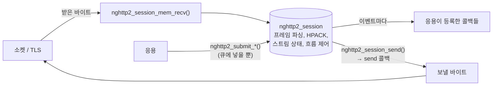
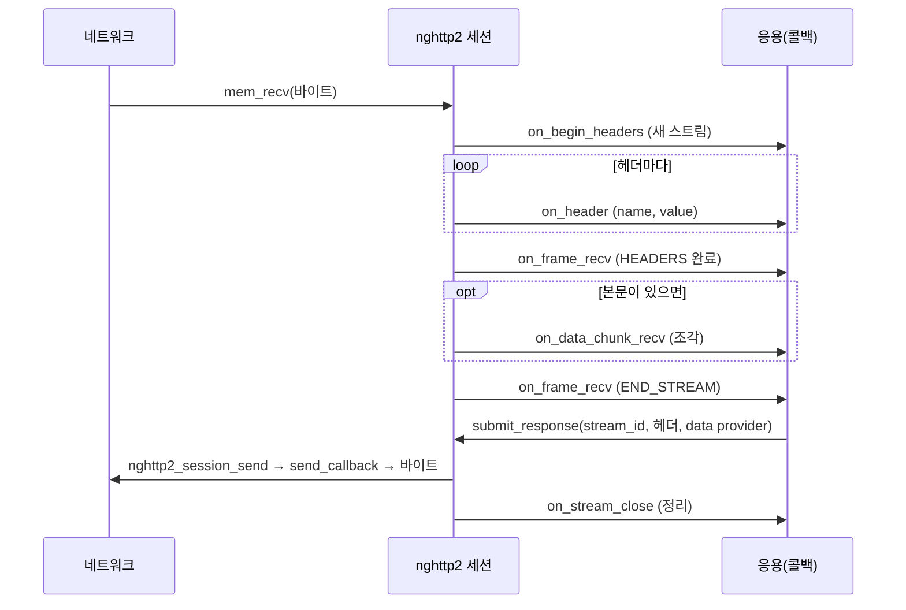

# nghttp2 API 모델 — 세션·콜백·입출력 루프

> [!NOTE]
> nghttp2는 C로 쓴 HTTP/2 구현 라이브러리다. 이 노트는 **라이브러리를 어떻게 끼워 넣는지(호출 순서와 책임 분담)** 를 정리한다. 프로토콜 자체는 [HTTP/2 핵심 개념](개발%20%28CS%29/네트워크/[HTTP]%20HTTP2%20핵심%20개념%20—%20프레임·스트림·HPACK·흐름%20제어·SETTINGS.md)을 본다.
> 검증 표기: ✔ nghttp2 공식 문서(튜토리얼·프로그래머 가이드·API 목록)에서 확인, △ 기억/일반 지식(원문 직접 대조는 못 함)
> 함수별 상세 문서(시그니처·반환값 전체)는 접근하지 못했다. 코드를 쓸 때는 설치된 버전의 헤더(`nghttp2/nghttp2.h`)를 기준으로 삼는다.

## 0. 한 줄 요약

**nghttp2는 I/O를 하지 않는다. 바이트를 넣으면 콜백이 호출되고, 보낼 것을 넣어 두면 바이트가 나온다.** ✔

> "nghttp2 only performs HTTP/2 protocol stuff based on input byte strings. It will call callback functions set by applications while processing input." (프로그래머 가이드)



## 1. 책임 분담 ✔

| nghttp2가 하는 일 | 응용이 해야 하는 일 |
| --- | --- |
| 프레임 파싱·생성 | **소켓 열기·읽기·쓰기** |
| HPACK 헤더 압축·해제 | **TLS** (OpenSSL 등) 핸드셰이크와 암복호화 → [OpenSSL 노트](개발%20%28CS%29/보안/[보안]%20OpenSSL로%20mTLS%20컨텍스트%20만들기%20—%20인증서·CA·검증·ALPN·논블로킹.md) |
| 스트림 상태 관리 | **이벤트 루프**(epoll 등)와 스레드 |
| 흐름 제어, SETTINGS·PING 처리 | **어느 상대로 보낼지**(라우팅), 연결 관리, 재접속 |
| 연결 preface 자동 전송(클라이언트) | 요청·응답의 **의미 처리** |

nghttp2에 소켓 함수는 없다. 그래서 "HTTP/2를 쓴다"와 "연결을 관리한다"는 **별개 문제**이고, 서버나 게이트웨이는 이 사이를 직접 채워야 한다.

## 2. 핵심 객체

| 객체 | 설명 | 검증 |
| --- | --- | --- |
| `nghttp2_session` | **불투명 구조체.** 연결 하나의 프로토콜 상태 전부를 가진다 | ✔ |
| `nghttp2_session_callbacks` | **콜백 함수 묶음.** 세션을 만들 때 넘기고 직후 `del`로 해제해도 된다 | ✔ |
| `nghttp2_nv` | 헤더 이름·값 한 쌍 (`name`, `value`, 길이, `flags`). 요청 시 **의사 헤더도 이 배열에 넣는다** | ✔(요청 헤더 배열은 튜토리얼 확인) / 필드 세부 △ |
| `nghttp2_settings_entry` | SETTINGS의 (ID, 값) 한 쌍 | △ |
| `nghttp2_option` | 세션 동작 옵션 묶음(자동 WINDOW_UPDATE 끄기 등) | 함수명 ✔ / 세부 △ |

## 3. 세션 생성 순서 ✔

```c
/* 1. 콜백 묶음 만들기 */
nghttp2_session_callbacks *callbacks;
nghttp2_session_callbacks_new(&callbacks);

/* 2. 콜백 등록 */
nghttp2_session_callbacks_set_send_callback2(callbacks, send_callback);
nghttp2_session_callbacks_set_on_begin_headers_callback(callbacks, on_begin_headers_callback);
nghttp2_session_callbacks_set_on_header_callback(callbacks, on_header_callback);
nghttp2_session_callbacks_set_on_frame_recv_callback(callbacks, on_frame_recv_callback);
nghttp2_session_callbacks_set_on_data_chunk_recv_callback(callbacks, on_data_chunk_recv_callback);
nghttp2_session_callbacks_set_on_stream_close_callback(callbacks, on_stream_close_callback);

/* 3. 세션 생성 — 서버는 server_new, 클라이언트는 client_new */
nghttp2_session_server_new(&session, callbacks, user_data);
/* 클라이언트: nghttp2_session_client_new(&session, callbacks, user_data); */

/* 4. 콜백 묶음 해제 (세션은 이미 복사해 가졌다) */
nghttp2_session_callbacks_del(callbacks);
```

- 마지막 인자 `user_data`가 **모든 콜백으로 다시 전달**된다. 연결별 응용 컨텍스트(소켓 fd, 버퍼, 스트림 표 등)를 여기에 둔다. △
- 연결이 끝나면 `nghttp2_session_del(session)`으로 세션을 해제한다. △

> [!WARNING] 함수 이름이 `…2`로 끝나는 새 계열이 있다 (버전 주의)
> 현재 공식 문서는 `nghttp2_session_mem_recv2`, `nghttp2_session_mem_send2`, `nghttp2_submit_request2`, `nghttp2_submit_response2`, `nghttp2_data_provider2`, `nghttp2_session_callbacks_set_send_callback2`처럼 **`2`가 붙은 이름**을 쓴다 ✔. API 목록에는 **`2`가 없는 옛 이름도 함께** 남아 있다 ✔(예: `nghttp2_session_mem_recv`, `nghttp2_submit_request`, `…_set_send_callback`).
> - **오래된 환경**(예: 1.36대)에는 **`2` 없는 이름만** 있는 것으로 알고 있다 △. 새 이름이 도입된 정확한 버전은 확인하지 못했다.
> - 두 계열의 차이는 **반환·길이 타입**(`ssize_t` 대신 새 타입)으로 알고 있다 △.
> - 어느 이름을 써야 하는지는 **설치된 헤더로 확인**한다: `grep -n "mem_recv" /usr/include/nghttp2/nghttp2.h`, 버전은 `pkg-config --modversion libnghttp2` 또는 `nghttp2ver.h`의 `NGHTTP2_VERSION`. △

## 4. 입력 경로 — 받은 바이트를 넣는다 ✔

```c
ssize_t n = nghttp2_session_mem_recv2(session, data, datalen);   /* 옛 이름: nghttp2_session_mem_recv */
```

> "The `mem_recv2()` function processes the data and may both invoke the previously setup callbacks and also queue outgoing frames." (튜토리얼)

- **한 번 호출에 여러 일이 일어난다.** 받은 바이트에서 프레임을 파싱해 **콜백을 부르고**, 동시에 **응답 프레임(SETTINGS ACK, PING ACK, WINDOW_UPDATE 등)을 보낼 큐에 쌓을 수 있다.**
- 따라서 **입력을 처리한 뒤에는 출력도 비워야 한다**(아래 §5, §7).
- 반환값은 소비한 바이트 수 또는 음수 오류(`NGHTTP2_ERR_*`). 오류의 종류별 의미는 △.

## 5. 출력 경로 — 보낼 바이트를 꺼낸다 ✔

두 방식 중 하나를 쓴다. 공식 가이드는 **메모리 방식을 더 단순하다**고 권한다.

| 방식 | 함수 | 설명 |
| --- | --- | --- |
| **콜백 방식** | `nghttp2_session_send(session)` | 프레임을 **직렬화해서 `send_callback`을 호출**한다. 콜백이 소켓/버퍼에 쓴다 |
| **메모리 방식** | `nghttp2_session_mem_send2(session, &data)` | **보낼 바이트의 포인터를 돌려준다.** 응용이 알아서 보낸다 |

```c
/* send 콜백: 라이브러리가 "이 바이트를 보내라"고 호출한다 */
static nghttp2_ssize send_callback(nghttp2_session *s, const uint8_t *data,
                                   size_t length, int flags, void *user_data) {
    /* data를 소켓(또는 SSL_write)으로 보낸다.
       더 못 보내면 NGHTTP2_ERR_WOULDBLOCK 을 돌려준다 ✔ */
}
```

- **`NGHTTP2_ERR_WOULDBLOCK`**: send 콜백이 이것을 돌려주면 라이브러리가 **보내기를 멈추고 나중에 다시 시도**한다. 논블로킹 소켓에서 **백프레셔**를 전달하는 방법이다. ✔(튜토리얼: 버퍼 임계치를 넘으면 이 값을 돌려준다)

## 6. `submit_*` 은 "보내라"가 아니라 "큐에 넣어라" ✔

> "it only queues the frame for transmission, and doesn't actually send it." (`nghttp2_submit_settings`, 튜토리얼)

실제 전송은 `nghttp2_session_send()` / `mem_send()`를 **부를 때** 일어난다. 이 분리가 이벤트 루프를 쓰는 서버에서 중요하다.

| 함수 | 용도 | 검증 |
| --- | --- | --- |
| `nghttp2_submit_settings(session, NGHTTP2_FLAG_NONE, iv, n)` | **SETTINGS** 프레임 큐잉 | ✔ |
| `nghttp2_submit_request2(session, pri_spec, nva, nvlen, data_prd, stream_user_data)` | **요청** 보내기. `nva`는 `:method`, `:scheme`, `:authority`, `:path` 등을 담은 `nghttp2_nv` 배열 | ✔ |
| `nghttp2_submit_response2(session, stream_id, nva, nvlen, data_prd)` | **응답** 보내기. 응답 본문은 data provider가 공급 | ✔ |
| `nghttp2_submit_ping` | **PING** 전송 | 이름 ✔ / 세부 △ |
| `nghttp2_submit_window_update` | 흐름 제어 창 확대 | 이름 ✔ / 세부 △ |
| `nghttp2_submit_rst_stream` | **스트림 취소** — 아직 안 보낸 HEADERS/DATA를 모두 취소한다 | ✔(가이드) |
| `nghttp2_submit_goaway`, `nghttp2_session_terminate_session` | **연결 종료 통지(GOAWAY)** | 이름 ✔ / 두 함수의 차이는 △ |

> [!TIP] 응답 본문을 어떻게 주는가 — data provider
> `submit_response2`는 본문을 직접 받지 않고 **data provider(읽기 콜백을 가진 구조체)** 를 받는다 ✔. 라이브러리가 **"프레임에 실을 만큼" 필요할 때마다 읽기 콜백을 불러** 본문을 가져간다. 흐름 제어 창과 프레임 크기 제한에 맞춰 **라이브러리가 조절**하므로, 응용이 큰 본문을 미리 잘라 둘 필요가 없다. (세부 동작은 △)

## 7. 이벤트 루프에 끼우기 ✔

```c
for (;;) {
    /* 둘 다 0이면 이 연결은 더 필요 없다 → 닫는다 ✔ */
    if (!nghttp2_session_want_read(session) &&
        !nghttp2_session_want_write(session)) break;

    /* (1) 소켓이 읽을 수 있으면: 읽어서 라이브러리에 넣는다 */
    n = read(fd, buf, sizeof(buf));                    /* TLS면 SSL_read */
    nghttp2_session_mem_recv2(session, buf, n);

    /* (2) 보낼 것이 있으면: 꺼내서 내보낸다 */
    nghttp2_session_send(session);                     /* → send_callback */
}
```

| 함수 | 의미 |
| --- | --- |
| `nghttp2_session_want_read()` | **더 받을 것이 있는가?** (0이면 읽기 불필요) |
| `nghttp2_session_want_write()` | **보낼 것이 있는가?** (0이면 쓰기 불필요) |

- 두 값이 모두 0이면 "connection is no-longer required and can be closed". ✔
- `want_write`가 참인데 소켓이 안 써지면 epoll에서 **`EPOLLOUT`을 등록**하고 쓸 수 있을 때 다시 `send`를 부른다. 평소에는 `EPOLLOUT`을 끄는 것이 일반적이다. △

## 8. 콜백

콜백 설정 함수는 `nghttp2_session_callbacks_set_*` 형태다. API 목록에 실제로 있는 것 ✔:

| 콜백 | 언제 불리나 | 서버 | 클라이언트 | 검증 |
| --- | --- | --- | --- | --- |
| `send_callback` | **보낼 바이트가 준비됨** | ○ | ○ | ✔ |
| `recv_callback` | 라이브러리가 **직접 읽으려 할 때**(콜백 방식 입력 `nghttp2_session_recv` 사용 시) | – | – | 이름 ✔ / 용도 △ |
| `on_begin_headers_callback` | **헤더 수신이 시작**됨(새 스트림). 스트림별 데이터를 만들기 좋은 시점 | ○ | ○ | ✔ |
| `on_header_callback` | **헤더 하나(이름/값)** 가 나올 때마다. 서버는 여기서 `:path` 등을 뽑는다 | ○ | ○ | ✔ |
| `on_frame_recv_callback` | **프레임 하나를 다 받음.** `END_STREAM` 플래그가 있으면 요청/응답이 끝난 것 | ○ | ○ | ✔ |
| `on_data_chunk_recv_callback` | **DATA 프레임 본문 조각**이 도착 | ○ | ○ | ✔ |
| `on_stream_close_callback` | **스트림이 닫히려 함.** 스트림별 자원 정리 | ○ | ○ | ✔ |
| `before_frame_send_callback`, `on_frame_send_callback`, `on_frame_not_send_callback` | 프레임을 보내기 전/후/못 보냄 | – | – | 이름 ✔ / 용도 △ |
| `error_callback` | 라이브러리가 오류를 알릴 때 | – | – | 이름 ✔ / 용도 △ |
| `on_invalid_frame_recv_callback`, `on_invalid_header_callback` | 규격에 어긋난 프레임/헤더 | – | – | 이름 ✔ / 용도 △ |

### 8-1. 서버가 요청 하나를 받는 흐름 ✔(튜토리얼 기준)



- 요청의 **의미 처리는 콜백 안(또는 콜백에서 큐에 넣은 뒤)** 에서 한다. 콜백은 라이브러리 안에서 불리므로 **오래 걸리는 일을 하면 같은 세션의 다른 스트림 처리가 막힌다.** 그래서 무거운 작업은 다른 스레드로 넘기고 **응답은 나중에 `submit_response`로** 보낸다. △ (일반 설계)
- 응답 `submit_response` 대상은 요청이 온 **`stream_id`** 다. 스트림 ID는 한 연결 안에서만 유일하므로, 비동기로 응답을 넘길 때는 **(연결 식별자, 스트림 ID) 쌍**을 같이 보관해야 한다.

### 8-2. 클라이언트 쪽 ✔

- 세션을 `nghttp2_session_client_new`로 만들면, **연결 preface 24바이트는 라이브러리가 자동으로 보낸다.** 응용은 `nghttp2_submit_settings`로 **자기 SETTINGS만** 큐에 넣는다. ✔
- 요청은 `nghttp2_submit_request2`에 **`nghttp2_nv` 배열**(`:method`, `:scheme`, `:authority`, `:path`)을 넘긴다. ✔
- 응답은 `on_header` → `on_frame_recv` → `on_data_chunk_recv` → `on_stream_close` 순으로 받는다. ✔
- 응답을 어느 요청의 것인지 알려면 `submit_request`의 마지막 인자 `stream_user_data`에 **응용 컨텍스트 포인터**를 주고 콜백에서 꺼내 쓴다. △(`stream_user_data` 이름은 ✔, 용도는 일반적)

## 9. TLS·ALPN과 연결 ✔

HTTP/2를 TLS 위에서 쓰려면 **핸드셰이크 중 ALPN으로 `h2`를 협상**해야 한다. nghttp2 튜토리얼의 방식:

```c
/* 클라이언트: h2를 광고 (길이 접두 형식, 첫 바이트 0x02 = "h2"의 길이) */
SSL_CTX_set_alpn_protos(ssl_ctx, (const unsigned char *)"\x02h2", 3);

/* 핸드셰이크 후: 상대가 h2를 골랐는지 확인 */
const unsigned char *alpn = NULL; unsigned int alpnlen = 0;
SSL_get0_alpn_selected(ssl, &alpn, &alpnlen);
```

- nghttp2와 OpenSSL의 **경계는 평문 바이트**다. 받을 때는 `SSL_read`로 **복호화한 평문**을 `mem_recv`에 넣고, 보낼 때는 `send_callback`이 받은 평문을 `SSL_write`로 **암호화해서** 보낸다. 자세한 흐름은 [OpenSSL 노트 §10](개발%20%28CS%29/보안/[보안]%20OpenSSL로%20mTLS%20컨텍스트%20만들기%20—%20인증서·CA·검증·ALPN·논블로킹.md).

## 10. 스레드 모델 — 가장 중요한 제약 ✔

> "single `nghttp2_session` object must be used by a single thread at the same time." (프로그래머 가이드)

- **한 세션은 한 시점에 한 스레드만** 만질 수 있다. 세션 여러 개를 서로 다른 스레드가 각자 쓰는 것은 괜찮다. ✔
- 설계에 미치는 영향 △ (일반적인 설계 귀결):
  - **연결(세션)을 처리 스레드에 고정**한다(같은 연결은 항상 같은 스레드). HPACK 상태와 스트림 상태가 세션 안에 있어 순서대로 처리돼야 하는 점과도 맞는다([HTTP/2 개념 §7-3](개발%20%28CS%29/네트워크/[HTTP]%20HTTP2%20핵심%20개념%20—%20프레임·스트림·HPACK·흐름%20제어·SETTINGS.md)).
  - **다른 스레드가 응답을 만들어도 `submit_*`는 그 세션을 맡은 스레드에서** 호출해야 한다. 보통 **세션 소유 스레드의 큐에 응답을 넣고** 그 스레드가 꺼내 `submit_response`를 호출한다.
  - 한 연결이 느린 처리로 막히면 **그 연결의 모든 스트림**이 같이 느려질 수 있다.

## 11. 흐름 제어와 옵션 △

- 기본 동작은 **라이브러리가 `WINDOW_UPDATE`를 자동으로 보낸다**고 알고 있다 △.
- 응용이 **수신 속도를 직접 조절**하려면 `nghttp2_option_set_no_auto_window_update`로 자동 갱신을 끄고, 데이터를 소비한 뒤 `nghttp2_session_consume`을 호출해 창을 넓히는 방식이 있다 △. 두 함수의 존재는 API 목록에서 확인했으나 ✔ 세부 동작은 문서를 확인하지 못했다.
- 창 크기 조회 함수도 있다: `nghttp2_session_get_remote_window_size`, `nghttp2_session_get_effective_local_window_size`, `nghttp2_session_get_remote_settings` ✔(이름만).
- PING 응답을 자동으로 보내지 않게 하는 `nghttp2_option_set_no_auto_ping_ack`도 있다 ✔(이름만).

## 12. 흔한 실수

| 실수 | 결과 |
| --- | --- |
| `submit_*`만 부르고 `send`를 안 부름 | **아무것도 전송되지 않는다.** `submit`은 큐잉이다 ✔ |
| `mem_recv` 뒤에 `send`를 안 부름 | 라이브러리가 쌓아 둔 **SETTINGS ACK/PING ACK가 안 나간다** → 상대가 타임아웃 |
| 같은 `nghttp2_session`을 여러 스레드에서 호출 | 규격 위반. 데이터 경합, 크래시 ✔ |
| `send_callback`에서 일부만 보내고 정상 값을 리턴 | 보낸 양을 정확히 돌려줘야 한다. 못 보내면 `NGHTTP2_ERR_WOULDBLOCK` △ |
| 콜백 안에서 오래 블록 | 같은 세션의 모든 스트림 정체 △ |
| ALPN 협상 결과 확인 누락 | `h2`가 아닌데 HTTP/2로 말해 연결이 깨진다 ✔(튜토리얼이 확인 코드를 둠) |
| 클라이언트에서 preface를 직접 보냄 | 라이브러리가 자동 전송하므로 중복 ✔ |
| 옛 이름/새 이름 혼용 | 컴파일 오류 또는 경고. 설치 버전의 헤더 확인 |

## 13. 검증 상태 요약

| 항목 | 상태 | 근거 |
| --- | --- | --- |
| nghttp2는 I/O를 하지 않는 프로토콜 엔진 | ✔ | 프로그래머 가이드 |
| 세션·콜백 구조, 생성 순서 | ✔ | 서버·클라이언트 튜토리얼 |
| `mem_recv2`의 동작(콜백 호출 + 큐잉) | ✔ | 서버 튜토리얼 |
| `send`/`send_callback`, `WOULDBLOCK` 백프레셔 | ✔ | 서버 튜토리얼 |
| `submit_settings`는 큐잉만 | ✔ | 서버 튜토리얼 |
| `submit_request2`/`submit_response2` 형태, 의사 헤더 배열 | ✔ | 튜토리얼 |
| `want_read`/`want_write` 종료 판정 | ✔ | 튜토리얼 |
| 클라이언트 preface 자동 전송, ALPN 코드 | ✔ | 클라이언트 튜토리얼 |
| **한 세션은 한 스레드**, `submit_rst_stream` 취소 의미 | ✔ | 프로그래머 가이드 |
| 콜백/함수 **이름 목록**(`*2` 계열과 옛 이름 공존) | ✔ | API 레퍼런스 목록 |
| `*2` 도입 버전, 두 계열 차이, 반환값 상세 | △ | 함수별 문서 접근 불가 |
| 흐름 제어 옵션의 동작, PING 자동 응답, GOAWAY 함수 차이 | △ | 함수별 문서 접근 불가 |

## 관련 문서

- [HTTP/2 핵심 개념](개발%20%28CS%29/네트워크/[HTTP]%20HTTP2%20핵심%20개념%20—%20프레임·스트림·HPACK·흐름%20제어·SETTINGS.md) — 프레임·스트림·흐름 제어·SETTINGS
- [OpenSSL로 mTLS 컨텍스트 만들기](개발%20%28CS%29/보안/[보안]%20OpenSSL로%20mTLS%20컨텍스트%20만들기%20—%20인증서·CA·검증·ALPN·논블로킹.md) — TLS 쪽
- [epoll — fd가 많아질 때의 대안](개발%20%28CS%29/언어/C언어/네트워크·시스템%20IO/[C]%20epoll%20—%20fd가%20많아질%20때의%20대안.md) — 이벤트 루프
- [Non blocking / Select Model](개발%20%28CS%29/네트워크/[CS]%20Non%20blocking%20-%20Select%20Model%20-%20핵심%20개념%20및%20특징%20정리.md)
- 참고: nghttp2 공식 문서(`nghttp2.org/documentation`) — Programmers' Guide, Server tutorial, Client tutorial, API reference
