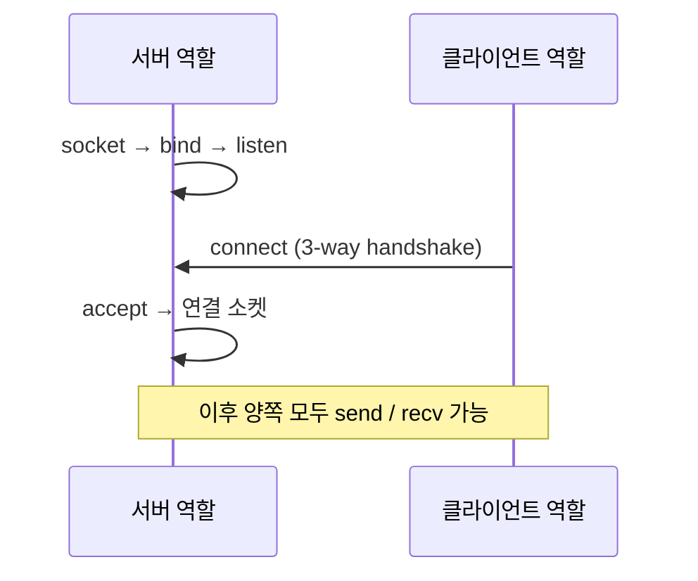
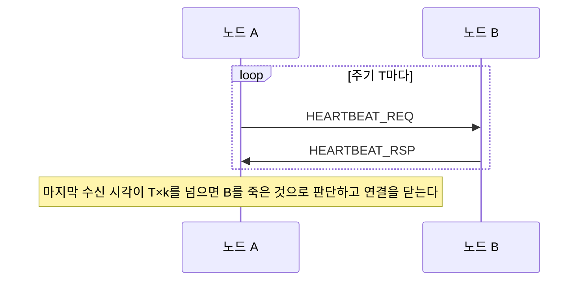

# TCP 위의 분산 메시징 — 연결 역할·메시지 경계·하트비트·재접속·이중화

> [!NOTE]
> 여러 장비에 흩어진 프로세스끼리 **메시지를 주고받는 라이브러리**(분산 메시징/분산 IPC)를 TCP로 만들 때 반드시 풀어야 하는 문제들을 정리한다. 이런 라이브러리의 **설정 파일에 노드 IP, 서버/클라이언트 역할, 포트, 하트비트 주기, 이중화 모드, 논리 이름 표가 있는 이유**가 모두 이 문제들에서 나온다.
> 같은 장비 안의 프로세스 통신(메시지 큐·공유메모리)은 [POSIX IPC와 System V IPC 비교](개발%20%28CS%29/CS%20기초/운영체제/[OS]%20POSIX%20IPC와%20System%20V%20IPC%20비교%20—%20메시지%20큐%20중심.md)에서 다룬다.
> 검증 표기: ✔ Linux man 페이지(man7.org)에서 확인, △ 기억/일반 설계 지식

## 0. 한눈에 보기 — TCP가 주지 않는 것 5가지

TCP는 **신뢰성 있는 바이트 스트림**만 준다. 메시징 시스템에 필요한 아래 5가지는 **직접 만들어야** 한다.

| # | TCP가 안 주는 것 | 직접 만드는 것 | 설정에 나타나는 모습 |
| --- | --- | --- | --- |
| 1 | **누가 연결을 걸고 누가 받을지** | 서버/클라이언트 **역할 분담** | 서버/클라이언트 구분, 포트 |
| 2 | **메시지 경계** | 길이 접두 **프레이밍** | (대개 설정 없음, 메시지 최대 크기) |
| 3 | **상대가 죽었는지 빨리 알기** | **하트비트**(응용 계층 생존 확인) | 하트비트 주기, 타임아웃 |
| 4 | **끊긴 뒤 다시 붙기** | **재접속**과 상태 복구 | 재접속 간격, 접속 타임아웃 |
| 5 | **서버가 둘일 때 누구에게 보낼지** | **이중화·전환** 정책 | 이중화 모드(Active-Standby 등) |

그리고 이 모든 것을 코드에 박지 않으려고 **논리 이름 → 물리 주소(IP, 포트)** 표를 설정 파일로 둔다(§7).

## 1. TCP가 주는 것과 안 주는 것

| | 설명 | 검증 |
| --- | --- | --- |
| 주는 것 | 연결 지향, **신뢰성**(유실 시 재전송), **순서 보장**, 흐름 제어 | △ |
| **안 주는 것: 메시지 경계** | "TCP does not preserve record boundaries." `send` 두 번이 `recv` 한 번에 합쳐져 올 수도, 한 번이 두 번으로 나뉘어 올 수도 있다 | ✔ |
| **안 주는 것: 빠른 연결 종료 통지** | 상대 프로세스가 **정상 종료**하면 FIN으로 알 수 있다(`recv`가 0). 그러나 상대 **장비의 전원이 나가거나 중간 네트워크가 끊기면** 한동안 아무 통지도 오지 않는다 | `recv`=0 ✔ / 나머지 △ |

→ 위 두 가지(경계, 죽음 감지)가 이 노트의 중심이다.

## 2. 연결 역할 — 누가 `listen`하고 누가 `connect`하나

TCP는 **비대칭**이다. 한쪽이 `listen`/`accept`를 하고, 다른 쪽이 `connect`를 한다. 연결이 성립한 뒤에는 **양방향**으로 자유롭게 보낼 수 있다.



### 2-1. 왜 역할을 설정으로 고정하나 △

| 문제 | 설명 |
| --- | --- |
| **양쪽이 동시에 `connect`하면** | 같은 두 노드 사이에 연결이 **두 개** 생기거나(중복), 상황에 따라 하나가 거부된다. 어느 연결을 쓸지 정해야 한다 |
| **양쪽이 모두 `listen`만 하면** | 아무도 연결을 걸지 않아 **영원히 붙지 않는다** |
| 서버 쪽은 **포트를 열어 두어야** 한다 | 방화벽, 포트 충돌 관리가 필요하다 |

그래서 **"이 연결은 A가 서버, B가 클라이언트"를 설정으로 못 박아** 두는 설계가 흔하다. **메시지를 보내는 방향과 연결을 거는 방향은 별개**다: 클라이언트 역할의 노드가 연결을 걸었더라도 **서버 쪽이 먼저 메시지를 보낼 수 있다.**

### 2-2. 서버 쪽에서 자주 걸리는 문제

| 항목 | 설명 | 검증 |
| --- | --- | --- |
| **재시작 직후 `bind` 실패** | 직전에 종료한 소켓이 `TIME_WAIT`로 남아 `EADDRINUSE`가 날 수 있다. `SO_REUSEADDR`는 "`bind`의 주소 검증 규칙이 로컬 주소 재사용을 허용하게" 한다 | 옵션 설명 ✔ / `TIME_WAIT` 원인 △ |
| **같은 포트를 여러 소켓이** | `SO_REUSEPORT`는 "동일한 소켓 주소에 여러 소켓을 `bind`"하게 한다. **각 소켓이 `bind` 전에 설정**해야 한다 | ✔ |
| **포트 충돌을 기동 전에 점검** | 설정에 같은 포트가 두 번 있으면 한쪽만 성공한다 | △ |

### 2-3. 토폴로지 — 별형(Star)과 망형(Full Mesh) △

노드가 N개일 때 **누가 누구와 연결하는가**가 설정의 큰 줄기를 정한다.

| 토폴로지 | 구조 | 연결 수 | 특징 |
| --- | --- | --- | --- |
| **별형(Star)** | **서버 한 곳**에 나머지 **클라이언트가 접속** | N−1 | 단순. **서버가 단일 장애점**이 되고, 클라이언트끼리는 서버를 거쳐야 한다 |
| **망형(Full Mesh)** | **모든 노드가 서로** 연결 | N(N−1)/2 (연결을 방향별로 둘로 나누면 그 두 배) | 어디로든 직접 보낸다. **노드가 늘면 연결 수가 제곱으로 증가** |
| **데이터그램 전체 연결**(UDP) | 연결 없이 서로에게 보낸다 | 연결 상태 없음 | **메시지 경계가 보존**(프레이밍 불필요). 대신 **유실·순서 뒤바뀜을 응용이 처리**하고 한 메시지 크기에 상한이 있다 |

- **망형에서는 두 노드가 동시에 서로에게 `connect`**하는 상황이 생기기 쉬워서, **연결을 방향별로 따로 두는** 설계가 쓰이기도 한다. 이 경우 **수신용 연결과 송신용 연결의 포트·재접속 간격이 따로** 필요하다.
- **클라이언트 포트를 `0`으로 두면 OS가 임의 포트**를 준다. 그러나 **서버가 클라이언트를 포트로 구분**한다면 포트를 **고정**해야 한다. 같은 장비에 같은 역할의 클라이언트가 여럿이면 포트가 겹치지 않게 정해야 한다.

## 3. 메시지 경계 — 길이 접두 프레이밍

### 3-1. 왜 필요한가

TCP는 바이트 스트림이라, 받는 쪽은 **"어디까지가 메시지 하나인지"** 알 수 없다. 가장 흔한 해법은 **메시지 앞에 길이를 붙이는** 것이다.

```
+-----------+---------+---------+------------------------+
| length(4) | type(2) | flags(2)|  body (length 바이트)   |
+-----------+---------+---------+------------------------+
  헤더 8바이트(고정)               가변 길이 본문
```

- **헤더는 고정 크기**여서 먼저 정확히 8바이트를 받고, 거기서 얻은 길이만큼 본문을 받는다.
- `type`은 메시지 종류(요청/응답/하트비트 …), `flags`는 확장용. **버전 필드**를 두면 나중에 형식을 바꿀 수 있다. △

### 3-2. `recv`는 원하는 만큼 주지 않는다 ✔

> "the call may still return less data than requested if a signal is caught, an error or disconnect occurs, or the next data to be received is of a different type than that returned."

| 사실 | 의미 |
| --- | --- |
| `recv`가 **요청보다 적게** 돌려줄 수 있다 ✔ | 헤더 8바이트를 달라고 했는데 **3바이트만** 올 수 있다. **반복해서 모아야** 한다 |
| `recv`가 **0**이면 | 상대가 **정상적으로 연결을 닫았다**("the traditional end-of-file return") ✔ |
| `MSG_WAITALL` | "요청한 만큼 찰 때까지 블록"하라는 플래그인데, **시그널·오류·연결 끊김이면 그래도 적게 돌려줄 수 있다** ✔. 그래서 이것을 믿고 단순화하면 안 된다 |
| 논블로킹에서 **데이터가 아직 없음** | `EAGAIN`/`EWOULDBLOCK` ✔ — 오류가 아니라 **"나중에 다시"** |

### 3-3. 수신 상태 머신 △

"헤더 받는 중 → 본문 받는 중"을 상태로 들고 있으면, **조금씩 와도** 안전하게 메시지를 조립한다.

```c
struct conn {
    int       fd;
    enum { RX_HDR, RX_BODY } st;
    uint8_t   hdr[8];   size_t   hdr_got;
    uint8_t  *body;     uint32_t body_len, body_got;
};

/* 논블로킹 fd에서 읽을 수 있는 만큼 읽고, 완성된 메시지마다 on_message()를 부른다.
   0: 정상(나중에 이어서), -1: 연결을 닫아야 함 */
int rx_pump(struct conn *c) {
    for (;;) {
        if (c->st == RX_HDR) {
            ssize_t n = recv(c->fd, c->hdr + c->hdr_got, sizeof c->hdr - c->hdr_got, 0);
            if (n == 0) return -1;                                  /* 상대가 정상 종료 */
            if (n < 0) {
                if (errno == EINTR) continue;
                if (errno == EAGAIN || errno == EWOULDBLOCK) return 0;  /* 지금은 없음 */
                return -1;
            }
            c->hdr_got += (size_t)n;
            if (c->hdr_got < sizeof c->hdr) continue;               /* 헤더가 덜 옴 */

            uint32_t len; memcpy(&len, c->hdr, 4); len = ntohl(len);
            if (len > MAX_BODY) return -1;                          /* ⚠️ 크기 검증 필수 */
            c->body = malloc(len ? len : 1);
            c->body_len = len; c->body_got = 0; c->st = RX_BODY;
        }
        if (c->st == RX_BODY) {
            while (c->body_got < c->body_len) {
                ssize_t n = recv(c->fd, c->body + c->body_got, c->body_len - c->body_got, 0);
                if (n == 0) return -1;
                if (n < 0) {
                    if (errno == EINTR) continue;
                    if (errno == EAGAIN || errno == EWOULDBLOCK) return 0;
                    return -1;
                }
                c->body_got += (uint32_t)n;
            }
            on_message(c, c->hdr, c->body, c->body_len);            /* 메시지 하나 완성 */
            c->hdr_got = 0; c->st = RX_HDR;                         /* 다음 메시지로 */
        }
    }
}
```

### 3-4. 프레이밍에서 자주 하는 실수 △

| 실수 | 결과 |
| --- | --- |
| **길이 검증을 안 함** | 잘못된(또는 악의적인) 길이 값이 오면 `malloc(4GB)`처럼 **메모리가 폭발**한다. **최대 크기 상한**을 두고 넘으면 연결을 끊는다 |
| 한 번의 `recv`로 헤더가 다 온다고 가정 | 가끔만 터지는 **재현 어려운 버그** |
| 수신 버퍼를 **구조체로 직접 캐스팅** | 장비마다 **엔디안, 정렬, 패딩**이 달라서 깨진다. 필드를 하나씩 `memcpy`하고 `ntohl`/`htonl`로 변환 |
| 본문 길이 0인 메시지(하트비트 등)를 처리 안 함 | 상태 머신이 멈춘다 |
| 한 연결에서 **수신 상태를 공유** | 스레드가 둘이 읽으면 메시지가 섞인다. **연결 하나는 읽는 스레드 하나** |

## 4. 보내기 — 부분 전송과 막힘

| 사실 | 의미 | 검증 |
| --- | --- | --- |
| `send`가 **일부만 보낼 수 있다** | 반환값이 요청 길이보다 작으면 **남은 부분을 다시 보내야** 한다. 버퍼 포인터를 앞으로 옮겨 반복 | △ (이 man 페이지 요약에서 확인하지 못함) |
| 논블로킹에서 **가득 참** | `EAGAIN`/`EWOULDBLOCK`. 남은 데이터를 **송신 큐에 보관**하고 `epoll`에서 쓰기 가능 이벤트를 기다린다 | ✔ |
| **상대가 이미 닫음** | 쓰면 `SIGPIPE`로 **프로세스가 죽을 수 있다.** `MSG_NOSIGNAL`을 주면 "SIGPIPE를 만들지 않고 `EPIPE` 오류만 돌려준다" | ✔ |
| 작은 메시지 지연 | Nagle 알고리즘이 작은 데이터를 모아서 보낸다. `TCP_NODELAY`를 켜면 "작은 데이터라도 가능한 한 즉시" 보낸다 → **요청-응답형 짧은 메시지에는 켜는 경우가 많다** | ✔ |
| 버퍼 크기 | `SO_SNDBUF`/`SO_RCVBUF`는 지정값의 **두 배**로 커널이 잡는다("doubles this value") | ✔ |

```c
/* 보내다가 막히면 남은 부분을 큐에 보관 */
ssize_t n = send(fd, buf + off, len - off, MSG_NOSIGNAL);
if (n < 0) {
    if (errno == EAGAIN || errno == EWOULDBLOCK) { /* EPOLLOUT 등록, 남은 부분(off부터) 보관 */ }
    else if (errno == EINTR) { /* 다시 시도 */ }
    else { /* EPIPE 등: 연결 끊김 처리 */ }
} else {
    off += (size_t)n;                    /* 부분 전송이면 off < len */
}
```

> [!WARNING] 한 연결에 쓰는 스레드는 하나로 (또는 락)
> 두 스레드가 같은 소켓에 `send`를 동시에 하면 **서로 다른 메시지의 바이트가 섞여** 프레임이 깨진다. 메시지 하나를 **원자적으로** 보내려면 송신 큐를 두고 **한 스레드만** 꺼내서 보내거나, 메시지 단위로 락을 잡는다. △

## 5. 죽은 연결 감지 — 하트비트

### 5-1. 왜 필요한가 — half-open

상대 **장비의 전원이 나가거나** 중간 장비가 연결 정보를 지우면 **FIN이나 RST이 오지 않는다.** 내가 아무것도 안 보내면 **내 쪽 TCP는 연결이 살아 있다고 믿는다.** 이를 **half-open** 연결이라 한다. △

### 5-2. 감지 수단 3가지

| 수단 | 동작 | 기본 지연 | 검증 |
| --- | --- | --- | --- |
| **`SO_KEEPALIVE`** | 연결이 한동안 유휴하면 TCP가 **keepalive 탐침**을 보낸다. **옵션을 켜야만** 동작한다("Keep-alives are sent only when the SO_KEEPALIVE socket option is enabled") | 시스템 기본: **유휴 7200초** + 탐침 간격 **75초** × **9회** | ✔ |
| **`TCP_USER_TIMEOUT`** | 보낸 데이터가 **응답(ACK) 없이 남아 있을 수 있는 최대 시간**(ms). 넘으면 연결을 강제로 닫고 `ETIMEDOUT`을 돌려준다 | 값을 지정해야 함 | ✔ |
| **응용 계층 하트비트** | 응용이 **주기적으로 확인 메시지**를 주고받고, 일정 시간 응답이 없으면 연결을 끊는다 | 설정값 | △ |

**기본 keepalive의 탐지 시간:** 유휴 7200초 + 75초 × 9회 = **7875초 ≈ 2시간 11분.** (tcp(7)의 sysctl 기본값 `tcp_keepalive_time=7200`, `tcp_keepalive_intvl=75`, `tcp_keepalive_probes=9`로 계산 ✔) 소켓별로 `TCP_KEEPIDLE`, `TCP_KEEPINTVL`, `TCP_KEEPCNT`로 줄일 수 있다 ✔. 그래도 보통 수 초 단위 감지가 필요한 시스템에는 **응용 하트비트**를 따로 둔다.

### 5-3. 응용 하트비트가 필요한 이유는 하나 더 있다 △

- **keepalive는 "상대 장비의 커널이 살아 있는가"만** 본다. 상대 **프로세스가 데드락에 걸려** 응답을 못 하는데 **커널은 ACK를 잘 보내는 상태**면, keepalive는 정상으로 판단한다.
- **응용 하트비트는 상대 프로세스가 실제로 메시지를 처리하는지**를 본다.

### 5-4. 하트비트 설계



| 설계 항목 | 고려 |
| --- | --- |
| **주기 T** | 짧을수록 빨리 감지하지만 **트래픽과 CPU**가 늘고, 일시적 지연에도 **오탐**이 난다 |
| **허용 횟수 k** | `타임아웃 = T × k`. k를 1로 하면 패킷 하나만 늦어도 끊는다. 보통 **2~3회 연속 미응답**을 기준으로 삼는다 |
| **일반 데이터도 생존 신호로 인정** | 데이터가 오가는 중이면 하트비트를 생략하고 "마지막으로 무엇이든 받은 시각"을 쓴다. 트래픽이 많을수록 불필요한 하트비트가 줄어든다 |
| **누가 보내나** | 한쪽만 보내도 응답으로 양방향 확인이 된다. 양쪽이 각자 보내면 더 안전하지만 중복이다 |
| **오탐의 결과** | 살아 있는 연결을 끊고 **재접속·상태 복구 비용**을 치른다. 이중화 환경에서는 **불필요한 절체**가 일어난다 |

> [!TIP] 하트비트 수신과 타임아웃 만료를 서로 다른 스레드가 처리하면 경쟁이 생긴다
> **8.999초에 응답이 도착**했는데 **9.000초 타이머가 먼저 실행**되면, 살아 있는 상대를 죽었다고 판단하는 **오탐**이 난다. 수신 스레드와 타이머 스레드를 따로 두는 대신 **하나의 루프가 "수신 대기(timeout 포함) → 마지막 수신 시각 비교"를 순서대로 처리**하면 이 경쟁이 사라진다. 예: 1초 타임아웃으로 `poll`하고 깨어날 때마다 `now - last_rx > limit`을 검사한다. △

### 5-5. 자동 헬스체크는 단일 스레드 응용을 멈출 수 있다 △

메시징 라이브러리가 **헬스체크를 자동으로 해 주는 것**이 항상 좋은 것은 아니다.

| 상황 | 문제 |
| --- | --- |
| **단일 스레드 응용**이 **죽은 상대에게 블로킹 `send`/`recv`** | 상대가 응답하지 않으면 **내 스레드 전체가 멈춘다.** 하트비트 응답을 기다리는 시간도 마찬가지 |
| 라이브러리가 **자동으로 하트비트를 보내고 기다림** | 그 대기가 **응용 스레드를 블로킹**하면 응용의 다른 일(다른 연결 처리)이 같이 멈춘다 |
| **브로드캐스트/멀티캐스트**(여러 상대에 동시 송신) | 상대 중 하나가 죽어 있으면 그 상대 때문에 **전체 송신이 막힐 수 있다.** 그래서 **정확한 상대 상태 정보**가 있어야 죽은 상대를 건너뛴다 |

**대응 설계:**
- 송수신을 **논블로킹**으로 하고, 하트비트는 **라이브러리 내부 스레드**나 **이벤트 루프**에서 처리해 **응용 스레드를 막지 않게** 한다.
- **"연결이 살아 있는가"(연결 수준)** 와 **"상대 프로세스·노드가 건강한가"(프로세스 수준 판정과 이중화 전환)** 를 **분리**한다. 메시징 라이브러리는 **통신만 책임지고**, 프로세스 상태 판정과 **이중화 전환은 별도의 상태 관리 시스템**에 맡기는 구조가 흔하다. 라이브러리는 그 시스템이 알려 주는 **상태를 받아서** 송신 대상을 고른다.
- **죽은 상대로의 송신은 즉시 실패**하게 해 두면(예: 연결이 없으면 바로 오류 반환) 블로킹 위험이 줄어든다.

## 6. 연결 수립과 재접속

### 6-1. 논블로킹 `connect` ✔

```c
fcntl(fd, F_SETFL, O_NONBLOCK);
int r = connect(fd, (struct sockaddr *)&addr, sizeof addr);
if (r < 0 && errno == EINPROGRESS) {
    /* poll/epoll로 "쓰기 가능"을 기다린다 (타임아웃 지정) */
    int err; socklen_t len = sizeof err;
    getsockopt(fd, SOL_SOCKET, SO_ERROR, &err, &len);   /* 0이면 성공, 아니면 실패 원인 */
}
```

- 논블로킹 소켓의 `connect`는 **즉시 끝나지 않고 `EINPROGRESS`** 를 돌려준다. "쓰기 가능"을 기다린 뒤 **`SO_ERROR`를 읽어** 성공(0)인지 확인한다. ✔
- **`SO_ERROR`는 "읽으면서 지우는"** 값이다("Get and clear the pending socket error"). 한 번만 읽을 수 있다. ✔
- 실패 원인: `ECONNREFUSED`("아무도 listen하지 않음"), `ETIMEDOUT`("접속 시도 시간 초과, 서버가 바쁠 수 있음"). ✔
- 접속 대기 시간(`connect timeout`)을 응용이 따로 정하는 이유: `connect`의 커널 기본 타임아웃은 매우 길 수 있어서(수십 초 이상) 짧게 끊고 다른 후보로 넘어가려는 것이다. △

### 6-2. 실패한 소켓은 버린다 ✔

> "If connect() fails, consider the state of the socket as unspecified. Portable applications should close the socket and create a new one for reconnecting."

→ 재접속은 **`close` 후 `socket()`부터 새로** 한다. 같은 소켓으로 `connect`를 다시 부르면 안 된다.

### 6-3. 재접속 정책 △

| 항목 | 설명 |
| --- | --- |
| **간격** | 바로 재시도하면 상대가 죽어 있는 동안 **SYN을 쏟아붓는다.** 일정 간격을 둔다 |
| **지수 백오프 + 지터** | 간격을 `base × 2^n`으로 늘리되 상한(`max`)을 두고, **임의 값(지터)을 더해** 여러 노드가 **동시에 몰려 재접속(thundering herd)** 하는 것을 막는다 |
| **재접속 후 상태 복구** | TCP 연결이 끊기면 **상대가 기억하던 상태(구독, 세션, 진행 중 요청)** 도 사라진다. 재접속 뒤에 응용이 **다시 등록·구독**해야 한다 |
| **중복 연결 정리** | 이전 연결이 상대 쪽에 half-open으로 남아 있는 상태에서 새 연결이 오면 **같은 노드의 연결이 두 개**가 된다. 새 연결이 오면 이전 것을 닫는 규칙이 필요하다 |
| **연결 이벤트 콜백** | "연결됨/끊김"을 응용에 알려 **송신 중단·재개**를 판단하게 한다 |
| **SYN 재시도 횟수** | 상대가 응답하지 않을 때 **SYN을 몇 번 다시 보낼지**. 커널 기본값으로는 포기까지 **수십 초**가 걸릴 수 있어서, 빨리 다른 후보로 넘어가려고 줄이는 경우가 있다. 소켓별 `TCP_SYNCNT` 옵션이나 커널 `tcp_syn_retries`로 조절한다 △ |
| **접속 타임아웃** | `connect` 완료를 기다리는 응용 쪽 상한. SYN 재시도 횟수와 **함께 정해야** 의미가 맞다 |
| **방향별 재접속 간격** | 연결을 **수신용/송신용으로 나눴다면** 재접속 간격도 따로 둘 수 있다(§2-3) |

> [!WARNING] 연결이 안 된 상태에서 보내면
> 연결이 끊긴 동안 응용이 계속 `send`를 부르면 **쌓이기만 하거나 실패**한다. 연결 상태를 확인해 **보내지 않고 건너뛰거나 큐에 쌓되 상한을 두는** 방어 코드가 필요하다. 서버가 먼저 죽었다가 재기동해도 **클라이언트가 죽지 않도록** 하는 것이 목적이다. △

## 7. 논리 이름과 주소 — 코드에 IP를 박지 않기

### 7-1. 왜 이름이 필요한가 △

- 메시지 보낼 대상을 `10.1.2.3:47001`로 코드에 박으면 **장비 교체, 포트 변경, 이중화 전환** 때마다 재컴파일해야 한다.
- 그래서 **논리 이름**(예: "인증 서비스")을 쓰고, **설정 파일의 표**가 `이름 → (노드 IP, 포트, 역할)`을 연결한다.

### 7-2. 흔한 주소 계층

| 계층 | 의미 | 예 |
| --- | --- | --- |
| **노드** | 물리 장비(또는 호스트) | `node-1: 10.0.0.1` |
| **채널/그룹** | 논리 통신 묶음. 같은 이름의 모듈도 **채널이 다르면 서로 다른 것**(이름 공간) | `billing`, `auth` |
| **모듈** | 채널 안의 기능 역할 | `server`, `client` |
| **종단점(endpoint)** | 실제 연결 지점. 하나의 종단점이 **여러 노드에 걸칠 수** 있다(이중화) | |

### 7-3. 주소를 정수 하나로 압축하기 △

메시지마다 문자열 이름을 실으면 비싸다. **각 계층의 번호를 비트 필드로 이어 붙인 32비트 정수**(주소 코드)로 압축하면 헤더가 작아지고 **정수 비교 한 번으로 라우팅**한다.

```
 8비트      8비트      8비트      8비트
+--------+--------+--------+--------+
| 노드   | 서비스 | 인스턴스| 역할  |   → 0x01020304 처럼 하나의 정수 (예시)
+--------+--------+--------+--------+
```

필드 구성과 순서는 시스템마다 다르다. 위는 **원리를 보이기 위한 가상의 예**다.

- 각 계층의 번호가 **8비트(0~255)에 들어가야** 하므로 설정의 번호에도 상한이 생긴다.
- 번호가 **주소의 일부**가 되므로, 설정에서 번호를 바꾸면 **이미 떠 있는 상대와 주소가 어긋난다.** 번호는 한 번 정하면 바꾸지 않는 편이 안전하다.
- **미해결 주소**(예: 일부 필드가 0)는 "이름을 못 찾았다"는 신호일 수 있다. **이름 종류를 잘못 넘겨(예: 모듈 이름 대신 종단점 이름이 필요한 자리에) 조회가 실패**하는 실수가 흔하다.

## 8. 이중화 패턴

### 8-1. 구성

| 방식 | 설명 | 장점 | 단점 |
| --- | --- | --- | --- |
| **단독(Standalone)** | 이중화 없음 | 단순 | 장애 시 서비스 중단 |
| **Active-Standby** | 활성 1개 + 대기 1개. 평소 트래픽은 활성만 받는다 | 단순, **가장 흔함** | 대기 자원이 놀고 있다 |
| **Active-Standby-Backup** | 3중화 | 더 안전 | 비용, 복잡 |
| **N-Active** | 모든 인스턴스가 **동시에** 트래픽 처리 | 자원 활용, 확장 쉬움 | 상태 공유·세션 분산 설계가 어렵다 |

△ 모두 일반 설계 지식.

### 8-1-1. 활성-활성 변형과 백업 방식 △

Active-Standby만 있는 것이 아니다. 라이브러리에 따라 이런 변형을 지원한다.

| 방식 | 동작 | 용도 |
| --- | --- | --- |
| **선호 활성(Preferred Active-Active)** | **활성으로 통지받은 쪽을 우선** 사용하고, 그쪽으로 **I/O가 실패하면 다른 쪽(백업 활성)으로 바꾼다.** 둘 다 항상 살아 있다 | 대기 자원을 놀리지 않으면서 **우선 경로**를 두고 싶을 때 |
| **라운드 로빈 활성-활성** | 살아 있는 인스턴스에 **번갈아** 보낸다 | 부하 분산. **상태 없는(stateless)** 처리에 적합 |
| **N:1 백업** | 여러 활성 인스턴스(N)를 **백업 한 개**가 받쳐 준다 | 자원 절약. 두 개가 동시에 죽으면 하나만 이어받는다 |
| **Active-Standby** | 활성 1 + 대기 1 | 가장 단순 |
| **단독** | 이중화 없음 | – |

**인스턴스 수 제약:** 방식마다 **한 논리 종단점에 연결되는 인스턴스 수**가 정해져 있다(예: Active-Standby는 **정확히 2개**, 단독은 **정확히 1개**, 활성-활성은 **1개 이상**). 설정 파일에 **인스턴스 목록이 이 수와 맞지 않으면** 초기화가 실패하게 만들면 오류를 일찍 잡는다.

### 8-1-2. HA 상태 머신 △

이중화 인스턴스는 보통 **상태**를 가진다. 라이브러리가 이 상태를 보고 **누구에게 보낼지** 정한다.

| 상태 | 의미 |
| --- | --- |
| **UNKNOWN** | **초기 상태.** 아직 활성/대기가 정해지지 않았다 |
| **ACTIVE** | **현재 활성**(또는 선호 활성). 트래픽을 받는다 |
| **STANDBY** | 대기 |
| **READY** | **활성이 될 준비가 되었다.** 활성-활성 방식에서 참여 가능한 상태 |
| **CLOSED** | **이 연결은 쓰지 않는다**고 설정 |

- **누가 이 상태를 바꾸는가**가 중요하다. §5-5처럼 **별도의 상태 관리 시스템이 상태를 결정**하고 라이브러리에 **설정 메시지**로 알리는 구조가 흔하다. 이때 **그 메시지가 유실되거나 무시되면 상태가 UNKNOWN으로 돌아가는** 설계도 있다. UNKNOWN에서는 **누구에게 보내야 할지 모르므로 송신이 막히거나 실패**한다.

### 8-2. 전환(절체)에서 생각할 것

| 항목 | 설명 |
| --- | --- |
| **장애 감지** | §5의 하트비트가 감지 수단이다. **오탐이 곧 불필요한 절체**다 |
| **누가 활성인가** | 두 노드가 서로를 못 봐서 **둘 다 활성이라 생각**하면 **split-brain**(양쪽이 같은 일을 수행)이 된다. 활성 판정은 **한 곳에서** 하거나 합의 규칙을 둔다 |
| **보내는 쪽의 전환** | 논리 이름을 새 활성의 주소로 **다시 풀어서** 보낸다(§7). 이미 **전송 중이던 메시지**는 유실되거나 중복될 수 있다 |
| **복구(revert)** | 원래 노드가 돌아오면 **자동으로 되돌릴지, 운용자 명령으로 수동 복귀**할지. **자동 복귀는 불안정한 노드로 계속 왔다 갔다 하는 플래핑**을 일으킬 수 있다 |
| **상태 복제** | 대기 노드가 활성의 **세션·카운터**를 알고 있어야 끊김 없이 이어받는다 |

## 9. 스레드 구조 △

| 구조 | 설명 |
| --- | --- |
| **연결 하나 = 수신 스레드 하나**(또는 이벤트 루프) | 수신 상태 머신(§3-3)을 한 곳에서만 돌린다 |
| **송신은 큐 + 단일 스레드** | 여러 스레드가 보내고 싶어도 **큐에 넣고** 한 스레드가 `send`한다(§4) |
| **채널별 분리** | 큰 메시지 하나가 같은 연결의 뒤쪽 작은 메시지들을 막는 **HOL 블로킹**을 피하려고 채널(연결)을 나눈다 |
| **수신 스레드와 처리 스레드 분리** | 수신 스레드는 **빨리 읽어서 큐에 넣기만** 하고, 오래 걸리는 처리는 워커 스레드에서 한다. 처리가 느려도 소켓 버퍼가 차서 **상대가 막히지 않게** 하려는 것이다 |
| **타임아웃을 가진 단일 루프** | 하트비트 검사까지 **한 루프**에서 처리해 경쟁을 없앤다(§5-4) |

## 10. 설정 항목 ↔ 개념 대응표

분산 메시징 라이브러리의 설정 파일을 읽을 때 쓰는 대응표다.

| 설정 항목(예) | 어떤 문제에 대한 답인가 | 이 노트 |
| --- | --- | --- |
| **노드 이름과 IP** | 상대가 **어느 장비**에 있나(`connect` 대상) | §2, §7 |
| **자신이 어느 노드인가**(환경변수 등) | 같은 설정 파일을 **모든 노드가 공유**하고, **"나"만** 달라진다 | §7 |
| **서버/클라이언트 역할** (연결 하나마다 "listen 쪽/connect 쪽" 지정) | 누가 `listen`하고 누가 `connect`하나 | §2 |
| **포트** | 서버 역할 노드가 `bind`할 포트 / 클라이언트가 접속할 포트 | §2 |
| **하트비트(워치독) 주기** | half-open 감지. 주기가 짧을수록 빨리 감지, 오탐 증가 | §5 |
| **접속/재접속 간격, 접속 타임아웃** | 재접속 폭주 방지, 실패 빠르게 판정 | §6 |
| **이중화 모드** (단독/Active-Standby 등) | 어느 인스턴스가 활성인가 | §8 |
| **채널/모듈/종단점 이름과 번호** | 논리 이름 ↔ 주소 코드 | §7 |
| **메시지 최대 크기** | 길이 검증 상한, 송수신 버퍼 크기 | §3-4 |
| **로그 모드/레벨** | 연결·하트비트 문제 추적 | – |
| **버퍼 크기**(수신/송신) | `SO_RCVBUF`/`SO_SNDBUF`. 큰 메시지를 쓰면 키운다 | §4 |
| **TCP 메시지 최대 크기** (기본 **0 = 무제한**인 경우가 있다) | 길이 접두 프레이밍의 **길이 검증 상한.** 0이면 잘못된 길이에 **메모리가 폭증**한다. **운영에서는 상한을 둔다** | §3-4 |
| **UDP 메시지 최대 크기** | 데이터그램 한 개의 상한 | §2-3 |
| **SYN 재시도, 접속 타임아웃** | 접속 실패를 얼마나 빨리 판정할지 | §6-3 |
| **토폴로지 유형**(별형/망형) | 연결 수와 **포트 개수**(망형은 방향별로 2개일 수 있음) | §2-3 |
| **인스턴스 목록** (이중화 방식별 개수 제약) | 이중화 방식에 맞는 **인스턴스 수** | §8-1-1 |

> [!NOTE] 설정은 기동 때만 읽는 경우가 많다
> 이런 라이브러리는 **초기화 함수가 설정 파일을 한 번 읽고 그 뒤로는 바꾸지 않는** 경우가 많다. 설정을 바꾼 뒤에는 **프로세스를 재시작**해야 반영된다. "설정을 고쳤는데 안 바뀐다"의 가장 흔한 원인이다. 동적 변경이 필요하면 별도의 갱신 메시지(예: 설정 변경 알림 → 재적재)를 설계해야 한다.

> [!TIP] 설정 하나가 틀리면 어떤 증상이 나는가 △
> - 역할이 양쪽 다 서버 → **아무도 접속하지 않음**(오류 로그도 없이 조용함)
> - 역할이 양쪽 다 클라이언트 → 양쪽이 `connect`하다가 **`ECONNREFUSED`** 반복
> - 하트비트 주기가 너무 짧음 → 부하 때 **연결이 자꾸 끊겼다 붙음**
> - 노드 IP는 맞는데 포트 충돌 → 서버 기동 시 `EADDRINUSE`
> - 양쪽 노드의 설정 파일이 **서로 다름** → 주소 코드가 어긋나 **연결은 되는데 메시지가 엉뚱한 곳으로** 감

## 11. 설계 체크리스트

- [ ] 연결 역할(누가 `listen`)이 **양 끝에서 일치**하는가
- [ ] 수신이 **헤더/본문 상태 머신**이고 `recv`가 적게 오는 경우를 처리하는가
- [ ] **길이 상한 검증**이 있는가
- [ ] `recv`가 0일 때 **연결 종료**로 처리하는가
- [ ] 송신이 **부분 전송, `EAGAIN`, `EPIPE`/`SIGPIPE`** 를 처리하는가 (`MSG_NOSIGNAL`)
- [ ] 한 연결에 쓰는 스레드가 **하나**(또는 락)인가
- [ ] **응용 하트비트**가 있고 타임아웃이 `T × k` 형태로 정해져 있는가
- [ ] 하트비트 수신과 만료 판정이 **같은 루프**에서 직렬화되는가
- [ ] 재접속에 **백오프(+지터)** 가 있고 **새 소켓**을 만드는가
- [ ] 재접속 뒤 **상태를 다시 등록**하는가
- [ ] 이중화 시 **활성 판정**이 한 곳에서 이루어지고 **복귀 정책**이 정해져 있는가
- [ ] 주소 번호가 **한 번 정해지면 바뀌지 않는가**, 양쪽 설정이 **동일**한가

## 12. 검증 상태 요약

| 항목 | 상태 | 근거 |
| --- | --- | --- |
| TCP는 **레코드 경계를 보존하지 않는다** | ✔ | `tcp(7)` |
| `TCP_NODELAY`(Nagle 해제) | ✔ | `tcp(7)` |
| keepalive 옵션 3종(`TCP_KEEPIDLE/INTVL/CNT`)과 sysctl 기본값(7200/75/9), **`SO_KEEPALIVE`를 켜야 동작** | ✔ | `tcp(7)`, `socket(7)` |
| `TCP_USER_TIMEOUT` | ✔ | `tcp(7)` |
| `SO_REUSEADDR`, `SO_REUSEPORT`, `SO_LINGER`, `SO_RCVBUF/SNDBUF`(두 배), `SO_ERROR`(읽으며 지움) | ✔ | `socket(7)` |
| `recv`: 0 = 정상 종료, 요청보다 적게 돌려줄 수 있음, `MSG_WAITALL` 한계, `EAGAIN` | ✔ | `recv(2)` |
| `MSG_NOSIGNAL`/`EPIPE`, 논블로킹 `EAGAIN` | ✔ | `send(2)` |
| 논블로킹 `connect`(`EINPROGRESS` → 쓰기 대기 → `SO_ERROR`), `ECONNREFUSED`/`ETIMEDOUT`, **실패 후 소켓 재사용 금지** | ✔ | `connect(2)` |
| `send`의 **부분 전송** 설명, half-open 연결의 동작, `TIME_WAIT`와 `EADDRINUSE`의 관계 | △ | 이 man 페이지 요약에서 확인하지 못함(일반 지식) |
| 프레이밍 관례, 하트비트 설계, 백오프·지터, 이중화·split-brain, 주소 코드 압축, 토폴로지(별형/망형), 활성-활성 변형과 HA 상태 머신, 자동 헬스체크의 블로킹 문제, `TCP_SYNCNT`/`tcp_syn_retries` | △ | 일반 설계 지식 (상용 미들웨어의 교육 자료에서 확인한 구조를 일반화) |

## 관련 문서

- [POSIX IPC와 System V IPC 비교 — 메시지 큐 중심](개발%20%28CS%29/CS%20기초/운영체제/[OS]%20POSIX%20IPC와%20System%20V%20IPC%20비교%20—%20메시지%20큐%20중심.md) — **같은 장비** 안의 프로세스 통신
- [HTTP/2 핵심 개념](개발%20%28CS%29/네트워크/[HTTP]%20HTTP2%20핵심%20개념%20—%20프레임·스트림·HPACK·흐름%20제어·SETTINGS.md) — 같은 문제(경계, 다중화, 생존 확인)를 **표준 프로토콜**이 푼 방식. HTTP/2의 프레임·PING·GOAWAY·`MAX_CONCURRENT_STREAMS`와 비교해 보면 좋다
- [nghttp2 API 모델](개발%20%28CS%29/네트워크/[HTTP]%20nghttp2%20API%20모델%20—%20세션·콜백·입출력%20루프.md) — I/O를 응용이 맡는 라이브러리 구조(§3의 수신 상태 머신과 같은 위치)
- [TCP/IP Socket 통신 — 핵심 개념](개발%20%28CS%29/언어/C언어/네트워크·시스템%20IO/[TCP_IP]%20Socket%20통신%20-%20핵심%20개념%20및%20특징%20정리.md), [Socket의 기본 정리 (Blocking / Non-Blocking)](개발%20%28CS%29/게임서버/게임서버%20프로그래머%20책/Socket의%20기본%20정리%20%28%20feat,%20Blocking%20-%20Non-Blocking%20%29.md) — 소켓 기초
- [epoll — fd가 많아질 때의 대안](개발%20%28CS%29/언어/C언어/네트워크·시스템%20IO/[C]%20epoll%20—%20fd가%20많아질%20때의%20대안.md), [Non blocking / Select Model](개발%20%28CS%29/네트워크/[CS]%20Non%20blocking%20-%20Select%20Model%20-%20핵심%20개념%20및%20특징%20정리.md) — 이벤트 루프
- [배열 기반 원형 큐(Ring Buffer)](개발%20%28CS%29/언어/C언어/동시성·스레드/[C]%20배열%20기반%20원형%20큐%28Ring%20Buffer%29%20—%20front·back%20인덱스로%20만드는%20큐.md) — 송신 큐 구현
- [비동기 요청-응답의 타임아웃 감시 — Check-in과 Check-out 타이머 패턴](개발%20%28CS%29/언어/C언어/동시성·스레드/[C]%20비동기%20요청-응답의%20타임아웃%20감시%20—%20Check-in과%20Check-out%20타이머%20패턴.md) — 응답 타임아웃
- 참고: Linux man-pages `tcp(7)`, `socket(7)`, `send(2)`, `recv(2)`, `connect(2)`
