# 네트워크 과정

> [!NOTE]
> OSI 7계층 / TCP/IP 4계층 구조와 각 계층별 역할, 그리고 TCP·UDP·IP·ARP·ICMP 등 주요 프로토콜 헤더 구조 정리.

## 📌 개념

### 사전지식

**통신 기초**

- 데이터: 전기적 신호를 이용하여 (0, 1)로 통신하게 됨
- 통신: 그냥 전기를 케이블로 보내는 것이 아닌, 서로 약속된 규칙의 형태로 전기적 신호를 보내 통신함
- 약속된 규칙: 네트워크에서는 이를 프로토콜이라고 칭함

**PDU (프로토콜 데이터 단위)** — TCP/IP 4계층 ≈ OSI 7계층

- 사용자 ⇒ data
- TCP ⇒ segment
- IP ⇒ packet
- 데이터링크(MAC) ⇒ Frame

### OSI 7계층 (이론적인 성격이 강함)

**계층 구조**

- 사용 목적: 복잡한 문제를 나누어서 생각하기 위해
- 특징: 위-아래로만 이동 가능. 다음 단계로 넘어가려면 이전 단계가 전제 조건 (단계 건너뛰기 불가능)

**PDU (Process Data Unit)** — 각 계층에서 전송되는 단위

- 2계층: 프레임
- 3계층: 패킷
- 4계층: 세그먼트
- 1계층의 경우 비트를 PDU라고 생각할 수 있지만, 비트는 단순히 전기 신호의 흐름일 뿐 PDU는 아니다

**데이터 캡슐화**

- `Data → Segment → Datagram → Frame`
- 위 과정을 데이터 캡슐화 과정이라고 함

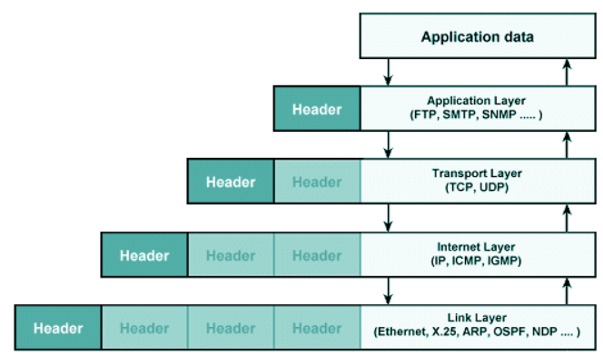

**1계층 (물리계층)**

- 상위 계층에서 전송된 데이터를 물리 매체를 통해 다른 시스템에 전기 신호로 전송
- 기계어 → 전기적 신호로 변환
- 장비 ⇒ 허브, 리피터

**2계층 (링크계층) - MAC**

- 네트워크 기기들 사이의 데이터 전송을 하는 역할
- 3계층에서 정보를 받아 주소와 제어 정보를 추가함
- A 노드 → B 노드 전달을 감독
- 예) MAC 주소
- 장비 ⇒ 브릿지, 스위치

**3계층 (네트워크계층) - IP**

- 데이터그램이 가는 경로를 설정
- 최적의 경로 선택 후 패킷 단위로 분할하여 전송 → 그 후 합쳐짐
- 예) IP 헤더
- 장비 ⇒ 라우터, L3 스위치

**4계층 (전송계층) - PORT**

- 발신지에서 목적지(end to end) 간 제어와 에러를 감독
- 패킷의 전송이 유효한지 확인
- 통신을 보장 (실패된 패킷 → 재전송 기능)
- 주소 설정, 오류 및 흐름 제어, 다중화 수행
- 예) TCP 헤더
- 장비 ⇒ 게이트웨이, L4 스위치

**5계층 (세션계층)**

- 통신 세션 구성
- 포트 번호 기반으로 연결
- 동시송수신(Duplex), 반이중(Half-Duplex), 전이중(Full-Duplex)
- 체크 포인팅과 유휴, 종료, 다시 시작 과정 등을 수행
- 프로토콜 ⇒ NetBIOS, SSH, TLS

**6계층 (표현계층)**

- 데이터 형식을 정해주는 역할 (jpg, png, jpeg…)
- 데이터를 코드 변환, 구문 검색, 암호화, 압축의 과정이 일어남
- 프로토콜 ⇒ JPG, MPEG, SMB

**7계층 (응용계층)**

- 사용자와 바로 연결되어 응용 SW를 도와주는 계층
- 송신 → 전송 / 수신 → 받기
- 프로토콜 ⇒ DHCP, DNS, FTP, HTTP

### TCP/IP 4계층 (실제로 많이 사용)

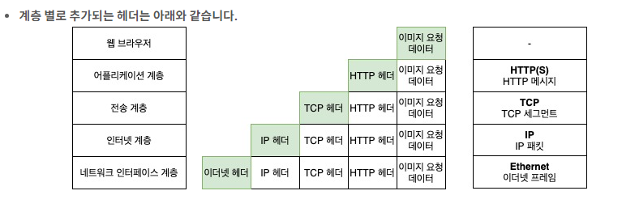

**1계층 (Network Access Layer) - MAC 정보**

- 물리적인 주소 MAC 사용
- 프로토콜 → Ethernet, WI-FI, PPP

**2계층 (Internet Layer) - IP 정보**

- 통신 노드 간의 IP 패킷을 전송하는 기능
- IP 패킷은 보낸 순서와 받는 순서가 다를 수 있다 (안정성 X) — 빨리 보내는 게 목적
- 프로토콜 → IP, ARP, ICMP, RARP, OSPF

**3계층 (Transport Layer) - PORT 번호**

- 포트 번호를 사용해 정확한 애플리케이션에 전달
- 통신 노드 간의 연결을 제어하고, 신뢰성 있는 데이터 전송 담당 (IP에서 하지 않는 안정성 부분을 check)
- 프로토콜 → TCP, UDP, RTP, RTCP

**4계층 (Application Layer)**

- 응용 프로그램을 구현할 때 사용
- 프로토콜 → FTP, HTTP, SSH, HTTPS, Telnet, DNS, SMTP

### 헤더 정보

#### TCP 헤더 (20 byte) — 전송계층 (OSI 4계층, TCP/IP 3계층)

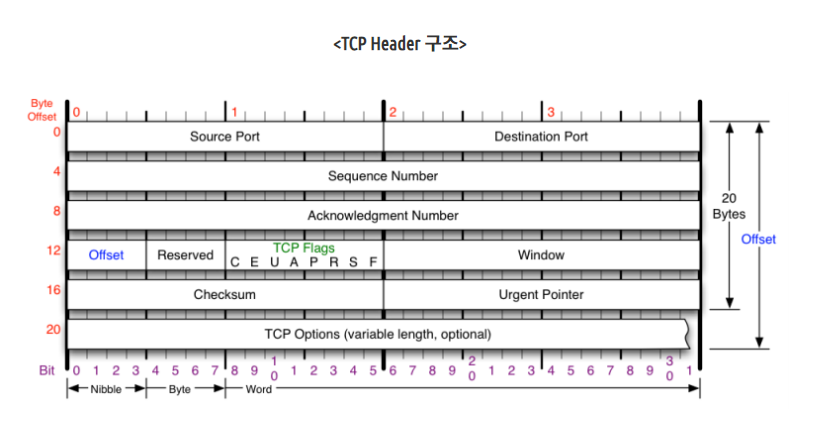

- Source Port [2 byte] : 출발지 포트 번호
- Destination Port [2 byte] : 목적지 포트 번호
- Sequence Number [4 byte] : byte 단위로 순서화되는 번호 (3-way, 흐름제어에서 사용)
- Acknowledgment Number : 수신하기를 기대하는 다음 byte 번호
- offset : 헤더 길이 정보

> [!NOTE]
> 3-way-handshake
>
> 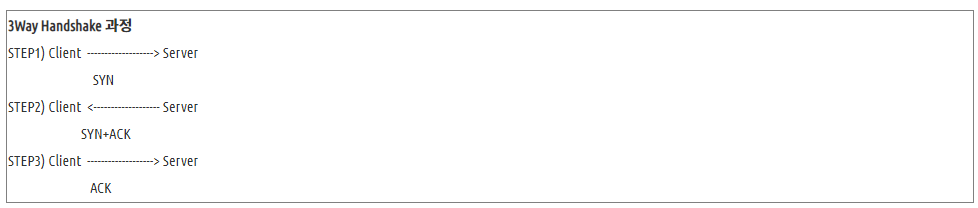

#### UDP 헤더 (8 byte)

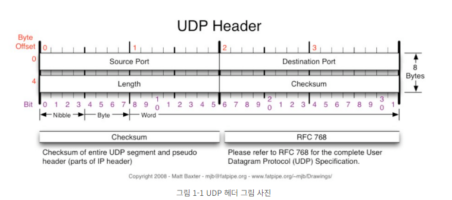

- 출발지 포트 [2 byte]
- 목적지 포트 [2 byte]
- Length : payload + udp payload + udp header 길이 정보

#### IPv4 헤더 (20 byte) — 네트워크 계층 (OSI 3계층, TCP/IP 2계층)

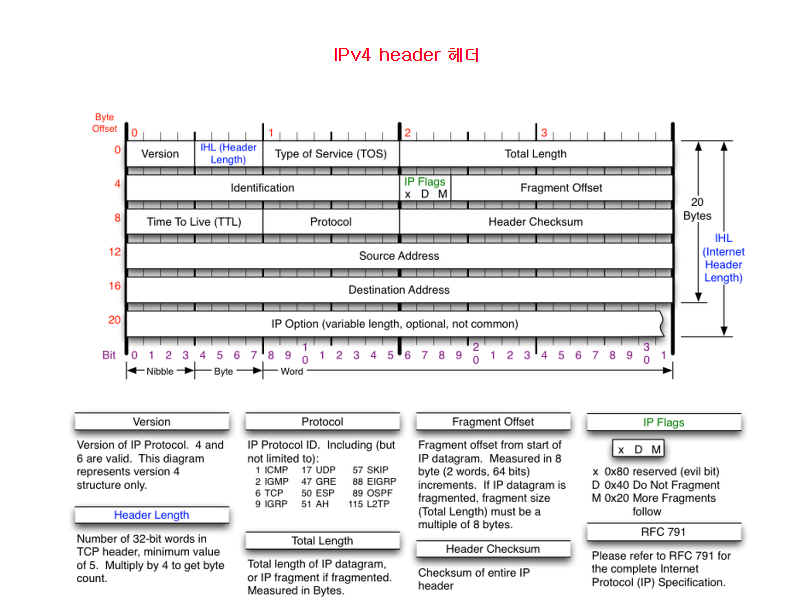

- Version : ipv4
- IHL (ip header length) : ip 헤더 길이
- TTL : 데이터가 이동할 수 있는 단계의 수
- Source IP Address [4 byte] : 출발지 주소
- Destination IP Address [4 byte] : 목적지 주소

#### IPv6 헤더 (40 byte)

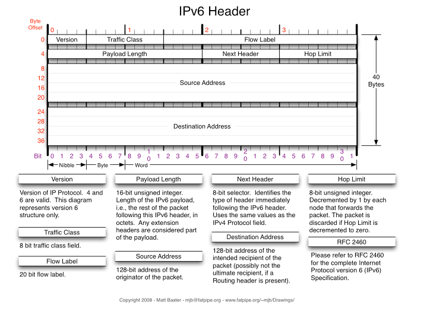

- Source Address [12 byte]
- Destination Address [12 byte]

#### ARP 헤더 (28 byte)

> [!NOTE]
> IP 주소 → MAC 주소 변환

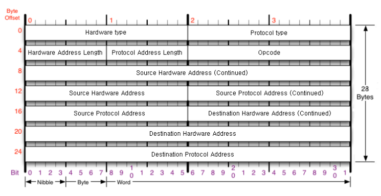

- Hardware type : 네트워크 유형 (ethernet은 0x0001로 설정)
- protocol type : 프로토콜 정의 (ipv4 → 0x0800)
- hardware address length : 하드웨어 주소 길이 (ethernet 환경의 경우 6byte)
- protocol address length : 프로토콜의 길이를 정의 (ipv4 → 4byte로 설정)
- opcode : arp 패킷의 요청/응답에 따라 바뀜 (요청: 1, 응답: 2)
- source hardware address : 출발지 MAC 주소
- source protocol address : 출발지 ip 주소
- destination hardware address : 목적지 MAC 주소
- destination protocol address : 목적지 ip 주소

#### ICMP 헤더 (8 byte)

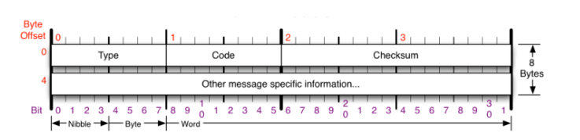

- type : 패킷 내에 어떠한 종류의 ICMP 메시지가 존재하는지 정의
    - 0 : Echo Reply (ICMP에 대한 응답)
    - 3 : Destination network unreachable (패킷이 목적지에 도달할 수 없음)
    - 5 : Redirect (네트워크 경로 재지정)
    - 8 : Echo Request (ICMP에 대한 요청)

#### OSPF 헤더 (20 byte)

> [!NOTE]
> OSPF: 라우팅 프로토콜로서 최단 경로 우선 알고리즘 사용 (⇒ IP 헤더 + OSPF 공통 헤더)

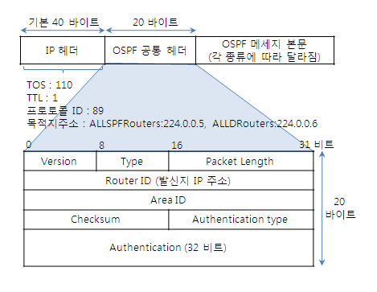

- version : ospf 버전
- type : 전송되는 메시지 종류
- packet length : ospf 헤더를 포함한 전체 길이
- router id : 발신지 라우터 ID
- area id : ospf 패킷을 생성·발송하는 라우터가 속한 식별 ID

#### RARP 헤더

> [!NOTE]
> MAC → IP 주소 변환

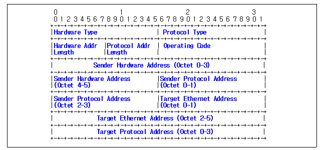

- ARP 프로토콜 구조를 그대로 따르지만, 필드값이 다르다

#### 이더넷 헤더 (OSI 2계층, TCP/IP 1계층)

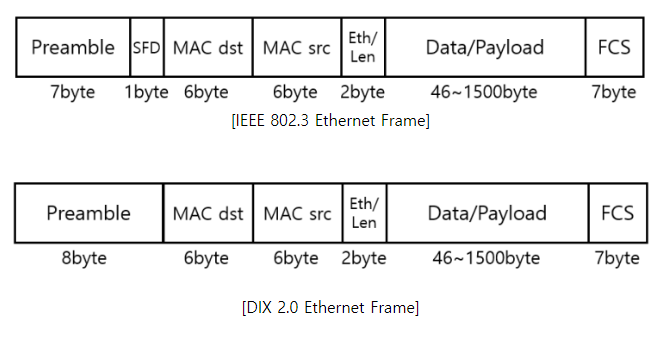

- preamble, SFD : 물리계층에 속함 (MAC 프레임에 포함 X)
- MAC dst/src : 목적지/출발지 MAC 주소 (앞 24bit - 제조사 번호, 뒤 24bit - 랜카드 정보(일련번호))
- EthernetType / Length
    - EthernetType : 이더넷 프로토콜 타입 식별 (0x0600 이상 → DIX / 미만 → 802.3)
    - Length : 이더넷 길이
- FCS : 에러 검출 코드

## 🔗 참고

- [OSPF 메시지 헤더 (ktword)](http://www.ktword.co.kr/test/view/view.php?m_temp1=1929)
