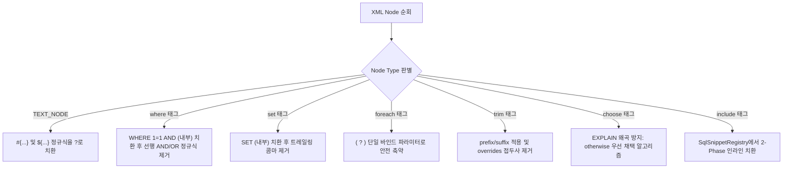
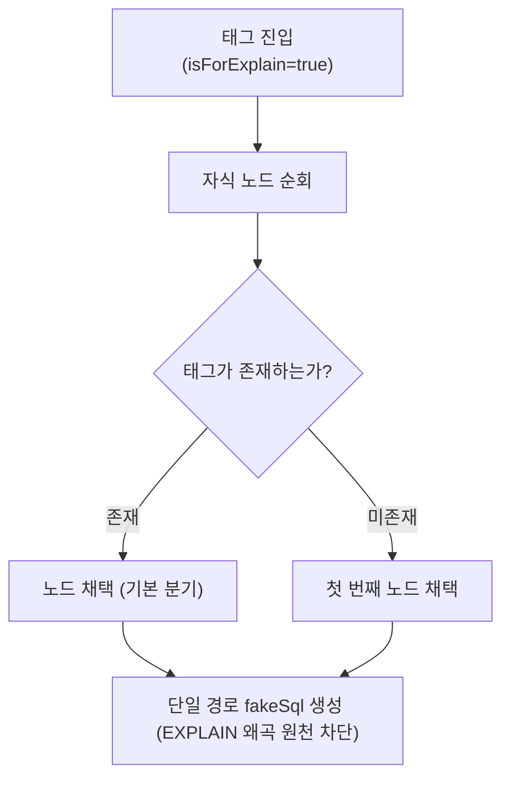
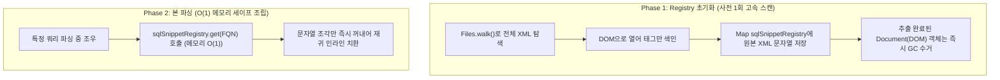

# [MyBatis] W3C DOM 기반 MyBatis 동적 쿼리 정적 분석과 AST 가짜 SQL 생성기 설계

> **핵심 요약**  
> 런타임 OGNL 바인딩 파라미터가 없는 정적 상태에서, MyBatis XML 매퍼의 복잡한 동적 태그(`<if>`, `<choose>`, `<where>`, `<trim>`, `<foreach>`, `<include>`)를 **W3C DOM 트리 순회를 통해 파싱**하고, `EXPLAIN` 실행계획 왜곡 없이 실제 DBMS에서 문법 오류 없이 실행 가능한 **'가짜 SQL(Fake SQL)'을 합성하는 정적 분석 엔진 설계 기법**을 정리한다.

---

## 1. MyBatis 동적 SQL 정적 분석의 본질적 난제

MyBatis의 강력한 기능인 동적 SQL(Dynamic SQL)은 XML 태그와 OGNL 표현식을 기반으로 **런타임 시점에 클라이언트가 보낸 파라미터 값에 따라 SQL 문자열을 실시간 조립**한다.

```xml
<select id="searchUsers" resultType="User">
    SELECT user_id, user_name, status
      FROM users
    <where>
        <if test="userName != null and userName != ''">
            AND user_name LIKE #{userName}
        </if>
        <choose>
            <when test="role == 'ADMIN'">AND role = 'ADMIN'</when>
            <otherwise>AND role = 'USER'</otherwise>
        </choose>
        <if test="userIds != null and userIds.size() > 0">
            AND user_id IN
            <foreach collection="userIds" item="id" open="(" close=")" separator=",">
                #{id}
            </foreach>
        </if>
    </where>
</select>
```

### 정적 분석 시 발생하는 3대 딜레마
1. **파라미터 부재**: 파라미터 값이 없으므로 `<if>` 조건식이 참인지 거짓인지 판정할 수 없다.
2. **문법 파괴**: 태그를 무작정 벗겨내면 `WHERE AND ...`처럼 SQL 예약어가 충돌하거나, `<foreach>` 내부가 비어 `IN ()`과 같은 치명적인 SQL Syntax Error가 발생한다.
3. **실행계획(EXPLAIN) 왜곡**: 단순히 모든 태그를 활성화하여 합쳐버리면 상호 배타적인 조건들이 동시에 걸려 DB 옵티마이저가 `Impossible WHERE`를 띄우거나 엉뚱한 인덱스를 타게 된다.

---

## 2. W3C DOM 기반 동적 태그 정적 스트리핑 알고리즘

`SqlExtractor`는 W3C DOM 트리를 재귀 순회하며 각 XML 노드의 성격에 맞춰 다음과 같은 규칙으로 안전한 SQL 토큰으로 치환한다.



### 2.1 태그별 스트리핑 상세 구현 규칙

1. **`<where>` 태그**:  
   내부 자식 노드를 먼저 처리한 뒤, 맨 앞에 붙은 `AND`나 `OR` 키워드를 대소문자 무시 정규식(`^(?i)\s*(and|or)\s+`)으로 제거하고 `WHERE` 절을 합성한다. 빈 태그일 경우 아무것도 생성하지 않는다.
2. **`<set>` 태그**:  
   `UPDATE` 문에서 사용되는 `<set>` 태그는 맨 뒤에 남은 불필요한 콤마(`,`)를 제거하고 `SET`을 감싼다.
3. **`<foreach>` 태그의 `( ? )` 축약**:  
   컬렉션 요소 개수를 알 수 없으므로, 문법적으로 항상 유효한 단일 바인드 변수 `( ? )`로 치환한다. 이렇게 하면 `IN ( ? )` 형태가 되어 JSqlParser AST 파싱과 DB `EXPLAIN`을 모두 완벽하게 통과한다.
4. **바인드 변수 치환**:  
   `#{param}`과 `${param}`은 정규식 `[#$]\{[^}]+\}`을 통해 표준 JDBC 물음표(`?`)로 일괄 치환한다.

---

## 3. `<choose>` 분기 처리와 EXPLAIN 왜곡 방지 알고리즘

`<choose>-<when>-<otherwise>` 태그는 Java의 `switch-case`와 동일한 상호 배타적 분기문이다.

```
[잘못된 접근: 모든 분기 강제 병합]
WHERE 1=1 
  AND status = 'PENDING'    <-- when 1
  AND status = 'COMPLETED'  <-- when 2
-> 논리적으로 status는 동시에 PENDING이자 COMPLETED일 수 없음
-> MySQL 옵티마이저는 'Impossible WHERE' 판정 후 인덱스 분석 자체를 포기
```



- **`otherwise` 우선 채택 전략**: 비즈니스 로직상 `<otherwise>`는 대다수 케이스를 커버하는 기본(Default) 조건인 경우가 많다. 따라서 정적 분석 시 `<otherwise>`가 있으면 이를 우선 선택하고, 없을 경우에만 첫 번째 `<when>`을 선택하여 **오직 하나의 경로만 남겨 실행계획 왜곡을 원천 방지**한다.

---

## 4. OOM 방지를 위한 2-Phase `<include>` 캐싱 아키텍처

MyBatis에서 `<include refid="...">`는 외부 네임스페이스 파일의 `<sql>` 조각을 참조할 수 있다. 수천 개의 매퍼가 얽힌 대규모 프로젝트에서 인클루드를 만날 때마다 파일을 다시 파싱하면 I/O 병목이 발생하고, 모든 매퍼의 DOM을 메모리에 띄우면 OOM이 발생한다.

이를 해결하기 위해 **2-Phase 문자열 레지스트리 패턴**을 적용한다.



- **메모리 절감**: 무거운 객체 트리(DOM) 대신 순수 문자열(String) 조각만 들고 있으므로, 수천 개의 XML 매퍼가 있어도 메모리 사용량은 수 MB 이내로 극히 낮게 유지된다.

---

## 5. XML 파서 보안: XXE(XML External Entity) 인젝션 차단

개발자 로컬 환경이나 CI에서 임의의 XML 매퍼를 파싱하는 도구는 반드시 **XXE 공격 방어**가 설정되어 있어야 한다. 악의적인 매퍼 파일이 `/etc/passwd`나 내부 네트워크 자원을 참조하도록 작성되어 있을 경우 정보가 탈취될 수 있다.

```java
// SqlExtractor.java
private static DocumentBuilderFactory createSecureFactory() throws ParserConfigurationException {
    DocumentBuilderFactory factory = DocumentBuilderFactory.newInstance();
    // 1. 외부 DTD 및 엔티티 선언 로딩 전면 비활성화
    factory.setFeature("http://apache.org/xml/features/disallow-doctype-decl", true);
    factory.setFeature("http://xml.org/sax/features/external-general-entities", false);
    factory.setFeature("http://xml.org/sax/features/external-parameter-entities", false);
    factory.setFeature("http://apache.org/xml/features/nonvalidating/load-external-dtd", false);
    factory.setXIncludeAware(false);
    factory.setExpandEntityReferences(false);
    return factory;
}
```\n