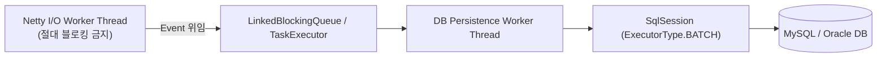

# [MyBatis] 대용량 트랜잭션 매핑과 동적 SQL 성능 최적화 패턴

> [!NOTE]
> Netty 소켓 게이트웨이나 금융 결제 시스템처럼 초당 수천 건의 트랜잭션이 발생하는 환경에서, **MyBatis XML 동적 쿼리의 성능 왜곡 함정**을 회피하고 `ExecutorType.BATCH`를 활용해 DB 부하를 최소화하는 실무 최적화 기법을 학습합니다.

---

## 1. 고성능 소켓 서버와 RDBMS 간의 임피던스 불일치

Netty는 Non-blocking 이벤트 루프 기반으로 초당 수만 건의 소켓 패킷을 가볍게 수신하지만, 뒷단의 RDBMS(MySQL, Oracle)는 물리적 디스크 I/O와 커넥션 풀(HikariCP)의 제약을 받습니다.

만약 Netty의 I/O Worker 스레드 내부에서 직접 MyBatis Mapper를 동기(Blocking)로 호출하면 다음과 같은 치명적인 병목이 발생합니다:
1. DB 쿼리 응답이 100ms 지연될 때 Worker 스레드가 블로킹되어 다른 수천 개 소켓의 이벤트 처리가 중단됨.
2. 커넥션 풀 고갈(`ConnectionTimeoutException`) 발생.

### 해결 아키텍처:
- I/O Worker 스레드는 패킷 검증 후 비즈니스 DTO를 즉시 큐나 비동기 워커 스레드 풀(Executor)로 위임하고, DB 영속화는 별도의 스레드 풀에서 전담하도록 분리해야 합니다.



---

## 2. 동적 SQL 작성 시 실행 계획(Execution Plan) 왜곡 방지

### 2.1 `<if>` 태그 남발로 인한 옵티마이저 오작동
```xml
<!-- 안티 패턴: 검색 조건 조합에 따라 완전히 다른 SQL 생성 -->
<select id="findTransactions" resultType="TxDto">
    SELECT * FROM HA_TRANSACTION
    WHERE 1=1
    <if test="mid != null and mid != ''">
        AND mid = #{mid}
    </if>
    <if test="startDate != null">
        AND tx_date &gt;= #{startDate}
    </if>
    <if test="status != null">
        AND status = #{status}
    </if>
</select>
```
- 파라미터 유무에 따라 인덱스 결합 조건이 깨지며 옵티마이저가 인덱스 풀 스캔(Index Full Scan)이나 테이블 풀 스캔(Table Full Scan)을 선택하게 됩니다.
- **해결책**:
  - 자주 호출되는 핵심 트랜잭션 조회는 복합 인덱스(`(mid, tx_date, status)`)를 명확하게 타도록 전용 쿼리 메서드로 분리하는 것이 좋습니다.

---

## 3. 대용량 로그·텔레메트리 일괄 삽입 (`ExecutorType.BATCH`)

단말기 헬스체크 로그나 IoT 센서 데이터를 건건이 `INSERT`하면 1,000건 삽입 시 1,000번의 네트워크 라운드 트립(Round-trip)이 발생합니다.

### 3.1 MyBatis Batch Executor 활용:
```java
@Service
@RequiredArgsConstructor
public class TelemetryBatchService {

    private final SqlSessionFactory sqlSessionFactory;

    public void insertBatch(List<DeviceLogDto> logList) {
        // BATCH 모드의 SqlSession 오픈
        try (SqlSession sqlSession = sqlSessionFactory.openSession(ExecutorType.BATCH, false)) {
            AppMapper mapper = sqlSession.getMapper(AppMapper.class);
            
            for (int i = 0; i < logList.size(); i++) {
                mapper.insertDeviceLog(logList.get(i));
                
                // 500건 단위로 flush하여 힙 메모리 급증 방지
                if (i > 0 && i % 500 == 0) {
                    sqlSession.flushStatements();
                }
            }
            // 잔여 데이터 flush 및 커밋
            sqlSession.flushStatements();
            sqlSession.commit();
        }
    }
}
```

- JDBC 드라이버의 `rewriteBatchedStatements=true` 옵션과 결합하면, 단일 TCP 패킷 내에 다중 행 `INSERT INTO ... VALUES (...), (...)` 형태로 묶여 전송되므로 처리 성능이 10~20배 향상됩니다.\n