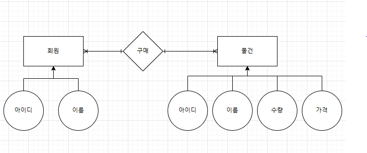
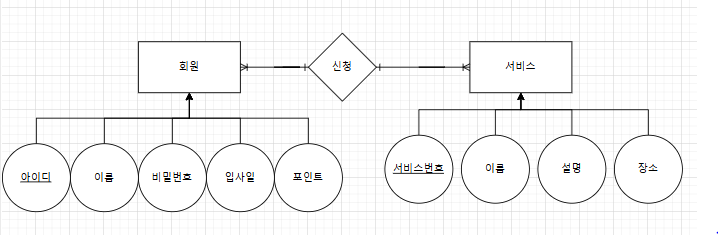
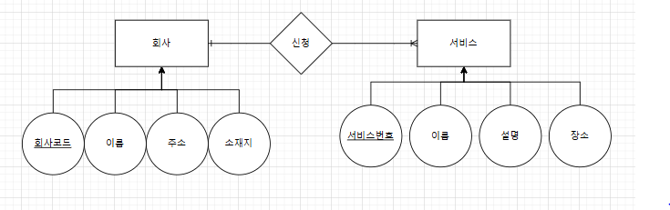
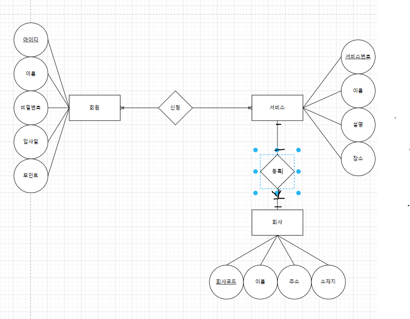

# ERD , 정규형

## 오전수업

- 테이블 설계 → 데이터 중복 최소화 (이상 현상 (삽입 / 삭제 / 갱신 이상) 이 발생할 수 있다)
    - 데이터베이스 정규화 ( 포스팅 자료 )
    - 테이블 분리

> [!NOTE]
> **데이터베이스 정규화**
> 
>  **(데이터 중복을 최소화하고, 각각의 속성들이 기본키에 종속적인지를 확인해봐야한다)**
> 
> - 1정규형
>     - 각각의 속성은 하나의 튜플에 여러개의 값을 가질 수 없다 (원자성을 가짐)
> - 2정규형
>     - 기본키에 대해 다른 컬럼의 속성이 종속되지 않을경우 위배된다
>     - ex) memberId(PK), itemId(PK) 2개의 복합키로 기본키를 가질때, 상품명의 경우 item에만 종속되므로 2정규형이 위배된다
> - 3정규형
>     - “A→B , B→C 이면, A→C이다“ 라는 식이 한 테이블내에서 성립된다면 3정규형이 위배된 것이다
>     - A→B 이고, B→C이라면 2개의 테이블로 나누어서 생각해야한다
> - BCNF는 3정규형을 강화한것
>     - 예시를 찾아보는게 더빠를듯하다

> [!NOTE]
> 이상현상)
> 
> - 삽입 이상
>     - 튜플에 데이터를 삽입할때 NULL값(즉, 쓸데없는 값까지 추가해야함)이 입력됨
> - 삭제이상
>     - 하나의 데이터를 삭제하려다 다른데이터까지 연쇄적으로 삭제됨
> - 수정이상
>     - 수정 시 데이터의 일관성이 깨지는 현상이 발생

- ERD ( 개체 관계 도식화)
    - Entity (개체)
        - 독립적으로 표현 가능한 대상
    - Relation (관계)
        - 1:1
        - 1:N
        - N:M
    - Diagram (도식화)
        - 🟧 : 개체 표현 방법
        - ⚪ : 속성 표현 방법
        - 🔶 : 관계
- 테이블 명세서 ( 테이블 제작 )
    - 1:1 일경우, 외래키를 두 개의 테이블중 아무곳에나 가져도 상관없다
    - 1:N 일경우, 외래키를 N인 테이블에 외래키를 가져야한다
    - N:M 일경우, 테이블을 중간에 하나 두어서 사용 (관계테이블)
- SQL 쿼리문 작성
    - 개발자의 영역

```sql
create table tt(
id number(3) primary key,
m_id varchar(10),
item_id varchar(10),
constraint Ref_member_id foreign key(m_id) references member(id)
on delete cascade,
constraint Ref_item_id foreign key(item_id) references item(id)
on delete set null
);

// on delete cascade : 부모 id 값이 삭제되면 tt테이블의 외래키가 걸려있는 테이블의 튜플도 같이 삭제된다 (연쇄적 삭제)
// on delete set null : 부모 id 값이 삭제되면 tt테이블의 외래키 속성에 데이터 값이 null로 변경된다

/*
 1. 외래키는 null 값을 가질 수 있다
 2. 외래키는 부모 속성에 대한 unique함만 가지면 되므로 null과는 상관이 없다
*/

```

## 오전실습

- 요구사항 정의표 → ERD → 테이블 명세서

> [!NOTE]
> 요구사항)
> 
> 1. 회원은 아이디와 이름
> 2. 물건은 아이디와 이름, 수량, 가격
> 3. 회원은 물건을 구매하고, 한개의 물건은 여러명이 구매할 수 있다.

- ERD



- 테이블 명세서

**회원**

| 컬럼명 | 컬럼설명 | 속성 | default | PK | FK | 제약조건 |
| --- | --- | --- | --- | --- | --- | --- |
| id | 아이디 | varchar2(10) |  | Y |  |  |
| name | 이름 | varchar2(10) |  |  |  |  |

구매

| 컬럼명 | 컬럼설명 | 속성 | default | PK | FK | 제약조건 |
| --- | --- | --- | --- | --- | --- | --- |
| id | 아이디 | varchar2(10) |  | Y |  |  |
| member_id | 회원아이디 | varchar2(10) |  |  | Y |  |
| item_id | 물건아이디 | varchar2(10) |  |  | Y |  |

**물건**

| 컬럼명 | 컬럼설명 | 속성 | default | PK | FK | 제약조건 |
| --- | --- | --- | --- | --- | --- | --- |
| id | 아이디 | varchar2(10) |  | Y |  |  |
| name | 물건이름 | varchar2(10) |  |  |  |  |
| quantity | 물건수량 | number(3) |  |  |  |  |
| price | 가격 | number(10) |  |  |  |  |

```sql
//SQL 쿼리
create table member_tmp(
id varchar(10) primary key,
name varchar(20)
);

create table item_tmp(
id varchar2(10) primary key,
name varchar2(10),
quantity number(3),
price number(10)
);

create table purchase_tmp(
id number(3) primary key,
member_id varchar2(10),
item_id varchar2(10),
foreign key (member_id) references member_tmp(id),
foreign key (item_id) references item_tmp(id)
);
```

## 오후수업

### 문제1

- 요구사항 정의서

| 요구사항명 | 기능명 | 상세설명 | 필수데이터 | 선택데이터 | 요청사항 |
| --- | --- | --- | --- | --- | --- |
| 회원 | 회원관리테이블 | 회원에 필요한 정보들 저장 | 아이디 | 비밀번호, 이름, 입사일, 포인트 | 1) 포인트 기본값 = 20
2) 회원은 여러개의 서비스를 예약할 수 있다 |
| 서비스 | 서비스관리테이블 | 서비스에 필요한 정보들 저장 | 서비스번호 | 이름,설명,장소 | 1) 하나의 서비스는 여러명의 회원에게 제공된다 |
- ERD



- 테이블 명세서

회원

| 컬럼명 | 컬럼설명 | 속성 | 크기 | Not NULL | PK | FK | 제약조건 및 default |
| --- | --- | --- | --- | --- | --- | --- | --- |
| id | 아이디 | varchar2 | 10 | Y | Y |  |  |
| name | 이름 | varchar2 | 10 | N |  |  |  |
| pass | 비밀번호 | varchar2 | 10 | N |  |  |  |
| enter_date | 입사일 | timestamp |  | N |  |  | default : sysdate |
| point | 포인트 | number | 5 | N |  |  | default : 20 |

```sql
create table member(
id varchar2(10),
name varchar2(10),
pass varchar2(10),
enter_date timestamp default sysdate,
point number(5) default 20,
constraint memberPK primary key(id)
);
```

> [!NOTE]
> ```sql
> SQL> create table member(
>   2  id varchar2(10),
>   3  name varchar2(10),
>   4  pass varchar2(10),
>   5  enter_date timestamp default sysdate,
>   6  point number(5) default 20,
>   7  constraint memberPK primary key(id)
>   8  );
> 
> 테이블이 생성되었습니다.
> ```

서비스

| 컬럼명 | 컬럼설명 | 속성 | 크기 | Not NULL | PK | FK | 제약조건 및 default |
| --- | --- | --- | --- | --- | --- | --- | --- |
| id | 서비스번호 | number | 5 | Y | Y |  |  |
| name | 이름 | varchar2 | 10 | N |  |  |  |
| exp | 설명 | varchar2 | 100 | N |  |  |  |
| dest | 장소 | varchar2 | 100 | N |  |  |  |

```sql
create table service(
id number(5),
name varchar2(10),
exp varchar2(100),
dest varchar2(100),
constraint servicePK primary key(id)
);
```

> [!NOTE]
> ```sql
> SQL> create table service(
>   2  id number(5),
>   3  name varchar2(10),
>   4  exp varchar2(100),
>   5  dest varchar2(100),
>   6  constraint servicePK primary key(id)
>   7  );
> 
> 테이블이 생성되었습니다.
> ```

신청

| 컬럼명 | 컬럼설명 | 속성 | 크기 | Not NULL | PK | FK | 제약조건 및 default |
| --- | --- | --- | --- | --- | --- | --- | --- |
| id | 신청번호 | number | 5 | Y | Y |  |  |
| member_id | 회원 아이디 | varchar2 | 10 | N |  | Y |  |
| service_id | 서비스 아이디 | number | 5 | N |  | Y |  |

```sql
create table subscribe(
id number(5),
member_id varchar2(10),
service_id number(5),
constraint subscribePK primary key(id),
constraint REF_member_FK foreign key (member_id) references member(id),
constraint REF_service_FK foreign key (service_id) references service(id)
);

```

> [!NOTE]
> ```sql
> SQL> create table subscribe(
>   2  id number(5),
>   3  member_id varchar2(10),
>   4  service_id number(5),
>   5  constraint subscribePK primary key(id),
>   6  constraint REF_member_FK foreign key (member_id) references member(id),
>   7  constraint REF_service_FK foreign key (service_id) references service(id)
>   8  );
> 
> 테이블이 생성되었습니다.
> ```

- 테스트
    
    ```sql
    // 기본키 설정 적용 확인
    
    // (member)
    insert into member values (null, 'a', '1234', default ,default);
    /*
    SQL> insert into member values (null, 'a', '1234', default ,default);
    insert into member values (null, 'a', '1234', default ,default)
                               *
    1행에 오류:
    ORA-01400: NULL을 ("SYSTEM"."MEMBER"."ID") 안에 삽입할 수 없습니다
    */
    
    insert into service values (null, 'name', 'exp', 'dest');
    /*
    SQL> insert into service values (null, 'name', 'exp', 'dest');
    insert into service values (null, 'name', 'exp', 'dest')
                                *
    1행에 오류:
    ORA-01400: NULL을 ("SYSTEM"."SERVICE"."ID") 안에 삽입할 수 없습니다
    */
    
    // 제약조건 확인
    insert into member values ('test', 'a', '1234', default, default);
    select * from member;
    /*
    SQL> select * from member;
    
    ID         NAME       PASS
    ---------- ---------- ----------
    ENTER_DATE
    ---------------------------------------------------------------------------
         POINT
    ----------
    test       a          1234
    25/01/02 14:44:59.000000
            20
    */
    
    // subscribe 확인
    insert into member values ('a', 'park', '1111', default, default);
    insert into service values (1, 'netflix' , '영상', 'seoul');
    insert into subscribe values (1, 'a', 1);
    /*
    SQL> insert into member values ('a', 'park', '1111', default, default);
    
    1 개의 행이 만들어졌습니다.
    
    SQL> insert into service values (1, 'netflix' , '영상', 'seoul');
    
    1 개의 행이 만들어졌습니다.
    
    SQL> insert into subscribe values (1, 'a', 1);
    
    1 개의 행이 만들어졌습니다.
    */
    
    insert into subscribe values (2, 'no id', 1);
    /*
    SQL> insert into subscribe values (2, 'no id', 1);
    insert into subscribe values (2, 'no id', 1)
    *
    1행에 오류:
    ORA-02291: 무결성 제약조건(SYSTEM.REF_MEMBER_FK)이 위배되었습니다- 부모 키가
    없습니다
    */
    
    insert into subscribe values (3, 'a', 2);
    /*
    SQL> insert into subscribe values (3, 'a', 2);
    insert into subscribe values (3, 'a', 2)
    *
    1행에 오류:
    ORA-02291: 무결성 제약조건(SYSTEM.REF_SERVICE_FK)이 위배되었습니다- 부모 키가
    없습니다
    */
    
    ```
    
    ### 문제2)
    
    - 요구사항 정의서

| 요구사항명 | 기능명 | 상세설명 | 필수데이터 | 선택데이터 | 요청사항 |
| --- | --- | --- | --- | --- | --- |
| 회사 | 회사관리테이블 | 회사에 필요한 정보들 저장 | 회사코드 | 이름, 주소, 소재지 | 1) 회사는 2개이상의 서비스를 등록이 가능 |
| 서비스 | 서비스관리테이블 | 서비스에 필요한 정보들 저장 | 서비스번호 | 이름,설명,장소 | 1) 하나의 서비스는 하나의 회사에게 제공된다 |
- ERD



- 테이블명세서

회사

| 컬럼명 | 컬럼설명 | 속성 | 크기 | Not NULL | PK | FK | 제약조건 및 default |
| --- | --- | --- | --- | --- | --- | --- | --- |
| id | 회사코드 | varchar2 | 10 | Y | Y |  |  |
| name | 이름 | varchar2 | 10 | N |  |  |  |
| addr | 주소 | varchar2 | 10 | N |  |  |  |
| source | 소재지 | varchar2 | 10 | N |  |  |  |

```sql
create table company(
id number(5),
name varchar2(10),
addr varchar2(100),
source varchar2(100),
constraint companyPK primary key(id)
);
```

> [!NOTE]
> ```sql
> SQL> create table company(
>   2  id number(5),
>   3  name varchar2(10),
>   4  addr varchar2(100),
>   5  source varchar2(100),
>   6  constraint companyPK primary key(id)
>   7  );
> 
> 테이블이 생성되었습니다.
> ```

서비스

| 컬럼명 | 컬럼설명 | 속성 | 크기 | Not NULL | PK | FK | 제약조건 및 default |
| --- | --- | --- | --- | --- | --- | --- | --- |
| id | 서비스번호 | number | 5 | Y | Y |  |  |
| name | 이름 | varchar2 | 10 | N |  |  |  |
| exp | 설명 | varchar2 | 100 | N |  |  |  |
| dest | 장소 | varchar2 | 100 | N |  |  |  |

```sql
create table service2(
id number(5),
name varchar2(10),
exp varchar2(100),
dest varchar2(100),
company_id number(5),
constraint service2PK primary key(id),
constraint REF_company_FK foreign key (company_id) references company(id)
);
```

> [!NOTE]
> ```sql
> SQL> create table service2(
>   2  id number(5),
>   3  name varchar2(10),
>   4  exp varchar2(100),
>   5  dest varchar2(100),
>   6  company_id number(5),
>   7  constraint service2PK primary key(id),
>   8  constraint REF_company_FK foreign key (company_id) references company(id)
>   9  );
> 
> 테이블이 생성되었습니다.
> 
> ```

- 테스트

```sql
// 기본키 테스트
//(company)
insert into company values (null, 'test', 'test', 'test');
 
/*
SQL> insert into company values (null, 'test', 'test', 'test');
insert into company values (null, 'test', 'test', 'test')
                            *
1행에 오류:
ORA-01400: NULL을 ("SYSTEM"."COMPANY"."ID") 안에 삽입할 수 없습니다
*/

// (service2)
insert into company values (1, 'com1', 'test', 'test');
insert into service2 values (null, 'test', 'test', 'test', 1); 
/*
SQL> insert into service2 values (null, 'test', 'test', 'test', 1);
insert into service2 values (null, 'test', 'test', 'test', 1)
                             *
1행에 오류:
ORA-01400: NULL을 ("SYSTEM"."SERVICE2"."ID") 안에 삽입할 수 없습니다
*/

// 외래키 테스트
insert into service2 values (1, 'test', 'test', 'test', 2); 
/*
SQL> insert into service2 values (1, 'test', 'test', 'test', 2);
insert into service2 values (1, 'test', 'test', 'test', 2)
*
1행에 오류:
ORA-02291: 무결성 제약조건(SYSTEM.REF_COMPANY_FK)이 위배되었습니다- 부모 키가
없습니다

*/
insert into service2 values (1, 'test', 'test', 'test', 1); 
/*
SQL> insert into service2 values (1, 'test', 'test', 'test', 1);

1 개의 행이 만들어졌습니다.
*/

// 이미 지정된 서비스를 다른 회사가 사용시
delete from service2;
delete from company;
insert into company values(1, 'com1', 'seoul', 'busan');
insert into company values (2, 'com2', 'busan', 'seoul');
insert into company values (3, 'com3', 'china', 'china');

insert into service2 values (1, 'netflix', '영상', 'seoul', 2);
insert into service2 values (2, 'youtube', '영상', 'busan', 1);
insert into service2 values (3, 'coupang', 'e-커머스', 'suwon', 3);
/*
1 개의 행이 만들어졌습니다
*/

insert into service2 values (1, 'netflix', '영상', 'seoul', 3);
/*
SQL> insert into service2 values (1, 'netflix', '영상', 'seoul', 3);
insert into service2 values (1, 'netflix', '영상', 'seoul', 3)
*
1행에 오류:
ORA-00001: 무결성 제약 조건(SYSTEM.SERVICE2PK)에 위배됩니다

*/

insert into service2 values (4, 'humanIT', 'edu', 'suwon', 1);
/*
1 개의 행이 만들어졌습니다.
*/

```

## 문제1 + 문제2)

- 요구사항 정의서

| 요구사항명 | 기능명 | 상세설명 | 필수데이터 | 선택데이터 | 요청사항 |
| --- | --- | --- | --- | --- | --- |
| 회사 | 회사관리테이블 | 회사에 필요한 정보들 저장 | 회사코드 | 이름, 주소, 소재지 | 1) 회사는 2개이상의 서비스를 등록이 가능 |
| 서비스 | 서비스관리테이블 | 서비스에 필요한 정보들 저장 | 서비스번호 | 이름,설명,장소 | 1) 하나의 서비스는 하나의 회사에게 제공된다 |
- ERD



- 테이블명세서

회사

| 컬럼명 | 컬럼설명 | 속성 | 크기 | Not NULL | PK | FK | 제약조건 및 default |
| --- | --- | --- | --- | --- | --- | --- | --- |
| id | 회사코드 | varchar2 | 10 | Y | Y |  |  |
| name | 이름 | varchar2 | 10 | N |  |  |  |
| addr | 주소 | varchar2 | 10 | N |  |  |  |
| source | 소재지 | varchar2 | 10 | N |  |  |  |

```sql
create table company(
id number(5),
name varchar2(10),
addr varchar2(100),
source varchar2(100),
constraint companyPK primary key(id)
);
```

> [!NOTE]
> ```sql
> SQL> create table company(
>   2  id number(5),
>   3  name varchar2(10),
>   4  addr varchar2(100),
>   5  source varchar2(100),
>   6  constraint companyPK primary key(id)
>   7  );
> 
> 테이블이 생성되었습니다.
> ```

등록

| 컬럼명 | 컬럼설명 | 속성 | 크기 | Not NULL | PK | FK | 제약조건 및 default |
| --- | --- | --- | --- | --- | --- | --- | --- |
| id | 등록번호 | number | 5 | Y | Y |  |  |
| service_id | 서비스 번호 | number | 5 | N |  | Y | unique |
| company_id | 회사 번호 | number | 5 | N |  | Y |  |

```sql
create table register(
id number(5) primary key,
service_id number(5) unique,
company_id number(5),
constraint REF_new_company_FK foreign key (company_id) references company(id),
constraint REF_new_service_FK foreign key (service_id) references service(id)
);
```

- 테스트

```sql
//(회사)
insert into company values(1, 'com1', 'seoul', 'busan');
insert into company values (2, 'com2', 'busan', 'seoul');
insert into company values (3, 'com3', 'china', 'china');

//(service)
insert into service values (1, 'netflix', '영상', 'seoul');
insert into service values (2, 'youtube', '영상', 'busan');
insert into service values (3, 'coupang', 'e-커머스', 'suwon');

insert into register values (1, 1, 1);
//성공
insert into register values (2, 1, 2);
//오류
/*
SQL> insert into register values (2, 1, 2);
insert into register values (2, 1, 2)
*
1행에 오류:
ORA-00001: 무결성 제약 조건(SYSTEM.SYS_C0011114)에 위배됩니다
*/

insert into register values (3, 2, 1);
//성공

 
```
