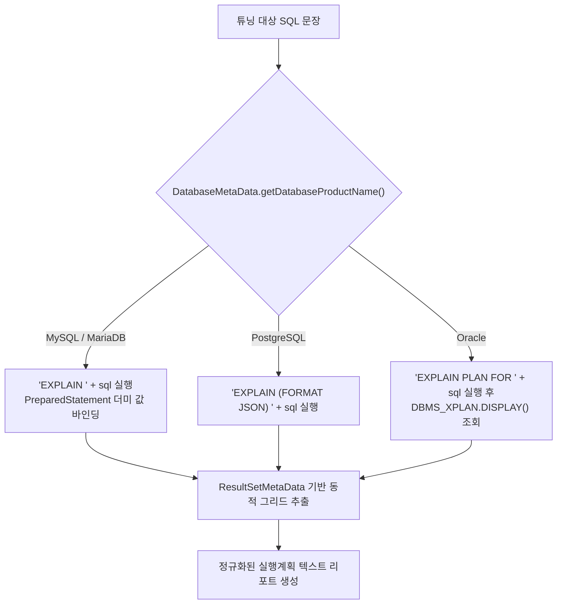
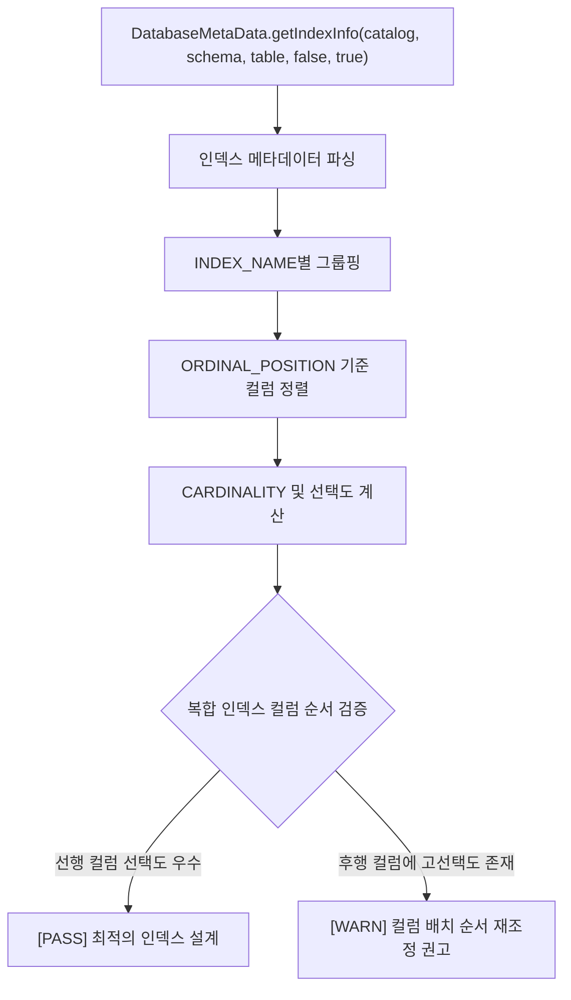

# [SQL] 멀티 RDBMS 실행계획(EXPLAIN) 분석과 복합 인덱스 선택도 계산 알고리즘 (MySQL, MariaDB, Postgres, Oracle)

> **핵심 요약**  
> 데이터베이스 성능 튜닝의 핵심인 **실행계획(EXPLAIN)을 이기종 RDBMS 환경에서 단일 파이프라인으로 추출**하고, `DatabaseMetaData`를 활용해 **복합 인덱스(Composite Index)의 카디널리티(Cardinality)와 선택도(Selectivity)를 계산**하여 최적의 인덱스 컬럼 순서를 도출하는 정량적 알고리즘을 분석한다.

---

## 1. Multi-RDBMS EXPLAIN 호환성 처리 전략

각 데이터베이스 벤더는 쿼리 옵티마이저의 실행 계획을 조회하는 문법과 결과 포맷이 완전히 상이하다. 이를 애플리케이션 레벨에서 통합 분석하기 위해 DB 엔진별 어댑터 패턴을 적용한다.

| RDBMS | 기본 EXPLAIN 명령 구문 | 출력 형태 | 바인드 변수 처리 주의사항 |
| :--- | :--- | :--- | :--- |
| **MySQL / MariaDB** | `EXPLAIN FORMAT=JSON <SQL>` 또는 `EXPLAIN <SQL>` | 단일 JSON 컬럼 또는 표 형태 결과셋 | `LIMIT ?`에 NULL 바인딩 시 문법 오류 -> 정수 더미 바인딩 필수 |
| **PostgreSQL** | `EXPLAIN (FORMAT JSON, COSTS true) <SQL>` | 단일 JSON 배열 결과셋 | 파라미터 타입 엄격 검사 -> 적절한 더미 리터럴 필요 |
| **Oracle** | `EXPLAIN PLAN FOR <SQL>` 실행 후 `SELECT * FROM TABLE(DBMS_XPLAN.DISPLAY)` | 텍스트 계획표 포맷 | 세션별 `PLAN_TABLE`에 저장 후 조회 필요 |
| **H2** | `EXPLAIN PLAN FOR <SQL>` | 표 형태 문자열 결과셋 | 주로 단위 테스트 및 개발 환경 검증용 |



### 1.1 PreparedStatement 기반 바인드 변수 안전 처리
SQL 텍스트의 `?`를 문자열 치환(`replaceAll`)으로 채우면 문자열 리터럴 내부의 `?`까지 오염된다. 따라서 JDBC `PreparedStatement`를 생성한 후 파라미터 인덱스에 맞춰 더미 값을 채워야 한다.
- 특히 **MariaDB**의 경우 `LIMIT ?` 절에 `setNull(i, Types.NULL)`을 바인딩하면 `syntax error near 'null'` 예외를 발생시키므로, 안전한 기본 정수값(`setInt(i, 1)`)을 바인딩해야 한다.

---

## 2. 이기종 RDBMS 스키마 메타데이터 수집 시 대소문자 정규화

`DatabaseMetaData.getColumns()`나 `getIndexInfo()`를 호출하여 테이블 메타데이터를 조회할 때, RDBMS 제품군마다 **식별자(테이블명, 컬럼명)의 대소문자 저장 정책**이 달라 조회가 실패하는 치명적인 문제가 발생한다.

```
[RDBMS별 식별자 저장 정책 차이]
- Oracle / H2: 기본적으로 모든 식별자를 대문자(UPPERCASE)로 저장 (USER_ORDERS)
- PostgreSQL: 기본적으로 모든 식별자를 소문자(lowercase)로 저장 (user_orders)
- MySQL / MariaDB: OS 파일 시스템 및 lower_case_table_names 설정에 따라 대소문자 구분
```

```java
// JdbcAnalyzer.java: 메타데이터 조회를 위한 테이블명 정규화 알고리즘
private String normalizeTableName(String tableName, DatabaseMetaData metaData) throws SQLException {
    if (metaData.storesUpperCaseIdentifiers()) {
        return tableName.toUpperCase();
    } else if (metaData.storesLowerCaseIdentifiers()) {
        return tableName.toLowerCase();
    }
    return tableName; // 원래 대소문자 유지
}
```

- **Catalog 스코프 한정**: `getColumns(catalog, schema, tableName, null)` 호출 시 `catalog` 인자에 `null`을 전달하면 서버 내 존재하는 모든 스키마/데이터베이스를 전수 검색하여 동일 테이블명이 존재할 경우 중복 메타데이터가 섞인다. 반드시 `connection.getCatalog()`로 현재 연결된 DB로 스코프를 제한해야 한다.

---

## 3. 복합 인덱스(Composite Index) 카디널리티와 선택도 계산 알고리즘

데이터베이스 인덱스 성능 최적화의 핵심은 **카디널리티(Cardinality, 고유값의 수)**가 높고 **선택도(Selectivity)**가 낮은 컬럼을 인덱스의 선행 컬럼(Leading Column)으로 배치하는 것이다.

### 3.1 수학적 공식 및 기준치
$$	ext{선택도(Selectivity)} = rac{	ext{카디널리티(Cardinality)}}{	ext{전체 행 수(Total Rows)}}$$

$$\text{필터링 효율} = (1 - \text{선택도}) \times 100\%$$

- **선택도 $pprox 1.0$**: 고유값(PK, 주민등록번호, UUID). 단 한 번의 B-Tree 인덱스 탐색으로 1건만 특정 가능 -> **최우선 선행 컬럼**
- **선택도 $\le 0.05$ (5% 이하)**: 성별(남/녀), 결제상태(Y/N/P). 인덱스를 태워도 수만 건의 랜덤 I/O가 발생하여 풀 테이블 스캔이 더 유리함 -> **단독 인덱스 부적합**



### 3.2 DatabaseMetaData 기반 인덱스 인스펙션 알고리즘
```java
ResultSet rs = metaData.getIndexInfo(catalog, null, normalizedTable, false, false);
Map<String, List<IndexColumnInfo>> indexMap = new LinkedHashMap<>();

while (rs.next()) {
    String indexName = rs.getString("INDEX_NAME");
    if (indexName == null) continue; // 통계 정보 행 스킵
    
    String columnName = rs.getString("COLUMN_NAME");
    short ordinalPosition = rs.getShort("ORDINAL_POSITION"); // 1부터 시작하는 컬럼 순서
    long cardinality = rs.getLong("CARDINALITY");            // 고유값 개수
    boolean nonUnique = rs.getBoolean("NON_UNIQUE");

    indexMap.computeIfAbsent(indexName, k -> new ArrayList<>())
            .add(new IndexColumnInfo(columnName, ordinalPosition, cardinality, !nonUnique));
}
```

---

## 4. JSqlParser를 활용한 SQL AST 테이블명 정적 추출

복잡한 쿼리(다중 JOIN, 인라인 뷰, 서브쿼리, UNION)에서 메타데이터를 조회할 물리 테이블명을 정규식으로 추출하면 주석(`/* ... */`)이나 문자열 리터럴 내부의 텍스트에 의해 파싱이 깨진다. 이를 방지하기 위해 **SQL 구문 분석기(AST)**를 활용한다.

```java
// JSqlParser 기반 정교한 테이블 추출
Statement statement = CCJSqlParserUtil.parse(fakeSql);
TablesNamesFinder tablesNamesFinder = new TablesNamesFinder();
List<String> tableList = tablesNamesFinder.getTableList(statement);

// 추출 결과: ["orders", "users", "order_details"]
// 뷰나 가상 테이블을 제외한 실제 물리 테이블을 Set에 담아 DatabaseMetaData에 질의
```

- **효과**: 쿼리에 사용된 모든 실제 테이블의 스키마와 인덱스 현황을 AI 프롬프트나 튜닝 리포트에 자동으로 포함시켜, DBA 수준의 정밀한 인덱스 추천을 가능하게 한다.\n