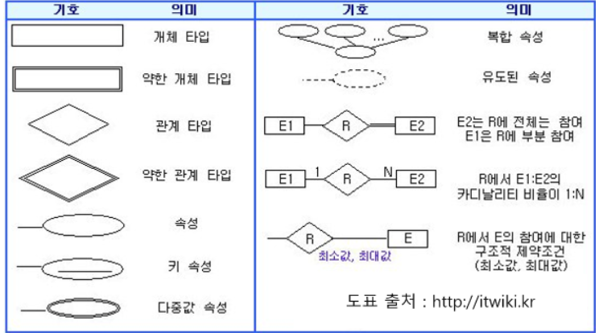
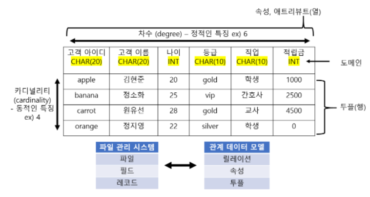
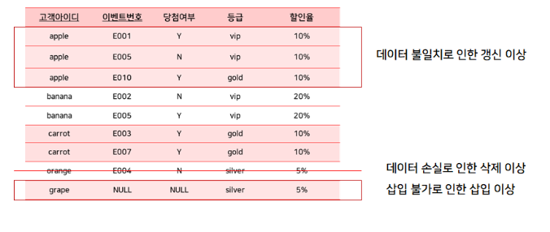
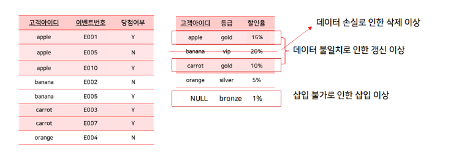
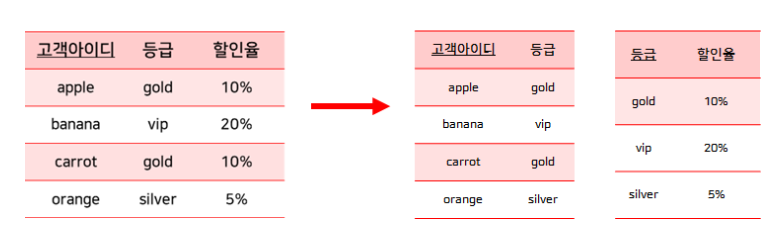
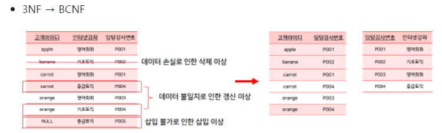

# [이론] 데이터베이스 개론

> [!NOTE]
> 스키마·인스턴스, 3단계 스키마와 데이터 독립성, 데이터 모델링과 ER 모델, 관계 데이터 모델(릴레이션·키·무결성), 정규화, 트랜잭션(ACID)·회복·병행 제어, 권한 관리까지 데이터베이스 개론 전반을 정리한다.

## 🔗 참고

- [데이터베이스 개론 1장 - 기본 개념 (velog)](https://velog.io/@mh_go/%EB%8D%B0%EC%9D%B4%ED%84%B0%EB%B2%A0%EC%9D%B4%EC%8A%A4-%EA%B0%9C%EB%A1%A0-1%EC%9E%A5-%EB%8D%B0%EC%9D%B4%ED%84%B0%EB%B2%A0%EC%9D%B4%EC%8A%A4-%EA%B8%B0%EB%B3%B8-%EA%B0%9C%EB%85%90)

## 📌 개념

- 스키마 : 데이터베이스에 저장되는 데이터 구조와 제약조건을 정의
- 인스턴스 : 정의된 스키마에 따라 데이터베이스에 실제로 저장된 값

---

- 외부스키마
    - 사용자의 관점에서의 스키마
- 개념스키마
    - 사용자에게 필요한 데이터를 통합하여 전체 데이터베이스의 논리적 구조 정의
    - 데이터베이이스 하나에 개념스키마 하나만 존재
- 내부스키마
    - 물리적인 저장구조를 표현한 것
    - 데이터베이스에 하나에만 존재
    - 저장 장치에 실제로 저장되는 방법을 정의한 것

- 데이터 독립성 : 스키마 간의 변경이 있어도 서로 영향을 주지 않음
    - 하위스키마를 변경하더라도 상위스키마가 영향을 받지 않는 특성
        - 논리적데이터 독립성 : 개념스키마 변경 → 외부스키마 영향 x
        - 물리적데이터 독립성 : 내부스키마 변경 → 개념스키마 영향 x
    - **왜 3단계로 나누어 독립성을 확보하는가**: 예를 들어 저장 방식을 바꾸거나(내부스키마 변경, 예: 인덱스 추가·파일 구조 변경) 새로운 테이블을 추가해도(개념스키마 변경), 그 위 계층에서 이미 작성된 애플리케이션 코드(외부스키마 기준으로 작성됨)를 수정하지 않아도 되게 하기 위함이다. 스키마 계층을 분리해두지 않으면 물리적 저장 구조를 바꿀 때마다 이를 사용하는 모든 애플리케이션 코드를 함께 고쳐야 한다.

- 데이터 사전
    - 데이터 사전에 있는 데이터에 실제로 접근하는 데 필요한 위치 정보 관리

- 데이터 언어
    - 데이터 정의어 : 스키마를 정의하거나 기존 스키마의 정의를 삭제 또는 수정하기 위해 사용
        - CREATE, ALTER, DROP, TRUNCATE
    - 데이터 조작어 : 데이터의 삽입, 삭제, 수정, 검색 등의 처리를 위해 사용 하는 언어
        - SELECT, INSERT, UPDATE, DELETE
    - 데이터 제어어 : 무결성과 일관성을 유지하도록 내부적으로 필요한 규칙이나 기법을 정의하는데 사용
        - GRANT, REVOKE, COMMIT, ROLLBACK
    
- 데이터 베이스 규칙
    - 무결성 : 정확하고 유효한 데이터만 유지
    - 보안 : 허가받지 않은 사용자 차단
    - 회복 : 장애가 발생해도 데이터 일관성 유지
    - 동시성 : 데이터 동시 접근 가능

---

- 데이터 모델링
    - 추상화 : 데이터베이스에 저장하여 관리할 만한 가치가 있는 중요 데이터를 추출하는 것
    - 개념적 모델링 : 현실세계에서 중요데이터를 추출하여 개념세계로 옮기는 작업
    - 논리적 모델링 : 개념 세계의 데이터를 데이터베이스에 저장할 구조를 결정하고 이 구조로 표현하는 작업
    
- 데이터 모델
    - 데이터 구조 : 정적인 특징
        - 개념적 데이터구조 : 현실세계를 개념세계로 추상화했을 때 어떤 요소로 이루어졌느지 설명
        - 논리적 데이터 구조: 데이터를 어떤 모습으로 저장할 것인지 표현
    - 연산 : 동적 특징 (실제로 표현되는 값들을 처리)
    - 제약조건 : 구조적 측면, 의미적 측면

- 개체 - 관계 모델 (ER모델)
    - 개체 : 현실세계에서 저장할 만한 가치가 있는 중요 데이터를 지닌 사람이나 사물등을 의미
        - ex_ 대학교의 학과 개체
    - 속성 : 개체가 가지고 있는 고유의 특성
        - 속성 개수
            - 단일 : 고객의 이름 (속성 값 1개)
            - 다중 :  고객의 연락처 ( 집, 전화번호, 휴대폰 번호 - 속성값 여러개)
        - 의미의 분해 가능성
            - 단순 속성 : 의미를 더 분해 불가능
            - 복합 속성 :  의미 분해 가능 (ex_ 생년월일 ⇒ 연, 월, 일)
        - 널속성 : 널 값이 허용
        - key 속성 : 식별자
    - 관계
        - 개체와 개체가 맺고 있는 의미 있는 연관성
        - 요구사항을 주어졌을 떄 동사에 해당하는 부분
            - ex_ 고객은 책을 구매한다 (관계)
        - 1:1 , 1: N , M: N  ⇒ 관계
        - 관계의 종속성
            - 존재 종속 : 개체 B가 삭제되면 개체 A도 삭제되어야 함
            - 약한 개체 : 다른개체의 존재여부에 의존적인 개체
            - 강한 개체 : 다른 개체의 존재여부를 결정하는 개체
        
        ---
        
- E-R 다이어그램
    - 1:1 , 1:N , M:N 관계는 레이블로 표기
    
    
    
- 논리적 데이터 모델
    - 논리적 데이터모델로 표현된 데이터베이스의  논리적 구조가 바로 데이터베이스 schema(스키마)
    - 논리적 구조는 사용하는 DBMS에 따라 달라짐

- 관계 데이터 모델
    - 데이터베이스의 논리적 구조가 2차원 테이블 형태

- 계층 데이터 모델
    - 부모 - 자식 관계 (1:N관계)
    - 부모는 여러 자식을 둘 수 있음 ( 자식은 한 부모만 가짐)
    - 개념적 구조를 논리적 구조로 모델링하기 어려움 ( 많은 제약 조건 )

- 네트워크 데이터 모델
    - 데이터베이스의 논리적 구조가 그래프 또는 네트워크 형태
    - 두 개체 간의 관계를 여러개 지정 가능 (관계 구별 방법 ⇒ 관계 이름)
    - 계층 데이터모델보다 더 복잡해질 수 있으며, 데이터 연산 및 데이터 검색이 어려워 질 수 있음

> [!NOTE]
> 요즘 관계 데이터 모델을 많이 사용

---

- 관계 데이터 모델
    - 하나의 개체에 관한 데이터를 릴레이션 하나에 담아 데이터베이스에 저장
    
    
    
    - 속성(⇒ 열 or Attribute 라고 부름)
    - 투플(⇒ 릴레이션의 행을 튜플이라 부름)
    - 도메인
        - 속성하나가 가질 수 있는 값들의 집합
        - 원자 값만 사용 (더 분해 불가능)
        - 장점 : 지정해둔 해당 값 이외의 값을 허용하지 않음 (항상 올바른 값만 유지)
    - NULL값
    - 차수 : 속성의 전체 개수 (모든 릴레이션은 최소 1이상의 차수를 유지해야함)
    - 카디널리티 : 튜플의 전체 개수 (변동성이 있음 = 삭제, 생성, 수정 등)

---

- 릴레이션
    - 릴레이션 스키마 ( = 릴레이션 내포, 릴레이션 이름과 속성의 이름 표현 )
        - 데이터 정의어를 이용해 정의
        - 표현 방식 ⇒ 릴레이션이름(속성이름1, 속성이름2, …)
        - 릴레이션의 이름과 릴레이션에 포함된 모든 속성의 이름으로 정의하는 릴레이션의 논리적 구조
        
    - 릴레이션 인스턴스 (= 릴레이션 외연, 릴레이션 실제 값들을 보여줌)
        - 어느 한 시점에 존재하는 튜플들의 집합
        - 릴레이션 스키마에서 정의한 각 속성에 대응하는 실제 값으로 구성됨
        - 데이터 조작어 사용
        
- 데이터베이스 스키마
    - 데이터베이스를 구성하는 릴레이션들의 스키마를 모아 둔 것

- 데이터베이스 인스턴스
    - 어느 한 시점의 데이터베이스에 저장된 데이터 내용의 전체 집합

---

- 릴레이션의 특징
    - 튜플의 유일성  :  하나의 릴레이션에는 동일한 튜플 존재 불가 (key를 이용하여 유일성 판단)
    - 튜플의 무순서  :  튜플 사이의 순서는 무의미
    - 속성의 무순서  :  속성들의 순서는 무의미
    - 속성의 원자성  :   속성 값으로 원자 값만 사용할 수 있다 (하나의 속성은 여러 개의 값 가질 수 없음)

---

- KEY의 종류
    - KEY 란?
        - 튜플들 구별해주는 역할
        - 슈퍼키, 후보키, 기본키, 대체키, 외래키 존재
    - 슈퍼키 : 유일성의 특성을 만족하는 속성
    - 후보키 : 유일성 + 최소성 (최소성 : 최소한의 속성들로만 키를 구성, 하나의 속성으로 구성된 키는 최소성 만족)
    
    > [!NOTE]
    > 슈퍼키 중에서 최소성을 만족하는 것이 후보키가 됨

    - 기본키 : 후보키 중에서 기본적으로 사용할 키

    > [!NOTE]
    > 기본키 고려사항
    > - 널 값을 가질 경우 부적합
    > - 값이 자주 변경되는 것도 부적합
    > - 단순한 후보키 선택

    - 대체키 : 기본키로 선택되지 못한 후보키
    - 외래키 : 선택되지 못한 속성이 다른 릴레이션에서 기본키가 된 키

    > [!NOTE]
    > 외래키 특징
    > - 외래키는 기본키를 참조하지만 기본키가 아니기 때문에, 널 값 허용 / 서로 다른 튜플이 같은 값을 가질 수 있음(중복 허용)

    > [!NOTE]
    > 외래키 고려사항
    > - 외래키가 되는 속성과 기본키가 되는 속성의 이름은 달라도 됨
    > - 외래키 속성의 도메인과 기본키 속성의 도메인은 같아야 함
    
    - 도메인: 속성들이 가질 수 있는 값

---

- 관계 데이터 모델의 제약
    - 무결성 제약 조건
    
    > [!NOTE]
    > 무결성이란?
    > - 데이터에 결함이 없는 상태

    - 무결성 제약 조건의 주요 목적 : 데이터 상태를 일관되게 유지
    
    - 개체 무결성 제약 조건
        - 기본키를 구성하는 모든 속성은 널 값을 가지면 안된다는 규칙
        - DBMS에서 자동으로 수행 ( ⇒ 사용자는 기본키를 어떤 속성으로 정할지만 알려주면 됨)
        
    - 참조 무결성 제약조건
        - 외래키는 참조할 수 없는 값을 가질 수 없다는 규칙
        
        > [!NOTE]
        > 외래키는 참조 가능한 값만 가져야 하지만, 널 값을 가진다고 해서 참조 무결성 제약조건을 위반한 것으로 판단해서는 안 됨

        EX)
        
        릴레이션 A에서 튜플a가 삭제될 경우 연관된 튜플b가 참조하는 릴레이션 B에 남아 있으면
        
        - 해당 튜플a를 삭제하는 연산을 수행하지 않음
        - 연관된 튜플b를 함께 삭제
        - 튜플b를 null 값이나 기본 값으로 지정
        
        → 셋 중 하나를 이용하여 참조 무결성 제약조건 만족시킴
        

---

- 관계 데이터 연산
    - 원하는 데이터를 얻기 위해 릴레이션에 필요한 처리 요구를 수행하는 것

- 관계 대수
    - 원하는 결과를 얻기 위해 데이터의 처리과정을 순서대로 기술
- 관계 해석
    - 원하는 결과를 얻기 위해 처리를 원하는 데이터가 무엇인지만 기술

> [!NOTE]
> 데이터에 대한 처리요구 == 질의(query)라고 함

---

- 관계 대수
    - 일반 집합 연산자
        - 합집합 : 릴레이션 R에 속하거나 릴레이션 S에 속하는 모든 튜플의 결과 릴레이션을 구성
        - 교집합 : 릴레이션 R 과 S에 공통으로 속하는 튜플로 결과 릴레이션 구성
        - 차집합 : 릴레이션 R에는 존재하지만 릴레이션 S에는 존재하지 않는 튜플들로 결과 릴레이션 구성
        - 카티션 프로덕트 : 릴레이션 R과 릴레이션 S에 속한 각각의 튜플을 모두 연결하여 결과 릴레이션을 구성
        
    - 순수 관계 연산자
        - Select  : 주어진 조건을 만족하는 튜플만 선택하여 결과 릴레이션을 구성
        - 프로젝트 : 릴레이션에서 선택한 속성에 해당하는 값으로 결과 릴레이션을 구성
        - 조인 :  데이터를 얻기 위해 관계가 있는 여러 릴레이션을 함께 사용해야하는 경우 이용 (조건에 맞는 튜플만 연결하여 결과 릴레이션이 만들어짐)
            - 자연 조인 : 일반적인 조인
            - 세타 조인 : 주어진 조건을 만족하는 두 릴레이션의 모든 튜플을 연결
            - 세미 조인 : 릴레이션 S의 조인 속성으로만 구성한 릴레이션을 릴레이션 R에 자연 조인하는 것
            - 외부 조인 : 자연 조인을 수행할 때 조인 속성 값이 같은 튜플이 상대 릴레이션에 존재하지 않아도 포함 (⇒ 존재하지 않은 값은 NULL 처리)
        - 디비전 : 릴레이션 S의 모든 튜플과 관련있는 릴레이션 R의 튜플로 결과 릴레이션을 구성
        

---

- SQL
    - 관계 데이터베이스를 위한 표준 질의어 언어
    
- 테이블 구성
    1. 테이블 ⇒ 속성, 이름, 데이터 타입, 기본적인 제약사항 정의
    2. 기본키(Primary Key)는 테이블에 하나만 존재
    3. 대체키(Unique Key)는 테이블에 여러개 존재 가능
    4. 외래키(Foreign Key)로 테이블에 여러개 존재 가능
    5. 데이터 무결성을 위한 제약조건으로 여러 개 존재 가능
    - 테이블 생성(Create Table), 테이블 변경(Alter Table), 테이블 삭제(Drop Table)
    
    > [!NOTE]
    > 테이블 삭제
    > - 삭제할 테이블을 참조하는 테이블이 있다면 삭제 진행 불가
    > - 테이블을 참조하는 외래키 제약조건을 먼저 삭제해야 함
    

---

- 데이터베이스 설계
    - 데이터베이스 품질 기준
        - 요구사항 만족, 데이터의 일관성 및 무결성, 사용자가 이해하기 쉬운지
    
    - 데이터베이스 설계 방식
        - E-R모델과 릴레이션 변환 규칙을 이용 → 정규화 이용 → 데이터베이스 설계
    
    - 데이터베이스 설계 과정
        - 요구사항분석 → 개념적 설계 → 논리적 설계 → 물리적 설계 → 구현
        
        > [!NOTE]
        > 데이터베이스 설계 각 단계
        > - 요구 사항 분석 : 요구 사항 명세서 작성
        > - 개념적 설계 : E-R 모델로 설계
        > - 논리적 설계 : (E-R 다이어그램 ⇒) 릴레이션 스키마로 변환
        > - 물리적 설계 : 저장 레코드와 인덱스 구조 설계, 탐색 기법 정의
        > - 구현 : SQL로 작성한 명령문을 실행 (= 데이터정의어(DDL))
        >
        > 릴레이션 스키마 변환 규칙
        > 1. 모든 개체는 릴레이션으로 변환한다
        > 2. 다대다 관계는 릴레이션으로 변환
        > 3. 일대다 관계는 외래키로 표현
        >     - 일반적인 일대다 관계는 외래키로 표현한다
        >     - 약한 개체가 참여하는 일대다 관계는 외래키를 포함해서 기본키로 지정한다
        > 4. 일대일 관계는 외래키로 표현
        >     - 일반적인 일대일 관계는 외래키를 서로 주고받는다
        >     - 일대일 관계에 필수적으로 참여하는 개체의 릴레이션만 외래키를 받는다
        >     - 모든 개체가 일대일 관계에 필수적으로 참여하면 릴레이션 하나로 합친다
        > 5. 다중 값 속성은 릴레이션으로 변환한다
        
        
        - 주의) 릴레이션 개수가 불필요하게 늘어나지 않도록 관리

---

- 정규화
    - 데이터베이스를 잘못 설계하면 데이터의 삽입, 수정, 삭제 연산을 수행할 때 부작용이 발생
    - 부작용 발생을 막도록 릴레이션 분해하는 과정을 “정규화”라고 함
    
    - 이상 현상의 종류
        - 삽입 이상 : 불필요한 데이터도 같이 삽입되는 이상 현상
        - 갱신 이상 : 중복 튜플 중 일부만 변경되어 데이터가 불일치하게 되는 현상
        - 삭제 이상 : 튜플을 삭제하면 다른 데이터까지 함께 삭제되는 데이터 손실의 문제
    
- 정규형의 종류( 함수의 종속 관계에 따라 나뉨)
    - 기본 정규형 : 제 1정규형, 제 2정규형, 제3정규형, 보이스/코드 정규형
    - 고급 정규형 : 제 4정규형, 제 5정규형

> [!NOTE]
> 릴레이션이 특정 정규형의 제약조건을 만족하면 릴레이션이 해당 정규형에 속한다고 함

- 제 1 정규형
    - 속성 값이 원자 값으로만 구성되어있어야함
    - 최소한 제 1 정규형을 만족해야 관계 데이터베이스의 릴레이션이 될 자격이 있음
    
    ⇒ 삽입 이상, 갱신 이상, 삭제 이상 발생
    
    
    
- 제 2 정규형
    - 기본키가 아닌 모든 속성이 기본키에 완전 함수 종속되어야함
    - 제 1 정규형에 속함

> [!NOTE]
> 완전함수종속
>  - 속성 집합 Y가 속성 집합 X에 종속되어 있지만, 속성 집합 X의 일부분에 종속된 것은 아님

⇒ 삽입이상, 갱신 이상, 삭제 이상 발생

- 제 3 정규형
    - 기본키가 아닌 모든 속성이 기본키에 이행적 함수 종속이 되지 말아야함
    
    > [!NOTE]
    > 이행적 함수 종속
    > - 속성 집합 X, Y, Z가 존재하고 X → Y, Y → Z 일 때 논리적으로 X → Z 가 성립
    > - 이때 Z가 X에 이행적으로 함수 종속되었다고 함
    
    ⇒ 후보키를 여러 개 가지고 있는 릴레이션의 경우 이상현상 발생할 수 있음
    
    
    
- 보이스/코드 정규형(BCNF)
    - 릴레이션의 함수 종속 관계에서 모든 결정자가 후보키가 되어야 함
    - 후보키 : 기본키가 될 수 있는 값 (고유값 및 NULL 불가, 중복 불가)
    
    
    
- 제 4 정규형
    - 릴레이션이 보이스/코드 정규형을 만족하면서, 다치 종속을 제거해야 만족

- 제 5 정규형
    - 릴레이션이 제 4 정규형을 만족하면서 후보키를 통하지 않는 종인 종속을 제거해야 만족

> [!NOTE]
> 보통 제 5 정규형까지 분해하지 않으면 제 3 정규형까지 분해하여 이상현상을 해결하는 것이 좋음

---

- 회복과 병행 제어
    - 데이터베이스의 일관된 상태 유지
    
- 트랜잭션
    - 하나의 작업을 수행하는데 필요한 데이터베이스의 연산들을 모아놓은 것
    - 일반적으로 데이터베이스를 변경하는 INSERT문, DELETE문, UPDATE문의 실행을 트랜잭션으로 관리

- 트랜잭션의 4가지 특성
    - 원자성, 일관성, 격리성, 지속성 (=ACID)
    - 원자성 : 트랜잭션을 구성하는 연산들이 모두 실행되거나 모두 실패해야함
    - 일관성 : 트랜잭션이 성공적으로 수행된 후에도 데이터베이스가 일관된 상태 유지
    - 격리성(고립성) : 수행 중인 트랜잭션이 완료될 때까지 트랜잭션이 생성한 중간 연산결과에 다른 트랜잭션 접근 불가
    - 지속성(영속성) : 트랜잭션이 성공적으로 완료된 후 반영한 수행 결과는 어떠한 경우에도 손실되지 않고 영구적임
    - **왜 각 특성이 필요한가**: 원자성이 없으면 "출금은 성공, 입금은 실패"처럼 트랜잭션 중간에 멈춰 데이터가 반쪽짜리 상태로 남을 수 있다. 격리성이 없으면 아래 "병행 수행의 문제"에서 다루는 갱신분실·모순성 같은 오류가 그대로 노출된다. 지속성이 없으면 커밋을 완료했다고 응답받은 후에도 장애로 데이터가 사라질 수 있어, 커밋 자체의 의미가 없어진다.
    
    > [!NOTE]
    > 원자성(회복 기능), 일관성(병행 제어 기능), 격리성(병행 제어 기능), 지속성(회복 기능)
    
    - 트랜잭션의 연산
        - commit연산 - 트랜잭션이 성공적으로 수행되었음을 선언 (작업 완료)
        - rollback연산 - 트랜잭션을 수행하는데 실패했음을 선언 (작업 취소)
    
    - 트랜잭션의 상태
        - 활동 상태 : 트랜잭션 수행 중
        - 부분 완료 상태 : 트랜잭션의 마지막 연산이 실행된 직후 상태
        - 완료 상태 : commit연산 실행한 상태 (트랜잭션이 성공적으로 완료)
        - 실패상태 : 장애가 발생하여 트랜잭션의 수행이 중단된 상태
        - 철회 상태 : 트랜잭션을 수행하는 데 실패하여 rollback연산 실행
    
- 장애와 회복
    - 장애 유형
        - 시스템 장애 : 하드웨어 결함
        - 미디어 장애 : 디스크 장치 결합으로 디스크에 저장된 데이터 손상
        
        > [!NOTE]
        > 데이터베이스의 저장 연산
        > - 비휘발성 저장장치에 저장

    - 회복 기법
        - 복원 (데이터 백업 = 데이터 중복 시켜 놓음)
        - redo(재실행) : 가장 최근에 저장한 데이터베이 복사본을 가져온 후 로그를 이용해 복사본이 만들어진 이후에 실행된 든 변경 연산을 재실행
        - undo(취소) : 로그를 이용해 지금깢 실행된 모든 변경 연산을 취소하여 데이터베이스 복구
        
    - 로그 회복 기법
        - 즉시 갱신 회복 기법
            - 트랜잭션 수행 중에 데이터를 변경한 연산의 결과를 데이터베이스에 즉시 반영하고 데이터 변경에 대한 내용을 로그파일에 기록
            - redo와 undo가 모두 필요한 때는 undo를 먼저 실행한 후 redo를 실행
        - 지연 갱신 회복 기법
            - 로그파일에만 기록(트랜잭션 수행되는 동안)
            - undo연산은 필요 없고 redo 연산만 필요
        - 검사 시점 회복 기법
            - 로그 회복 기법과 같은 방법으로 로그 기록을 이용
            - 검사 시점을 따로 제작하여 장애 발생시 검사 시점 이후의 트랜잭션만 회복작업 수행
        - 미디어 회복 기법
            - 디스크 장애 예방
            - 다른 안전한 저장장치에 복사
            - CPU가 낭비됨( 데이터를 복사하기 때문)
        
        ---
        
        - 병행 수행
            - 여러 개의 트랜잭션이 동시에 수행되는 것
        
        - 병행 수행의 문제
            - 갱신분실 : 하나의 트랜잭션이 수행한 데이터 변경 연산의 결과를 다른 트랜잭션이 덮어버림
            - 모순성 : 하나의 트랜잭션이 여러 개의 데이터 변경 연산을 수행할 때 일관성 없는 상태의 데이터베이스에서 데이터를 가져와 연산을 실행함으로써 모순된 결과가 발생
            - 연쇄복귀 : 트랜잭션이 장애 발생 전에 변경한 데이터를 가져가 사용한 다른 트랜잭션에도 rollback연산을 연쇄적으로 실행해야 한다는 것
            
        - 트랜잭션 스케줄의 유형
            - 직렬 스케줄 : 모든 트랜잭션이 완료될 때까지 다른 트랜잭션의 방해를 받지 않고 독립적으로 수행 (모순이 없는 정확한 결과)
            - 비직렬 스케줄 : 트랜잭션이 돌아가면서 연산을 실행
            - 직렬 가능 스케줄 : DBMS에서는 직렬 가능성을 보장하는 병행제어기법을 사용
            
        
        ---
        
        - 병행 제어, 동시성 제어
            - 여러개의 트랜잭션이 병행 수행되더라도, 문제 없이 정확한 수행결과를 얻을 수 있도록 트랜잭션의 수행을 제어
                - 로킹 기법 : 동일한 데이터에 동시에 접근하지 못하도록 lock / unlock연산 이용
                - **왜 필요한가**: 락이 없다면 두 트랜잭션이 같은 데이터를 동시에 write하다가 한쪽 결과가 다른쪽에 덮어써지는 갱신분실(lost update) 같은 문제가 발생한다. lock/unlock으로 "이 데이터는 지금 내가 쓰고 있다"는 것을 다른 트랜잭션에 알려 접근을 통제하면 이런 충돌을 막을 수 있다.
                
                > [!NOTE]
                > 기본 로킹 규약
                > - 반드시 read 또는 write 연산을 실행하기 전에 lock 연산 실행
                > - 다른 트랜잭션이 이미 lock 연산을 실행한 데이터는 다시 lock 연산이 실행될 수 없음
                > - 모든 연산을 수행하고 나면 unlock 연산을 실행해서 독점권을 반납해야 함

                > [!NOTE]
                > 기본 로킹 기법
                > - 데이터 독점은 하나의 트랜잭션만 가능
                > - write는 엄격해야 함, read는 동시에 실행해도 문제가 없음
                > - 공용 lock : read는 가능하지만 write는 불가
                > - 전용 lock : read, write 가능

                > [!NOTE]
                > 2단계 로킹 규약
                > - 확장 단계 (lock만 가능)
                > - 축소 단계 (unlock만 가능)
                > - 교착 상태(deadlock)가 발생할 수 있음

                - **왜 lock과 unlock 단계를 엄격히 나누는가**: 한번 unlock을 시작한 후에는 다시 lock을 걸 수 없게 강제하면(2단계 로킹), 결과적으로 트랜잭션들의 병행 수행 결과가 항상 어떤 직렬 순서로 실행한 것과 동일한 결과를 보장하는 "직렬 가능성(serializability)"이 이론적으로 성립한다. 다만 이 규약만으로는 lock을 기다리는 트랜잭션들이 서로 물려 영원히 대기하는 교착 상태(deadlock)까지는 막지 못해, 별도의 deadlock 탐지·예방 기법이 추가로 필요하다.
                

---

- 권한 관리
    - DBMS는 보안을 유지하기 위해 접근 제어 기능을 기본으로 제공
    - 계정 생성,변경,제거하는 사용자 계정관리는 DBA가 담당
    - 데이터베이스에 존재하는 모든 객체는 기본적으로 해당 객체를 생성한 사용자만 사용권한을 지님

- 권한 부여
    - GRANT 권한 ON 객체 TO 사용자 [WITH GRANT OPTION];
    - 일반적으로 테이블에 권한을 부여하는 경우가 많음
    - INSERT, DELETE, UPDATE, SELECT, REFERENCES가 존재
    - 객체에 대한 권한과 달리 시스템 권한은 DBA가 부여

- 권한 취소
    - `REVOKE 권한 ON 객체 FROM 사용자 CASCADE : RESTRICT;-`

- 권한 역할
    - 새로운 역할을 생성하는 기능은 DBA가 담당 ex_ CREATE ROLE 롤이름;
    - 역할에 필요한 권한들을 넣을 때는 GRANT이용  (테이블 소유자가 수행)
    - 역할에 사용자에게 부여, 취소하는 것은 DBA가 담당(GRANT, REVOKE)
    - 역할제거는 DBA가 담당 (DROP ROLE 롤이름;

> [!NOTE]
> DBA → 데이터베이스 관리자

---
