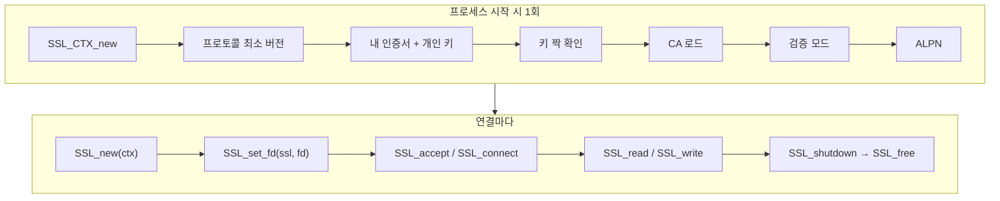
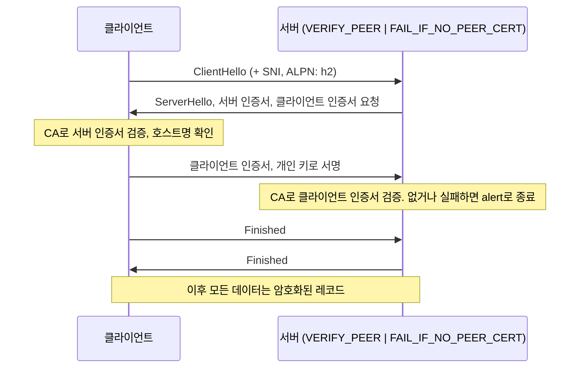
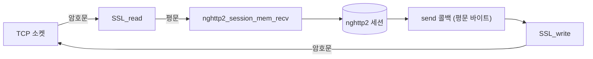

# OpenSSL로 mTLS 컨텍스트 만들기 — 인증서·CA·검증·ALPN·논블로킹

> [!NOTE]
> C 서버/클라이언트에서 OpenSSL로 **상호 TLS(mTLS)** 를 쓰려면 어떤 함수를 어떤 순서로 부르는지, 각 호출이 **왜 필요한지** 정리한다. 설정 파일에 "CA 디렉터리, 인증서 파일, 개인 키 파일" 같은 항목이 있는 이유가 곧 이 함수들의 인자다.
> 검증 표기: ✔ OpenSSL man 페이지(Debian `libssl-doc` bookworm = OpenSSL 3.0)에서 확인, △ 기억/일반 지식
> 3.0 문서를 기준으로 확인했다. `SSL_CTX_load_verify_locations`, `SSL_CTX_use_*`, `SSL_CTX_set_verify`, `SSL_get_error` 등 아래 핵심 함수는 1.1.1에도 있다 △. **1.1.0 이전(1.0.x)** 은 `TLS_server_method()` 같은 이름이 없고(`SSLv23_server_method()`) 초기화 호출도 다르다 △.

## 0. 먼저 잡아야 할 그림

TLS는 두 단계다.

| 단계 | 하는 일 | 관련 설정 |
| --- | --- | --- |
| **핸드셰이크** | 상대가 **누구인지 확인**(인증서 검증)하고 **세션 키를 합의** | 인증서, 개인 키, CA, 검증 모드, 프로토콜 버전, ALPN |
| **레코드 전송** | 합의한 키로 **데이터를 암호화**해서 주고받음 | `SSL_read`, `SSL_write` |

OpenSSL에는 두 가지 객체가 있다 △.

| 객체 | 역할 | 수명 |
| --- | --- | --- |
| **`SSL_CTX`** | **설정 템플릿.** 인증서, 키, CA, 검증 모드, ALPN 등을 한 번 세팅 | 프로세스에 하나(또는 몇 개). 여러 연결이 **공유** |
| **`SSL`** | **연결 하나.** 소켓과 묶이고 핸드셰이크 상태를 가짐 | 연결마다 `SSL_new(ctx)`로 만들고 `SSL_free` |

→ 설정 파일을 읽어 **`SSL_CTX`를 만드는 단계(시작 시 1회)** 와 **연결마다 `SSL`을 쓰는 단계**가 분리된다. 인증서·키 경로가 잘못되면 **기동 시점에** 컨텍스트 생성이 실패한다.



## 1. 컨텍스트 만들기 — 서버

```c
SSL_CTX *ctx = SSL_CTX_new(TLS_server_method());        /* 1.1.0+. 최신 TLS를 자동 선택 */
SSL_CTX_set_min_proto_version(ctx, TLS1_2_VERSION);     /* TLS 1.2 미만 거부 */

/* 내 신원: 인증서와 개인 키 */
if (SSL_CTX_use_certificate_chain_file(ctx, "server.crt") != 1) goto fail;
if (SSL_CTX_use_PrivateKey_file(ctx, "server.key", SSL_FILETYPE_PEM) != 1) goto fail;
if (SSL_CTX_check_private_key(ctx) != 1) goto fail;     /* 인증서와 키가 짝인가 */

/* 상대(클라이언트) 인증서를 검증하기 위한 CA */
if (SSL_CTX_load_verify_locations(ctx, "ca.crt", NULL) != 1) goto fail;
/* 또는 디렉터리: SSL_CTX_load_verify_locations(ctx, NULL, "/path/CA_DIR") */

/* mTLS: 클라이언트 인증서를 요구하고, 없으면 거부 */
SSL_CTX_set_verify(ctx, SSL_VERIFY_PEER | SSL_VERIFY_FAIL_IF_NO_PEER_CERT, NULL);

/* HTTP/2를 쓰려면 ALPN에서 h2를 고르도록 */
SSL_CTX_set_alpn_select_cb(ctx, alpn_select_cb, NULL);
```

### 1-1. 호출별로 "왜 필요한가"

| 호출 | 하는 일 | 왜 필요한가 | 검증 |
| --- | --- | --- | --- |
| `SSL_CTX_set_min_proto_version(ctx, TLS1_2_VERSION)` | 협상 가능한 **최소 TLS 버전** 지정. `0`이면 라이브러리가 지원하는 가장 낮은 버전까지 허용 | **옛 버전(취약한 SSL/TLS 1.0/1.1)으로 낮춰 협상하는 공격**을 막는다. 상수 `TLS1_2_VERSION`, `TLS1_3_VERSION` 사용 | ✔ |
| `SSL_CTX_use_certificate_chain_file` | PEM 파일에서 **인증서 체인** 로드. **서버(내) 인증서 → 중간 CA → 루트 CA 순서**로 정렬되어 있어야 한다 | 상대가 내 인증서를 검증하려면 **중간 CA까지 같이 보내야** 할 때가 많다. 단일 인증서만 있으면 `SSL_CTX_use_certificate_file`도 된다 | ✔ |
| `SSL_CTX_use_certificate_file` | 파일의 **첫 번째 인증서** 하나만 로드. 형식은 `SSL_FILETYPE_PEM` 또는 `SSL_FILETYPE_ASN1` | 체인이 필요 없을 때 | ✔ |
| `SSL_CTX_use_PrivateKey_file` | 파일의 **첫 번째 개인 키**를 로드 | 핸드셰이크 중 **내가 이 인증서의 주인임을 서명으로 증명**하는 데 쓴다 | ✔ |
| `SSL_CTX_check_private_key` | **개인 키가 로드된 인증서와 짝인지** 일관성 검사 | 인증서와 키가 안 맞는 걸 **기동 시점에** 잡는다. 안 하면 **첫 핸드셰이크에서** 실패한다 | ✔ |
| `SSL_CTX_load_verify_locations(ctx, CAfile, CApath)` | **신뢰할 CA** 지정 | 상대 인증서가 **누가 발급했는지**를 믿으려면 CA 목록이 필요하다 | ✔ |
| `SSL_CTX_set_verify(ctx, mode, cb)` | **상대 인증서를 요구/검증하는 정책** 지정 | mTLS의 핵심. 아래 §3 | ✔ |
| `SSL_CTX_set_alpn_select_cb` | **서버 쪽 ALPN 선택 콜백** 등록 | 클라이언트가 제시한 프로토콜 중 `h2`를 고르려고. 아래 §6 | ✔ |

> [!WARNING] 호출 순서 규칙 ✔
> 인증서와 개인 키를 **바꿀 때는 인증서를 먼저** 설정하고 그 다음에 개인 키를 설정한다("the new certificate needs to be set first ... before setting the private key"). 처음 세팅할 때도 **인증서 → 키 → `check_private_key`** 순서로 쓰면 안전하다.

> [!NOTE] 반환값 규칙 ✔
> `SSL_CTX_use_*`와 `SSL_CTX_load_verify_locations`는 **성공 시 `1`, 실패 시 `0`** 을 돌려준다. 실패 원인은 **OpenSSL 오류 큐**(`ERR_get_error`, `ERR_print_errors_fp`)에서 읽어야 한다("check out the error stack to find out the reason"). 경로 오류, 형식 오류, 권한 오류가 모두 같은 `0`이므로 **오류 큐를 출력하지 않으면 원인을 알 수 없다.**

## 2. 컨텍스트 만들기 — 클라이언트

```c
SSL_CTX *ctx = SSL_CTX_new(TLS_client_method());
SSL_CTX_set_min_proto_version(ctx, TLS1_2_VERSION);

/* 서버 인증서를 검증하기 위한 CA */
if (SSL_CTX_load_verify_locations(ctx, "ca.crt", NULL) != 1) goto fail;

/* mTLS: 서버가 요구하면 내 인증서를 낸다 */
SSL_CTX_use_certificate_chain_file(ctx, "client.crt");
SSL_CTX_use_PrivateKey_file(ctx, "client.key", SSL_FILETYPE_PEM);
SSL_CTX_check_private_key(ctx);

SSL_CTX_set_verify(ctx, SSL_VERIFY_PEER, NULL);          /* 서버 인증서를 검증한다 */

/* h2를 광고 (길이 접두 형식). ⚠️ 성공이 0 */
if (SSL_CTX_set_alpn_protos(ctx, (const unsigned char *)"\x02h2", 3) != 0) goto fail;
```

연결마다:

```c
SSL *ssl = SSL_new(ctx);
SSL_set_fd(ssl, fd);                       /* 이미 연결된 TCP 소켓에 붙인다 */
SSL_set_tlsext_host_name(ssl, "example.com");          /* SNI */
SSL_set1_host(ssl, "example.com");                      /* 호스트명 검증 */
/* 이후 SSL_connect(ssl) */
```

### 2-1. 클라이언트에만 해당하는 점

| 항목 | 설명 | 검증 |
| --- | --- | --- |
| **SNI** `SSL_set_tlsext_host_name` | ClientHello에 **내가 접속하려는 호스트명**을 실어 보낸다. 한 IP에서 **여러 호스트의 인증서를 가진 서버**가 알맞은 인증서를 고르게 한다 | ✔ |
| **호스트명 검증** | CA가 서명했다는 것만으로는 **"이 서버가 내가 접속하려던 그 서버"** 인지 모른다. 인증서의 **이름(SAN, 없으면 CN)** 이 접속 대상 호스트명과 맞는지도 확인해야 한다. 예: `X509_VERIFY_PARAM_set1_host`로 **기대하는 DNS 이름을 지정하면** 인증서 검증이 `X509_check_host`를 부른다. IP로 접속하면 `X509_VERIFY_PARAM_set1_ip_asc`. | ✔ |
| ⚠️ 호스트명을 **지정하지 않으면** | 검증되는 것은 "신뢰하는 CA가 발급했는가"뿐이다. **아무 서버의 유효한 인증서든 통과**할 수 있다 | △ (위 함수가 "지정할 때" 호출된다는 설명에서 도출) |

## 3. 검증 모드 — mTLS는 어떻게 켜는가 ✔

`SSL_CTX_set_verify(ctx, mode, verify_callback)`, 깊이 제한은 `SSL_CTX_set_verify_depth(ctx, depth)`.

| 모드 | **서버**일 때 | **클라이언트**일 때 |
| --- | --- | --- |
| `SSL_VERIFY_NONE` | 서버가 **클라이언트 인증서를 요청하지 않는다** | 서버 인증서를 확인은 하지만 **결과와 상관없이 핸드셰이크를 계속**한다 |
| `SSL_VERIFY_PEER` | **클라이언트 인증서를 요청**한다. 검증이 실패하면 **즉시 알림(alert)으로 핸드셰이크 종료** | **서버 인증서를 검증**하고 실패하면 **즉시 종료** |
| `SSL_VERIFY_FAIL_IF_NO_PEER_CERT` | 클라이언트가 **인증서를 안 보내면 즉시 종료.** 반드시 `SSL_VERIFY_PEER`와 함께 | **무시된다** |
| `SSL_VERIFY_CLIENT_ONCE` | 연결 중 **클라이언트 인증서를 한 번만** 요청. `SSL_VERIFY_PEER`와 함께 | **무시된다** |

- **서버에서 `SSL_VERIFY_PEER | SSL_VERIFY_FAIL_IF_NO_PEER_CERT`** = 클라이언트 인증서를 **반드시 요구**한다 → **mTLS**.
- **서버에서 `SSL_VERIFY_PEER`만** = 클라이언트가 인증서를 **내면 검증**하지만, **안 내도 통과**한다(선택적 클라이언트 인증).
- **클라이언트에서 `SSL_VERIFY_NONE`은 위험하다.** 인증서가 가짜여도 연결이 진행된다. 테스트용 자체 서명 인증서를 쓸 때 편의로 켜는 경우가 많은데 **운영에서는 금지**다.



## 4. CA 지정 방식 — `CAfile` vs `CApath` ✔

`SSL_CTX_load_verify_locations(ctx, CAfile, CApath)`:

| 인자 | 가리키는 것 | 특징 |
| --- | --- | --- |
| **`CAfile`** | **PEM 파일 하나**. 안에 CA 인증서 여러 개를 `BEGIN/END CERTIFICATE`로 이어 붙일 수 있다 | 관리가 단순. CA를 추가하면 **파일을 고친다** |
| **`CApath`** | **디렉터리.** 파일 **하나에 CA 인증서 하나**이고, 파일 이름이 **CA 주체 이름의 해시값**이다 | 파일을 하나 합치지 않아도 된다. 대신 **해시 이름 링크**가 필요하다 |

- **`CApath`의 파일 이름 규칙:** 해시값 뒤에 확장자가 붙고, 같은 해시의 CA가 둘 이상이면 확장자로 구분한다(예: `9d66eef0.0`, `9d66eef0.1`). **"c_rehash utility로 필요한 링크를 만든다."** ✔
- 그래서 **CA를 디렉터리에 파일만 복사하면 안 되고 해시 링크를 만들어야 한다.** 안 만들면 OpenSSL이 그 CA를 못 찾아 "unable to get local issuer certificate" 같은 오류가 난다 △(오류 문구는 기억).
- **검색 순서:** 체인을 만들 때 **먼저 `CAfile`, 그다음 `CApath`** 를 찾는다. ✔
- **반환값:** 성공 `1`, 실패 `0`(`CAfile`과 `CApath`가 모두 NULL이거나 한쪽 처리가 실패). ✔
- 새 OpenSSL(3.0)에는 `SSL_CTX_load_verify_file`, `SSL_CTX_load_verify_dir`, `SSL_CTX_load_verify_store`가 **따로** 있다 ✔(3.0 문서에서 확인). 1.1.1에서는 `load_verify_locations`를 쓴다 △.

```bash
# CApath 디렉터리를 준비하는 방법 △
openssl x509 -hash -noout -in ca.crt          # 이 CA의 해시값 출력
ln -s ca.crt <해시값>.0                        # 해시 이름으로 링크
# 또는 한꺼번에: c_rehash /path/CA_DIR   (1.1.0+ 에서는 openssl rehash /path/CA_DIR)
```

## 5. 연결 하나 다루기

### 5-1. 소켓과 묶기 ✔

`SSL_set_fd(ssl, fd)`는 fd를 TLS 쪽 입출력으로 지정하고 내부에 **socket BIO**를 만든다.

> "The BIO and hence the SSL engine inherit the behaviour of fd. If fd is nonblocking, the ssl will also have nonblocking behaviour."

- **논블로킹으로 쓰려면 fd를 직접 논블로킹으로 바꿔야 한다**(`fcntl O_NONBLOCK`). `SSL_set_fd`가 해 주지 않는다. ✔

### 5-2. 핸드셰이크 — 논블로킹에서는 **여러 번 호출**한다 ✔

- 서버는 `SSL_accept`, 클라이언트는 `SSL_connect`.
- 논블로킹 BIO에서는 핸드셰이크를 한 번에 못 끝내고 **`-1`을 돌려주며** `SSL_get_error`가 `SSL_ERROR_WANT_READ` 또는 `SSL_ERROR_WANT_WRITE`를 알려준다. **조건이 충족된 뒤 같은 함수를 다시 호출**해야 한다. ✔

```c
int r = SSL_accept(ssl);                 /* 클라이언트면 SSL_connect */
if (r == 1) { /* 핸드셰이크 완료 */ }
else {
    switch (SSL_get_error(ssl, r)) {
    case SSL_ERROR_WANT_READ:  /* epoll에서 EPOLLIN 대기 후 SSL_accept 재호출 */ break;
    case SSL_ERROR_WANT_WRITE: /* epoll에서 EPOLLOUT 대기 후 SSL_accept 재호출 */ break;
    default:                   /* 치명적 오류: 연결을 닫는다 */ break;
    }
}
```

### 5-3. `SSL_get_error` 값 정리 ✔

| 값 | 의미 | 해야 할 일 |
| --- | --- | --- |
| `SSL_ERROR_WANT_READ` | "not enough data was available at this time" — **데이터가 아직 부족** | 소켓이 **읽기 가능**해지면 **같은 함수를 다시 호출** |
| `SSL_ERROR_WANT_WRITE` | BIO가 **데이터를 다 못 보냄** | 소켓이 **쓰기 가능**해지면 같은 함수를 다시 호출 |
| `SSL_ERROR_ZERO_RETURN` | 상대가 **close_notify를 보내 쓰기를 닫음**(정상 종료) | 이쪽도 종료 절차로 |
| `SSL_ERROR_SYSCALL` | **복구 불가능한 I/O 오류.** 오류 큐에 정보가 있을 수 있다 | 연결을 닫는다. **`SSL_shutdown` 호출 금지** |
| `SSL_ERROR_SSL` | **TLS 라이브러리 내부의 복구 불가능한 오류**(대개 프로토콜 오류) | 연결을 닫는다. **`SSL_shutdown` 호출 금지** |

- "There is no fixed upper limit for the number of iterations" — `WANT_READ`/`WANT_WRITE`로 재시도하는 횟수에는 **상한이 없다.** 한 번에 끝난다고 가정하면 안 된다. ✔

### 5-4. 읽고 쓰기 — 이 두 규칙이 가장 많이 실수한다 ✔

| 규칙 | 내용 |
| --- | --- |
| **읽기가 쓰기를 일으킬 수 있다** | "a read function can also cause write operations" (핸드셰이크, 재협상 중). 그래서 **`SSL_read`가 `SSL_ERROR_WANT_WRITE`를 돌려줄 수 있다** → 읽기 호출인데 **쓰기 가능 이벤트를 기다려야** 한다 |
| **쓰기가 읽기를 기다릴 수 있다** | 반대로 `SSL_write`가 `WANT_READ`를 돌려줄 수 있다 |
| **재시도는 같은 인자로** | "When a write function call has to be repeated ... it must be repeated with the same arguments." 버퍼 포인터와 길이를 바꾸면 안 된다 |
| `SSL_MODE_ACCEPT_MOVING_WRITE_BUFFER` | 켜면 **포인터는 달라도 되지만** 데이터와 길이는 같아야 한다 |
| `SSL_MODE_ENABLE_PARTIAL_WRITE` | 켜면 **일부만 쓴 상태에서도 성공**으로 돌려준다. 부분 쓰기는 **메시지 블록 크기인 16kB** 단위 |
| **`SSL_read`는 레코드 단위** | "At most the contents of one record will be returned." 한 번에 **최대 레코드 하나**의 내용만 읽힌다. 레코드가 더 있으면 `SSL_pending()`으로 **버퍼에 남은 바이트**를 확인하고 계속 읽어야 한다 |

> [!WARNING] `epoll`을 쓰는 서버에서 가장 흔한 버그
> 소켓에서 `EPOLLIN`이 올 때만 `SSL_read`를 부르면 **TLS 레코드가 이미 OpenSSL 내부 버퍼에 들어와 있고 소켓은 비어 있는** 경우 데이터를 영영 못 읽는다. `SSL_read` 한 번에 레코드 하나만 읽히므로 **`SSL_pending() > 0`인 동안 계속 읽어야** 한다. 엣지 트리거(`EPOLLET`)에서는 특히 치명적이다. △(일반 지식, `SSL_read`/`SSL_pending` 설명에서 도출)

### 5-5. 종료 ✔

- `SSL_shutdown`은 **close_notify 알림을 보내고** 상대의 close_notify를 받는 **2단계** 절차다.
- 반환값: **`0`** = 내 alert는 보냈지만 상대 응답은 아직, **`1`** = 양쪽 교환 완료.
- 논블로킹이면 **중간에 돌아오므로** `SSL_get_error` 후 조건이 되면 다시 호출한다.
- **치명적 오류(`SSL_ERROR_SYSCALL`, `SSL_ERROR_SSL`) 뒤에는 `SSL_shutdown`을 호출하면 안 된다.** ✔
- 이후 `SSL_free(ssl)`로 해제하고 소켓을 `close`한다.

## 6. ALPN — TLS 안에서 "무슨 프로토콜로 말할지" 정하기 ✔

HTTP/2는 TLS 핸드셰이크 중 **ALPN**으로 `h2`를 협상한다.

| 쪽 | 함수 | 설명 |
| --- | --- | --- |
| 클라이언트 | `SSL_CTX_set_alpn_protos` / `SSL_set_alpn_protos` | **내가 지원하는 프로토콜 목록**을 제시. 형식은 "a vector of nonempty, 8-bit length-prefixed, byte strings" — 예: `"\x02h2"` (길이 2, `h2`) |
| 서버 | `SSL_CTX_set_alpn_select_cb` | 클라이언트가 제시한 목록을 받아 **하나를 고르는 콜백** 등록 |
| 서버 보조 | `SSL_select_next_proto` | 서버 선호 목록과 클라이언트 목록에서 **겹치는 것을 고르는 표준 구현.** 성공이면 `OPENSSL_NPN_NEGOTIATED`, 겹치는 게 없으면 `OPENSSL_NPN_NO_OVERLAP` |
| 양쪽 | `SSL_get0_alpn_selected` | 핸드셰이크 뒤 **합의된 프로토콜.** **NUL로 끝나지 않는다.** 선택이 없으면 `data=NULL, len=0` |

```c
static int alpn_select_cb(SSL *ssl, const unsigned char **out, unsigned char *outlen,
                          const unsigned char *in, unsigned int inlen, void *arg) {
    static const unsigned char server_protos[] = "\x02h2";      /* 길이 접두 목록 */
    if (SSL_select_next_proto((unsigned char **)out, outlen,
                              server_protos, sizeof(server_protos) - 1,
                              in, inlen) != OPENSSL_NPN_NEGOTIATED)
        return SSL_TLSEXT_ERR_NOACK;       /* 겹치는 게 없음 */
    return SSL_TLSEXT_ERR_OK;
}
```

> [!WARNING] 반환값이 반대다 ✔
> `SSL_CTX_set_alpn_protos`/`SSL_set_alpn_protos`는 **성공 시 `0`, 실패 시 0이 아닌 값**을 돌려준다. 문서가 "WARNING: these functions reverse the return value convention"이라고 경고한다. 다른 OpenSSL 함수처럼 `!= 1`로 검사하면 **성공했는데 실패로 처리**한다.

- 콜백 반환값은 `SSL_TLSEXT_ERR_OK`(선택함), `SSL_TLSEXT_ERR_NOACK`(선택 없이 계속), `SSL_TLSEXT_ERR_ALERT_FATAL`(치명적 알림으로 종료) 세 가지다. ✔
- **핸드셰이크가 끝난 뒤 반드시 `SSL_get0_alpn_selected`로 결과를 확인**한다. `h2`가 선택되지 않았는데 HTTP/2 프레임을 보내면 연결이 깨진다. ✔(nghttp2 튜토리얼이 같은 확인 코드를 둔다)

## 7. TLS 레코드와 HTTP/2 프레임 크기

- TLS는 데이터를 **레코드**로 나눠 암호화한다. 한 레코드의 평문은 **최대 16kB**다(`SSL_write` 부분 쓰기 단위가 16kB인 이유 ✔).
- HTTP/2 프레임이 **16,384바이트(기본 `MAX_FRAME_SIZE`)** 보다 크면 **여러 TLS 레코드로 쪼개져** 암호화된다. 그래서 TLS 환경에서는 프레임을 키워도 얻는 이득이 줄어든다. → [HTTP/2 개념 §4](개발%20%28CS%29/네트워크/[HTTP]%20HTTP2%20핵심%20개념%20—%20프레임·스트림·HPACK·흐름%20제어·SETTINGS.md) △

## 8. nghttp2와 결합하기 — TLS는 "바이트 변환 계층"

TLS와 HTTP/2 라이브러리의 **경계는 평문 바이트**다.



| 방향 | 처리 |
| --- | --- |
| **받을 때** | 소켓이 읽기 가능 → `SSL_read`로 **복호화** → 얻은 평문을 `nghttp2_session_mem_recv`에 넣는다 |
| **보낼 때** | nghttp2의 `send` 콜백이 **평문 바이트**를 받는다 → `SSL_write`로 **암호화**해 전송 |

여기서 §5-4의 규칙이 nghttp2와 만난다 △ (두 문서의 규칙에서 도출한 설계 귀결):

- `SSL_write`는 **`WANT_WRITE`/`WANT_READ` 때 같은 인자로 재시도**해야 한다. 그러므로 nghttp2의 send 콜백은 **`SSL_write`가 끝내 못 보낸 데이터를 자기 버퍼에 남겨 두고 같은 포인터·길이로 재시도**하거나, 아예 `NGHTTP2_ERR_WOULDBLOCK`을 돌려 nghttp2가 나중에 다시 부르게 해야 한다.
- 한 번의 `SSL_read`가 레코드 하나만 돌려주므로 `SSL_pending()`을 확인해 **반복해서 읽고** 그때마다 `mem_recv`를 호출한다.
- 핸드셰이크가 **끝나기 전에는 `mem_recv`/`submit_*`를 부르지 않는다.** 핸드셰이크 완료와 ALPN 확인(§6)이 끝나야 HTTP/2가 시작된다.
- 연결 상태 머신: `TCP 연결됨 → TLS 핸드셰이크 중 → ALPN 확인 → HTTP/2 활성 → 종료 중`.

→ nghttp2 쪽은 [nghttp2 API 모델](개발%20%28CS%29/네트워크/[HTTP]%20nghttp2%20API%20모델%20—%20세션·콜백·입출력%20루프.md).

## 9. 인증서가 말을 안 들을 때 — 점검 순서

```bash
# 1) 파일이 있고 읽을 수 있는가 (권한, 경로)
ls -l server.crt server.key

# 2) 인증서와 개인 키가 짝인가 — modulus(RSA) 해시가 같아야 한다
openssl x509 -noout -modulus -in server.crt | openssl md5
openssl rsa  -noout -modulus -in server.key | openssl md5

# 3) CA가 이 인증서를 발급했는가
openssl verify -CAfile ca.crt server.crt
openssl verify -CApath /path/CA_DIR server.crt     # 디렉터리 방식이면 해시 링크가 필요

# 4) 유효 기간
openssl x509 -noout -dates -in server.crt

# 5) 이름(SAN/CN) — 호스트명 검증이 이것과 맞아야 한다
openssl x509 -noout -subject -ext subjectAltName -in server.crt
```

△ (명령 형식은 OpenSSL CLI 일반 지식. `-ext`는 1.1.1+)

| 증상 | 의심 원인 |
| --- | --- |
| `SSL_CTX_use_PrivateKey_file`이 `0` | 경로 오류, **암호화된 키(패스프레이즈 필요)**, PEM이 아님, 권한 |
| `SSL_CTX_check_private_key`가 `0` | **인증서와 키가 짝이 아님**(키를 교체하면서 인증서를 안 바꿈) |
| 서버 기동은 되는데 **모든 접속이 실패** | 클라이언트 CA를 못 찾음(**CApath 해시 링크 누락**), 중간 CA가 체인에 없음 |
| 클라이언트 쪽에서만 실패 | 서버 인증서 이름과 접속 호스트명 불일치, 만료 |
| mTLS에서 서버가 클라이언트를 거부 | 클라이언트 인증서를 안 보냄(`FAIL_IF_NO_PEER_CERT`), 클라이언트 인증서가 서버가 믿는 CA 발급이 아님 |
| `SSL_CTX_set_alpn_protos`가 0인데 실패로 처리됨 | **성공이 0**임을 놓침 |
| 핸드셰이크는 되는데 HTTP/2가 안 됨 | ALPN에서 `h2`가 선택되지 않음 |
| 테스트 환경에서 서버·클라이언트가 **같은 인증서·키 한 쌍**을 공유 | 동작은 하지만 **서로를 구별할 수 없다.** 운영에서는 각자 발급해야 한다 |

## 10. 흔한 실수 요약

| 실수 | 결과 |
| --- | --- |
| 오류 큐를 출력하지 않음 | 실패 원인을 알 수 없다(`0` 하나만 돌아옴) ✔ |
| `WANT_READ`/`WANT_WRITE`를 오류로 처리하고 연결을 닫음 | 정상 연결이 끊긴다. **재시도 신호**다 ✔ |
| `SSL_read`가 `WANT_WRITE`를 줄 수 있음을 모름 | 이벤트 루프가 멈춘다 ✔ |
| 재시도 시 버퍼/길이를 바꿈 | 규격 위반 ✔ |
| 치명적 오류 뒤 `SSL_shutdown` | 정의되지 않은 동작 ✔ |
| 클라이언트 `SSL_VERIFY_NONE` | 중간자 공격에 무방비 ✔ |
| 호스트명 검증 누락 | 아무 유효한 인증서나 통과 △ |
| 인증서 만료 알림이 없음 | 어느 날 모든 연결이 한꺼번에 실패 △ |
| `SSL_CTX`를 연결마다 새로 만듦 | 매번 인증서·CA를 다시 읽어 느리고 메모리 낭비. **컨텍스트는 한 번 만들어 공유** △ |

## 11. 검증 상태 요약

| 항목 | 상태 | 근거 |
| --- | --- | --- |
| `SSL_CTX_load_verify_locations`의 CAfile/CApath, 해시 파일 이름, 검색 순서, 반환값 | ✔ | OpenSSL 3.0 man (`libssl-doc`) |
| `SSL_CTX_use_certificate_*`, `use_PrivateKey_file`, `check_private_key`, 호출 순서 | ✔ | 같음 |
| `SSL_CTX_set_verify`의 4개 모드(서버/클라이언트) | ✔ | 같음 |
| `SSL_get_error` 5개 값과 재시도 원칙 | ✔ | 같음 |
| `SSL_read`/`SSL_write`의 논블로킹 규칙, 16kB, 레코드 단위 | ✔ | 같음 |
| `SSL_accept`, `SSL_shutdown`, `SSL_set_fd` | ✔ | 같음 |
| ALPN 함수와 반환값 규칙 | ✔ | 같음 |
| SNI, 호스트명 검증 함수 | ✔ | 같음 |
| `set_min_proto_version`, `TLS1_2_VERSION`/`TLS1_3_VERSION` | ✔ | 같음 |
| `TLS_server_method()`/`TLS_client_method()`의 1.1.0 도입, 1.0.x 차이, `openssl rehash` | △ | 기억 기준 |
| `SSL_read` + `epoll` 상호작용 주의, 컨텍스트 공유 권장 | △ | 문서 내용에서 도출한 일반 설계 |
| 점검용 CLI 명령 | △ | 일반 지식 |

## 관련 문서

- [인증·인가 방식 비교 — API Key·OAuth2·JWT·HMAC·mTLS](개발%20%28CS%29/보안/[보안]%20인증·인가%20방식%20비교%20-%20API%20Key·OAuth2·JWT·HMAC·mTLS.md) — mTLS의 위치
- [nghttp2 API 모델](개발%20%28CS%29/네트워크/[HTTP]%20nghttp2%20API%20모델%20—%20세션·콜백·입출력%20루프.md) — TLS 위에서 HTTP/2를 올리는 라이브러리
- [HTTP/2 핵심 개념](개발%20%28CS%29/네트워크/[HTTP]%20HTTP2%20핵심%20개념%20—%20프레임·스트림·HPACK·흐름%20제어·SETTINGS.md)
- [epoll — fd가 많아질 때의 대안](개발%20%28CS%29/언어/C언어/네트워크·시스템%20IO/[C]%20epoll%20—%20fd가%20많아질%20때의%20대안.md)
- 참고: OpenSSL man 페이지 `SSL_CTX_load_verify_locations(3)`, `SSL_CTX_use_certificate(3)`, `SSL_CTX_set_verify(3)`, `SSL_get_error(3)`, `SSL_read(3)`, `SSL_write(3)`, `SSL_CTX_set_alpn_select_cb(3)`, `SSL_shutdown(3)`
