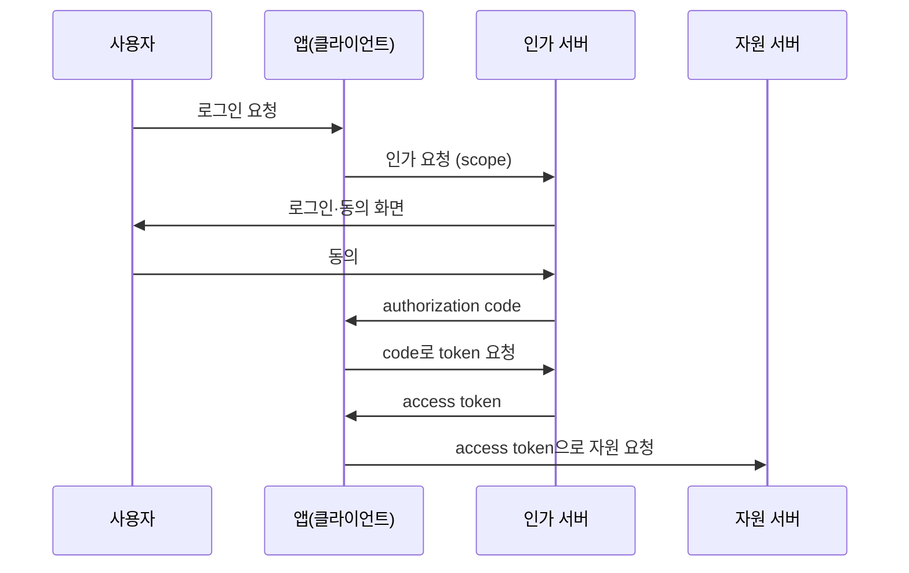

# 인증·인가 방식 비교 (API Key·OAuth2·JWT·HMAC·mTLS)

> 서버 간, 사용자 간 통신에서 "누구인가"를 확인하는 대표 방식들의 차이와 쓰임을 정리한다. 용어 정의는 [IT 용어집 - 보안·인증](IT%20용어집/[용어]%20보안·인증.md) 참고.

## 1. 먼저 용어 구분

| 용어 | 질문 | 예 |
| --- | --- | --- |
| 인증(authentication) | 너는 **누구**인가? | 로그인, 인증서 검증 |
| 인가(authorization) | 그 사람이 **이것을 해도 되는가**? | 관리자만 접근, 경로별 허용 |
| 암호화(encryption) | 내용을 숨긴다(키가 있으면 복호화 가능) | TLS, AES |
| 해싱(hashing) | 되돌릴 수 없는 고정 길이 값으로 바꾼다 | 비밀번호 저장 |
| 서명(signature) | 누가 보냈고 바뀌지 않았음을 증명한다 | JWT 서명, HMAC |

비밀번호는 암호화가 아니라 **해싱**해서 저장한다.

## 2. 방식 한눈에 비교

| 방식 | 핵심 | 주 용도 | 약점 |
| --- | --- | --- | --- |
| API key | 미리 발급한 고정 키를 헤더에 넣음 | 간단한 서버 간 인증 | 키가 요청에 실려 가서 **탈취되면 끝** |
| OAuth2 | 비밀번호를 넘기지 않고 권한을 위임받아 access token 발급 | 제3자 앱 연동("○○로 로그인") | 흐름이 복잡, 토큰 관리 필요 |
| JWT | 서명된 자가 포함(self-contained) 토큰. 서버가 DB 조회 없이 검증 | 사용자 세션, 서비스 간 사용자 정보 전달 | 발급 후 **폐기하기 어려움**, 내용은 암호화가 아님 |
| HMAC signature | 공유 비밀키 + 메시지로 서명 | 웹훅, 요청 위변조 방지 | 비밀키를 양쪽이 공유해야 함 |
| mTLS | 서버뿐 아니라 **클라이언트도 인증서**로 신원 증명 | 서비스 간 통신, 금융 대외 연동 | 인증서 발급·갱신 운영 부담 |

## 3. API key

```
GET /orders
X-API-Key: sk_live_abc123
```

- 가장 단순하다. 서버는 키 목록과 비교만 한다.
- 키 자체가 네트워크로 전달되므로 **TLS 필수**이고, 노출되면 다른 사람이 그대로 쓸 수 있다.
- 키에 만료와 권한 범위를 두지 않으면 폐기·교체가 어렵다.

## 4. OAuth2 (권한 위임)

"사용자가 앱 A에게, 서비스 B의 자원에 대한 **제한된 권한**을 위임"하는 표준이다. 비밀번호를 앱 A에 주지 않고 **access token**만 준다.



- 소셜 로그인의 전체 흐름은 [소셜로그인 전 과정](프레임워크/Spring%20Framework/실습%20%28스프링%20MVC%29/소셜로그인%20전%20과정/[Spring]%20소셜로그인%20전%20과정%20-%20핵심%20개념%20및%20특징%20정리.md) 참고.
- access token은 수명이 짧고, 갱신은 refresh token으로 한다.

## 5. JWT (JSON Web Token)

```
헤더.페이로드.서명
```

- 페이로드에 사용자 ID, 권한, 만료 시각(`exp`)을 담고 **서버의 서명 키로 서명**한다.
- 서버는 **DB 조회 없이** 서명만 검증하면 되어서 확장에 유리하다(stateless).
- 서명은 위변조를 막을 뿐 **내용을 숨기지 않는다**(페이로드는 누구나 디코딩해 볼 수 있다). 민감 정보를 넣지 않는다.
- 한 번 발급하면 만료 전까지 유효해서 **즉시 폐기가 어렵다**. 수명을 짧게 하고 refresh token을 쓰거나, 폐기 목록을 별도로 관리한다.
- 서명 방식: HS256(대칭키, 비밀키 공유) / RS256(비대칭키, 개인키로 서명하고 공개키로 검증).

## 6. HMAC (Hash-based Message Authentication Code)

"공유된 **비밀키 + 메시지**"를 해시해서 서명을 만든다.

```
보내는 쪽: signature = HMAC-SHA256(secret, 요청 본문 + timestamp)
           → 요청 헤더에 X-Signature: signature
받는 쪽:   같은 secret으로 직접 계산 → 헤더 값과 비교
```

- 보장하는 것: ① 메시지가 중간에 **바뀌지 않았다**(무결성) ② **secret을 아는 상대가 보냈다**(인증)
- 보장하지 않는 것: **암호화가 아니다.** 본문은 그대로 보인다.
- API key와 달리 **secret이 네트워크에 실리지 않고 서명만 실린다.** 서명에 timestamp(또는 nonce)를 넣으면 **재전송 공격(replay)**도 막는다.
- 실제 예: GitHub·Stripe 웹훅 서명, AWS API 요청 서명(SigV4)

## 7. 공개키 / 개인키와 인증서

| | 대칭키 | 비대칭키(공개키 암호) |
| --- | --- | --- |
| 키 | 하나를 양쪽이 공유 | 한 쌍(공개키, 개인키) |
| 속도 | 빠름 | 느림 |
| 문제 | 키를 안전하게 전달해야 함 | 해결 가능 |

TLS는 비대칭키로 **키 교환·인증**을 하고, 실제 데이터는 **대칭키**로 암호화한다.

공개키와 개인키는 쓰임에 따라 **방향이 반대**다.

| 목적 | 만드는 쪽 | 확인하는 쪽 |
| --- | --- | --- |
| 암호화(기밀성) | 상대의 **공개키**로 암호화 | 상대가 자기 **개인키**로 복호화 |
| 전자서명(인증, 무결성) | 자기 **개인키**로 서명 | 누구나 **공개키**로 검증 |

- 개인키가 유출되면 신뢰가 무너지고, 공개키는 유출돼도 문제가 없다.
- **인증서(certificate)**는 공개키와 소유자 정보를 묶어 인증기관(CA)이 서명한 문서다. "이 공개키는 정말 이 도메인의 것이다"를 보증한다.
- 파일 무결성을 RSA 서명으로 검증하는 사례는 [파일 무결성 전자서명 검증](개발%20실무/네트워크·보안/[보안]%20파일%20무결성%20전자서명%20검증%20-%20RSA%20개인키%20서명과%20공개키%20검증%28사이드카%20방식%29%20정리.md) 참고.

## 8. mTLS (mutual TLS)

일반 TLS는 **서버만** 인증서로 신원을 증명한다. mTLS는 **클라이언트도 인증서를 제시**해서 양쪽이 서로를 확인한다.

- 서비스 간 통신, 금융 대외 연동처럼 **호출자도 확인해야 하는** 곳에 쓴다.
- service mesh를 쓰면 사이드카가 mTLS를 대신 처리해 줄 수 있다.
- Netty에서의 구성은 [Netty 소켓 파이프라인 SSL-TLS 적용과 mTLS 상호 인증](프레임워크/Netty/[Java]%2004.%20Netty%20소켓%20파이프라인%20SSL-TLS%20적용과%20mTLS%20상호%20인증%20%28SslHandler,%20KeyStore,%20SslContext%29.md) 참고.

## 9. 키 관리: key rotation

암호화 키를 주기적으로 새 버전으로 바꾸는 것이다. 어려운 이유는 **v1로 암호화된 기존 데이터는 v1 키로만 풀리기** 때문이다.

| 구성 요소 | 역할 | 예 |
| --- | --- | --- |
| 키 저장소 | 키를 안전하게 보관 | AWS KMS, HashiCorp Vault, HSM |
| key rotation 라이브러리 | 애플리케이션이 여러 버전의 키를 다루는 로직 | Google Tink 등 |

1. 암호문 앞에 **키 ID(버전)**를 붙여 저장한다 → `[v2][암호문]`
2. **암호화는 항상 최신 키(v2)**로 한다.
3. **복호화는 암호문에 적힌 버전의 키**로 한다(v1 데이터도 계속 읽힌다).
4. 이후 옛 데이터를 새 키로 **재암호화(migration)**하고 옛 키를 폐기한다.

## 10. 기타 통제 수단

- **whitelist(allowlist)**: 허용할 대상(IP, 경로, 호출자)만 목록으로 적고 나머지는 막는다. 외부 연동사의 접근 IP를 제한할 때 쓴다.
- **마스킹**: 개인정보, 카드번호를 일부 가려서 로그에 남긴다. 관련: [제로 디펜던시 개인정보 마스킹과 오류 핑거프린팅](개발%20실무/네트워크·보안/[Security]%20제로%20디펜던시%20개인정보%20마스킹과%20오류%20핑거프린팅%28SHA-256%29%20모니터링%20설계.md)
- 외부에는 내부 유저 ID 대신 **해시나 UUID로 만든 별도 키**를 제공한다.

## 11. 어떤 방식을 고를까

| 상황 | 추천 |
| --- | --- |
| 내부 서비스 간, 간단한 연동 | API key(+TLS), 더 안전하게는 mTLS |
| 외부 앱이 사용자 권한으로 접근 | OAuth2 |
| 사용자 세션을 서버 확장에 유리하게 | JWT(수명 짧게) |
| 웹훅, 요청 위변조 방지 | HMAC signature |
| 호출자 신원을 인증서로 보장해야 함 | mTLS |
