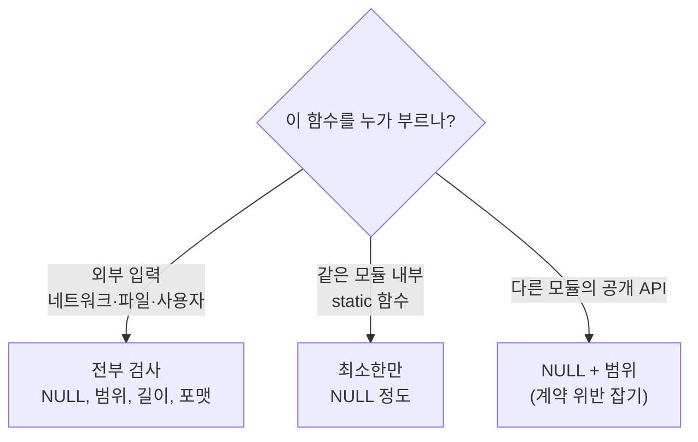

# 1. 기본 골격 — 리턴코드 · 가드매크로 · 단일출구 cleanup

> **한 문장 요약**
> C 함수는 **전부 같은 모양**으로 쓴다.
> `가드로 시작 → 자원 잡기 → 로직 → goto CLEANUP → 잡은 역순으로 놓기 → 리턴`.
> 이 모양을 벗어나는 순간 메모리가 새기 시작한다.

---

## 0. 왜 "모양을 통일"하는가

C에는 예외(exception)도, 소멸자(destructor)도, GC도 없다.
그래서 **에러가 날 때마다 내가 직접 뒷정리를 해야 한다.**

초보가 쓰는 코드는 보통 이렇게 생겼다.

```c
/* ✗ 이렇게 쓰면 반드시 샌다 */
int do_something(const char *name)
{
    char *buf = malloc(1024);
    FILE *fp = fopen(name, "r");

    if (fp == NULL) {
        return -1;                  /* ✗ buf 가 샌다 */
    }
    if (fread(buf, 1, 1024, fp) == 0) {
        fclose(fp);
        return -1;                  /* ✗ buf 가 또 샌다 */
    }
    ...
    free(buf);
    fclose(fp);
    return 0;
}
```

**에러 경로가 3개면 뒷정리 코드도 3벌**이다. 그중 하나만 빠져도 샌다.
그리고 **에러 경로는 시험에서 거의 안 밟힌다.** 그래서 운영 나가서 터진다.

```c
/* ✓ 단일 출구: 뒷정리가 딱 한 벌 */
int do_something(const char *name)
{
    int   ret = RET_FAIL;           /* ① 실패를 기본값으로 */
    char *buf = NULL;               /* ② 포인터는 전부 NULL 로 선언 */
    FILE *fp  = NULL;

    CHK_PTR(name);                  /* ③ 가드 */

    buf = malloc(1024);
    CHK_PTR_GOTO(buf, CLEANUP);     /* ④ 실패하면 CLEANUP 으로 */

    fp = fopen(name, "r");
    CHK_PTR_GOTO(fp, CLEANUP);

    if (fread(buf, 1, 1024, fp) == 0) goto CLEANUP;

    ...
    ret = RET_OK;                   /* ⑤ 끝까지 왔을 때만 성공 */

CLEANUP:                            /* ⑥ 뒷정리는 여기 한 곳뿐 */
    if (fp)  { fclose(fp); fp = NULL; }
    SAFE_FREE(buf);
    return ret;
}
```

> [!IMPORTANT] 이 여섯 줄이 전부다
> ① `ret` 초기값은 **실패**. ② 포인터는 전부 `NULL` 초기화.
> ③ 가드로 인자 검사. ④ 실패하면 `goto CLEANUP`. ⑤ 성공은 맨 마지막 한 줄.
> ⑥ 해제는 **잡은 역순**으로 한 곳에서.
>
> 이 골격은 사내 프레임워크 코드에서도 똑같이 쓴다 →
> 실무 3. 네이밍·에러·로그·자원해제 규약

---

## 1. 리턴코드 체계

### 1-1. 세 가지 방식과 선택 기준

| 방식 | 모양 | 언제 쓰나 | 단점 |
| :--- | :--- | :--- | :--- |
| **0 / -1** | `return 0;` / `return -1;` | 실패 이유가 **하나뿐**일 때 | "왜 실패했는지" 못 알려줌 |
| **enum 에러코드** | `return E_INVALID_ARG;` | 실패 이유가 **여러 개**일 때 | 상수를 관리해야 함 |
| **출력 파라미터** | `int f(in, out, int *err)` | 값과 에러를 **둘 다** 줘야 할 때 | 호출이 번거로움 |

> [!TIP] 기본은 enum 으로 시작하라
> `0 / -1` 로 시작하면 나중에 "이 실패가 입력 문제인지 시스템 문제인지" 를 구분해야 할 때
> **모든 호출부를 고쳐야 한다.** 처음부터 enum 으로 두면 값만 추가하면 된다.

### 1-2. 복붙용 리턴코드 정의

```c
/* ══════════════ common.h — 프로젝트 하나당 한 벌 ══════════════ */
#ifndef COMMON_H
#define COMMON_H

#include <stdio.h>
#include <stdlib.h>
#include <string.h>
#include <stdint.h>
#include <errno.h>

/* ── 리턴코드 ─────────────────────────────────────────
 *  성공은 0 하나. 실패는 전부 음수.
 *  "if (ret != RET_OK)" 한 줄로 모든 실패를 잡을 수 있다.
 * ──────────────────────────────────────────────────── */
typedef enum {
    RET_OK           =  0,    /* 성공 */
    RET_FAIL         = -1,    /* 분류 안 된 일반 실패 */
    RET_INVALID_ARG  = -2,    /* 인자가 잘못됨 (NULL, 범위 밖) */
    RET_NO_MEM       = -3,    /* malloc 실패 */
    RET_NOT_FOUND    = -4,    /* 찾는 대상이 없음 (에러 아닐 수도) */
    RET_TOO_SMALL    = -5,    /* 버퍼가 모자람 */
    RET_BAD_FORMAT   = -6,    /* 파싱 실패, 규격 위반 */
    RET_TIMEOUT      = -7,    /* 시간 초과 */
    RET_IO_ERROR     = -8,    /* read/write/socket 실패 */
    RET_NOT_SUPPORTED= -9,    /* 아직 구현 안 함 / 규격상 미지원 */
} ret_t;

/* 에러코드를 사람이 읽는 문자열로. 로그 찍을 때 필수 */
static inline const char *ret_str(int r)
{
    switch (r) {
    case RET_OK:            return "OK";
    case RET_FAIL:          return "FAIL";
    case RET_INVALID_ARG:   return "INVALID_ARG";
    case RET_NO_MEM:        return "NO_MEM";
    case RET_NOT_FOUND:     return "NOT_FOUND";
    case RET_TOO_SMALL:     return "TOO_SMALL";
    case RET_BAD_FORMAT:    return "BAD_FORMAT";
    case RET_TIMEOUT:       return "TIMEOUT";
    case RET_IO_ERROR:      return "IO_ERROR";
    case RET_NOT_SUPPORTED: return "NOT_SUPPORTED";
    default:                return "UNKNOWN";
    }
}

#endif /* COMMON_H */
```

> [!WARNING] `RET_NOT_FOUND` 는 에러가 아닐 수 있다
> "조회했는데 없다" 는 **정상적인 결과**인 경우가 많다 (HTTP 404).
> 그래서 `if (ret < 0)` 로 뭉뚱그리면 안 되고,
> **`if (ret == RET_NOT_FOUND)` 를 따로 처리**해야 하는 경우가 생긴다.
> 실제 상용 코드에서도 DB 조회는 `실패 / 0건 / 성공` **세 갈래**로 나눈다.

### 1-3. 호출부에서 쓰는 모양

```c
int ret = 0;

ret = do_something(name);
if (ret != RET_OK) {
    LOG_ERR("do_something(%s) failed: %s(%d)", name, ret_str(ret), ret);
    return ret;                     /* ★ 에러코드를 그대로 위로 전달 */
}
```

> [!TIP] 에러코드는 **바꾸지 말고 그대로 올린다**
> 중간 함수에서 `return RET_FAIL;` 로 덮어쓰면, 맨 위에서는
> "뭔가 실패했다" 밖에 알 수 없다. **원래 코드를 그대로 전달**해야
> 맨 위 로그만 보고도 "아, 메모리가 모자랐구나" 를 안다.

---

## 2. 가드 매크로 — 함수 첫 줄에 놓는 검사

### 2-1. 복붙용 가드 매크로 전문

```c
/* ══════════════ guard.h ══════════════ */
#ifndef GUARD_H
#define GUARD_H

#include "common.h"
#include "log.h"

/* ── 즉시 return 하는 가드 (자원을 아직 안 잡았을 때) ── */

#define CHK_PTR(_p)                                                     \
    do {                                                                \
        if ((_p) == NULL) {                                             \
            LOG_ERR("%s is NULL (%s/%d)", #_p, __func__, __LINE__);     \
            return RET_INVALID_ARG;                                     \
        }                                                               \
    } while (0)

#define CHK_RANGE(_v, _min, _max)                                       \
    do {                                                                \
        if ((_v) < (_min) || (_v) > (_max)) {                           \
            LOG_ERR("%s(%d) out of range [%d,%d] (%s/%d)",              \
                    #_v, (int)(_v), (int)(_min), (int)(_max),           \
                    __func__, __LINE__);                                \
            return RET_INVALID_ARG;                                     \
        }                                                               \
    } while (0)

#define CHK_STR(_s)                                                     \
    do {                                                                \
        if ((_s) == NULL || (_s)[0] == '\0') {                          \
            LOG_ERR("%s is empty (%s/%d)", #_s, __func__, __LINE__);    \
            return RET_INVALID_ARG;                                     \
        }                                                               \
    } while (0)

#define CHK_RET(_expr)                                                  \
    do {                                                                \
        int _r = (_expr);                                               \
        if (_r != RET_OK) {                                             \
            LOG_ERR("%s failed: %s(%d) (%s/%d)",                        \
                    #_expr, ret_str(_r), _r, __func__, __LINE__);       \
            return _r;                                                  \
        }                                                               \
    } while (0)

/* ── goto 로 빠지는 가드 (자원을 이미 잡았을 때) ── */

#define CHK_PTR_GOTO(_p, _label)                                        \
    do {                                                                \
        if ((_p) == NULL) {                                             \
            LOG_ERR("%s is NULL (%s/%d)", #_p, __func__, __LINE__);     \
            ret = RET_INVALID_ARG;                                      \
            goto _label;                                                \
        }                                                               \
    } while (0)

#define CHK_RET_GOTO(_expr, _label)                                     \
    do {                                                                \
        ret = (_expr);                                                  \
        if (ret != RET_OK) {                                            \
            LOG_ERR("%s failed: %s(%d) (%s/%d)",                        \
                    #_expr, ret_str(ret), ret, __func__, __LINE__);     \
            goto _label;                                                \
        }                                                               \
    } while (0)

#define CHK_COND_GOTO(_cond, _ret, _label)                              \
    do {                                                                \
        if (!(_cond)) {                                                 \
            LOG_ERR("cond(%s) failed (%s/%d)", #_cond, __func__, __LINE__); \
            ret = (_ret);                                               \
            goto _label;                                                \
        }                                                               \
    } while (0)

#endif /* GUARD_H */
```

### 2-2. 매크로 해독 — 왜 이 모양인가

| 부분 | 왜 필요한가 |
| :--- | :--- |
| `do { ... } while (0)` | `if (x) CHK_PTR(p); else ...` 에서 문법이 깨지지 않게. → [do-while(0) 노트](../%5BC%5D%20매크로를%20do-while(0)으로%20감싸는%20이유%20—%20여러%20문장을%20안전한%20하나로%20묶기.md) |
| `#_p` (stringify) | 매크로 인자를 **문자열로** 만든다. `CHK_PTR(name)` → 로그에 `"name is NULL"` |
| `(_p)` 괄호 | `CHK_RANGE(a+b, 0, 10)` 같은 식이 들어와도 우선순위가 안 깨지게 |
| `__func__`, `__LINE__` | 로그만 보고 **어느 함수 몇 번째 줄**인지 바로 찾게 |
| `int _r` 지역변수 | `_expr` 을 **두 번 평가하지 않기 위해**. 함수 호출이면 두 번 불린다! |
| `_goto` 판의 `ret` | 매크로가 **바깥의 `ret` 변수를 암묵적으로 쓴다** (아래 주의) |

> [!DANGER] `CHK_*_GOTO` 는 `ret` 이라는 지역변수가 있다고 가정한다
> 이 매크로들은 함수 안에 **`int ret;` 이 반드시 있어야** 컴파일된다.
> 암묵적 의존이라 처음엔 놀라는데, 이건 **의도된 관행**이다
> (사내 코드의 `MNFMNG_SVC` 매크로가 `sid` 를 암묵적으로 쓰는 것과 같은 방식).
> 대신 **템플릿을 복붙하면 `ret` 선언이 딸려 오므로** 실수할 일이 없다.

> [!WARNING] 인자를 두 번 평가하는 매크로를 만들지 말 것
> ```c
> #define CHK_RET(_e)  if ((_e) != RET_OK) { LOG_ERR("%d", (_e)); return (_e); }  /* ✗ */
> ```
> `CHK_RET(send_packet(fd))` 라고 쓰면 **패킷이 세 번 전송된다.**
> 반드시 `int _r = (_expr);` 로 **한 번만 평가해서 지역변수에 담는다.**

### 2-3. 어디까지 검사할 것인가



> [!IMPORTANT] 경계에서만 빡세게 검사한다
> 모든 함수에서 모든 인자를 검사하면 **코드의 절반이 검사문**이 된다.
> **외부에서 들어온 값은 한 번 철저히 검사하고, 그 뒤로는 믿는다.**
> 단, `static` 함수라도 **포인터 NULL 검사는 남겨두는 게** 디버깅에 유리하다.

---

## 3. 로그 — 가드 매크로가 쓸 최소한의 로그

프레임워크가 없으면 로그도 직접 만들어야 한다. **최소 구성은 이것이면 충분하다.**

```c
/* ══════════════ log.h ══════════════ */
#ifndef LOG_H
#define LOG_H

#include <stdio.h>
#include <time.h>

typedef enum {
    LOG_LV_ERR = 0,
    LOG_LV_WRN = 1,
    LOG_LV_INF = 2,
    LOG_LV_DBG = 3,
} log_level_t;

extern log_level_t g_log_level;     /* 런타임에 바꿀 수 있게 전역 */

#define LOG_PRINT(_lv, _tag, _fmt, ...)                                  \
    do {                                                                 \
        if ((_lv) <= g_log_level) {                                      \
            time_t _t = time(NULL);                                      \
            struct tm _tm;                                               \
            char _ts[20];                                                \
            localtime_r(&_t, &_tm);                                      \
            strftime(_ts, sizeof(_ts), "%Y-%m-%d %H:%M:%S", &_tm);       \
            fprintf(stderr, "[%s][%s] " _fmt "\n", _ts, _tag,            \
                    ##__VA_ARGS__);                                      \
        }                                                                \
    } while (0)

#define LOG_ERR(_fmt, ...)  LOG_PRINT(LOG_LV_ERR, "ERR", _fmt, ##__VA_ARGS__)
#define LOG_WRN(_fmt, ...)  LOG_PRINT(LOG_LV_WRN, "WRN", _fmt, ##__VA_ARGS__)
#define LOG_INF(_fmt, ...)  LOG_PRINT(LOG_LV_INF, "INF", _fmt, ##__VA_ARGS__)
#define LOG_DBG(_fmt, ...)  LOG_PRINT(LOG_LV_DBG, "DBG", _fmt, ##__VA_ARGS__)

#endif /* LOG_H */
```

| 부분 | 설명 |
| :--- | :--- |
| `##__VA_ARGS__` | GCC 확장. 가변인자가 **비었을 때 앞의 쉼표를 지워준다**. 없으면 `LOG_ERR("hello")` 가 컴파일 에러 |
| `(_lv) <= g_log_level` | 레벨 검사를 **매크로 안에서** 하면, 꺼진 로그는 인자 조립 비용조차 안 든다 |
| `localtime_r` | `localtime` 은 **스레드 안전하지 않다**. 멀티스레드면 반드시 `_r` 판 |
| `fprintf(stderr, ...)` | 버퍼링 없이 바로 나간다. 죽기 직전 로그가 안 날아간다 |

> [!TIP] 로그 포맷을 **프로젝트 시작할 때** 정하라
> 나중에 바꾸면 이미 쌓인 로그를 파싱하던 스크립트가 전부 깨진다.
> 최소한 **`[시각][레벨] 메시지 (함수/줄)`** 형태는 지키는 게 좋다.

---

## 4. 메모리 누수 방어

### 4-1. 해제 매크로 — 두 번 free 를 막는다

```c
/* ══════════════ safe.h ══════════════ */
#define SAFE_FREE(_p)                                                   \
    do {                                                                \
        if ((_p) != NULL) {                                             \
            free(_p);                                                   \
            (_p) = NULL;        /* ★ 이 한 줄이 double free 를 막는다 */ \
        }                                                               \
    } while (0)

#define SAFE_FCLOSE(_fp)                                                \
    do { if ((_fp) != NULL) { fclose(_fp); (_fp) = NULL; } } while (0)

#define SAFE_CLOSE(_fd)                                                 \
    do { if ((_fd) >= 0) { close(_fd); (_fd) = -1; } } while (0)
```

> [!DANGER] `= NULL` 을 빼먹으면 언젠가 죽는다
> ```c
> free(buf);          /* ✗ buf 는 여전히 옛 주소를 가리킨다 (dangling) */
> ...
> if (buf) free(buf); /* ✗ NULL 이 아니므로 통과 → double free → 즉사 */
> ```
> `free(NULL)` 은 **합법이고 아무 일도 안 한다.** 그러니 NULL 로 만들어두면 안전하다.
> 매크로로 감싸면 **이걸 빼먹는 게 불가능**해진다. 그게 매크로를 쓰는 이유다.

### 4-2. 문자열 복사 — `strcpy` 를 쓰지 않는다

```c
/* ── 항상 널 종단을 보장하는 복사 ────────────────────── */
#define SAFE_CPY(_dst, _src)                                            \
    do {                                                                \
        snprintf((_dst), sizeof(_dst), "%s", (_src) ? (_src) : "");     \
    } while (0)
```

| 함수 | 문제 |
| :--- | :--- |
| `strcpy(dst, src)` | **길이 검사 없음.** 버퍼 오버플로의 1순위 원인 |
| `strncpy(dst, src, n)` | src 가 n 이상이면 **널 종단을 안 붙인다.** 이후 읽기가 폭주 |
| `snprintf(dst, sizeof(dst), "%s", src)` | ✓ 잘리더라도 **항상 널 종단**. 반환값으로 잘림도 감지 가능 |

> [!DANGER] `SAFE_CPY` 의 `sizeof(_dst)` 함정
> 이 매크로는 `_dst` 가 **배열**일 때만 맞다.
> ```c
> char buf[64];        SAFE_CPY(buf, src);   /* ✓ sizeof = 64 */
> char *p = malloc(64); SAFE_CPY(p, src);    /* ✗ sizeof = 8 (포인터 크기!) */
> ```
> 포인터에 쓰면 **8바이트만 복사되고 조용히 잘린다.** 크래시도 안 난다.
> 포인터에는 반드시 크기를 명시하는 `snprintf(p, 64, "%s", src)` 를 쓴다.

### 4-3. 할당 실패도 반드시 검사

```c
buf = malloc(len);
if (buf == NULL) {
    LOG_ERR("malloc(%zu) failed: %s (%s/%d)", len, strerror(errno), __func__, __LINE__);
    ret = RET_NO_MEM;
    goto CLEANUP;
}
memset(buf, 0x00, len);        /* ★ malloc 은 초기화를 안 해준다 */
```

> [!TIP] `calloc(n, size)` 는 `malloc` + `memset` 이다
> 0으로 채울 거라면 `calloc` 한 줄이 더 짧고, **곱셈 오버플로 검사도 해준다.**
> ```c
> buf = calloc(cnt, sizeof(item_t));   /* cnt * sizeof 가 넘치면 NULL 반환 */
> ```

---

## 5. 완성된 복붙 템플릿

### 5-1. 자원을 안 잡는 함수 (제일 흔함)

```c
/* ══════════════ 자원 없음: 가드 + 바로 return ══════════════ */
int {{함수명}}(const {{입력타입}} *in, {{출력타입}} *out)
{
    CHK_PTR(in);
    CHK_PTR(out);
    CHK_RANGE(in->{{필드}}, {{최소}}, {{최대}});

    memset(out, 0x00, sizeof(*out));      /* ★ 출력은 항상 초기화부터 */

    /* ───────── 여기서만 생각한다 ───────── */
    {{비즈니스 로직}}
    /* ──────────────────────────────────── */

    return RET_OK;
}
```

### 5-2. 자원을 잡는 함수 (누수 방어판)

```c
/* ══════════════ 자원 있음: goto CLEANUP ══════════════ */
int {{함수명}}(const {{입력타입}} *in, {{출력타입}} *out)
{
    int    ret  = RET_FAIL;              /* ① 실패가 기본값 */
    char  *buf  = NULL;                  /* ② 포인터는 전부 NULL */
    FILE  *fp   = NULL;
    int    fd   = -1;                    /*    fd 는 -1 */

    CHK_PTR(in);                         /* ③ 자원 잡기 전 검사는 즉시 return */
    CHK_PTR(out);

    memset(out, 0x00, sizeof(*out));

    buf = calloc(1, {{크기}});           /* ④ 여기서부터는 goto CLEANUP */
    CHK_PTR_GOTO(buf, CLEANUP);

    fp = fopen(in->{{경로}}, "r");
    CHK_PTR_GOTO(fp, CLEANUP);

    /* ───────── 비즈니스 로직 ───────── */
    CHK_RET_GOTO({{하위함수}}(in, buf), CLEANUP);
    CHK_COND_GOTO({{조건}}, RET_BAD_FORMAT, CLEANUP);
    /* ──────────────────────────────── */

    ret = RET_OK;                        /* ⑤ 끝까지 왔을 때만 성공 */

CLEANUP:                                 /* ⑥ 잡은 역순으로 해제 */
    SAFE_FCLOSE(fp);
    SAFE_FREE(buf);
    SAFE_CLOSE(fd);

    if (ret != RET_OK) {
        memset(out, 0x00, sizeof(*out)); /* ★ 실패 시 출력을 쓰레기로 남기지 않는다 */
    }
    return ret;
}
```

> [!IMPORTANT] 실패했으면 `out` 을 비워라
> 호출부가 리턴값을 검사하지 않고 `out` 을 쓰는 경우가 **실제로 자주 있다.**
> 실패 경로에서 `out` 을 초기화해두면, 그런 실수가 **크래시 대신 빈 값**으로 끝난다.

### 5-3. 자원을 **만들어서 돌려주는** 함수

가장 실수가 잦은 유형이다. **"성공하면 호출부가 free, 실패하면 내가 free"** 규칙이 핵심.

```c
/* ══════════════ 생성 함수: 소유권을 넘긴다 ══════════════ */
/*  성공: *out_obj 를 채워서 반환. 호출부가 {{타입}}_destroy() 해야 함
 *  실패: *out_obj 는 NULL. 내부에서 이미 전부 정리됨               */
int {{타입}}_create(const {{설정타입}} *cfg, {{타입}} **out_obj)
{
    int      ret = RET_FAIL;
    {{타입}} *obj = NULL;

    CHK_PTR(cfg);
    CHK_PTR(out_obj);

    *out_obj = NULL;                     /* ★ 출력 포인터를 먼저 NULL 로 */

    obj = calloc(1, sizeof({{타입}}));
    CHK_PTR_GOTO(obj, CLEANUP);

    obj->{{버퍼}} = calloc(cfg->{{개수}}, sizeof({{항목타입}}));
    CHK_PTR_GOTO(obj->{{버퍼}}, CLEANUP);

    CHK_RET_GOTO({{추가초기화}}(obj, cfg), CLEANUP);

    *out_obj = obj;                      /* ★ 성공할 때만 넘긴다 */
    obj      = NULL;                     /* ★★ 소유권을 넘겼으니 내 손에서 뗀다 */
    ret      = RET_OK;

CLEANUP:
    if (obj != NULL) {                   /* ★ 여기 오면 obj 는 "실패한 놈" */
        {{타입}}_destroy(obj);           /*    성공 경로에서는 NULL 이라 안 탄다 */
    }
    return ret;
}

void {{타입}}_destroy({{타입}} *obj)
{
    if (obj == NULL) return;             /* ★ NULL 을 받아도 안전하게 */

    SAFE_FREE(obj->{{버퍼}});            /* 안쪽부터 */
    SAFE_FREE(obj);                      /* 바깥은 마지막 */
}
```

> [!IMPORTANT] `obj = NULL;` 한 줄이 핵심이다
> 성공 경로에서 이걸 빼면, `CLEANUP` 에서 **방금 호출부에 넘긴 객체를 destroy** 해버린다.
> 호출부는 이미 해제된 메모리를 받게 된다 (use-after-free).
>
> 관용구로 외운다: **"넘겼으면 놓는다 (`*out = obj; obj = NULL;`)"**
> 사내 코드의 ATIPC 소유권 규칙과 정확히 같은 개념이다 →
> 실무 6. IPC·HTTP2 송수신 골격

> [!TIP] `destroy` 는 항상 `NULL` 을 받아도 되게 만든다
> `free(NULL)` 이 합법인 것처럼, 내가 만든 destroy 도 그래야 한다.
> 그래야 호출부가 `if (obj) destroy(obj);` 를 안 써도 되고, CLEANUP 코드가 짧아진다.

---

## 6. 단위 시험 — 최소 3개

함수 하나당 **정상 / 경계 / NULL** 세 개만 써도 버그의 대부분이 잡힌다.

```c
/* ══════════════ test_{{모듈}}.c ══════════════ */
#include <assert.h>
#include "{{모듈}}.h"

static void test_normal(void)
{
    {{입력타입}} in  = { .{{필드}} = {{정상값}} };
    {{출력타입}} out;

    assert({{함수명}}(&in, &out) == RET_OK);
    assert(out.{{결과필드}} == {{기대값}});
    printf("  [OK] normal\n");
}

static void test_boundary(void)
{
    {{입력타입}} in;
    {{출력타입}} out;

    in.{{필드}} = {{최소}};        assert({{함수명}}(&in, &out) == RET_OK);
    in.{{필드}} = {{최대}};        assert({{함수명}}(&in, &out) == RET_OK);
    in.{{필드}} = {{최소}} - 1;    assert({{함수명}}(&in, &out) == RET_INVALID_ARG);
    in.{{필드}} = {{최대}} + 1;    assert({{함수명}}(&in, &out) == RET_INVALID_ARG);
    printf("  [OK] boundary\n");
}

static void test_null(void)
{
    {{입력타입}} in = { 0 };
    {{출력타입}} out;

    assert({{함수명}}(NULL, &out)  == RET_INVALID_ARG);
    assert({{함수명}}(&in,  NULL)  == RET_INVALID_ARG);
    assert({{함수명}}(NULL, NULL)  == RET_INVALID_ARG);
    printf("  [OK] null\n");
}

int main(void)
{
    printf("test_{{모듈}}:\n");
    test_normal();
    test_boundary();
    test_null();
    printf("all passed\n");
    return 0;
}
```

```bash
# 누수까지 한 번에 확인
gcc -g -O0 -Wall -Wextra -fsanitize=address,undefined \
    test_{{모듈}}.c {{모듈}}.c -o test_{{모듈}}
./test_{{모듈}}
```

> [!IMPORTANT] `-fsanitize=address` 는 공짜 QA 다
> 누수, 버퍼 오버플로, use-after-free, double free 를 **실행 즉시 잡아서 위치까지 알려준다.**
> 개발 중에는 항상 켜두고, 릴리즈 빌드에서만 뺀다.
> `undefined` 도 같이 켜면 **부호 오버플로·정렬 위반**까지 잡힌다.

---

## 7. 컴파일 옵션 — 경고가 최고의 정적분석기다

```makefile
CFLAGS  = -std=c11 -Wall -Wextra -Werror
CFLAGS += -Wshadow            # 바깥 변수를 가리는 지역변수
CFLAGS += -Wpointer-arith     # void* 산술
CFLAGS += -Wcast-align        # 정렬이 안 맞는 캐스팅 (엔디안 코드에서 중요)
CFLAGS += -Wstrict-prototypes # f() 대신 f(void)
CFLAGS += -Wformat=2          # printf 포맷과 인자 타입 불일치
CFLAGS += -D_GNU_SOURCE

# 개발용
DBGFLAGS = -g -O0 -fsanitize=address,undefined
# 릴리즈용
RELFLAGS = -O2 -DNDEBUG
```

| 옵션 | 잡아주는 것 |
| :--- | :--- |
| `-Wall -Wextra` | 초기화 안 한 변수, 안 쓰는 변수, 비교 부호 불일치 |
| `-Werror` | **경고를 에러로.** "나중에 고치지" 를 원천 차단 |
| `-Wformat=2` | `printf("%d", ptr)` 같은 **런타임에야 터질 버그**를 컴파일 타임에 |
| `-Wcast-align` | `char*` 를 `uint32_t*` 로 캐스팅 → ARM 에서 죽는 코드 |

> [!WARNING] `-Werror` 는 처음부터 켜라
> 기존 코드에 경고가 500개 쌓인 뒤에 켜려면 아무도 못 켠다.
> **새 프로젝트는 무조건 처음부터.**

---

## 8. 체크리스트

### 함수 하나를 다 썼을 때
- [ ] `ret` 초기값이 **실패**인가
- [ ] 모든 포인터를 `NULL` 로 선언했는가 (fd 는 `-1`)
- [ ] 인자 검사가 함수 첫 부분에 있는가
- [ ] 자원을 잡은 **뒤**의 에러는 전부 `goto CLEANUP` 인가
- [ ] `CLEANUP` 의 해제 순서가 **잡은 역순**인가
- [ ] `free` 뒤에 `= NULL` 이 있는가 (`SAFE_FREE` 를 썼는가)
- [ ] `malloc` / `fopen` / `open` 의 **반환값을 검사**했는가
- [ ] 실패 경로에서 `out` 을 초기화했는가
- [ ] `strcpy` / `strcat` / `sprintf` 를 **하나도 안 썼는가**
- [ ] 생성 함수라면 `*out = obj; obj = NULL;` 을 했는가

### 모듈 하나를 다 썼을 때
- [ ] `-Wall -Wextra -Werror` 로 **경고 0개**인가
- [ ] `-fsanitize=address` 로 시험이 통과하는가
- [ ] 함수마다 정상/경계/NULL 시험 3개가 있는가
- [ ] 에러코드를 중간에서 덮어쓰지 않고 그대로 올리는가
- [ ] 로그에 `__func__` / `__LINE__` 이 들어가는가

---

## 관련 노트

- [c코드 템플릿 목록](c코드%20템플릿%20목록.md) — 이 폴더의 허브
- [2. 데이터 모델 골격 — 규격서 I/O 표를 구조체로](2.%20데이터%20모델%20골격%20—%20규격서%20I·O%20표를%20구조체로.md) — 다음 단계
- [3. 바이트 골격 — 비트플래그·엔디안·Pack/Unpack](3.%20바이트%20골격%20—%20비트플래그·엔디안·Pack·Unpack.md)
- [[C] 매크로를 do-while(0)으로 감싸는 이유](../%5BC%5D%20매크로를%20do-while(0)으로%20감싸는%20이유%20—%20여러%20문장을%20안전한%20하나로%20묶기.md) — 가드 매크로의 원리
- [[C] 실무 C 코드 관례와 UB 함정 정리](../%5BC%5D%20실무%20C%20코드%20관례와%20UB%20함정%20정리.md) — 피해야 할 것들
- [[C] Hungarian 표기법 접두어 해독표](../%5BC%5D%20Hungarian%20표기법%20접두어%20해독표%20—%20변수%20이름만%20보고%20타입·스코프%20짐작하기.md)
- 실무 3. 네이밍·에러·로그·자원해제 규약 — **사내 프레임워크 버전**
