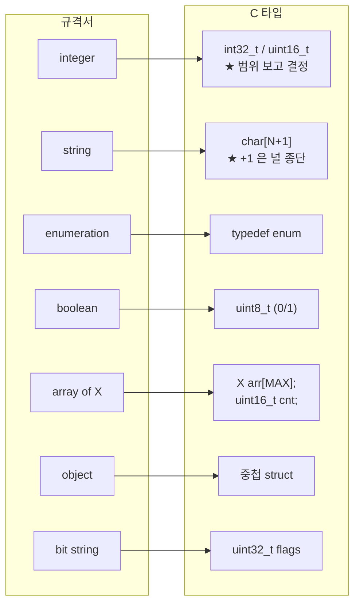
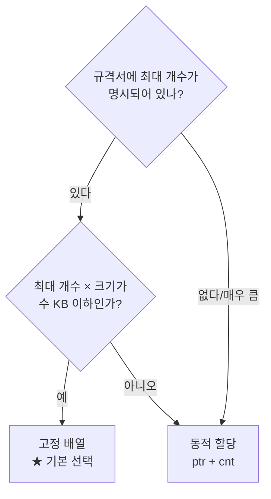

# 2. 데이터 모델 골격 — 규격서 I/O 표를 구조체로

> **한 문장 요약**
> 규격서의 **표 한 줄 = 구조체 멤버 하나.**
> 고민할 건 딱 세 가지다 — **어떤 타입? Optional 은 어떻게? 길이는 고정인가 가변인가?**

---

## 0. 코드 치기 전에 만드는 표 세 개

빈 파일 앞에서 막막한 이유는 **뭘 만들지가 안 정해졌기 때문**이다.
표부터 만들면 구조체는 기계적으로 나온다.

### 표 ①: 입력

| 필드 | 타입 | M/O | 범위·길이 | 설명 |
| :--- | :--- | :--- | :--- | :--- |
| `nf_instance_id` | string | **M** | 36 (UUID) | NF 식별자 |
| `nf_type` | enum | **M** | AMF/SMF/UPF… | NF 종류 |
| `heart_beat_timer` | integer | O | 1~3600 | 초 단위 |
| `ipv4_addresses` | string[] | O | 최대 8개, 각 15자 | IPv4 목록 |

### 표 ②: 출력

| 필드 | 타입 | M/O | 설명 |
| :--- | :--- | :--- | :--- |
| `result_code` | integer | **M** | 201/400/500 |
| `location` | string | O | 생성된 리소스 URI |

### 표 ③: 에러

| 상황 | 리턴코드 | 응답 |
| :--- | :--- | :--- |
| 필수 필드 누락 | `RET_INVALID_ARG` | 400 Bad Request |
| UUID 형식 위반 | `RET_BAD_FORMAT` | 400 |
| 이미 등록됨 | `RET_FAIL` | 409 Conflict |
| DB 오류 | `RET_IO_ERROR` | 500 |

> [!IMPORTANT] M/O 열이 제일 중요하다
> **M(Mandatory)** = 없으면 에러. **O(Optional)** = 없어도 정상.
> 이 구분을 안 하고 코드를 짜면, "보낸 적 없는 필드가 0으로 들어와서" 생기는
> **원인을 알 수 없는 버그**가 나온다. (아래 2장에서 해결)

---

## 1. 타입 매핑 — 규격서 타입을 C 타입으로



### 1-1. 정수 — 크기를 범위 보고 고른다

| 규격서 범위 | C 타입 | 크기 |
| :--- | :--- | :--- |
| 0 ~ 255 | `uint8_t` | 1 |
| 0 ~ 65535 | `uint16_t` | 2 |
| -32768 ~ 32767 | `int16_t` | 2 |
| 0 ~ 약 42억 | `uint32_t` | 4 |
| 그 이상 / 시각 | `int64_t`, `uint64_t` | 8 |

> [!DANGER] `int` 를 기본값으로 쓰지 말 것
> `int` 의 크기는 **플랫폼마다 다를 수 있다.** 네트워크로 나가거나 파일에 저장되는
> 구조체에는 **반드시 `<stdint.h>` 의 고정 크기 타입**을 쓴다.
> 로컬 계산용 변수에만 `int` 를 쓴다.

> [!WARNING] `time_t` 를 `int` 에 넣지 말 것
> 64비트 `time_t` 를 32비트 `int` 에 담으면 **2038년에 음수가 된다.**
> 정적 분석기(Coverity)도 이걸 잡는다.
> → [[C] 64비트 time_t와 32비트 int 변환](../%5BC%5D%2064비트%20time_t와%2032비트%20int%20변환%20—%202038년%20문제와%20Coverity%20정적%20분석%20대응.md)

### 1-2. 문자열 — 항상 `+1`

```c
#define NF_ID_LEN       36              /* 규격서가 말하는 최대 길이 */
#define NF_ID_SIZE      (NF_ID_LEN + 1) /* ★ 널 종단 자리 */

char nf_instance_id[NF_ID_SIZE];        /* 37바이트 */
```

> [!TIP] `LEN` 과 `SIZE` 를 이름으로 구분하라
> - `_LEN` = 글자 수 (규격서 숫자 그대로)
> - `_SIZE` = 배열 크기 (`_LEN + 1`)
>
> 이렇게 나눠두면 `strlen(x) > NF_ID_LEN` 과 `sizeof(buf) == NF_ID_SIZE` 를
> **헷갈리지 않고** 쓸 수 있다. 헷갈리면 off-by-one 버그가 난다.

### 1-3. enum — 반드시 `UNKNOWN` 과 `END` 를 넣는다

```c
typedef enum {
    NF_TYPE_UNKNOWN = 0,        /* ★ 0 = "설정 안 됨". memset(0) 과 맞아떨어진다 */
    NF_TYPE_AMF,
    NF_TYPE_SMF,
    NF_TYPE_UPF,
    NF_TYPE_PCF,
    NF_TYPE_UDM,
    NF_TYPE_END                 /* ★ 개수 세기 / 범위 검사용 */
} nf_type_t;

/* 문자열 ↔ enum 변환은 항상 짝으로 만든다 */
static const char *g_nf_type_str[NF_TYPE_END] = {
    "UNKNOWN", "AMF", "SMF", "UPF", "PCF", "UDM"
};

const char *nf_type_to_str(nf_type_t t)
{
    if (t < 0 || t >= NF_TYPE_END) return "INVALID";
    return g_nf_type_str[t];
}

nf_type_t nf_type_from_str(const char *s)
{
    int i;
    if (s == NULL) return NF_TYPE_UNKNOWN;
    for (i = 1; i < NF_TYPE_END; i++) {
        if (strcasecmp(s, g_nf_type_str[i]) == 0) return (nf_type_t)i;
    }
    return NF_TYPE_UNKNOWN;
}
```

> [!IMPORTANT] `0` 을 `UNKNOWN` 에 주는 이유
> 구조체를 `memset(&x, 0, sizeof(x))` 로 초기화하면 enum 필드도 0이 된다.
> 0이 유효한 값(`NF_TYPE_AMF` 같은)이면 **초기화 안 한 필드가 AMF로 보인다.**
> 0은 항상 **"설정되지 않음"** 으로 비워둔다.

> [!TIP] `_END` 를 배열 크기로 쓰면 자동으로 따라온다
> `g_nf_type_str[NF_TYPE_END]` 로 선언하면, enum 에 값을 추가했는데 문자열을 안 넣으면
> **컴파일러가 나머지를 NULL 로 채운다.** `-Wmissing-field-initializers` 를 켜면 경고까지 준다.

---

## 2. Optional 필드 — 제일 중요한 부분

### 2-1. 문제: "0이 들어온 건가, 안 온 건가?"

```c
/* ✗ 이 구조체로는 구분할 수 없다 */
typedef struct {
    char     nf_id[NF_ID_SIZE];
    uint16_t heart_beat_timer;      /* Optional 인데... 0이면? */
} nf_profile_t;
```

`heart_beat_timer == 0` 일 때 두 가지 해석이 가능하다.
1. 상대가 **"0초"** 라고 보냈다 (말이 안 되지만 규격상 가능할 수도)
2. 상대가 **안 보냈고**, 내가 `memset(0)` 한 값이다

이 둘을 구분 못 하면 **기본값을 적용해야 할지 말지**를 결정할 수 없다.

### 2-2. 해결 ①: `has_` 플래그 (권장, 제일 단순)

```c
typedef struct {
    /* ── Mandatory: 플래그 없음 ── */
    char      nf_id[NF_ID_SIZE];
    nf_type_t nf_type;

    /* ── Optional: 값 + 있음 표시 ── */
    uint8_t   has_heart_beat_timer;     /* 0 = 없음, 1 = 있음 */
    uint16_t  heart_beat_timer;

    uint8_t   has_priority;
    uint16_t  priority;
} nf_profile_t;
```

```c
/* 쓰는 쪽 */
if (in->has_heart_beat_timer) {
    timer = in->heart_beat_timer;
} else {
    timer = DEFAULT_HB_TIMER;           /* 기본값 적용 */
}

/* 채우는 쪽 */
out->has_heart_beat_timer = 1;
out->heart_beat_timer     = 30;
```

> [!TIP] 채우는 매크로를 만들어두면 실수가 없다
> ```c
> #define SET_OPT(_s, _f, _v)                                    \
>     do { (_s)->has_##_f = 1; (_s)->_f = (_v); } while (0)
>
> #define GET_OPT(_s, _f, _def)                                  \
>     ((_s)->has_##_f ? (_s)->_f : (_def))
> ```
> ```c
> SET_OPT(prof, heart_beat_timer, 30);
> timer = GET_OPT(prof, heart_beat_timer, DEFAULT_HB_TIMER);
> ```
> `##` 는 토큰 붙이기(token pasting). `has_##_f` → `has_heart_beat_timer` 가 된다.
> **값 설정과 플래그 설정이 항상 같이 일어나므로** 한쪽만 하는 실수가 불가능하다.

### 2-3. 해결 ②: 비트마스크 (필드가 많을 때)

Optional 필드가 20개쯤 되면 `has_` 플래그 20개가 구조체를 어지럽힌다. 이때는 비트마스크.

```c
/* 있음 표시를 비트 하나씩 */
#define F_HEART_BEAT_TIMER  (1u << 0)
#define F_PRIORITY          (1u << 1)
#define F_CAPACITY          (1u << 2)
#define F_LOAD              (1u << 3)
#define F_LOCALITY          (1u << 4)

typedef struct {
    uint32_t  present;              /* ★ 어떤 Optional 이 왔는지 비트로 */

    char      nf_id[NF_ID_SIZE];
    nf_type_t nf_type;

    uint16_t  heart_beat_timer;
    uint16_t  priority;
    uint16_t  capacity;
    uint8_t   load;
    char      locality[LOCALITY_SIZE];
} nf_profile_t;

/* 조작 매크로 */
#define P_SET(_s, _f)    ((_s)->present |=  (_f))
#define P_CLR(_s, _f)    ((_s)->present &= ~(_f))
#define P_HAS(_s, _f)    (((_s)->present & (_f)) != 0)
```

```c
P_SET(prof, F_HEART_BEAT_TIMER);
prof->heart_beat_timer = 30;

if (P_HAS(prof, F_PRIORITY)) { ... }
```

> [!NOTE] 비트 연산이 낯설면
> → [[C] 비트플래그(Bit Flag) 연산](../%5BC%5D%20비트플래그(Bit%20Flag)%20연산.md)
> → 자세한 복붙 매크로는 [3번 문서](3.%20바이트%20골격%20—%20비트플래그·엔디안·Pack·Unpack.md)

### 2-4. 해결 ③: "불가능한 값"을 센티널로 (제한적으로만)

| 타입 | 센티널 | 쓸 수 있는 조건 |
| :--- | :--- | :--- |
| 문자열 | `buf[0] == '\0'` | 빈 문자열이 유효값이 아닐 때 ✓ |
| 포인터 | `NULL` | 항상 ✓ |
| enum | `_UNKNOWN (0)` | 0을 유효값으로 안 쓸 때 ✓ |
| 양수 전용 정수 | `-1` 또는 `0` | **위험** — 규격을 잘 확인할 것 |
| 배열 | `cnt == 0` | ✓ |

> [!DANGER] 정수에 센티널을 쓸 때는 규격서를 세 번 확인하라
> "이 값은 1부터 시작하니까 0은 없음으로 쓰자" 라고 했는데
> 나중에 규격 개정으로 0이 유효값이 되면 **전부 뒤집어야 한다.**
> 애매하면 `has_` 플래그를 쓰는 게 안전하다.

### 2-5. 세 방식 비교

| | `has_` 플래그 | 비트마스크 | 센티널 |
| :--- | :--- | :--- | :--- |
| 가독성 | ★★★ | ★★ | ★ |
| 메모리 | 필드당 1바이트 | 전체 4바이트 | 0 |
| 필드 추가 | 쉬움 | 비트 상수 추가 | — |
| 실수 위험 | 낮음 (매크로로 묶으면) | 중간 | **높음** |
| **권장** | **기본으로 이것** | Optional 15개 이상 | 문자열/포인터만 |

---

## 3. 배열 — 고정이냐 동적이냐

### 3-1. 판단 기준



> [!IMPORTANT] 웬만하면 고정 배열
> 고정 배열은 **`malloc`/`free` 가 없으니 누수가 원천적으로 불가능**하다.
> 규격서에 "최대 8개" 라고 써 있으면 그냥 `arr[8]` 로 잡는다.
> 메모리 몇 KB 아끼려다 누수 버그 하나 만드는 게 훨씬 손해다.

### 3-2. 고정 배열 (권장)

```c
#define MAX_IPV4_ADDR   8
#define IPV4_STR_SIZE   16          /* "255.255.255.255" + '\0' */

typedef struct {
    uint16_t  ipv4_cnt;                                  /* ★ 실제 개수 */
    char      ipv4_addr[MAX_IPV4_ADDR][IPV4_STR_SIZE];   /* ★ 최대 크기 */
} nf_profile_t;
```

```c
/* 추가하는 함수 — 개수 검사를 반드시 넣는다 */
int profile_add_ipv4(nf_profile_t *p, const char *addr)
{
    CHK_PTR(p);
    CHK_STR(addr);

    if (p->ipv4_cnt >= MAX_IPV4_ADDR) {          /* ★ 이게 없으면 오버플로 */
        LOG_ERR("ipv4 list full (%u) (%s/%d)", p->ipv4_cnt, __func__, __LINE__);
        return RET_TOO_SMALL;
    }
    if (strlen(addr) >= IPV4_STR_SIZE) {         /* ★ 길이도 검사 */
        LOG_ERR("addr too long (%zu) (%s/%d)", strlen(addr), __func__, __LINE__);
        return RET_TOO_SMALL;
    }

    snprintf(p->ipv4_addr[p->ipv4_cnt], IPV4_STR_SIZE, "%s", addr);
    p->ipv4_cnt++;
    return RET_OK;
}
```

> [!DANGER] `cnt` 검사를 빼먹으면 스택이 통째로 깨진다
> 구조체가 스택에 있으면 배열 뒤에는 **리턴 주소**가 있다.
> `cnt` 검사 없는 쓰기 한 번이 **임의 코드 실행 취약점**이 된다.
> 배열에 쓰는 코드는 **무조건 `cnt >= MAX` 검사부터.**

### 3-3. 동적 배열 (개수를 모를 때만)

```c
typedef struct {
    uint16_t   item_cnt;
    item_t    *items;               /* ★ 짝: free */
} big_list_t;

int list_init(big_list_t *l, uint16_t cnt)
{
    CHK_PTR(l);
    memset(l, 0x00, sizeof(*l));

    if (cnt == 0) return RET_OK;    /* 0개는 정상. 할당 안 함 */

    l->items = calloc(cnt, sizeof(item_t));    /* ★ 곱셈 오버플로 검사 포함 */
    CHK_PTR(l->items);

    l->item_cnt = cnt;
    return RET_OK;
}

void list_free(big_list_t *l)
{
    if (l == NULL) return;
    SAFE_FREE(l->items);
    l->item_cnt = 0;                /* ★ 개수도 같이 0으로 */
}
```

> [!WARNING] `free` 하고 `cnt` 를 안 지우면 더 위험하다
> 포인터는 NULL 인데 `cnt` 가 5로 남아 있으면,
> `for (i = 0; i < l->item_cnt; i++) l->items[i]...` 가 **NULL 역참조**로 죽는다.
> **포인터와 개수는 항상 같이 움직인다.**

### 3-4. 문자열 배열 (가장 실수 잦음)

```c
typedef struct {
    uint16_t   cnt;
    char     **strs;                /* 포인터의 배열 — 이중 해제 필요 */
} str_list_t;

void str_list_free(str_list_t *l)
{
    uint16_t i;
    if (l == NULL) return;

    if (l->strs != NULL) {
        for (i = 0; i < l->cnt; i++) {
            SAFE_FREE(l->strs[i]);  /* ① 안쪽 문자열들 먼저 */
        }
        SAFE_FREE(l->strs);         /* ② 포인터 배열 나중 */
    }
    l->cnt = 0;
}
```

> [!DANGER] 바깥만 free 하면 문자열 전부가 샌다
> `free(l->strs)` 만 하면 **포인터 배열만** 없어지고, 각 문자열은 주소를 잃은 채 남는다.
> 되찾을 방법이 없으니 프로세스가 죽을 때까지 누수다.
> **안쪽부터 바깥으로** — 해제 순서의 기본 원칙.
> → [[C] 개수 필드 + 포인터의 포인터](../%5BC%5D%20개수%20필드%20+%20포인터의%20포인터%20—%20동적%20문자열%20배열%20만들고%20해제하기.md)

---

## 4. 완성된 복붙 템플릿

### 4-1. 헤더 (`{{모듈}}_type.h`)

```c
/* ══════════════ {{모듈}}_type.h ══════════════ */
#ifndef {{모듈대문자}}_TYPE_H
#define {{모듈대문자}}_TYPE_H

#include <stdint.h>
#include "common.h"

/* ── ① 길이 상수: 규격서 숫자를 그대로 ─────────────── */
#define {{필드}}_LEN        {{규격서길이}}
#define {{필드}}_SIZE       ({{필드}}_LEN + 1)
#define MAX_{{배열}}_CNT    {{규격서최대개수}}

/* ── ② enum: UNKNOWN=0, 끝에 _END ──────────────────── */
typedef enum {
    {{ENUM}}_UNKNOWN = 0,
    {{ENUM}}_{{값1}},
    {{ENUM}}_{{값2}},
    {{ENUM}}_END
} {{enum타입}}_t;

const char      *{{enum타입}}_to_str({{enum타입}}_t v);
{{enum타입}}_t   {{enum타입}}_from_str(const char *s);

/* ── ③ 입력 구조체 ─────────────────────────────────── */
typedef struct {
    /* Mandatory */
    char            {{필수문자열}}[{{필드}}_SIZE];
    {{enum타입}}_t  {{필수enum}};
    uint32_t        {{필수정수}};

    /* Optional — has_ 플래그와 값을 나란히 */
    uint8_t         has_{{선택필드}};
    uint16_t        {{선택필드}};

    /* 배열 — cnt 를 바로 위에 */
    uint16_t        {{배열}}_cnt;
    {{항목타입}}    {{배열}}[MAX_{{배열}}_CNT];
} {{모듈}}_req_t;

/* ── ④ 출력 구조체 ─────────────────────────────────── */
typedef struct {
    uint16_t  result_code;
    char      {{출력필드}}[{{출력}}_SIZE];
} {{모듈}}_rsp_t;

/* ── ⑤ 생명주기 함수 (자원을 쓰면 반드시 짝으로) ───── */
void {{모듈}}_req_init({{모듈}}_req_t *r);
int  {{모듈}}_req_validate(const {{모듈}}_req_t *r);
void {{모듈}}_req_free({{모듈}}_req_t *r);      /* 동적 배열이 있을 때만 */

/* ── ⑥ Optional 조작 매크로 ────────────────────────── */
#define SET_OPT(_s, _f, _v)   do { (_s)->has_##_f = 1; (_s)->_f = (_v); } while (0)
#define GET_OPT(_s, _f, _def) ((_s)->has_##_f ? (_s)->_f : (_def))
#define CLR_OPT(_s, _f)       do { (_s)->has_##_f = 0; (_s)->_f = 0; } while (0)

#endif /* {{모듈대문자}}_TYPE_H */
```

### 4-2. 초기화 · 검증 (`{{모듈}}_type.c`)

```c
/* ══════════════ {{모듈}}_type.c ══════════════ */
#include "{{모듈}}_type.h"
#include "guard.h"

void {{모듈}}_req_init({{모듈}}_req_t *r)
{
    if (r == NULL) return;
    memset(r, 0x00, sizeof(*r));
    /* ★ memset(0) 만으로 끝나게 타입을 설계했다면 여기 추가 코드가 없다.
     *   이게 좋은 설계다. enum 0 = UNKNOWN, 문자열 = "", cnt = 0, has_ = 0 */
}

/* ★ 규격서의 "M/O" 와 "범위" 열이 그대로 코드가 된다 */
int {{모듈}}_req_validate(const {{모듈}}_req_t *r)
{
    uint16_t i;

    CHK_PTR(r);

    /* ── Mandatory 검사 ── */
    if (r->{{필수문자열}}[0] == '\0') {
        LOG_ERR("{{필수문자열}} is missing (%s/%d)", __func__, __LINE__);
        return RET_INVALID_ARG;
    }
    if (r->{{필수enum}} == {{ENUM}}_UNKNOWN || r->{{필수enum}} >= {{ENUM}}_END) {
        LOG_ERR("{{필수enum}}(%d) invalid (%s/%d)", r->{{필수enum}}, __func__, __LINE__);
        return RET_INVALID_ARG;
    }

    /* ── 길이 검사 ── */
    if (strlen(r->{{필수문자열}}) > {{필드}}_LEN) {
        LOG_ERR("{{필수문자열}} too long(%zu>%d) (%s/%d)",
                strlen(r->{{필수문자열}}), {{필드}}_LEN, __func__, __LINE__);
        return RET_BAD_FORMAT;
    }

    /* ── Optional 은 "있을 때만" 범위 검사 ── */
    if (r->has_{{선택필드}}) {
        CHK_RANGE(r->{{선택필드}}, {{최소}}, {{최대}});
    }

    /* ── 배열: 개수 + 각 항목 ── */
    if (r->{{배열}}_cnt > MAX_{{배열}}_CNT) {
        LOG_ERR("{{배열}}_cnt(%u) exceeds max(%d) (%s/%d)",
                r->{{배열}}_cnt, MAX_{{배열}}_CNT, __func__, __LINE__);
        return RET_INVALID_ARG;
    }
    for (i = 0; i < r->{{배열}}_cnt; i++) {
        /* 각 항목 검사 */
    }

    return RET_OK;
}

void {{모듈}}_req_free({{모듈}}_req_t *r)
{
    if (r == NULL) return;
    /* 동적 할당한 멤버가 있으면 여기서 — 안쪽부터 바깥으로 */
    memset(r, 0x00, sizeof(*r));
}
```

> [!IMPORTANT] `validate` 를 **입구에서 딱 한 번** 부른다
> 모든 함수가 모든 필드를 검사하면 코드가 검사문 천지가 된다.
> **외부 입력이 들어오는 지점에서 `validate` 한 번**, 그 뒤 내부 함수들은 믿는다.
> 이게 [1번 문서](1.%20기본%20골격%20—%20리턴코드·가드매크로·단일출구%20cleanup.md)의 "경계에서만 빡세게" 원칙의 실천판이다.

---

## 5. 자주 하는 실수 모음

| 실수 | 증상 | 예방 |
| :--- | :--- | :--- |
| 문자열 배열에 `+1` 안 함 | 마지막 글자가 잘리거나 널 종단 없음 | `_LEN` / `_SIZE` 이름 구분 |
| enum 0을 유효값으로 씀 | 초기화 안 한 필드가 유효해 보임 | 0은 항상 `_UNKNOWN` |
| Optional 을 0으로 구분 | "안 보냄" 과 "0을 보냄" 혼동 | `has_` 플래그 |
| 배열 `cnt` 검사 누락 | **스택 오버플로, 보안 취약점** | 추가 함수를 만들어 그 안에서만 쓰기 |
| `free` 후 `cnt` 안 지움 | NULL 역참조 | `list_free` 함수에서 같이 |
| 문자열 배열 바깥만 free | 전량 누수 | 안쪽 루프 → 바깥 순서 |
| `int` 를 네트워크 구조체에 | 플랫폼마다 크기 다름 | `<stdint.h>` 고정 크기 |
| 구조체를 그대로 `memcpy` 해서 전송 | 패딩·엔디안 때문에 상대가 못 읽음 | **반드시 pack/unpack** → [3번](3.%20바이트%20골격%20—%20비트플래그·엔디안·Pack·Unpack.md) |

> [!DANGER] 구조체를 통째로 네트워크에 보내지 말 것
> ```c
> send(fd, &profile, sizeof(profile), 0);   /* ✗ 절대 금지 */
> ```
> 1. **패딩**: 컴파일러가 정렬을 위해 넣는 빈 바이트가 플랫폼마다 다르다
> 2. **엔디안**: x86 은 little, 네트워크는 big
> 3. **타입 크기**: `long` 이 4바이트일 수도 8바이트일 수도
>
> 세 가지 중 하나만 달라도 상대는 **쓰레기를 읽는다.**
> 반드시 **필드를 하나씩 바이트 버퍼에 옮기는 `pack` 함수**를 거친다.

---

## 6. 체크리스트

### 규격서를 보고 구조체를 짤 때
- [ ] 입력 / 출력 / 에러 **표 세 개**를 먼저 만들었는가
- [ ] 각 필드의 **M/O** 를 표에 적었는가
- [ ] 정수 타입을 **범위 보고** 골랐는가 (`int` 남용 안 했는가)
- [ ] 문자열 배열 크기가 **규격 길이 + 1** 인가
- [ ] enum 의 0이 `UNKNOWN` 인가, 끝에 `_END` 가 있는가
- [ ] enum ↔ 문자열 변환 함수를 **짝으로** 만들었는가
- [ ] Optional 필드에 `has_` 플래그(또는 비트마스크)가 있는가
- [ ] 배열마다 `cnt` 가 **바로 위에** 선언되어 있는가
- [ ] `init` / `validate` / `free` 세 함수를 만들었는가
- [ ] `memset(0)` 만으로 유효한 초기 상태가 되는가

### 구조체를 다 쓴 뒤
- [ ] `validate` 가 규격서의 M/O·범위·길이를 **전부** 반영하는가
- [ ] 동적 할당한 멤버마다 `free` 가 있는가
- [ ] `free` 함수가 `NULL` 을 받아도 안전한가
- [ ] 네트워크로 나가는 구조체를 `memcpy` 로 보내지 않는가

---

## 관련 노트

- [c코드 템플릿 목록](c코드%20템플릿%20목록.md) — 이 폴더의 허브
- [1. 기본 골격 — 리턴코드·가드매크로·단일출구 cleanup](1.%20기본%20골격%20—%20리턴코드·가드매크로·단일출구%20cleanup.md) — 앞 단계
- [3. 바이트 골격 — 비트플래그·엔디안·Pack/Unpack](3.%20바이트%20골격%20—%20비트플래그·엔디안·Pack·Unpack.md) — 이 구조체를 바이트로 바꾸는 법
- [6. 3GPP 규격 → C 코드 변환 골격](6.%203GPP%20규격%20→%20C%20코드%20변환%20골격.md) — 실제 TS 문서를 읽는 법
- [[C] API·규격 데이터 모델을 C 구조체로 설계하는 공식](../%5BC%5D%20API·규격%20데이터%20모델을%20C%20구조체로%20설계하는%20공식%20—%20JSON·YAML을%20정적%20메모리로%20매핑하기.md)
- [[C] 개수 필드 + 포인터의 포인터](../%5BC%5D%20개수%20필드%20+%20포인터의%20포인터%20—%20동적%20문자열%20배열%20만들고%20해제하기.md)
- [[C] 가변 길이 구조체(Struct Hack)와 필러 필드](../%5BC%5D%20가변%20길이%20구조체(Struct%20Hack)와%20필러%20필드%20—%20헤더%20뒤에%20매달리는%20가변%20payload.md)
- [[Lang] Union, Typedef, Struct 구조 및 활용](../%5BLang%5D%20Union,%20Typedef,%20Struct%20구조%20및%20활용.md)
