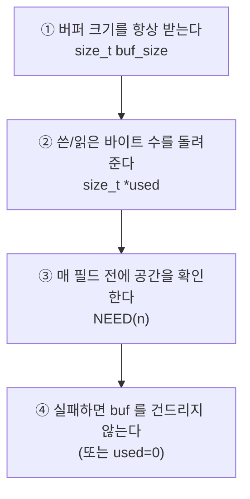

# 3. 바이트 골격 — 비트플래그 · 엔디안 · Pack/Unpack

> **한 문장 요약**
> 구조체를 그대로 네트워크에 던지지 않는다.
> **필드를 하나씩, 바이트 순서를 명시해서, 버퍼에 옮긴다.**
> 이 과정을 `pack`/`unpack` 함수 한 쌍으로 만들면 그 뒤로는 복붙이다.

---

## 0. 왜 구조체를 그대로 보내면 안 되는가

```c
typedef struct {
    uint8_t  type;
    uint32_t length;
    uint16_t code;
} msg_t;

msg_t m = { .type = 1, .length = 100, .code = 200 };
send(fd, &m, sizeof(m), 0);        /* ✗ 절대 금지 */
```

이 코드가 깨지는 이유가 **세 가지**다.

### ① 패딩 — 내 컴파일러가 몰래 넣은 빈 바이트

```text
sizeof(msg_t) == 12  (7이 아니다!)

메모리 배치 (x86-64):
 offset:  0    1    2    3    4    5    6    7    8    9   10   11
        ┌────┬────┬────┬────┬────┬────┬────┬────┬────┬────┬────┬────┐
        │type│ ▓▓ │ ▓▓ │ ▓▓ │      length       │ code    │ ▓▓ │ ▓▓ │
        └────┴────┴────┴────┴────┴────┴────┴────┴────┴────┴────┴────┘
              ↑ 패딩 3바이트              ↑ 4바이트 경계 맞추려고    ↑ 끝 패딩
```

**상대 시스템의 패딩 규칙이 다르면 필드 위치가 어긋난다.**

### ② 엔디안 — 같은 숫자를 반대로 저장한다

```text
uint32_t x = 0x12345678;

little-endian (x86, ARM 기본):   78 56 34 12
big-endian    (네트워크, SPARC): 12 34 56 78
```

### ③ 타입 크기 — 플랫폼마다 다르다

`long` 은 Linux 64비트에서 8바이트, Windows 64비트에서 4바이트다.

> [!IMPORTANT] 해답은 하나뿐
> **바이트 버퍼에 필드를 하나씩, 순서를 명시해서 넣는다.**
> ```c
> uint8_t buf[7];
> size_t  off = 0;
> buf[off++] = m.type;                    /* 1바이트 */
> wr_u32be(buf + off, m.length); off += 4;/* 4바이트 big-endian */
> wr_u16be(buf + off, m.code);   off += 2;/* 2바이트 big-endian */
> send(fd, buf, off, 0);                  /* ✓ 정확히 7바이트 */
> ```
> 이러면 패딩도, 엔디안도, 타입 크기도 **전부 내가 통제**한다.

---

## 1. 엔디안 읽기/쓰기 — 복붙용 전문

```c
/* ══════════════ byteorder.h ══════════════
 *  바이트 단위로만 접근하므로 ── 정렬 문제 없음, 엔디안 무관하게 동작
 * ═══════════════════════════════════════ */
#ifndef BYTEORDER_H
#define BYTEORDER_H

#include <stdint.h>
#include <string.h>

/* ── 읽기: 바이트 버퍼 → 정수 (big-endian, 네트워크 순서) ── */
static inline uint16_t rd_u16be(const uint8_t *p)
{
    return (uint16_t)((uint16_t)p[0] << 8 | (uint16_t)p[1]);
}

static inline uint32_t rd_u24be(const uint8_t *p)      /* 3바이트 길이 필드용 */
{
    return ((uint32_t)p[0] << 16) | ((uint32_t)p[1] << 8) | (uint32_t)p[2];
}

static inline uint32_t rd_u32be(const uint8_t *p)
{
    return ((uint32_t)p[0] << 24) | ((uint32_t)p[1] << 16)
         | ((uint32_t)p[2] <<  8) | ((uint32_t)p[3]);
}

static inline uint64_t rd_u64be(const uint8_t *p)
{
    return ((uint64_t)rd_u32be(p) << 32) | (uint64_t)rd_u32be(p + 4);
}

/* ── 쓰기: 정수 → 바이트 버퍼 (big-endian) ── */
static inline void wr_u16be(uint8_t *p, uint16_t v)
{
    p[0] = (uint8_t)(v >> 8);
    p[1] = (uint8_t)(v);
}

static inline void wr_u24be(uint8_t *p, uint32_t v)
{
    p[0] = (uint8_t)(v >> 16);
    p[1] = (uint8_t)(v >>  8);
    p[2] = (uint8_t)(v);
}

static inline void wr_u32be(uint8_t *p, uint32_t v)
{
    p[0] = (uint8_t)(v >> 24);
    p[1] = (uint8_t)(v >> 16);
    p[2] = (uint8_t)(v >>  8);
    p[3] = (uint8_t)(v);
}

static inline void wr_u64be(uint8_t *p, uint64_t v)
{
    wr_u32be(p,     (uint32_t)(v >> 32));
    wr_u32be(p + 4, (uint32_t)(v));
}

/* ── little-endian 판 (규격이 LE 를 요구할 때) ── */
static inline uint16_t rd_u16le(const uint8_t *p)
{
    return (uint16_t)((uint16_t)p[1] << 8 | (uint16_t)p[0]);
}

static inline uint32_t rd_u32le(const uint8_t *p)
{
    return ((uint32_t)p[3] << 24) | ((uint32_t)p[2] << 16)
         | ((uint32_t)p[1] <<  8) | ((uint32_t)p[0]);
}

static inline void wr_u16le(uint8_t *p, uint16_t v)
{
    p[0] = (uint8_t)(v);
    p[1] = (uint8_t)(v >> 8);
}

static inline void wr_u32le(uint8_t *p, uint32_t v)
{
    p[0] = (uint8_t)(v);
    p[1] = (uint8_t)(v >>  8);
    p[2] = (uint8_t)(v >> 16);
    p[3] = (uint8_t)(v >> 24);
}

#endif /* BYTEORDER_H */
```

### 1-1. 왜 `htons` 대신 이걸 쓰나

| | `htons` / `ntohl` | 위 함수들 |
| :--- | :--- | :--- |
| 대상 | **정수 → 정수** | **바이트 버퍼 ↔ 정수** |
| 정렬 | 캐스팅하면 정렬 위반 위험 | 바이트 접근이라 **항상 안전** |
| little-endian 지원 | 없음 | 있음 |
| 3바이트(24비트) | 없음 | 있음 |
| 헤더 | `<arpa/inet.h>` (POSIX) | 자체 |

> [!DANGER] `htons` 를 쓸 때의 정렬 함정
> ```c
> uint8_t buf[100];
> uint16_t v = ntohs(*(uint16_t *)(buf + 3));   /* ✗ buf+3 은 홀수 주소 */
> ```
> x86 은 그냥 되지만, **ARM/SPARC 에서는 SIGBUS 로 죽거나 조용히 틀린 값**을 준다.
> `-Wcast-align` 을 켜면 컴파일러가 경고해준다.
> `rd_u16be(buf + 3)` 은 **바이트로만 접근**하므로 어떤 주소에서도 안전하다.
> → [[C] 메모리 정렬(Memory Alignment)](../%5BC%5D%20메모리%20정렬(Memory%20Alignment)과%20aligned_alloc%20—%20CPU%20워드%20경계와%20안전한%20할당%20래퍼.md)

### 1-2. `(uint32_t)` 캐스팅이 왜 필요한가

```c
p[0] << 24                       /* ✗ 위험 */
(uint32_t)p[0] << 24             /* ✓ */
```

`p[0]` 은 `uint8_t` 인데, C의 **정수 승격(integer promotion)** 규칙 때문에
연산 전에 **`int`(보통 32비트, 부호 있음)** 로 바뀐다.
`0x80 << 24 = 0x80000000` 은 `int` 범위를 넘어 **부호 있는 오버플로 = 정의되지 않은 동작(UB)** 이다.

`(uint32_t)` 로 먼저 캐스팅하면 **부호 없는 연산**이 되어 UB 가 사라진다.

> [!TIP] `-fsanitize=undefined` 가 이걸 잡아준다
> 이 UB 는 대부분의 컴파일러에서 "우연히 잘 동작"한다. 그래서 더 위험하다.
> 최적화 수준을 올리거나 컴파일러를 바꾸면 **어느 날 갑자기** 틀려진다.

---

## 2. 비트플래그 — 복붙용 매크로

### 2-1. 기본 조작

```c
/* ══════════════ bitflag.h ══════════════ */
#ifndef BITFLAG_H
#define BITFLAG_H

#include <stdint.h>

/* ── 비트 하나 ───────────────────────────────────── */
#define BIT(_n)              (1u << (_n))

#define BIT_SET(_v, _m)      ((_v) |=  (_m))     /* 켜기 */
#define BIT_CLR(_v, _m)      ((_v) &= ~(_m))     /* 끄기 */
#define BIT_TGL(_v, _m)      ((_v) ^=  (_m))     /* 뒤집기 */
#define BIT_HAS(_v, _m)      (((_v) & (_m)) != 0)  /* 하나라도 켜졌나 */
#define BIT_ALL(_v, _m)      (((_v) & (_m)) == (_m))  /* 전부 켜졌나 */

/* ── 여러 비트 필드 추출/삽입 ────────────────────── */
/*  예: 0b11010110 에서 비트 3~5 (3개) 를 꺼내려면 GET_FIELD(v, 3, 3) */
#define FIELD_MASK(_w)           ((_w) >= 32 ? 0xFFFFFFFFu : (BIT(_w) - 1u))
#define GET_FIELD(_v, _sh, _w)   (((uint32_t)(_v) >> (_sh)) & FIELD_MASK(_w))
#define SET_FIELD(_v, _sh, _w, _x)                                         \
    do {                                                                   \
        (_v) &= ~(FIELD_MASK(_w) << (_sh));                                \
        (_v) |= (((uint32_t)(_x) & FIELD_MASK(_w)) << (_sh));              \
    } while (0)

#endif /* BITFLAG_H */
```

### 2-2. 프로토콜 헤더의 비트 필드 다루기

규격서에 이런 그림이 나오면:

```text
 Octet 1
  7   6   5   4   3   2   1   0
┌───┬───┬───┬───┬───┬───┬───┬───┐
│ V │ P │ X │    CC (4 bits)    │     V=version, P=padding,
└───┴───┴───┴───┴───┴───┴───┴───┘     X=extension, CC=count
```

이렇게 옮긴다.

```c
/* ── 규격서 그림을 그대로 상수로 ─────────────────── */
#define HDR_V_SHIFT    7
#define HDR_V_WIDTH    1
#define HDR_P_SHIFT    6
#define HDR_P_WIDTH    1
#define HDR_X_SHIFT    5
#define HDR_X_WIDTH    1
#define HDR_CC_SHIFT   0
#define HDR_CC_WIDTH   4      /* ★ 비트 4개니까 0~15 */

/* 읽기 */
uint8_t o1 = buf[0];
uint8_t version = (uint8_t)GET_FIELD(o1, HDR_V_SHIFT,  HDR_V_WIDTH);
uint8_t padding = (uint8_t)GET_FIELD(o1, HDR_P_SHIFT,  HDR_P_WIDTH);
uint8_t cc      = (uint8_t)GET_FIELD(o1, HDR_CC_SHIFT, HDR_CC_WIDTH);

/* 쓰기 */
uint32_t o1w = 0;
SET_FIELD(o1w, HDR_V_SHIFT,  HDR_V_WIDTH,  1);
SET_FIELD(o1w, HDR_P_SHIFT,  HDR_P_WIDTH,  0);
SET_FIELD(o1w, HDR_CC_SHIFT, HDR_CC_WIDTH, 3);
buf[0] = (uint8_t)o1w;
```

> [!IMPORTANT] `SET_FIELD` 가 먼저 지우고 넣는 이유
> ```c
> (_v) |= (_x << _sh);        /* ✗ 기존 비트가 남아 있으면 OR 되어 섞인다 */
> ```
> `cc` 가 이미 `0b1111` 인데 `0b0011` 을 OR 하면 여전히 `0b1111` 이다.
> **반드시 해당 자리를 `&= ~mask` 로 지운 뒤 OR 해야** 한다.

> [!WARNING] C의 비트 필드(`unsigned x : 3;`)를 프로토콜에 쓰지 말 것
> ```c
> struct {                     /* ✗ 프로토콜 파싱에 쓰면 안 된다 */
>     unsigned version : 1;
>     unsigned padding : 1;
>     unsigned cc      : 4;
> } hdr;
> ```
> **비트를 어느 쪽부터 채울지가 컴파일러마다 다르다** (표준이 정하지 않음).
> GCC/x86 과 다른 환경에서 결과가 뒤집힌다.
> 반드시 **시프트와 마스크로 직접** 다룬다.
> → [[C] 시프트로 여러 필드를 하나의 정수에 조합하기](../%5BC%5D%20시프트로%20여러%20필드를%20하나의%20정수에%20조합하기%20—%20필드%20패킹.md)

### 2-3. 플래그 집합 — "어떤 옵션이 켜졌나"

```c
/* 각 비트가 독립적인 on/off 를 뜻할 때 */
#define OPT_COMPRESS    BIT(0)
#define OPT_ENCRYPT     BIT(1)
#define OPT_ACK_REQ     BIT(2)
#define OPT_URGENT      BIT(3)
#define OPT_ALL         (OPT_COMPRESS | OPT_ENCRYPT | OPT_ACK_REQ | OPT_URGENT)

uint32_t opts = 0;
BIT_SET(opts, OPT_ENCRYPT | OPT_ACK_REQ);

if (BIT_HAS(opts, OPT_ENCRYPT))      { /* 암호화 하나라도 */ }
if (BIT_ALL(opts, OPT_ENCRYPT | OPT_ACK_REQ)) { /* 둘 다 */ }

BIT_CLR(opts, OPT_ACK_REQ);

/* 디버깅용: 켜진 플래그를 문자열로 */
static const struct { uint32_t bit; const char *name; } g_opt_tbl[] = {
    { OPT_COMPRESS, "COMPRESS" },
    { OPT_ENCRYPT,  "ENCRYPT"  },
    { OPT_ACK_REQ,  "ACK_REQ"  },
    { OPT_URGENT,   "URGENT"   },
};

void opts_to_str(uint32_t v, char *buf, size_t size)
{
    size_t i, off = 0;
    buf[0] = '\0';
    for (i = 0; i < sizeof(g_opt_tbl) / sizeof(g_opt_tbl[0]); i++) {
        if (BIT_HAS(v, g_opt_tbl[i].bit)) {
            off += snprintf(buf + off, (off < size) ? size - off : 0,
                            "%s%s", (off > 0) ? "|" : "", g_opt_tbl[i].name);
        }
    }
    if (off == 0) snprintf(buf, size, "NONE");
}
```

> [!TIP] `to_str` 함수를 반드시 만들어라
> 로그에 `opts=0x0A` 라고 찍히면 아무도 못 읽는다.
> `opts=ENCRYPT|URGENT` 로 찍히면 장애 분석 시간이 10분의 1로 준다.
> **표(table) + 루프**로 만들면 플래그를 추가해도 표에 한 줄만 넣으면 된다.

---

## 3. Pack / Unpack — 구조체 ↔ 바이트

### 3-1. 설계 원칙 네 가지



### 3-2. 복붙용 공간 검사 매크로

```c
/* ══════════════ pack.h ══════════════ */
#ifndef PACK_H
#define PACK_H

#include "common.h"
#include "byteorder.h"

/* 쓰기 전에 공간 확인. off 와 buf_size 라는 지역변수가 있다고 가정 */
#define NEED(_n)                                                          \
    do {                                                                  \
        if (off + (size_t)(_n) > buf_size) {                              \
            LOG_ERR("buffer too small: need %zu, have %zu (%s/%d)",       \
                    off + (size_t)(_n), buf_size, __func__, __LINE__);    \
            return RET_TOO_SMALL;                                         \
        }                                                                 \
    } while (0)

/* 읽기 전에 남은 길이 확인. off 와 len 이라는 지역변수 가정 */
#define HAVE(_n)                                                          \
    do {                                                                  \
        if (off + (size_t)(_n) > len) {                                   \
            LOG_ERR("truncated: need %zu, have %zu (%s/%d)",              \
                    off + (size_t)(_n), len, __func__, __LINE__);         \
            return RET_BAD_FORMAT;                                        \
        }                                                                 \
    } while (0)

#define PUT_U8(_v)   do { NEED(1); buf[off] = (uint8_t)(_v);    off += 1; } while (0)
#define PUT_U16(_v)  do { NEED(2); wr_u16be(buf + off, (_v));   off += 2; } while (0)
#define PUT_U24(_v)  do { NEED(3); wr_u24be(buf + off, (_v));   off += 3; } while (0)
#define PUT_U32(_v)  do { NEED(4); wr_u32be(buf + off, (_v));   off += 4; } while (0)
#define PUT_U64(_v)  do { NEED(8); wr_u64be(buf + off, (_v));   off += 8; } while (0)
#define PUT_BYTES(_p, _n)                                                 \
    do { NEED(_n); memcpy(buf + off, (_p), (_n)); off += (size_t)(_n); } while (0)

#define GET_U8(_v)   do { HAVE(1); (_v) = buf[off];             off += 1; } while (0)
#define GET_U16(_v)  do { HAVE(2); (_v) = rd_u16be(buf + off);  off += 2; } while (0)
#define GET_U24(_v)  do { HAVE(3); (_v) = rd_u24be(buf + off);  off += 3; } while (0)
#define GET_U32(_v)  do { HAVE(4); (_v) = rd_u32be(buf + off);  off += 4; } while (0)
#define GET_U64(_v)  do { HAVE(8); (_v) = rd_u64be(buf + off);  off += 8; } while (0)
#define GET_BYTES(_p, _n)                                                 \
    do { HAVE(_n); memcpy((_p), buf + off, (_n)); off += (size_t)(_n); } while (0)

#endif /* PACK_H */
```

> [!IMPORTANT] `HAVE` 가 없으면 **버퍼 오버리드 취약점**이다
> 네트워크에서 온 패킷은 **잘려 있을 수 있고, 악의적으로 조작됐을 수도** 있다.
> 길이 검사 없이 `rd_u32be(buf + off)` 를 하면 **버퍼 밖을 읽는다.**
> 이건 크래시로 끝나면 다행이고, 보통 **정보 유출 취약점**이 된다.
> **읽기 전 검사는 선택이 아니다.**

### 3-3. Pack 함수 (구조체 → 바이트)

```c
/* ══════════════ {{모듈}}_codec.c ══════════════ */

/*  buf      : 쓸 버퍼
 *  buf_size : 버퍼 크기 (여기를 넘으면 RET_TOO_SMALL)
 *  out_len  : 실제로 쓴 바이트 수 (성공 시에만 유효)             */
int {{모듈}}_pack(const {{모듈}}_t *m, uint8_t *buf, size_t buf_size, size_t *out_len)
{
    size_t   off = 0;
    uint32_t hdr = 0;
    uint16_t i;

    CHK_PTR(m);
    CHK_PTR(buf);
    CHK_PTR(out_len);

    *out_len = 0;                        /* ★ 실패해도 0 으로 남게 */

    /* ── ① 비트 필드가 있는 첫 옥텟 ── */
    SET_FIELD(hdr, {{필드}}_SHIFT, {{필드}}_WIDTH, m->{{필드}});
    PUT_U8(hdr);

    /* ── ② 고정 길이 필드들 ── */
    PUT_U8 (m->{{u8필드}});
    PUT_U16(m->{{u16필드}});
    PUT_U32(m->{{u32필드}});

    /* ── ③ 가변 길이: 길이를 먼저, 내용을 나중 ── */
    {
        size_t slen = strlen(m->{{문자열}});
        if (slen > 0xFFFF) return RET_TOO_SMALL;
        PUT_U16((uint16_t)slen);
        PUT_BYTES(m->{{문자열}}, slen);       /* ★ 널 종단은 안 보낸다 */
    }

    /* ── ④ 배열: 개수를 먼저 ── */
    PUT_U16(m->{{배열}}_cnt);
    for (i = 0; i < m->{{배열}}_cnt; i++) {
        PUT_U32(m->{{배열}}[i]);
    }

    *out_len = off;                      /* ★ 성공했을 때만 채운다 */
    return RET_OK;
}
```

### 3-4. Unpack 함수 (바이트 → 구조체)

```c
/*  buf      : 받은 데이터
 *  len      : 받은 길이
 *  out_used : 실제로 소비한 바이트 수 (스트림에서 다음 위치 계산용) */
int {{모듈}}_unpack(const uint8_t *buf, size_t len, {{모듈}}_t *m, size_t *out_used)
{
    size_t   off = 0;
    uint8_t  hdr = 0;
    uint16_t slen = 0, i;

    CHK_PTR(buf);
    CHK_PTR(m);
    CHK_PTR(out_used);

    memset(m, 0x00, sizeof(*m));         /* ★ 항상 초기화부터 */
    *out_used = 0;

    /* ── ① 비트 필드 ── */
    GET_U8(hdr);
    m->{{필드}} = (uint8_t)GET_FIELD(hdr, {{필드}}_SHIFT, {{필드}}_WIDTH);

    /* ── ② 고정 길이 ── */
    GET_U8 (m->{{u8필드}});
    GET_U16(m->{{u16필드}});
    GET_U32(m->{{u32필드}});

    /* ── ③ 가변 길이: 길이를 읽고 → 내 버퍼에 들어가는지 확인 → 복사 ── */
    GET_U16(slen);
    if (slen >= sizeof(m->{{문자열}})) {          /* ★★ 이 검사가 핵심 */
        LOG_ERR("string too long(%u >= %zu) (%s/%d)",
                slen, sizeof(m->{{문자열}}), __func__, __LINE__);
        return RET_BAD_FORMAT;
    }
    GET_BYTES(m->{{문자열}}, slen);
    m->{{문자열}}[slen] = '\0';                   /* ★ 널 종단을 내가 붙인다 */

    /* ── ④ 배열: 개수 검사가 반드시 필요 ── */
    GET_U16(m->{{배열}}_cnt);
    if (m->{{배열}}_cnt > MAX_{{배열}}_CNT) {     /* ★★ 이 검사가 핵심 */
        LOG_ERR("array cnt too large(%u > %d) (%s/%d)",
                m->{{배열}}_cnt, MAX_{{배열}}_CNT, __func__, __LINE__);
        return RET_BAD_FORMAT;
    }
    for (i = 0; i < m->{{배열}}_cnt; i++) {
        GET_U32(m->{{배열}}[i]);
    }

    *out_used = off;
    return RET_OK;
}
```

> [!DANGER] 상대가 보낸 길이를 **절대 믿지 마라**
> ```c
> GET_U16(slen);
> GET_BYTES(m->name, slen);       /* ✗ slen 이 9999 면 내 배열을 넘어 쓴다 */
> ```
> `HAVE` 매크로는 **읽는 쪽 버퍼**만 검사한다. **쓰는 쪽(내 구조체)** 은 검사하지 않는다.
> 반드시 `if (slen >= sizeof(m->name)) return RET_BAD_FORMAT;` 를 넣는다.
>
> 이게 **원격 코드 실행 취약점의 교과서적 형태**다. 실제 CVE 의 상당수가 이 패턴이다.

> [!IMPORTANT] 널 종단은 내가 붙인다
> 네트워크로 온 문자열에는 `'\0'` 이 **없다고 가정**한다.
> 있더라도 믿지 않는다 (중간에 `'\0'` 을 심어 보내는 공격이 있다).
> **길이만큼 복사하고, 내가 `'\0'` 을 붙인다.**

### 3-5. Pack ↔ Unpack 왕복 시험 (필수)

```c
static void test_roundtrip(void)
{
    {{모듈}}_t  a, b;
    uint8_t     buf[1024];
    size_t      wlen = 0, rlen = 0;

    /* 값을 채운다 */
    memset(&a, 0x00, sizeof(a));
    a.{{u16필드}} = 0x1234;
    a.{{u32필드}} = 0xDEADBEEF;
    snprintf(a.{{문자열}}, sizeof(a.{{문자열}}), "hello");
    a.{{배열}}_cnt = 2;
    a.{{배열}}[0] = 100; a.{{배열}}[1] = 200;

    /* pack → unpack → 같은가? */
    assert({{모듈}}_pack(&a, buf, sizeof(buf), &wlen) == RET_OK);
    assert({{모듈}}_unpack(buf, wlen, &b, &rlen) == RET_OK);
    assert(wlen == rlen);                        /* ★ 길이가 같아야 */
    assert(memcmp(&a, &b, sizeof(a)) == 0);      /* ★ 내용이 같아야 */

    printf("  [OK] roundtrip (%zu bytes)\n", wlen);
}

static void test_truncated(void)
{
    {{모듈}}_t  a, b;
    uint8_t     buf[1024];
    size_t      wlen = 0, rlen = 0, i;

    memset(&a, 0x00, sizeof(a));
    a.{{u32필드}} = 0x11223344;
    assert({{모듈}}_pack(&a, buf, sizeof(buf), &wlen) == RET_OK);

    /* ★ 1바이트씩 잘라서 넣어본다. 전부 BAD_FORMAT 이어야 하고, 죽으면 안 된다 */
    for (i = 0; i < wlen; i++) {
        assert({{모듈}}_unpack(buf, i, &b, &rlen) == RET_BAD_FORMAT);
    }
    printf("  [OK] truncated (%zu cases)\n", wlen);
}

static void test_small_buffer(void)
{
    {{모듈}}_t  a;
    uint8_t     buf[1024];
    size_t      wlen = 0, i;

    memset(&a, 0x00, sizeof(a));
    assert({{모듈}}_pack(&a, buf, sizeof(buf), &wlen) == RET_OK);

    /* ★ 버퍼를 조금씩 줄여본다. 전부 TOO_SMALL 이어야 한다 */
    for (i = 0; i < wlen; i++) {
        size_t used = 0;
        assert({{모듈}}_pack(&a, buf, i, &used) == RET_TOO_SMALL);
        assert(used == 0);                       /* ★ 실패 시 0 */
    }
    printf("  [OK] small buffer\n");
}
```

> [!IMPORTANT] `test_truncated` 를 꼭 넣어라
> **잘린 패킷을 넣어도 죽지 않는다**는 걸 증명하는 시험이다.
> `-fsanitize=address` 와 같이 돌리면 **버퍼 오버리드가 있으면 즉시 잡힌다.**
> 이 시험 하나가 보안 취약점 대부분을 막는다.

> [!TIP] `memcmp` 로 구조체를 비교할 때 주의
> 구조체에 **패딩**이 있으면 그 쓰레기 값 때문에 `memcmp` 가 실패할 수 있다.
> `memset(&a, 0, sizeof(a))` 로 **양쪽 다 0으로 시작**했다면 패딩도 0이라 비교가 된다.
> 그래서 위 시험에서 `memset` 이 중요하다.

---

### 3-6. 조건부 필드(C)와 tagged union 을 pack / unpack 할 때

구조체 설계 쪽(→ [2번 노트 2-6~2-10](2.%20데이터%20모델%20골격%20—%20규격서%20I·O%20표를%20구조체로.md))에서 **C 필드**와 **union** 을 만들었다면,
바이트로 옮기는 쪽에는 규칙이 세 개 더 붙는다.

| # | 규칙 | 이유 |
| :---: | :--- | :--- |
| 1 | **C 필드는 조건을 pack / unpack 양쪽에서 똑같이 판정**한다 (조건식을 **함수 하나**로 뽑아 공유) | 한쪽만 다르면 "보낸 건 있는데 받는 쪽이 안 읽는다" |
| 2 | **union 은 `switch (tag)` 로 갈라 해당 arm 만 필드 단위로** 쓴다. `memcpy(buf, &u, sizeof(u))` 금지 | 안 쓰는 arm 자리는 쓰레기이고, arm 크기·패딩은 플랫폼마다 다르다 |
| 3 | **와이어 길이는 규격 상수**로 잡는다. `sizeof(arm)` 로 계산하지 않는다 | `sizeof` 에는 패딩이 섞여 **와이어 길이와 달라진다** |

```c
/* 조건식은 pack / unpack 이 함께 쓴다 — 한 곳에서만 정의 */
static int cond_has_ts(uint8_t ver) { return ver == 2; }

/* ── Pack ── */
if (cond_has_ts(m->ver)) {
    if (!m->has_timestamp) return RET_INVALID_ARG;      /* 조건 참인데 없다 */
    PUT_U64(m->timestamp);
} else if (m->has_timestamp) {
    LOG_WRN("timestamp ignored: ver=%u", m->ver);       /* 조건 거짓인데 있다: 정책대로 */
}

switch (m->type) {                                      /* ★ 태그로 갈라 arm 하나만 */
case MSG_REGISTER:    PUT_U16(m->u.reg.ttl);      break;
case MSG_DEREGISTER:  PUT_U8 (m->u.dereg.cause);  break;
default:              break;                            /* ★ default 를 빼지 말 것 */
}

/* ── Unpack ── */
memset(&m->u, 0x00, sizeof(m->u));                      /* ★ 잔재 제거 후에 채운다 */
if (cond_has_ts(m->ver)) { GET_U64(m->timestamp); m->has_timestamp = 1; }

switch (m->type) {
case MSG_REGISTER:    GET_U16(m->u.reg.ttl);      break;
case MSG_DEREGISTER:  GET_U8 (m->u.dereg.cause);  break;
default:              break;
}
```

> [!DANGER] 시험 하나를 반드시 넣는다 — **"안 쓰는 arm 에 쓰레기를 채워도 pack 결과가 같다"**
> ```c
> memset(&a, 0x00, sizeof(a));  a.u.reg.ttl = 300;
> memset(&b, 0xAA, sizeof(b));  b.u.reg.ttl = 300;      /* 나머지 바이트는 전부 0xAA */
> /* pack(a) 와 pack(b) 의 바이트가 같아야 한다 */
> ```
> `memcpy(buf, &m->u, sizeof(m->u))` 로 짜도 **정상 값 시험은 전부 통과한다.** 이 시험만이 그 실수를 잡는다.

---

## 4. TLV — 가변 구조 파싱 골격

규격서에 "Type-Length-Value" 가 나오면 이 골격을 쓴다.

```text
┌──────┬──────────┬───────────────────┐
│ Type │  Length  │   Value (L bytes) │
│  1B  │    2B    │         L         │
└──────┴──────────┴───────────────────┘
      ... 이게 여러 개 반복 ...
```

```c
int {{모듈}}_parse_tlvs(const uint8_t *buf, size_t len, {{모듈}}_t *m)
{
    size_t off = 0;

    CHK_PTR(buf);
    CHK_PTR(m);

    while (off < len) {
        uint8_t  type   = 0;
        uint16_t vlen   = 0;
        size_t   vstart = 0;

        HAVE(1); type = buf[off]; off += 1;
        HAVE(2); vlen = rd_u16be(buf + off); off += 2;
        HAVE(vlen);                            /* ★ 값 길이만큼 남았나 */

        vstart = off;

        switch (type) {
        case TLV_T_{{타입1}}:
            if (vlen != 4) {                   /* ★ 고정 길이 TLV 는 길이도 검사 */
                LOG_ERR("TLV %u bad len %u (%s/%d)", type, vlen, __func__, __LINE__);
                return RET_BAD_FORMAT;
            }
            m->{{필드1}} = rd_u32be(buf + vstart);
            break;

        case TLV_T_{{타입2}}:
            if (vlen >= sizeof(m->{{문자열}})) {  /* ★ 내 버퍼에 들어가나 */
                LOG_ERR("TLV %u too long %u (%s/%d)", type, vlen, __func__, __LINE__);
                return RET_BAD_FORMAT;
            }
            memcpy(m->{{문자열}}, buf + vstart, vlen);
            m->{{문자열}}[vlen] = '\0';
            break;

        default:
            /* ★ 모르는 TLV 는 건너뛴다 (상위 호환성) */
            LOG_DBG("skip unknown TLV type=%u len=%u", type, vlen);
            break;
        }

        off = vstart + vlen;                   /* ★ 무조건 vlen 만큼 전진 */
    }

    return RET_OK;
}
```

> [!IMPORTANT] 모르는 TLV 는 **에러가 아니라 건너뛰기**
> 상대가 새 버전이라 내가 모르는 필드를 보낼 수 있다.
> 거기서 에러를 내면 **버전이 올라갈 때마다 통신이 끊긴다.**
> "모르면 무시" 가 프로토콜 설계의 기본이다 (forward compatibility).

> [!DANGER] `off = vstart + vlen;` 을 잊으면 무한 루프
> `switch` 안에서 실제로 읽은 바이트 수가 `vlen` 과 달라도,
> **항상 `vlen` 만큼 전진**시켜야 다음 TLV 위치가 맞는다.
> `off` 가 안 늘면 `while (off < len)` 이 영원히 돈다 = **서비스 중단**.

---

## 5. 디버깅 — 바이트를 눈으로 보기

```c
/* 16진수 덤프. 패킷 문제의 90%는 이거 하나로 풀린다 */
void hexdump(const char *tag, const uint8_t *buf, size_t len)
{
    size_t i, j;
    char   line[80];
    int    off;

    LOG_DBG("%s (%zu bytes)", tag, len);

    for (i = 0; i < len; i += 16) {
        off = snprintf(line, sizeof(line), "  %04zx: ", i);

        for (j = 0; j < 16; j++) {                     /* 16진수 */
            if (i + j < len) off += snprintf(line + off, sizeof(line) - off,
                                             "%02x ", buf[i + j]);
            else             off += snprintf(line + off, sizeof(line) - off, "   ");
            if (j == 7) off += snprintf(line + off, sizeof(line) - off, " ");
        }

        off += snprintf(line + off, sizeof(line) - off, " |");
        for (j = 0; j < 16 && i + j < len; j++) {      /* ASCII */
            uint8_t c = buf[i + j];
            off += snprintf(line + off, sizeof(line) - off, "%c",
                            (c >= 0x20 && c < 0x7f) ? c : '.');
        }
        snprintf(line + off, sizeof(line) - off, "|");

        LOG_DBG("%s", line);
    }
}
```

```text
출력 예:
  tx packet (23 bytes)
  0000: 01 00 64 00 c8 00 05 68  65 6c 6c 6f 00 02 00 00  |..d....hello....|
  0010: 00 64 00 00 00 c8                                 |.d....|
```

> [!TIP] 송신 직전과 수신 직후에 항상 덤프를 남겨라
> "내가 보낸 게 맞나, 상대가 이상한 걸 보낸 건가" 를 **1초 만에** 판단할 수 있다.
> 로그 레벨을 `DBG` 로 두면 평소엔 안 나오고 필요할 때만 켤 수 있다.

---

## 6. 체크리스트

### 엔디안 · 비트
- [ ] 구조체를 `memcpy`/`send` 로 **그대로 보내지 않는가**
- [ ] 바이트 접근 함수(`rd_*`/`wr_*`)를 쓰는가 (포인터 캐스팅 안 하는가)
- [ ] 시프트 전에 `(uint32_t)` 캐스팅을 했는가
- [ ] C 비트 필드(`unsigned x:3`)를 프로토콜 파싱에 **안 쓰는가**
- [ ] `SET_FIELD` 가 기존 비트를 지우고 넣는가
- [ ] 플래그를 문자열로 바꾸는 `to_str` 이 있는가

### Pack
- [ ] `buf_size` 를 인자로 받는가
- [ ] 쓰기 전마다 `NEED(n)` 으로 공간을 검사하는가
- [ ] `*out_len` 을 **성공할 때만** 채우는가 (실패 시 0)
- [ ] 가변 길이는 **길이 먼저, 내용 나중** 인가
- [ ] 문자열의 널 종단을 **안 보내는가**
- [ ] C 필드의 조건식을 **pack / unpack 이 함께 쓰는가** (3-6)
- [ ] union 을 **`switch (tag)` + `default:`** 로 arm 만 필드 단위로 쓰는가 (`memcpy` 통째 금지)

### Unpack
- [ ] `memset(m, 0, sizeof(*m))` 으로 시작하는가 (union 은 arm 을 채우기 전에 다시 `memset`)
- [ ] 읽기 전마다 `HAVE(n)` 으로 남은 길이를 검사하는가
- [ ] 받은 길이가 **내 버퍼 크기 안에 들어가는지** 검사하는가 ★
- [ ] 배열 개수가 `MAX_*_CNT` 이하인지 검사하는가 ★
- [ ] 문자열에 **내가 널 종단을 붙이는가**
- [ ] TLV 라면 `off = vstart + vlen` 으로 전진하는가
- [ ] 모르는 TLV 를 에러가 아니라 무시하는가

### 시험
- [ ] pack → unpack 왕복이 같은 값인가
- [ ] **안 쓰는 arm 에 쓰레기(0xAA)를 채워도 pack 결과가 같은가** (union 이 있을 때)
- [ ] **1바이트씩 자른 입력** 전부에서 안 죽는가
- [ ] 작은 버퍼로 pack 하면 `RET_TOO_SMALL` 인가
- [ ] `-fsanitize=address` 로 시험이 통과하는가
- [ ] 큰 길이 필드(0xFFFF)를 넣은 악의적 입력에서 안 죽는가

---

## 관련 노트

- [c코드 템플릿 목록](c코드%20템플릿%20목록.md) — 이 폴더의 허브
- [2. 데이터 모델 골격 — 규격서 I/O 표를 구조체로](2.%20데이터%20모델%20골격%20—%20규격서%20I·O%20표를%20구조체로.md) — 앞 단계
- [6. 3GPP 규격 → C 코드 변환 골격](6.%203GPP%20규격%20→%20C%20코드%20변환%20골격.md) — 실제 규격의 옥텟 그림 읽기
- [[C] 비트플래그(Bit Flag) 연산](../%5BC%5D%20비트플래그(Bit%20Flag)%20연산.md)
- [[C] 엔디안(바이트 순서)과 인터넷 체크섬](../%5BC%5D%20엔디안(바이트%20순서)과%20인터넷%20체크섬%20—%20LSB·MSB와%20htons를%20직접%20만들어보기.md)
- [[C] 시프트로 여러 필드를 하나의 정수에 조합하기](../%5BC%5D%20시프트로%20여러%20필드를%20하나의%20정수에%20조합하기%20—%20필드%20패킹.md)
- [[C] 메모리 정렬(Memory Alignment)과 aligned_alloc](../%5BC%5D%20메모리%20정렬(Memory%20Alignment)과%20aligned_alloc%20—%20CPU%20워드%20경계와%20안전한%20할당%20래퍼.md)
- [[Lang] 정수형 크기(uint16_t)와 비트·바이트 메모리 저장 원리](../%5BLang%5D%20정수형%20크기(uint16_t)와%20비트·바이트%20메모리%20저장%20원리.md)
