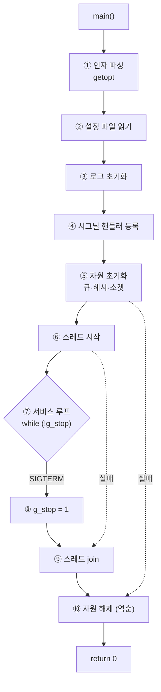
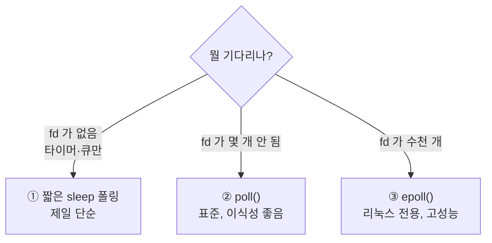
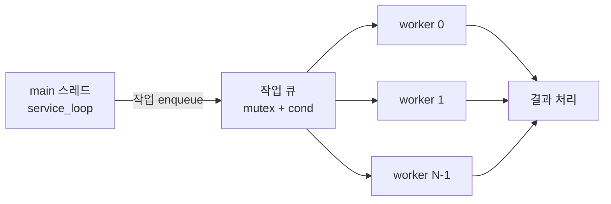

# 4. 데몬 골격 — 순수 POSIX `main` · 시그널 · 스레드 · 폴링루프

> **한 문장 요약**
> 계속 떠 있는 프로그램의 `main()` 은 **다섯 덩어리**다.
> `인자 파싱 → 초기화(순서대로) → 스레드 시작 → 서비스 루프 → 정리(역순)`.
> 그리고 **어디서 실패하든 그 지점까지 잡은 것만 역순으로 푼다.**

---

## 0. 전체 그림



> [!IMPORTANT] 실패 지점에 따라 되돌릴 양이 다르다
> ⑤에서 실패하면 ③④만 되돌리면 되고, ⑥에서 실패하면 ⑤까지 되돌려야 한다.
> 이걸 `if` 로 관리하면 금방 엉킨다. → **`goto` 계단식 cleanup** 으로 푼다 (3장).
>
> 사내 프레임워크 버전은 초기화 단계가 17개까지 늘어난다 →
> [실무 2. main() 골격](../../../../../1.%20실무/텔코웨어/템플릿/2.%20main()%20골격%20—%20초기화%20순서와%20역순%20해제.md)

---

## 1. 시그널 처리 — 제일 먼저 정하고 시작한다

### 1-1. 핵심 규칙: 핸들러 안에서는 "깃발만 든다"

```c
/* ══════════════ 시그널 핸들러 ══════════════ */
#include <signal.h>

static volatile sig_atomic_t g_stop = 0;     /* ★ 타입이 정해져 있다 */

static void sig_handler(int signo)
{
    g_stop = 1;                              /* ★ 이게 전부. 다른 건 하지 않는다 */
    (void)signo;
}
```

> [!DANGER] 시그널 핸들러 안에서 하면 안 되는 것
> - `printf` / `LOG_*` — **재진입 불가**. 락을 잡고 있는 중에 시그널이 오면 교착
> - `malloc` / `free` — 같은 이유로 **힙이 깨진다**
> - 뮤텍스 잠그기 — 교착
> - 복잡한 정리 작업 — 그 사이에 또 시그널이 오면 중첩
>
> **async-signal-safe** 한 함수만 부를 수 있다 (`write`, `_exit`, `signal` 등 극히 일부).
> 그래서 실무에서는 **플래그 하나만 세우고 즉시 빠져나온다.**

> [!IMPORTANT] `volatile sig_atomic_t` 는 관용구가 아니라 필수다
> - **`volatile`**: 컴파일러가 `while (!g_stop)` 을 보고 "이 변수는 안 변하네"라며
>   **루프 밖으로 빼서 무한루프로 최적화**하는 걸 막는다.
> - **`sig_atomic_t`**: 읽기/쓰기가 **중간에 끊기지 않음이 보장**되는 유일한 타입.
>   `int` 도 보통 괜찮지만 표준이 보장하는 건 이것뿐이다.

### 1-2. `sigaction` 을 쓴다 (`signal` 말고)

```c
static int setup_signals(void)
{
    struct sigaction sa;

    memset(&sa, 0x00, sizeof(sa));
    sa.sa_handler = sig_handler;
    sigemptyset(&sa.sa_mask);
    sa.sa_flags = 0;              /* ★ SA_RESTART 를 켜지 않는다 (아래 설명) */

    if (sigaction(SIGINT,  &sa, NULL) < 0) {
        LOG_ERR("sigaction(SIGINT) failed: %s", strerror(errno));
        return RET_FAIL;
    }
    if (sigaction(SIGTERM, &sa, NULL) < 0) {
        LOG_ERR("sigaction(SIGTERM) failed: %s", strerror(errno));
        return RET_FAIL;
    }

    /* ★ SIGPIPE 무시: 끊긴 소켓에 write 하면 프로세스가 죽는 걸 막는다 */
    memset(&sa, 0x00, sizeof(sa));
    sa.sa_handler = SIG_IGN;
    if (sigaction(SIGPIPE, &sa, NULL) < 0) {
        LOG_ERR("sigaction(SIGPIPE) failed: %s", strerror(errno));
        return RET_FAIL;
    }

    return RET_OK;
}
```

| 시그널 | 기본 동작 | 데몬이 해야 할 일 |
| :--- | :--- | :--- |
| `SIGTERM` | 종료 | **정상 종료 시작** (`g_stop = 1`) |
| `SIGINT` | 종료 | 같음 (Ctrl+C) |
| `SIGPIPE` | **프로세스 즉사** | **반드시 `SIG_IGN`** |
| `SIGHUP` | 종료 | 설정 재읽기 (선택) |
| `SIGKILL` | 즉사 | **잡을 수 없다** |

> [!DANGER] `SIGPIPE` 를 무시하지 않으면 서버가 무작위로 죽는다
> 클라이언트가 소켓을 갑자기 끊었을 때 `write` 하면 `SIGPIPE` 가 오고,
> 기본 동작이 **프로세스 종료**다. 로그도 안 남고 그냥 사라진다.
> `SIG_IGN` 으로 두면 `write` 가 `-1` 에 `errno = EPIPE` 를 돌려주므로
> **정상적으로 에러 처리**할 수 있다.

> [!WARNING] `signal()` 함수를 쓰지 말 것
> `signal()` 은 **동작이 플랫폼마다 다르다** (핸들러가 한 번 불리고 기본으로 돌아가는 구현이 있음).
> `sigaction()` 은 POSIX 가 동작을 명확히 정의한다. 무조건 이쪽.

### 1-3. `SA_RESTART` 를 끄는 이유

시그널이 오면 `read`/`accept`/`poll` 같은 **블로킹 호출이 중단**되어 `EINTR` 을 돌려준다.

- `SA_RESTART` **켜면**: 커널이 자동으로 재시작 → 코드는 편하지만 **`g_stop` 을 확인할 기회가 없다**
- `SA_RESTART` **끄면**: `EINTR` 이 올라옴 → 내가 `g_stop` 을 확인하고 나갈 수 있다

```c
/* EINTR 처리 관용구 */
n = poll(fds, nfds, 100);
if (n < 0) {
    if (errno == EINTR) continue;        /* ★ 시그널 때문 → 루프 위로 (g_stop 검사) */
    LOG_ERR("poll failed: %s", strerror(errno));
    break;
}
```

> [!TIP] `EINTR` 검사는 모든 블로킹 호출에 붙인다
> `read`, `write`, `accept`, `poll`, `select`, `sleep` 전부.
> 이걸 빼먹으면 **종료 시그널을 보냈는데 안 죽는** 프로세스가 된다.

---

## 2. 서비스 루프 — 세 가지 방식



### 2-1. ① 짧은 sleep 폴링 (제일 단순)

```c
while (!g_stop) {
    do_periodic_work();                  /* 타이머 검사, 큐 확인 등 */
    usleep(100 * 1000);                  /* 100ms */
}
```

> [!TIP] 종료 반응 시간 = sleep 시간
> `sleep(1)` 이면 SIGTERM 을 보내고 최대 1초를 기다려야 죽는다.
> **100ms 정도**면 사람이 느끼기에 즉시다. 너무 짧으면 CPU 를 낭비한다.
> 사내 프레임워크의 `mpq_fetch(q, &buf, 100)` 도 같은 100ms 다.

### 2-2. ② `poll()` — 표준 방식 (권장)

```c
#include <poll.h>

static int service_loop(ctx_t *ctx)
{
    struct pollfd fds[MAX_FDS];
    nfds_t        nfds = 0;
    int           n, i;

    while (!g_stop) {
        /* ── 매 루프마다 감시 목록을 다시 만든다 ── */
        nfds = 0;
        fds[nfds].fd     = ctx->listen_fd;
        fds[nfds].events = POLLIN;
        nfds++;

        for (i = 0; i < ctx->conn_cnt && nfds < MAX_FDS; i++) {
            fds[nfds].fd     = ctx->conns[i].fd;
            fds[nfds].events = POLLIN;
            nfds++;
        }

        /* ── 100ms 타임아웃: g_stop 을 주기적으로 확인하기 위해 ── */
        n = poll(fds, nfds, 100);

        if (n < 0) {
            if (errno == EINTR) continue;        /* ★ 시그널 */
            LOG_ERR("poll failed: %s", strerror(errno));
            return RET_IO_ERROR;
        }
        if (n == 0) {                            /* 타임아웃 */
            do_periodic_work(ctx);               /* ★ 타이머 처리를 여기서 */
            continue;
        }

        /* ── 이벤트 처리 ── */
        for (i = 0; i < (int)nfds; i++) {
            if (fds[i].revents == 0) continue;

            if (fds[i].revents & (POLLERR | POLLHUP | POLLNVAL)) {
                LOG_WRN("fd %d error (revents=0x%x)", fds[i].fd, fds[i].revents);
                close_conn(ctx, fds[i].fd);
                continue;
            }
            if (fds[i].revents & POLLIN) {
                if (fds[i].fd == ctx->listen_fd) accept_conn(ctx);
                else                              handle_data(ctx, fds[i].fd);
            }
        }
    }
    return RET_OK;
}
```

> [!IMPORTANT] 타임아웃을 `-1`(무한) 로 두지 마라
> `poll(fds, nfds, -1)` 이면 이벤트가 올 때까지 안 깨어나므로
> **`g_stop` 을 확인할 기회가 없다.** 100ms 로 두면 최악 100ms 안에 종료된다.
> (엄밀히는 시그널이 `EINTR` 로 깨워주긴 하지만, 타임아웃이 있으면 **타이머 처리 자리**도 생긴다.)

> [!DANGER] `revents` 에서 에러 비트를 꼭 확인하라
> `POLLIN` 만 보고 `read` 하면, 끊긴 fd 에서 **무한히 0을 읽는 루프**에 빠진다.
> CPU 100%가 되고 서비스가 멈춘다. `POLLERR | POLLHUP | POLLNVAL` 을 먼저 검사한다.

> [!NOTE] fd 가 수천 개면 `epoll`
> `poll` 은 매번 **전체 목록을 커널에 넘긴다.** fd 가 1만 개면 이것만으로 CPU 를 먹는다.
> → [[C] epoll — fd가 많아질 때의 대안](../%5BC%5D%20epoll%20—%20fd가%20많아질%20때의%20대안.md)
> → [[C] select() — 여러 입력과 타임아웃 함께 기다리기](../%5BC%5D%20select()%20—%20여러%20입력과%20타임아웃%20함께%20기다리기.md)

---

## 3. `main()` 골격 — 계단식 cleanup

### 3-1. 복붙용 전문

```c
/* ══════════════ {{프로그램}}_main.c ══════════════ */
#include "common.h"
#include "guard.h"
#include <unistd.h>
#include <signal.h>
#include <pthread.h>
#include <getopt.h>

static volatile sig_atomic_t g_stop = 0;
log_level_t                  g_log_level = LOG_LV_INF;

static void sig_handler(int signo) { g_stop = 1; (void)signo; }

static void usage(const char *prog)
{
    fprintf(stderr,
        "usage: %s [-c config] [-l level] [-d] [-h]\n"
        "  -c <file>   config file path (default: ./{{프로그램}}.conf)\n"
        "  -l <0-3>    log level: 0=ERR 1=WRN 2=INF 3=DBG\n"
        "  -d          run in foreground (do not daemonize)\n"
        "  -h          show this help\n", prog);
}

int main(int argc, char *argv[])
{
    int         ret       = RET_FAIL;
    int         opt       = 0;
    int         foreground= 0;
    const char *conf_path = "./{{프로그램}}.conf";
    {{설정타입}} cfg;
    {{문맥타입}} ctx;

    memset(&cfg, 0x00, sizeof(cfg));
    memset(&ctx, 0x00, sizeof(ctx));

    /* ═══ ① 인자 파싱 ═══════════════════════════════ */
    while ((opt = getopt(argc, argv, "c:l:dh")) != -1) {
        switch (opt) {
        case 'c': conf_path   = optarg;                       break;
        case 'l': g_log_level = (log_level_t)atoi(optarg);    break;
        case 'd': foreground  = 1;                            break;
        case 'h': usage(argv[0]); return 0;
        default:  usage(argv[0]); return 1;
        }
    }

    /* ═══ ② 데몬화 (선택) ═══════════════════════════ */
    if (!foreground) {
        if (daemon(0, 0) < 0) {           /* chdir("/"), 표준입출력 /dev/null */
            fprintf(stderr, "daemon() failed: %s\n", strerror(errno));
            return 1;
        }
    }

    /* ═══ ③ 로그 초기화 ═══════════════════════════════ */
    if (log_init("{{프로그램}}") != RET_OK) {
        fprintf(stderr, "log_init failed\n");
        return 1;
    }
    LOG_INF("======== {{프로그램}} starting (pid=%d) ========", getpid());

    /* ═══ ④ 시그널 (★ 자원 잡기 전에) ═══════════════ */
    if (setup_signals() != RET_OK) goto CLEANUP_LOG;

    /* ═══ ⑤ 설정 읽기 ═══════════════════════════════ */
    if (config_load(conf_path, &cfg) != RET_OK) {
        LOG_ERR("config_load(%s) failed", conf_path);
        goto CLEANUP_LOG;
    }
    LOG_INF("config loaded: %s", conf_path);

    /* ═══ ⑥ 자원 초기화 (순서대로, 실패 시 해당 지점으로) ═══ */
    if (queue_init(&ctx.queue, cfg.queue_size) != RET_OK) goto CLEANUP_LOG;
    if (hash_init(&ctx.hash, cfg.hash_size)    != RET_OK) goto CLEANUP_QUEUE;
    if (net_init(&ctx, &cfg)                   != RET_OK) goto CLEANUP_HASH;

    /* ═══ ⑦ 스레드 시작 ═══════════════════════════════ */
    if (worker_start(&ctx, cfg.worker_cnt)     != RET_OK) goto CLEANUP_NET;

    /* ═══ ⑧ 서비스 루프 ═══════════════════════════════ */
    LOG_INF("======== {{프로그램}} started ========");
    ret = service_loop(&ctx);
    LOG_INF("======== {{프로그램}} stopping ========");

    /* ═══ ⑨⑩ 정리 — 잡은 역순. 라벨이 계단처럼 쌓인다 ═══ */
    worker_stop(&ctx);                  /* ★ 스레드를 먼저 세운다 */
CLEANUP_NET:
    net_destroy(&ctx);
CLEANUP_HASH:
    hash_destroy(&ctx.hash);
CLEANUP_QUEUE:
    queue_destroy(&ctx.queue);
CLEANUP_LOG:
    LOG_INF("======== {{프로그램}} stopped (ret=%s) ========", ret_str(ret));
    log_destroy();

    return (ret == RET_OK) ? 0 : 1;
}
```

### 3-2. 계단식 라벨이 핵심이다

```text
초기화 순서          실패 시 점프 대상        정리 순서
─────────────────────────────────────────────────────
③ log_init      ──┐
④ signals         │
⑤ config          │
⑥-1 queue_init  ──┼─ 실패 → CLEANUP_LOG      ↑ 5. log_destroy
⑥-2 hash_init   ──┼─ 실패 → CLEANUP_QUEUE    ↑ 4. queue_destroy
⑥-3 net_init    ──┼─ 실패 → CLEANUP_HASH     ↑ 3. hash_destroy
⑦ worker_start  ──┴─ 실패 → CLEANUP_NET      ↑ 2. net_destroy
⑧ service_loop                                ↑ 1. worker_stop
```

> [!IMPORTANT] 라벨 이름 = "여기부터 정리 시작"
> `goto CLEANUP_HASH` 는 **"해시부터 아래로 다 정리해"** 라는 뜻이다.
> `net_init` 이 실패했으면 net 은 아직 안 잡혔으니 해시부터 풀면 된다.
>
> 이 구조는 **초기화 단계가 늘어나도 그대로 확장**된다. 새 단계를 중간에 끼워도
> 라벨 하나 추가하고 앞뒤 `goto` 만 맞추면 끝이다.

> [!WARNING] 라벨 순서를 초기화 역순으로 배치해야 한다
> 라벨은 **정의된 순서대로 아래로 흐른다** (fall-through).
> `CLEANUP_NET:` 다음에 `CLEANUP_HASH:` 가 와야 net → hash 순으로 정리된다.
> 순서를 잘못 쓰면 **아직 쓰고 있는 자원을 먼저 해제**한다.

> [!TIP] 성공 경로도 같은 라벨을 타고 내려온다
> `service_loop` 가 끝나면 `worker_stop` → `CLEANUP_NET` → ... 로 **자연스럽게 흘러간다.**
> 성공/실패 정리 코드가 한 벌이라 **불일치가 생길 수 없다.**

---

## 4. 스레드 — 워커 풀 골격

### 4-1. 구조



### 4-2. 복붙용 스레드 안전 큐

```c
/* ══════════════ queue.h / queue.c ══════════════ */
#include <pthread.h>

typedef struct {
    void           **items;         /* ★ 짝: free */
    uint32_t         cap;
    uint32_t         cnt;
    uint32_t         head;
    uint32_t         tail;
    pthread_mutex_t  lock;          /* ★ 짝: pthread_mutex_destroy */
    pthread_cond_t   not_empty;     /* ★ 짝: pthread_cond_destroy */
    int              stopping;      /* 종료 중 표시 */
} queue_t;

int queue_init(queue_t *q, uint32_t cap)
{
    CHK_PTR(q);
    CHK_RANGE(cap, 1, 1000000);

    memset(q, 0x00, sizeof(*q));

    q->items = calloc(cap, sizeof(void *));
    CHK_PTR(q->items);

    if (pthread_mutex_init(&q->lock, NULL) != 0) {
        SAFE_FREE(q->items);                        /* ★ 되돌리기 */
        return RET_FAIL;
    }
    if (pthread_cond_init(&q->not_empty, NULL) != 0) {
        pthread_mutex_destroy(&q->lock);            /* ★ 역순 되돌리기 */
        SAFE_FREE(q->items);
        return RET_FAIL;
    }

    q->cap = cap;
    return RET_OK;
}

void queue_destroy(queue_t *q)
{
    if (q == NULL) return;

    pthread_cond_destroy(&q->not_empty);            /* 잡은 역순 */
    pthread_mutex_destroy(&q->lock);
    SAFE_FREE(q->items);
    memset(q, 0x00, sizeof(*q));
}

int queue_push(queue_t *q, void *item)
{
    int ret = RET_OK;

    CHK_PTR(q);
    CHK_PTR(item);

    pthread_mutex_lock(&q->lock);

    if (q->stopping)          { ret = RET_FAIL;      goto UNLOCK; }
    if (q->cnt >= q->cap)     { ret = RET_TOO_SMALL; goto UNLOCK; }

    q->items[q->tail] = item;
    q->tail = (q->tail + 1) % q->cap;
    q->cnt++;

    pthread_cond_signal(&q->not_empty);             /* 기다리는 워커 하나 깨우기 */

UNLOCK:                                             /* ★ 출구는 한 곳 */
    pthread_mutex_unlock(&q->lock);
    return ret;
}

/*  timeout_ms 동안 기다린다. 큐가 비어 있으면 RET_NOT_FOUND */
int queue_pop(queue_t *q, void **out_item, int timeout_ms)
{
    int             ret = RET_NOT_FOUND;
    struct timespec ts;

    CHK_PTR(q);
    CHK_PTR(out_item);

    *out_item = NULL;

    pthread_mutex_lock(&q->lock);

    if (q->cnt == 0 && !q->stopping) {
        clock_gettime(CLOCK_REALTIME, &ts);
        ts.tv_sec  +=  timeout_ms / 1000;
        ts.tv_nsec += (timeout_ms % 1000) * 1000000L;
        if (ts.tv_nsec >= 1000000000L) {            /* ★ 나노초 자리올림 */
            ts.tv_sec  += 1;
            ts.tv_nsec -= 1000000000L;
        }
        /* ★ while 이지 if 가 아니다 — spurious wakeup 때문 */
        while (q->cnt == 0 && !q->stopping) {
            if (pthread_cond_timedwait(&q->not_empty, &q->lock, &ts) != 0) break;
        }
    }

    if (q->cnt > 0) {
        *out_item = q->items[q->head];
        q->items[q->head] = NULL;
        q->head = (q->head + 1) % q->cap;
        q->cnt--;
        ret = RET_OK;
    }

    pthread_mutex_unlock(&q->lock);
    return ret;
}

/* 종료 신호: 대기 중인 워커를 전부 깨운다 */
void queue_stop(queue_t *q)
{
    if (q == NULL) return;
    pthread_mutex_lock(&q->lock);
    q->stopping = 1;
    pthread_cond_broadcast(&q->not_empty);          /* ★ signal 이 아니라 broadcast */
    pthread_mutex_unlock(&q->lock);
}
```

> [!DANGER] `pthread_cond_wait` 는 반드시 `while` 로 감싼다
> ```c
> if (q->cnt == 0) pthread_cond_wait(&q->not_empty, &q->lock);   /* ✗ */
> while (q->cnt == 0) pthread_cond_wait(&q->not_empty, &q->lock); /* ✓ */
> ```
> **spurious wakeup**: 아무도 signal 하지 않았는데 깨어나는 일이 POSIX 상 허용된다.
> 또 여러 워커가 동시에 깨면 **한 명만 아이템을 가져가고 나머지는 빈 큐**를 본다.
> `if` 로 쓰면 그 상태로 진행해서 **NULL 을 꺼내 죽는다.**

> [!IMPORTANT] 종료할 때는 `broadcast`, 평소에는 `signal`
> - `signal` = 기다리는 것 중 **하나**만 깨움 (아이템 하나에 워커 하나면 충분)
> - `broadcast` = **전부** 깨움 (종료할 때는 전원이 깨어나야 join 이 된다)
>
> 종료 시 `signal` 을 쓰면 **하나만 깨고 나머지는 영원히 대기** → `join` 이 안 끝난다.

### 4-3. 워커 스레드

```c
typedef struct {
    pthread_t   tid;
    int         idx;
    void       *ctx;
} worker_t;

static void *worker_main(void *arg)
{
    worker_t *w   = (worker_t *)arg;
    {{문맥타입}} *ctx = ({{문맥타입}} *)w->ctx;
    void     *item = NULL;

    LOG_INF("worker[%d] started", w->idx);

    while (!g_stop) {
        if (queue_pop(&ctx->queue, &item, 100) != RET_OK) {
            continue;                            /* 타임아웃 → g_stop 재검사 */
        }
        handle_item(ctx, item);                  /* ★ 실제 일 */
        SAFE_FREE(item);                         /* ★ 소비한 쪽이 해제 */
    }

    LOG_INF("worker[%d] stopped", w->idx);
    return NULL;
}

int worker_start({{문맥타입}} *ctx, int cnt)
{
    int i, j;

    CHK_PTR(ctx);
    CHK_RANGE(cnt, 1, MAX_WORKER);

    ctx->workers = calloc(cnt, sizeof(worker_t));
    CHK_PTR(ctx->workers);

    for (i = 0; i < cnt; i++) {
        ctx->workers[i].idx = i;
        ctx->workers[i].ctx = ctx;

        if (pthread_create(&ctx->workers[i].tid, NULL,
                           worker_main, &ctx->workers[i]) != 0) {
            LOG_ERR("pthread_create(%d) failed: %s", i, strerror(errno));

            /* ★ 이미 만든 스레드를 되돌린다 */
            g_stop = 1;
            queue_stop(&ctx->queue);
            for (j = 0; j < i; j++) pthread_join(ctx->workers[j].tid, NULL);
            SAFE_FREE(ctx->workers);
            return RET_FAIL;
        }
    }
    ctx->worker_cnt = cnt;
    return RET_OK;
}

void worker_stop({{문맥타입}} *ctx)
{
    int i;
    if (ctx == NULL || ctx->workers == NULL) return;

    g_stop = 1;                                  /* ① 루프 조건을 끈다 */
    queue_stop(&ctx->queue);                     /* ② 대기 중인 워커를 전부 깨운다 */

    for (i = 0; i < ctx->worker_cnt; i++) {      /* ③ 전부 끝날 때까지 기다린다 */
        pthread_join(ctx->workers[i].tid, NULL);
    }

    SAFE_FREE(ctx->workers);                     /* ④ join 끝난 뒤에 해제 */
    ctx->worker_cnt = 0;
}
```

> [!DANGER] `join` 전에 자원을 해제하면 죽는다
> 워커가 아직 `ctx->queue` 를 쓰고 있는데 `queue_destroy` 를 하면
> **use-after-free** 로 즉사한다.
> 반드시 **`g_stop` → `queue_stop` → `join` 전부 완료 → 그 다음에 해제.**
>
> `main()` 의 계단식 cleanup 에서 `worker_stop(&ctx);` 가
> `CLEANUP_NET:` **라벨보다 위**에 있는 이유가 이것이다.

> [!WARNING] `pthread_cancel` 을 쓰지 마라
> 스레드를 강제로 죽이면 **락을 든 채로 죽을 수 있고**, 그러면 그 락은 영원히 안 풀린다.
> 잡고 있던 메모리도 안 풀린다. 반드시 **플래그로 정상 종료를 유도**한다.

### 4-4. 스레드 시작 실패 시 되돌리기

`worker_start` 가 중간에 실패하면 **이미 만든 스레드가 떠 있다.**
그냥 `return RET_FAIL` 하면 그 스레드들이 **해제된 `ctx` 를 계속 쓴다.**

```c
g_stop = 1;                                  /* 루프를 끄고 */
queue_stop(&ctx->queue);                     /* 대기 중인 놈을 깨우고 */
for (j = 0; j < i; j++) pthread_join(...);   /* 만든 만큼만 join */
SAFE_FREE(ctx->workers);
```

> [!IMPORTANT] `j < i` 가 핵심
> `i` 번째에서 실패했으니 **0 ~ i-1 까지만** 만들어져 있다.
> `j < cnt` 로 쓰면 만들어지지 않은 스레드를 join 해서 **정의되지 않은 동작**이 된다.

---

## 5. 설정 파일 읽기 골격

```c
/* ══════════════ 간단한 key=value 파서 ══════════════ */
int config_load(const char *path, {{설정타입}} *cfg)
{
    int    ret = RET_FAIL;
    FILE  *fp  = NULL;
    char   line[512];
    char   key[128], val[256];
    int    lineno = 0;

    CHK_PTR(path);
    CHK_PTR(cfg);

    memset(cfg, 0x00, sizeof(*cfg));

    /* ★ 기본값을 먼저 채운다 — 설정에 없는 항목이 0 이 되지 않도록 */
    cfg->{{포트}}       = {{기본포트}};
    cfg->worker_cnt     = 4;
    cfg->queue_size     = 1024;

    fp = fopen(path, "r");
    if (fp == NULL) {
        LOG_ERR("fopen(%s) failed: %s", path, strerror(errno));
        return RET_IO_ERROR;
    }

    while (fgets(line, sizeof(line), fp) != NULL) {
        lineno++;

        if (line[0] == '#' || line[0] == '\n' || line[0] == '\r') continue;

        /* ★ %127s / %255s — 버퍼 크기보다 1 작게. 안 쓰면 오버플로 */
        if (sscanf(line, " %127[^= \t] = %255[^\n\r]", key, val) != 2) {
            LOG_WRN("%s:%d: cannot parse: %s", path, lineno, line);
            continue;
        }

        if      (strcmp(key, "port")        == 0) cfg->{{포트}}   = atoi(val);
        else if (strcmp(key, "worker_cnt")  == 0) cfg->worker_cnt = atoi(val);
        else if (strcmp(key, "queue_size")  == 0) cfg->queue_size = atoi(val);
        else if (strcmp(key, "log_level")   == 0) g_log_level     = (log_level_t)atoi(val);
        else LOG_WRN("%s:%d: unknown key: %s", path, lineno, key);
    }

    /* ★ 읽은 값이 말이 되는지 검증 */
    if (cfg->worker_cnt < 1 || cfg->worker_cnt > MAX_WORKER) {
        LOG_ERR("worker_cnt(%d) out of range [1,%d]", cfg->worker_cnt, MAX_WORKER);
        goto CLEANUP;
    }
    if (cfg->{{포트}} < 1 || cfg->{{포트}} > 65535) {
        LOG_ERR("port(%d) out of range", cfg->{{포트}});
        goto CLEANUP;
    }

    ret = RET_OK;

CLEANUP:
    SAFE_FCLOSE(fp);
    return ret;
}
```

> [!DANGER] `sscanf("%s", buf)` 에 길이 제한이 없으면 오버플로다
> `%s` 는 **공백 만날 때까지 무한히 쓴다.** 반드시 `%127s` 처럼 **버퍼 크기 - 1** 을 명시한다.
> → [[Lang] strtok_r과 sscanf 문자열 파싱 원리](../%5BLang%5D%20strtok_r과%20sscanf%20문자열%20파싱%20원리%20및%20&save%20동작%20분석.md)

> [!IMPORTANT] 기본값 → 파일 읽기 → 검증 순서
> 기본값을 먼저 채우면 **설정 파일에 없는 항목이 0이 되어 생기는 버그**를 막는다.
> (`worker_cnt = 0` 이면 워커가 하나도 안 뜬다.)

---

## 6. 체크리스트

### 시그널
- [ ] 핸들러가 **플래그만 세우는가** (`printf`/`malloc` 없는가)
- [ ] `volatile sig_atomic_t` 타입인가
- [ ] `signal()` 대신 `sigaction()` 을 쓰는가
- [ ] `SIGPIPE` 를 `SIG_IGN` 했는가 ★
- [ ] 블로킹 호출마다 `EINTR` 을 처리하는가

### main 구조
- [ ] 초기화 실패 시 **그 지점까지만** 되돌리는가 (계단식 라벨)
- [ ] 정리 라벨이 **초기화 역순**으로 배치되어 있는가
- [ ] 성공 경로도 같은 라벨을 타고 내려오는가
- [ ] `-h` 로 usage 가 나오는가
- [ ] 시작/종료 로그를 남기는가 (pid 포함)

### 서비스 루프
- [ ] 루프 조건이 `while (!g_stop)` 인가
- [ ] `poll` 타임아웃이 무한(-1)이 아닌가
- [ ] `revents` 에서 `POLLERR|POLLHUP|POLLNVAL` 을 먼저 보는가
- [ ] 타임아웃 시 주기 작업(타이머 등)을 처리하는가

### 스레드
- [ ] `pthread_cond_wait` 을 **`while`** 로 감쌌는가 ★
- [ ] 종료 시 `broadcast` 를 쓰는가 (`signal` 이 아니라)
- [ ] `g_stop` → `queue_stop` → `join` → 해제 순서인가 ★
- [ ] 스레드 생성 실패 시 **`j < i` 만큼만** join 하는가
- [ ] `pthread_cancel` 을 **안 쓰는가**
- [ ] `mutex_init` / `cond_init` 에 `destroy` 짝이 있는가
- [ ] 큐에서 꺼낸 아이템을 **소비한 쪽이 free** 하는가

### 설정
- [ ] 기본값을 먼저 채우는가
- [ ] `sscanf` 에 **길이 제한**(`%127s`)이 있는가 ★
- [ ] 읽은 뒤 범위 검증을 하는가
- [ ] 모르는 키에 경고만 내고 죽지 않는가

---

## 관련 노트

- [c코드 템플릿 목록](c코드%20템플릿%20목록.md) — 이 폴더의 허브
- [1. 기본 골격 — 리턴코드·가드매크로·단일출구 cleanup](1.%20기본%20골격%20—%20리턴코드·가드매크로·단일출구%20cleanup.md)
- [[C] epoll — fd가 많아질 때의 대안](../%5BC%5D%20epoll%20—%20fd가%20많아질%20때의%20대안.md)
- [[C] select() — 여러 입력과 타임아웃 함께 기다리기](../%5BC%5D%20select()%20—%20여러%20입력과%20타임아웃%20함께%20기다리기.md)
- [[C] pthread_create에 구조체 포인터 넘기기](../%5BC%5D%20pthread_create에%20구조체%20포인터%20넘기기%20—%20void%20포인터와%20이중포인터%20정리.md)
- [[C] 배열 기반 원형 큐(Ring Buffer)](../%5BC%5D%20배열%20기반%20원형%20큐(Ring%20Buffer)%20—%20front·back%20인덱스로%20만드는%20큐.md)
- [[C] 스레드별 전용 큐와 해시 샤딩](../%5BC%5D%20스레드별%20전용%20큐와%20해시%20샤딩%20—%20락%20경합%20없는%20고성능%20워커%20패턴.md)
- [[C] 락 없는 카운터 — GCC 원자적 연산 빌트인과 C11 atomic](../%5BC%5D%20락%20없는%20카운터%20—%20GCC%20원자적%20연산%20빌트인과%20C11%20atomic.md)
- [[C] 함수 포인터와 디스패치 테이블](../%5BC%5D%20함수%20포인터와%20디스패치%20테이블%20—%20switch%20대신%20테이블로%20분기하기.md)
- [실무 2. main() 골격 — 초기화 순서와 역순 해제](../../../../../1.%20실무/텔코웨어/템플릿/2.%20main()%20골격%20—%20초기화%20순서와%20역순%20해제.md) — **사내 프레임워크 버전**
