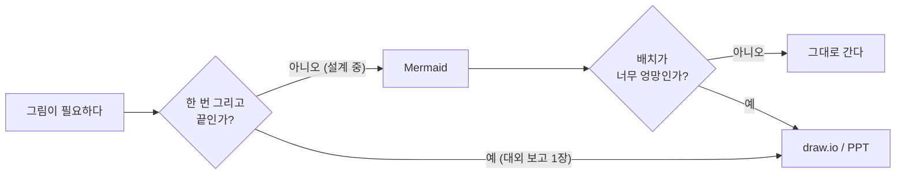
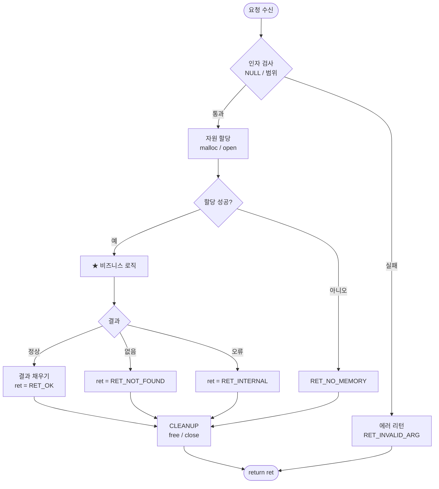
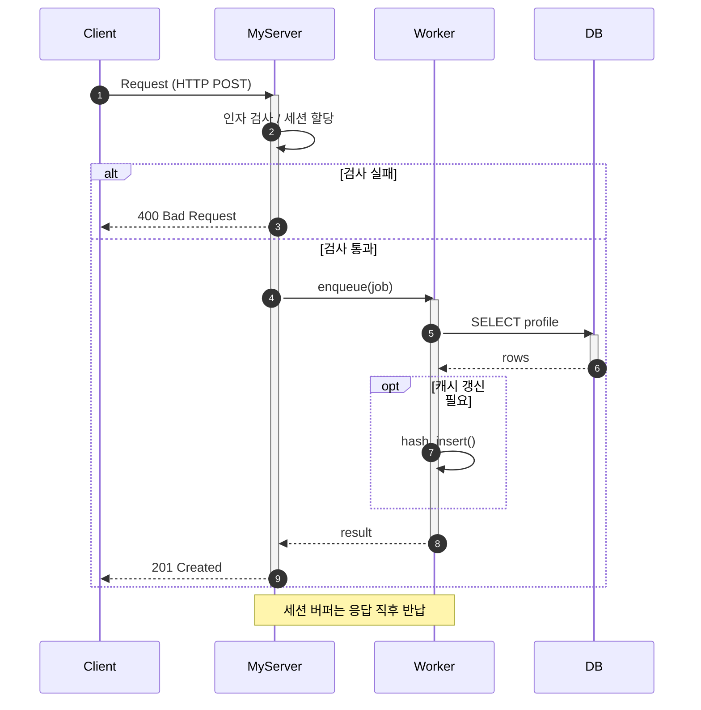
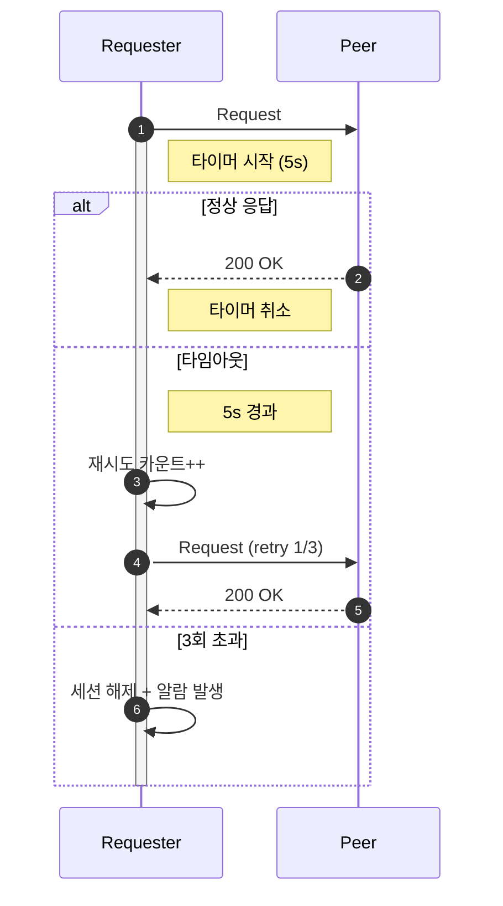
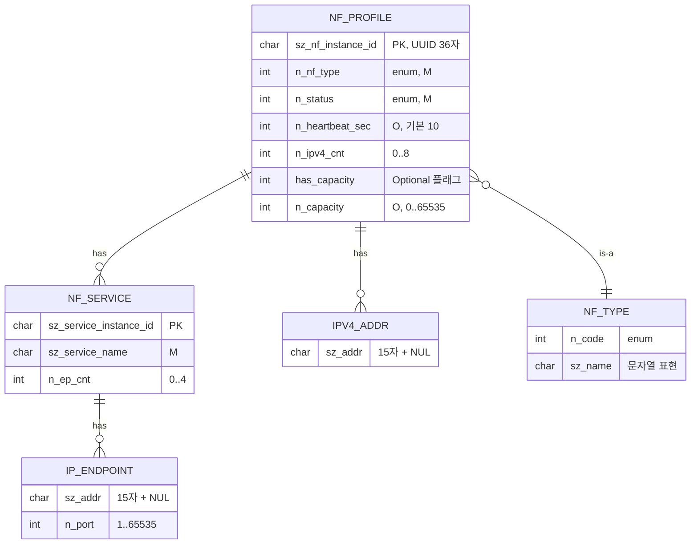
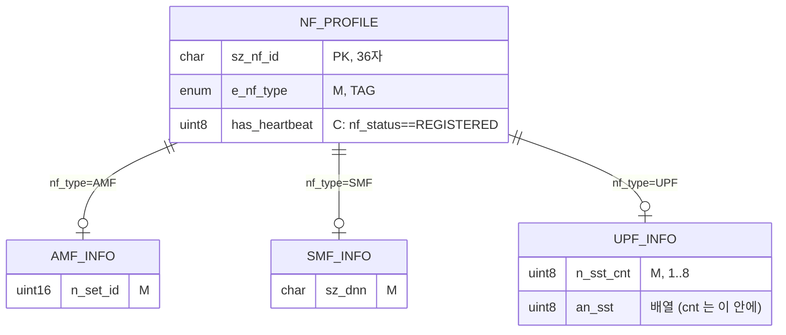
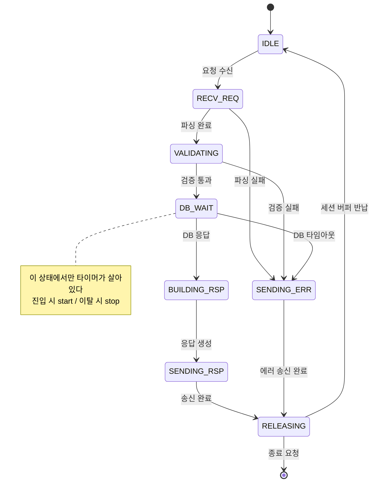
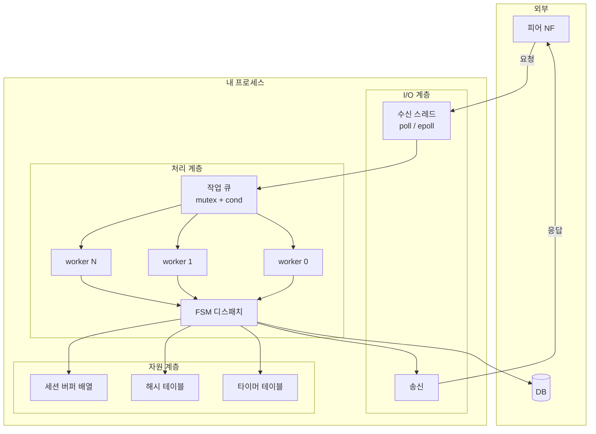
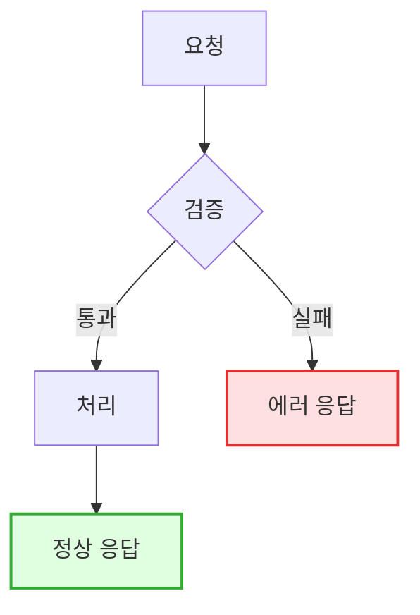

# 5. 설계 산출물 Mermaid 치트시트

> **한 문장 요약**
> 설계서에 들어가는 그림은 **다섯 종류밖에 없다.** 아래 판을 복붙해서 **이름만 바꾼다.**

---

## 0. 왜 draw.io 가 아니라 Mermaid 인가

| 항목 | 손그림 / 파워포인트 | draw.io | **Mermaid** |
| :--- | :--- | :--- | :--- |
| 처음 그리는 시간 | 빠름 | 느림 (박스 정렬) | **빠름 (타이핑)** |
| **수정하는 시간** | 다시 그림 | 박스 옮기고 선 다시 | **한 줄 고침** |
| 버전 관리(git diff) | 불가 | 불가(XML 덩어리) | **텍스트 diff** |
| 리뷰어가 코멘트 | 불가 | 불가 | **줄 단위 가능** |
| Obsidian / Notion | 이미지 첨부 | 이미지 첨부 | **바로 렌더** |
| 배치가 마음에 안 들 때 | 마음대로 | 마음대로 | **못 건드림** ← 유일한 단점 |

> [!IMPORTANT] 판단 기준
> **설계 단계 그림은 반드시 바뀐다.** 한 번 그리고 끝나는 그림은 없다.
> 그래서 "처음 그리는 시간"이 아니라 **"열 번 고치는 시간"**으로 골라야 한다.
> → 기본은 Mermaid. **배치까지 예쁘게 나와야 하는 최종 보고용 1장**만 draw.io.



---

## 1. 다섯 종류밖에 없다

| 무엇을 보여주나 | 그림 종류 | Mermaid 키워드 | 절 |
| :--- | :--- | :--- | :--- |
| **내 함수 안의 분기/흐름** | 순서도 | `flowchart` | [§2](#2-flowchart--함수-흐름--처리-절차) |
| **누가 누구를 부르나 (시간순)** | Call Flow | `sequenceDiagram` | [§3](#3-sequencediagram--call-flow) |
| **데이터가 어떻게 생겼나** | ERD / 구조체 관계 | `erDiagram` | [§4](#4-erdiagram--데이터-구조) |
| **세션이 어떤 상태를 오가나** | 상태도 | `stateDiagram-v2` | [§5](#5-statediagram-v2--상태-전이fsm) |
| **모듈이 어떻게 쌓여있나** | 블록도 | `flowchart` + `subgraph` | [§6](#6-블록도--모듈-구성도) |

> [!TIP] 고르는 법 한 줄
> **"언제"**가 중요하면 sequence, **"어느 쪽으로"**가 중요하면 flowchart,
> **"무엇이 무엇을 가지나"**면 ER, **"지금 어떤 상태냐"**면 state.

---

## 2. flowchart — 함수 흐름 / 처리 절차

### 2-1. 복붙 판



### 2-2. 문법 최소 세트

| 쓰고 싶은 것 | 문법 | 결과 |
| :--- | :--- | :--- |
| 방향 | `flowchart TD` / `LR` | 위→아래 / 왼→오른쪽 |
| 사각형 (처리) | `A["처리"]` | ▭ |
| 마름모 (분기) | `B{"조건?"}` | ◇ |
| 둥근 끝 (시작/끝) | `C(["시작"])` | ⬭ |
| 원통 (DB/파일) | `D[("DB")]` | 🛢 |
| 실선 화살표 | `A --> B` | → |
| 라벨 있는 화살표 | `A -- "성공" --> B` | —성공→ |
| 점선 | `A -.-> B` | ⇢ |
| 굵은 선 (주 경로) | `A ==> B` | ⇒ |
| 줄바꿈 | `A["첫줄<br/>둘째줄"]` | 2줄 |

> [!DANGER] 대괄호 안은 **항상 따옴표**로 감쌀 것
> `A[검사(NULL)]` → **깨진다.** 괄호·콜론·쉼표·`#`·한글 조사 뒤 특수문자가 파서를 죽인다.
> ```
> A["검사(NULL)"]      ← 항상 이렇게
> ```
> 예외 없이 전부 `["..."]` 로 쓰는 습관을 들이면 **평생 안 깨진다.**

### 2-3. 자주 만나는 렌더 문제

| 증상 | 원인 | 해결 |
| :--- | :--- | :--- |
| 그림이 통째로 안 나옴 | 노드 텍스트 특수문자 | 전부 `["..."]` 로 감싸기 |
| `%` 가 안 보임 | `%%` 는 주석 문법 | `#37;` 사용 |
| `"` 를 넣고 싶다 | 따옴표 중첩 | `#quot;` 사용 |
| 화살표 라벨이 깨짐 | 라벨에 특수문자 | `-- "텍스트" -->` 로 따옴표 |
| 노드 ID 충돌 | `end` 를 ID로 씀 | **`end`, `graph`, `class` 는 ID 금지** → `END_`, `NODE_end` |
| 선이 너무 꼬임 | 노드가 15개 넘음 | **그림을 2장으로 쪼갠다** |

> [!WARNING] `end` 함정
> ```
> A --> end        ❌ 파서가 subgraph 종료로 오인 → 전체 붕괴
> A --> END_NODE   ✅
> ```
> 소문자 `end` 는 어디서도 노드 ID 로 쓰지 않는다.

### 2-4. `{{ }}` 채우기 판

```
flowchart TD
    START(["{{ 진입 이벤트 }}"]) --> V{"{{ 검사 조건 }}"}
    V -- "실패" --> ERR["{{ 에러 리턴코드 }}"]
    V -- "통과" --> P1["{{ 처리 1 }}"]
    P1 --> P2["{{ 처리 2 }}"]
    P2 --> D{"{{ 분기 조건 }}"}
    D -- "{{ 케이스 A }}" --> A1["{{ 처리 A }}"]
    D -- "{{ 케이스 B }}" --> B1["{{ 처리 B }}"]
    A1 --> CLEAN["CLEANUP"]
    B1 --> CLEAN
    ERR --> END_(["return"])
    CLEAN --> END_
```

---

## 3. sequenceDiagram — Call Flow

**"누가 누구에게 무엇을 언제"**를 보여줄 때. 규격서의 Call Flow 는 100% 이것이다.

### 3-1. 복붙 판



### 3-2. 문법 최소 세트

| 쓰고 싶은 것 | 문법 |
| :--- | :--- |
| 참가자 (별칭) | `participant S as MyServer` |
| 요청 (실선 화살촉) | `C->>S: 메시지` |
| 응답 (점선) | `S-->>C: 응답` |
| 자기 호출 | `S->>S: 내부 처리` |
| 번호 자동 매김 | `autonumber` (맨 위 1줄) |
| 처리 중 표시 | `activate S` … `deactivate S` |
| 분기 | `alt 조건` / `else 조건` / `end` |
| 선택 (있을 수도) | `opt 조건` … `end` |
| 반복 | `loop N회` … `end` |
| 병렬 | `par A` / `and B` / `end` |
| 설명 붙이기 | `Note over S,W: 텍스트` |
| 한쪽 설명 | `Note right of S: 텍스트` |

> [!TIP] `activate` 는 **꼭 쓰자**
> 세로 막대가 생겨서 **"누가 아직 응답을 기다리는 중인지"**가 한눈에 보인다.
> 타임아웃 설계할 때 이 막대가 긴 구간이 바로 **타이머를 걸어야 하는 구간**이다.

> [!DANGER] `alt` / `opt` / `loop` 는 **반드시 `end` 로 닫는다**
> 안 닫으면 그림이 통째로 안 나온다. 중첩할 때는 **들여쓰기로 짝을 눈으로 확인**할 것.

### 3-3. 타임아웃·재시도를 그리는 관용구



### 3-4. `{{ }}` 채우기 판

```
sequenceDiagram
    autonumber
    participant A as {{ 송신 주체 }}
    participant B as {{ 수신 주체 }}
    participant C as {{ 저장소 }}

    A->>B: {{ 요청 이름 }}
    activate B
    B->>B: {{ 검증 }}
    alt {{ 정상 조건 }}
        B->>C: {{ 조회/저장 }}
        C-->>B: {{ 결과 }}
        B-->>A: {{ 성공 응답코드 }}
    else {{ 실패 조건 }}
        B-->>A: {{ 실패 응답코드 }}
    end
    deactivate B
    Note over A,B: {{ 주의사항 / 자원 해제 시점 }}
```

---

## 4. erDiagram — 데이터 구조

DB 테이블뿐 아니라 **구조체 포함 관계**를 그릴 때도 그대로 쓴다.

### 4-1. 복붙 판



### 4-2. 관계 기호 읽는 법

| 기호 | 의미 | 읽기 |
| :--- | :--- | :--- |
| `\|\|--\|\|` | 1 : 1 | 정확히 하나 |
| `\|\|--o{` | 1 : 0..N | **가장 많이 씀** (배열 멤버) |
| `\|\|--\|{` | 1 : 1..N | 최소 하나는 있어야 함 |
| `}o--o{` | N : M | 중간 테이블 필요 |
| `..` (실선 대신) | 비식별 관계 | `NF \|\|..o{ LOG : ""` |

기호는 **양쪽 끝을 각각 읽는다.** `||--o{` 는 왼쪽 "정확히 1개" + 오른쪽 "0개 이상".

### 4-3. 구조체 → ERD 매핑 규칙

| C 구조체 | ERD |
| :--- | :--- |
| `struct A { ... }` | 엔티티 `A` |
| `int n_x;` | 속성 `int n_x` |
| `B_t st_b;` (값 포함, 1개) | `A \|\|--\|\| B : "has"` |
| `B_t ast_b[8]; int n_cnt;` | `A \|\|--o{ B : "has (max 8)"` |
| `B_t *pst_b;` (동적, 1개) | `A \|\|--o\| B : "has (nullable)"` |
| `int has_x; int n_x;` | 속성 2개 + 코멘트 `"Optional"` |
| 조건부(C) / **tagged union** / `anyOf` | 아래 **4-3b** |
| 해시 키 | 첫 속성에 `"PK"` 코멘트 |

> [!WARNING] 속성 타입에 특수문자 금지
> ERD 속성은 `타입 이름 "코멘트"` 3칸 구조다. **타입 자리에 `*`, `[]`, 공백이 들어가면 깨진다.**
> ```
> char*  psz_name        ❌
> char   sz_name  "포인터"  ✅  ← 포인터/배열은 코멘트로
> ```

### 4-3b. 조건부(C)와 union 을 ERD 에 그리는 법

Mermaid `erDiagram` 에는 union 표기가 없다. 그래서 **관례를 정해서 쓴다.** 리뷰하는 사람이 코드와 1:1 로 매칭할 수 있어야 한다.

| 코드 | ERD 표기 |
| :--- | :--- |
| 단독 C (`has_x` + 조건) | 속성 코멘트에 **`"C: 조건식"`** — 조건 문장을 그대로 |
| **tagged union** 의 태그 | 속성 코멘트에 **`"TAG"`** (판별자가 규격에 이미 있으면 그 필드에 표시) |
| union 의 arm | **arm 마다 엔티티 하나** + 관계 `\|\|--o\|` + 라벨 **`"태그=값"`** |
| `anyOf` / 최소 하나 | 관계 각각 + 코멘트 `"anyOf"` — **`TAG` 를 붙이지 않는다** (union 이 아니라는 표시) |
| 배열 + 개수를 arm 안에 가둠 | arm 엔티티 안에 `cnt` 속성 |



> [!IMPORTANT] "정확히 하나" 는 **그림에서 드러나야 한다**
> 관계선 세 개만 보이면 "셋 다 있을 수 있다" 로 읽힌다. **`TAG` 표시 + 라벨의 `태그=값`** 이 배타임을 알려준다.
> 그림에 `TAG` 가 없는데 코드에 union 이 있으면 **둘 중 하나가 틀린 것**이다.


### 4-4. `{{ }}` 채우기 판

```
erDiagram
    {{ 부모 }} ||--o{ {{ 자식 }} : "has"

    {{ 부모 }} {
        char sz_{{ 키 }} "PK, {{ 길이 }}자"
        int  n_{{ 필드 }} "M, {{ 범위 }}"
        int  has_{{ 옵션 }} "Optional 플래그"
        int  n_{{ 자식 }}_cnt "0..{{ 최대 }}"
    }

    {{ 자식 }} {
        char sz_{{ 필드 }} "{{ 설명 }}"
    }
```

---

## 5. stateDiagram-v2 — 상태 전이(FSM)

세션이 어떤 상태를 오가는지. **FSM 디스패치 테이블을 코드로 짜기 전에 이걸 먼저 그린다.**

### 5-1. 복붙 판



### 5-2. 문법 최소 세트

| 쓰고 싶은 것 | 문법 |
| :--- | :--- |
| 시작 / 끝 | `[*] --> A` / `A --> [*]` |
| 전이 + 이벤트 | `A --> B : 이벤트명` |
| 상태 별칭 | `state "대기 중" as WAIT` |
| 설명 | `note right of A` … `end note` |
| 묶음(복합 상태) | `state 처리중 { A --> B }` |
| 분기(choice) | `state c <<choice>>` |
| 병렬 영역 | `state X { A --> B --||-- C --> D }` |

> [!DANGER] `stateDiagram` 이 아니라 `stateDiagram-v2`
> v1 은 한글·note 처리가 불안정하다. **항상 `-v2` 를 붙인다.**

> [!TIP] 상태도 → 코드로 바로 옮기기
> 상태도의 **화살표 하나 = 디스패치 테이블 한 줄**이다.
> ```c
> /* DB_WAIT --> BUILDING_RSP : DB 응답 */
> { E_EVT_DB_RSP, SIDE_IN, on_db_rsp, &ST_BUILDING_RSP, NULL },
> ```
> 그림에 없는 화살표가 코드에 있으면 **둘 중 하나가 틀린 것**이다.
> 실무 FSM 테이블 문법은 → 4. 요청 처리 골격

### 5-3. `{{ }}` 채우기 판

```
stateDiagram-v2
    [*] --> {{ 초기상태 }}
    {{ 초기상태 }} --> {{ 상태1 }} : {{ 이벤트 }}
    {{ 상태1 }} --> {{ 상태2 }} : {{ 성공 이벤트 }}
    {{ 상태1 }} --> {{ 에러상태 }} : {{ 실패 이벤트 }}
    {{ 상태2 }} --> {{ 해제상태 }} : {{ 완료 }}
    {{ 에러상태 }} --> {{ 해제상태 }} : {{ 완료 }}
    {{ 해제상태 }} --> {{ 초기상태 }} : 자원 반납
    {{ 해제상태 }} --> [*] : 종료

    note right of {{ 타이머_있는_상태 }}
        진입 시 timer_start
        이탈 시 timer_stop
    end note
```

---

## 6. 블록도 — 모듈 구성도

`flowchart` + `subgraph` 로 그린다. **"내 프로세스가 무엇으로 이루어져 있나"**를 1장으로.



| 문법 | 의미 |
| :--- | :--- |
| `subgraph NAME["표시 이름"]` … `end` | 박스로 묶기 |
| `direction TB` (subgraph 안) | 그 박스만 방향 바꾸기 |
| `A --> B & C` | 하나에서 여러 개로 (짧게) |
| `A & B --> C` | 여러 개에서 하나로 |
| `A -->\|"라벨"\| B` | 라벨 (파이프 문법, 짧을 때) |

> [!WARNING] subgraph ID 와 노드 ID 는 **같은 이름공간**
> `subgraph CORE` 를 썼으면 `CORE` 라는 노드를 따로 만들 수 없다.
> subgraph 는 `XXX_G` 처럼 접미사를 붙이는 습관을 들이면 안전하다.

---

## 7. 스타일 — 꼭 필요할 때만

기본 색으로 충분하다. **한 가지 경우만 예외**: 에러 경로를 빨갛게 해서 눈에 띄게 할 때.



```
classDef {{ 클래스명 }} fill:#{{ 배경 }},stroke:#{{ 테두리 }},stroke-width:2px;
class {{ 노드ID1 }},{{ 노드ID2 }} {{ 클래스명 }};
```

> [!TIP] 색은 2개까지
> 빨강(에러) / 초록(정상) 이상 쓰면 **아무도 안 본다.** 색으로 의미를 만들지 말 것.

---

## 8. 깨졌을 때 30초 진단

```mermaid
flowchart TD
    X["그림이 안 나온다"] --> A{"노드 텍스트가<br/>전부 따옴표?"}
    A -- "아니오" --> A1["전부 [\"...\"] 로 감싼다"]
    A -- "예" --> B{"alt/opt/loop/subgraph<br/>end 짝이 맞나?"}
    B -- "아니오" --> B1["end 추가"]
    B -- "예" --> C{"노드 ID 에<br/>end/graph/class 있나?"}
    C -- "예" --> C1["ID 이름 변경"]
    C -- "아니오" --> D{"% \" ( ) 같은<br/>특수문자 있나?"}
    D -- "예" --> D1["#37; #quot; 로 치환"]
    D -- "아니오" --> E["절반씩 지워가며<br/>범인 찾기"]
```

| 이스케이프가 필요한 문자 | 대체 표기 |
| :--- | :--- |
| `"` | `#quot;` |
| `%` | `#37;` |
| `#` | `#35;` |
| `(` `)` | 따옴표 안이면 그대로 OK |
| `<` `>` | `#lt;` `#gt;` |
| 줄바꿈 | `<br/>` |

> [!TIP] 범인 찾는 가장 빠른 방법
> 그림을 **절반 지우고 렌더**한다. 나오면 지운 쪽에 범인이 있다. 다시 절반. 4번이면 찾는다.

---

## 9. 설계서 한 장에 넣는 순서

새 기능 설계서를 쓸 때 **이 순서로 4장**이면 충분하다.

| 순서 | 그림 | 답하는 질문 | 절 |
| :--- | :--- | :--- | :--- |
| 1 | 블록도 | "이 기능이 어느 모듈에 붙나?" | §6 |
| 2 | Call Flow | "메시지가 어떻게 오가나?" | §3 |
| 3 | ERD | "데이터가 어떻게 생겼나?" | §4 |
| 4 | 상태도 **또는** 순서도 | "세션이 어떻게 흘러가나?" | §5 / §2 |

> [!IMPORTANT] 4장을 그리면 코드 절반은 이미 정해진다
> - 블록도 → 파일을 어디에 만들지
> - Call Flow → 함수 시그니처와 타임아웃 구간
> - ERD → 구조체 (→ [2번 노트](2.%20데이터%20모델%20골격%20—%20규격서%20I·O%20표를%20구조체로.md))
> - 상태도 → FSM 테이블 각 줄
>
> 그림 4장에 20분 쓰면 **머리를 쓸 곳이 §5의 비즈니스 로직 하나로 줄어든다.**

---

## 10. 체크리스트

**그리기 전**
- [ ] 이 그림이 답하는 질문이 한 문장으로 나오나
- [ ] 다섯 종류 중 어느 것인지 골랐나 (§1)
- [ ] 노드가 15개를 넘지 않나 (넘으면 쪼갠다)

**문법**
- [ ] 모든 노드 텍스트가 `["..."]` 로 감싸져 있나
- [ ] `alt`/`opt`/`loop`/`subgraph` 의 `end` 짝이 맞나
- [ ] 노드 ID 에 `end` / `graph` / `class` 를 쓰지 않았나
- [ ] `stateDiagram` 에 `-v2` 를 붙였나
- [ ] `%`, `"`, `<`, `>` 를 이스케이프했나

**내용**
- [ ] **에러 경로**가 그려져 있나 (정상 경로만 그린 그림은 쓸모없다)
- [ ] sequence 라면 `activate` 로 대기 구간이 보이나 → 타이머 걸 곳
- [ ] state 라면 화살표 개수 = FSM 테이블 줄 수인가
- [ ] ERD 라면 Optional 필드가 `has_` 로 표시되어 있나
- [ ] ERD 에 C 조건이 **코멘트로**, union 이 **`TAG` + arm 엔티티 + 라벨** 로 표시되어 있나 (4-3b)
- [ ] **자원을 잡는 곳과 놓는 곳이 둘 다 그림에 있나**

---

## 세 줄로 줄인 전부

1. **다섯 종류뿐이다.** flowchart / sequence / ER / state / 블록도. 위 판을 복붙해서 이름만 바꾼다.
2. **전부 `["..."]` 로 감싸라.** 렌더 사고의 90%는 따옴표 안 쓴 특수문자다.
3. **에러 경로를 그려라.** 정상 경로만 있는 그림은 설계서가 아니라 홍보물이다.

---

## 관련 노트

- [c코드 템플릿 목록](c코드%20템플릿%20목록.md) — 상위 허브
- [1. 기본 골격 — 리턴코드·가드매크로·단일출구 cleanup](1.%20기본%20골격%20—%20리턴코드·가드매크로·단일출구%20cleanup.md) — §2 순서도가 이 골격 그대로다
- [2. 데이터 모델 골격 — 규격서 I/O 표를 구조체로](2.%20데이터%20모델%20골격%20—%20규격서%20I·O%20표를%20구조체로.md) — §4 ERD → 구조체
- [4. 데몬 골격 — 순수 POSIX](4.%20데몬%20골격%20—%20순수%20POSIX%20main%20초기화·시그널·스레드·폴링루프.md) — §6 블록도의 실제 코드
- 4. 요청 처리 골격 — 세션버퍼·워커풀·FSM 디스패치 — §5 상태도 → 사내 FSM 테이블
- 코드 템플릿 목록 — 사내 프레임워크 버전 허브
