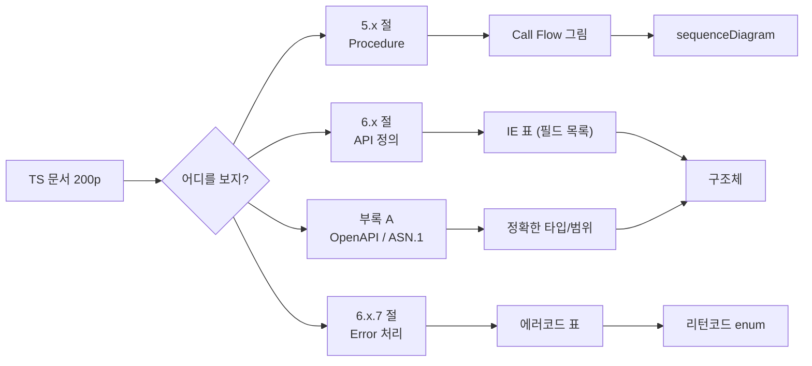
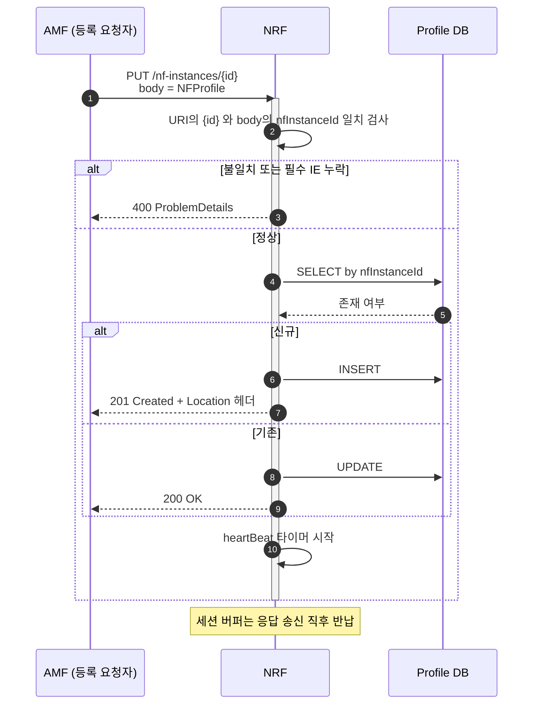

# 6. 3GPP 규격 → C 코드 변환 골격

> **한 문장 요약**
> TS 문서 수백 페이지 중 **실제로 볼 곳은 네 군데**다. 그 네 군데를 표로 옮기고, 표를 구조체로 옮긴다.

---

## 0. 막막함의 정체

TS 29.510 을 열면 200페이지가 넘는다. 그런데 **NF Register 하나를 구현하는 데 필요한 페이지는 6장**이다.

문제는 **그 6장이 어디인지 모른다는 것**이다.



> [!IMPORTANT] 순서를 바꾸지 말 것
> **Call Flow 먼저, IE 표 나중.** 반대로 하면 "이 필드가 언제 오는 건지" 모르는 채로 구조체를 짜게 된다.
> Conditional 필드는 **Call Flow 를 봐야만** 조건을 안다.

---

## 1. 문서 번호 읽는 법

| 번호대 | 무엇 | 예 |
| :--- | :--- | :--- |
| **23.xxx** | **아키텍처·절차** (왜/무엇) | 23.501 (5GS 구조), 23.502 (절차) |
| **24.xxx** | 단말–망 프로토콜 (NAS) | 24.501 (5GS NAS) |
| **29.xxx** | **망 내부 인터페이스** (어떻게) | 29.500 (SBI 공통), 29.510 (NRF), 29.518 (AMF) |
| **38.xxx** | 무선(NR) | 38.413 (NGAP) |
| **33.xxx** | 보안 | 33.501 |

> [!TIP] 구현할 때 펴는 순서
> 1. **23.502** 에서 절차 그림을 본다 → "언제 부르는 API 인가"
> 2. **29.5xx** 에서 IE 표를 본다 → "무엇을 담는가"
> 3. **29.500 / 29.501** 에서 공통 규칙을 본다 → "에러는 어떻게, 헤더는 어떻게"
>
> 23 을 건너뛰고 29 부터 보면 **Conditional 조건을 못 읽는다.**

### 1-1. Release 확인은 필수

문서 파일명 `29510-h50.docx` 에서

| 자리 | 의미 |
| :--- | :--- |
| `29510` | TS 번호 |
| `h` | Release (`f`=15, `g`=16, **`h`=17**, `i`=18) |
| `50` | 버전 (5.0.0) |

> [!DANGER] Release 가 다르면 필드가 다르다
> R15 에는 없던 필드가 R16 에 생긴다. **상용 장비가 어느 Release 인지 먼저 확인**하고,
> 구조체 주석에 `/* R16 신규 */` 를 반드시 남긴다.
> ```c
> char  sz_nf_instance_id[36 + 1];   /* R15~ M */
> int   has_nf_set_id;               /* R16 신규, O */
> char  sz_nf_set_id[63 + 1];
> ```

---

## 2. IE 표 읽는 법 — 5개 칸만 본다

3GPP IE 표는 보통 이렇게 생겼다.

| Attribute name | Data type | P | Cardinality | Description |
| :--- | :--- | :--- | :--- | :--- |
| nfInstanceId | NfInstanceId | M | 1 | UUID |
| nfType | NfType | M | 1 | NF 종류 |
| nfStatus | NfStatus | M | 1 | REGISTERED 등 |
| heartBeatTimer | integer | C | 0..1 | REGISTERED 일 때만 |
| ipv4Addresses | array(Ipv4Addr) | O | 0..N | |
| sNssais | array(Snssai) | O | 1..N | 있으면 최소 1개 |

### 2-1. `P` (Presence) 칸

| 기호 | 뜻 | C 코드에서 |
| :--- | :--- | :--- |
| **M** (Mandatory) | 항상 있어야 함 | 멤버 그대로. **없으면 파싱 에러** |
| **C** (Conditional) | 조건부 | `has_` 플래그 + **조건을 주석에 적는다** |
| **O** (Optional) | 있을 수도 | `has_` 플래그 |
| **CM** | 조건부 필수 | 조건 만족 시 M 과 동일 취급 |

> [!DANGER] C 를 O 로 취급하면 연동시험에서 터진다
> `C` 는 **"조건이 맞으면 반드시 있어야 한다"**는 뜻이다. 없으면 **내가 에러를 내야 한다.**
> ```c
> /* heartBeatTimer: C — nfStatus == REGISTERED 이면 필수 (TS 29.510 6.1.6.2.2) */
> if (p->n_nf_status == NF_STATUS_REGISTERED && !p->has_heartbeat_timer) {
>     return RET_BAD_FORMAT;   /* ★ O 였다면 그냥 통과시켰을 자리 */
> }
> ```
> **조건문에 규격 절 번호를 주석으로 남긴다.** 6개월 뒤 이 줄이 왜 있는지 알 수 있는 유일한 방법이다.

### 2-2. `Cardinality` 칸

| 표기 | 뜻 | C 코드에서 |
| :--- | :--- | :--- |
| `1` | 정확히 1개 | 멤버 1개 |
| `0..1` | 없거나 1개 | `has_` + 멤버 1개 |
| `0..N` | 0개 이상 | 배열 + `n_cnt` (**cnt == 0 정상**) |
| `1..N` | **최소 1개** | 배열 + `n_cnt` (**cnt == 0 이면 에러**) |
| `0..8` | 최대 8개 | 고정 배열 `[8]` + `n_cnt` |
| `0..N` (상한 없음) | 상한을 **내가 정한다** | `MAX_XXX` 상수 + 초과 시 에러 |

> [!WARNING] `0..N` 에서 상한을 안 정하면 그게 취약점이다
> 규격에 상한이 없다고 무한히 받으면 안 된다. **운용상 최대치를 정하고 문서에 적는다.**
> ```c
> #define MAX_IPV4_ADDR   8    /* 규격상 0..N, 운용 상한 8 (초과 시 413 응답) */
> ```

### 2-3. IE 표 → 내 표 3장으로 옮기기

TS 표를 그대로 쓰지 말고 **[2번 노트](2.%20데이터%20모델%20골격%20—%20규격서%20I·O%20표를%20구조체로.md)의 표 3장 형식**으로 다시 적는다.

**표 1 — 입력**

| 규격 필드 | P/Card | 내 타입 | 길이/범위 | 검증 | 비고 |
| :--- | :--- | :--- | :--- | :--- | :--- |
| nfInstanceId | M/1 | `char[37]` | UUID 36자 | 형식 검사 | 해시 키 |
| nfType | M/1 | `enum` | 1..N | 미지값 → 400 | |
| heartBeatTimer | C/0..1 | `int` + `has_` | 1..3600 | **REGISTERED 시 필수** | 29.510 6.1.6.2.2 |
| ipv4Addresses | O/0..N | `char[8][16]` + cnt | 최대 8 | 각각 IPv4 형식 | 초과 시 413 |

**표 2 — 출력** / **표 3 — 에러** 도 같은 방식으로.

---

## 3. 타입 매핑표 — 그대로 복붙

### 3-1. SBI(JSON) 기본 타입

| 규격 Data type | C 타입 | 주의 |
| :--- | :--- | :--- |
| `string` | `char sz_x[N+1]` | **+1 은 NUL.** 길이 상한을 반드시 정한다 |
| `integer` | `int n_x` | 범위가 `0..2^32-1` 이면 `uint32_t` |
| `number` | `double f_x` | 비교에 `==` 금지 |
| `boolean` | `int n_x` (0/1) | `bool` 대신 int 권장(ABI 안정) |
| `enum` (문자열) | `enum` + `to_str`/`from_str` 쌍 | **0 = UNKNOWN** |
| `array(T)` | `T ast_x[MAX]; int n_x_cnt;` | cnt 와 쌍 |
| `object` | 중첩 구조체 | |
| `map(T)` | 키·값 배열 쌍 | `char szk[N][K]; T v[N]; int cnt;` |
| `DateTime` | `char sz_x[32]` 또는 `time_t` | **문자열 보존 권장** (원문 재전송) |
| `Duration` | `int n_x_sec` | ISO8601 파싱 필요 |
| `Uri` | `char sz_x[512]` | 길이 넉넉히 |
| `Binary` | `uint8_t *p; size_t len;` | base64 디코드 후 |

### 3-2. 3GPP 고유 타입 (외우면 편한 것)

| 규격 타입 | 실체 | 권장 C 선언 |
| :--- | :--- | :--- |
| `NfInstanceId` | UUID 문자열 | `char sz_nf_instance_id[36 + 1]` |
| `Supi` | `imsi-450051234567890` | `char sz_supi[63 + 1]` |
| `Gpsi` | `msisdn-...` | `char sz_gpsi[63 + 1]` |
| `Plmnid` | mcc(3) + mnc(2~3) | `char sz_mcc[3+1]; char sz_mnc[3+1];` |
| `Snssai` | sst(0..255) + sd(6 hex) | `int n_sst; int has_sd; char sz_sd[6+1];` |
| `Dnn` | APN 문자열 | `char sz_dnn[100 + 1]` |
| `Tac` | 2 or 3 옥텟 hex | `char sz_tac[6 + 1]` |
| `Ipv4Addr` | 점10진 | `char sz_addr[15 + 1]` |
| `Ipv6Addr` | 콜론16진 | `char sz_addr[45 + 1]` |
| `Guami` | plmnId + amfId | 중첩 구조체 |
| `ProblemDetails` | 에러 본문 | §7 참조 |

> [!TIP] 길이 상수는 한 헤더에 모은다
> ```c
> /* 3gpp_limits.h — 규격 길이를 한 곳에 */
> #define LEN_NF_INSTANCE_ID   36
> #define LEN_SUPI             63
> #define LEN_DNN             100
> #define LEN_IPV4_ADDR        15
> #define LEN_IPV6_ADDR        45
> #define LEN_URI             511
> ```
> 필드마다 `[37]`, `[64]` 를 흩뿌리면 **어디가 규격값이고 어디가 내 마음대로인지 구분이 안 된다.**

---

## 4. Enum — `to_str` / `from_str` 는 항상 쌍으로

규격의 문자열 enum(`"REGISTERED"`, `"AMF"`)은 **양방향 변환 함수를 한 파일에 붙여서** 만든다.

```c
/* nf_type.h */
typedef enum {
    NF_TYPE_UNKNOWN = 0,        /* ★ 0 은 항상 UNKNOWN */
    NF_TYPE_NRF,
    NF_TYPE_AMF,
    NF_TYPE_SMF,
    NF_TYPE_UDM,
    NF_TYPE_AUSF,
    NF_TYPE_PCF,
    NF_TYPE_NSSF,
    NF_TYPE_END                 /* ★ 개수 = NF_TYPE_END */
} nf_type_e;

const char *nf_type_to_str(nf_type_e e);
nf_type_e   nf_type_from_str(const char *s);
```

```c
/* nf_type.c — 표 하나로 양방향 */
#include <string.h>
#include "nf_type.h"

static const char *const g_nf_type_tbl[NF_TYPE_END] = {
    [NF_TYPE_UNKNOWN] = "UNKNOWN",
    [NF_TYPE_NRF]     = "NRF",
    [NF_TYPE_AMF]     = "AMF",
    [NF_TYPE_SMF]     = "SMF",
    [NF_TYPE_UDM]     = "UDM",
    [NF_TYPE_AUSF]    = "AUSF",
    [NF_TYPE_PCF]     = "PCF",
    [NF_TYPE_NSSF]    = "NSSF",
};

const char *nf_type_to_str(nf_type_e e)
{
    if ((int)e <= NF_TYPE_UNKNOWN || (int)e >= NF_TYPE_END) {
        return "UNKNOWN";                   /* ★ 로그에서 절대 NULL 이 안 나오게 */
    }
    return g_nf_type_tbl[e];
}

nf_type_e nf_type_from_str(const char *s)
{
    int i = 0;
    if (s == NULL) { return NF_TYPE_UNKNOWN; }

    for (i = NF_TYPE_UNKNOWN + 1; i < NF_TYPE_END; i++) {
        if (strcmp(s, g_nf_type_tbl[i]) == 0) { return (nf_type_e)i; }
    }
    return NF_TYPE_UNKNOWN;                 /* ★ 미지 값은 에러가 아니라 UNKNOWN */
}
```

> [!IMPORTANT] 왜 미지 값을 에러로 만들지 않나
> 상대가 **나보다 최신 Release** 일 수 있다. R17 장비가 R18 의 새 NF 타입을 보내면
> `from_str` 이 에러를 내는 순간 **멀쩡한 메시지가 통째로 버려진다.**
> → **UNKNOWN 으로 받고, 그 값이 필수 판단에 쓰일 때만 거부**한다.
>
> ```c
> p->e_nf_type = nf_type_from_str(str);
> if (p->e_nf_type == NF_TYPE_UNKNOWN) {
>     /* 이 필드가 M 이면 여기서 400. O 라면 그냥 두고 넘어간다. */
>     return RET_BAD_FORMAT;
> }
> ```

> [!DANGER] 지정 초기화자(`[X] = "..."`)를 쓰는 이유
> ```c
> static const char *g_tbl[] = { "UNKNOWN", "NRF", "AMF", ... };   /* ❌ */
> ```
> enum 중간에 값 하나 추가하면 **표 전체가 한 칸씩 밀린다.** 컴파일은 통과하고 런타임에 전부 틀린다.
> `[NF_TYPE_AMF] = "AMF"` 로 쓰면 **순서가 밀려도 안전**하다.

---

## 5. SBI(JSON) — 파싱과 생성 골격

5GC SBI 는 HTTP/2 + JSON 이다. 여기서는 **jansson** 기준.

### 5-1. 파싱: "꺼내는 매크로" 를 먼저 만든다

```c
/* json_helper.h — 이 4개면 90% 커버된다 */
#ifndef JSON_HELPER_H
#define JSON_HELPER_H

#include <jansson.h>
#include <string.h>
#include "ret.h"          /* ret_t, RET_* */

/* 필수 문자열: 없거나 타입 다르면 즉시 에러 */
#define J_GET_STR_M(_root, _key, _dst)                                        \
    do {                                                                      \
        json_t *_v = json_object_get((_root), (_key));                        \
        const char *_s = NULL;                                                \
        if (_v == NULL || !json_is_string(_v)) {                              \
            LOG_ERR("mandatory '%s' missing (%s/%d)", (_key), __func__, __LINE__); \
            return RET_BAD_FORMAT;                                            \
        }                                                                     \
        _s = json_string_value(_v);                                           \
        if (strlen(_s) >= sizeof(_dst)) {            /* ★★ 길이 초과 = 에러 */ \
            LOG_ERR("'%s' too long (%zu >= %zu) (%s/%d)", (_key),             \
                    strlen(_s), sizeof(_dst), __func__, __LINE__);            \
            return RET_BAD_FORMAT;                                            \
        }                                                                     \
        snprintf((_dst), sizeof(_dst), "%s", _s);                             \
    } while (0)

/* 선택 문자열: 없으면 has_ = 0 로 두고 통과 */
#define J_GET_STR_O(_root, _key, _dst, _has)                                  \
    do {                                                                      \
        json_t *_v = json_object_get((_root), (_key));                        \
        (_has) = 0;                                                           \
        if (_v != NULL && json_is_string(_v)) {                               \
            const char *_s = json_string_value(_v);                           \
            if (strlen(_s) >= sizeof(_dst)) { return RET_BAD_FORMAT; }        \
            snprintf((_dst), sizeof(_dst), "%s", _s);                         \
            (_has) = 1;                                                       \
        }                                                                     \
    } while (0)

/* 필수 정수 + 범위 */
#define J_GET_INT_M(_root, _key, _dst, _lo, _hi)                              \
    do {                                                                      \
        json_t *_v = json_object_get((_root), (_key));                        \
        json_int_t _i = 0;                                                    \
        if (_v == NULL || !json_is_integer(_v)) { return RET_BAD_FORMAT; }    \
        _i = json_integer_value(_v);                                          \
        if (_i < (_lo) || _i > (_hi)) { return RET_OUT_OF_RANGE; }            \
        (_dst) = (int)_i;                                                     \
    } while (0)

/* 선택 정수 + 범위 */
#define J_GET_INT_O(_root, _key, _dst, _has, _lo, _hi)                        \
    do {                                                                      \
        json_t *_v = json_object_get((_root), (_key));                        \
        (_has) = 0;                                                           \
        if (_v != NULL && json_is_integer(_v)) {                              \
            json_int_t _i = json_integer_value(_v);                           \
            if (_i < (_lo) || _i > (_hi)) { return RET_OUT_OF_RANGE; }        \
            (_dst) = (int)_i;                                                 \
            (_has) = 1;                                                       \
        }                                                                     \
    } while (0)

#endif /* JSON_HELPER_H */
```

> [!DANGER] `json_object_get` 은 **borrowed reference** 다
> 반환값을 `json_decref` 하면 **부모가 깨진다.** 해제는 **최상위 `root` 하나만.**
>
> | 함수 | 반환 | 내가 decref 해야 하나 |
> | :--- | :--- | :--- |
> | `json_loads` | new | **예** ← 반드시 |
> | `json_object_get` | borrowed | 아니오 |
> | `json_array_get` | borrowed | 아니오 |
> | `json_object` / `json_array` | new | **예** (부모에 넣었으면 아니오) |
> | `json_string` / `json_integer` | new | `json_object_set_new` 를 쓰면 **아니오** |
> | `json_dumps` | `char*` | **예 — `free()`** |

### 5-2. 파싱 함수 완성본

```c
/* nf_profile_parse.c */
ret_t nf_profile_parse(const char *json_str, size_t len, nf_profile_t *out)
{
    ret_t        ret   = RET_ERROR;
    json_t      *root  = NULL;
    json_error_t jerr;
    json_t      *arr   = NULL;
    size_t       i     = 0;

    CHK_PTR(json_str);
    CHK_PTR(out);

    memset(out, 0, sizeof(*out));

    root = json_loadb(json_str, len, 0, &jerr);          /* ★ 잡음 */
    if (root == NULL) {
        LOG_ERR("json parse failed: %s (line %d) (%s/%d)",
                jerr.text, jerr.line, __func__, __LINE__);
        ret = RET_BAD_FORMAT;
        goto CLEANUP;
    }
    if (!json_is_object(root)) { ret = RET_BAD_FORMAT; goto CLEANUP; }

    /* ---- M 필드 ---- */
    J_GET_STR_M(root, "nfInstanceId", out->sz_nf_instance_id);
    J_GET_STR_M(root, "nfType",       out->sz_nf_type_raw);
    J_GET_STR_M(root, "nfStatus",     out->sz_nf_status_raw);

    out->e_nf_type = nf_type_from_str(out->sz_nf_type_raw);
    if (out->e_nf_type == NF_TYPE_UNKNOWN) {             /* M 이므로 거부 */
        ret = RET_BAD_FORMAT; goto CLEANUP;
    }
    out->e_nf_status = nf_status_from_str(out->sz_nf_status_raw);
    if (out->e_nf_status == NF_STATUS_UNKNOWN) { ret = RET_BAD_FORMAT; goto CLEANUP; }

    /* ---- C 필드: 조건을 코드로 ---- */
    J_GET_INT_O(root, "heartBeatTimer", out->n_heartbeat_timer,
                out->has_heartbeat_timer, 1, 3600);
    /* TS 29.510 6.1.6.2.2 — nfStatus == REGISTERED 이면 heartBeatTimer 는 필수 */
    if (out->e_nf_status == NF_STATUS_REGISTERED && !out->has_heartbeat_timer) {
        LOG_ERR("heartBeatTimer required when REGISTERED (%s/%d)", __func__, __LINE__);
        ret = RET_BAD_FORMAT; goto CLEANUP;
    }

    /* ---- O 필드 ---- */
    J_GET_INT_O(root, "capacity", out->n_capacity, out->has_capacity, 0, 65535);
    J_GET_INT_O(root, "priority", out->n_priority, out->has_priority, 0, 65535);

    /* ---- 배열: 0..N, 운용 상한 MAX_IPV4_ADDR ---- */
    arr = json_object_get(root, "ipv4Addresses");        /* borrowed */
    if (arr != NULL && json_is_array(arr)) {
        size_t cnt = json_array_size(arr);
        if (cnt > MAX_IPV4_ADDR) {
            LOG_ERR("ipv4Addresses too many (%zu > %d) (%s/%d)",
                    cnt, MAX_IPV4_ADDR, __func__, __LINE__);
            ret = RET_TOO_LARGE; goto CLEANUP;           /* → HTTP 413 */
        }
        for (i = 0; i < cnt; i++) {
            json_t     *e = json_array_get(arr, i);      /* borrowed */
            const char *s = NULL;
            if (!json_is_string(e)) { ret = RET_BAD_FORMAT; goto CLEANUP; }
            s = json_string_value(e);
            if (strlen(s) > LEN_IPV4_ADDR) { ret = RET_BAD_FORMAT; goto CLEANUP; }
            snprintf(out->asz_ipv4[i], sizeof(out->asz_ipv4[i]), "%s", s);
        }
        out->n_ipv4_cnt = (int)cnt;
    }
    /* 없으면 n_ipv4_cnt == 0. 0..N 이므로 정상 */

    ret = RET_OK;

CLEANUP:
    if (root != NULL) { json_decref(root); root = NULL; }   /* ★ 놓음 (단 한 곳) */
    return ret;
}
```

> [!DANGER] 매크로 안의 `return` 과 `goto CLEANUP` 이 섞여 있다
> 위 `J_GET_*` 매크로는 `return` 으로 빠진다. **`root` 를 잡은 뒤에 쓰면 누수다.**
> 실제로는 매크로를 **`goto CLEANUP` 버전**으로 바꿔야 한다.
> ```c
> #define J_GET_STR_M_G(_root, _key, _dst)                          \
>     do {                                                          \
>         json_t *_v = json_object_get((_root), (_key));            \
>         if (_v == NULL || !json_is_string(_v)) {                  \
>             ret = RET_BAD_FORMAT; goto CLEANUP;                   \
>         }                                                         \
>         ...                                                       \
>     } while (0)
> ```
> **잡은 자원이 하나라도 있으면 `_G` 버전만 쓴다.** 두 종류를 섞어 쓰는 것이 이 코드의 1번 누수 원인이다.
> (가드 매크로의 암묵적 `ret` 의존은 → [1번 노트 §2](1.%20기본%20골격%20—%20리턴코드·가드매크로·단일출구%20cleanup.md))

### 5-3. 생성(직렬화) 골격

```c
/* 성공 시 *out_str 에 malloc 된 문자열을 넘긴다. 호출자가 free(). */
ret_t nf_profile_to_json(const nf_profile_t *p, char **out_str)
{
    ret_t   ret  = RET_ERROR;
    json_t *root = NULL;
    json_t *arr  = NULL;
    char   *dump = NULL;
    int     i    = 0;

    CHK_PTR(p);
    CHK_PTR(out_str);
    *out_str = NULL;

    root = json_object();                                /* ★ 잡음 */
    if (root == NULL) { ret = RET_NO_MEMORY; goto CLEANUP; }

    /* _set_new: 새로 만든 값의 소유권을 root 에 넘긴다 → 내가 decref 하지 않는다 */
    json_object_set_new(root, "nfInstanceId", json_string(p->sz_nf_instance_id));
    json_object_set_new(root, "nfType",       json_string(nf_type_to_str(p->e_nf_type)));
    json_object_set_new(root, "nfStatus",     json_string(nf_status_to_str(p->e_nf_status)));

    if (p->has_heartbeat_timer) {
        json_object_set_new(root, "heartBeatTimer", json_integer(p->n_heartbeat_timer));
    }
    if (p->has_capacity) {
        json_object_set_new(root, "capacity", json_integer(p->n_capacity));
    }

    if (p->n_ipv4_cnt > 0) {
        arr = json_array();                              /* ★ 잡음 */
        if (arr == NULL) { ret = RET_NO_MEMORY; goto CLEANUP; }
        for (i = 0; i < p->n_ipv4_cnt; i++) {
            json_array_append_new(arr, json_string(p->asz_ipv4[i]));
        }
        json_object_set_new(root, "ipv4Addresses", arr); /* ★ 소유권 이전 */
        arr = NULL;                                      /* ★★ 내 손에서 뗀다 */
    }

    dump = json_dumps(root, JSON_COMPACT);               /* ★ 잡음 (malloc) */
    if (dump == NULL) { ret = RET_ERROR; goto CLEANUP; }

    *out_str = dump;                                     /* ★ 성공할 때만 넘긴다 */
    dump     = NULL;                                     /* ★★ 소유권 이전 */
    ret      = RET_OK;

CLEANUP:
    if (dump != NULL) { free(dump);       dump = NULL; } /* 실패 경로에서만 */
    if (arr  != NULL) { json_decref(arr); arr  = NULL; } /* root 에 못 넣었을 때만 */
    if (root != NULL) { json_decref(root); root = NULL; }
    return ret;
}
```

**자원 짝**

| 잡는 것 | 놓는 것 | 주의 |
| :--- | :--- | :--- |
| `json_loads` / `json_loadb` | `json_decref` | **최상위 root 만** |
| `json_object()` / `json_array()` | `json_decref` | 부모에 `_set_new` 했으면 **하지 않는다** |
| `json_string()` / `json_integer()` | (없음) | `_set_new` / `_append_new` 사용 시 부모가 가져감 |
| `json_object_set` (`_new` 없음) | `json_decref` 필요 | **`_new` 버전만 쓰면 이 줄이 사라진다** |
| `json_dumps` | `free()` | `json_decref` 아님 |
| `json_object_get` | (없음) | borrowed |

> [!IMPORTANT] `_set` 대신 **항상 `_set_new`**
> `json_object_set(o, k, json_string(s))` 는 **`json_string` 이 만든 것을 아무도 해제하지 않는다.** 누수.
> `_new` 접미사만 쓰기로 정하면 이 실수가 구조적으로 불가능해진다.

---

## 6. 바이너리 규격(NAS / NGAP) — IEI·TLV 골격

24.501(NAS), 38.413(NGAP) 같은 **바이너리 규격**은 JSON 이 아니라 **옥텟 단위 IE** 다.
바이트 다루는 기본기는 → [3번 노트](3.%20바이트%20골격%20—%20비트플래그·엔디안·Pack·Unpack.md). 여기서는 **3GPP 고유 포맷**만.

### 6-1. IE 포맷 6종 (24.007 정의)

| 포맷 | 구성 | 언제 |
| :--- | :--- | :--- |
| **V** | Value 만 | 필수·고정 길이 |
| **LV** | Length + Value | 필수·가변 길이 |
| **T** | Tag(IEI) 만 | 존재 자체가 의미 (1옥텟) |
| **TV** | Tag + Value | 선택·고정 길이 |
| **TLV** | Tag + Length(1) + Value | **선택·가변 길이 (가장 흔함)** |
| **TLV-E** | Tag + Length(2) + Value | 값이 255 초과 |

```
TLV  :  [ IEI ][ LEN ][ ........ VALUE ........ ]
           1B     1B            LEN bytes

TLV-E:  [ IEI ][ LEN_HI ][ LEN_LO ][ ...... VALUE ...... ]
           1B      1B        1B            LEN bytes
```

> [!DANGER] LEN 이 **자기 자신과 IEI 를 포함하는지** 규격마다 다르다
> NAS 는 보통 **Value 만**의 길이. 일부 규격은 **헤더 포함** 전체 길이.
> 틀리면 **1~3바이트씩 어긋나며 그 뒤 전부 쓰레기**가 된다.
> → 규격의 예시 옥텟 덤프(Annex)로 **반드시 한 번 맞춰본다.**

### 6-2. TLV 순회 골격 (모르는 IEI 는 건너뛴다)

```c
ret_t nas_parse_optional_ies(const uint8_t *buf, size_t len, nas_msg_t *m)
{
    size_t off = 0;

    CHK_PTR(buf);
    CHK_PTR(m);

    while (off < len) {
        uint8_t iei = buf[off];

        /* --- 상위 니블이 0 이 아니면 TV/T 포맷 (1바이트 IEI 안에 값이 섞임) --- */
        if ((iei & 0x80) != 0) {
            uint8_t tag = (uint8_t)(iei >> 4);      /* 상위 4비트 = IEI */
            uint8_t val = (uint8_t)(iei & 0x0F);    /* 하위 4비트 = 값  */
            off += 1;
            switch (tag) {
            case 0x8: m->has_nas_ksi = 1; m->n_nas_ksi = val; break;
            default:  break;                        /* 모르면 그냥 무시 */
            }
            continue;
        }

        /* --- TLV --- */
        if (off + 2 > len) { return RET_BAD_FORMAT; }   /* ★ IEI+LEN 공간 */
        {
            uint8_t      vlen   = buf[off + 1];
            size_t       vstart = off + 2;

            if (vstart + vlen > len) {                  /* ★★ 넘치면 즉시 거부 */
                LOG_ERR("IE 0x%02X truncated (need %u, have %zu) (%s/%d)",
                        iei, vlen, len - vstart, __func__, __LINE__);
                return RET_BAD_FORMAT;
            }

            switch (iei) {
            case 0x2C:                                   /* 예: 5GS Mobile Identity */
                if (vlen > sizeof(m->a_mobile_id)) { return RET_BAD_FORMAT; }
                memcpy(m->a_mobile_id, &buf[vstart], vlen);
                m->n_mobile_id_len = vlen;
                m->has_mobile_id   = 1;
                break;
            default:
                /* ★ 모르는 IE 는 에러가 아니다. 건너뛴다. (전방 호환) */
                LOG_DBG("skip unknown IE 0x%02X len %u", iei, vlen);
                break;
            }

            off = vstart + vlen;                         /* ★★ 반드시 전진 */
        }
    }
    return RET_OK;
}
```

> [!DANGER] `off` 가 전진하지 않으면 **무한 루프**
> `vlen == 0` 이어도 `off = vstart + vlen` 은 최소 2 증가한다. 이 식을 지켜야 한다.
> `off += vlen;` 처럼 헤더 2바이트를 빼먹으면 **영원히 같은 자리를 돈다.**

### 6-3. 비트 단위 IE (Half Octet)

NAS 는 **한 옥텟에 4비트 필드 두 개**가 흔하다.

```
옥텟 1:  8  7  6  5   4  3  2  1
        +--------+   +--------+
        | Sec.Hdr |  | Protocol Disc. |
```

```c
/* 규격 그림 그대로 상수로 옮긴다 */
#define NAS_PD_MASK        0x0F
#define NAS_PD_SHIFT       0
#define NAS_SEC_HDR_MASK   0xF0
#define NAS_SEC_HDR_SHIFT  4

m->n_protocol_disc = (uint8_t)((buf[0] & NAS_PD_MASK)      >> NAS_PD_SHIFT);
m->n_sec_hdr_type  = (uint8_t)((buf[0] & NAS_SEC_HDR_MASK) >> NAS_SEC_HDR_SHIFT);

/* 쓸 때 */
buf[0] = (uint8_t)(((m->n_sec_hdr_type << NAS_SEC_HDR_SHIFT) & NAS_SEC_HDR_MASK) |
                   ((m->n_protocol_disc << NAS_PD_SHIFT)     & NAS_PD_MASK));
```

> [!WARNING] C 비트필드(`unsigned x : 4;`)를 쓰지 말 것
> 비트 배치 순서가 **컴파일러·엔디안마다 다르다.** 규격 그림대로 나온다는 보장이 전혀 없다.
> 마스크·시프트를 손으로 쓰는 것이 **유일하게 이식 가능한 방법**이다. (→ [3번 노트 §2](3.%20바이트%20골격%20—%20비트플래그·엔디안·Pack·Unpack.md))

### 6-4. ASN.1(NGAP) 은 손으로 짜지 않는다

38.413 의 PER 인코딩은 **직접 구현 대상이 아니다.** 컴파일러(`asn1c` 등)로 생성한다.
내가 짜는 코드는 **생성된 구조체 ↔ 내 구조체 변환**과 **메모리 해제**뿐이다.

| 잡는 것 | 놓는 것 |
| :--- | :--- |
| `asn_decode` / `uper_decode` 가 채운 포인터 | `ASN_STRUCT_FREE(asn_DEF_X, p)` |
| `calloc` 해서 넣은 OPTIONAL 멤버 | 위 한 줄이 재귀적으로 전부 해제 |
| `uper_encode_to_buffer` 출력 버퍼 | 내가 준 버퍼 → 내가 해제 |

> [!DANGER] `ASN_STRUCT_FREE` vs `ASN_STRUCT_RESET`
> `FREE` 는 **구조체 자신까지** 해제한다. 스택 변수에 쓰면 즉시 크래시.
> 스택에 잡은 구조체는 `ASN_STRUCT_RESET(asn_DEF_X, &st)` (내부만 해제).

---

## 7. 에러 응답 — ProblemDetails 와 리턴코드 매핑

SBI 의 에러 본문은 **TS 29.500 5.2.7** 의 `ProblemDetails` 하나로 통일되어 있다.

```json
{
  "type": "/nnrf-nfm/v1/nf-instances",
  "title": "Bad Request",
  "status": 400,
  "detail": "mandatory attribute 'nfType' missing",
  "cause": "MANDATORY_IE_MISSING",
  "invalidParams": [ { "param": "nfType", "reason": "missing" } ]
}
```

### 7-1. 내 리턴코드 → HTTP → cause 3단 매핑표

이 표를 **함수 하나로** 만든다. 흩어지면 반드시 불일치가 생긴다.

| `ret_t` | HTTP | `cause` (29.500 Table 5.2.7.2-1) |
| :--- | :--- | :--- |
| `RET_OK` | 200 / 201 / 204 | — |
| `RET_INVALID_ARG` | 400 | `MANDATORY_IE_INCORRECT` |
| `RET_BAD_FORMAT` | 400 | `MANDATORY_IE_MISSING` |
| `RET_OUT_OF_RANGE` | 400 | `OPTIONAL_IE_INCORRECT` |
| `RET_UNAUTHORIZED` | 401 | `UNAUTHORIZED` |
| `RET_FORBIDDEN` | 403 | `MODIFICATION_NOT_ALLOWED` |
| `RET_NOT_FOUND` | 404 | `RESOURCE_URI_STRUCTURE_NOT_FOUND` |
| `RET_CONFLICT` | 409 | `NF_REGISTRATION_CONFLICT` |
| `RET_TOO_LARGE` | 413 | `PAYLOAD_TOO_LARGE` |
| `RET_NOT_SUPPORTED` | 501 | `UNSUPPORTED_API_VERSION` |
| `RET_NO_MEMORY` / `RET_ERROR` | 500 | `SYSTEM_FAILURE` |
| `RET_TIMEOUT` | 504 | `TARGET_NF_NOT_REACHABLE` |

```c
/* problem.c — 표를 코드 한 곳에 */
typedef struct {
    ret_t       e_ret;
    int         n_http;
    const char *psz_cause;
    const char *psz_title;
} problem_map_t;

static const problem_map_t g_problem_tbl[] = {
    { RET_INVALID_ARG,   400, "MANDATORY_IE_INCORRECT",            "Bad Request"          },
    { RET_BAD_FORMAT,    400, "MANDATORY_IE_MISSING",              "Bad Request"          },
    { RET_OUT_OF_RANGE,  400, "OPTIONAL_IE_INCORRECT",             "Bad Request"          },
    { RET_UNAUTHORIZED,  401, "UNAUTHORIZED",                      "Unauthorized"         },
    { RET_FORBIDDEN,     403, "MODIFICATION_NOT_ALLOWED",          "Forbidden"            },
    { RET_NOT_FOUND,     404, "RESOURCE_URI_STRUCTURE_NOT_FOUND",  "Not Found"            },
    { RET_CONFLICT,      409, "NF_REGISTRATION_CONFLICT",          "Conflict"             },
    { RET_TOO_LARGE,     413, "PAYLOAD_TOO_LARGE",                 "Payload Too Large"    },
    { RET_NOT_SUPPORTED, 501, "UNSUPPORTED_API_VERSION",           "Not Implemented"      },
    { RET_TIMEOUT,       504, "TARGET_NF_NOT_REACHABLE",           "Gateway Timeout"      },
    { RET_ERROR,         500, "SYSTEM_FAILURE",                    "Internal Server Error"},
};

/* 성공 시 *out_body 는 malloc 된 JSON. 호출자가 free(). */
ret_t problem_build(ret_t e_ret, const char *psz_detail,
                    int *out_http, char **out_body)
{
    const problem_map_t *m    = &g_problem_tbl[sizeof(g_problem_tbl)/sizeof(g_problem_tbl[0]) - 1];
    json_t              *root = NULL;
    char                *dump = NULL;
    ret_t                ret  = RET_ERROR;
    size_t               i    = 0;

    CHK_PTR(out_http);
    CHK_PTR(out_body);
    *out_body = NULL;

    for (i = 0; i < sizeof(g_problem_tbl)/sizeof(g_problem_tbl[0]); i++) {
        if (g_problem_tbl[i].e_ret == e_ret) { m = &g_problem_tbl[i]; break; }
    }
    /* 못 찾으면 위에서 잡아둔 마지막 항목(500) 이 쓰인다 */

    root = json_object();
    if (root == NULL) { return RET_NO_MEMORY; }

    json_object_set_new(root, "title",  json_string(m->psz_title));
    json_object_set_new(root, "status", json_integer(m->n_http));
    json_object_set_new(root, "cause",  json_string(m->psz_cause));
    if (psz_detail != NULL && psz_detail[0] != '\0') {
        json_object_set_new(root, "detail", json_string(psz_detail));
    }

    dump = json_dumps(root, JSON_COMPACT);
    if (dump == NULL) { ret = RET_NO_MEMORY; goto CLEANUP; }

    *out_http = m->n_http;
    *out_body = dump;
    dump      = NULL;
    ret       = RET_OK;

CLEANUP:
    if (dump != NULL) { free(dump); dump = NULL; }
    json_decref(root);
    return ret;
}
```

> [!IMPORTANT] `detail` 에 **내부 정보를 넣지 말 것**
> 파일 경로, SQL 문, 스택 정보가 `detail` 로 나가면 그대로 **정보 노출**이다.
> `detail` 은 **"어느 필드가 왜 틀렸나"**까지만. 내부 원인은 **로그에만** 남긴다.
> ```c
> LOG_ERR("db query failed: %s (%s/%d)", db_errmsg(), __func__, __LINE__);  /* 로그 */
> problem_build(RET_ERROR, "internal error", &http, &body);                 /* 응답 */
> ```

---

## 8. 전방 호환 — "모르는 것은 버리지 않는다"

규격은 Release 마다 필드가 늘어난다. **내가 모르는 필드를 만났을 때의 기본 행동**을 정해두지 않으면
상대가 업그레이드하는 순간 내 노드가 죽는다.

| 상황 | 틀린 처리 | 맞는 처리 |
| :--- | :--- | :--- |
| JSON 에 모르는 키가 있다 | 400 에러 | **무시한다** |
| enum 문자열이 모르는 값이다 | 400 에러 | **UNKNOWN** 으로 받고, M 필드일 때만 400 |
| TLV 에 모르는 IEI 가 있다 | 파싱 중단 | **len 만큼 건너뛴다** |
| 배열 원소가 예상보다 많다 | 잘라서 처리 | **상한 초과는 413** (조용히 자르면 안 됨) |
| 내가 그대로 되돌려줘야 하는 필드 | 파싱해서 재조립 | **원문 문자열을 보관**했다가 그대로 |
| API 버전이 상위다 (`v2` 요청) | 500 | **501 `UNSUPPORTED_API_VERSION`** |

> [!DANGER] "조용히 자르기"가 가장 나쁘다
> 배열 10개 중 8개만 저장하고 201 을 주면, 상대는 **10개가 등록된 줄 안다.**
> 장애가 몇 시간 뒤 엉뚱한 곳에서 터지고 원인 추적이 불가능하다.
> **처리 못 할 입력은 반드시 에러로 알린다.**

### 8-1. 원문 보존이 필요한 경우

NRF 처럼 **받은 프로필을 그대로 다른 NF 에게 전달**하는 노드는,
내가 모르는 필드까지 보존해야 한다.

```c
typedef struct {
    /* 내가 해석하는 필드들 */
    char  sz_nf_instance_id[LEN_NF_INSTANCE_ID + 1];
    ...
    /* ★ 원문 전체 — 조회 응답 시 그대로 되돌려준다 */
    char *psz_raw_json;          /* strdup, 해제 짝: free() */
    size_t n_raw_len;
} nf_profile_t;
```

```c
/* 파싱 직후 */
out->psz_raw_json = strndup(json_str, len);      /* ★ 잡음 */
if (out->psz_raw_json == NULL) { ret = RET_NO_MEMORY; goto CLEANUP; }
out->n_raw_len = len;

/* 해제 함수 */
void nf_profile_free(nf_profile_t *p)
{
    if (p == NULL) { return; }
    SAFE_FREE(p->psz_raw_json);                  /* ★ 놓음 */
    p->n_raw_len = 0;
    memset(p, 0, sizeof(*p));
}
```

---

## 9. 실전 — NF Register 하나를 끝까지

TS 29.510 `PUT /nnrf-nfm/v1/nf-instances/{nfInstanceId}` 하나를 **10분 루틴**대로.

### ① Call Flow (23.502 + 29.510 5.2.2.2)



### ② 표 3장

**입력**

| 규격 필드 | P/Card | C 타입 | 검증 | 근거 |
| :--- | :--- | :--- | :--- | :--- |
| (URI) nfInstanceId | M | `char[37]` | UUID 형식 | 5.2.2.2 |
| nfInstanceId | M/1 | `char[37]` | **URI 와 일치** | 6.1.6.2.2 |
| nfType | M/1 | enum | UNKNOWN → 400 | |
| nfStatus | M/1 | enum | | |
| heartBeatTimer | C/0..1 | `int`+`has_` | REGISTERED 시 필수, 1..3600 | 6.1.6.2.2 |
| ipv4Addresses | O/0..N | `char[8][16]`+cnt | 상한 8 → 413 | 운용 결정 |
| nfServices | O/0..N | 구조체 배열 | 상한 16 | |

**출력**

| 상황 | HTTP | 본문 | 헤더 |
| :--- | :--- | :--- | :--- |
| 신규 등록 | 201 | NFProfile | `Location: .../nf-instances/{id}` |
| 갱신 | 200 | NFProfile | — |
| 변경 없음 | 204 | 없음 | — |

**에러**

| 상황 | `ret_t` | HTTP | cause |
| :--- | :--- | :--- | :--- |
| URI≠body id | `RET_INVALID_ARG` | 400 | `MANDATORY_IE_INCORRECT` |
| 필수 누락 | `RET_BAD_FORMAT` | 400 | `MANDATORY_IE_MISSING` |
| 주소 9개 이상 | `RET_TOO_LARGE` | 413 | `PAYLOAD_TOO_LARGE` |
| DB 장애 | `RET_ERROR` | 500 | `SYSTEM_FAILURE` |

### ③~④ 시그니처 + 뼈대

```c
/* nf_register.c */
ret_t nf_register_handle(const nf_register_req_t *req, nf_register_rsp_t *rsp)
{
    ret_t         ret     = RET_ERROR;
    nf_profile_t  profile;
    int           is_new  = 0;

    CHK_PTR(req);
    CHK_PTR(rsp);

    memset(&profile, 0, sizeof(profile));
    memset(rsp,      0, sizeof(*rsp));

    /* 1) 본문 파싱 (§5-2) */
    ret = nf_profile_parse(req->psz_body, req->n_body_len, &profile);   /* ★ 잡음 */
    CHK_RET_GOTO(ret, CLEANUP);

    /* 2) URI 와 body 일치 (29.510 6.1.6.2.2) */
    if (strcmp(req->sz_uri_nf_instance_id, profile.sz_nf_instance_id) != 0) {
        LOG_ERR("id mismatch uri[%s] body[%s] (%s/%d)",
                req->sz_uri_nf_instance_id, profile.sz_nf_instance_id,
                __func__, __LINE__);
        ret = RET_INVALID_ARG;
        goto CLEANUP;
    }

    /* 3) ★ 비즈니스 로직 — 여기서만 머리를 쓴다 */
    ret = profile_db_upsert(&profile, &is_new);
    CHK_RET_GOTO(ret, CLEANUP);

    if (profile.has_heartbeat_timer) {
        ret = heartbeat_timer_start(profile.sz_nf_instance_id,
                                    profile.n_heartbeat_timer);
        CHK_RET_GOTO(ret, CLEANUP);
    }

    /* 4) 응답 생성 */
    ret = nf_profile_to_json(&profile, &rsp->psz_body);   /* ★ 잡음(호출자 free) */
    CHK_RET_GOTO(ret, CLEANUP);

    rsp->n_http = is_new ? 201 : 200;
    if (is_new) {
        snprintf(rsp->sz_location, sizeof(rsp->sz_location),
                 "%s/nf-instances/%s", g_sz_api_root, profile.sz_nf_instance_id);
    }
    ret = RET_OK;

CLEANUP:
    nf_profile_free(&profile);                            /* ★ 놓음 */
    if (ret != RET_OK) {
        SAFE_FREE(rsp->psz_body);                         /* 실패 시 응답 본문도 정리 */
        (void)problem_build(ret, NULL, &rsp->n_http, &rsp->psz_body);
    }
    return ret;
}
```

> [!TIP] 실패해도 `rsp` 는 채워서 돌려준다
> 상위(HTTP 계층)는 `ret` 을 보지 않고 **`rsp->n_http` 와 `rsp->psz_body` 만 보고 송신**하면 된다.
> 에러 응답 조립이 핸들러마다 흩어지지 않는다.

### ⑦ 시험 3개 + 규격 시험 1개

```c
static void test_normal(void)     { /* 정상 프로필 → 201 */ }
static void test_id_mismatch(void){ /* URI≠body → 400 MANDATORY_IE_INCORRECT */ }
static void test_null(void)       { assert(nf_register_handle(NULL, &rsp) == RET_INVALID_ARG); }

/* ★ 3GPP 전용: 규격 부록의 예시 JSON 을 그대로 넣어본다 */
static void test_spec_example(void)
{
    /* TS 29.510 Annex 의 예시를 파일로 저장해두고 그대로 파싱 */
    ...
}
```

> [!IMPORTANT] 규격 부록의 예시를 시험 데이터로 쓸 것
> 내가 만든 입력으로만 시험하면 **내가 오해한 부분은 영원히 못 찾는다.**
> 규격 Annex 예시가 통과하면 최소한 **해석이 틀리지는 않았다**는 뜻이다.

---

## 10. 자주 하는 실수

| 실수 | 결과 | 방어 |
| :--- | :--- | :--- |
| `C` 를 `O` 로 취급 | 연동시험 실패 | 조건을 `if` 로 + 절 번호 주석 |
| 문자열 길이 상한 미검사 | **버퍼 오버플로** | `strlen(s) >= sizeof(dst)` 검사 필수 |
| `char[36]` (NUL 자리 없음) | 오프바이원 | 항상 `[LEN + 1]` |
| 모르는 enum 을 에러 처리 | 상대 업그레이드 시 장애 | UNKNOWN 으로 받기 |
| 모르는 JSON 키를 에러 처리 | 위와 동일 | 무시 |
| `json_object_set` 사용 | 누수 | **`_set_new` 만** |
| `json_object_get` 결과를 decref | 크래시 | borrowed 는 손대지 않음 |
| `json_dumps` 결과를 `json_decref` | 크래시 | **`free()`** |
| TLV 에서 `off += vlen` | **무한 루프** | `off = vstart + vlen` |
| 길이 검사 전에 `memcpy` | **오버리드** | `vstart + vlen > len` 먼저 |
| Release 표기 없는 구조체 | 호환성 판단 불가 | `/* R16 신규 */` 주석 |
| `detail` 에 내부 에러 | 정보 노출 | 내부 원인은 로그만 |
| 배열 상한 초과를 잘라서 처리 | 조용한 데이터 손실 | 413 으로 거부 |
| `ASN_STRUCT_FREE` 를 스택 변수에 | 크래시 | `ASN_STRUCT_RESET` |

---

## 11. 체크리스트

**규격 읽기**
- [ ] Release(`f/g/h/i`)를 확인하고 구조체에 주석으로 남겼나
- [ ] 23.502 절차 그림을 먼저 봤나 (Conditional 조건의 근거)
- [ ] 29.500 공통 규칙(에러·헤더·버전)을 봤나
- [ ] IE 표를 **내 표 3장**(입력/출력/에러)으로 다시 적었나

**구조체**
- [ ] 모든 `char` 배열이 `[LEN + 1]` 인가
- [ ] 길이 상수를 한 헤더에 모았나
- [ ] `C`/`O` 필드에 `has_` 가 붙어 있나
- [ ] `C` 필드의 **조건이 코드에 있고 절 번호 주석**이 있나
- [ ] `0..N` 배열에 **운용 상한**을 정했나
- [ ] enum 이 `UNKNOWN = 0` 으로 시작하고 `_END` 로 끝나나
- [ ] enum 문자열 표가 **지정 초기화자(`[X] = ...`)** 인가

**파싱·생성**
- [ ] 문자열 복사 전에 **길이 검사**를 했나
- [ ] 자원을 잡은 뒤에는 `return` 이 아니라 `goto CLEANUP` 인가
- [ ] jansson `_set_new` 만 썼나 / `json_dumps` 는 `free` 인가
- [ ] 모르는 키·enum·IEI 를 **무시**하나 (에러 아님)
- [ ] TLV 순회에서 `off` 가 **반드시 전진**하나
- [ ] 원문 보존이 필요한 노드인가 → `psz_raw_json` + 해제 짝

**에러**
- [ ] `ret_t` → HTTP → cause 매핑이 **표 하나**에 모여 있나
- [ ] `detail` 에 내부 정보가 없나
- [ ] 실패 시에도 `rsp` 가 채워져서 돌아가나

**시험**
- [ ] 정상 / 경계 / NULL 3개
- [ ] **규격 Annex 예시 데이터**로 한 번 돌렸나
- [ ] 바이너리라면 **1바이트씩 자른 입력** 전부 (→ [3번 노트](3.%20바이트%20골격%20—%20비트플래그·엔디안·Pack·Unpack.md))
- [ ] `-fsanitize=address,undefined` 로 돌렸나

---

## 세 줄로 줄인 전부

1. **볼 곳은 네 군데다.** 절차(23.502) → IE 표(29.5xx) → 공통 규칙(29.500) → 에러 표.
2. **`C` 는 `O` 가 아니다.** 조건을 코드에 쓰고 절 번호를 주석으로 남긴다.
3. **모르는 것은 버리지 말고 건너뛴다.** 상대는 언제든 나보다 최신 Release 다.

---

## 관련 노트

- [c코드 템플릿 목록](c코드%20템플릿%20목록.md) — 상위 허브
- [1. 기본 골격 — 리턴코드·가드매크로·단일출구 cleanup](1.%20기본%20골격%20—%20리턴코드·가드매크로·단일출구%20cleanup.md) — `ret_t`, `CHK_*`, `SAFE_FREE`
- [2. 데이터 모델 골격 — 규격서 I/O 표를 구조체로](2.%20데이터%20모델%20골격%20—%20규격서%20I·O%20표를%20구조체로.md) — 표 3장 → 구조체, `has_` 플래그
- [3. 바이트 골격 — 비트플래그·엔디안·Pack/Unpack](3.%20바이트%20골격%20—%20비트플래그·엔디안·Pack·Unpack.md) — §6 TLV·비트 IE 의 기본기
- [5. 설계 산출물 Mermaid 치트시트](5.%20설계%20산출물%20Mermaid%20치트시트.md) — §9 Call Flow 그리기
- 5. 신규 API 추가 체크리스트 — **사내 프레임워크에서 실제로 붙이는 절차**
- 6. IPC·HTTP2 송수신 골격 — H2S 기반 실제 송수신

