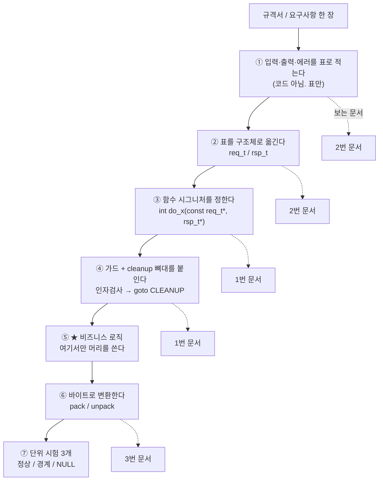

# c코드 템플릿 _index

> **프레임워크 없이, 순수 C + POSIX 만으로** 규격서를 코드로 옮길 때 쓰는 뼈대 모음.
> 사내 프레임워크(TAP·MPLIB·H2S) 버전은 → 실무 코드 템플릿 목록

## 왜 이 문서들이 필요한가

C로 뭘 만들려고 할 때 막막한 이유는 **문법을 몰라서가 아니다.**
`for` 문도 쓸 줄 알고 포인터도 안다. 그런데 빈 파일 앞에서는 손이 안 움직인다.

이유는 이것이다.

> 규격서를 읽고 **"자, 이제 뭐부터 치지?"** 에 대한 답이 없기 때문.

그런데 실제로 머리를 써야 하는 건 **비즈니스 로직 하나뿐**이고,
나머지는 **매번 똑같다.**

- 리턴값을 `0`으로 할까 `-1`로 할까, 아니면 enum 을 만들까
- 인자 검사를 어디서 얼마나 할까
- `malloc` 하고 중간에 에러 나면 어디서 `free` 할까
- 규격서의 "Optional" 필드는 구조체에 어떻게 표현할까
- 비트 3개짜리 필드를 어떻게 꺼내고 넣을까
- 네트워크 바이트 순서로 바꾸는 코드를 매번 새로 쓸까

전부 **정답이 정해져 있는 문제**다. 그러니 외우지 말고 복붙해야 한다.
이 폴더의 문서들은 **"생각 없이 손이 움직이게 하는 것"**이 목적이다.

---

## 규격서 → 코드, 10분 루틴

새 기능 하나를 받았을 때 **순서대로 이것만 한다.** 고민은 5단계에서만 한다.

| 단계 | 시간 | 하는 일 | 볼 문서 |
| :--- | :--- | :--- | :--- |
| ① 표 만들기 | 3분 | 입력 / 출력 / 에러 케이스를 **표 세 개**로 | [2번](2.%20데이터%20모델%20골격%20—%20규격서%20I·O%20표를%20구조체로.md) |
| ② 구조체화 | 2분 | 표의 행 하나 = 구조체 멤버 하나 | [2번](2.%20데이터%20모델%20골격%20—%20규격서%20I·O%20표를%20구조체로.md) |
| ③ 시그니처 | 30초 | `int f(const in_t *, out_t *)` 로 통일 | [1번](1.%20기본%20골격%20—%20리턴코드·가드매크로·단일출구%20cleanup.md) |
| ④ 뼈대 | 1분 | 복붙. 가드 매크로 + `goto CLEANUP` | [1번](1.%20기본%20골격%20—%20리턴코드·가드매크로·단일출구%20cleanup.md) |
| ⑤ **로직** | **나머지 전부** | **여기서만 생각한다** | — |
| ⑥ 직렬화 | 2분 | `pack` / `unpack` 함수 복붙 | [3번](3.%20바이트%20골격%20—%20비트플래그·엔디안·Pack·Unpack.md) |
| ⑦ 시험 | 3분 | 정상 1 + 경계 1 + NULL 1 | [1번](1.%20기본%20골격%20—%20리턴코드·가드매크로·단일출구%20cleanup.md) |

> [!IMPORTANT] ①을 건너뛰지 말 것
> 제일 하고 싶은 게 "일단 코드부터 치기"인데, **표를 안 만들고 시작하면 반드시 되돌아온다.**
> 필드를 하나 빠뜨렸거나, 에러 케이스를 안 봤거나, Optional 인 줄 몰랐거나.
> 표 만드는 3분이 디버깅 3시간을 막는다.

---

## 문서 목록

### 🧱 모든 함수에 공통 (먼저 읽기)

| # | 문서 | 언제 보나 |
| :--- | :--- | :--- |
| 1 | [기본 골격 — 리턴코드·가드매크로·단일출구 cleanup](1.%20기본%20골격%20—%20리턴코드·가드매크로·단일출구%20cleanup.md) | **함수 하나라도 쓰기 전에.** 리턴코드 체계, `CHK_*` 가드, `goto CLEANUP`, 메모리 누수 방어 |

### 📋 규격서를 코드로

| # | 문서 | 언제 보나 |
| :--- | :--- | :--- |
| 2 | [데이터 모델 골격 — 규격서 I/O 표를 구조체로](2.%20데이터%20모델%20골격%20—%20규격서%20I·O%20표를%20구조체로.md) | 규격서의 필드 표를 보고 `struct` 를 짤 때. Optional 표현, 고정배열 vs 동적할당 |
| 6 | [3GPP 규격 → C 코드 변환 골격](6.%203GPP%20규격%20→%20C%20코드%20변환%20골격.md) | **TS 문서를 직접 펼쳤을 때.** ASN.1/IE 표 읽는 법, Mandatory/Conditional, 버전 호환 |

### 🔢 바이트를 다룰 때

| # | 문서 | 언제 보나 |
| :--- | :--- | :--- |
| 3 | [바이트 골격 — 비트플래그·엔디안·Pack/Unpack](3.%20바이트%20골격%20—%20비트플래그·엔디안·Pack·Unpack.md) | 프로토콜 헤더를 만들거나 뜯을 때. 비트 필드 추출, `htons` 직접 구현, TLV |

### ⚙️ 프로그램 전체 구조

| # | 문서 | 언제 보나 |
| :--- | :--- | :--- |
| 4 | [데몬 골격 — 순수 POSIX main 초기화·시그널·스레드·폴링루프](4.%20데몬%20골격%20—%20순수%20POSIX%20main%20초기화·시그널·스레드·폴링루프.md) | 계속 떠 있는 프로그램을 만들 때. 시그널 처리, 스레드 풀, graceful shutdown |

### 📐 설계 산출물

| # | 문서 | 언제 보나 |
| :--- | :--- | :--- |
| 5 | [설계 산출물 Mermaid 치트시트](5.%20설계%20산출물%20Mermaid%20치트시트.md) | Flowchart·ERD·Call Flow·상태도를 그릴 때. **복붙해서 이름만 바꾸는 판** |

---

## 이 폴더와 기존 C 노트의 관계

기존 `C언어/` 폴더에는 **개념을 설명하는 노트**가 이미 많다.
이 폴더는 그 개념들을 **"그래서 뭘 치면 되는데"** 로 바꿔놓은 것이다.

| 개념 노트 (왜/어떻게 동작하나) | 이 폴더 (뭘 치면 되나) |
| :--- | :--- |
| [비트플래그(Bit Flag) 연산](../%5BC%5D%20비트플래그(Bit%20Flag)%20연산.md) | 3번 — 복붙용 `SET/CLR/TEST` 매크로 |
| [엔디안과 인터넷 체크섬](../%5BC%5D%20엔디안(바이트%20순서)과%20인터넷%20체크섬%20—%20LSB·MSB와%20htons를%20직접%20만들어보기.md) | 3번 — 복붙용 `rd_u16be` / `wr_u32be` |
| [시프트로 여러 필드를 하나의 정수에 조합하기](../%5BC%5D%20시프트로%20여러%20필드를%20하나의%20정수에%20조합하기%20—%20필드%20패킹.md) | 3번 — 필드 패킹 매크로 |
| [API·규격 데이터 모델을 C 구조체로 설계하는 공식](../%5BC%5D%20API·규격%20데이터%20모델을%20C%20구조체로%20설계하는%20공식%20—%20JSON·YAML을%20정적%20메모리로%20매핑하기.md) | 2번 — 규격서 표 → 구조체 변환 절차 |
| [Hungarian 표기법 접두어 해독표](../%5BC%5D%20Hungarian%20표기법%20접두어%20해독표%20—%20변수%20이름만%20보고%20타입·스코프%20짐작하기.md) | 1번 — 네이밍 규칙 적용판 |
| [함수 포인터와 디스패치 테이블](../%5BC%5D%20함수%20포인터와%20디스패치%20테이블%20—%20switch%20대신%20테이블로%20분기하기.md) | 4번 — 이벤트 디스패치 골격 |
| [매크로를 do-while(0)으로 감싸는 이유](../%5BC%5D%20매크로를%20do-while(0)으로%20감싸는%20이유%20—%20여러%20문장을%20안전한%20하나로%20묶기.md) | 1번 — 가드 매크로가 왜 그 모양인지 |
| [가변 길이 구조체(Struct Hack)와 필러 필드](../%5BC%5D%20가변%20길이%20구조체(Struct%20Hack)와%20필러%20필드%20—%20헤더%20뒤에%20매달리는%20가변%20payload.md) | 2번·3번 — 가변 payload 처리 |
| [실무 C 코드 관례와 UB 함정 정리](../%5BC%5D%20실무%20C%20코드%20관례와%20UB%20함정%20정리.md) | 1번 — 함정을 피하는 뼈대 |

> [!TIP] 읽는 순서
> **처음이면**: 이 문서(루틴) → 1번 → 2번 → 3번 순서로.
> **급하면**: 1번의 "복붙 템플릿" 절만 보고 바로 쓰기 시작해도 된다.

---

## 세 줄로 줄인 전부

1. **함수는 전부 같은 모양이다.** `int f(const in_t*, out_t*)`, 가드로 시작, `goto CLEANUP` 으로 끝.
2. **규격서의 표 = 구조체.** 행 하나가 멤버 하나. Optional 은 `has_xxx` 플래그로.
3. **바이트는 항상 명시적으로.** `struct` 를 그대로 `memcpy` 하지 않는다. 항상 `pack`/`unpack` 을 거친다.

---

## 관련 노트

- C언어 목록 — 상위 허브
- [템플릿 체화 드릴 목록](../실습/템플릿%20체화%20드릴/템플릿%20체화%20드릴%20목록.md) — **이 템플릿들을 반복 실습으로 체화하는 드릴 (D0~D9)**
- 실무 코드 템플릿 목록 — **사내 프레임워크 버전**
- [[CS] C언어 핵심 키워드, 빌드, 최적화 및 포인터 상수성 정리](../%5BCS%5D%20C언어%20핵심%20키워드,%20빌드,%20최적화%20및%20포인터%20상수성%20정리.md)

> [!WARNING] 플레이스홀더 표기
> 이 폴더 문서의 코드에서 `{{ }}`로 감싼 부분은 **내 상황에 맞게 바꿔 넣는 칸**이다.
> `{{ }}` 가 없는 코드는 **그대로 복사해서 쓰면 되는 것**이다.
