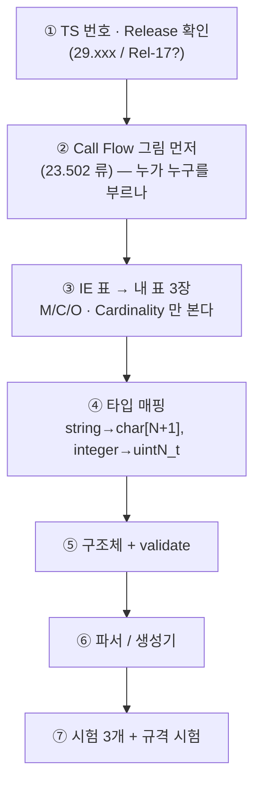

# D8. 3GPP — IE 표 한 장을 끝까지

> **쓰는 템플릿**: [6. 3GPP 규격 → C 코드 변환 골격](../../c코드%20템플릿/6.%203GPP%20규격%20→%20C%20코드%20변환%20골격.md)
> **목표 시간**: 1회차 100분 / 2회차 60분 / **3회차 40분**
> **D2 + D4 + D5 를 통과한 뒤에.** 이 드릴은 새 기술이 아니라 **앞의 것을 규격서 앞에서 하는 것**이다.

> [!WARNING] 이 노트의 IE 표는 **연습용으로 단순화한 것**이다
> 실제 TS 의 표와 필드·조건·타입이 다를 수 있다. 목적은 **표를 읽고 옮기는 절차**를 손에 붙이는 것.
> 실물 작업을 할 때는 **반드시 해당 TS 의 표를 직접 펴고** 표 3장을 다시 만든다. 노트를 규격서 대용으로 쓰지 않는다.

---

## 0. 이 드릴로 체화할 것

| 반사 | 규칙 |
| :--- | :--- |
| IE 표를 보면 | **5칸만 본다**: 이름 / P(M·C·O) / Cardinality / Type / Description |
| **M** (Mandatory) | 구조체에 그냥 넣고, `validate` 에서 **없으면 실패** |
| **C** (Conditional) | `has_` 플래그 + **조건을 주석으로 규격 문구 그대로** 남긴다 |
| **O** (Optional) | `has_` 플래그. 없어도 정상 |
| Cardinality `1..N` | 배열 + 개수. **N 을 `#define` 으로** |
| 모르는 필드 | **버리지 않는다.** 원문 보존 후 응답에 그대로 반영 |
| 에러 | 내 `ret_t` → **HTTP status → cause** 3단 매핑을 **한 함수**에 모은다 |

---

## 1. 요구사항 — 변형 A: 가입자 AM 데이터 조회 (SBI 흉내)

> [!QUOTE] 연습용 규격 (단순화)
> **`GET /subscriber-data/{supi}/am-data?plmn-id={plmn}&supported-features={feat}`**
>
> **요청 IE**
>
> | IE | P | Cardinality | Type | 설명 |
> | :--- | :--- | :--- | :--- | :--- |
> | `supi` | **M** | 1 | string | `imsi-` + 숫자 15자 |
> | `plmnId` | **C** | 0..1 | object | **로밍 가입자면 필수**. `{mcc:3자리, mnc:2~3자리}` |
> | `supportedFeatures` | O | 0..1 | string | 16진수 문자열, 비트 단위 기능 협상 |
>
> **응답 IE (200 OK)**
>
> | IE | P | Cardinality | Type | 설명 |
> | :--- | :--- | :--- | :--- | :--- |
> | `gpsi` | O | 0..1 | string | `msisdn-` + 숫자 |
> | `subscribedUeAmbr` | **C** | 0..1 | object | **가입자가 정지 상태가 아니면 필수**. `{uplink, downlink}` (`"100 Mbps"` 형식) |
> | `nssai` | **M** | 1 | object | `{defaultSingleNssais: 1..8, singleNssais: 0..8}` |
> | `ratRestrictions` | O | 0..8 | array(enum) | `NR` / `EUTRA` / `WLAN` |
> | `supportedFeatures` | **C** | 0..1 | string | **요청에 왔으면 필수** |
>
> **에러 응답 (ProblemDetails)**
>
> | 상황 | HTTP | cause |
> | :--- | :--- | :--- |
> | 필수 IE 없음 | 400 | `MANDATORY_IE_MISSING` |
> | 형식 위반 | 400 | `INVALID_MSG_FORMAT` |
> | 가입자 없음 | 404 | `USER_NOT_FOUND` |
> | 내부 오류 | 500 | `INTERNAL_ERROR` |
> | 미지원 기능 | 501 | `UNSUPPORTED_FEATURE` |

### 미션

1. 요청·응답 **표 3장**을 직접 다시 만든다 (위 표를 그대로 베끼지 말고 **내 양식**으로).
2. `am_data_req_t` / `am_data_rsp_t` 구조체 (D2 규칙 그대로).
3. `"100 Mbps"` 같은 **문자열 비트레이트**를 `uint64_t bps` 로 변환하는 함수 + 역변환. 단위: `Kbps`/`Mbps`/`Gbps`.
4. `mcc`/`mnc` 문자열 → `plmn_t` (mnc 2자리·3자리 **둘 다** 처리).
5. `am_data_validate()` — **C(Conditional) 조건을 규격 문구 주석과 함께** 검사.
6. `ret_to_problem()` — `ret_t` → `{status, cause}` 매핑 **한 곳**.
7. 모르는 최상위 필드는 **원문 보존**해서 응답에 echo.

### 회차별 변형

| 회차 | 변형 | 바뀌는 것 |
| :--- | :--- | :--- |
| **A (1회차)** | 위 JSON 형 API | 텍스트 기반 |
| **B (2회차)** | **바이너리 IE** — 같은 데이터를 IEI·TLV/TV/LV 로 (D5 연계) | 포맷 판별 + 반옥텟 |
| **C (3회차)** | **버전 공존** — `supportedFeatures` 비트0 이 켜져야 `ratRestrictions` 를 보냄 | 기능 협상 분기 + 구버전 호환 |

---

## 2. 순서 — 규격서 앞에서 하는 10분 루틴



> [!IMPORTANT] ①을 건너뛰면 전부 다시 한다
> Release 가 다르면 **같은 IE 가 없거나 조건이 다르다.** 문서 첫 장의 버전을 **표 위에 적어두고** 시작한다.

---

## 3. 조건부(C) 필드를 코드로 옮기는 법

> [!success]- 모범답안 — 조건을 주석으로 박아둔다
> ```c
> /* 규격 인용을 주석으로 그대로 남긴다.
>  * 나중에 "이 검사 왜 있지?" 가 되는 걸 막는 유일한 방법이다. */
> int am_data_rsp_validate(const am_data_rsp_t *rsp, const am_data_req_t *req)
> {
>     CHK_PTR(rsp);
>     CHK_PTR(req);
>
>     /* M: nssai 는 항상 있어야 하고 default 가 1~8개 */
>     if (rsp->nssai.default_num == 0 || rsp->nssai.default_num > NSSAI_NUM_MAX) {
>         LOG_ERR("nssai.default_num=%u", rsp->nssai.default_num);
>         return RET_BAD_FORMAT;
>     }
>
>     /* C: "가입자가 정지 상태가 아니면 subscribedUeAmbr 필수" */
>     if (!rsp->suspended && !rsp->has_ue_ambr) {
>         LOG_ERR("subscribedUeAmbr missing (not suspended)");
>         return RET_BAD_FORMAT;                 /* → 400 MANDATORY_IE_MISSING */
>     }
>
>     /* C: "요청에 supportedFeatures 가 있었으면 응답에도 필수" */
>     if (req->has_features && !rsp->has_features) {
>         LOG_ERR("supportedFeatures missing (req had it)");
>         return RET_BAD_FORMAT;
>     }
>
>     /* O: 있으면 값만 검사 */
>     if (rsp->has_gpsi && strncmp(rsp->gpsi, "msisdn-", 7) != 0) {
>         LOG_ERR("gpsi prefix: %s", rsp->gpsi);
>         return RET_BAD_FORMAT;
>     }
>
>     return RET_OK;
> }
> ```

> [!success]- 비트레이트 문자열 ↔ bps
> ```c
> /* "100 Mbps" / "1.5 Gbps" / "64 Kbps" → bps */
> int bitrate_from_str(const char *s, uint64_t *out_bps)
> {
>     double   val  = 0.0;
>     char     unit[8];
>     uint64_t mul  = 0;
>
>     CHK_STR(s);
>     CHK_PTR(out_bps);
>     *out_bps = 0;
>     memset(unit, 0x00, sizeof(unit));
>
>     /* %7s 로 폭을 제한한다. 안 하면 스택 오버플로 */
>     if (sscanf(s, "%lf %7s", &val, unit) != 2) {
>         LOG_ERR("bitrate parse: %s", s);
>         return RET_BAD_FORMAT;
>     }
>     if      (strcasecmp(unit, "bps")  == 0) mul = 1ULL;
>     else if (strcasecmp(unit, "Kbps") == 0) mul = 1000ULL;
>     else if (strcasecmp(unit, "Mbps") == 0) mul = 1000ULL * 1000;
>     else if (strcasecmp(unit, "Gbps") == 0) mul = 1000ULL * 1000 * 1000;
>     else { LOG_ERR("unknown unit: %s", unit); return RET_BAD_FORMAT; }
>
>     if (val < 0.0 || val > 1.0e12) return RET_BAD_FORMAT;
>     *out_bps = (uint64_t)(val * (double)mul);
>     return RET_OK;
> }
> ```
>
> `strcasecmp` 는 POSIX(`<strings.h>`). 대소문자 표기가 규격/장비마다 흔들리므로 **대소문자 무시가 안전**하다.

> [!success]- PLMN — mnc 2자리·3자리 둘 다
> ```c
> typedef struct {
>     char mcc[3 + 1];
>     char mnc[3 + 1];      /* 2자리면 "01" 처럼 그대로 (앞에 0 채우지 않는다) */
>     uint8_t mnc_len;      /* 2 또는 3 — 잃어버리면 복원 불가 */
> } plmn_t;
> ```
>
> **`mnc_len` 을 따로 들고 있어야 한다.** `"01"` 과 `"001"` 은 **다른 사업자**다.
> 숫자로 변환해 저장하면 앞자리 0이 사라져 되돌릴 수 없다. 이게 3GPP 초보가 제일 많이 밟는 지뢰.

> [!success]- 에러 매핑 — 한 함수에 모은다
> ```c
> typedef struct { int status; const char *cause; } problem_t;
>
> problem_t ret_to_problem(int ret)
> {
>     switch (ret) {
>     case RET_OK:            return (problem_t){ 200, NULL };
>     case RET_INVALID_ARG:   return (problem_t){ 400, "MANDATORY_IE_MISSING" };
>     case RET_BAD_FORMAT:    return (problem_t){ 400, "INVALID_MSG_FORMAT" };
>     case RET_NOT_FOUND:     return (problem_t){ 404, "USER_NOT_FOUND" };
>     case RET_NOT_SUPPORTED: return (problem_t){ 501, "UNSUPPORTED_FEATURE" };
>     case RET_TIMEOUT:       return (problem_t){ 504, "TIMEOUT" };
>     default:                return (problem_t){ 500, "INTERNAL_ERROR" };
>     }
> }
> ```
>
> 매핑이 **여러 군데 흩어지면** 같은 에러가 어떤 경로에서는 400, 어떤 경로에서는 500 으로 나간다.
> 상호운용 시험에서 반드시 걸리는 항목이다. **한 곳에서만.**

---

## 4. 검증 — 일반 시험 3개 + 규격 시험 4개

| # | 시험 | 기대 |
| :--- | :--- | :--- |
| 1 | 정상 요청 | `RET_OK`, 200 |
| 2 | `supi` 없음 | `RET_INVALID_ARG` → **400 MANDATORY_IE_MISSING** |
| 3 | NULL 인자 | `RET_INVALID_ARG` |
| 4 | **C 조건 위반** — 정지 아님 + `ueAmbr` 없음 | 400 |
| 5 | **모르는 필드 포함** 요청 | `RET_OK` + 응답에 **원문 그대로 echo** |
| 6 | `mnc="01"` 왕복 | 파싱→생성 후 **`"01"` 유지** (`"1"` 이 되면 실패) |
| 7 | `supportedFeatures` 비트 협상 | 상대가 모르는 비트는 **꺼서** 응답 |

---

## 5. 자가 채점표 (100점)

| 항목 | 배점 | 체크 |
| :--- | :--- | :--- |
| 표 3장을 **내 양식으로** 다시 만들었다 | 10 | ☐ |
| M / C / O 가 구조체에 **구분되어** 표현됨 | 15 | ☐ |
| C 조건마다 **규격 문구 주석** | 15 | ☐ |
| 에러 매핑이 **한 함수** | 15 | ☐ |
| 모르는 필드 **보존 + echo** | 15 | ☐ |
| `mnc_len` 등 **복원 불가 정보**를 안 잃음 | 10 | ☐ |
| 규격 시험 4~7 통과 | 15 | ☐ |
| 목표 시간 내 | 5 | ☐ |

---

## 6. 자주 하는 실수

| 실수 | 결과 |
| :--- | :--- |
| `mnc` 를 정수로 저장 | `"01"` → `1` → 복원 불가. **사업자가 바뀐다** |
| `C` 를 `O` 로 취급 | 조건 충족인데 필드가 빠진 응답을 정상 처리 → **상호운용 시험 탈락** |
| 모르는 enum 값에 `RET_BAD_FORMAT` | 상대가 Release 를 올리면 **전 메시지 거부** → `UNKNOWN` 으로 받고 통과 |
| `sscanf("%s")` 에 폭 제한 없음 | 스택 오버플로. **항상 `%7s` 처럼 폭 지정** |
| Release 확인 없이 표만 봄 | 조건이 달라 구현 전체가 어긋난다 |
| 에러 매핑을 호출부마다 작성 | 같은 실패가 경로마다 다른 코드로 나간다 |

---

## 7. 회차 기록표

| 회차 | 날짜 | 변형 | 걸린 시간 | 점수 | 규격 시험 | 막힌 지점 |
| :--- | :--- | :--- | :--- | :--- | :--- | :--- |
| 1 |  | A (JSON형) |  |  | /4 |  |
| 2 |  | B (바이너리 IE) |  |  | /4 |  |
| 3 |  | C (버전 공존) |  |  | /4 |  |
| 점검 (D+14) |  | 랜덤 |  |  | /4 |  |

---

## 관련 노트

- [6. 3GPP 규격 → C 코드 변환 골격](../../c코드%20템플릿/6.%203GPP%20규격%20→%20C%20코드%20변환%20골격.md) — 정답지
- [2. 데이터 모델 골격](../../c코드%20템플릿/2.%20데이터%20모델%20골격%20—%20규격서%20I·O%20표를%20구조체로.md)
- [[Lang] strtok_r과 sscanf 문자열 파싱 원리](../../%5BLang%5D%20strtok_r과%20sscanf%20문자열%20파싱%20원리%20및%20&save%20동작%20분석.md)
- [[C] 문자열 비교와 strcasecmp](../../%5BC%5D%20문자열%20비교와%20strcasecmp%20—%20strcmp%20차이,%20대소문자%20무시%20및%20컴파일러%20속성%20해독.md)
- [[HTTP] POST & CALLBACK (libcurl HTTP 통신)](../../%5BHTTP%5D%20POST%20&%20CALLBACK%20%28libcurl%20HTTP%20통신%29%20-%20핵심%20개념%20및%20특징%20정리.md)
- [다음: D9. 종합](D9.%20종합%20—%20요구사항%20한%20장을%20동작하는%20데몬으로.md)
