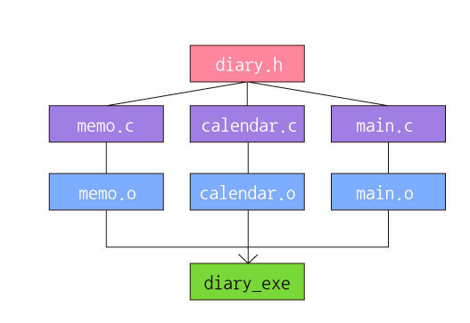
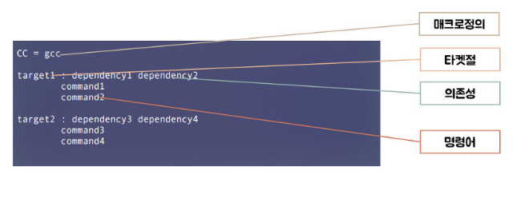
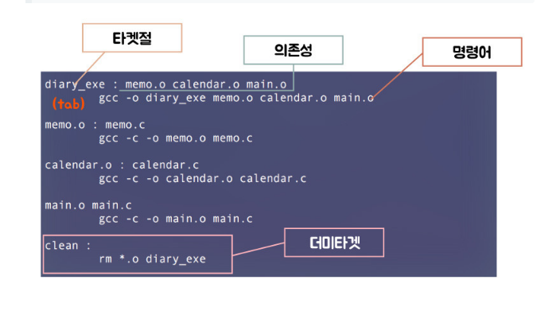
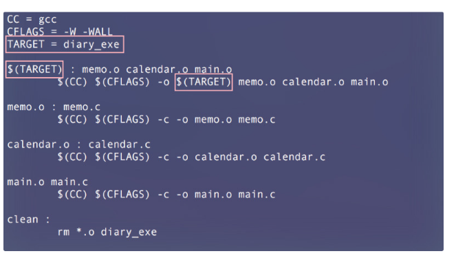

# [명령어] Makefile

> [!NOTE]
> Makefile의 필요성과 기본 구조(Target·의존성·명령·매크로), C 소스 컴파일 흐름과 자동화 매크로($^, $@, $*, $<) 정리.

## 📌 개념

### 기본 구조



Makefile 구성 요소:

- **목적 파일(Target)**: 명령어가 수행되어 나온 결과 저장 파일
- **의존성(Dependency)**: 목적 파일을 만들기 위해 필요한 재료
- **명령어(Command)**: 실행되어야 할 명령어
- **매크로(Macro)**: 코드를 단순화하기 위한 방법

### 매크로

| 매크로 | 설명 |
| --- | --- |
| `$^` | 현재 타겟의 종속 항목 리스트 |
| `$@` | 현재 타겟명 |
| `$*` | 현재 타겟 파일의 확장자를 뺀 것 (ex: `$*.c`) |
| `$<` | 현재 타겟보다 더 최근에 업데이트된 파일명 (ex: 소스파일) |

- `$(변수명)`: 변수 값을 사용할 때 사용

## 💻 예시

### 1. 헤더 파일

```c
// diary.h
#include <stdio.h>
void memo();
void calendar();
```

### 2. C 파일 (재료)

```c
// memo.c
#include "diary.h"
void memo() {
    printf("function1\n");
}
```

```c
// calendar.c
#include "diary.h"
void calendar() {
    printf("function2\n");
}
```

```c
// main.c
#include "diary.h"
int main(void) {
    memo();
    calendar();
    return 0;
}
```

### 3. 목적 파일 → 실행 파일 (gcc 직접)

```bash
# 목적 파일 생성 (-c: object 생성, -o: 생성 파일 이름 지정)
gcc -c -o memo.o memo.c
gcc -c -o calendar.o calendar.c
gcc -c -o main.o main.c

# 실행 파일 생성
gcc -o diary_exe main.o memo.o calendar.o
```

### 4. Makefile 이용





```bash
make          # makefile 실행
make clean    # object 파일들과 diary_exe 제거
```

### 5. 매크로 활용



```makefile
# 아래 두 줄은 동일한 표현
gcc -o calc add.o sub.o main.o
gcc -o $@ $^
```
