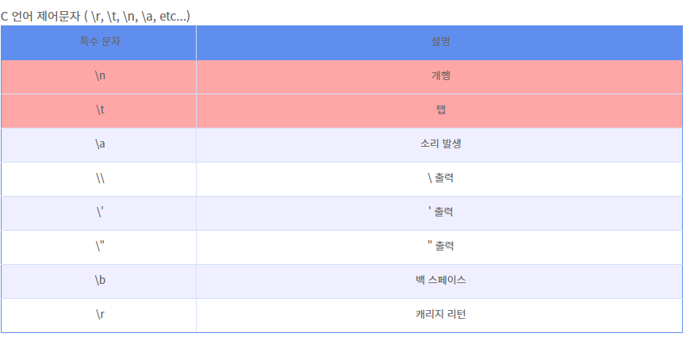

# [명령어] VIM 사용법

> [!NOTE]
> Vim 편집기 기본 사용법 정리. 커서·화면 이동, 수정/복사/붙여넣기/삭제, 검색·치환, 창 분할, 행 이동, Control 문자 표기.

> [!NOTE]
> 원문의 방향키(h/j/k/l), 분할 명령 방향, `x` 동작 등 일반지식 오류를 교정함(사실 확인 권장).

## 📌 개념

자주 쓰는 명령:

- **복사**: `yiw`(현재 단어 복사), `[숫자]yy`(현재 커서 기준 n줄 복사)
- **되돌리기**: `u`(이전 실행 취소), `Ctrl + r`(다시 실행)

## 💻 예시

### 글자 이동

- `w`: 다음 단어 첫 글자
- `e`: 다음 단어 마지막 글자
- `b`: 이전 단어 첫 글자
- `0`: 현재 행의 맨 앞
- `$`: 현재 행의 맨 끝

### 화면 이동

- `Ctrl + b`: 한 화면 위로 (page up)
- `Ctrl + f`: 한 화면 아래로 (page down)
- `Ctrl + u` / `Ctrl + d`: 반 화면 위/아래
- `Ctrl + y` / `Ctrl + e`: 한 행 위/아래

### 커서 이동 (h/j/k/l)

- `h`: 왼쪽
- `j`: 아래
- `k`: 위
- `l`: 오른쪽

### 수정

- `r`: 커서 위치 한 글자 수정
- `cw`: 현재 단어 끝까지 수정
- `[숫자]s`: n글자 수정 (ex: `5s` = 5글자 수정)
- `C`: 커서 위치부터 행 끝까지 수정

### 복사 / 붙여넣기 / 삭제

- `yy`: 한 줄 복사
- `p`: 붙여넣기
- `dd`: 한 줄 삭제
- `x`: 한 글자 삭제
- `J`: 아래 줄을 현재 줄로 끌어올리기

### 선택 (비주얼 모드)

- `Ctrl + v`: 블록(범위) 선택
- `Shift + v`: 한 줄 선택

### 줄 번호 / 찾기 / 치환

```text
:set nu                       " 줄 번호 표시
/검색어                        " 커서 아래 방향 검색
?검색어                        " 커서 위 방향 검색
n / N                         " 다음 / 이전 검색 결과로 이동
:%s/대상문자열/변경문자열/g     " 파일 전체에서 대상 문자열을 변경문자열로 치환
```

### 셸 명령 실행 / 잡 제어

```text
:!명령어      " vim 안에서 셸 명령 실행
:sh          " 셸로 나감 (되돌아오기: exit)
Ctrl + z     " vim 창 내리기(백그라운드)
fg           " vim으로 되돌아오기
```

### 창(윈도우) 분할

- **수평 분할(위아래)**: 같은 파일 `:[크기]sp`, 다른 파일 `:[크기]sp [파일명]` (추천 크기 30)
- **수직 분할(좌우)**: 같은 파일 `:[크기]vs`, 다른 파일 `:[크기]vs [파일명]` (추천 크기 100)
- 다음 창으로 커서 이동: `Ctrl + w, w`
- 현재 창만 두고 나머지 닫기: `Ctrl + w, o`
- 여러 파일을 열었을 때 다음 문서: `:n`

### 행 이동

- `gg`: 첫 행으로 이동
- `[숫자]G` (숫자 입력 + `Shift + g`): 원하는 행 번호로 이동
- `G` (`Shift + g`): 맨 끝 행으로 이동
- `Home`: 행의 첫 번째로 이동
- `$` (`Shift + 4`): 행의 마지막 문자로 이동

### Control 문자 표기법

입력 방법: `Ctrl + v` → `Ctrl + [원하는 문자]`

예) `Ctrl + v` → `Ctrl + m` → `^M`


