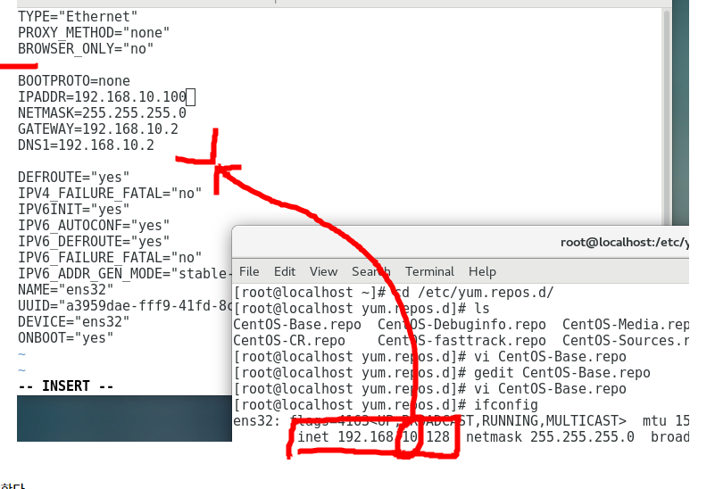

# CentOS 초기 셋팅 및 빌드 트러블슈팅

> [!NOTE]
> EOL(End of Life)된 CentOS 5.11/7 환경에서 흔히 겪는 문제 3가지 — YUM mirrorlist 우회, locale로 인한 스크립트 오작동, 32bit 빌드 실패 — 를 정리. 재직 중 VADA 개발환경 셋팅 경험을 일반화함.

## 📌 개념

### 1. EOL 배포판의 YUM mirrorlist 오류

CentOS 5/6/7처럼 공식 지원이 끝난 배포판은 `mirrorlist.centos.org`가 더 이상 최신 리포지터리 정보를 제공하지 않아 `yum`이 실패한다. `/etc/yum.repos.d/CentOS-Base.repo`에서 `mirrorlist` 대신 아카이브 서버(`vault.centos.org`)를 `baseurl`로 직접 지정하면 우회할 수 있다.

```ini
[base]
name=CentOS-$releasever - Base
mirrorlist=http://mirrorlist.centos.org/?release=$releasever&arch=$basearch&repo=os
baseurl=http://vault.centos.org/5.11/os/x86_64/
#baseurl=http://mirror.centos.org/centos/$releasever/os/$basearch/
gpgcheck=0
gpgkey=file:///etc/pki/rpm-gpg/RPM-GPG-KEY-CentOS-5
#released updates
[updates]
name=CentOS-$releasever - Updates
mirrorlist=http://mirrorlist.centos.org/?release=$releasever&arch=$basearch&repo=updates
baseurl=http://vault.centos.org/5.11/updates/x86_64/
gpgcheck=0
gpgkey=file:///etc/pki/rpm-gpg/RPM-GPG-KEY-CentOS-5
#additional packages that may be useful
[extras]
name=CentOS-$releasever - Extras
mirrorlist=http://mirrorlist.centos.org/?release=$releasever&arch=$basearch&repo=extras
baseurl=http://vault.centos.org/5.11/extras/x86_64/
gpgcheck=0
gpgkey=file:///etc/pki/rpm-gpg/RPM-GPG-KEY-CentOS-5
```
- 버전 번호(`5.11`)만 대상 배포판에 맞게 바꿔주면 CentOS 6/7 계열에도 동일하게 적용 가능.
- 참고: [CentOS 7 TLSv1.3를 위한 openssl, curl 소스업그레이드](http://idchowto.com/centos-7-tlsv1-3%EB%A5%BC-%EC%9C%84%ED%95%9C-openssl-curl-%EC%86%8C%EC%8A%A4%EC%97%85%EA%B7%B8%EB%A0%88%EC%9D%B4%EB%93%9C/)

### 2. locale(LANG) 설정 오류로 인한 스크립트 오작동

시스템 로케일이 한글(`ko_KR`)로 설정되어 있으면, 영문 출력을 파싱하는 셸 스크립트나 빌드 스크립트가 예상과 다른 문자열을 받아 `there is no subversion. set manually~` 같은 오류를 낼 수 있다. 스크립트가 실행되는 셸에서 로케일을 영문으로 강제하면 해결된다.

```bash
export LANG=en_US.UTF-8
```

### 3. 소스 빌드 시 자주 필요한 패키지

```text
curl-7.54.0
openssl-1.0.2m
lsof(4.93.2)
perl 5(version34)
python 3.6.5
```
- 빌드 순서 주의: **openssl → curl** 순서로 빌드해야 함(curl이 openssl에 의존)

**패키지 설치 방법**
- 자동설치: `yum`/`apt` — 의존 패키지와 PATH가 자동으로 설정됨
- 수동설치
    - Makefile이 있는 경우: `make install` 또는 `make -j8 && make install`
    - Makefile이 없는 경우: `./configure -fPIC shared -prefix=/usr/local` → `make -j8 && make install`
- 참고: [lsof 설치 및 사용가이드](https://m.blog.naver.com/PostView.naver?isHttpsRedirect=true&blogId=966138&logNo=60002222807)

### 4. 32bit(i686) 빌드 실패

64bit 전용으로 세팅된 CentOS 7에서 32bit 대상으로 빌드하면 `glibc-devel.i386` 관련 링크 오류가 난다. `ln -s`로 64bit 라이브러리를 링크해도 해결되지 않으며, `rpm -Uvh`로 i386 패키지를 직접 설치해도 의존성 문제로 실패하는 경우가 많다. 해결책은 `yum`으로 i686(32bit) 호환 개발 패키지를 설치하는 것이다.

```bash
yum install glibc-devel.i686 libstdc++-devel.i686
```

기타 자주 필요한 개발 패키지:
```bash
yum install net-tools epel-release subversion gcc glibc-devel
```

### 5. VMware 게스트 고정 IP 설정

1. VMware → Edit → Virtual Network Editor에서 브리지로 사용할 네트워크 카드 선택
2. VMware → Setting → Network에서 Bridge 모드로 설정
3. 게스트 OS 내부에서 `/etc/sysconfig/network-scripts/ifcfg-ens*` 파일에 고정 IP 직접 기입(`BOOTPROTO=none`, `IPADDR=`, `NETMASK=`, `GATEWAY=`)
4. 네트워크 서비스 재시작 또는 재부팅 후 `ifconfig`로 확인



- 참고: [리눅스 CentOS 7 고정 IP 할당하기](https://ansan-survivor.tistory.com/305)

## 📌 부록 — PATH 환경변수 & 아키텍처 확인

```bash
env                          # 전체 환경변수 확인
echo $PATH                    # PATH 확인
export PATH=$PATH:/[원하는경로]  # PATH 추가(콜론으로 구분, 앞쪽 경로가 우선순위)

getconf LONG_BIT              # 운영체제 32bit/64bit 확인
```

## 🔗 참고
- [openssl 설치 시 에러 컨트롤](https://kronia.tistory.com/4)
