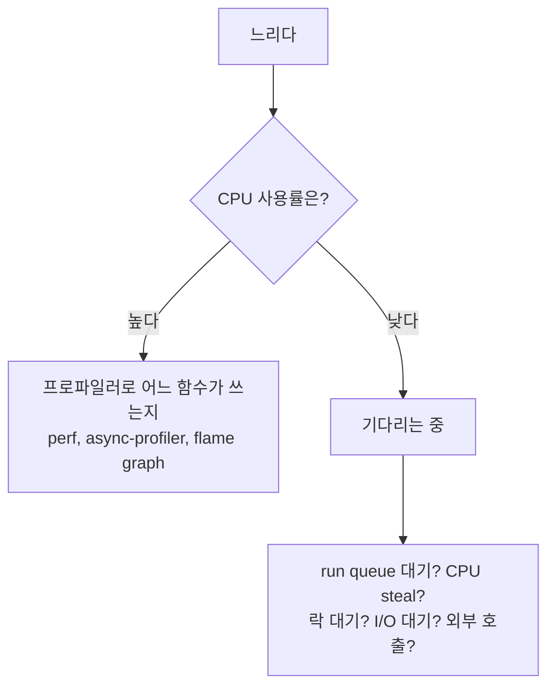

# 성능 분석 도구와 관측 (perf·flame graph·eBPF·메모리)

> "느리다", "메모리가 계속 는다"를 만났을 때 어디를 어떤 도구로 볼지 정리한다. 용어 정의는 [IT 용어집 - 성능·관측·로그](IT%20용어집/[용어]%20성능·관측·로그.md) 참고.

## 1. 먼저: 디버깅 vs 프로파일링 vs 관측

| 구분 | 질문 | 예 |
| --- | --- | --- |
| 디버깅 | 왜 **틀린 결과**가 나오지? | 브레이크포인트, 로그, gdb |
| 프로파일링 | 왜 **느리지**? 어디서 자원을 쓰지? | async-profiler, perf |
| 관측(observability) | OS·커널·시스템 수준에서 **무슨 일이 일어나고** 있지? | eBPF 도구, 메트릭, 추적 |

관측의 세 축: **로그**(개별 사건의 기록), **메트릭**(수치로 집계한 지표), **추적(trace)**(요청 하나가 여러 서비스를 거치는 흐름).

## 2. CPU는 어디서 쓰고 있나



| 도구 / 개념 | 설명 |
| --- | --- |
| **perf** | 리눅스 커널 수준 성능 분석 도구. JVM 밖의 네이티브 코드까지 본다 |
| **async-profiler** | JVM용 샘플링 프로파일러. CPU, 메모리 할당, 락 대기를 flame graph로 보여 준다 |
| **flame graph** | 함수 호출 스택별로 시간을 쌓아 올린 그래프. **넓은 막대가 시간을 많이 쓰는 함수**다 |
| **eBPF** | 커널을 고치지 않고 커널 안에 작은 프로그램을 넣어 이벤트를 수집하는 기술. 오버헤드가 낮아 운영 서버에도 쓴다 |
| `runqslower`(eBPF) | 스레드가 CPU를 받으려고 run queue에서 **오래 기다린** 경우를 추적. CPU 사용률은 낮은데 느릴 때 원인을 찾는다 |
| `perf sched` | 스케줄러 이벤트 분석(context switch 빈도, 대기 시간) |
| **context switching** | CPU가 스레드를 바꾸는 것. 스레드가 너무 많으면 일보다 전환에 시간을 쓴다 |
| **CPU steal** | VM 환경에서 **다른 VM이 물리 CPU를 가져가서** 내 VM이 CPU를 못 받은 시간. `top`의 `st` 값 |

CPU 사용률이 낮은데 느리면 "CPU를 못 받아서"(run queue 대기, steal)이거나 "다른 것을 기다리느라"(락, I/O, 외부 호출)다.

커널 함수 추적은 [명령어 Ftrace 사용법](개발%20%28CS%29/인프라/Linux/[Bash]%20명령어%20Ftrace%20사용법%20%28source%20분석%29%20-%20핵심%20개념%20및%20특징%20정리.md), 멀티스레드·시그널 디버깅은 [GDB 실전 디버깅](개발%20%28CS%29/인프라/Linux/[Tool]%20GDB%20실전%20디버깅%20%28멀티스레드·시그널%29.md) 참고.

## 3. 메모리는 어디서 쓰고 있나

| 키워드 | 설명 |
| --- | --- |
| **heap dump** | 힙 메모리의 스냅샷. 어떤 객체가 메모리를 차지하는지 분석한다(Eclipse MAT 등) |
| **GC 로그** | 더 이상 쓰이지 않는 메모리를 자동 회수하는 GC의 빈도와 멈춤 시간(pause) |
| **RSS** | 프로세스가 실제로 차지한 물리 메모리. 컨테이너는 **힙만이 아니라 RSS 전체**로 OOM Kill을 당한다 |
| **mmap / page cache** | 파일을 메모리에 연결한 영역, OS가 파일 내용을 메모리에 캐시한 것. 메모리 사용량으로 잡힌다 |
| **네이티브 메모리** | JVM 힙 바깥(Netty direct buffer, JNI, 압축 라이브러리). malloc으로 할당된다 |

### 3.1 JVM 서버의 메모리 구조

```
Java 코드 (new 객체)  → JVM 힙 (GC가 관리)        ← malloc과 무관
JVM 내부, Netty direct buffer, JNI, 압축 → malloc() ← 메모리 할당기(glibc malloc, jemalloc) 영역
```

- Java 서버도 힙 바깥의 네이티브 메모리는 C의 `malloc`과 같은 것으로 할당한다. "컨테이너 RSS가 힙보다 크다"는 문제의 주요 원인이다.
- 힙에 여유가 있는데 컨테이너가 OOM Kill되는 경우: 네이티브 메모리, 스레드 스택, 페이지 캐시를 확인한다.

### 3.2 메모리 할당기와 단편화

- glibc malloc은 스레드가 많으면 스레드마다 **arena**(메모리 구역)를 만들고, 반납된 메모리를 OS에 잘 돌려주지 않아 RSS가 부풀어 오르는 문제가 알려져 있다. jemalloc은 단편화(fragmentation)가 적고 메모리 반환을 잘 한다.
- 크기가 제각각인 할당과 해제가 아주 잦으면 빈 조각이 잘게 쪼개져 **할당기 자체가 CPU를 많이 쓰고**, 실제 쓰는 양보다 메모리를 많이 잡는다.
- 증상: CPU 프로파일(flame graph)에서 Java 코드가 아니라 **할당기 함수**가 상위에 나타난다. 네이티브 프레임까지 포함해서 보는 프로파일러(async-profiler, perf)로 찾는다.
- 대응(가능성 높은 순): **할당하는 쪽 코드 수정**(버퍼 재사용·풀링, 압축 객체를 요청마다 새로 만들지 않기), 할당기 옵션 튜닝(arena 수, 메모리 반납 시점), 버전 업그레이드, 할당기 교체(최후의 수단).

메모리 누수를 찾는 방법은 [메모리 누수 찾기](개발%20%28CS%29/인프라/Linux/[Bash]%20메모리%20누수%20찾기%20-%20핵심%20개념%20및%20특징%20정리.md), 대용량 처리에서 OOM을 막는 설계는 [대용량 조회 메모리 관리 (SQL vs Java 필터링)](개발%20%28CS%29/인프라/모니터링·네트워크/[Java]%20대용량%20조회%20메모리%20관리%20%28SQL%20vs%20Java%20필터링%29%20-%20핵심%20개념%20및%20특징%20정리.md), [대용량 트래픽 로깅 메모리 누수(OOM) 방지 패턴](프레임워크/Spring%20Framework/실습_스프링MVC/[Spring]%20대용량%20트래픽%20로깅%20메모리%20누수%28OOM%29%20방지%20패턴%20-%20핵심%20개념%20및%20특징%20정리.md) 참고.

## 4. 데이터를 줄여서 아끼기

- **압축**(gzip, zstd): 전송량·저장 공간을 줄인다. 작은 데이터는 압축하면 오히려 손해라서 **일정 크기(threshold) 이상일 때만** 압축한다. HTTP에서는 `Content-Encoding: gzip` 헤더로 알린다.
- **바이너리 포맷**(Protobuf, Avro): JSON보다 작고 빠르다. 대신 **스키마 운영**(Schema Registry, 하위·상위 호환성 규칙)이 중요하다.

## 5. 로그와 메트릭 운영

| 주제 | 포인트 |
| --- | --- |
| 정형 로그(JSON) | 필드가 정해져 있어 검색·집계가 쉽다 |
| appender | 로그를 어디로 보낼지(파일, 콘솔, Kafka, 알림) 정하는 구성 요소 |
| 마스킹 | 개인정보·카드번호는 일부 가려서 남긴다 |
| 비동기 로깅 | 로그를 큐에 넣고 별도 스레드가 전송. 큐가 가득 차면 기본은 앱 스레드가 기다린다(blocking). `neverBlock=true`면 **로그를 버리고** 서비스는 계속 동작 → 버려진 로그 수와 큐 사용량을 **메트릭으로 감시**해야 한다 |
| 전송 실패 대비 | 재시도, 그래도 안 되면 로컬 파일에 남겼다가 나중에 재전송 |
| slow log | 오래 걸린 쿼리를 기록. 쿼리에 호출한 API 이름을 주석으로 붙이면 슬로우 로그만 봐도 출처를 안다 |
| percentile | 응답 시간은 평균이 아니라 **p95, p99**로 본다(평균은 느린 소수를 가린다) |

로그 설정과 조회는 [Log 설정 및 Logging 사용](프레임워크/Spring%20Framework/Log%20설정%20및%20Logging%20사용.md), [LogQL 쿼리 문법 정리](개발%20%28CS%29/인프라/모니터링·네트워크/[Spring]%20LogQL%20쿼리%20문법%20정리%20%28필터·집계·rate·pattern%29%20-%20핵심%20개념%20및%20특징%20정리.md), 분산 추적은 [분산 추적과 비동기 스레드 컨텍스트 전파 아키텍처](개발%20%28CS%29/인프라/모니터링·네트워크/[APM]%20분산%20추적%28Distributed%20Tracing%29과%20비동기%20스레드%20컨텍스트%20전파%20아키텍처%20%28TraceContext,%20Netty,%20Spring%20Batch%29.md) 참고.

## 6. 점검 순서

1. 증상 구분: CPU가 높은가, 낮은데 느린가, 메모리가 늘어나는가?
2. CPU가 높다 → 프로파일러로 flame graph를 본다(네이티브 프레임 포함).
3. CPU가 낮다 → run queue, CPU steal, 락 대기, I/O 대기, 외부 호출을 확인한다.
4. 메모리가 늘어난다 → 힙인가 네이티브인가(RSS vs 힙), heap dump, 할당 패턴을 본다.
5. 평균이 아니라 p95, p99로 확인한다.
6. 고친 뒤에는 같은 방법으로 다시 측정해 개선을 확인한다.
