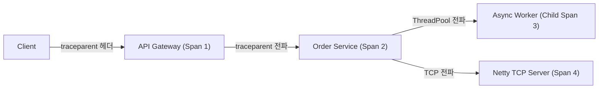
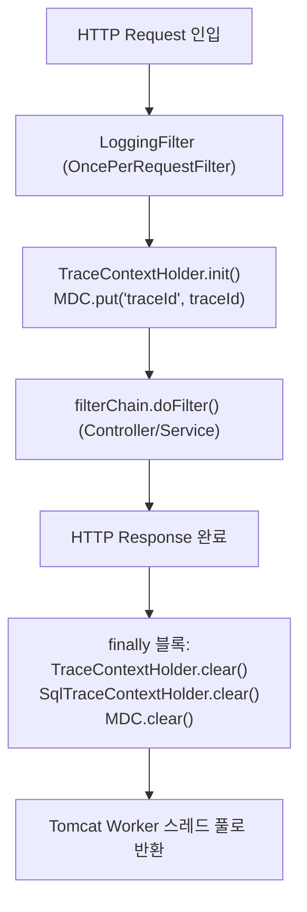
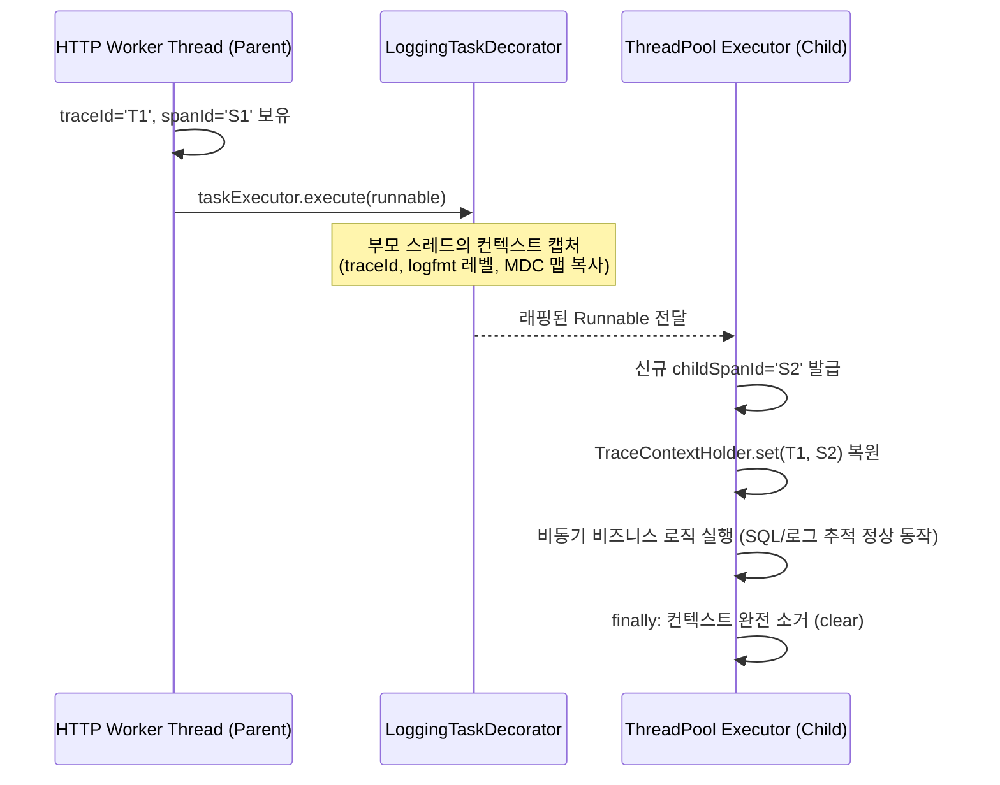
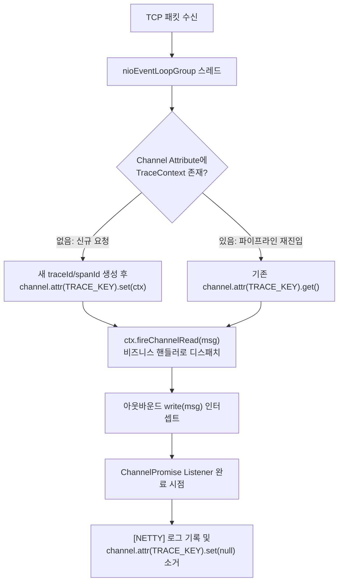

# [APM] 분산 추적(Distributed Tracing)과 비동기 스레드 컨텍스트 전파 아키텍처 (TraceContext, Netty, Spring Batch)

> **핵심 요약**  
> 무거운 에이전트 바이트코드 위빙 없이, 순수 Java 코드와 프레임워크 표준 확장점을 이용해 **W3C Trace Context 규격**을 만족하는 고성능 APM 분산 추적 파이프라인을 구축한다. **Tomcat 서블릿 스레드**, **Netty 비동기 이벤트 루프**, **Spring Batch 병렬 청크 워커** 간의 Context Loss(스레드 경계 단절)를 극복하는 아키텍처 패턴을 분석한다.

---

## 1. 분산 추적(Distributed Tracing)과 W3C Trace Context 표준

마이크로서비스(MSA)와 비동기 이벤트 기반 시스템에서는 하나의 사용자 요청이 수많은 서버와 비동기 워커 스레드를 경유한다. 이때 전 구간을 관통하는 식별자가 없으면 장애 발생 시 어느 지점에서 병목이나 오류가 발생했는지 추적하기 불가능하다.

```
[W3C traceparent 헤더 규격]
traceparent: 00-4bf92f3577b34da6a3ce929d0e0e4736-00f067aa0ba902b7-01
              │                    │                                │             │
              ▼                    ▼                                ▼             ▼
             버전               trace_id (전체 요청 고유 ID)      span_id (현재 구간)  flags (01=샘플링기록)
```



---

## 2. 서블릿 환경에서의 ThreadLocal 바인딩과 스레드 풀 오염 방지

Spring MVC(Tomcat) 환경에서는 각 HTTP 요청이 전용 Worker 스레드에 할당된다. 따라서 `ThreadLocal`을 통해 `TraceContext`를 보관한다.



### 2.1 ThreadLocal 메모리 누수 및 오염 방지 원칙
Tomcat과 같은 WAS는 스레드를 매번 새로 생성하지 않고 **스레드 풀(Thread Pool)**에 캐싱해 재사용한다. 만약 `finally` 블록에서 `ThreadLocal.remove()`를 호출하지 않으면:
1. **스레드 오염(Context Poisoning)**: 다음 사용자의 전혀 다른 요청이 이전 사용자의 `traceId`를 달고 실행되어 모니터링 데이터가 뒤섞인다.
2. **메모리 누수(ClassLoader Leak)**: 웹 애플리케이션 리로드 시 구버전 클래스로더가 언로드되지 못해 메타스페이스/힙 OOM이 발생한다.

```java
// LoggingFilter.java
try {
    TraceContextHolder.init(extractTraceId(request), extractSpanId(request));
    SqlTraceContextHolder.init();
    filterChain.doFilter(wrappedRequest, wrappedResponse);
} finally {
    // 어떤 Unchecked Exception이 터져도 반드시 스레드 로컬 컨텍스트를 소거
    SqlTraceContextHolder.clear();
    TraceContextHolder.clear();
    MDC.clear();
}
```

---

## 3. 비동기 스레드 풀에서의 Context Loss 극복: Spring TaskDecorator

`@Async` 또는 `ThreadPoolTaskExecutor`를 사용해 다른 스레드로 비동기 작업을 위임하면, 부모 스레드의 `ThreadLocal` 값은 자식 스레드로 **자동 전파되지 않는다(Context Loss)**.



### 3.1 `LoggingTaskDecorator` 구현 패턴
```java
public class LoggingTaskDecorator implements TaskDecorator {
    @Override
    public Runnable decorate(Runnable runnable) {
        // 1. 부모 스레드에서 현재 컨텍스트를 즉시 캡처 (스레드 전환 전)
        TraceContext parentContext = TraceContextHolder.get();
        Map<String, String> mdcContext = MDC.getCopyOfContextMap();

        return () -> {
            try {
                // 2. 비동기 워커 스레드 시작 시 컨텍스트 복원 및 Child Span 채번
                if (parentContext != null) {
                    String childSpan = IdGenerator.generateSpanId();
                    TraceContextHolder.init(parentContext.getTraceId(), childSpan);
                }
                if (mdcContext != null) {
                    MDC.setContextMap(mdcContext);
                }
                runnable.run();
            } finally {
                // 3. 워커 스레드 반환 전 초기화
                TraceContextHolder.clear();
                MDC.clear();
            }
        };
    }
}
```

---

## 4. Netty 비동기 이벤트 루프에서의 컨텍스트 전파 아키텍처

Netty는 소수의 `EventLoop` 스레드가 수천 개의 클라이언트 소켓 채널을 비동기 이벤트 방식으로 번갈아 처리한다. 이 환경에서는 **단일 스레드가 여러 클라이언트의 패킷을 연속으로 다루므로 ThreadLocal을 사용하면 치명적인 데이터 오염이 발생**한다.



### 4.1 Channel Attribute를 활용한 세션 레벨 바인딩
```java
// NettyTraceDuplexHandler.java
public class NettyTraceDuplexHandler extends ChannelDuplexHandler {
    private static final AttributeKey<TraceContext> TRACE_KEY = AttributeKey.valueOf("apm.trace.context");

    @Override
    public void channelRead(ChannelHandlerContext ctx, Object msg) throws Exception {
        TraceContext traceContext = ctx.channel().attr(TRACE_KEY).get();
        if (traceContext == null) {
            traceContext = new TraceContext(IdGenerator.generateTraceId(), IdGenerator.generateSpanId());
            ctx.channel().attr(TRACE_KEY).set(traceContext);
        }
        
        // 핸들러 실행 동안만 임시로 ThreadLocal 동기화 후 전파
        TraceContextHolder.set(traceContext);
        try {
            super.channelRead(ctx, msg);
        } finally {
            TraceContextHolder.clear();
        }
    }

    @Override
    public void write(ChannelHandlerContext ctx, Object msg, ChannelPromise promise) throws Exception {
        promise.addListener(future -> {
            // 소켓 전송 완료 콜백 시점에서만 로그 출력 및 속성 정리
            logNettyTransaction(ctx);
            ctx.channel().attr(TRACE_KEY).set(null);
        });
        super.write(ctx, msg, promise);
    }
}
```

---

## 5. Servlet Filter vs HandlerInterceptor: Request Body 캐싱 메커니즘

HTTP 요청/응답 바디를 APM 로그에 남기려면 바디 데이터를 읽어야 한다. 하지만 Servlet 스펙상 `HttpServletRequest.getInputStream()`은 **단 한 번만 읽을 수 있는 단발성 스트림**이다.

| 구분 | `HandlerInterceptor` | `Servlet Filter (OncePerRequestFilter)` |
| :--- | :--- | :--- |
| **개입 시점** | Spring DispatcherServlet 내부 (Controller 직전/직후) | 서블릿 컨테이너 최전방 (DispatcherServlet 진입 전) |
| **바디 재읽기** | 불가능 (이미 컨트롤러에서 읽어 소비됨) | **가능** (`RequestWrapper`로 감싸 캐싱 스트림 제공) |
| **적용 결과** | Body 로깅 시 컨트롤러 파라미터 바인딩 오류 발생 | 컨트롤러와 로깅 양쪽에서 안전하게 바디 재사용 가능 |

```java
// OOM 방지 바이너리 필터링이 포함된 바디 캐싱
boolean isBinary = contentType != null && (
    contentType.contains("multipart/form-data") ||
    contentType.contains("application/octet-stream")
);

// 대용량 파일 업로드 시에는 Wrapper를 씌우지 않고 원본 스트림을 통과시켜 힙 폭증 방지
HttpServletRequest requestToUse = isBinary ? request : new ContentCachingRequestWrapper(request);
```\n