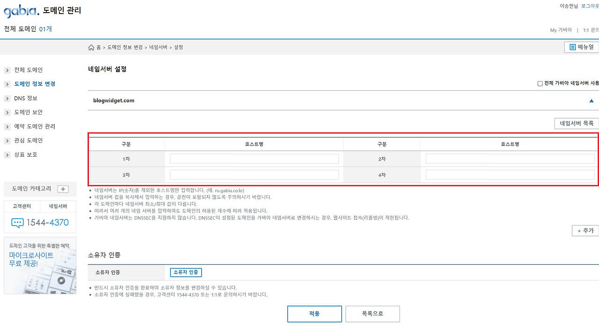
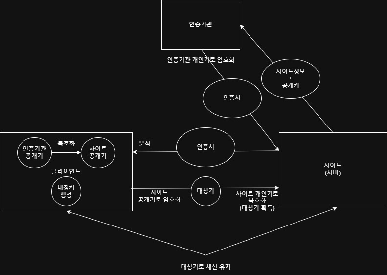

# DNS

> [!NOTE]
> 도메인 구매(가비아) + AWS Route 53 연결, SSL/TLS 인증서 발급(nginx + Certbot), 80포트 리다이렉트까지 HTTPS 서버 구성 정리.

## 📌 개념

### 도메인 & DNS 구성

- **가비아**: 회원가입 → 로그인 → 도메인 구매 → Route 53 설정 후 네임서버 변경(관리 → 1·2·3·4차)



- **AWS Route 53**: 호스팅 영역 생성
    - **NS 레코드**: 도메인의 호스팅 영역을 관리하는 네임서버(가비아 설정에 사용됨)
    - **SOA 레코드**: 호스팅 영역의 시작 지점. 모든 호스팅 영역에 단 하나 존재
    - **A 레코드(추가)**: 도메인과 인스턴스 IP 매핑을 위해 생성

### SSL/TLS Handshake



- **Certbot의 역할** → 서버 인증서 자동화 툴
    - 서버에서 CA에 인증서를 요청할 때 사용할 공개키/개인키를 생성

    ```bash
    # 서버 공개키 + 개인키 생성
    openssl genrsa -out private.key 2048
    ```

    - 개인키로 CSR(사이트 정보 + 서버 공개키)에 서명(암호화 X)

    ```bash
    # 서버 개인키로 서명 -> CSR 생성
    openssl req -new -key private.key -out server.csr
    ```

    - 인증기관은 CSR의 공개키로 서명을 검증
- HTTPS 통신에서는 이 키를 이용해 클라이언트와 대칭키(세션키)를 공유
    - 클라이언트 연결 시 대칭키 생성(인증서를 주면 클라이언트가 대칭키를 생성 후 전달)
- 대칭키는 HTTPS 세션 중 생성되며, Certbot은 직접 대칭키를 생성하지 않는다.

## 💻 예시

### 80포트 포워딩 확인

nginx는 기본적으로 80포트를 사용하므로, 80포트가 포워딩되어 있으면 설정이 안 된다.

```bash
# 포트포워딩 확인
sudo iptables -t nat -L --line-numbers

# 포트포워딩 설정
iptables -A PREROUTING -t nat -i eth0 -p tcp --dport 80 -j REDIRECT --to-port 8080

# 포트포워딩 설정 해제
sudo iptables -t nat -D PREROUTING [번호]
```

### nginx + Certbot 설치 (인증서 발급)

HTTP 80포트 설정:

```nginx
# /etc/nginx/sites-available/[도메인명]
server {
    listen 80;
    server_name onzbackend.shop www.onzbackend.shop;
    server_tokens off;

    location /.well-known/acme-challenge/ {
        root /var/www/certbot;
        default_type "text/plain";
        allow all;
        autoindex on;
    }

    location / {
        return 301 https://$host$request_uri;  # https로 리다이렉트
    }
}
```

Certbot으로 key 생성:

```bash
# certbot 설치
sudo apt update
sudo apt install -y certbot python3-certbot-nginx

# certbot 실행 (SSL 인증서 발급)
sudo certbot --nginx -d [도메인명] -d [도메인명]
```

nginx HTTPS 적용:

```nginx
# /etc/nginx/sites-available/[도메인명]
server {
    listen 80;
    server_name onzbackend.shop www.onzbackend.shop;
    server_tokens off;
    return 301 https://$host$request_uri;  # 모든 HTTP 요청을 HTTPS로 리디렉션
}

server {
    listen 443 ssl;
    server_name onzbackend.shop www.onzbackend.shop;
    server_tokens off;

    ssl_certificate /etc/letsencrypt/live/onzbackend.shop/fullchain.pem;
    ssl_certificate_key /etc/letsencrypt/live/onzbackend.shop/privkey.pem;
    ssl_trusted_certificate /etc/letsencrypt/live/onzbackend.shop/chain.pem;

    location / {
        proxy_pass http://localhost:8080;  # 백엔드 서버 연결
        proxy_set_header Host $host;
        proxy_set_header X-Real-IP $remote_addr;
        proxy_set_header X-Forwarded-For $proxy_add_x_forwarded_for;
    }
}
```

nginx 설정 적용 및 재시작:

```bash
sudo nginx -t                  # 설정 오류 확인
sudo systemctl restart nginx   # Nginx 재시작
```

3개월마다 key 갱신 → crontab(스케줄러) 설정:

```bash
# certbot key 갱신 확인
sudo certbot renew --dry-run

# crontab 적용
sudo crontab -e
0 3 * * * certbot renew --quiet && systemctl reload nginx
```
