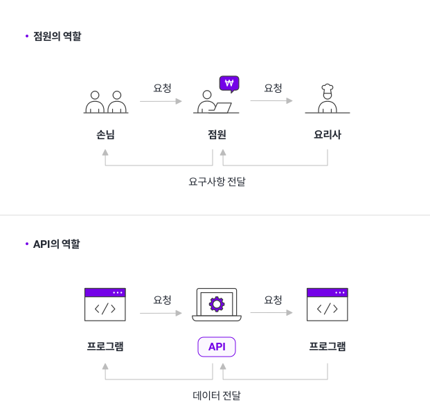
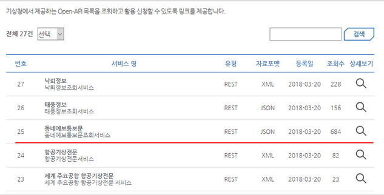
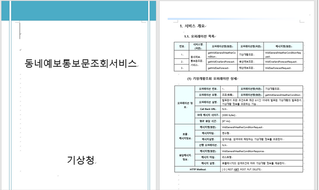

# API 개념

> [!NOTE]
> API(인터페이스)의 기본 개념과 동작, 오픈 API/비공개 API의 차이 및 목적 정리.

## 📌 개념

### API 기본 개념

- **Interface**: 서로 다른 기계 간에 정보를 교환하기 위한 수단·방법

> [!NOTE]
> ex) TV, 리모컨
> 1) 리모컨에서 전원버튼을 누르면 TV가 켜짐
> 2) 리모컨과 TV 간에 정의된 규격에 의해 신호가 보내지도록 규격화된 것
> 이를 "Interface"라 한다.

- DB에 직접 접근하는 것을 방지하는 출입구 역할(허용된 사람만 접근 가능)

동작 흐름:

- 프로그램(A) → 명령 요청 → 명령 접수(API) → 명령값 요청 → 프로그램(B)
- 프로그램(A) ← 명령값 ← 명령값 받음(API) ← 명령값 전달 ← 프로그램(B)

### 오픈 API

- 데이터 정보를 사용할 수 있도록 만들어진 규격
- 오픈 API / 비공개 API로 구분 (예: 기상청 API = 오픈 API)

- API 사용 매뉴얼(예: 기상청 API)
    - 어떤 정보를 전달받기 위해 어떤 방식으로 요청해야 하는지
    - 응답 결과는 어떻게 이루어지는지에 대한 내용이 기재됨

> [!NOTE]
> 왜 오픈 API를 제공하는가? (매뉴얼 작성, 별도 규격 필요에도 불구하고)
> 1) 카카오톡: 간편 로그인 오픈 API → 다른 홈페이지도 쉽게 회원가입 가능
> 2) 카카오톡을 탈퇴하면 연동된 모든 가입처도 탈퇴됨
> 3) 카카오톡의 이탈률 방지

## 🔗 참고

- [IT용어 - API란 무엇인가? (Steemit)](https://steemit.com/kr/@yahweh87/it-api)
