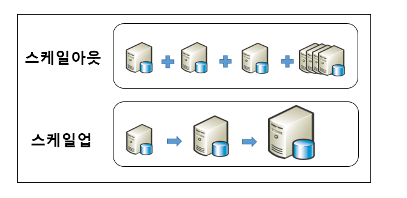

# DataBase

> [!NOTE]
> 데이터베이스와 DBMS 개념, DB 특징, WAS-DB 분리 구성과 스케일 아웃, SQL 분류(DDL/DML/DCL) 정리.

## 📌 개념

### 데이터베이스 / DBMS

- **데이터베이스란?** 통합하여 관리되는 데이터의 집합체. 중복 데이터를 없애고 자료를 구조화하여 효율적 처리를 가능하게 함
- **DBMS(Database Management System)**: 응용프로그램과 별도의 미들웨어로, 데이터베이스를 관리

> [!NOTE]
> 미들웨어: 통상 Web Server와 WAS를 의미
> 1) Web Server: 사용자 요청이 들어오는 순간 정적인 것 처리
> 2) WAS: 데이터를 가공하여 처리(동적 처리)

### 데이터베이스 특징

- 사용자 요청에 대해 즉각적인 처리와 응답
- 생성, 수정, 삭제 가능
- 사용자가 원하는 데이터 동시 공유 가능
- 데이터를 주소가 아닌 내용에 따라 참조 가능
- 데이터의 논리적 구조와 응용프로그램은 별개로 동작(응용프로그램과의 독립성)

### 구성도 (WAS와 DB 분리)

> [!NOTE]
> 1) 단일 서버 구성: 웹 클라이언트 ↔ 웹서버(WAS) + 데이터베이스 서버
> 2) WAS와 DB 분리: 웹 클라이언트 ↔ 웹서버(WAS) ↔ 데이터베이스 서버

- WAS와 DB는 Scale Out이 될 경우 분리되어야 한다.
- **스케일 아웃**: 접속된 서버의 대수를 늘려 처리 능력을 향상

### SQL 분류 (DDL / DML / DCL)

- **DDL(Data Definition Language)**: 데이터베이스·테이블을 생성, 삭제, 구조 변경 — `CREATE`, `ALTER`, `DROP`
- **DML(Data Manipulation Language)**: 저장된 데이터를 조회·검색·조작 — `INSERT`, `UPDATE`, `DELETE`, `SELECT`
- **DCL(Data Control Language)**: 데이터의 보안성 및 무결성 제어 — `GRANT`, `REVOKE`

## 🔗 참고

- [스케일 아웃(Scale out)과 스케일 업(Scale up)](https://m.blog.naver.com/islove8587/220548900044)
