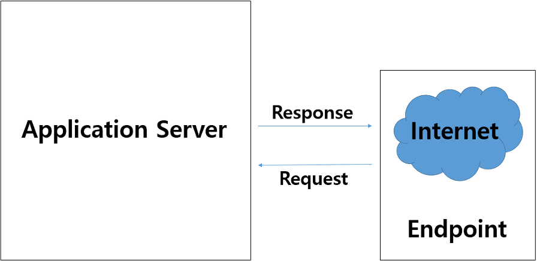
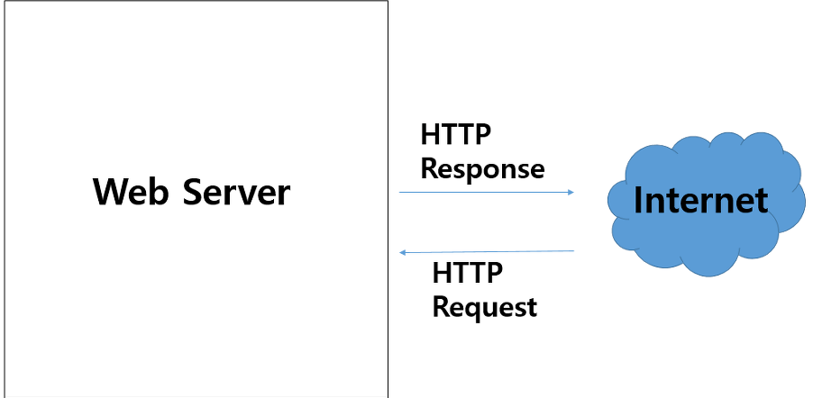
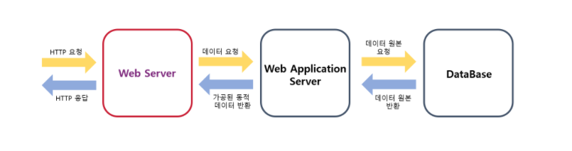
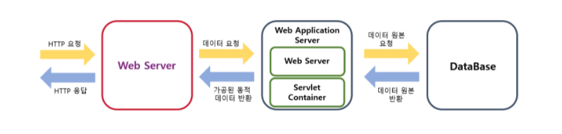
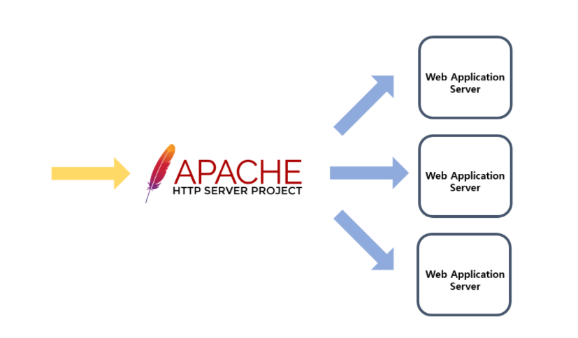
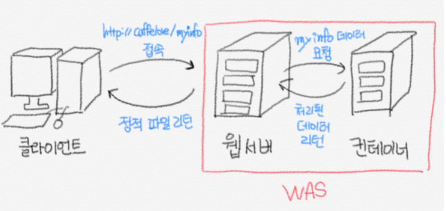

# Application WebServer ( + WAS )

> [!NOTE]
> Application Server, Web Server, WAS의 개념과 차이, Web Server + WAS를 함께 쓰는 이유(로드 밸런싱, 정적/동적 처리 분리) 정리.

## 📌 개념

### Application Server

- 서버 그 자체를 의미
- 네트워크를 통해 서버와 End Point 간 통신을 할 수 있는 서버
- HTTP, UDP, TCP 등 다양한 프로토콜을 전달받아 클라이언트에 서비스 제공

> [!NOTE]
> Web Service: 네트워크 상에서 서로 다른 종류의 컴퓨터들 간 상호작용을 위한 소프트웨어 시스템.
> 주의) World Wide Web(WWW) = 사람과 컴퓨터 간의 상호작용

- **End Point**: 웹서비스 메시지를 처리할 수 있는 엔터티 혹은 리소스. 클라이언트는 서비스에 접근하기 전에 End Point 정보를 알아야 한다.

### Web Server

- Web Server는 HTTP 프로토콜을 주로 처리하는 서버(단순한 문서 조회)
    - **Apache**: 정적 처리에 특화된 웹서버
    - **Tomcat**: 정적 + 동적 처리 가능한 웹서버 → WAS

> [!NOTE]
> 동적 처리: Client의 요청으로 데이터를 가공하여 Client에게 보여주는 경우.
> ex) 로그인한 사용자에 따라 자신이 쓴 글이 보이게 하는 로직 → 데이터 가공(동적)

- **WAS(Web Application Server)**
    - 전자상거래, 파일 공유 → TCP/UDP 처리 → WAS를 이용하여 HTTP에서도 가능
    - Container를 이용하여 동적 데이터 처리 가능
    - HTTP를 이용하는 Application Server라고 볼 수 있음

### Web Server와 Database 연동

- **Web Server와 WAS를 같이 쓰는 이유**
    - WAS는 정적 처리를 할 때 부하가 심하게 걸림
    - 반면 Web Server는 빠르게 처리 가능
    - Web Server로 먼저 Client의 요청을 받고, Load Balancing을 통해 여러 WAS에 분배

> [!NOTE]
> Load Balancing
> 1) 한 개의 WAS는 부하가 쉽게 걸리므로 여러 개의 WAS를 설치
> 2) 여러 WAS에게 요청을 보낼 때 Web Server가 적절히 배분

- Apache: 정적 처리에 특화된 웹서버
- Tomcat: 동적 처리에 사용되는 Web Application Server

### WAS Server

- 컨테이너는 동적 데이터를 처리하여 정적 페이지로 생성해주는 역할
- ex) MyPage
    - 동적 데이터 → mypage (사용자에 따라 페이지가 달라짐, 데이터 가공 필요)
    - container(데이터 가공, 동적) → Web Server로 정적 데이터를 보냄

- HTTP 프로토콜을 이용하는 Application Server
- 문서 조회 및 전자상거래, 파일 공유 기능 사용 가능

## 관련 문서

- [(프로젝트) [배포 #2] WAR & JAR 차이](../../../프로젝트/토이프로젝트/영화예매%20프로젝트/[배포%20%232]%20WAR%20&%20JAR%20차이.md) — WAR 파일이 이 문서의 WAS 개념 위에서 실행되어야 하는 이유를 실전 프로젝트에서 정리한 문서
