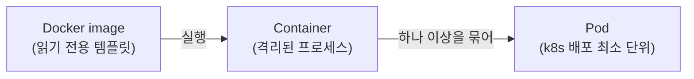
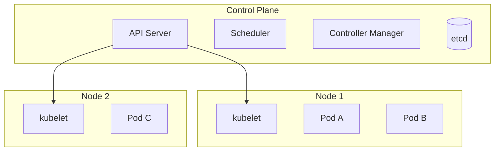

# 쿠버네티스 기본 개념 (Pod·Node·Cluster·Deployment)

> 컨테이너를 여러 서버에 배포하고 늘리고 줄이고, 장애 시 복구하는 것을 자동으로 관리하는 오케스트레이터 쿠버네티스(k8s)의 핵심 개념을 정리한다. 용어 정의는 [IT 용어집 - 빌드·배포·인프라](IT%20용어집/[용어]%20빌드·배포·인프라.md) 참고.

## 1. 이미지, 컨테이너, pod의 관계



| 용어 | 한 줄 정의 |
| --- | --- |
| image | 앱, 의존성, 설정을 레이어로 묶은 **읽기 전용 템플릿**(클래스에 해당) |
| container | 이미지를 **실행한 것**(객체에 해당). 호스트 OS 커널을 공유하는 격리된 프로세스 |
| pod | 쿠버네티스에서 **배포와 스케줄링의 최소 단위**. 하나 이상의 컨테이너를 묶은 것 |

- pod는 "이미지"가 아니다. 이미지로부터 만든 컨테이너를 담아 실행하는 **단위**다.
- 같은 pod 안의 컨테이너는 **같은 IP와 저장소를 공유**하고 `localhost`로 서로 통신한다.
- 앱 컨테이너 옆에 로그 수집, 프록시 같은 보조 컨테이너를 같이 두는 것을 **sidecar** 패턴이라 한다(service mesh의 Envoy가 대표적).

VM과 컨테이너의 차이, 배포 방법은 [서버 배포 (+Docker)](개발%20%28CS%29/인프라/컨테이너·가상화/[Docker]%20서버%20배포%20%28+Docker%29%20-%20핵심%20개념%20및%20특징%20정리.md) 참고.

## 2. 클러스터 구조



| 구성 요소 | 역할 |
| --- | --- |
| **node** | pod가 실제로 실행되는 서버 한 대(물리 또는 VM) |
| **cluster** | 여러 node를 묶어 하나의 시스템처럼 운영하는 단위 |
| control plane | 클러스터를 관리하는 두뇌. API server(모든 요청의 창구), scheduler(pod를 어느 node에 둘지 결정), controller(원하는 상태 유지), etcd(상태 저장소) |
| kubelet | 각 node에서 pod를 실제로 띄우고 감시하는 에이전트 |

여기서 control plane은 쿠버네티스 안의 관리 계층을 가리키는 말이고, 통신망의 control plane(제어 평면)과는 별개의 맥락이다.

## 3. 선언형: "원하는 상태"를 적으면 맞춰 준다

쿠버네티스는 "이렇게 실행해라(명령)"가 아니라 **"이 상태가 되어야 한다(선언)"**를 yaml로 적고, controller가 현재 상태를 그 상태에 계속 맞춘다.

```yaml
apiVersion: apps/v1
kind: Deployment
metadata:
  name: web
spec:
  replicas: 3                 # pod를 3개 유지
  selector:
    matchLabels:
      app: web
  template:                   # pod 모양
    metadata:
      labels:
        app: web
    spec:
      containers:
        - name: web
          image: registry.example.com/web:1.2.0
          ports:
            - containerPort: 8080
          resources:
            requests: { cpu: "250m", memory: "256Mi" }
            limits:   { cpu: "500m", memory: "512Mi" }
```

- pod 하나가 죽으면 controller가 새 pod를 만들어 **replicas 수를 다시 맞춘다**(자가 복구).
- yaml 형식 자체는 들여쓰기로 구조를 표현하는 설정 파일 형식이다(공백만 쓰고 탭은 쓰지 않는다).

## 4. 주요 리소스

| 리소스 | 역할 |
| --- | --- |
| Deployment | 같은 pod를 N개 유지하고 **롤링 업데이트·롤백**을 관리 (내부적으로 ReplicaSet 사용) |
| Service | pod들 앞의 **고정된 접속 주소 + 로드밸런싱**. pod IP는 계속 바뀌므로 필요 |
| Ingress | 클러스터 밖에서 들어오는 HTTP 요청을 Service로 **라우팅**(도메인, 경로 기준) |
| ConfigMap / Secret | 설정 값 / 민감 값(비밀번호, 키)을 이미지 밖에서 주입 |
| Namespace | 클러스터를 논리적으로 나누는 구역(환경, 팀별) |
| StatefulSet | 상태가 있는 앱(DB 등). 이름·저장소가 고정된 pod |

## 5. 확장과 상태 점검

- **scale out / in**: replicas 수를 늘리거나 줄인다. **HPA(Horizontal Pod Autoscaler)**는 CPU 등 지표에 따라 replicas를 자동으로 조절한다. traffic spike 대응의 기본 수단이다. (scale up/down은 한 대의 사양을 올리고 내리는 것)
- **readiness probe**: "트래픽을 받을 준비가 됐나"를 확인한다. 실패하면 Service의 대상에서 빠진다(재시작은 안 함).
- **liveness probe**: "살아 있나"를 확인한다. 실패하면 컨테이너를 **재시작**한다.
- **롤링 업데이트**: 새 버전 pod를 하나씩 띄우고 옛 pod를 하나씩 내려서 무중단으로 교체한다. 문제가 생기면 이전 revision으로 **롤백**한다.

## 6. 자원 설정과 OOM Kill

- `requests`: 스케줄러가 pod를 배치할 때 **보장해 주는 양**. `limits`: 넘으면 안 되는 **상한**.
- memory limit을 넘으면 **OOM Kill**로 컨테이너가 강제 종료된다. 이때 기준은 힙만이 아니라 **프로세스 전체 메모리(RSS)**다. 힙에 여유가 있어도 네이티브 메모리, 스레드 스택, 페이지 캐시 때문에 죽을 수 있다.
- CPU limit을 넘으면 죽지는 않고 **throttling**(느려짐)된다.

## 7. 자주 쓰는 kubectl 명령

```bash
kubectl get pods -o wide                 # pod 목록과 node
kubectl describe pod <name>              # 이벤트, 재시작 원인 확인
kubectl logs <pod> -c <container>        # 로그
kubectl exec -it <pod> -- sh             # pod 안으로 들어가기
kubectl rollout status deployment/web    # 배포 진행 상태
kubectl rollout undo deployment/web      # 롤백
kubectl scale deployment/web --replicas=5
```

## 8. 헷갈리는 점 정리

| 비교 | 차이 |
| --- | --- |
| image vs container vs pod | image는 템플릿, container는 그것을 실행한 것, pod는 container를 묶어 배포하는 k8s 최소 단위 |
| node vs pod | node는 서버 한 대, pod는 그 위에서 도는 실행 단위 |
| Deployment vs Service | Deployment는 pod를 N개 **유지**, Service는 그 pod들의 **접속 주소** |
| readiness vs liveness | readiness는 트래픽에서 제외, liveness는 재시작 |
