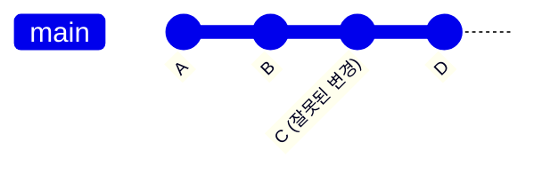

# Git 되돌리기 정리 (revert·reset·rebase)

> `revert`, `reset`, `rebase`는 모두 "이력을 다룬다"는 점에서 비슷해 보이지만 하는 일이 다르다. 특히 **rebase는 되돌리기가 아니다.** 용어 정의는 [IT 용어집 - Git·버전관리](IT%20용어집/[용어]%20Git·버전관리.md) 참고.

## 1. 한눈에 비교

| | revert | reset | rebase |
| --- | --- | --- | --- |
| 하는 일 | 특정 commit의 변경을 **취소하는 새 commit**을 추가 | 브랜치(HEAD)가 가리키는 commit을 **지정한 commit으로 옮김** | 브랜치의 **기준(base)**을 옮기고 commit들을 **다시 쌓음** |
| 이력 | **보존**(취소 기록이 추가됨) | commit이 이력에서 **사라진 것처럼** 됨 | commit이 **새로 만들어져** 해시가 바뀜 |
| push한 브랜치에 | **안전** | 위험(force push 필요) | 위험(force push 필요) |
| 주 용도 | 공유된 브랜치에서 잘못된 변경 되돌리기 | 로컬에서 commit 취소·정리 | 이력을 일직선으로 정리, 최신 main 위로 옮기기 |

## 2. commit 이력과 포인터 그림



- `HEAD`는 "지금 내가 보고 있는 commit"(보통 현재 브랜치의 끝)을 가리키는 포인터다.
- branch는 특정 commit을 가리키는 **이름표**라서 만들고 지우는 비용이 거의 없다.

## 3. revert: 취소했다는 기록을 남긴다

```bash
git revert <commit>        # C의 변경을 거꾸로 적용한 새 commit(C') 생성
```

```
A - B - C - D - C'(C를 취소한 commit)
```

- 이력은 그대로 두고 **"취소했다"는 commit이 추가**된다.
- 이미 push해서 다른 사람이 가져간 브랜치에서 되돌릴 때 **안전**하다.
- merge commit을 revert할 때는 어느 부모를 기준으로 할지 `-m 1` 같은 옵션이 필요하다.

## 4. reset: HEAD를 옮긴다

```bash
git reset --soft  <commit>   # commit만 취소. 변경은 staging에 남음
git reset --mixed <commit>   # (기본) commit과 staging 취소. 파일 변경은 남음
git reset --hard  <commit>   # commit, staging, 파일 변경까지 모두 버림
```

| 옵션 | commit | staging(index) | 작업 폴더 파일 |
| --- | --- | --- | --- |
| `--soft` | 취소 | 유지 | 유지 |
| `--mixed` | 취소 | 취소 | 유지 |
| `--hard` | 취소 | 취소 | **버림(복구 어려움)** |

- "commit 취소"는 맞지만 **어디까지 취소하느냐가 옵션마다 다르다.**
- 이력이 사라지므로 **이미 push한 브랜치에 쓰면 force push가 필요**하고, 다른 사람의 작업과 어긋난다.
- 실수로 `--hard`를 했어도 `git reflog`로 HEAD가 가리켰던 commit 기록을 찾아 되돌릴 수 있는 경우가 많다(일정 기간 내).

## 5. rebase: 되돌리기가 아니라 "다시 쌓기"

```bash
git switch feature
git rebase main          # feature의 시작점(base)을 최신 main으로 옮김
```

```
Before:   A - B - C (main)
               \
                D - E (feature)

After:    A - B - C (main)
                   \
                    D' - E' (feature)   ← D, E가 새 commit(D', E')으로 다시 만들어짐
```

- merge와 비교하면: **merge**는 이력을 그대로 두고 합치는 지점에 merge commit을 만든다. **rebase**는 commit을 새로 만들어 쌓아서 **일직선 이력**을 만든다.
- commit이 새로 만들어지므로 **해시가 바뀐다.** 이미 push해서 공유한 브랜치에 쓰면 다른 사람과 이력이 어긋난다(force push 필요).
- 원칙: **내 로컬(아직 공유하지 않은) 브랜치에서만** rebase한다.

### interactive rebase

```bash
git rebase -i HEAD~3
```

| 명령 | 효과 |
| --- | --- |
| `pick` | 그대로 사용 |
| `reword` | commit 메시지 수정 |
| `squash` / `fixup` | 앞 commit에 합치기(메시지 합침 / 버림) |
| `edit` | 그 commit에서 멈춰 내용 수정(commit author 수정에도 사용) |
| `drop` | commit 삭제 |

이력 정리와 commit author 수정에 쓴 예는 [GIT 정리](개발%20%28CS%29/인프라/형상관리/[Git]%20GIT%20-%20핵심%20개념%20및%20특징%20정리.md) 참고.

## 6. 상황별로 무엇을 쓸까

| 상황 | 쓸 것 |
| --- | --- |
| 이미 push한 commit이 잘못됨 | `revert` |
| 방금 한 commit을 취소하고 다시 쓰고 싶음(로컬) | `reset --soft HEAD~1` |
| commit과 staging은 취소하고 파일은 남기고 싶음 | `reset --mixed HEAD~1` |
| 작업한 내용을 전부 버리고 깨끗한 상태로 | `reset --hard`(신중히) |
| 내 feature 브랜치를 최신 main 위로 옮기고 싶음 | `rebase main` |
| 여러 commit을 하나로 합치고 싶음 | `rebase -i`의 `squash` |
| 다른 브랜치의 commit 하나만 가져오고 싶음 | `cherry-pick` |
| 작업 중인 변경을 잠시 치워 두고 싶음 | `stash` |

## 7. 안전하게 하는 습관

- 이력을 바꾸는 작업(reset, rebase) 전에 **백업 브랜치**를 하나 만든다: `git branch backup/기능명`
- push 전에 `git log --oneline --graph`로 모양을 확인한다.
- force push는 `--force` 대신 **`--force-with-lease`**를 쓴다(내가 마지막으로 본 상태와 서버가 같을 때만 덮어씀).
- 공유 브랜치(main 등)에는 force push를 하지 않는다.

관련 노트: [브랜치 관리 전략](개발%20실무/표준·컨벤션/[Git]%20브랜치%20관리%20전략%20%28Branch%20Management%20Gu%20-%20핵심%20개념%20및%20특징%20정리.md), [COMMIT 컨벤션 가이드](개발%20실무/표준·컨벤션/[Git]%20COMMIT%20컨벤션%20가이드%20-%20핵심%20개념%20및%20특징%20정리.md), [CI-CD merge 해결](개발%20%28CS%29/인프라/형상관리/[Git]%20CI-CD%20merge%20해결%20-%20핵심%20개념%20및%20특징%20정리.md)
