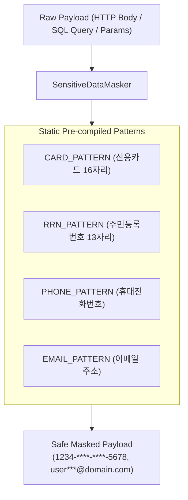
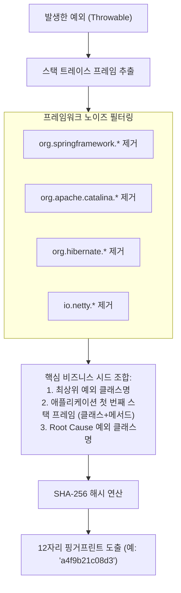

# [Security] 제로 디펜던시 개인정보 마스킹과 오류 핑거프린팅(SHA-256) 모니터링 설계

> **핵심 요약**  
> 대규모 분산 환경에서 APM과 중앙화된 로그 시스템(Grafana Loki, ElasticSearch)을 구축할 때 마주치는 **개인정보보호 컴플라이언스(PII 누출 방지)**와 **로그 폭증에 따른 알림 피로(Alert Fatigue)**를 해결하기 위해, **Zero-Allocation 정규식 마스킹 엔진**과 **SHA-256 기반 프레임워크 노이즈 필터링 에러 핑거프린팅 아키텍처**를 분석한다.

---

## 1. APM 로깅과 개인정보(PII) 컴플라이언스 위험

APM이 상세 디버깅을 위해 HTTP 요청/응답 바디, SQL 바인드 파라미터, 예외 스택 트레이스를 기록할 때, 다음과 같은 개인식별정보(PII)가 평문으로 로그 저장소에 인덱싱될 위험이 있다.

- **신용카드 번호**: 16자리 숫자 (PCI-DSS 규정 위반 시 거액의 과징금)
- **주민등록번호 / 외국인등록번호**: 13자리 고유식별정보 (개인정보보호법상 암호화 필수)
- **이메일 주소 및 휴대전화번호**: 고객 식별 및 스팸/피싱 악용 가능

중앙 로그 저장소는 수많은 개발자와 운영자가 열람하므로, **로그가 WAS 밖으로 배출되는 최전방 메모리 단계에서 완벽하게 마스킹**되어야 한다.

---

## 2. 고성능 제로 디펜던시(Zero-Dependency) 정규식 마스킹 엔진

외부 무거운 보안 라이브러리(BouncyCastle 등) 없이, JVM 순수 정규식 엔진을 최적화하여 GC 압박 없이 초당 수만 건의 텍스트를 마스킹한다.



### 2.1 Pattern 상수화 및 Zero-Allocation 최적화 원칙
`String.replaceAll(regex, replacement)`를 직접 호출하면 매 호출 시마다 내부적으로 `Pattern.compile(regex)`가 실행되어 CPU 자원을 소모하고 임시 객체가 대량 생성된다. 반드시 `static final Pattern`으로 사전 컴파일해야 한다.

```java
// SensitiveDataMasker.java
public final class SensitiveDataMasker {
    // 16자리 카드 번호 마스킹: 앞 4자리, 뒤 4자리만 보존
    private static final Pattern CARD_PATTERN = Pattern.compile(
        "\b(\d{4})[- ]?(\d{4})[- ]?(\d{4})[- ]?(\d{4})\b"
    );

    // 주민등록번호: 앞 6자리 보존, 뒤 7자리 마스킹
    private static final Pattern RRN_PATTERN = Pattern.compile(
        "\b(\d{6})[- ]?([1-4]\d{6})\b"
    );

    // 전화번호: 중간 4자리 마스킹
    private static final Pattern PHONE_PATTERN = Pattern.compile(
        "\b(01[016789])[- ]?(\d{3,4})[- ]?(\d{4})\b"
    );

    public static String mask(String content) {
        if (content == null || content.isEmpty()) return content;
        
        String result = CARD_PATTERN.matcher(content).replaceAll("$1-****-****-$4");
        result = RRN_PATTERN.matcher(result).replaceAll("$1-*******");
        result = PHONE_PATTERN.matcher(result).replaceAll("$1-****-$3");
        return result;
    }
}
```

---

## 3. 대규모 로그 환경에서의 오류 핑거프린팅(Error Fingerprinting) 아키텍처

분산 시스템에서 DB 장애나 네트워크 타임아웃이 발생하면 1초에 수천 건의 동일한 에러 로그가 쏟아져 나온다. 단순 문자열 매칭으로 에러를 모니터링하면 다음과 같은 문제에 봉착한다.

```
[단순 에러 메시지 비교의 실패]
Log 1: "Connection timeout to 10.0.1.15:3306 at timestamp 1710000001"
Log 2: "Connection timeout to 10.0.1.18:3306 at timestamp 1710000002"
-> IP와 타임스탬프가 달라 서로 다른 2개의 에러로 인식되어 알림 폭탄 발생
```



### 3.1 `ErrorFingerprinter` 알고리즘 구현
```java
// ErrorFingerprinter.java
public final class ErrorFingerprinter {
    private static final Set<String> IGNORED_PACKAGES = Set.of(
        "org.springframework", "org.apache", "org.hibernate", 
        "io.netty", "jdk.internal", "java.lang.reflect"
    );

    public static String fingerprint(Throwable throwable) {
        if (throwable == null) return "none";

        StringBuilder seed = new StringBuilder();
        seed.append(throwable.getClass().getName()).append(";");

        // 1. 프레임워크 스택을 제외한 첫 번째 순수 비즈니스 애플리케이션 프레임 검색
        StackTraceElement appFrame = findAppFrame(throwable);
        if (appFrame != null) {
            seed.append(appFrame.getClassName()).append("#")
                .append(appFrame.getMethodName()).append(";");
        }

        // 2. 근본 원인(Root Cause) 예외 클래스 추가
        Throwable rootCause = getRootCause(throwable);
        seed.append(rootCause.getClass().getName());

        // 3. SHA-256 해시 후 앞 12자리 추출
        return sha256Hex(seed.toString()).substring(0, 12);
    }
}
```

- **효과**: 라인 번호가 배포로 인해 약간 바뀌거나 동적 파라미터가 달라져도, **코드의 논리적 결함 위치가 동일하다면 언제나 동일한 12자리 해시값**(`error_fingerprint`)을 생성한다.

---

## 4. Grafana Loki 연동 및 N+1 쿼리 탐지 모니터링

### 4.1 Logfmt 구조화 로그 출력
생성된 메타데이터는 Grafana Loki에서 LogQL로 고속 인덱싱될 수 있도록 SLF4J Marker와 `key=value` 형태의 `logfmt` 규격으로 출력된다.

```
level=ERROR marker=[EXCEPTION] trace_id=a1b2c3d4 span_id=e5f6g7h8 error_fingerprint=a4f9b21c08d3 ex_class=IllegalArgumentException msg="Invalid account state"
```

- **Grafana Loki 대시보드 쿼리**:
  ```logql
  sum by (error_fingerprint) (rate({app="payment-service"} |= "error_fingerprint" [5m]))
  ```
  특정 장애 지문이 급증할 때 슬랙 알림을 1회만 트리거하여 알림 피로를 방지한다.

### 4.2 N+1 쿼리 실시간 탐지 임계치 패턴
```java
// SqlTraceContext.java
public void recordSql(String sqlId) {
    int count = sqlCallCounts.merge(sqlId, 1, Integer::sum);
    if (count == n1DetectionThreshold) { // 기본 3회
        log.warn(N1_QUERY_MARKER, "sql_id={} repeated_count={} possible N+1 query detected", sqlId, count);
    }
}
```
단일 HTTP 트랜잭션 내에서 동일한 Mapper ID 또는 Prepared SQL이 임계 횟수 이상 반복 실행되는 순간 즉시 `[N1_QUERY]` 경보를 발생시켜 운영 장애를 사전에 차단한다.

## 관련 문서

- [(오픈소스) mini-apm-spring-boot-starter - 상세 분석 및 기술 가이드](../../프로젝트/오픈소스/[오픈소스]%20mini-apm-spring-boot-starter%20-%20상세%20분석%20및%20기술%20가이드.md) — 이 마스킹/핑거프린팅 설계가 포함된 오픈소스 APM Starter 프로젝트의 전체 상세 분석
- [(Design Pattern) 실무 프로젝트 및 오픈소스로 체득하는 GoF 핵심 디자인 패턴 10선 (Proxy, Decorator, Strategy, Chain, Template, SPI, Visitor, Facade)](../아키텍처·설계/[Design%20Pattern]%20실무%20프로젝트%20및%20오픈소스로%20체득하는%20GoF%20핵심%20디자인%20패턴%2010선%20(Proxy,%20Decorator,%20Strategy,%20Chain,%20Template,%20SPI,%20Visitor,%20Facade).md) — 3.3절 템플릿 메서드 패턴(`AbstractLogProcessor`)에서 뼈대만 다룬 마스킹/핑거프린팅 로직을 코드 레벨로 상세히 풀어낸 자매 노트