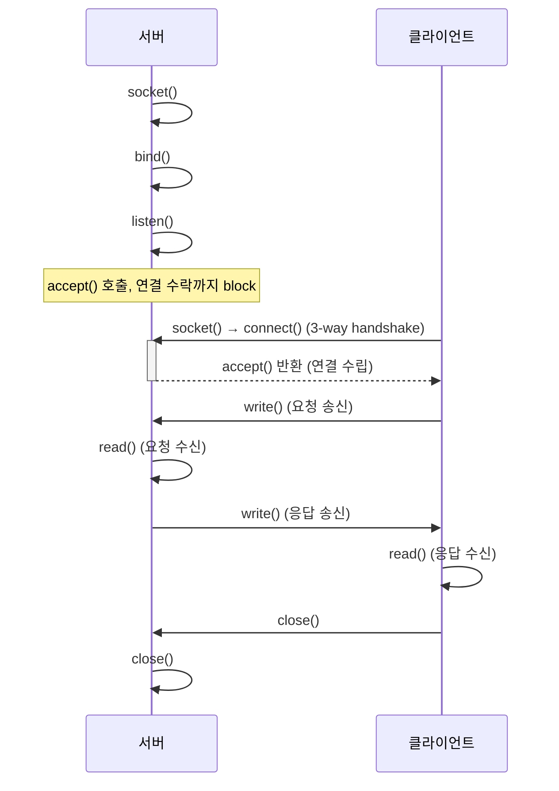

# 소켓흐름

> [!NOTE]
> 서버/클라이언트 소켓 통신의 함수 호출 흐름, 연결 유지 방식(fork), 그리고 Java에서의 소켓 처리(NIO 포함) 정리.
> 원문을 AI가 검토·보강함(사실 확인 권장).

## 📌 개념

### 소켓 통신 흐름

- **서버**: `socket()` → `bind()` → `listen()` → `accept()` → `read()` → `write()` → `close()`
    - `accept()`: 연결 수락까지 block(블로킹) 처리
    - `read()`: 클라이언트 요청 수신 / `write()`: 서버 응답 송신
- **클라이언트**: `socket()` → `connect()` → `write()` → `read()` → `close()`
    - `connect()`: 3-way handshake로 커넥션 수립(이때 서버는 accept에서 block)
    - `write()`: 요청 송신 / `read()`: 서버 응답 수신

### 소켓 연결 유지 방법

- `fork()`: 자식 프로세스 생성
    - `accept()`가 반환하는 세션 소켓(client-server)을 새 자식 프로세스에서 독립적으로 처리하도록 지정
- 단점
    - 동기(멀티프로세스) 방식이라 소규모 연결은 무방하나 대규모 처리 시 성능 이슈 발생
    - 대안(비동기 방식): `select()`, `epoll()`, `iocp()` 등

### Java 소켓 처리

- `InputStream`: 들어오는 값(해당 서버) 읽기 / `OutputStream`: 나가는 값(해당 서버) 쓰기
- 두 스트림은 단방향 통신(또는 `SocketChannel` 사용)
- `Thread.start()`: 스레드를 생성·시작하며 내부적으로 `run()` 호출(실제 실행 로직은 `run()`에 오버라이딩)

> [!NOTE]
> **`fork()`는 운영체제(OS) 레벨에서 프로세스를 복제하는 방식**
> - C에서 `fork()`를 호출하면 새 자식 프로세스가 생성되어 독립적으로 실행된다.
> - 반면 Java는 기본적으로 멀티프로세스를 지원하지 않고 **멀티스레드 기반 실행**을 권장한다.

> [!NOTE]
> Java는 이벤트 기반 처리(`epoll()`)나 상태 변화 감지(`select()`) 대신 **NIO**를 사용한다.
> - 프로세스: `Runtime.exec()` 또는 `ProcessBuilder`로 Java 프로세스를 띄울 수는 있으나 일반적이지 않음(멀티스레드 권장).
> - NIO의 `Selector`로 `epoll()`/`select()`를 유사하게 구현 가능.
> - NIO 프레임워크 **Netty**로 고성능 처리 가능(내부적으로 epoll 사용).

## 📎 기타

### 트러블슈팅

- `InputStream`/`OutputStream`의 세션을 `close()`하면 소켓도 `close()`된다.

> [!NOTE]
> `Socket`의 `getInputStream()`/`getOutputStream()`은 소켓 내부 스트림을 참조하는 객체를 반환한다. 이 스트림들은 소켓과 강하게 연결되어 있어, 스트림이 닫히면 소켓도 닫히도록 구현되어 있다.
