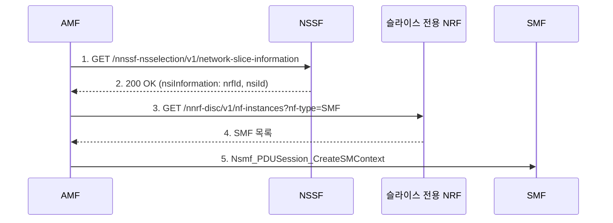

# 규격서의 빈 칸 읽기 — API 사이의 관계 추론하기

> [!NOTE] 한 줄 요약
> 규격서는 API를 **하나씩** 설명할 뿐, API **사이의 관계**와 **왜 만들어졌는지**는 문단 순서로 암시하거나 아예 적지 않습니다. 이 빈 칸을 **"왜 이 API가 있을까?"** 라는 질문으로 채우고, 채운 답을 규격으로 **검증**하는 읽기 방식을 정리합니다.

---

## 1. 문제 — 규격서는 점만 찍어 준다

3GPP 규격(TS 29.xxx 시리즈)은 서비스별로 이렇게 구성됩니다.

```
오퍼레이션 이름 → 리소스 URI / HTTP 메서드 → 요청·응답 데이터 타입 → 에러 코드
```

이 구조는 **구현에 필요한 정보**(Stage 3)로는 충분합니다. 하지만 아래 질문에는 답해 주지 않습니다.

| 규격서가 알려 주는 것 | 규격서가 알려 주지 않는 것 |
|---|---|
| 이 API의 요청/응답 필드 | **누가, 언제, 왜** 이 API를 호출하는가 |
| 필드가 M(필수)/O(선택)/C(조건부)인지 | 이 응답을 받은 쪽이 **다음에 무엇을 하는가** |
| 이 오퍼레이션이 존재한다는 사실 | **이미 있는 API로는 왜 안 되는가** |

그래서 API를 하나씩 외우면 **점은 많아도 선이 없습니다.** 선(호출 흐름)과 면(시스템 구조)은 읽는 사람이 직접 그려야 합니다.

> [!IMPORTANT] 계기
> NRF 문서를 읽다가 시니어 개발자에게 이런 질문을 받았고, 그 질문이 읽는 방식을 바꿨습니다.
> **"이게 왜 만들어진 API라고 생각해?"** — 규격을 다 이해했다고 생각했는데, 답하려고 보니 *"무엇"* 만 알고 *"왜"* 는 몰랐습니다.

---

## 2. 신뢰도 표시 — 추론한 내용을 사실처럼 쓰지 않기

추론을 하다 보면 "규격에 있는 말"과 "내가 지어낸 말"이 섞입니다. 구분하려고 모든 항목에 **상태 태그**를 붙입니다.

| 태그 | 의미 |
|---|---|
| 🟢 **명시** | 규격에 직접 적혀 있음 |
| 🟡 **암시** | 문단·절의 순서, 필드 구조에서 읽힘 (직접 서술은 없음) |
| 🟠 **추론** | 내가 세운 가설. 규격 확인 전 |
| 🔵 **검증됨** | 가설을 규격 또는 동작 확인으로 확인함 |

> [!WARNING]
> 아래 사례 중 🟠가 붙은 항목은 **아직 규격 원문으로 확인하지 않은 가설**입니다. 가설을 가설로 남겨 두는 것도 이 방법의 일부입니다.

---

## 3. 사례 1 — NFListRetrieval은 왜 URI 목록만 주는가

### 3-1. 규격이 말한 것 (🟢)

NRF의 `Nnrf_NFManagement` 서비스에는 등록된 NF 목록을 조회하는 **NFListRetrieval**이 있습니다 (TS 29.510).

```
GET /nnrf-nfm/v1/nf-instances?nf-type=SMF&limit=10

200 OK
{ "_links": { "item": [
    { "href": ".../nf-instances/4947a69a-..." },
    { "href": ".../nf-instances/b21c03f0-..." }
] } }
```

- 응답 본문은 **`UriList`** — NFProfile이 아니라 **URI만** 담습니다.
- 필터는 `nf-type`, `limit` 정도로 단순합니다.

### 3-2. 질문 — "그냥 Discovery 쓰면 되지 않나?"

NRF에는 이미 `Nnrf_NFDiscovery`가 있습니다. 조건(`target-nf-type`, `snssais`, `dnn`…)을 주면 **NFProfile(IP, FQDN, priority, load 포함)을 바로** 줍니다.

> URI만 받아서 뭐 하겠는가? 프로필이 필요하면 그냥 Discovery로 골라서 가져오면 되는데?

이 질문이 "왜 만들어졌는가"를 묻는 첫 단계입니다. **대안을 일부러 들이대서** 기존 API로 해결되지 않는 지점을 찾는 방식입니다.

### 3-3. 추론 (🟠 — 시니어 피드백 기반)

| 단계 | 내용 |
|---|---|
| 제약 | 한 망(visited 또는 home)의 NRF에 있는 **모든 NF의 정보**를 한 번에 응답으로 주면 **양이 너무 많아** 전송도, 받는 쪽의 처리도 감당하기 어렵다 |
| 해법 | 먼저 **URI 목록만** 가볍게 주고, 필요한 NF만 골라 **개별 조회(NFProfileRetrieval)** 하게 한다 |
| 쓰임 | **로밍**처럼 상대 망 NF 정보를 다뤄야 하는 상황 |

핵심은 **"Discovery는 조건에 맞는 것을 골라 주는 API이고, ListRetrieval은 조건 없이 전체의 지도를 주는 API"** 라는 역할 구분입니다. 필터링이 안 되는 상황에서 전체 프로필을 보내는 것은 불가능하므로, 응답 크기를 **URI 수준으로 줄이는 것**이 설계 목적이라고 해석합니다.

> [!NOTE]
> 이 내용은 규격에 적혀 있지 않습니다. "규격의 빈 칸을 시니어 개발자의 질문으로 채운" 사례입니다.

### 3-4. 검증할 것 (🟠 → 🔵로 가려면)

이 가설은 **규격 정리 노트와 충돌하는 지점이 하나** 있어서 그대로 믿으면 안 됩니다.

- 29.510의 8개 서비스 오퍼레이션 중 **다른 PLMN에서 직접 호출 가능한 것은 Subscribe, Notify, Unsubscribe뿐**이라고 정리해 두었고, NFListRetrieval은 "불가"입니다.
- 그렇다면 "로밍에서 쓰인다"는 말은 **PLMN 간 직접 호출이 아니라, 로밍과 관련된 다른 경로**(예: 같은 PLMN 안의 NRF 계층, 또는 NRF가 목록을 먼저 받아 필요한 것만 조회하는 방식)를 뜻할 수도 있습니다.

확인 체크리스트:

- [ ] 29.510의 NFListRetrieval 오퍼레이션 절에서 **호출 주체와 호출 대상 NRF**가 누구인지 확인
- [ ] 같은 표에서 **PLMN 간 호출 가능 여부** 원문 재확인
- [ ] 로밍 시나리오에서 NRF가 다른 NRF의 NF를 어떻게 찾는지(Discovery 포워딩 등) 23.502 절차와 대조
- [ ] `limit` 파라미터의 의미(결과 개수 상한)가 "너무 많아서 줄 수 없다"는 가설과 맞는지 확인

> [!TIP]
> 가설이 규격과 어긋나면 **가설을 버리는 것이 아니라 고칩니다.** 어긋난 지점이 오히려 규격의 숨은 조건을 알려 주기 때문입니다.

---

## 4. 사례 2 — Subscribe 계열만 PLMN 간 호출이 허용되는 이유

### 4-1. 규격이 말한 것 (🟢, 정리 노트 기준)

`Nnrf_NFManagement`의 8개 오퍼레이션 중 다른 PLMN에서 호출이 가능한 것은 3개뿐입니다.

| 오퍼레이션 | 다른 PLMN에서 호출 |
|---|---|
| NFRegister / NFUpdate / NFDeregister | 불가 |
| NFListRetrieval / NFProfileRetrieval | 불가 |
| **NFStatusSubscribe** | **가능** (로컬 NRF 경유) |
| **NFStatusNotify** | **가능** (로컬 NRF 개입 없이 **직접**) |
| **NFStatusUnsubscribe** | **가능** (로컬 NRF 경유) |

### 4-2. 질문 — 왜 하필 이 셋인가?

오퍼레이션 이름만 보면 서로 무관해 보이지만, **허용 범위가 다르다는 사실 자체가 설계 의도를 말해 줍니다.**

### 4-3. 추론 (🟡/🟠)

- Register/Update/Deregister는 **자기 망 NF의 관리**입니다. 남의 망에 등록할 이유가 없습니다.
- Subscribe는 **상대 망 NF의 상태를 지켜보려는** 요구입니다. 로밍 단말을 처리하려면 상대 망 NF의 가용 여부를 알아야 합니다. → 이것만 PLMN 경계를 넘어야 합니다. (🟠)
- Notify가 **중간 NRF 없이 직접** 전달되는 것은 **알림 지연을 줄이기** 위한 설계로 읽힙니다. (🟠)

### 4-4. 사례 1과 이어 읽기

사례 1(ListRetrieval은 PLMN 간 불가)과 사례 2(Subscribe는 가능)를 **같이 놓으면** 질문이 바뀝니다.

> 상대 망의 NF를 알아야 할 때, **목록을 가져오는 방식(Pull)이 아니라 변화를 통지받는 방식(Push)** 을 규격이 택한 것 아닐까?

이 질문은 두 API를 따로 읽을 때는 나오지 않습니다. 점 두 개를 이어서 비로소 보이는 **선**입니다. (🟠)

---

## 5. 사례 3 — AMF는 NSSF를 부르고 왜 NRF를 또 부르는가

### 5-1. 규격이 말한 것 (🟢, TS 29.531 흐름)

PDU 세션 생성 시 AMF의 호출 순서는 이렇습니다.



### 5-2. 질문 — NSSF가 SMF를 바로 알려 주면 안 되나?

NSSF 응답에는 SMF 주소가 아니라 **`nrfId`(NRF의 API Root URI)** 가 들어 있습니다. 한 단계를 더 돌아가는 구조입니다.

### 5-3. 추론 (🟠)

| 구성요소 | 판단하는 것 |
|---|---|
| NSSF | **"이 슬라이스는 어느 영역(NSI)이 담당하는가"** |
| NRF | **"그 영역 안에서 지금 쓸 수 있는 SMF는 누구인가"** |

- SMF의 상태(부하, 생존)는 **계속 변하는 정보**이고 NRF가 이미 관리합니다. NSSF가 이를 중복 보유하면 **동기화 문제**가 생깁니다. → 역할을 나누고 **"NRF가 어디인지"만** 전달합니다.
- 슬라이스마다 전용 NRF를 둘 수 있다는 점도 **NRF 주소를 응답으로 주는 구조**를 요구합니다.
- 로밍에서는 슬라이스 ID(SST 128~255 등 사업자 정의 값)가 **망마다 의미가 달라** 매핑이 필요하고, 그 매핑을 NSSF가 맡는 구조와도 맞아떨어집니다.

> [!NOTE]
> 규격은 이 흐름을 **순서대로만** 보여 줍니다. "왜 두 번 묻는가"는 읽는 사람이 채워야 하는 빈 칸입니다. (🟡 순서로 암시 → 🟠 이유는 추론)

---

## 6. 입문용 짧은 사례

| 사례 | 규격이 말한 것 | 빈 칸 질문 | 추론 |
|---|---|---|---|
| **Heartbeat가 PATCH인 이유** | 주기는 등록 응답의 `heartBeatTimer`, 변경은 다음 하트비트 응답에 실림 | 왜 별도 API 없이 응답에 얹었나? | NRF가 NF에 먼저 ping하지 않는 **수동적 저장소**라서, 주기 변경을 전달할 **유일한 통로가 하트비트 응답**이다 (🟡) |
| **SUSPENDED vs UNDISCOVERABLE** | 둘 다 Discovery에서 제외. 전자는 NRF가, 후자는 NF가 설정 | 왜 둘로 나눴나? | **누가 판단했는가**가 다르다. NF가 스스로 "신규는 받지 않겠다"(graceful shutdown)와 NRF가 "응답이 없다"를 구분해야 한다 (🟡) |

---

## 7. 이 사례들에서 얻은 패턴

| 패턴 | 질문 형태 | 해당 사례 |
|---|---|---|
| **대안 기각** | "이미 있는 X로 안 되는 이유는?" | 사례 1 (Discovery vs ListRetrieval) |
| **비대칭 찾기** | "비슷한 것들 중 이것만 다른 이유는?" | 사례 2 (Subscribe만 PLMN 간 허용) |
| **역할 분할** | "이 정보를 왜 한 곳에 안 두었나?" | 사례 3 (NSSF vs NRF) |
| **누가 판단하나** | "비슷한 상태 값이 둘인 이유는?" | SUSPENDED vs UNDISCOVERABLE |

---

## 8. 정리

- 규격서는 **점(API)** 을 주고, **선(관계)과 면(구조)** 은 읽는 사람이 그린다.
- 빈 칸을 채우는 가장 좋은 도구는 **"왜 이 API가 있는가?"** 라는 질문이다.
- 추론은 **신뢰도 태그**로 구분하고, **검증 전에는 가설로 둔다.**
- 가설이 규격과 어긋나면 그 어긋남이 **규격에 숨은 조건**을 알려 준다.

👉 훈련 방법은 [기술 문서 3단계 훈련 가이드](개발%20실무/문서%20분석·독서법/[독서법]%20기술%20문서%203단계%20훈련%20가이드.md)에 체크리스트로 정리했습니다.
