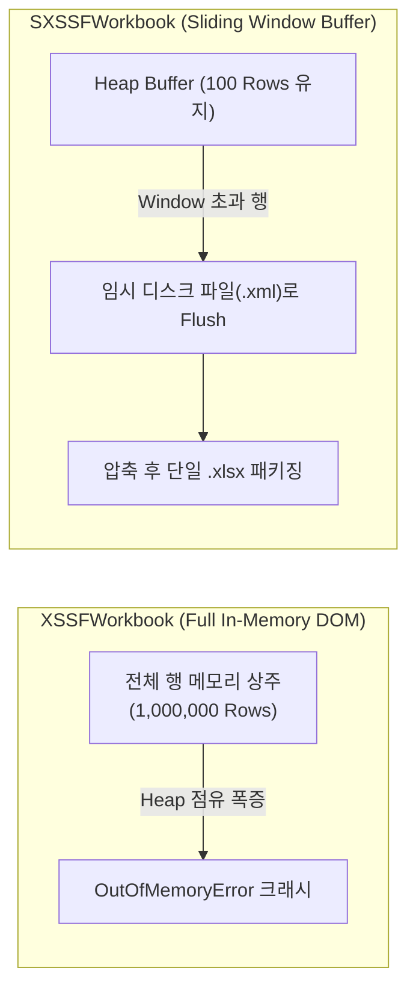
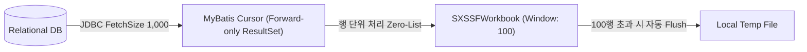
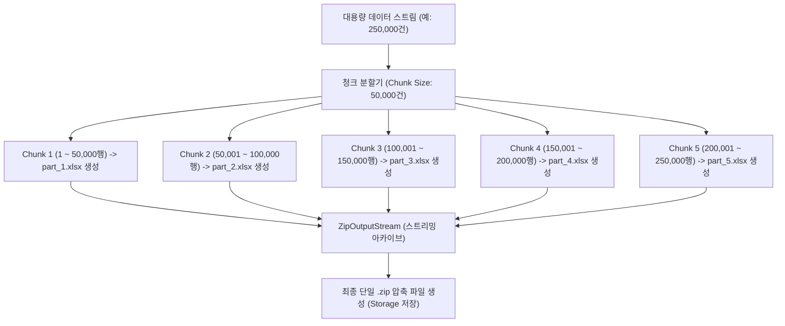
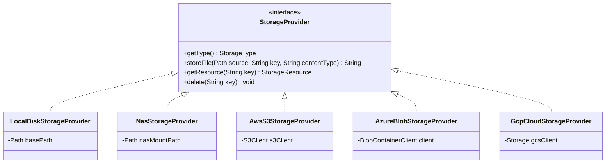

# [Performance] SXSSFWorkbook 대용량 엑셀 스트리밍과 동적 ZIP 분할 압축 설계 패턴

> **핵심 요약**  
> 수십만~수백만 행의 대용량 데이터를 엑셀로 변환할 때 발생하는 **JVM OutOfMemoryError(OOM)를 원천 차단**하기 위해, **Apache POI SXSSFWorkbook 슬라이딩 윈도우**, **MyBatis Cursor 기반 비메모리 행 단위 스트리밍**, 그리고 단일 엑셀 시트 한계(1,048,576행)를 극복하기 위한 **동적 청크 분할 및 on-the-fly ZIP 압축 스트리밍 설계 패턴**을 분석한다.

> [!NOTE] 실행 환경
> 본문 코드는 특정 라이브러리 버전을 명시하지 않는다. 코드에 등장하는 API 시그니처로 미루어보면:
> - **Apache POI**: `new SXSSFWorkbook(int windowSize)` 생성자와 `setCompressTempFiles(boolean)` 메서드는 POI 3.8 이상 ~ 최신 5.x까지 시그니처 변경 없이 유지되고 있어, 이 코드만으로는 정확한 마이너 버전을 특정할 수 없다.
> - **MyBatis**: `Cursor<T>` 기반 스트리밍 조회(`SqlSession` + `fetchSize` 매퍼 속성)는 MyBatis 3.4 이상에서 안정적으로 지원되는 기능이며, 이 역시 정확한 버전 특정은 불가능하다.
> - **Spring**: 본문 코드에는 Spring 관련 클래스나 애노테이션이 등장하지 않아(순수 Java + POI + MyBatis 조합), Spring/Spring Boot 버전을 코드로부터 추정할 근거가 없다.
> 정확한 버전은 실제 프로젝트의 `pom.xml`/`build.gradle`을 확인해야 한다.

---

## 1. 대용량 엑셀 생성 시 JVM OOM 발생 원인

Java 애플리케이션에서 엑셀 파일(`.xlsx`)을 생성할 때 일반적으로 사용하는 `XSSFWorkbook`은 OpenXML 스펙에 따라 워크시트의 모든 셀과 스타일 정보를 거대한 DOM(Document Object Model) 트리 객체로 JVM 힙 메모리에 유지한다.

```
[XSSFWorkbook 힙 사용량 문제]
1개 행 = Row 객체 + Cell 객체 N개 + CellStyle + XML 속성 문자열
행당 약 10KB ~ 30KB 메모리 점유
  - 10만 행  -> 약 1GB ~ 3GB Heap 필요
  - 100만 행 -> 10GB 이상 Heap 필요 -> 즉각적인 GC Thrashing 및 OutOfMemoryError 발생
```



---

## 2. Apache POI SXSSFWorkbook의 슬라이딩 윈도우(Sliding Window) 메커니즘

`SXSSFWorkbook`(Streaming XML Simple Fan-out)은 메모리에 오직 **지정된 윈도우 크기(Row Access Window Size)만큼의 행만 유지**하고, 초과된 행은 즉시 디스크 임시 파일로 플러싱하여 힙 메모리 사용량을 상수로 제어한다.

### 2.1 SXSSFWorkbook 내부 동작 원리
```java
// windowSize = 100: 힙 메모리에는 최근 100개의 Row 객체만 유지
SXSSFWorkbook workbook = new SXSSFWorkbook(100);
workbook.setCompressTempFiles(true); // 디스크로 플러싱되는 임시 XML을 gzip 압축

SXSSFSheet sheet = workbook.createSheet("대용량데이터");
for (int i = 0; i < totalRows; i++) {
    Row row = sheet.createRow(i);
    row.createCell(0).setCellValue(data.getId());
    row.createCell(1).setCellValue(data.getName());
    // i가 100을 초과하면 가장 오래된 행부터 디스크의 임시 XML 파일로 기록되고 메모리에서 GC됨
}
```

### 2.2 SXSSFWorkbook 사용 시 핵심 제약사항
1. **역방향 행 접근 불가**: 디스크로 플러싱된 이전 행(`sheet.getRow(rowNum)`)에 접근하면 `null`이 반환된다. 따라서 모든 셀 생성은 순방향(Forward-Only)으로만 작성해야 한다.
2. **평가 수식(Formula Evaluation) 제약**: 이전 행의 값을 참조하는 복잡한 수식 계산은 플러싱된 데이터를 메모리에서 읽을 수 없어 실패할 수 있다.
3. **임시 파일 정리 필수**: 작업 완료 또는 예외 발생 시 반드시 `workbook.dispose()`를 호출하여 OS 임시 디렉터리(`/tmp/poi-sxssf-sheet*.xml`)에 생성된 임시 파일들을 삭제해야 한다. 누락 시 디스크 고갈(Disk Full)로 이어진다.

---

## 3. MyBatis Cursor를 활용한 Zero-Heap-Spike 스트리밍 파이프라인

많은 개발자가 POI는 `SXSSFWorkbook`을 쓰면서도, 정작 DB 조회 단계에서 `List<Entity> list = mapper.findAll()`처럼 수십만 건을 한 번에 힙으로 로딩하여 여전히 OOM에 빠진다. 진정한 저메모리 파이프라인을 완성하려면 **DB 페치 단계부터 엑셀 쓰기까지 완벽한 스트리밍 체인**을 구축해야 한다.



### 3.1 `ExcelStreamable` 인터페이스 및 Cursor 순회
```java
// MyBatis 매퍼 XML: 페치 사이즈 설정이 핵심
// <select id="streamLargeOrders" fetchSize="1000" resultType="map">
//     SELECT id, order_no, amount, created_at FROM orders WHERE order_date >= #{startDate}
// </select>

public interface ExcelStreamable {
    Cursor<Map<String, Object>> streamRows(Map<String, Object> params, SqlSession sqlSession);
}

// 스트리밍 실행 서비스
try (SqlSession sqlSession = sqlSessionFactory.openSession();
     Cursor<Map<String, Object>> cursor = streamable.streamRows(params, sqlSession)) {
    
    int rowNum = 0;
    for (Map<String, Object> rowData : cursor) {
        Row row = sheet.createRow(++rowNum);
        renderCells(row, rowData);
        
        // 1,000행마다 진행률 갱신 및 협력적 취소 여부 확인
        if (rowNum % 1000 == 0) {
            checkCancellation(jobId);
            updateProgress(jobId, rowNum, totalRows);
        }
    }
}
```

- **메모리 복잡도**: `O(N)`에서 `O(1)`로 감소 (100만 행을 처리해도 JVM 힙 사용량은 수십 MB 이내로 유지).

---

## 4. 100만 행 제한 극복을 위한 동적 청크 분할 및 ZIP 스트리밍

엑셀 OpenXML 표준 규격(`.xlsx`)은 **단일 워크시트당 최대 1,048,576행**까지만 지원한다. 또한 단일 파일 크기가 수백 MB를 초과하면 클라이언트 브라우저가 다운로드 중 타임아웃을 겪거나 엑셀 프로그램 구동 자체가 불가능해진다.

이를 해결하기 위해 **청크 단위 분할(기본 50,000행) + on-the-fly `ZipOutputStream` 패키징 패턴**을 적용한다.



### 4.1 On-The-Fly ZIP 스트리밍 및 임시 파일 정리 패턴
```java
// ExcelZipGeneratorService.java
Path zipTempFile = Files.createTempFile("excel-export-", ".zip");
List<Path> chunkFiles = new ArrayList<>();

try (ZipOutputStream zos = new ZipOutputStream(new BufferedOutputStream(Files.newOutputStream(zipTempFile)))) {
    int chunkIndex = 1;
    while (hasMoreData()) {
        Path chunkFile = Files.createTempFile("chunk-" + chunkIndex + "-", ".xlsx");
        chunkFiles.add(chunkFile);

        // 1. 단일 청크 엑셀 생성 (SXSSFWorkbook 스트리밍)
        generateChunkXlsx(chunkFile, chunkIndex, chunkSize);

        // 2. 생성된 청크를 즉시 ZipEntry로 패키징
        ZipEntry entry = new ZipEntry(String.format("%s_part%d.xlsx", baseFileName, chunkIndex));
        zos.putNextEntry(entry);
        Files.copy(chunkFile, zos);
        zos.closeEntry();

        // 3. 패키징 완료된 청크 파일은 즉시 삭제하여 로컬 디스크 공간 확보
        Files.deleteIfExists(chunkFile);
        chunkIndex++;
    }
} finally {
    // 예외 발생 시 남아있을 수 있는 모든 청크 잔재 파일 강제 소거
    for (Path path : chunkFiles) {
        try { Files.deleteIfExists(path); } catch (Exception ignored) {}
    }
}
```

---

## 5. 멀티 클라우드 스토리지 추상화 (Storage Provider SPI)

생성된 대용량 파일은 다중 노드 환경에서 클라이언트가 어느 서버 인스턴스로 요청을 보내더라도 다운로드할 수 있도록 중앙 스토리지 계층에 격리 저장되어야 한다.



- **Stateless 웹 계층 달성**: 서버 노드가 다운되거나 재기동되어도 스토리지의 파일 키(`ha_excel_job.file_path`)만 DB에 유지되면 어떤 노드에서도 무중단으로 다운로드를 제공할 수 있다.

## 관련 문서

- [(오픈소스) ha-excel-job-engine - 상세 분석 및 기술 가이드](../../프로젝트/오픈소스/[오픈소스]%20ha-excel-job-engine%20-%20상세%20분석%20및%20기술%20가이드.md) — 이 SXSSFWorkbook 스트리밍·청크 분할·ZIP 패키징 설계가 실제로 구현되어 있는 오픈소스 프로젝트 본문
- [(Web) 사내 관리자 포털(Admin Portal) RBAC 메뉴 권한 인가와 세션 감사 인터셉터 패턴](../아키텍처·설계/[Web]%20관리자%20포털%20RBAC%20메뉴%20권한%20인가와%20세션%20감사%20인터셉터%20패턴.md) — 관리자 포털의 대용량 엑셀 다운로드에서 짧게 언급된 SXSSFWorkbook 스트리밍 기법의 상세 구현 및 원리(역방향 링크)
- [(HTTP) 대용량 처리 비동기 Job 큐 설계 패턴 - 핵심 개념 및 특징 정리](../아키텍처·설계/[HTTP]%20대용량%20처리%20비동기%20Job%20큐%20설계%20패턴%20-%20핵심%20개념%20및%20특징%20정리.md) — 이 SXSSFWorkbook 스트리밍이 large/normal 큐로 분기되어 실행되는 상위 Job 큐 아키텍처
- [(Architecture) 가상 스레드(Virtual Thread) 기반 고가용성 분산 배치 엔진 설계](../아키텍처·설계/[Architecture]%20가상%20스레드(Virtual%20Thread)%20기반%20고가용성%20분산%20배치%20엔진%20설계%20(Atomic%20CAS,%20이중%20큐,%20자가%20치유).md) — 이 SXSSFWorkbook 청크 생성·ZIP 패키징이 실제로 실행되는 이중 큐·가상 스레드 워커 아키텍처
- [(Design Pattern) 실무 프로젝트 및 오픈소스로 체득하는 GoF 핵심 디자인 패턴 10선](../아키텍처·설계/[Design%20Pattern]%20실무%20프로젝트%20및%20오픈소스로%20체득하는%20GoF%20핵심%20디자인%20패턴%2010선%20(Proxy,%20Decorator,%20Strategy,%20Chain,%20Template,%20SPI,%20Visitor,%20Facade).md) — 2.2절 데코레이터 패턴 항목에서 이 문서의 `ExcelStreamable` 스트리밍 인터페이스를 다룸