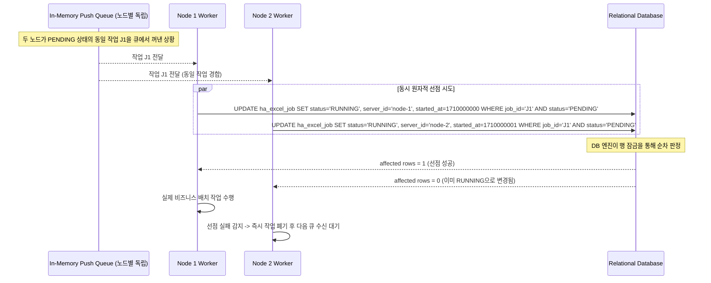
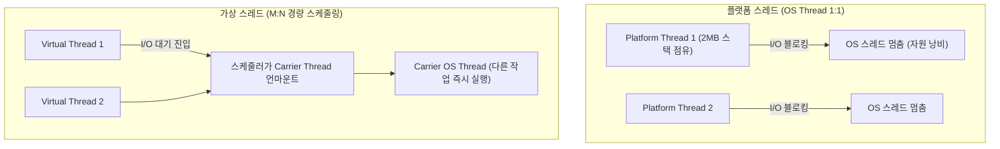
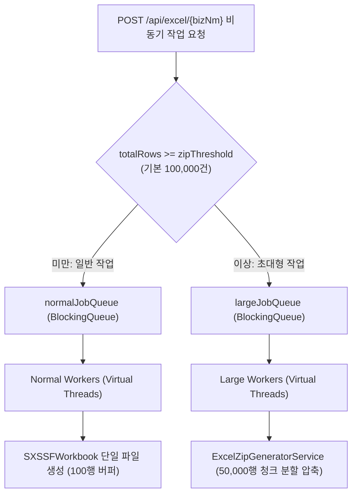
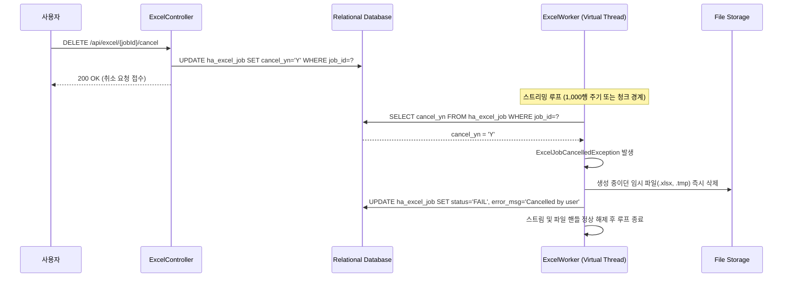

# [Architecture] 가상 스레드(Virtual Thread) 기반 고가용성 분산 배치 엔진 설계 (Atomic CAS, 이중 큐, 자가 치유)

> **핵심 요약**  
> Redis나 ZooKeeper 같은 무거운 분산 코디네이터 없이, **관계형 데이터베이스의 단일 원자적 UPDATE(CAS) 연산**과 **Java 21 가상 스레드(Virtual Thread)**, **이중 인메모리 큐**, 그리고 **크래시 자가 치유(Self-Healing) 스케줄러**를 결합하여 고가용성(HA) 분산 비동기 작업 처리 엔진을 설계하고 구현하는 실전 아키텍처 패턴을 정리한다.

---

## 1. 분산 비동기 배치 엔진의 핵심 설계 난제

대규모 트랜잭션 시스템에서 대용량 엑셀 내보내기, 데이터 정산, 외부 기관 연동 등의 무거운 비동기 작업을 처리할 때 다음과 같은 기술적 장벽이 발생한다.

1. **무거운 인프라 의존성 (Redis/RabbitMQ/ZooKeeper 부담)**:  
   단순한 작업 조율을 위해 분산 락(Redisson)이나 메시지 브로커 클러스터를 운영하면 인프라 비용과 관리 포인트(운영 복잡도, 네트워크 분할 대응)가 급증한다.
2. **다중 노드 환경에서의 중복 작업 및 경쟁 상태(Race Condition)**:  
   수평 확장(Scale-out)된 여러 서버 인스턴스가 동시에 대기 중인 작업을 가져가려 할 때, 동일 작업이 중복 실행되지 않도록 보장해야 한다.
3. **스레드 풀 고갈 및 Head-of-Line Blocking**:  
   소수의 초대형 작업(예: 100만 행 생성)이 워커 스레드를 장시간 독점하여, 수초 내에 끝날 수 있는 수천 건의 일반 작업들이 큐 뒤에서 기아 상태(Starvation)에 빠진다.
4. **노드 비정상 종료 시 작업 유실 및 고아화(Orphaned Job)**:  
   작업을 수행하던 서버가 배포나 OOM, 하드웨어 장애로 갑자기 다운되었을 때, `RUNNING` 상태로 남아 영원히 완료되지 않는 고아 작업을 감지하고 자동 복구해야 한다.

---

## 2. RDBMS Atomic CAS를 활용한 Redis-Free 분산 작업 선점

별도의 분산 락 없이 관계형 데이터베이스의 **행 레벨 배타적 락(Row-Level Exclusive Lock)**과 **단일 원자적 UPDATE 문**을 활용하여 Compare-And-Swap(CAS) 메커니즘을 구현한다.



### 2.1 원자적 선점 SQL 구현
```sql
-- ExcelJobMapper.xml
UPDATE ha_excel_job
   SET status     = 'RUNNING',
       server_id  = #{serverId},
       started_at = #{startedAt}
 WHERE job_id     = #{jobId}
   AND status     = 'PENDING'
```

- **원자성 보장**: RDBMS는 `WHERE` 절 조건에 해당하는 행을 변경할 때 내부적으로 배타적 락(`X-Lock`)을 획득한다.
- **성공 검증**: JDBC 실행 결과 반환되는 `affected rows`가 정확히 `1`인 노드만 작업 권한을 획득한다. `0`이 반환된 노드는 다른 워커가 찰나의 차이로 먼저 선점한 것이므로 아무런 부작용 없이 다음 작업을 대기한다.

---

## 3. Java 21 가상 스레드(Virtual Thread) 워커 풀 아키텍처

배치 작업은 DB 대량 조회(I/O), 스토리지 파일 업로드(네트워크 I/O), 디스크 임시 파일 쓰기(파일 I/O) 등 대부분의 실행 시간이 I/O 블로킹 구간에 집중된다.



### 3.1 가상 스레드 워커 팩토리 구현
```java
// ExcelWorkerService.java
ExecutorService normalWorkerPool = Executors.newThreadPerTaskExecutor(
    Thread.ofVirtual()
          .name("ha-excel-normal-worker-", 0)
          .factory()
);

ExecutorService largeWorkerPool = Executors.newThreadPerTaskExecutor(
    Thread.ofVirtual()
          .name("ha-excel-large-worker-", 0)
          .factory()
);
```

### 3.2 가상 스레드 도입 시 주의사항 (Carrier Thread Pinning 방지)
- **`synchronized` 블록 지양**: 가상 스레드가 `synchronized` 블록 내부에서 I/O 블로킹에 빠지면 underlying carrier thread에서 언마운트(unmount)되지 못하는 **Pinning 현상**이 발생한다.
- **`ReentrantLock` 사용 원칙**: 임계 구역 동기화가 필요한 경우 반드시 `java.util.concurrent.locks.ReentrantLock`을 사용하여 핀 현상을 방지하고 완전한 비동기 I/O 전환을 보장한다.

---

## 4. Head-of-Line Blocking 방지를 위한 이중 큐(Dual-Queue) 패턴

단일 큐에 수십만 건 이상의 초대형 작업과 수천 건의 소형 작업이 섞여 인입되면, 초대형 작업이 워커 풀 전체를 점유하여 빠른 작업들의 지연 시간(Latency)이 기하급수적으로 증가한다.



- **격리 효과**: 대형 작업 전용 워커 풀(`large-worker-count`)과 일반 작업 전용 워커 풀(`worker-count`)을 물리적으로 분리하여, 100만 건 정산 파일 생성 중에도 소규모 사용자 엑셀 요청은 지연 없이 수초 내에 완료된다.

---

## 5. 고가용성(HA) 자가 치유(Self-Healing) 파이프라인

분산 환경에서 예기치 못한 프로세스 다운(OOMKilled, Pod 재배포, 서버 다운)에 대응하기 위해 기동 시 복구 루틴과 주기적 스케줄러의 3단계 복구 체계를 갖춘다.

```mermaid
flowchart TD
    subgraph Boot["1. 서버 기동 시 (@PostConstruct)"]
        B1["recoverStaleRunningJobs()<br/>이 serverId로 RUNNING 상태로 남아있던 작업 조회"]
        B2["임시 파일(.xlsx, .zip) 삭제 후 status='FAIL' 전이<br/>(Terminated due to server restart)"]
        B3["recoverPendingJobs()<br/>DB 전체 PENDING 작업 조회 후 인메모리 큐 재적재"]
        B1 --> B2 --> B3
    end

    subgraph OrphanScan["2. 고아 작업 스캐너 (1시간 주기)"]
        S1["scanOrphanedPendingJobs()<br/>created_at < now - 2시간 AND status='PENDING'"]
        S2["노드 INSERT 직후 크래시로 큐에 못 들어간 작업 탐지"]
        S3["현재 생존 노드의 Push Queue로 재전파"]
        S1 --> S2 --> S3
    end

    subgraph TTLClean["3. 파일 만료 소거기 (60초 주기)"]
        T1["evictExpiredFiles()<br/>completed_at < now - 60분 AND (status='DONE' or 'FAIL')"]
        T2["스토리지(S3/NAS/Local) 파일 삭제 및 file_path NULL 처리"]
        T1 --> T2
    end
```



1. **`recoverStaleRunningJobs()`**: 이전 인스턴스가 작업을 수행하던 도중 비정상 종료된 경우, DB에 여전히 해당 `server_id`와 `RUNNING`으로 멈춰있는 작업을 찾아 실패 처리하고 찌꺼기 파일을 정리한다.
2. **`recoverPendingJobs()`**: 재기동 시 인메모리 큐가 비어 있으므로, DB에 남아있는 미처리 `PENDING` 작업을 행 수에 맞춰 각 큐로 재인입한다.
3. **`scanOrphanedPendingJobs()`**: DB INSERT 완료 직후 큐에 넣기 전에 서버가 크래시된 완전한 고아 작업을 임계 시간(기본 2시간) 이후 탐지하여 생존 노드로 재전파한다.

---

## 6. 협력적 취소(Cooperative Cancellation) 메커니즘

장시간 실행 중인 배치 작업을 취소할 때 `Thread.stop()`이나 `Thread.interrupt()`를 무분별하게 호출하면 I/O 리소스가 비정상 종료되어 깨진 파일이 디스크/스토리지에 남거나 커넥션 풀이 누수된다.



- **체크포인트(Check-point) 검사**: 1,000행 처리 주기 또는 ZIP 청크 경계마다 취소 플래그를 확인하여, 가장 안전한 시점에 생성 중이던 임시 리소스를 완전히 소거하고 작업을 정상적으로 종료한다.

## 관련 문서

- [(Performance) SXSSFWorkbook 대용량 엑셀 스트리밍과 동적 ZIP 분할 압축 설계 패턴](../백엔드·데이터처리/[Performance]%20SXSSFWorkbook%20대용량%20엑셀%20스트리밍과%20동적%20ZIP%20분할%20압축%20설계%20패턴.md) — 이 엔진의 large 워커가 실제로 수행하는 SXSSFWorkbook 스트리밍·청크 분할 구현 상세
- [(HTTP) 대용량 처리 비동기 Job 큐 설계 패턴 - 핵심 개념 및 특징 정리](./[HTTP]%20대용량%20처리%20비동기%20Job%20큐%20설계%20패턴%20-%20핵심%20개념%20및%20특징%20정리.md) — 이 엔진과 동일한 CAS 선점·이중 큐·재기동 복구 설계를 일반화된 패턴 관점에서 정리한 자매 노트
- [(Design Pattern) 실무 프로젝트 및 오픈소스로 체득하는 GoF 핵심 디자인 패턴 10선](./[Design%20Pattern]%20실무%20프로젝트%20및%20오픈소스로%20체득하는%20GoF%20핵심%20디자인%20패턴%2010선%20(Proxy,%20Decorator,%20Strategy,%20Chain,%20Template,%20SPI,%20Visitor,%20Facade).md) — 4.2절 생산자-소비자 패턴 항목에서 이 엔진의 Virtual Thread Worker Pool 구조를 디자인 패턴 관점에서 다룸
- [(Design) 전원 장애(정전) 대응 설계 원칙 - Atomic Save-Transaction-Recovery 정리](./[Design]%20전원%20장애(정전)%20대응%20설계%20원칙%20-%20Atomic%20Save-Transaction-Recovery%20정리.md) — 이 엔진의 5절 자가 치유(Self-Healing) 파이프라인이 실제로 구현하고 있는 범용 정전/비정상종료 대응 원칙