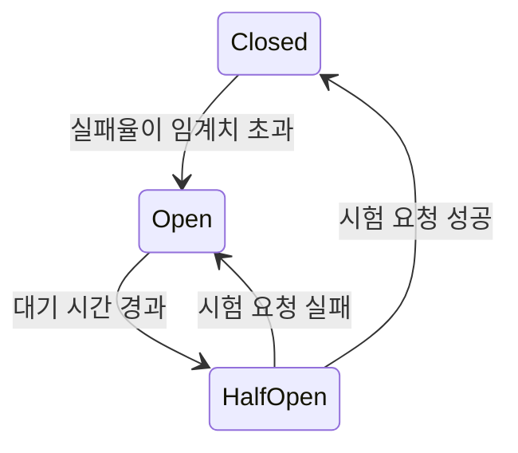

# 장애 전파 방지 패턴 (Circuit Breaker·Bulkhead·Retry·Rate Limit)

> 서비스가 여러 개로 나뉘면 한 곳의 장애가 호출하는 쪽으로 번진다. 번지지 않게 막는 방법들을 정리한다. 용어 정의는 [IT 용어집 - MSA·분산 시스템](IT%20용어집/[용어]%20MSA·분산%20시스템.md) 참고.

## 1. 문제: 연쇄 장애 (cascading failure)

1. 서비스 B가 느려진다(응답 30초).
2. A의 스레드들이 B 응답을 기다리며 하나씩 **묶인다**.
3. A의 스레드 풀이 바닥나서 A도 장애가 된다(thread pool exhaustion).
4. A를 부르는 서비스도 같은 길을 가서 **전체로 전파**된다.

핵심은 "느린 것"이 "죽은 것"보다 위험하다는 점이다. 죽으면 바로 실패하지만 느리면 자원이 계속 묶인다.

## 2. 방어선을 겹쳐서 쌓기

| 단계 | 패턴 | 막는 것 |
| --- | --- | --- |
| 1 | **timeout** | 무한 대기. 가장 먼저 설정할 것 |
| 2 | **retry + backoff** | 일시적 실패 |
| 3 | **circuit breaker** | 계속 실패하는 곳으로 가는 호출 |
| 4 | **bulkhead** | 한 곳의 문제가 다른 호출의 자원을 잠식하는 것 |
| 5 | **rate limit** | 과부하 자체 |
| 6 | **fallback** | 실패했을 때의 사용자 경험 |

## 3. timeout

- **connection timeout**: 연결을 맺을 때까지의 한도
- **read timeout**: 응답을 읽을 때까지의 한도
- **idle timeout**: 놀고 있는 연결을 끊기까지의 한도

timeout이 없으면 느린 상대 때문에 스레드가 무한정 묶인다. 호출 경로 전체의 timeout을 정할 때는 **호출하는 쪽이 호출받는 쪽보다 길게** 잡는다(안쪽 호출이 끝나기 전에 바깥이 먼저 포기하지 않도록).

keep-alive 연결은 주의가 필요하다. 클라이언트 연결 풀의 idle timeout이 서버나 로드밸런서의 idle timeout보다 길면 **이미 끊긴 연결을 재사용하다 오류**가 난다. 클라이언트 쪽을 더 짧게 둔다.

## 4. retry와 exponential backoff

- 실패한 요청을 다시 시도하되, **간격을 1초, 2초, 4초처럼 점점 늘리고** 무작위 값(jitter)을 더한다.
- 이유: 모두가 같은 간격으로 재시도하면 한꺼번에 몰리는 **retry storm**이 생겨 이미 힘든 서버를 더 누른다.
- 재시도는 **멱등한 요청에만 안전**하다. 멱등하지 않은 요청에는 멱등성 키가 필요하다. 관련: [분산 락과 멱등성 키 설계](개발%20실무/아키텍처·설계/[Architecture]%20분산%20락과%20멱등성%20키%20설계.md)
- 재시도 횟수와 총 시간에 상한을 둔다. 계층마다 재시도하면 곱으로 늘어난다(3단계 × 3회 = 27번).

## 5. circuit breaker (서킷 브레이커)

> 장애가 난 서비스로 가는 호출을 **일시적으로 차단**해서, 장애가 호출하는 쪽으로 번지지 않게 하는 장치. 집의 차단기에서 따온 이름.

| 상태 | 동작 |
| --- | --- |
| Closed (정상) | 요청 통과, 실패율 집계 |
| Open (차단) | 호출하지 않고 **즉시 실패하거나 대체값 반환(fail fast)** → 호출하는 쪽 스레드가 묶이지 않음 |
| Half-Open (시험) | 일부 요청만 보내 회복 여부 확인 |

- 인스턴스마다 따로 판단하지 않고 **전체 인스턴스가 차단 상태를 공유**하는 방식을 global circuit breaker라 부른다.
- Java에서는 Resilience4j가 대표적인 라이브러리다.
- PG 연동 같은 결제 호출에서 쓰는 사례는 [PG 백엔드 개발자 교육 문서](도메인/PG%20교육자료/1차%20PG%20백엔드%20개발자%20교육%20문서%20-%20핵심%20개념%20및%20특징%20정리.md)도 참고.

## 6. bulkhead (벌크헤드, 격벽)

배의 격벽처럼 **호출 대상별로 스레드 풀·커넥션 같은 자원을 나눈다.**

- 하나의 공용 풀을 쓰면 B가 막혔을 때 풀 전체가 B 호출로 채워져 C를 부르는 요청까지 실패한다.
- B용 풀, C용 풀을 따로 두면 B가 막혀도 C용 자원은 남아 있다.

## 7. rate limit과 throttling

- **rate limiting**: 단위 시간당 허용하는 요청 수의 **한도 정책**(예: 초당 100건).
- **throttling**: 그 한도에 맞게 **속도를 조절하는 동작**(늦추거나 거절). 도구에 따라 두 말을 같은 뜻으로 섞어 쓴다.
- HTTP에서는 한도를 넘으면 **429 Too Many Requests**로 거절하고, `Retry-After` 헤더로 다시 시도할 시점을 알려 줄 수 있다.
- **traffic spike**(짧은 시간의 트래픽 급증)의 원인은 이벤트, 장애 복구 직후의 재접속, 재시도 몰림, 배치의 동시 시작 등이다. 대응은 scale out(자동 확장), throttling, 큐로 완충, 캐시, backoff다.

## 8. fallback (폴백)

원래 처리가 실패했을 때 **대신 돌려주는 값이나 동작**이다.

- 예) 추천 목록 호출이 실패하면 빈 목록 대신 인기 상품 캐시를 반환
- 결제처럼 대체가 불가능한 곳은 fallback 대신 **명확한 실패와 재시도 안내**가 맞다.

## 9. 어디서 처리할까: application vs service mesh

| | application (Resilience4j 등) | mesh (Istio/Envoy) |
| --- | --- | --- |
| 장점 | 비즈니스 맥락을 알고 처리(예: 실패하면 캐시값 반환), 세밀한 제어 | 언어와 무관하게 일괄 적용, 코드 수정 불필요 |
| 단점 | 서비스마다 구현·버전 관리 필요 | 비즈니스 맥락을 모름, 운영 복잡도 증가 |

- **service mesh**: 서비스 간 통신 기능(재시도, 타임아웃, mTLS, 라우팅, 모니터링)을 애플리케이션 코드 밖의 인프라 계층으로 뺀 것이다. 각 서비스 옆에 **사이드카 프록시**(보통 Envoy)가 붙어 트래픽을 대신 주고받고, control plane(Istio 등)이 정책을 내려 준다.
- Kafka처럼 HTTP가 아닌 자체 프로토콜은 mesh가 "처리 실패"를 알 수 없어서(바이트 흐름으로만 보임), 재시도·차단·한도를 application에서 처리하는 경우가 많다. 이것은 일반적인 이유이고 모든 팀이 같지는 않다.

## 10. 장애를 미리 찾기: fault injection

운영과 비슷한 환경에서 **장애를 일부러 주입**해 약점을 미리 찾는다(chaos engineering).

- "이 API가 3초 지연되면?", "500을 반환하면?"을 시험한다.
- 찾는 것: timeout 미설정, circuit breaker가 안 열림, fallback 미동작.
- 장애 대응을 반복 연습하는 효과가 있어 실제 장애 때 복구도 빨라진다.
- 대표 사례: Netflix의 Chaos Monkey(서버를 무작위로 종료).

## 11. 체크리스트

- [ ] 모든 외부 호출에 connection/read timeout이 있는가?
- [ ] 재시도는 멱등한 요청에만, backoff + jitter와 횟수 상한이 있는가?
- [ ] 호출 대상별로 풀이 분리돼 있는가(bulkhead)?
- [ ] 계속 실패하는 대상에 대한 circuit breaker와 fallback(또는 명확한 실패)이 있는가?
- [ ] 과부하 시 429로 거절하는 한도가 있는가?
- [ ] 이 방어선들이 실제로 동작하는지 fault injection으로 검증했는가?

관련 노트: [스레드 동시성 문제 정리](개발%20%28CS%29/CS%20기초/운영체제/[OS]%20스레드%20동시성%20문제%20정리%20-%20race·deadlock·livelock·starvation.md), [서버 장애 대응 방안](개발%20%28CS%29/인프라/인프라%20기초%20지식/[CS]%20서버%20장애%20대응%20방안%20-%20핵심%20개념%20및%20특징%20정리.md)
