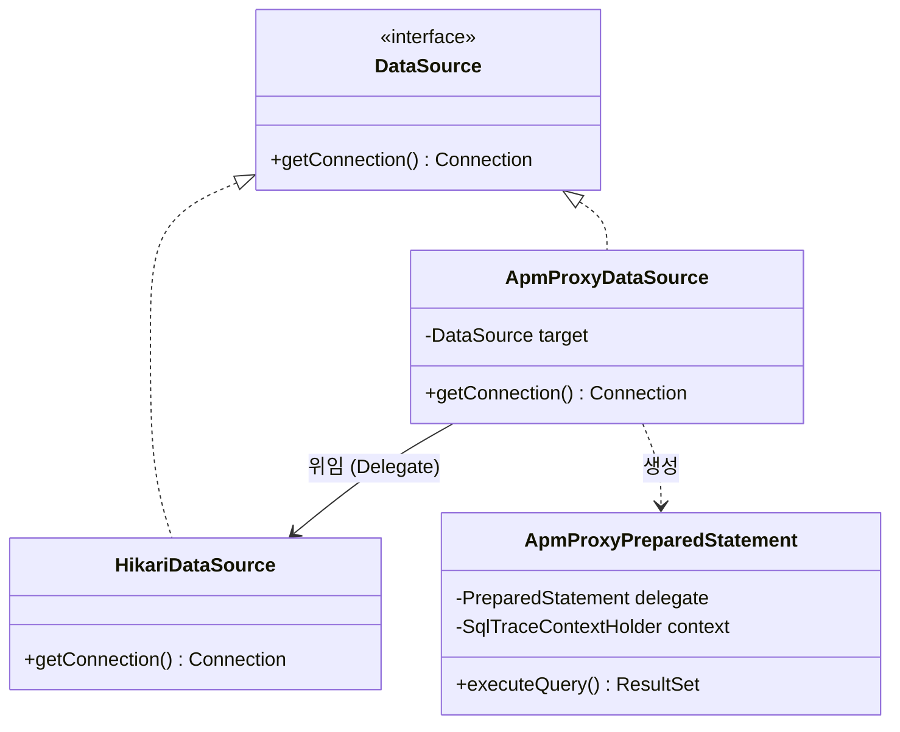
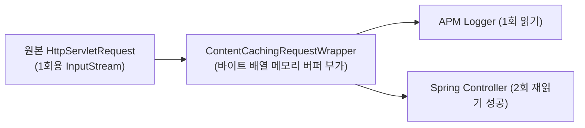
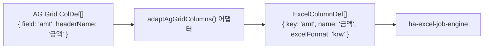
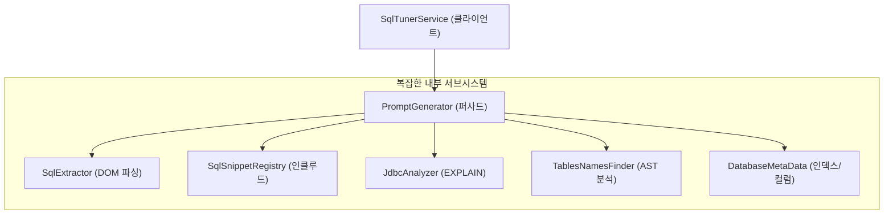
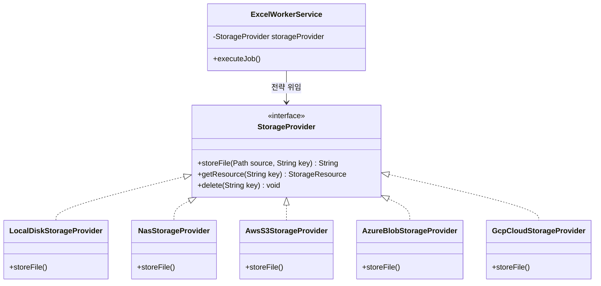
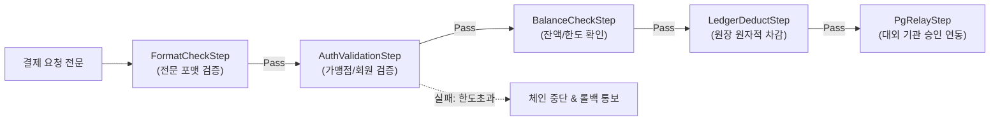
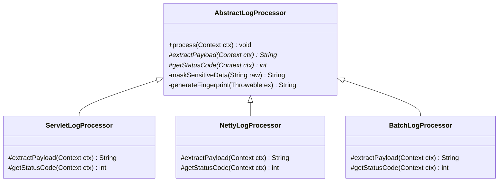
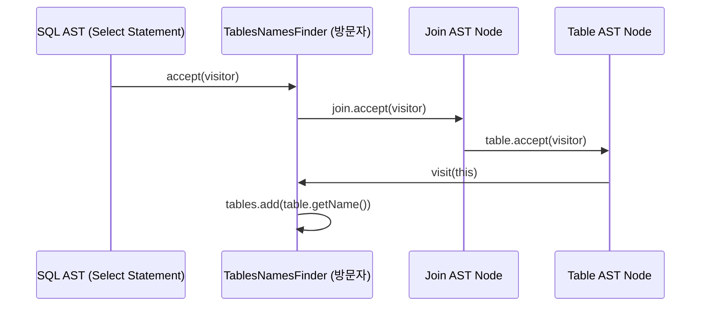
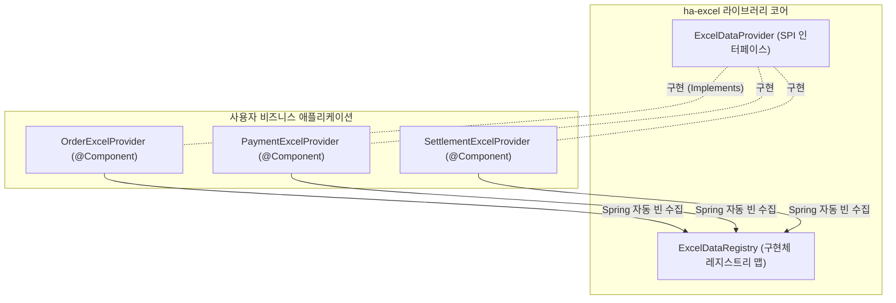

# [Design Pattern] 실무 프로젝트 및 오픈소스로 체득하는 GoF 핵심 디자인 패턴 10선

> **핵심 요약**  
> 교과서적인 예제(동물/도형/계산기)가 아니라, 실제 운영 중인 **실무 대규모 분산 및 네트워크 배치 시스템**(실무 시스템)과 **오픈소스 프레임워크**(`ha-excel-job-engine`, `mini-apm-spring-boot-starter`, `mybatis-sql-tuner-ai`)의 실제 코드베이스에 녹아있는 **10대 핵심 디자인 패턴**의 설계 의도, 문제 해결 방식, 그리고 구현 메커니즘을 총정리한다.

---

## 1. 패턴 매핑 요약표

| 분류 | 패턴 | 적용 프로젝트 및 핵심 클래스 | 해결한 엔지니어링 문제 |
| :--- | :--- | :--- | :--- |
| **구조 (Structural)** | **Proxy (프록시)** | `mini-apm`: `ApmProxyDataSource`, `ApmProxyPreparedStatement` | 비즈니스 코드 침작 없이 JDBC 레벨에서 SQL 실행 시간 측정, 파라미터 캡처, N+1 탐지 |
| **구조 (Structural)** | **Decorator (데코레이터)** | `mini-apm`: `ContentCachingRequestWrapper`, `LoggingTaskDecorator`<br/>`ha-excel`: `ExcelStreamable` | 단발성 `InputStream`에 캐싱 기능 부가, 비동기 `Runnable`에 스레드 컨텍스트 전파 부가 |
| **행위 (Behavioral)** | **Strategy (전략)** | `ha-excel`: `StorageProvider` (Local, NAS, S3, Azure, GCP)<br/>트랜잭션 엔진: 결제 수단/PG사별 승인 알고리즘 | 런타임에 동적으로 스토리지 저장 및 결제 처리 알고리즘을 교체하고 OCP 달성 |
| **행위 (Behavioral)** | **Chain of Responsibility (책임 연쇄)** | 네트워크 소켓 게이트웨이 / Netty: `ChannelPipeline`<br/>트랜잭션 엔진: `StepChain` (결제 트랜잭션 파이프라인)<br/>Servlet: `FilterChain` | 복잡한 단일 트랜잭션을 독립적인 검증/처리/통보 스텝으로 분리하고 결합도 제거 |
| **행위 (Behavioral)** | **Template Method (템플릿 메서드)** | `mini-apm`: `AbstractLogProcessor`<br/>`ha-excel`: `AbstractStorageProvider` | 공통 로그 가공/마스킹/Loki 마커 조립 알고리즘 뼈대를 정의하고 런타임별 세부 처리 위임 |
| **생성/구조** | **SPI & Registry (서비스 제공자 & 레지스트리)** | `ha-excel`: `ExcelDataProvider` + `ExcelDataRegistry`<br/>`mybatis-sql-tuner`: `SqlSnippetRegistry` | 컴포넌트 자동 스캔 및 O(1) 매핑 레지스트리 구축으로 무제한 플러그인 확장성 확보 |
| **구조 (Structural)** | **Adapter (어댑터)** | `ha-excel`: `agGridAdapter`<br/>`mybatis-sql-tuner`: `JdbcAnalyzer` 멀티 DB EXPLAIN 어댑터 | 외부 라이브러리(AG Grid, 이기종 RDBMS EXPLAIN 포맷)의 인터페이스를 내부 규격에 맞게 변환 |
| **행위 (Behavioral)** | **Visitor (방문자)** | `mybatis-sql-tuner`: JSqlParser `TablesNamesFinder`<br/>W3C DOM AST 순회 엔진 | 문법 트리(SQL AST, XML DOM) 구조를 수정하지 않고 새로운 검증/추출 알고리즘 추가 |
| **구조 (Structural)** | **Facade (퍼사드)** | `mybatis-sql-tuner`: `PromptGenerator`<br/>`ha-excel`: `ExcelJobManager` | 다수의 복잡한 하위 서브시스템(DOM 파서, EXPLAIN 인스펙터, 메타데이터 수집)을 단순한 단일 진입점으로 은닉 |
| **동시성/아키텍처** | **Producer-Consumer (생산자-소비자)** | `ha-excel`: `ExcelJobQueue` + Virtual Thread Worker Pool | 대용량 I/O 요청을 웹 스레드에서 분리하여 큐잉하고 경량 워커 풀에서 비동기 소비 |

---

## 2. 구조 패턴 (Structural Patterns)

### 2.1 프록시 패턴 (Proxy Pattern)
* **적용 사례**: `mini-apm-spring-boot-starter` (`ApmProxyDataSource`, `ApmProxyPreparedStatement`)
* **문제 상황**:  
  JPA/Hibernate 환경에서 실행되는 실제 완성형 SQL, 쿼리 수행 시간, N+1 쿼리 발생 여부를 감시해야 한다. 하지만 엔티티 매니저나 Repository 코드를 일일이 수정할 수는 없다(Non-Invasive 원칙).
* **해결 구조**:  
  Spring Boot 기동 시 `BeanPostProcessor`를 이용해 실제 `DataSource`를 `ApmProxyDataSource`로 감싼다. 커넥션이 생성되고 `prepareStatement()`가 호출될 때 실제 `PreparedStatement` 대신 `ApmProxyPreparedStatement`를 반환하여 실행 시점을 가로챈다.



```java
// ApmProxyPreparedStatement.java: 프록시를 통한 실행 시간 측정 및 N+1 감지
@Override
public ResultSet executeQuery() throws SQLException {
    long start = System.currentTimeMillis();
    try {
        return delegate.executeQuery();
    } finally {
        long elapsed = System.currentTimeMillis() - start;
        recordSqlMetrics(this.preparedSql, elapsed);
    }
}
```

---

### 2.2 데코레이터 패턴 (Decorator Pattern)
* **적용 사례**:  
  1) `mini-apm`: `ContentCachingRequestWrapper`  
  2) `mini-apm`: `LoggingTaskDecorator`  
  3) `ha-excel`: `ExcelStreamable`
* **Proxy vs Decorator 차이**:  
  - **프록시**: 대상 객체의 **접근 제어, 로깅, 지연 로딩, 보안 검사** 등 흐름을 가로채는 것이 목적 (인터페이스 형태 유지).  
  - **데코레이터**: 대상 객체에 **동적으로 새로운 책임(기능, 버퍼링, 컨텍스트)을 덧붙이는 것**이 목적.
* **해결 구조**:  
  Servlet의 `HttpServletRequest`는 `InputStream`을 한 번만 읽을 수 있는 단발성 스트림이다. Controller가 바디를 읽기 전에 APM 로거가 읽어버리면 Controller가 빈 바디를 받게 된다.  
  따라서 내부 바이트 배열에 읽은 데이터를 누적 보관하는 **캐싱 데코레이터**(`ContentCachingRequestWrapper`)로 감싸 여러 번 읽을 수 있는 책임을 동적으로 부가한다.



---

### 2.3 어댑터 패턴 (Adapter Pattern)
* **적용 사례**:  
  1) `ha-excel-job-engine`: `agGridAdapter` (Frontend)  
  2) `mybatis-sql-tuner-ai`: `JdbcAnalyzer` 멀티 DB 어댑터
* **문제 상황**:  
  클라이언트 UI(React AG Grid)의 컬럼 정의 규격(`ColDef[]`)과 백엔드 엑셀 엔진이 요구하는 규격(`ExcelColumnDef[]`)이 서로 속성명이 다르다 (`field` vs `key`, `headerName` vs `name`).
* **해결 구조**:  
  AG Grid의 속성을 엑셀 엔진 규격으로 변환하는 어댑터 함수를 제공하여, 기존 프론트엔드 그리드 코드를 단 한 줄도 수정하지 않고 그대로 다운로드 API에 전달할 수 있게 한다.



---

### 2.4 퍼사드 패턴 (Facade Pattern)
* **적용 사례**:  
  1) `mybatis-sql-tuner-ai`: `PromptGenerator`  
  2) `ha-excel-job-engine`: `ExcelJobManager`
* **문제 상황**:  
  SQL 튜닝 리포트를 생성하려면 1) 매퍼 XML DOM 파싱, 2) fakeSql 조립, 3) JDBC EXPLAIN 실행, 4) JSqlParser 테이블 추출, 5) DatabaseMetaData 인덱스 수집, 6) 트랜잭션 격리수준 조회가 모두 순서대로 맞물려야 한다. UI나 서비스 레이어가 이 모든 하위 클래스를 직접 제어하면 결합도가 극도로 높아진다.
* **해결 구조**:  
  `PromptGenerator`라는 **단일 퍼사드 클래스**를 두어 복잡한 하위 서브시스템을 은닉하고, 외부에는 `generatePrompt(connection, queryId, mapperPath, mapperBaseDir)` 단 하나의 심플한 진입점만 제공한다.



---

## 3. 행위 패턴 (Behavioral Patterns)

### 3.1 전략 패턴 (Strategy Pattern)
* **적용 사례**: `ha-excel-job-engine` (`StorageProvider` 인터페이스 및 6대 구현체)
* **문제 상황**:  
  완료된 엑셀 파일을 저장하는 위치는 온프레미스(로컬 디스크, NAS), AWS(S3), 네이버클라우드(NCP), Azure(Blob), GCP(GCS) 등 인프라 환경마다 완전히 다르다. 환경이 바뀔 때마다 엑셀 생성 코드를 `if-else`로 분기할 수는 없다.
* **해결 구조**:  
  `StorageProvider` 인터페이스로 파일 저장/조회/삭제 알고리즘을 추상화하고, Spring Boot의 `@ConditionalOnProperty` 또는 설정값(`ha-excel.storage-type`)에 따라 실행 시점에 적절한 전략 구현체를 DI 컨테이너에 주입한다.



---

### 3.2 책임 연쇄 패턴 (Chain of Responsibility Pattern)
* **적용 사례**:  
  1) Netty 소켓 통신 (`ChannelPipeline`)  
  2) 다단계 비즈니스 파이프라인 (`StepChain`)
* **문제 상황**:  
  금융 결제 승인 요청은 1) 전문 규격 검증 -> 2) 회원 상태 검증 -> 3) 잔액 및 한도 조회 -> 4) 원장 차감 -> 5) 대외 PG 통신 -> 6) 결과 통보 등 여러 단계로 구성된다. 이를 거대한 하나의 메서드에 절차지향으로 작성하면 유지보수가 불가능하고 중간 에러 롤백 처리가 엉킨다.
* **해결 구조**:  
  각 단계를 독립적인 `Step` 인터페이스 구현체로 분리하고, 이를 파이프라인(`StepChain`) 형태로 연결한다. 각 스텝은 자신의 책임을 완수하면 다음 체인으로 넘기고, 실패 시 즉시 체인을 중단(Short-circuit)하고 보상 트랜잭션을 실행한다.



---

### 3.3 템플릿 메서드 패턴 (Template Method Pattern)
* **적용 사례**: `mini-apm-spring-boot-starter` (`AbstractLogProcessor`와 하위 프로세서들)
* **문제 상황**:  
  서블릿 HTTP 요청, Netty TCP 패킷, Spring Batch 스텝 로깅은 데이터 소스는 다르지만 **1) 에러 여부 판정, 2) 민감정보 마스킹, 3) SHA-256 에러 지문 생성, 4) logfmt 포맷 조립, 5) Loki 출력**이라는 전체 로깅 알고리즘의 골격은 100% 동일하다.
* **해결 구조**:  
  최상위 추상 클래스 `AbstractLogProcessor`에서 `process()` 메서드를 `final`로 선언하여 알고리즘 뼈대를 고정하고, 각 런타임별로 달라지는 부분(요청 바디 추출, 상태 코드 추출)만 `protected abstract` 훅 메서드로 하위 클래스에 위임한다.



---

### 3.4 방문자 패턴 (Visitor Pattern)
* **적용 사례**: `mybatis-sql-tuner-ai` (JSqlParser `TablesNamesFinder`, W3C DOM AST 분석)
* **문제 상황**:  
  SQL 문장에는 `Select`, `Insert`, `Update`, `Delete`뿐 아니라 수많은 하위 서브쿼리, `JOIN`, `UNION`, `WITH` 절이 복잡한 트리(AST)로 중첩되어 있다. SQL 문법 객체 구조를 훼손하지 않으면서 "물리 테이블명 목록 추출"이라는 알고리즘만 깔끔하게 분리하고 싶다.
* **해결 구조**:  
  JSqlParser의 `StatementVisitor`, `SelectVisitor`를 구현한 `TablesNamesFinder` 객체를 AST 트리에 주입(`statement.accept(visitor)`)한다. 트리를 순회하면서 테이블 노드를 만날 때마다 `visit(Table table)` 메서드가 호출되어 테이블명을 `Set<String>`에 누적한다.



---

## 4. 생성 및 아키텍처 패턴 (Creational & Architectural)

### 4.1 SPI & 레지스트리 패턴 (Service Provider Interface & Registry)
* **적용 사례**:  
  1) `ha-excel-job-engine`: `ExcelDataProvider` & `ExcelDataRegistry`  
  2) `mybatis-sql-tuner-ai`: `SqlSnippetRegistry`
* **구현 메커니즘**:  
  라이브러리 jar는 어떤 업무(`bizNm`)가 들어올지 사전에 알 수 없다.  
  1. 라이브러리는 `ExcelDataProvider` SPI를 선언한다.
  2. 비즈니스 개발자는 자신의 서비스에 `@Component`로 `ExcelDataProvider`를 구현한다.
  3. `ExcelDataRegistry`는 Spring의 `List<ExcelDataProvider>` 주입 기능을 이용해 모든 구현체 빈을 기동 시 자동으로 수집하여 `Map<String, ExcelDataProvider>`에 등록한다.
  4. 클라이언트가 `POST /api/excel/orderReport`를 호출하면 URL 경로의 `orderReport` 키로 O(1)에 해당 구현체를 찾아 실행한다.



---

### 4.2 생산자-소비자 패턴 (Producer-Consumer Pattern)
* **적용 사례**: `ha-excel-job-engine` (`ExcelController` + `ExcelJobQueue` + Virtual Thread Workers)
* **구현 메커니즘**:  
  - **생산자(Producer)**: 클라이언트의 HTTP 요청을 받는 Tomcat 스레드는 DB에 `PENDING` 레코드를 저장하고 인메모리 블로킹 큐(`normalJobQueue`)에 푸시한 뒤, 즉시 `202 Accepted` 응답을 반환하고 클라이언트 연결을 해제한다.
  - **소비자(Consumer)**: 백그라운드에서 상시 대기 중인 Java 21 가상 스레드 워커 풀이 `queue.take()`로 작업을 꺼내어 무거운 엑셀 생성 및 클라우드 업로드를 비동기로 처리한다.
  - **결과**: 아무리 무거운 엑셀 요청 수천 건이 쏟아져도 웹 컨테이너의 Request Worker 스레드는 결코 블로킹되거나 고갈되지 않는다.

---

## 5. 핵심 요약 및 면접 대비 포인트

1. **"프록시(Proxy)와 데코레이터(Decorator)의 차이를 실무 경험에 빗대어 설명해보세요."**  
   - 프록시는 **접근 제어와 부가 기능 가로채기**가 목적입니다. `mini-apm`에서 `DataSource`를 프록시(`ApmProxyDataSource`)로 감싸 비즈니스 코드 침작 없이 SQL 실행 시간과 N+1을 모니터링한 것이 대표적입니다.  
   - 데코레이터는 **기존 객체의 기능 확장(책임 부가)**이 목적입니다. Servlet의 1회용 `InputStream`을 여러 번 읽을 수 있도록 바이트 캐싱 기능을 덧댄 `ContentCachingRequestWrapper`나, 비동기 스레드 풀에 트레이스 컨텍스트 전파 책임을 덧댄 `LoggingTaskDecorator`가 대표적입니다.
2. **"전략 패턴(Strategy Pattern)을 활용해 OCP(개방-폐쇄 원칙)를 달성한 사례는?"**  
   - `ha-excel-job-engine`의 `StorageProvider` 구조입니다. Local, NAS, AWS S3, Azure, GCP 등 스토리지 백엔드가 추가되더라도 기존 엑셀 생성 및 작업 스케줄링 코드는 단 한 줄도 수정하지 않고 새로운 `StorageProvider` 구현체만 추가하면 동작하도록 설계했습니다.
3. **"책임 연쇄 패턴(Chain of Responsibility)의 장점은?"**  
   - 거대하고 복잡한 금융 결제 승인 프로세스(트랜잭션 엔진)나 네트워크 패킷 인코딩/디코딩(네트워크 소켓 게이트웨이 Netty)을 독립적인 단일 책임 클래스(`Step`, `Handler`)로 나누어, 결합도를 낮추고 각 단계별 단위 테스트와 실패 시의 즉각적인 체인 중단(Short-circuit)을 손쉽게 구현할 수 있었습니다.\n