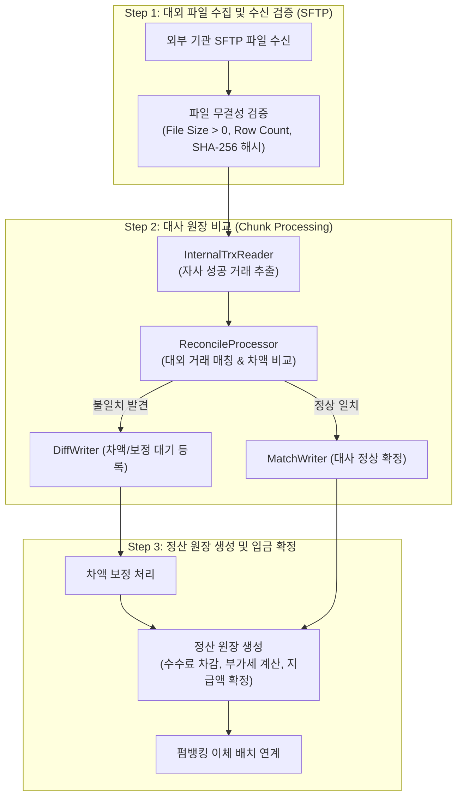

# [Spring Batch] 대용량 비즈니스 거래 대사·정산 배치 아키텍처와 장애 복구 패턴

> [!NOTE]
> 수백만 건의 결제/금융 거래 원장과 외부 금융기관(은행, VAN, 카드사) 간의 불일치를 검증하는 **거래 대사(Reconciliation)** 및 **정산 원장(Settlement)** 배치 파이프라인의 엔터프라이즈 설계 패턴을 다룹니다.
> 청크 지향 처리(Chunk-oriented Processing), 커서 vs 페이징 리더의 선택, 결함 허용(Skip/Retry) 및 멱등성 보장 전략을 학습합니다.

> [!WARNING] 버전 주의
> 아래 `TransactionReconcileJobConfig` 예제는 **Spring Batch 4.x (Spring Boot 2.x)** 기준 코드입니다. `JobBuilderFactory`와 `StepBuilderFactory`를 필드로 주입받아 `.get("jobName")` 형태로 Job/Step을 생성하는 방식을 사용하는데, 이 두 클래스는 **Spring Batch 5.0(Spring Boot 3.x)에서 완전히 제거**되었습니다.
> Spring Batch 5.x에서는 `JobRepository`와 `PlatformTransactionManager`를 직접 주입받아 `new JobBuilder("jobName", jobRepository)...`, `new StepBuilder("stepName", jobRepository)...`처럼 빌더를 직접 생성하는 방식으로 바뀌었습니다. 따라서 이 코드를 Spring Boot 3.x + Spring Batch 5.x 프로젝트에 그대로 옮기면 `JobBuilderFactory`/`StepBuilderFactory` 타입 자체를 찾을 수 없어 컴파일 에러가 발생합니다.

---

## 1. 금융 대사·정산 배치의 핵심 비즈니스 흐름

결제 시스템은 자사 원장과 대외 기관의 원장이 100% 일치해야 합니다. 통신 유실, 타임아웃, 시스템 장애로 인해 발생하는 미결 거래를 정밀하게 맞춰내는 과정을 **대사(Reconciliation)**라고 합니다.



---

## 2. 대용량 처리를 위한 Chunk 기반 아키텍처

Spring Batch의 핵심 철학은 **"대량의 데이터를 한 번에 메모리에 올리지 않고, Chunk 단위로 트랜잭션을 쪼개어 처리한다"**는 것입니다.

```java
@Configuration
@RequiredArgsConstructor
public class TransactionReconcileJobConfig {

    private final JobBuilderFactory jobBuilderFactory;
    private final StepBuilderFactory stepBuilderFactory;
    private final SqlSessionFactory sqlSessionFactory;

    private static final int CHUNK_SIZE = 1000;

    @Bean
    public Job reconcileJob() {
        return jobBuilderFactory.get("reconcileJob")
                .incrementer(new RunIdIncrementer())
                .start(sftpDownloadStep())
                .next(reconcileChunkStep())
                .next(settlementStep())
                .build();
    }

    @Bean
    public Step reconcileChunkStep() {
        return stepBuilderFactory.get("reconcileChunkStep")
                .<InternalTrxDto, ReconcileResultDto>chunk(CHUNK_SIZE)
                .reader(reconcileItemReader(null))
                .processor(reconcileItemProcessor())
                .writer(reconcileItemWriter())
                // 결함 허용 (Fault Tolerance) 설정
                .faultTolerant()
                .skip(DataFormatException.class)
                .skipLimit(100)
                .retry(DeadlockLoserDataAccessException.class)
                .retryLimit(3)
                .listener(new CustomSkipListener())
                .build();
    }
}
```

---

## 3. Reader 선택: Cursor vs Paging

대용량 데이터를 DB에서 읽어올 때 `CursorItemReader`와 `PagingItemReader`의 동작 특성을 명확히 이해해야 합니다.

| 비교 항목 | **CursorItemReader (MyBatisCursorItemReader)** | **PagingItemReader (MyBatisPagingItemReader)** |
| :--- | :--- | :--- |
| **커넥션 유지** | 배치 스텝이 끝날 때까지 단일 DB 커넥션을 열어둠 | 매 페이지를 읽을 때마다 커넥션을 획득하고 반납 |
| **조회 성능** | 서버 커서 스트리밍 방식으로 **속도가 가장 빠름** | `LIMIT / OFFSET` 방식으로 뒷 페이지로 갈수록 느려짐 |
| **주의점 & 함정** | Socket Timeout, 커넥션 풀 고갈, **트랜잭션 타임아웃** 위험 | 배치 도중 타 트랜잭션의 CUD에 의해 데이터 누락/중복 가능 |
| **추천 상황** | 정적 스냅샷 테이블 읽기, 초고속 대량 처리 | 다른 작업과 동시 실행되는 트랜잭션, 분산 파티셔닝 |

> [!WARNING]
> **Cursor 방식 사용 시 MySQL JDBC 주의점:**
> MySQL 드라이버에서 커서 스트리밍을 정상 동작시키려면 `useCursorFetch=true` 옵션과 함께 fetchSize(예: `fetchSize = 1000`)를 명시해야 합니다. 그렇지 않으면 전체 100만 건을 JVM 메모리에 한 번에 적재하여 OOM이 발생합니다.

---

## 4. 결함 허용(Fault Tolerance)과 멱등성(Idempotency) 보장

### 4.1 Skip & Retry 패턴
- **`skip`**: 특정 단건 레코드의 포맷 오류나 데이터 정합성 결함이 있더라도 전체 100만 건 배치를 중단시키지 않고, 오류 레코드만 별도 예외 테이블(`TB_RECONCILE_FAIL_LOG`)에 적재한 뒤 다음 레코드로 진행합니다.
- **`retry`**: 데드락(Deadlock)이나 일시적인 네트워크 순단 발생 시 지정된 횟수만큼 재시도하여 간헐적 장애를 자가 치유합니다.

### 4.2 멱등성 설계 (배치 재실행 안전성)
배치가 70% 진행되다가 서버 정전이나 OOM으로 죽었을 때, 배치를 재실행해도 데이터가 이중으로 정산되거나 금액이 중복 출금되면 안 됩니다.

1. **상태 기반 멱등 업데이트**:
   - `UPDATE TB_TRANSACTION SET reconcile_status = 'DONE' WHERE trx_id = #{id} AND reconcile_status = 'READY'` (영향받은 row 수 검증)
2. **복합 고유키(Unique Key) 제약**:
   - 정산 원장 테이블(`TB_SETTLEMENT`)에 `UNIQUE KEY (partner_id, settlement_date, cycle)`를 걸어 재실행 시 무조건 중복 키 에러(`DuplicateKeyException`)를 유발하고 멱등성을 지킵니다.

## 관련 문서

- [(BATCH) 커서 방식의 주의점 - 핵심 개념 및 특징 정리](./[Spring%20Batch]%20BATCH%20커서%20방식의%20주의점%20-%20핵심%20개념%20및%20특징%20정리.md) — 3절 Reader 선택(Cursor vs Paging)에서 다루는 동일한 선택 기준을 요약한 자매 노트
- [(Design) 전원 장애(정전) 대응 설계 원칙 - Atomic Save-Transaction-Recovery 정리](./[Design]%20전원%20장애(정전)%20대응%20설계%20원칙%20-%20Atomic%20Save-Transaction-Recovery%20정리.md) — 4.2절 배치 재실행 멱등성 설계가 따르는 "시작 시 Recovery" 등 정전/비정상 종료 대응 범용 원칙
- [Stateless 서비스 + Connection 값객체 패턴 - 핵심 개념 및 특징 정리](../네트워크·보안/[SFTP]%20Stateless%20서비스%20+%20Connection%20값객체%20패턴%20-%20핵심%20개념%20및%20특징%20정리.md) — 1절 대외 파일 수집 단계(SFTP 파일 수신)에서 쓰이는 무상태 서비스 + 값객체 연결 관리 패턴